Kisanduku cha barua pepe ni kipengele muhimu cha shughuli zako mtandaoni na mara nyingi huwa na jukumu muhimu katika usalama wa kompyuta yako. Iwapo mshambuliaji ataweza kuvuruga kisanduku chako cha barua pepe, atapata kwa urahisi ufikiaji wa akaunti zako nyingine kupitia kipengele cha "*umesahau nywila*". Hii inaweza kumwezesha kudhibiti mitandao yako ya kijamii, akaunti zako za benki, na huduma nyingine mtandaoni, kwa sababu leo hii, anwani ya barua pepe mara nyingi hutumika kama kitambulisho pekee cha utambulisho wako mtandaoni. Kwa hivyo, kuhakikisha usalama wa kisanduku chako cha barua pepe ni muhimu sana ili kujilinda dhidi ya mashambulizi.

Ili kuhakikisha usalama wa barua pepe yako, ni muhimu kufuata mbinu rahisi na bora ambazo tunazijadili katika somo hili linalowalenga wanaoanza kutumia kompyuta. Pia ni muhimu kuchagua mtoa huduma wa barua pepe mwenye chaguo za ulinzi wa hali ya juu na sera imara ya faragha. Ndiyo maana ninapendekeza katika mafunzo haya utambue ProtonMail. Hata kama hupendelei kutumia huduma hii, mbinu bora zilizotolewa hapa zinaweza kutumika katika kisanduku chochote cha barua pepe ili kuongeza usalama wake.

## Kwa nini utumie ProtonMail?

ProtonMail ni suluhisho salama la ujumbe wa barua pepe kutokana na sifa kadhaa. Kwanza, ProtonMail huhakikisha usimbaji fiche kutoka mwisho hadi mwisho (end-to-end encryption) wa barua pepe zako, ambayo ina maana kuwa ni mtumaji na mpokeaji tu wanaoweza kusoma yaliyomo. Kimsingi, hata ProtonMail haiwezi kufikia barua pepe za watumiaji wake. Usimbaji huu hufanyika kiotomatiki bila kuhitaji ujuzi maalum wa kiufundi kutoka kwa mtumiaji.

Zaidi ya hayo, ProtonMail hujumuisha teknolojia za hali ya juu kulinda faragha yako, ikiwemo kuzuia mifumo ya ufuatiliaji na kuficha anwani yako ya IP. Kwa kuwa kampuni ya Proton iko nchini Uswizi, inanufaika na baadhi ya sheria bora za kulinda data ambazo hazipatikani katika nchi nyingine. Aidha, ProtonMail ni chanzo huria (open-source), hivyo wataalamu huru wanaweza kukagua msimbo wa programu hiyo kwa uhuru.

Mfumo wa biashara wa Proton unategemea usajili wa kulipia, jambo linalotia moyo kwani linaonyesha kuwa kampuni inafadhiliwa bila kulazimika kutumia data za watumiaji wake. Katika somo hili, tutaangazia jinsi ya kutumia toleo la bure la ProtonMail, ingawa kuna viwango tofauti vya usajili vinavyotoa huduma zaidi. Mfumo huu wa usajili ni bora zaidi kuliko ule wa bure kabisa, ambao unaweza kuibua wasiwasi kuhusu matumizi ya data binafsi kwa faida. Kwa bahati nzuri, hili halionekani kuwa tatizo kwa ProtonMail.

## Kuunda akaunti ya Proton

Tembelea tovuti rasmi ya Proton: https://proton.me/

Bonyeza kitufe cha "*Create an account*":  
Una chaguo la kuchagua mipango tofauti kulingana na mahitaji yako. Kwa kuanza, unaweza kuchagua akaunti ya bure, ambayo itakuwezesha kujaribu huduma za msingi za ProtonMail. Baadaye, ukitaka kupata vipengele vya ziada na programu zingine za Proton kama Calendar, VPN, au Password Manager, unaweza kufikiria kujisajili kwa mpango wa kulipia.

Utaelekezwa kwenye ukurasa wa kuunda akaunti.

Unaweza kuchagua jina la domain unalopendelea kwa anwani yako ya barua pepe kwa kubofya mshale mdogo. Chaguo hili halitaathiri hatua zinazofuata.

Pia chagua jina la mtumiaji kwa anwani yako ya barua pepe.

Utaombwa kuweka nenosiri. Ni muhimu kuchagua nenosiri thabiti katika hatua hii, kwani ndilo litakalotumika kufikia kisanduku chako cha barua pepe. Nenosiri thabiti linapaswa kuwa refu kadri inavyowezekana, lenye mchanganyiko mpana wa herufi ndogo na kubwa, nambari, na alama, na lichaguliwe kwa njia ya nasibu. Mwaka 2024, mapendekezo ya chini kabisa kwa nenosiri salama ni angalau herufi 13, lakini ninapendekeza lenye angalau herufi 20 kwa usalama wa muda mrefu.

Kutumia meneja wa nywila (password manager) ni mbinu bora. Hukuwezesha kuhifadhi nywila zako kwa usalama bila kuzikumbuka na pia hukusaidia kutengeneza nywila ndefu na zisizotabirika. Wanadamu si wazuri kuunda nywila za nasibu, na nywila isiyo ya nasibu ya kutosha inaweza kushambuliwa kwa kutumia brute force. Ninapendekeza usome pia somo letu kamili kuhusu jinsi ya kusanidi meneja wa nywila hapa:

https://planb.network/tutorials/computer-security/authentication/bitwarden-0532f569-fb00-4fad-acba-2fcb1bf05de9

Bonyeza kitufe cha "*Create Account*".

Tatuatisha CAPTCHA.

Chagua jina la kuonyeshwa. Hili ndilo jina litakaloonekana kwa mpokeaji wa barua zako. Chagua jina lako halisi au jina la utani.

Proton pia inakupa chaguo la kuweka njia ya kurejesha akaunti yako, ama kwa kutumia nambari ya simu au barua pepe mbadala. Ni muhimu kuelewa kuwa chaguo hili linaweza kuongeza uso wa shambulio kwa kisanduku chako. Kwa upande wako ni njia ya ziada ya kiusalama, lakini kwa mdukuzi, ni njia nyingine ya kujaribu kuingia. Hauhitajiki kuchagua njia hii ya kurejesha, lakini ukikataa, hakikisha umehifadhi nenosiri lako mahali salama. Bila hilo, ukilisahau, huwezi kurejesha akaunti yako.

## Kusanidi Kisanduku chako cha Proton Mail

Hongera, sasa umeunda kisanduku chako cha Proton Mail! Anza kwa kuchagua rangi ya mandhari ya kisanduku chako.

Ikiwa unataka, unaweza pia kuweka usafirishaji wa barua zako kutoka akaunti yako ya zamani ya Gmail hadi akaunti yako mpya ya ProtonMail.

Ukishaingia kwenye kiolesura cha kisanduku chako cha barua, ninakushauri kuchunguza mipangilio ili kubinafsisha. Bonyeza alama ya gia upande wa juu kulia.

Kisha bonyeza kitufe cha "*All settings*".

Katika kichupo cha "*Dashboard*", utapata taarifa kuhusu akaunti yako. Ukishuka chini, unaweza kuchagua aina ya barua unazotaka kupokea kutoka kwa Proton. Ikiwa hutaki kupokea taarifa au matangazo, unaweza kuondoa alama zote.

Katika kichupo cha "*Upgrade plan*", unaweza kuchagua mpango wa kulipia wenye vipengele vipya.

Katika kichupo cha "*Recovery*", unaweza kuongeza au kubadilisha njia zako za kurejesha akaunti.

Katika kichupo cha "*Account and password*", unaweza kubadilisha majina ya watumiaji pamoja na njia za kuimarisha usalama wa akaunti yako.

Kwa sasa, akaunti yako inalindwa tu kwa nywila. Ninapendekeza uongeze ulinzi wa uthibitisho wa hatua mbili (2FA) kwa kutumia programu. Ili kufanya hivyo, bonyeza kisanduku cha tiki.

Thibitisha nenosiri lako.

Kisha changanua msimbo wa QR kwa kutumia programu yako ya 2FA.

Kwa maelezo zaidi, tafadhali angalia somo letu kuhusu jinsi ya kutumia programu ya 2FA.

Katika kichupo cha "*Language and time*", unaweza kubadilisha lugha ya kiolesura pamoja na eneo la saa.

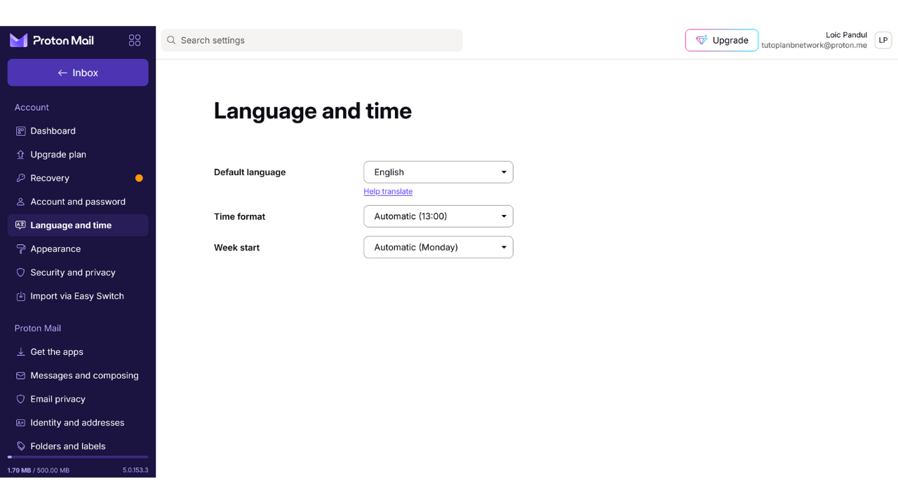

Katika kichupo cha "*Appearance*", unaweza kubadilisha rangi za kiolesura chako.

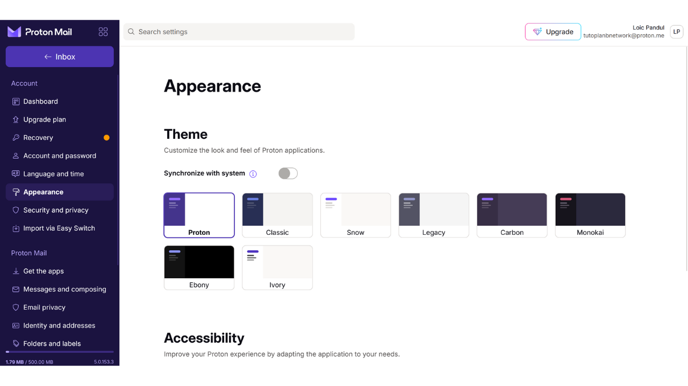

Katika kichupo cha "*Security and privacy*", utapata chaguo mbalimbali za usalama. Baadhi zinapatikana tu kwenye mipango ya kulipia. Unaweza pia kuzima ukusanyaji wa data zako na Proton.

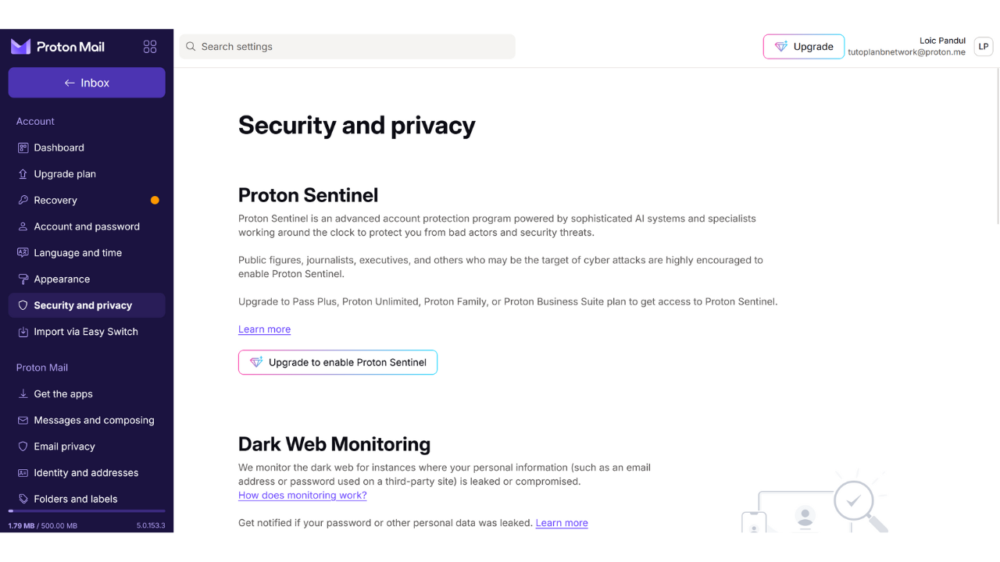

Katika kichupo cha "*Import*", unaweza kuhamisha barua zako za zamani hadi kwenye akaunti yako mpya ya ProtonMail.

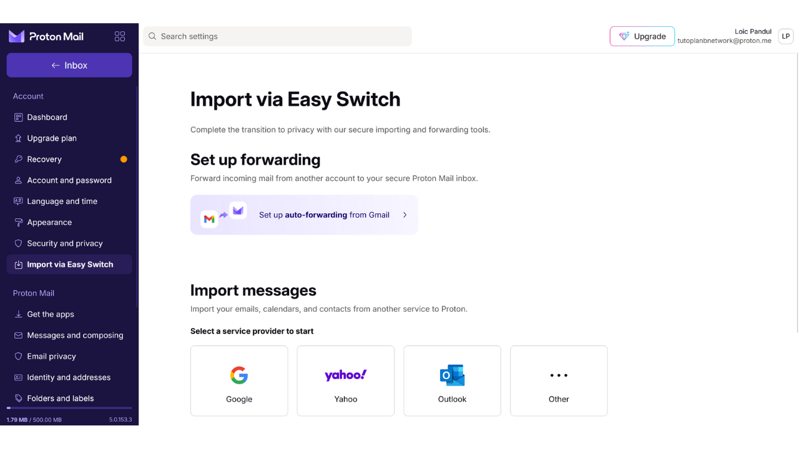

Kichupo cha "*Get the apps*" kinakuruhusu kupakua programu za simu na kompyuta za Proton.

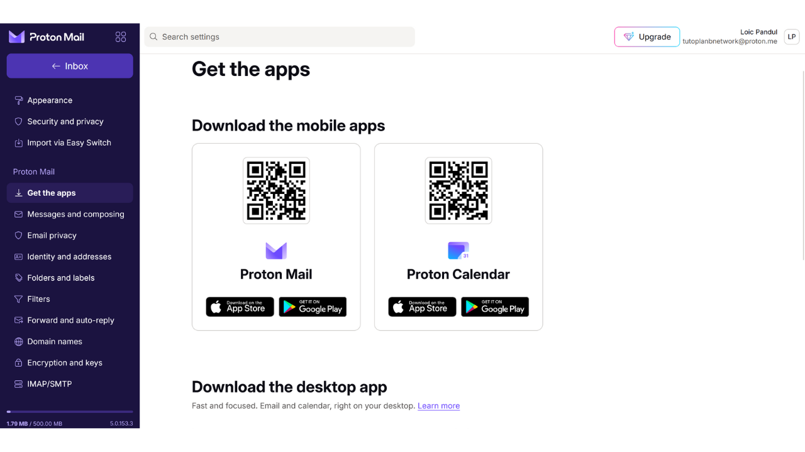

Katika kichupo cha "*Messages and composing*", kuna chaguzi nyingi za kubinafsisha uandishi wa barua pepe zako.

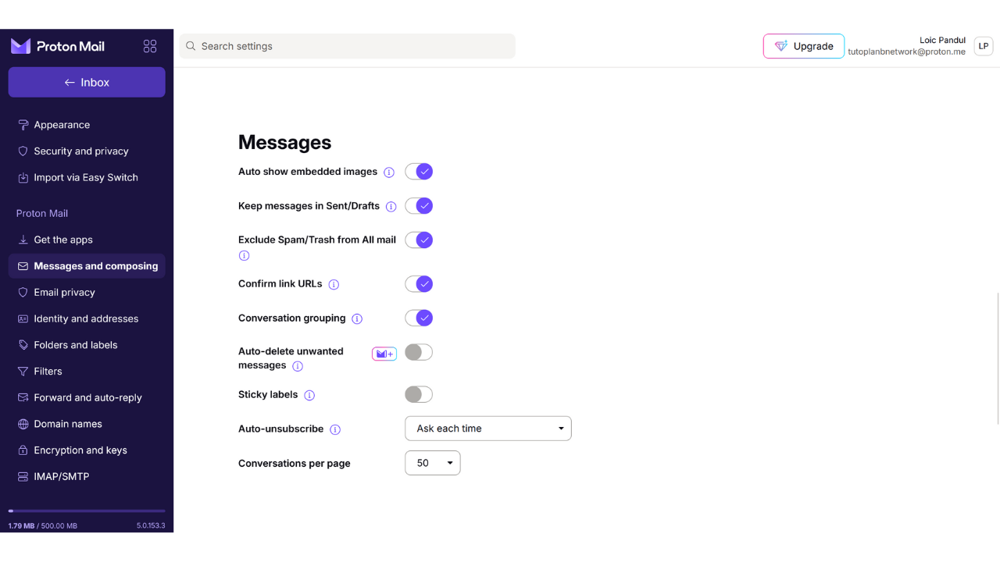

Katika kichupo cha "*Email privacy*", unaweza kuchagua mipangilio ya faragha ya barua zako.

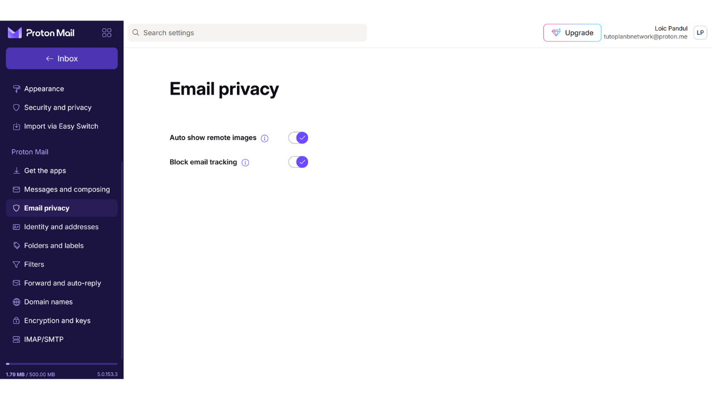

Katika kichupo cha "*Identity and addresses*", unaweza kuweka sahihi ya barua pepe. Watumiaji wa kulipia wanaweza kuunda anwani nyingi.

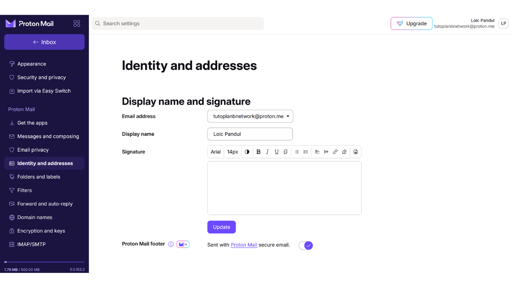

Katika kichupo cha "*Folders and labels*", unaweza kuunda folda na lebo kwa ajili ya kupanga barua zako.

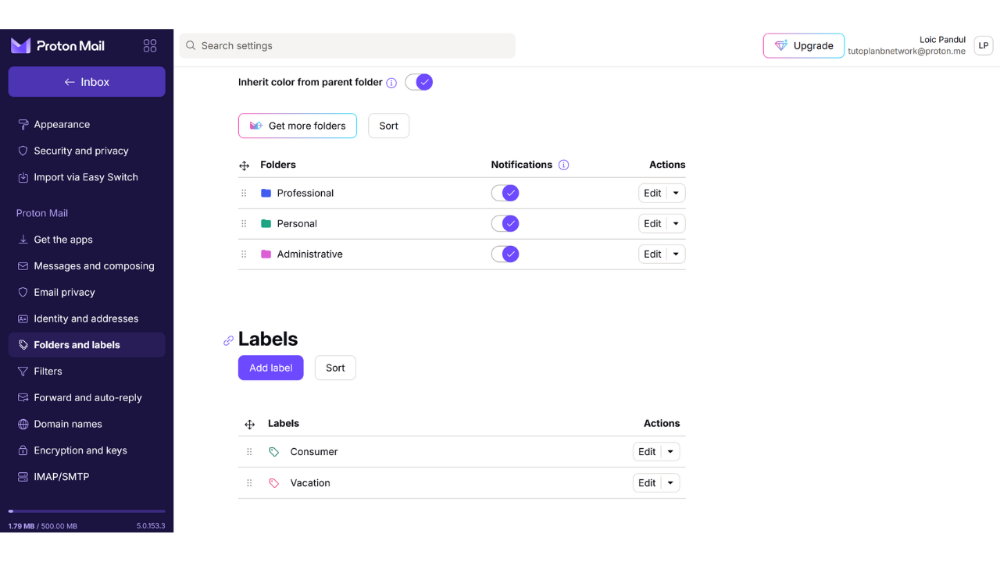

Kichupo cha "*Filters*" kinakuruhusu kudhibiti vichujio vya barua unazopokea.

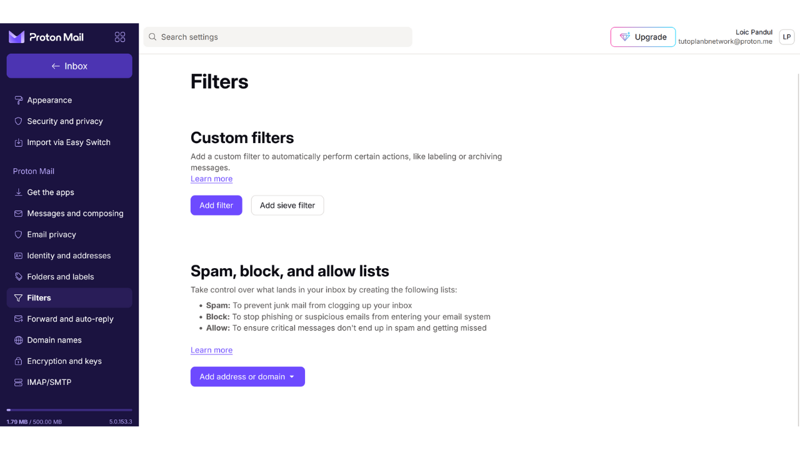

Kichupo cha "*Forward and auto-reply*" kinakuruhusu kuweka usafirishaji na majibu ya moja kwa moja.

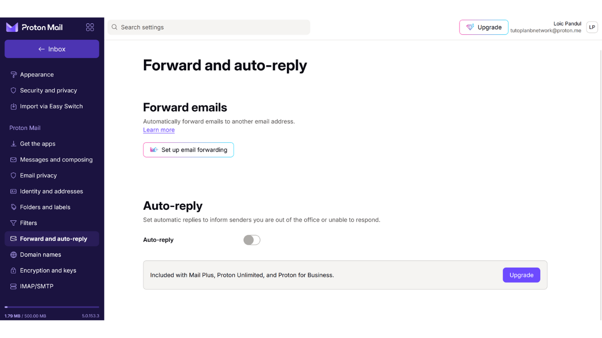

Katika kichupo cha "*Domain names*", unaweza kusanidi anwani ya barua pepe kwa kutumia domain yako binafsi.

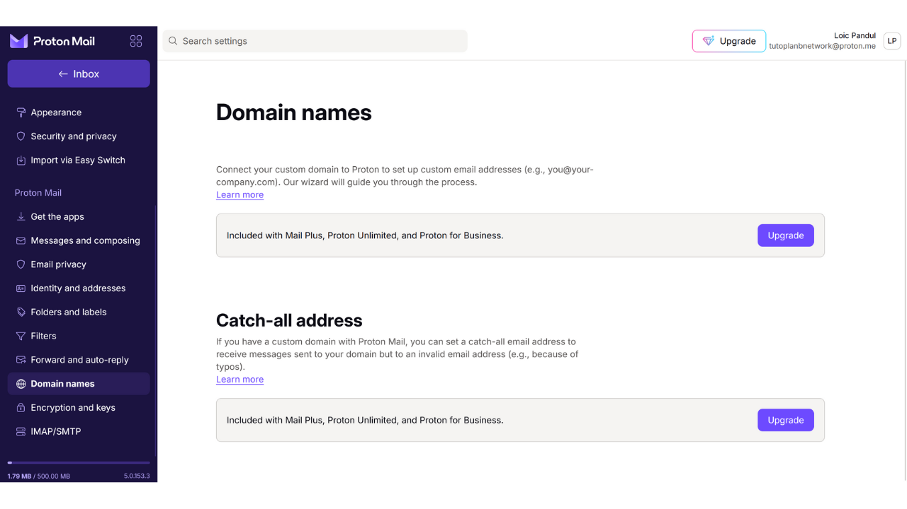

Kichupo cha "*Encryption and keys*" kinakuruhusu kudhibiti chaguo za usimbaji fiche wa barua zako. Kwa wanaoanza, si lazima kubadilisha chochote hapa.

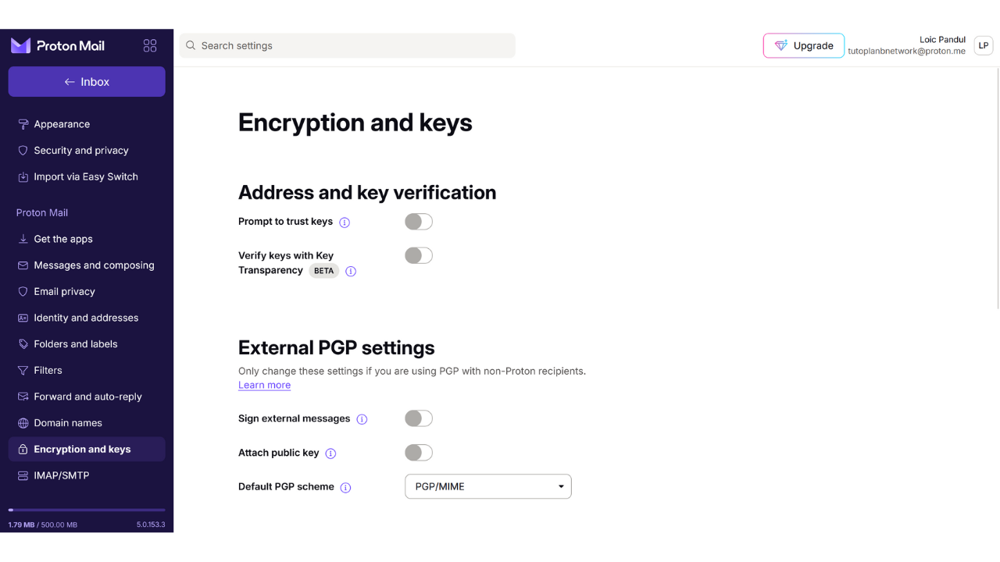

Na mwisho, kichupo cha "*IMAP/SMTP*" kinakuruhusu kutumia ProtonMail kwa kutumia programu kama Outlook au Apple Mail.

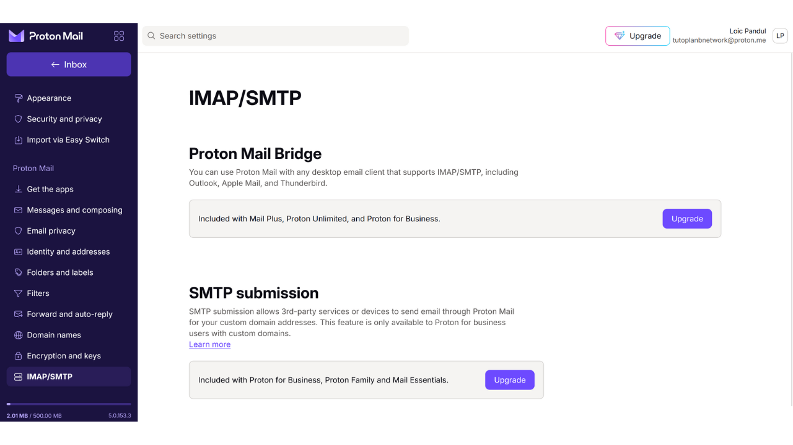

Ili kurudi kwenye ukurasa wa nyumbani wa kisanduku chako, bonyeza kitufe cha "*Inbox*" upande wa juu kushoto.

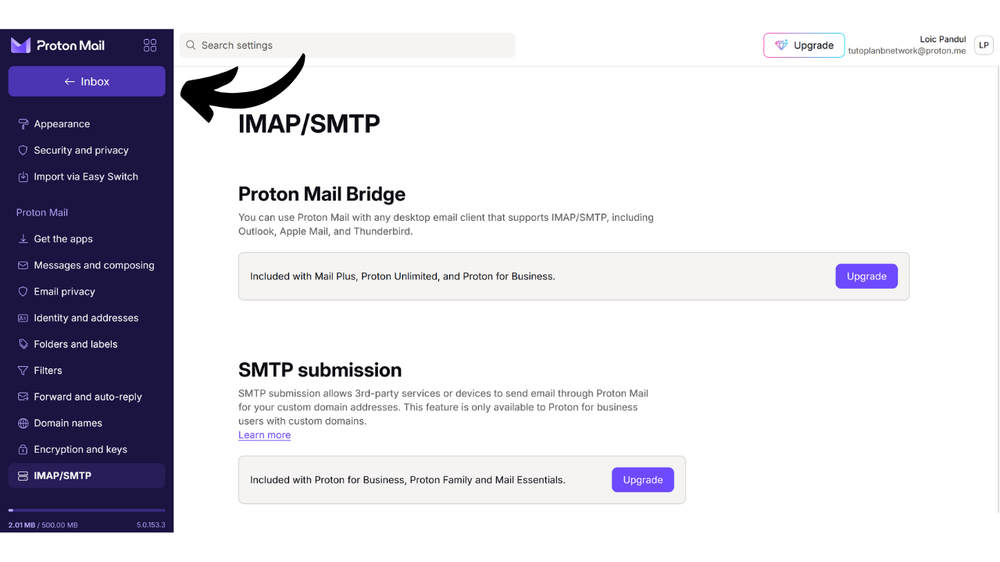

## Kutumia Kisanduku chako cha Proton Mail

Kutuma barua pepe ni rahisi sana, bonyeza kitufe cha "*New Message*" juu kushoto.

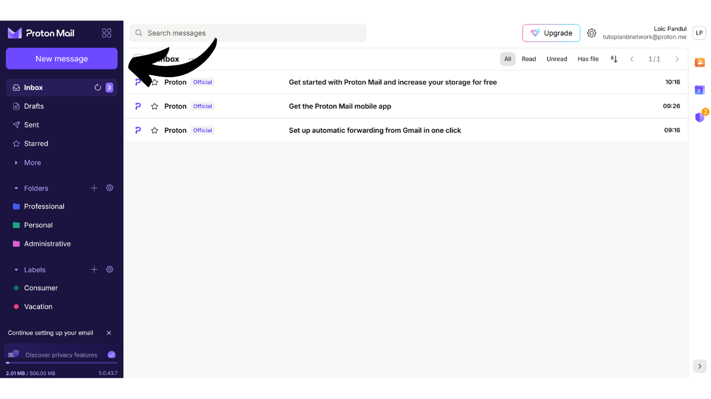

Katika sehemu ya "*To*", andika anwani ya barua pepe ya unayemtumia.

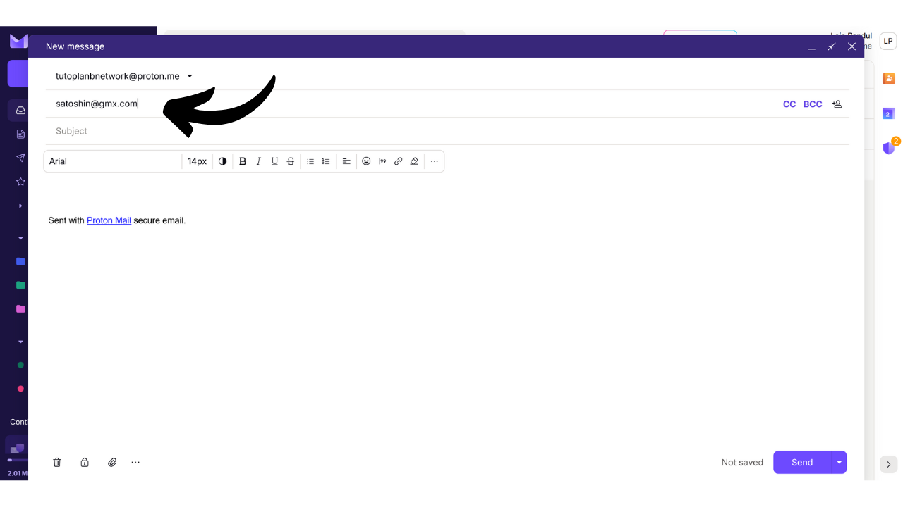

Katika sehemu ya "*Subject*", weka kichwa cha barua.

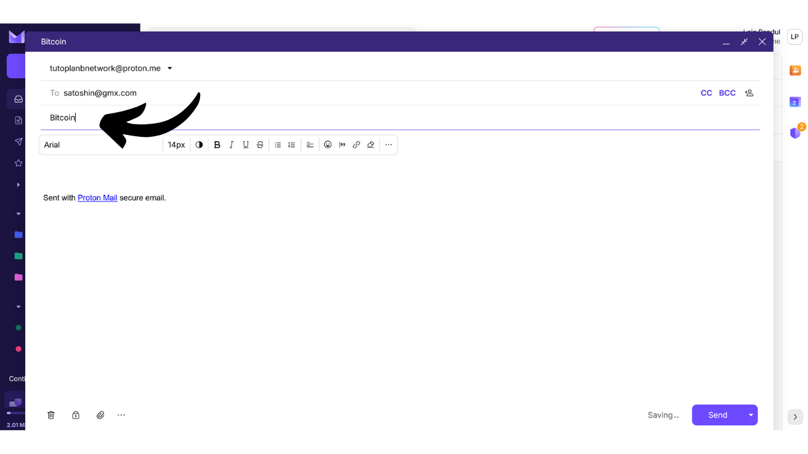

Andika ujumbe wako.

Kisha bonyeza "*Send*" kutuma barua pepe yako.

Unaweza kuzipata barua ulizotuma kwenye kichupo cha "*Sent*".

Kichupo cha "*Inbox*" kinaonyesha barua pepe ulizopokea.

Unaweza kusoma barua zako kwa kubofya juu yake, na kuzipanga kwenye folda ulizotengeneza.

## Kuingia kwenye Kisanduku chako cha Proton Mail

Kama ilivyotajwa awali, unaweza kutumia ProtonMail kupitia toleo la wavuti, programu ya kompyuta, au programu ya simu. Kupakua programu, tembelea: https://proton.me/mail/download

Ikiwa unapendelea kutumia tu toleo la wavuti, weka alama kwenye kivinjari chako ili kuepuka tovuti ghushi (phishing).

Ili kufikia, tembelea: https://account.proton.me/mail

Weka jina la mtumiaji na nenosiri, kisha bonyeza "*Sign in*". Ikiwa umewezeshwa 2FA, utaombwa pia kuingiza nambari 6 kutoka kwenye programu yako ya uthibitisho.

Utarudi kwenye kisanduku chako cha ProtonMail.

