Seedkeeper on nutikaart, mille on välja töötanud Belgia ettevõte Satochip, mis on spetsialiseerunud digitaalsaladuste haldamiseks ja kaitsmiseks mõeldud riistvaralahendustele. Satochip on tuntud oma Bitcoin ökosüsteemi jaoks mõeldud kiipkaartide valiku poolest ja kavandas Seedkeeperi alternatiivina Mnemonic fraaside ja muude digitaalsaladuste säilitamise traditsioonilistele meetoditele.

Konkreetselt võttes on Seedkeeper multifunktsionaalne EAL6-sertifikaadiga kiipkaart, millel on turvaline protsessor ja võltsimiskindel mälu (st *secure element*). Nagu nimigi ütleb, on selle ülesanne salvestada Bitcoin portfoolio mnemoonikaid ja paroole krüpteeritud ja kaitstud viisil. Seedkeeperiga saate generate, importida, korrastada ja salvestada oma saladusi otse kaardi turvalisse komponenti.

Minu arvates on Seedkeeperil kaks peamist kasutusvõimalust, mida uurime 2 eraldi õpetuses:

- Bitcoin** Mnemonic fraaside salvestamine: selle asemel, et kirjutada oma 12 või 24 sõna paberile, saate need kiipkaardile importida ja PIN-koodiga kaitsta.
- Paroolide haldamine**: saate generate tugevat parooli rakenduses Seedkeeper ja salvestada need otse kiipkaardile, mis annab teile mugava ja hõlpsasti kasutatava võrguühenduseta paroolihalduri.

Tehniliselt võttes on Seedkeeperi maht 8192 baiti, mis võimaldab salvestada vähemalt 50 eraldi saladust (täpne arv sõltub nende suurusest ja igaühega seotud metaandmetest). Seedkeeperile saab juurdepääsu kas [arvutiga ühendatud kiipkaardilugeja](https://satochip.io/accessories/) või NFC-ühendusega mobiilirakenduse kaudu. Kogu süsteem töötab võrguühenduseta režiimis, ilma internetiühenduseta, mis tagab piiratud ründepinna.

Eriti huvitav funktsioon on võimalus duplitseerida ühe Seedkeeper'i sisu teise Seedkeeper'i, et luua varukoopia. Selles õpetuses näitame teile, kuidas seda teha.

Selles õpetuses käsitleme ainult SeedKeeperi kasutamist traditsiooniliste paroolide jaoks paroolihalduri moodi. Kui soovite kasutada SeedKeeperit Bitcoin Wallet Mnemonic fraaside salvestamiseks, vaadake seda teist õpetust:

https://planb.network/tutorials/wallet/backup/seedkeeper-906dfff8-1826-4837-92d1-8669e216d356

## 1. Kuidas ma saan seemnepidaja?

Seedkeeper'i saamiseks on kaks peamist võimalust. Saate [osta selle otse Satochipi ametlikust poest](https://satochip.io/product/seedkeeper/) või volitatud edasimüüjalt. Kuid kuna [Seedkeeper on avatud lähtekoodiga](https://github.com/Toporin/Seedkeeper-Applet), on teil ka võimalus see ise [tühjale kiipkaardile](https://satochip.io/product/blank-javacard-for-diy-project/) paigaldada.

Kui soovite kasutada Seedkeeperi varundamisfunktsiooni, peate ilmselt ostma kaks kiipkaarti.

## 2. Seedkeeper-kliendi paigaldamine

Esimene samm on tarkvara installimine arvutisse või nutitelefoni. Arvutis peate [laadige alla Satochip-Utils'i uusim versioon](https://github.com/Toporin/Satochip-Utils/releases). Mobiiltelefonil on Seedkeeper'i rakendus saadaval nii [Google Play Store'is](https://play.google.com/store/apps/details?id=org.satochip.seedkeeper) kui ka [Apple App Store'is](https://apps.apple.com/be/app/seedkeeper/id6502836060).

## 3. Seedkeeper'i initsialiseerimine

Käivitage rakendus ja vajutage nupule "*Click & Scan*".

Teilt küsitakse PIN-koodi teie Seedkeeperile. Kuna tegemist on uue kaardiga, ei ole PIN-koodi veel kindlaks määratud. Selle sammu vahelejätmiseks sisestage ükskõik milline kood ja vajutage seejärel nuppu "*Järgmine*".

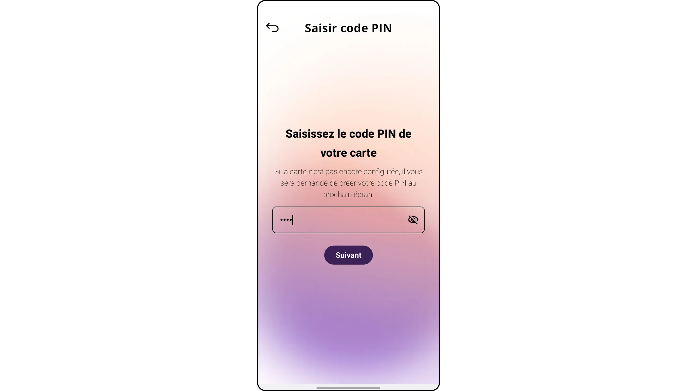

Seejärel asetage kaart nutitelefoni tagaküljele. Rakendus tuvastab, et Seedkeeper ei ole veel initsialiseeritud, ja palub teil määrata oma kiipkaardi PIN-koodi, mis on 4-16 tähemärki pikk. Optimaalse turvalisuse tagamiseks valige tugev PIN-kood, mis on võimalikult pikk, juhuslik ja koosneb paljudest erinevatest märkidest. See PIN-kood on ainus takistus teie salasõnadele füüsilise juurdepääsu vastu.

**Mäleta ka seda PIN-koodi nüüd salvestada**, näiteks paroolihalduris või eraldi füüsilisel andmekandjal. Viimasel juhul ärge kunagi hoidke PIN-koodi sisaldavat andmekandjat samas kohas kui teie Seedkeeper, sest muidu muutub see turvaelement kasutuks. On oluline, et teil oleks usaldusväärne varukoopia: ilma PIN-koodita ei ole teil võimalik taastada oma Seedkeeperisse salvestatud saladusi.

Kinnitage PIN-kood teist korda.

Teie Seedkeeper on nüüd initsialiseeritud. Saate selle avada, sisestades äsja määratud PIN-koodi.

Nüüd jõuate oma kiipkaardi haldamise lehele.

## 4. Salvesta paroolid Seedkeeperisse

Kui teie Seedkeeper on lukustamata, klõpsake nupule "*+*".

Valige "generate salajane*". Valik "*Saladuse importimine*" võimaldab salvestada olemasoleva saladuse (näiteks varem loodud salasõna).

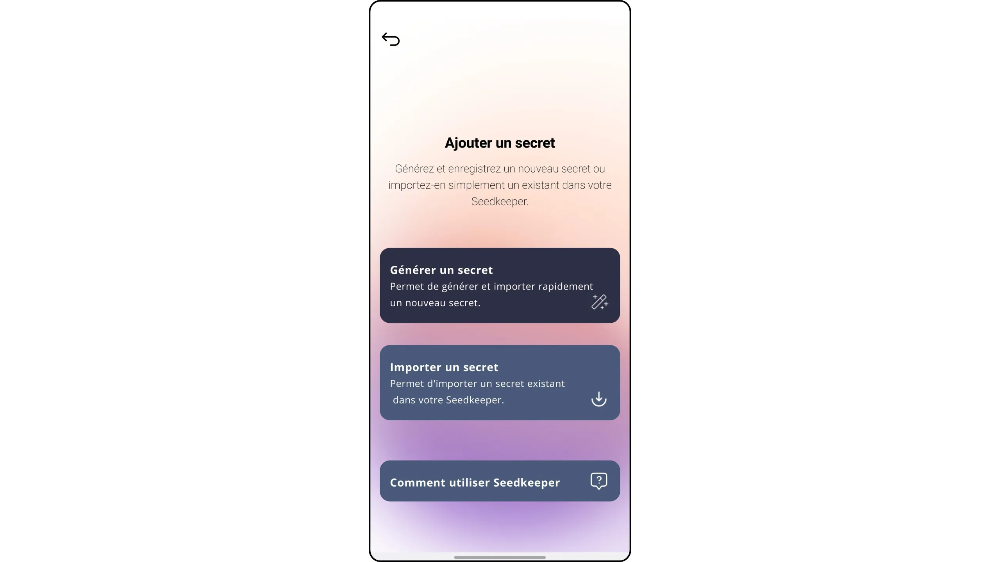

Meie puhul tahame salvestada parooli. Vajutage nupule "*Password*".

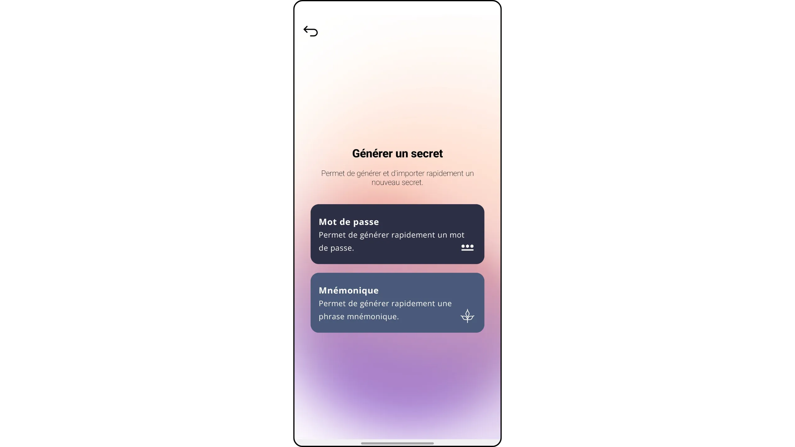

Määrake sellele saladusele "*Silt*", et seda oleks lihtne tuvastada, kui salvestate oma Seedkeeperisse mitu teavet. Samuti saate lisada parooliga seotud kasutajanime ja saidi URL-i.

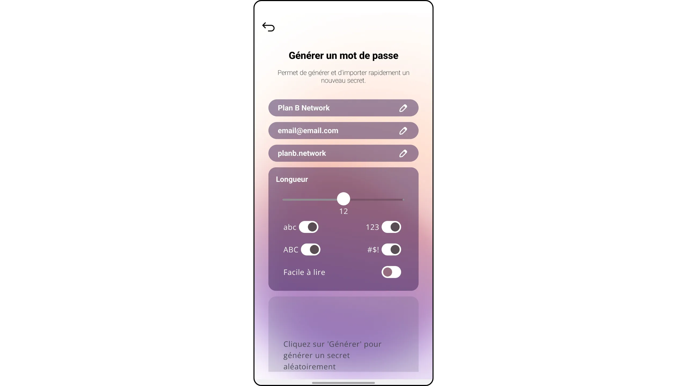

Valige oma parooli pikkus ja parameetrid, seejärel klõpsake "*generate*" ja seejärel "*Import*".

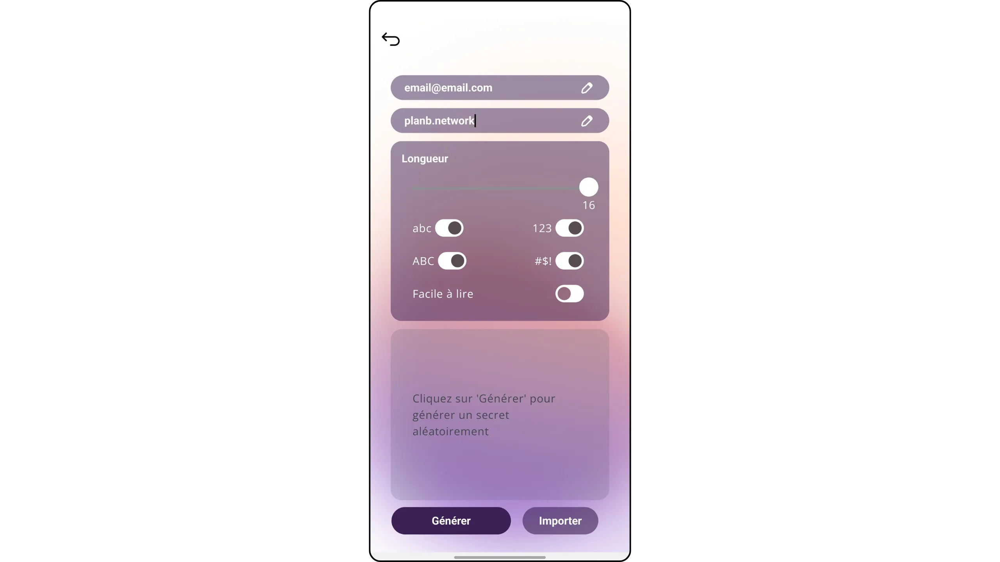

Asetage oma Seedkeeper nutitelefoni tagaküljele.

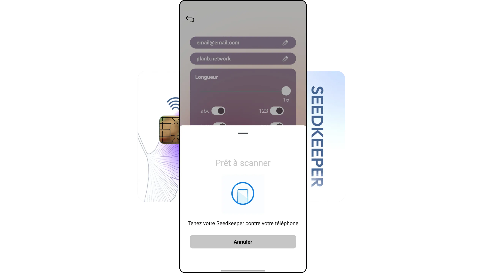

Teie salasõna on registreeritud.

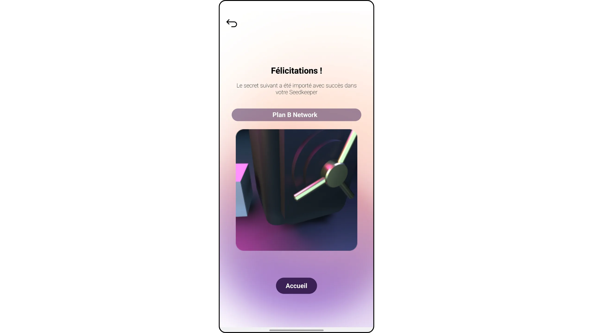

## 5. Juurdepääs oma Seedkeeper paroolile

Kui soovite oma salasõna kontrollida, võtke oma Seedkeeper ja klõpsake nupule "*Click & Scan*".

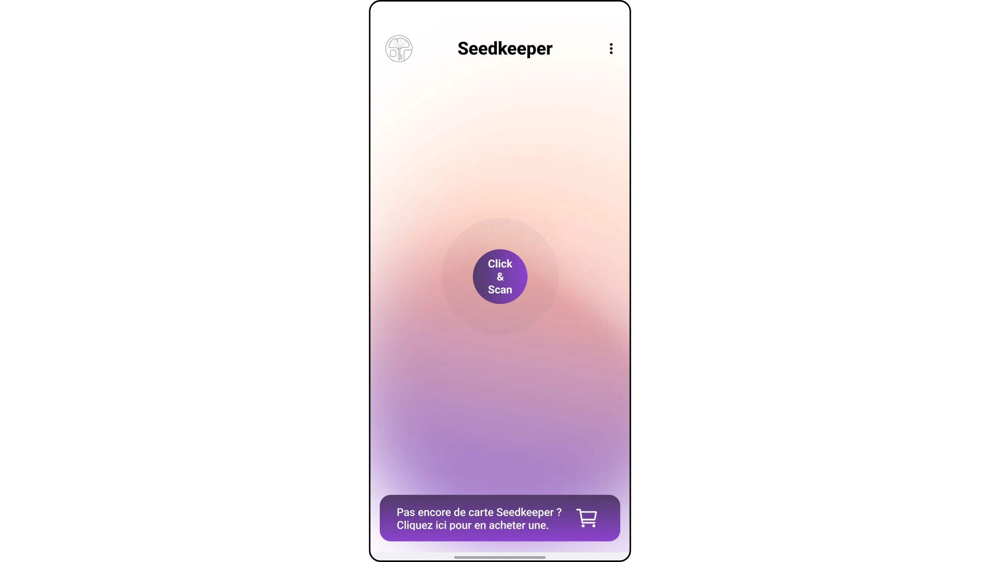

Sisestage oma PIN-kood ja vajutage "*Järgmine*".

Asetage oma Seedkeeper nutitelefoni tagaküljele.

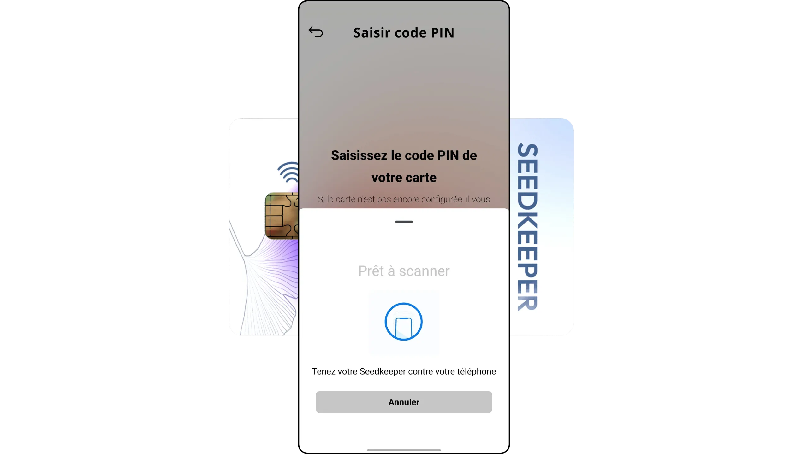

See viib teid kõigi teie registreeritud saladuste nimekirja. Selles näites tahan kuvada oma Plan ₿ Network konto parooli, seega klõpsan sellel.

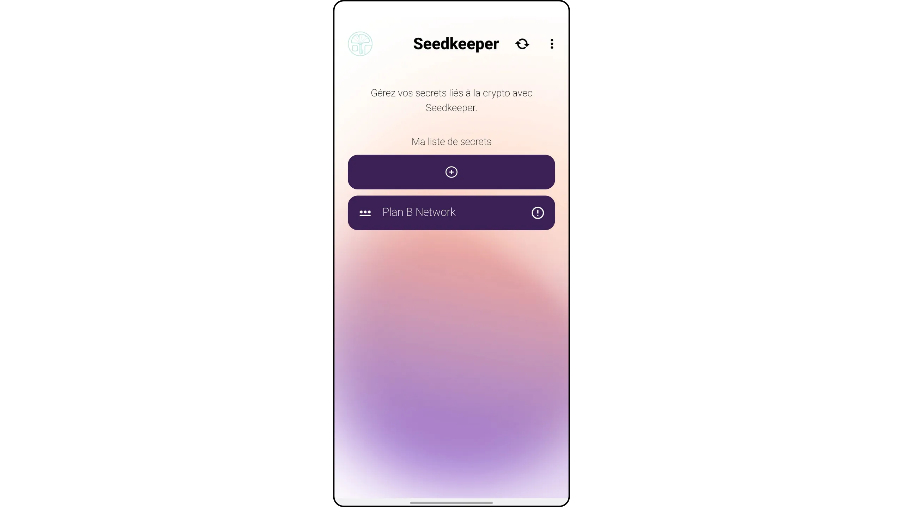

Vajutage nuppu "*Reveal*".

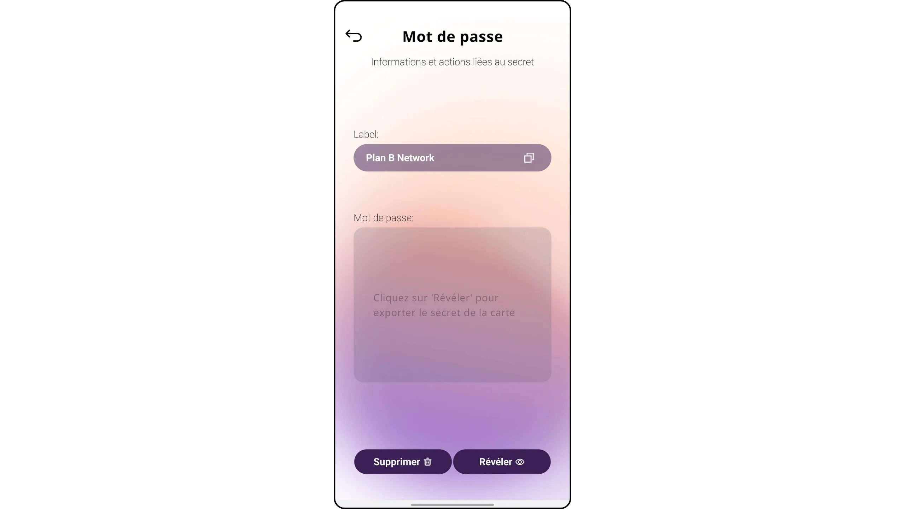

Skaneerige oma Seedkeeper uuesti.

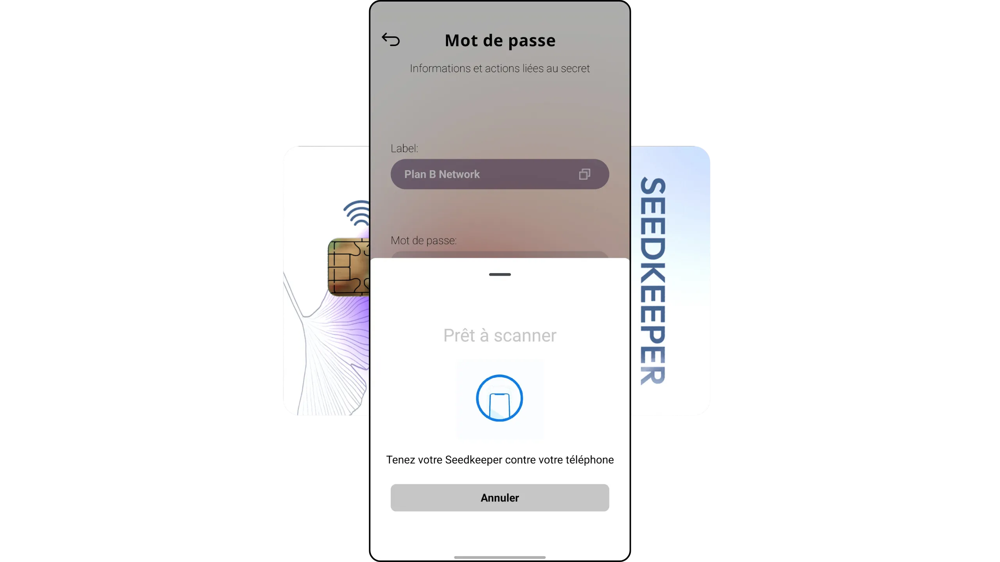

Ekraanile ilmub nüüd teie eelnevalt salvestatud parool. Võite selle kopeerida ja kasutada seda vastaval veebisaidil.

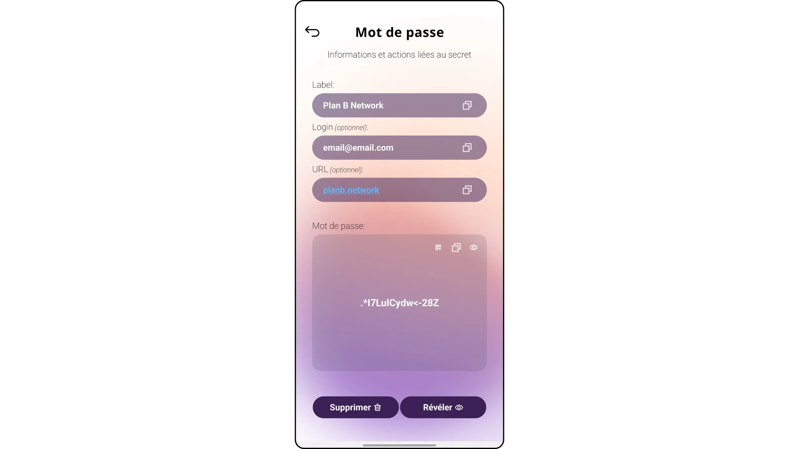

## 6. Seedkeeper'i varundamine

Nüüd teeme oma Seedkeeperist varukoopia teise Seedkeeperisse, nii et meil on kaks koopiat. See redundants võib olla osa strateegiast, et kindlustada oma kõige tähtsamaid paroole: näiteks hoida oma Seedkeeperit kahes erinevas kohas, et piirata füüsilisi riske, või usaldada koopia usaldusväärsele sugulasele.

Selleks võtke kaasa oma teine seemnepidaja (ärge unustage, et üks neist kahest oleks märgistatud, et vältida segadust). Alustage selle initsialiseerimisega, nagu on kirjeldatud selle õpetuse 3. sammus. Valige jällegi tugev PIN-kood. Sõltuvalt teie strateegiast võite valida teise PIN-koodi või jätta sama.

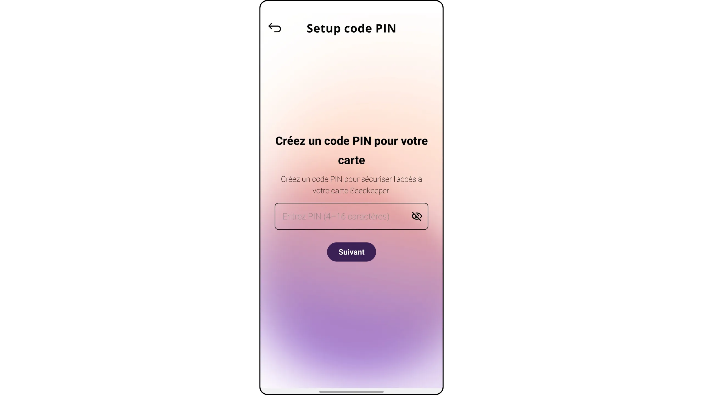

Avage rakendus, klõpsake "*Click & Scan*", sisestage oma Seedkeeper nr 1 (allikas) PIN-kood, seejärel skannige see.

See viib teid avalehele, kus on teie saladuste nimekiri. Klõpsake Interface paremal ülaosas olevatel kolmel väikesel punktil.

Valige "*Taasta varukoopia*", seejärel vajutage "*Start*".

Sisestage oma varukaardi PIN-kood (Seedkeeper nr 2).

Seejärel skaneerige kaart.

Tehke sama ka põhikaardiga (Seedkeeper nr 1), seejärel klõpsake nuppu "*Make a backup*".

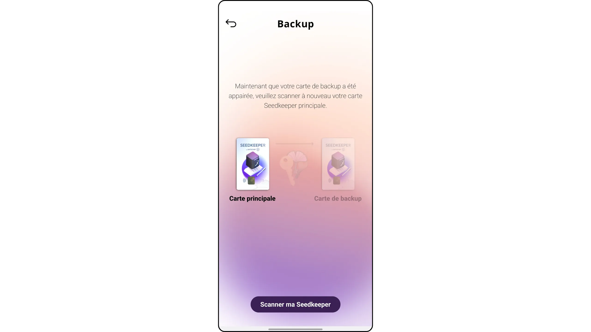

Teie Seedkeeper nr 2 sisaldab nüüd kõiki Seedkeeper nr 1 salvestatud saladusi.

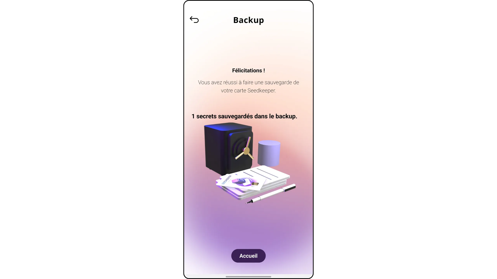

Saate oma Seedkeeper n°2 skaneerida, et kontrollida, kas saladused on kopeeritud.

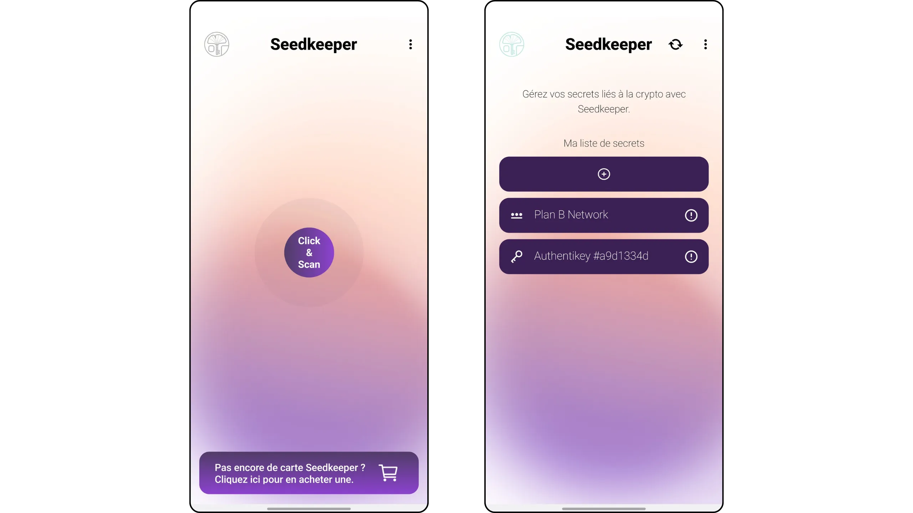

See on kõik, mis vaja! Nüüd teate, kuidas kasutada Seedkeeper'i oma paroolide salvestamiseks. Järgmises õpetuses vaatame, kuidas kasutada Seedkeeperit Bitcoin portfelli varundamiseks. Samuti kutsun teid üles avastama selle kombineeritud kasutamist koos SeedSigneriga :

https://planb.network/tutorials/wallet/hardware/seedkeeper-seedsigner-45cca4c4-1f22-46bb-87ae-9cddb68aa579

https://planb.network/tutorials/wallet/backup/seedkeeper-906dfff8-1826-4837-92d1-8669e216d356