## Login = email = loss of privacy

In the digital world, it has become standard practice to have an account for every platform one wishes to access.
Each of these services requires a login, usually associated with the _username_ and _password_ pair. Often, the username is the user's personal email.

Using one's personal email address for every login, it's easy to imagine the first consequence: loss of confidentiality, which becomes absolute if the address is made up of _name.surname@serviceemail.com_.

Open source developers have created a series of application suites, born precisely to give users back a bit of privacy: yes to login, but with an alias instead of the tool that reveals private identity.

The simplest, among those I have personally tried and am still testing, is [Simple Login](https://simplelogin.io/).

## Alias

An email alias does nothing but replace _name.surname_ of one's email address with a fictitious name. Nothing changes for the user, as the alias service will forward emails to and from the address normally used. Everyone will continue to use their email box as usual but, on the other side - instead of revealing name and surname - it will appear as an unrecognizable user. Such service must be efficient and Simple Login, so far, is.

When visiting the Simple Login site for the first time, one must create an account (here too!), using the "official" email address. Here, one must enter the email, a password, and solve a captcha.

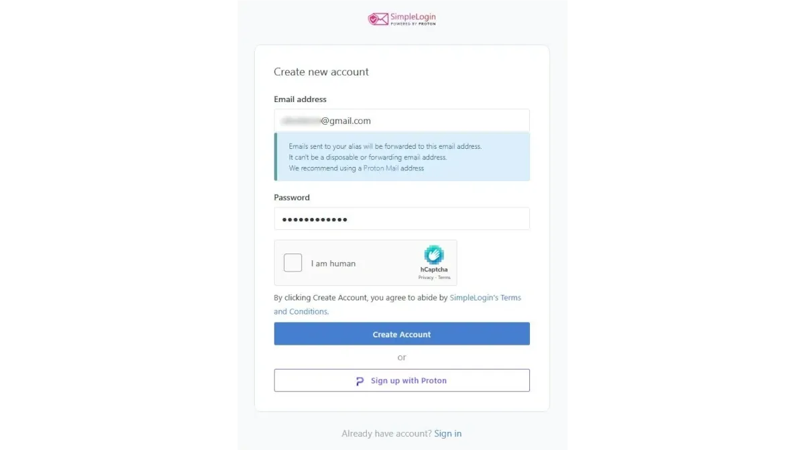

Simple Login sends a verification message to the indicated email address. Instead of clicking the verification button, it is advisable to copy the link and paste it into the address bar

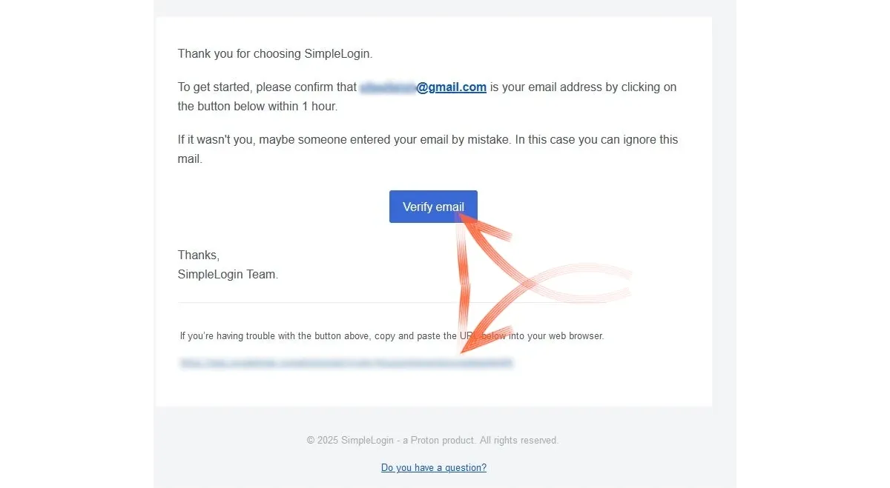

The Simple Login dashboard opens immediately, with a brief tutorial for navigation.

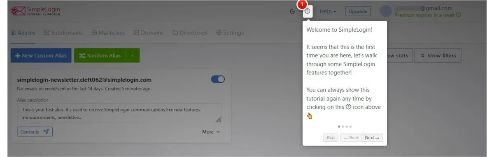

It can be noted that Simple Login has automatically activated the subscription to the newsletter, which can be deactivated from the appropriate command

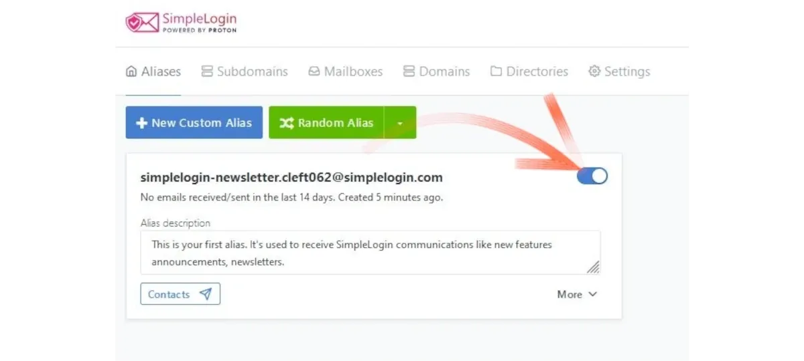

## Settings
Right away, we can take a look at the _Settings_ to discover the features of the service. Simple Login starts with all options active, including the _Premium_ ones, which remain usable for 10 days. It is found that, once the trial period is over, you will have the possibility to create 10 aliases with this profile and that you can directly link your Proton email, as Simple Login has been acquired by the Swiss email provider.
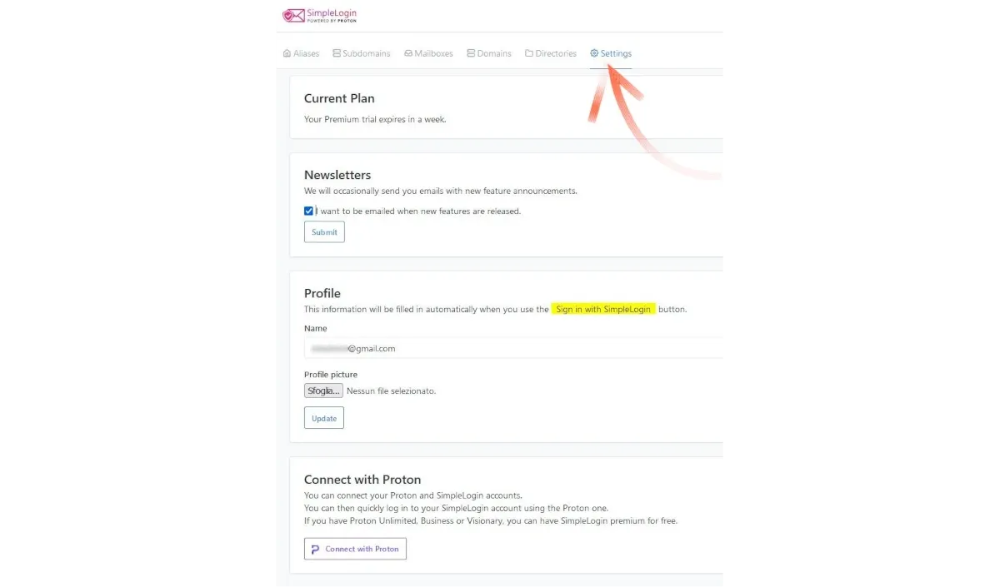

You can set a series of parameters, or check if your email has already been compromised in terms of privacy.

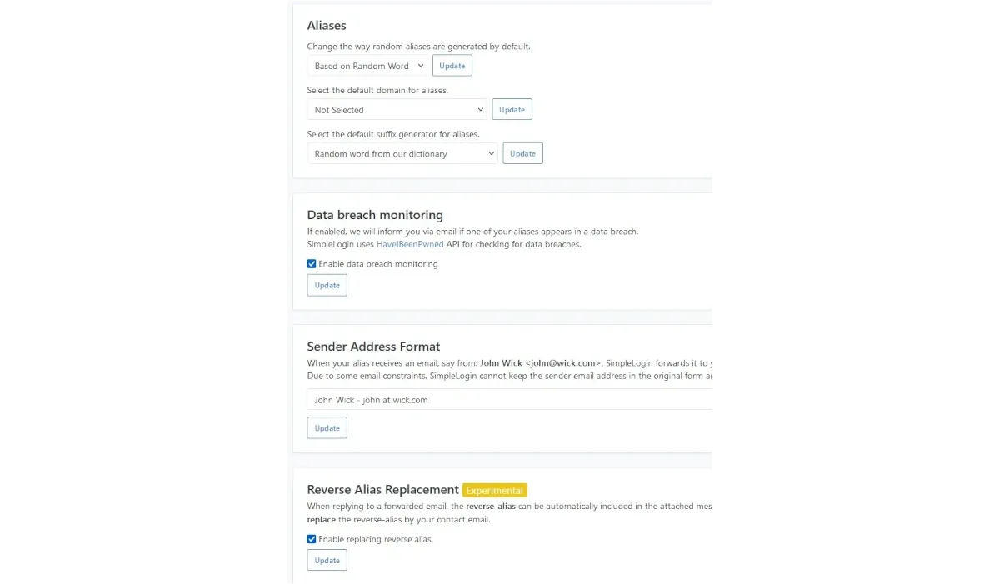

Finally, you can export a backup of your profile, or import one from another provider.

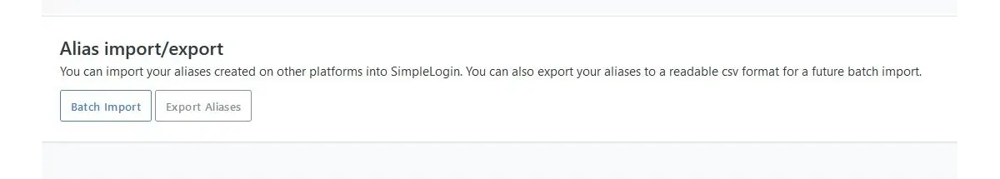

### Work Email

Those who use email with a personal domain, intended as work email, can set up their private domain.

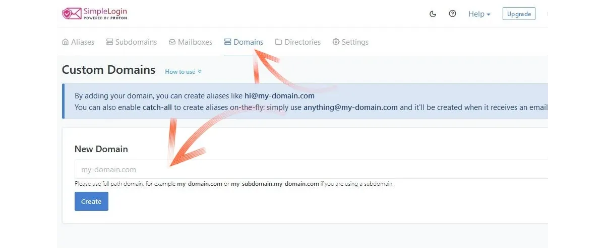

From the main panel, by choosing _Mailboxes_, it is even possible to add other email addresses and, also with these, use the aliases that will be created. In this tutorial, for example, I decided to create the profile with a _gmail.com_ mailbox, and then associate a _proton.me_ address.

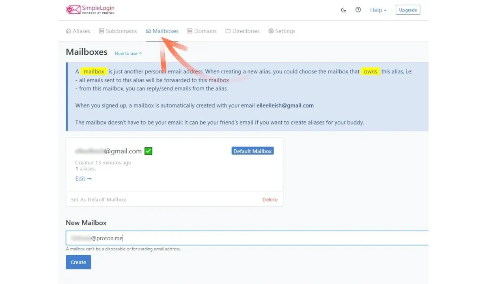

Adding a new address, especially if it belongs to the Proton provider, the guided procedure shows the possibility to enter _sudo_ mode, super user. Simple Login will ask to enter the password of this mailbox, to prove legitimate ownership.

⚠️ **I personally advise against doing this**. ⚠️

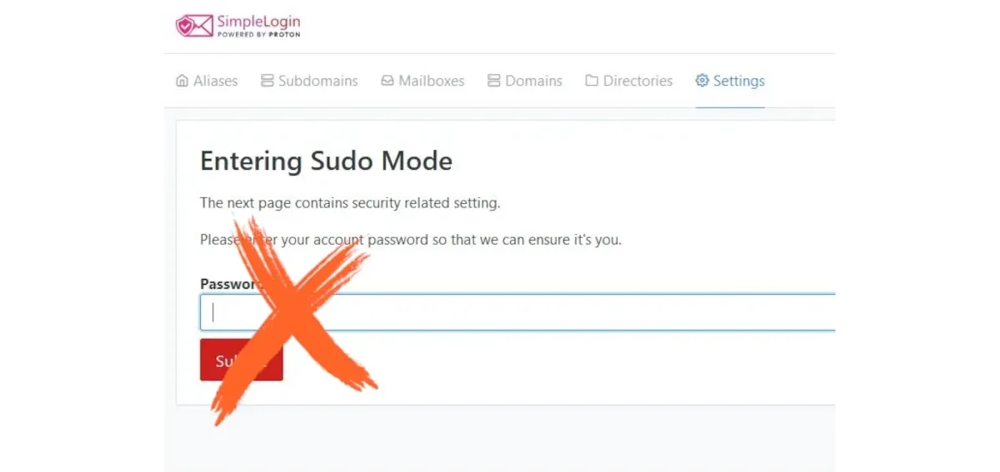

**It's better to access the email box -> copy the link for verification and paste it in the URL bar -> and obtain the verification without revealing the password.**

Of the two addresses entered, one becomes the default and the other is a secondary, but they can easily be switched, and the setting is easily identifiable in the dashboard.

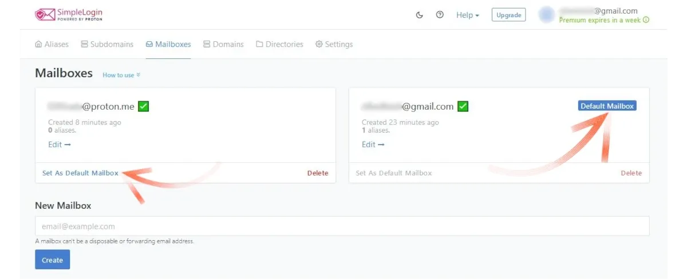

After adding a second email address (optional), let's see what we can do with Simple Login.

## Creation of aliases

In the panel, the first menu available is precisely named _Alias_, and this is where they are created. You can have them generated randomly, by choosing _Random Alias_, the green button seen in the next photo. This creates a very suggestive email address.

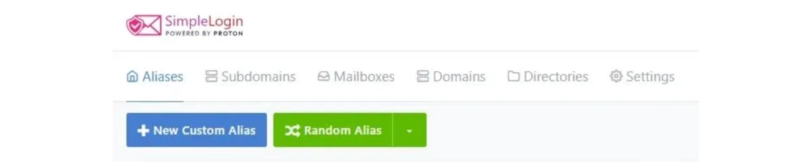
If, however, one wishes to give a name to recognize and differentiate services, one must choose _New Custom Alias_. By doing so, one can give the alias the name of the service one wants to access (social media, service providers, online events, strangers met by chance, etc.). The rest is handled by Simple Login.
For fun (but not really, to tell the truth) I decided to create an alias for the bank and called it `BANK`. Even though it's true that my bank knows everything about me, I find it amusing to communicate with them using an email address that is incomprehensible to them. Simple Login indeed generates a random name, which is separated from the one we choose by a `.`

Here, the new email address can become:
- bank.breeding123@aleeas.com
- bank.platter456@slmails.com
- bank.preoccupy789@8shield.net
- and so on

One can choose more than one domain: public ones are available for the free plan, while others, indicated as private (including _@simplelogin.com_), expand the choice for users who decide to subscribe to a paid plan.

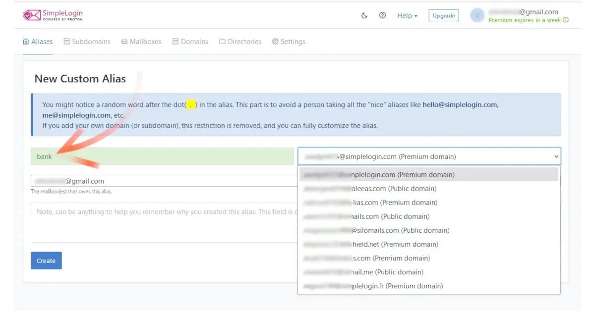

Once the random suffix and domain have been chosen, one can set whether this new (and bizarre) address should serve as an alias for just one of the personal email boxes, or for all. The alias is ready and active by choosing _Create_

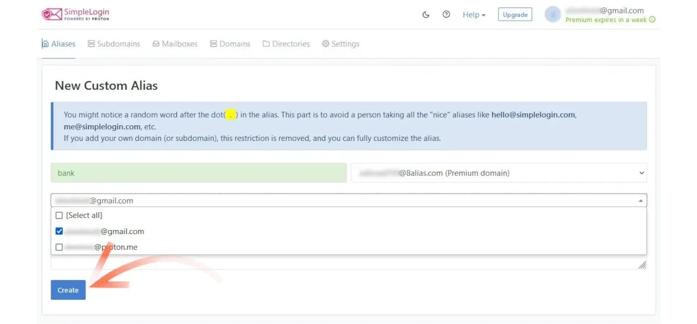

The new email address is created and is visible, ready to be sent (to the bank!) simply by copying it.

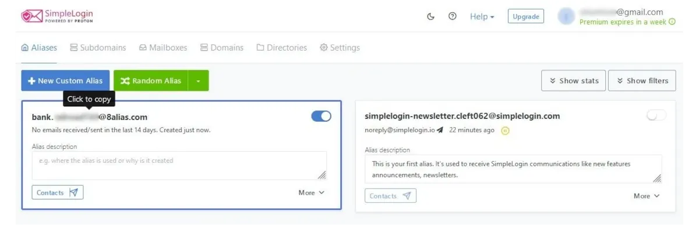

At this point, one can focus on creating an alias for every service or platform one wants to access and where email is required as an essential parameter for creating an account.

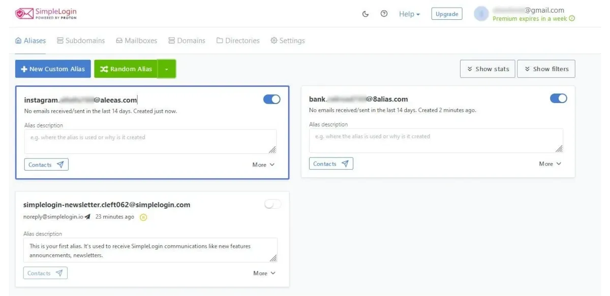

For privacy enthusiasts, it is also possible to give rise to an email address based not on a readable name, but on the UUID protocol, which creates a unique 128-bit identifier and whose creation is not controlled by centralized parties. This option, convenient for some sensitive accounts, is available in the _Random Alias_ Menu.

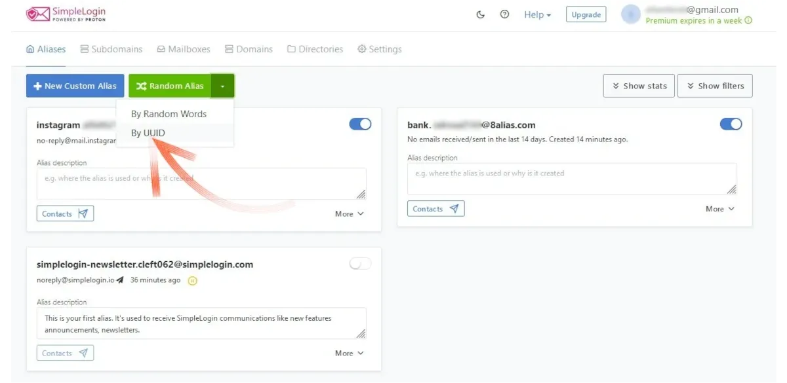
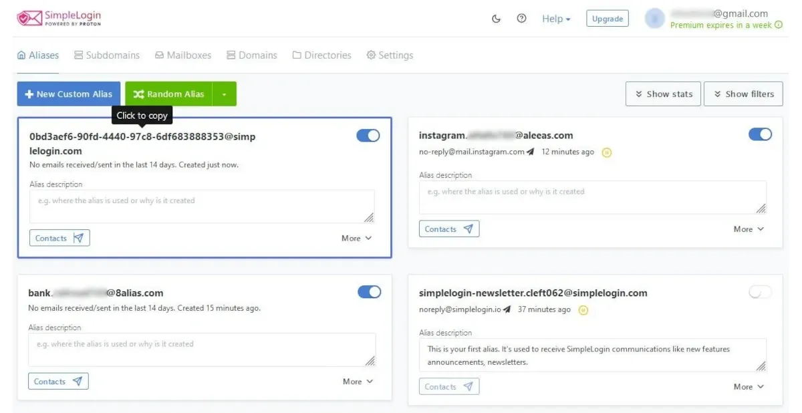

As can be seen, it is an email address that one must then know how to manage.
If one changes their mind and no longer wants to use an alias, just click on the _More_ command of each individual alias and choose _Delete_.

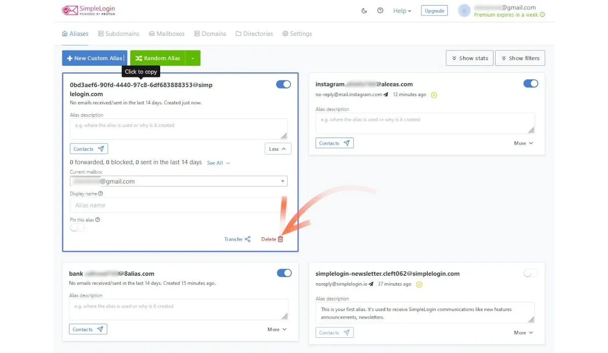

## Alias Management
Creating aliases is simple, as is their management, which only requires a bit of care and discipline. All traffic, in fact, will still pass through the email inbox that we have defined, at the beginning, as the official one. Notifications and important communications from platforms will continue to arrive on Gmail, Proton, or whatever the email provider is.

The result, however, is that we have preserved the main address which, from the moment of the creation of the aliases, we are free to decide whom to reveal it to and whom not to.

An alias works both for receiving and sending: another user will indeed receive the reply from alias.preoccupy789@8shield.net, if this is the pseudonym chosen for that particular recipient.

## Pros

In general, the use of aliases helps to protect identity and privacy. The email address is indeed captured by data brokers and visited websites, to track habits and behaviors of users. With an alias, no one becomes untraceable, but its systematic use is a small step in the right direction. Not only that! In the "global digital village," where hacking, data selling, or security breaches are commonplace, it's very likely that the email used to register on any website has already been compromised, if not directly targeted.

A unique pseudonym, used for every login, **immediately allows us to understand which platform sends spam (or worse) to our mailbox, because the email is identified by the alias associated with it**. You have no idea how much spam and phishing come from so-called reliable channels, because they are institutional, until you start using an alias for banks, one for postal services, or a specific one for some mandatory government services. Once the sender of the spam (or worse) is identified, you will know that site has been compromised, taking every precaution to protect all the data provided (think about credit cards!) to that specific website, which may realize the breach weeks later.

Regarding Simple Login, this tool has:

- mobile app (also from F-Droid) and browser extension, to manage aliases in any situation;
- two-factor authentication for each new pseudonym, which increases the degree of independence from the service itself;
- PGP support (for _Premium users);
- simple creation of every type of alias (custom, random, and UUID);
- among the free plans in the sector, the ability to use aliases with more "official" email boxes. Other competitors limit to just one.

## Cons
- 10 aliases might not be enough if you plan to use Simple Login extensively. In this case, the paid plan, which is quite affordable, is useful to increase the number of possible aliases available.
- It is not possible to create an alias with a specific name and domain. The random suffix, added after a name chosen by us, generates an address that can be described as bizarre at best. Traditional social media usually refuse to grant accounts created with this type of email addresses. Nostr fixes this!
- If you use an alias to send a message to someone, it's easy to end up in the recipient's spam folder. As a first step, it's advisable to use the pseudonym for receiving, just as in the case of creating an account, subscribing to a mailing list, etc.