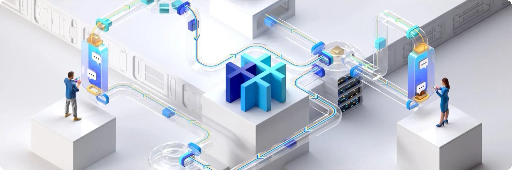

Lancée en 2021, SimpleX est une application de messagerie instantanée libre et radicalement différente dans son approche de la confidentialité. Contrairement WhatsApp, Signal et d'autres services de messagerie centralisés, SimpleX se démarque par sa gestion des utilisateurs : il n’existe aucun identifiant utilisateur, ni pseudonyme, ni numéro, ni clé publique visible. Cette absence totale d’identifiants rend la corrélation entre les utilisateurs pratiquement impossible, ce qui garantit une très bonne protection de votre vie privée.

Contrairement à la plupart des applications qui imposent un compte ou un numéro de téléphone, SimpleX permet d’initier des conversations en partageant un lien ou un QR code éphémère. Chaque lien permet la création d’un canal chiffré unique, et les contacts ne peuvent pas retrouver ou recontacter l’émetteur sans échange explicite. Les messages sont chiffrés de bout en bout et transitent par des serveurs relais qui les suppriment après expédition, lesquels ne voient ni l’expéditeur, ni le destinataire, ni leurs clés.

L’architecture réseau est entièrement décentralisée et non fédérée : les serveurs ne se connaissent pas entre eux, ne conservent pas de répertoire global, et n’hébergent aucun profil utilisateur. Mieux encore, chaque utilisateur peut déployer et utiliser son propre serveur relais tout en restant interopérable avec ceux du réseau public. Pour une confidentialité renforcée, SimpleX peut être utilisé avec Tor, afin de masquer également l’adresse IP.

SimpleX est entièrement open-source (clients, protocoles et serveurs), disponible sur Android, iOS, Linux, Windows et macOS. Son stockage local est chiffré et portable, ce qui permet de transférer un profil d’un appareil à un autre sans dépendre d’un serveur centralisé.

SimpleX intègre toutes les fonctionnalités classiques des applications de messagerie. Toutefois, son ergonomie reste à ce jour moins fluide que celle de WhatsApp ou Signal. Son utilisation peut également s’avérer plus contraignante, en particulier pour l’ajout de contacts. Il s’agit donc selon moi d’une alternative pertinente à WhatsApp ou Signal pour les utilisateurs qui placent la confidentialité au cœur de leurs priorités, et qui sont prêts, pour cela, à faire quelques concessions sur le confort d’usage au quotidien.

| Application          | E2EE 1:1       | E2EE groupes   | Inscription anonyme | Licence client open-source | Licence serveur open-source | Serveur décentralisé | Année de création |
| -------------------- | -------------- | -------------- | ------------------- | -------------------------- | --------------------------- | -------------------- | ----------------- |
| WhatsApp             | ✅              | ✅              | ❌                   | ❌                          | ❌                           | ❌                    | 2009              |
| WeChat               | ❌              | ❌              | ❌                   | ❌                          | ❌                           | ❌                    | 2011              |
| Facebook Messenger   | ✅              | 🟡 (optionnel) | ❌                   | ❌                          | ❌                           | ❌                    | 2011              |
| Telegram             | 🟡 (optionnel) | ❌              | 🟡                  | ✅                          | ❌                           | ❌                    | 2013              |
| LINE                 | ✅              | ✅              | ❌                   | ❌                          | ❌                           | ❌                    | 2011              |
| Signal               | ✅              | ✅              | ❌                   | ✅                          | ✅                           | ❌                    | 2014              |
| Threema              | ✅              | ✅              | ✅                   | ✅                          | ❌                           | ❌                    | 2012              |
| Element (Matrix)     | ✅              | ✅              | ✅                   | ✅                          | ✅                           | 🟡 (fédéré)          | 2016              |
| Delta Chat           | ✅              | ✅              | ✅                   | ✅                          | N/A                         | 🟡 (via email)       | 2017              |
| Conversations (XMPP) | ✅              | ✅              | ✅                   | ✅                          | ✅                           | 🟡 (fédéré)          | 2014              |
| Session              | ✅              | ✅              | ✅                   | ✅                          | ✅                           | ✅                    | 2020              |
| **SimpleX**          | ✅              | ✅              | ✅                   | ✅                          | ✅                           | ✅                    | 2021              |
| Olvid                | **✅**          | **✅**          | **✅**               | **✅**                      | **❌**                       | **❌**                | 2019              |
| Keet                 | ✅              | ✅              | ✅                   | ❌                          | N/A                         | ✅                    | 2022              |
| Jami                 | ✅              | ✅              | ✅                   | ✅                          | N/A                         | ✅                    | 2005              |
| Briar                | ✅              | ✅              | ✅                   | ✅                          | N/A                         | ✅                    | 2018              |
| Tox                  | ✅              | ✅              | ✅                   | ✅                          | N/A                         | ✅                    | 2013              |

*E2EE = Chiffrement de bout en bout.*

