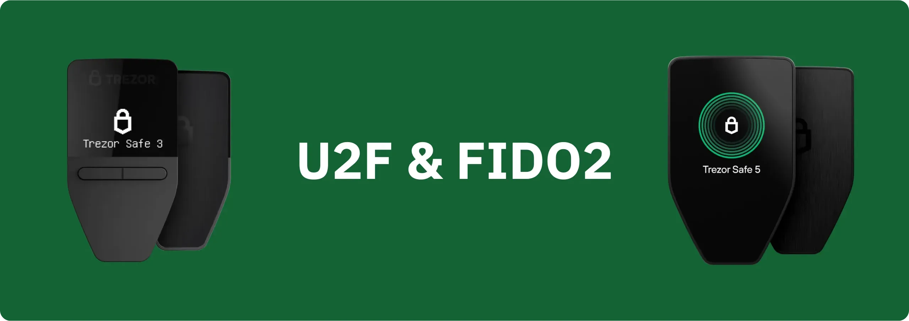

Les dispositifs Trezor sont des hardware wallets initialement conçu pour sécuriser un portefeuille Bitcoin, mais ils disposent également d'options avancées pour réaliser de l'authentification forte sur le web. Grâce à leur compatibilité avec les protocoles **U2F** et **FIDO2**, ils permettent de sécuriser l’accès à vos comptes en ligne sans dépendre uniquement de mots de passe.

Le protocole U2F (_Universal 2nd Factor_) a été introduit par Google et Yubico en 2014, puis standardisé par le FIDO Alliance. Il permet d’ajouter un second facteur d’authentification physique (2FA) lors d’une connexion. Une fois activé, en plus du mot de passe classique, l’utilisateur doit approuver chaque tentative de connexion à son compte en pressant un bouton sur son Trezor. Dans ce contexte, le Trezor fonctionne de manière similaire à une Yubikey.

Cette méthode repose sur la cryptographie asymétrique : aucune donnée secrète n’est transmise, ce qui rend les attaques par hameçonnage ou interception inefficaces. U2F est aujourd’hui pris en charge par de nombreux services en ligne : Google, Proton, GitHub, Dropbox, X, etc.

En plus de U2F qui permet de faire de l'authentification à deux facteurs, les Trezor prennent également en charge FIDO2 (*Fast IDentity Online 2.0*), une évolution de U2F. C'est un protocole d'authentification standardisé à partir de 2018, qui étend la logique d'U2F et vise à remplacer complètement les mots de passe. Il repose sur deux composants : *WebAuthn* (côté navigateur) et *CTAP2* (côté clé physique). FIDO2 permet une authentification dite "passwordless" : l’utilisateur s’identifie uniquement via son dispositif Trezor, qui agit comme un jeton cryptographique unique, sans mot de passe additionnel. Ce protocole est aujourd’hui compatible avec certains services en ligne, en particulier ceux orientés entreprise.

FIDO2 introduit également la notion de credentials résidents, c’est-à-dire des identifiants stockés directement dans le Trezor, qui incluent à la fois la clé privée permettant la connexion et les informations d’identification de l’utilisateur. Ce mécanisme permet une authentification véritablement sans mot de passe : il suffit de brancher son Trezor et de confirmer l’accès, sans saisir ni identifiant ni mot de passe. À l’inverse, les credentials non-résidents, plus classiques, n’enregistrent dans l’appareil que la clé privée ; l’identifiant utilisateur reste stocké côté serveur, et doit donc être saisi à chaque connexion. Nous verrons plus loin comment les sauvegarder avec votre Trezor.

Dans ce tutoriel nous allons découvrir comment activer U2F pour l’authentification à deux facteurs, puis comment configurer FIDO2 pour accéder à vos comptes sans mot de passe, directement avec votre Trezor.

**Remarque :** U2F est compatible avec tous les modèles de Trezor, mais FIDO2 n'est pris en charge que sur les Safe 3, Safe 5, et Model T, et non sur le Model One.

## Utiliser U2F sur un Trezor

## Utiliser FIDO2 sur un Trezor

