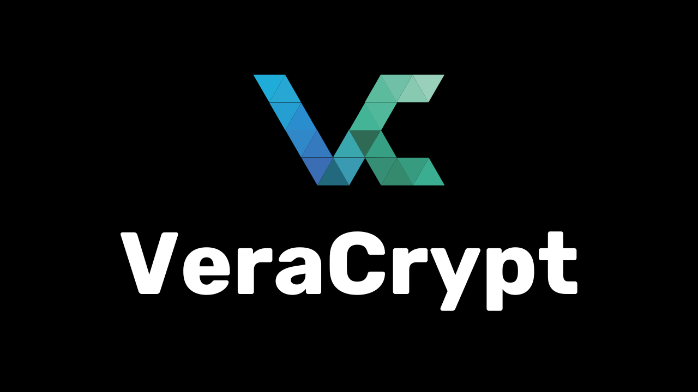
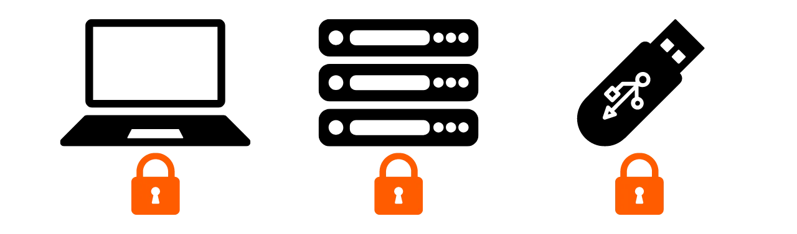
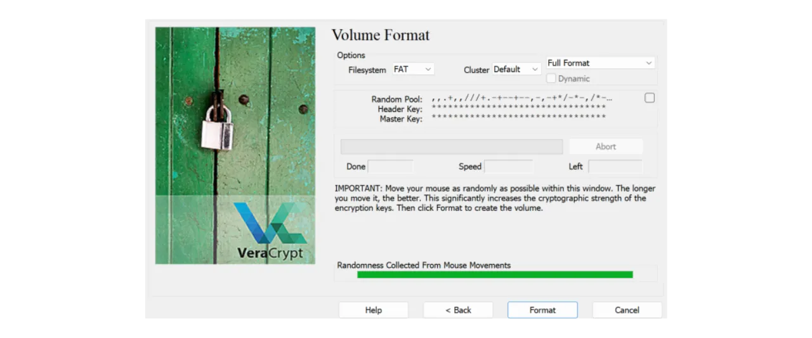

Siku hizi, ni muhimu kuwa na mkakati wa kuhakikisha upatikanaji, usalama, na chelezo ya faili zako—kama vile hati binafsi, picha, au miradi ya maana.

Kupoteza data hizi kunaweza kuwa janga.

Ili kuepuka hali kama hiyo, inashauriwa kuwa na nakala nyingi za faili zako zilizohifadhiwa kwenye njia tofauti.

Mkakati maarufu wa chelezo kwa kompyuta unaitwa “3-2-1” na unalenga kulinda faili zako kwa njia zifuatazo:

- **3** nakala za faili zako,  

- Katika angalau  

- **2** aina tofauti za midia,  

- Na angalau  

- **1** iwe imehifadhiwa nje ya tovuti.

Kwa maneno mengine, unapaswa kuhifadhi faili zako katika maeneo matatu tofauti kwa kutumia njia tofauti za hifadhi—kama vile kompyuta yako, kifaa cha USB, diski ya nje, au huduma ya wingu mtandaoni.

Nakala ya “nje ya tovuti” inamaanisha chelezo hiyo inapaswa kuhifadhiwa mbali na nyumba au ofisi yako.

Hii husaidia kulinda data dhidi ya majanga kama moto au mafuriko.

Nakala hiyo huhakikisha kuwa data yako inabaki salama hata mazingira ya ndani yakiharibika.

Ili kutekeleza mkakati huu wa 3-2-1 kwa urahisi, unaweza kutumia huduma ya hifadhi ya wingu inayosawazisha faili kiotomatiki au kwa vipindi maalum kati ya kompyuta yako na hifadhi ya mtandaoni.

Baadhi ya huduma maarufu ni Google Drive, Microsoft OneDrive, au Apple iCloud.

Hata hivyo, hizi si bora kwa suala la faragha.

Katika somo la awali, ulijifunza kuhusu njia mbadala inayosimba faili zako kwa usalama wa hali ya juu: **Proton Drive**.

> https://planb.network/tutorials/computer-security/data/proton-drive-03cbe49f-6ddc-491f-8786-bc20d98ebb16

Kwa kuhifadhi nakala moja ndani ya nchi na nyingine kwenye wingu, tayari umetumia midia mbili tofauti, huku moja ikiwa nje ya tovuti.

Ili kukamilisha mkakati wa 3-2-1, ongeza nakala ya tatu.

Ninapendekeza kusafirisha mara kwa mara data yako kutoka kwenye kompyuta na wingu hadi kifaa halisi—kama USB au diski ya nje.

Hii ni muhimu kwani, hata seva ya wingu ikiharibika na kompyuta yako ikipata hitilafu kwa wakati mmoja, bado utakuwa na nakala salama.

Ni muhimu pia kuhakikisha usalama wa vifaa vya kuhifadhia data, ili mtu yeyote asiyeidhinishwa asiweze kuifikia.

Kwa kawaida, kompyuta yako hulindwa kwa nenosiri, na diski nyingi za kisasa husimbwa moja kwa moja.

Kwa hifadhi ya mtandaoni, tayari umejifunza kutumia nenosiri dhabiti pamoja na uthibitishaji wa hatua mbili.

Lakini kwa nakala ya tatu kwenye kifaa halisi, usalama wake hutegemea na jinsi mmiliki anavyokilinda.

Kama mtu akiiba USB yako au diski ya nje, anaweza kufikia data zako ikiwa hazijasimbwa.

Ili kuzuia hatari hii, unashauriwa kusimba kifaa halisi kwa kutumia nenosiri.

Bila nenosiri hilo, hakuna anayefikia data zako—hata kama kifaa kimeibiwa.

Katika somo hili, utaona jinsi ya kusimba kifaa chako cha nje kwa kutumia **VeraCrypt**, zana ya open-source ya usimbaji.

## Utangulizi wa VeraCrypt

**VeraCrypt** ni programu huria inayopatikana kwa Windows, macOS, na Linux, inayokuwezesha kusimba data kwa njia mbalimbali.

Programu hii hukuwezesha kuunda na kudumisha majalada yaliyosimbwa kwa njia fiche.

Data husimbwa kiotomatiki kabla ya kuhifadhiwa, na husimbuliwa inapofunguliwa.

Hii huhakikisha usalama hata kifaa kikibiwa.

VeraCrypt haisimbi faili pekee, bali pia husimba majina ya faili, metadata, folda, na hata nafasi wazi kwenye kifaa.

Inaruhusu usimbaji wa:

- Faili maalum  

- Kizigeu kizima  

- Diski ya mfumo  

- Au kifaa cha kuhifadhi kama USB

Faida kuu ya VeraCrypt ni kwamba ni **open-source**, hivyo kila mtu anaweza kukagua msimbo wake na kuthibitisha usalama wake.

---

## Jinsi ya kufunga VeraCrypt?

1. Tembelea [tovuti rasmi ya VeraCrypt](https://www.veracrypt.fr/en/Downloads.html) na bofya kichupo cha **Downloads**.  

2. Pakua toleo linalolingana na mfumo wako.  

3. Chagua lugha ya kiolesura.  

4. Kubali masharti ya leseni.  

5. Bofya **Sakinisha** ili kuanza.  

6. Chagua folda ya kusakinisha.  

7. Subiri hadi usakinishaji ukamilike.  

8. Sasa unaweza kuanza kuitumia.

💡 *Unaweza kusaidia maendeleo ya VeraCrypt kwa kuchangia Bitcoin kupitia tovuti yao.*

---

## Jinsi ya kusimba kifaa cha kuhifadhi kwa kutumia VeraCrypt?

1. Fungua VeraCrypt.  

2. Weka kifaa chako (USB/diski ya nje) kwenye kompyuta.  

3. Bofya **Volumes > Unda Kiasi Kipya...**  

4. Chagua **Simba sehemu isiyo ya mfumo/kiendesha**.  

5. Chagua mojawapo:  

   - **Standard VeraCrypt Volume**  
   - **Hidden VeraCrypt Volume**

   (Chagua Standard kwa mfano huu)

6. Bofya **Chagua Kifaa...**, chagua kifaa chako.

7. Chagua **Unda kiasi kilichosimbwa na uifute diski**.

8. Chagua algorithm ya usimbaji na hash (acha chaguomsingi).  

9. Weka nenosiri la usimbaji—refu, la nasibu, lenye mchanganyiko wa herufi, nambari, na alama.  

10. Tumia kidhibiti cha nenosiri (inashauriwa karatasi kwa kifaa hiki).  

11. Weka nenosiri mara mbili.  

12. Chagua mfumo wa faili (FAT au exFAT).  

13. Generate entropy kwa kusogeza kipanya hadi kipimo kijazwe.  

14. Bofya **Format** kuanza kusimba.  

15. Subiri hadi mchakato ukamilike.

---

## Jinsi ya kutumia kifaa kilichosimbwa?

1. Fungua VeraCrypt.  

2. Chagua herufi ya kiendeshi (mfano: L:)  

3. Bofya **Chagua Kifaa...** na chagua kifaa.  

4. Bofya **Mlima**, kisha weka nenosiri.  

5. Kifaa kitaonekana kwenye mfumo kama kiendeshi.  

6. Tumia kama kawaida.  

7. Ukimaliza, bonyeza **Dismount**.  

8. Ondoa kifaa salama.

---

Sasa una njia salama ya kuhifadhi data zako kwa kutumia VeraCrypt kama sehemu ya mkakati wa 3-2-1.

Ukitaka kusaidia maendeleo ya VeraCrypt, changia kwa Bitcoin kupitia [ukurasa huu](https://www.veracrypt.fr/en/Donation.html).
