Siku hizi, ni muhimu kutekeleza mkakati wa kuhakikisha ufikivu, usalama na chelezo ya faili zako—kama vile hati za kibinafsi, picha, au miradi muhimu. Kupoteza data hizi kunaweza kuwa janga.

Ili kuepuka hali kama hiyo, inashauriwa kuwa na nakala nyingi za faili zako zilizohifadhiwa kwenye njia tofauti. Njia maarufu inayotumika kwenye kompyuta ni mkakati wa chelezo wa “3-2-1,” unaolenga kulinda faili zako kwa njia zifuatazo:

- **3** nakala za faili zako,  
- Zikiwa kwenye angalau
- **2** aina tofauti za midia,  
- Na angalau
- **1** ikiwa imehifadhiwa nje ya tovuti.

Kwa maneno mengine, unapaswa kuhifadhi faili zako katika maeneo matatu tofauti kwa kutumia njia tofauti za kuhifadhi—kama vile kompyuta yako, diski ya nje ya USB, kifaa cha kuhifadhi cha nje (external hard drive), au huduma ya hifadhi ya mtandaoni.  

Nakala ya “nje ya tovuti” ina maana kuwa chelezo hiyo inapaswa kuhifadhiwa nje ya nyumba au mahali pa kazi. Hatua hii husaidia kulinda data yako dhidi ya majanga kama moto au mafuriko. Nakala hiyo ya nje huhakikisha data yako inabaki salama bila kutegemea mazingira ya ndani.

Ili kutekeleza mkakati huu wa 3-2-1 kwa urahisi, unaweza kutumia suluhisho la hifadhi ya mtandaoni linalosawazisha faili zako kiotomatiki au kwa vipindi maalum kati ya kompyuta yako na hifadhi ya wingu. Miongoni mwa huduma hizo ni zile kutoka kampuni kubwa kama Google Drive, Microsoft OneDrive, au Apple iCloud.

Hata hivyo, hizo si suluhisho bora kwa suala la faragha. Katika somo la awali, ulijifunza njia mbadala inayosimba faili zako kwa usalama wa hali ya juu: **Proton Drive**.  

> https://planb.network/tutorials/computer-security/data/proton-drive-03cbe49f-6ddc-491f-8786-bc20d98ebb16

Kwa kutekeleza mkakati wa kuhifadhi nakala ndani ya nchi na kwenye wingu, tayari unakuwa umetumia aina mbili tofauti za midia, huku moja ikiwa nje ya tovuti. Ili kukamilisha mkakati wa 3-2-1, unahitaji kuongeza nakala ya tatu.

Ninapendekeza kusafirisha mara kwa mara data yako kutoka kwenye kompyuta na wingu hadi kwenye kifaa halisi—kama fimbo ya USB au diski ya nje ya kuhifadhi. Kwa njia hiyo, hata kama seva ya huduma yako ya wingu itaharibika na kompyuta yako ipate tatizo kwa wakati mmoja, bado utakuwa na nakala ya tatu salama nje ya mfumo.

Ni muhimu pia kufikiria kuhusu usalama wa vifaa vya kuhifadhia data, ili kuhakikisha kuwa hakuna mtu mwingine isipokuwa wewe au watu unaowaamini anaweza kuifikia. Kwa kawaida, data iliyo kwenye kompyuta yako hulindwa kwa nenosiri, na diski za kisasa huja zikiwa zimesimbwa kwa chaguomsingi.  

Kwa hifadhi ya wingu, tayari umejifunza kutumia nenosiri dhabiti na uthibitishaji wa hatua mbili. Hata hivyo, kwa nakala yako ya tatu iliyo kwenye kifaa halisi, usalama wake hutegemea mtu anayekimiliki. Ikiwa mtu ataiba fimbo yako ya USB au diski ya nje, ataweza kufikia data zako endapo hazijasimbwa.

Ili kuepusha hatari hiyo, unashauriwa kusimba kifaa halisi kwa njia fiche. Kwa kufanya hivyo, jaribio lolote la kufikia faili litahitaji nenosiri la kusimbua. Bila nenosiri hilo, si rahisi kufikia data zako—hata kama kifaa chenyewe kimeibiwa.

Katika somo hili, utaona jinsi ya kusimba kifaa chako cha nje kwa urahisi kwa kutumia VeraCrypt, zana huria ya usimbaji.

## Utangulizi wa VeraCrypt

**VeraCrypt** ni programu huria inayopatikana kwenye Windows, macOS, na Linux, inayokuwezesha kusimba data kwa njia mbalimbali.

Programu hii hukuwezesha kuunda na kudumisha majalada yaliyosimbwa kwa njia fiche ndani ya kifaa. Hii inamaanisha kuwa data husimbwa kiotomatiki kabla ya kuhifadhiwa, na husimbuliwa inapofunguliwa. Njia hii huhakikisha kuwa faili zako zinalindwa hata ikiwa kifaa chenyewe kitaibwa.

VeraCrypt haisimbwi faili pekee, bali pia husimba majina ya faili, metadata, folda, na hata nafasi ya wazi kwenye kifaa.

Inaruhusu usimbaji wa:
- Faili maalum,  
- Kizigeu kizima,  
- Diski ya mfumo,  
- Au kifaa cha kuhifadhi cha nje kama USB.

Faida kubwa ya VeraCrypt ukilinganisha na programu za wamiliki ni kwamba ni **chanzo-wazi (open-source)**, na hivyo mtu yeyote anaweza kuchunguza na kuthibitisha usalama wake.

VeraCrypt inaweza kutumika kusimba faili kwa njia fiche—iwe kwa sehemu maalum au kizigeu kizima—ikiwemo hata diski ya mfumo. Pia, inaweza kutumika kusimba vifaa vya kuhifadhi vya nje kama vile kijiti cha USB au diski ya nje, kama utakavyojifunza katika somo hili.

Faida kuu ya VeraCrypt dhidi ya suluhisho za kibiashara ni kwamba ni **chanzo-wazi (open source)**, maana yake msimbo wake unaweza kukaguliwa na kuthibitishwa na mtu yeyote. Hili linaimarisha uwazi na uaminifu wa programu.

---

## Jinsi ya kufunga VeraCrypt?

1. Tembelea [tovuti rasmi ya VeraCrypt](https://www.veracrypt.fr/en/Downloads.html) kisha nenda kwenye kichupo cha **Downloads**.

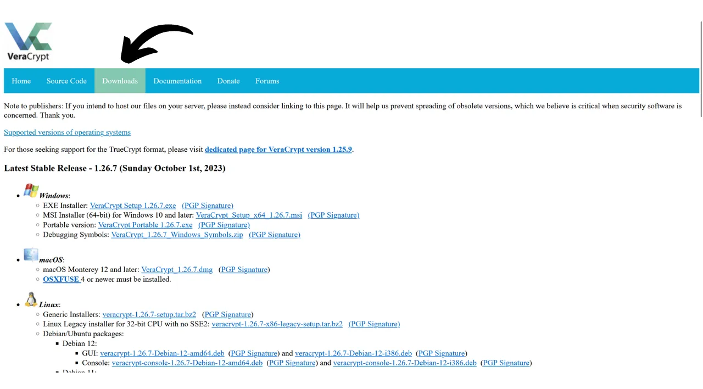

2. Pakua toleo linalolingana na mfumo wako wa uendeshaji. Kwa mfano, ikiwa unatumia Windows, chagua chaguo la **EXE Installer**.

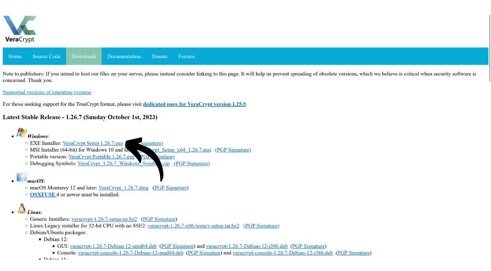

3. Chagua lugha ya kiolesura (interface) utakayotumia.

4. Kubali masharti ya leseni ya matumizi.

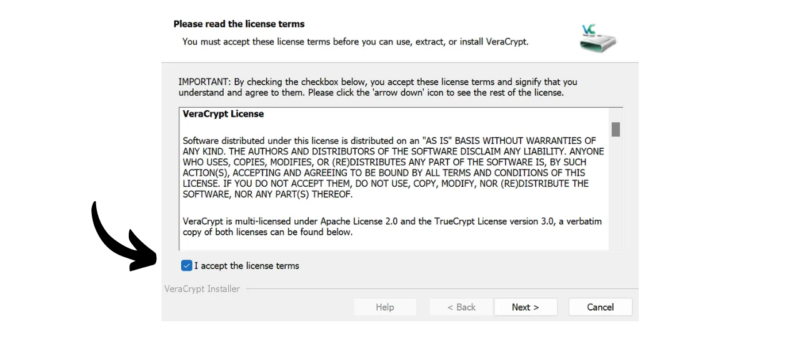

5. Bofya **Sakinisha** ili kuanza mchakato wa usakinishaji.

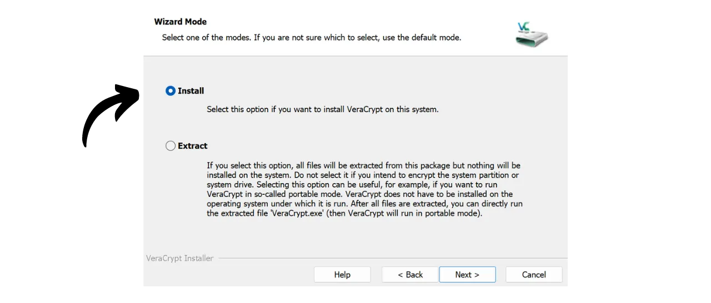

6. Chagua folda utakayopendelea programu isakinishwe, kisha bofya tena **Sakinisha**.

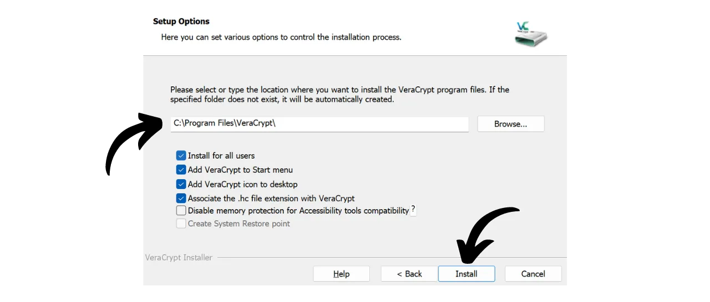

7. Subiri hadi mchakato wa usakinishaji ukamilike.

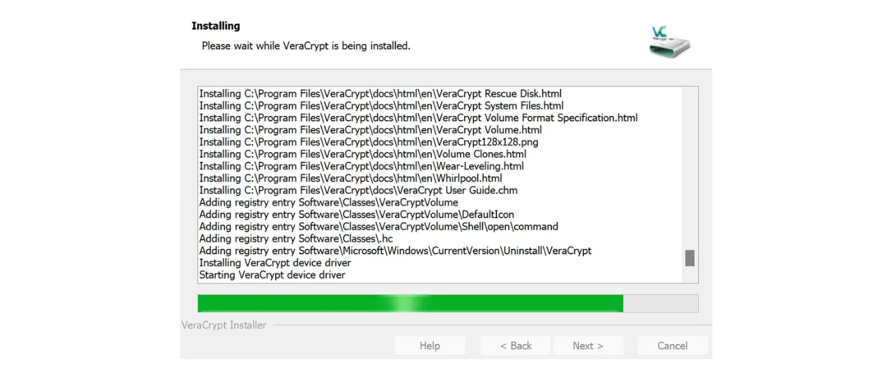

8. Ufungaji umekamilika! Sasa unaweza kuanza kuitumia.

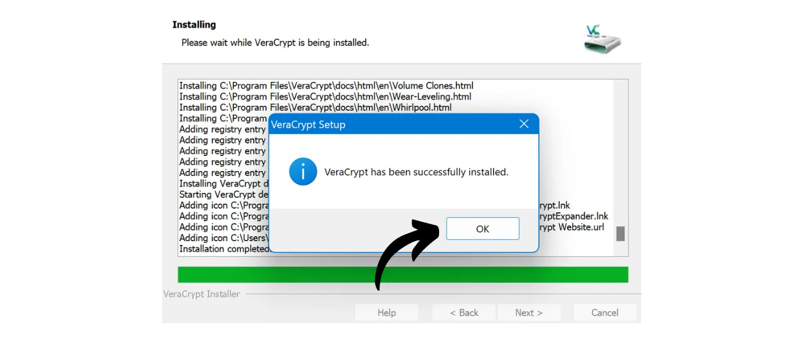

💡 *Iwapo ungependa kusaidia maendeleo ya VeraCrypt, unaweza kuchangia kwa Bitcoin kupitia tovuti yao.*

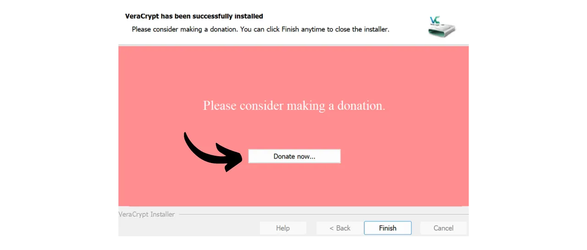

---

## Jinsi ya kusimba kifaa cha kuhifadhi kwa kutumia VeraCrypt?

Baada ya kufungua VeraCrypt kwa mara ya kwanza, utaona kiolesura kama hiki:

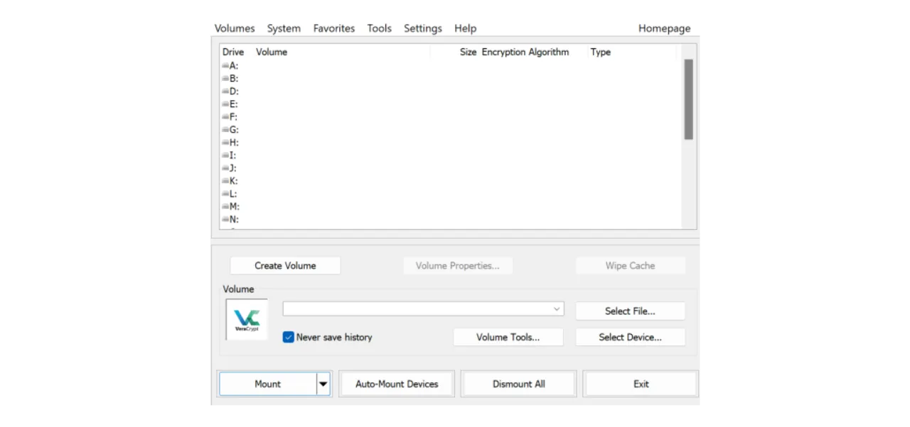

Ili kuanza usimbaji wa kifaa cha kuhifadhi (mfano: USB au diski ya nje), kwanza kifikishe kwenye kompyuta yako. Kama kifaa tayari kina data unayotaka kuhifadhi, mchakato wa usimbaji unaweza kuchukua muda mrefu zaidi. Hivyo, inashauriwa kutumia kifaa kilicho tupu au kufuta data kabla ya kuanza ili kuharakisha mchakato wa kuunda kiasi kilichosimbwa.

Kwenye menyu ya VeraCrypt, bofya **"Volumes"**.

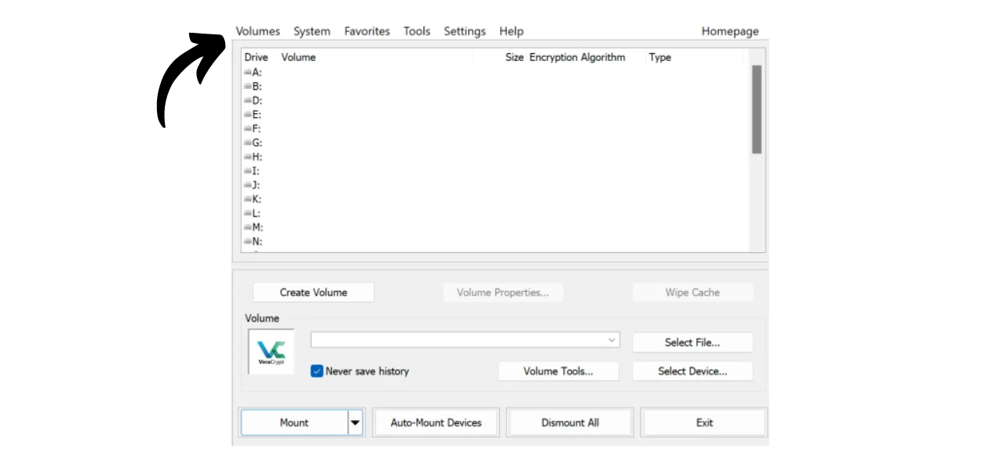

Kisha chagua **"Unda Kiasi Kipya..."** (Create New Volume).

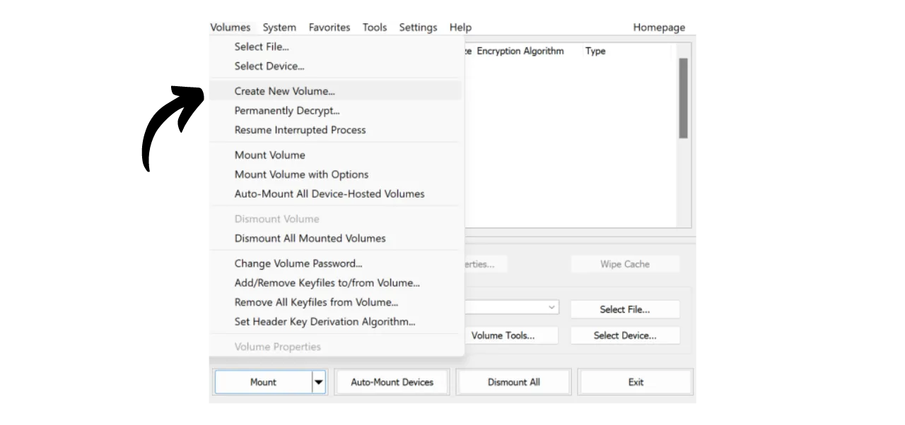

Katika dirisha jipya, chagua **"Simba sehemu isiyo ya mfumo/kiendesha"** (*Encrypt a non-system partition/drive*) kisha bofya **"Inayofuata"**.

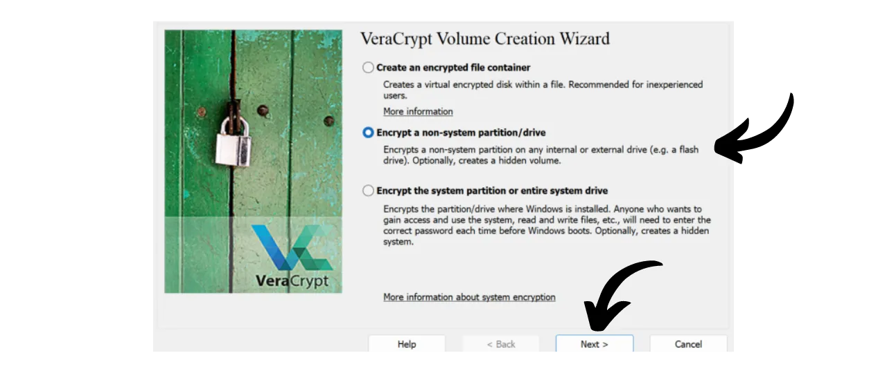

Kisha chagua mojawapo ya chaguzi mbili:

- **Kiasi cha Kawaida cha VeraCrypt** (*Standard VeraCrypt Volume*): Hii huunda kiasi kilichosimbwa kwa kawaida.
- **Kiasi cha Siri cha VeraCrypt** (*Hidden VeraCrypt Volume*): Hii huunda kiasi cha siri ndani ya kiasi kingine.

Kwa mfano huu, tuchague **Kiasi cha Kawaida cha VeraCrypt**.

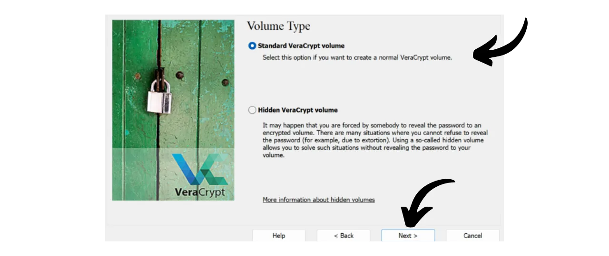

Kwenye ukurasa unaofuata, bofya **"Chagua Kifaa..."**.

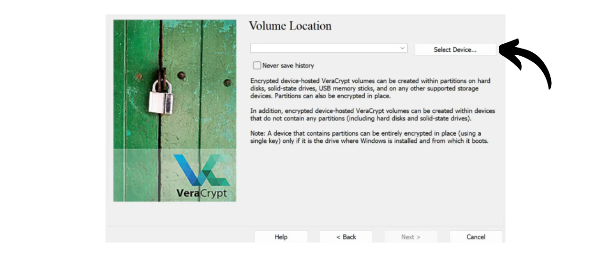

Dirisha jipya litaonyesha vifaa vyote vya kuhifadhi vinavyopatikana. Chagua kifaa unachotaka kusimba (kawaida huorodheshwa chini ya "**Removable Disk N**") kisha bofya **"OK"**.

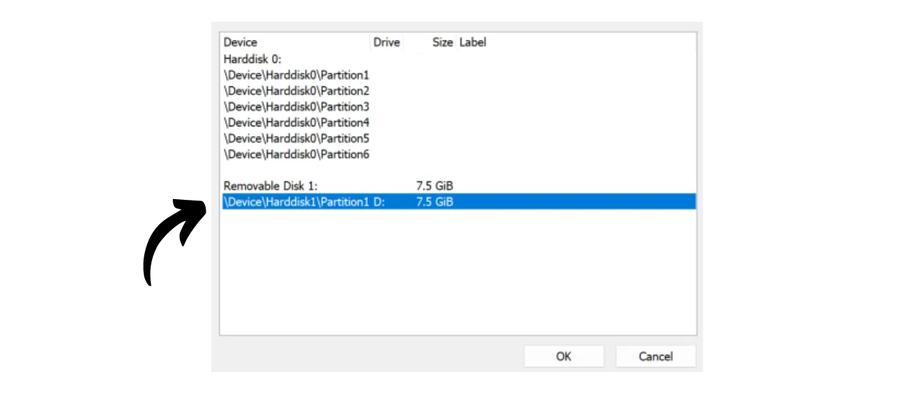

Baada ya kuchagua, kifaa kitaonekana kwenye kisanduku cha uteuzi. Bofya **"Next"**.

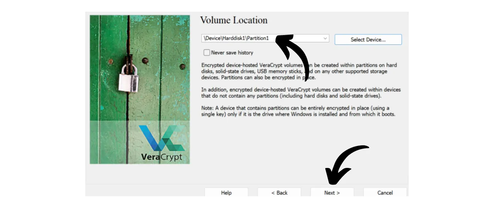

Chagua mojawapo ya chaguzi mbili:

- **"Unda kiasi kilichosimbwa na uifute diski"** (*Create encrypted volume and format it*): Hii itafuta kila kitu kwenye kifaa na kuunda kiasi kipya kilichosimbwa.
- **"Simba kizigeu kilichopo mahali pake"** (*Encrypt partition in place*): Hii itasimba data bila kuifuta, lakini mchakato ni mrefu zaidi na una hatari kubwa.

*Chagua chaguo la kwanza tu ikiwa kifaa ni tupu au tayari umehifadhi nakala ya data.*

Kwa mfano huu, tuchague **"Unda kiasi kilichosimbwa na uifute diski"**.

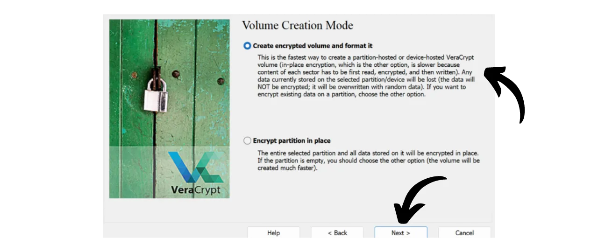

Ifuatayo, utakuwa na chaguo la kuchagua algorithm ya usimbuaji na kazi ya Hash. Isipokuwa una mahitaji maalum, nakushauri uweke chaguo-msingi. Bofya kwenye "*Inayofuata*" ili kuendelea.

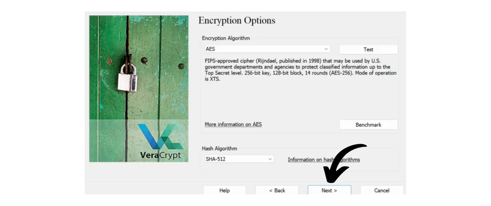

Hakikisha saizi iliyoonyeshwa ya sauti yako ni sahihi, ili kusimba nafasi nzima inayopatikana kwenye kifimbo cha USB, na sio sehemu tu. Mara baada ya kuthibitishwa, bonyeza "*Next*".

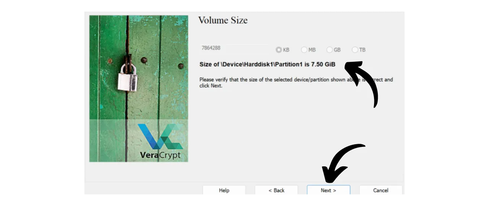

Katika hatua hii, utahitaji kuweka nenosiri ili kusimba na kusimbua kifaa chako. Ni muhimu kuchagua nenosiri dhabiti ili kuzuia mvamizi kusimbua maudhui yako kwa mashambulizi ya kinyama. Nenosiri linapaswa kuwa nasibu, kwa muda mrefu iwezekanavyo, na kujumuisha aina kadhaa za wahusika. Ninakushauri kuchagua nenosiri la nasibu la angalau herufi 20 ikijumuisha herufi ndogo, herufi kubwa, nambari na alama.

Pia nakushauri uhifadhi nenosiri lako kwenye kidhibiti cha nenosiri. Hii inafanya kuwa rahisi kufikia na kuondoa hatari ya kusahau. Kwa hali yetu mahususi, kidhibiti cha nenosiri kinapendekezwa kwa njia ya karatasi. Hakika, katika tukio la wizi, ingawa kifaa chako cha kuhifadhi kinaweza kuibiwa, nenosiri katika meneja haliwezi kupatikana na mshambuliaji, ambayo itazuia ufikiaji wa data. Kinyume chake, ikiwa kidhibiti chako cha nenosiri kimetatizika, ufikiaji wa kimwili kwa kifaa bado ni muhimu ili kutumia nenosiri na kufikia data.

Kwa habari zaidi juu ya kudhibiti manenosiri, nakushauri ugundue mafunzo haya mengine kamili:

https://planb.network/tutorials/computer-security/authentication/bitwarden-0532f569-fb00-4fad-acba-2fcb1bf05de9

Ingiza nenosiri lako katika sehemu 2 zilizoteuliwa, kisha ubofye "*Inayofuata*". 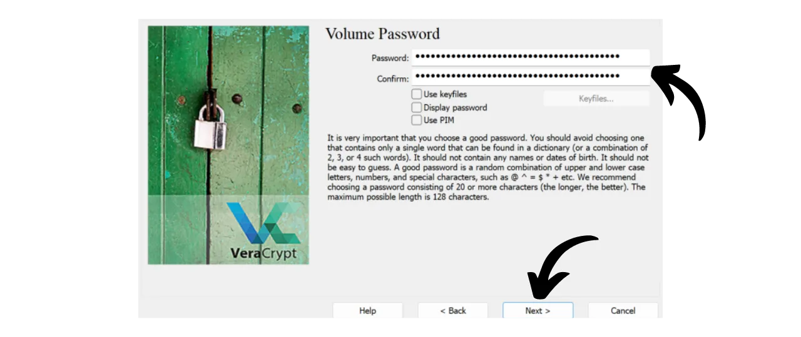

VeraCrypt itakuuliza ikiwa unapanga kuhifadhi faili kubwa kuliko 4 GiB katika ujazo uliosimbwa. Swali hili huruhusu programu kuchagua mfumo wa faili unaofaa zaidi. Kwa ujumla, mfumo wa FAT hutumiwa kwa sababu unaendana na mifumo mingi ya uendeshaji, lakini inaweka kikomo cha ukubwa wa faili cha 4 GiB. Ikiwa unahitaji kudhibiti faili kubwa, unaweza kuchagua mfumo wa exFAT.

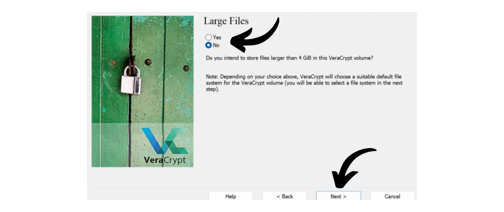

Ifuatayo, utafikia ukurasa unaokuruhusu generate ufunguo wa nasibu. Ufunguo huu ni muhimu, kwani utatumika kusimba na kusimbua data yako. Itahifadhiwa katika sehemu maalum ya midia yako, yenyewe imelindwa na nenosiri uliloanzisha hapo awali. Ili generate ufunguo dhabiti wa usimbaji fiche, VeraCrypt inahitaji entropy. Ndiyo sababu programu inakuuliza uhamishe kipanya chako kwa nasibu juu ya dirisha; harakati hizi kisha kutumika kwa generate muhimu. Endelea kusonga panya hadi kipimo cha entropy kimejaa kabisa. Kisha, bofya kwenye "*Format*" ili kuanza kuunda sauti iliyosimbwa.

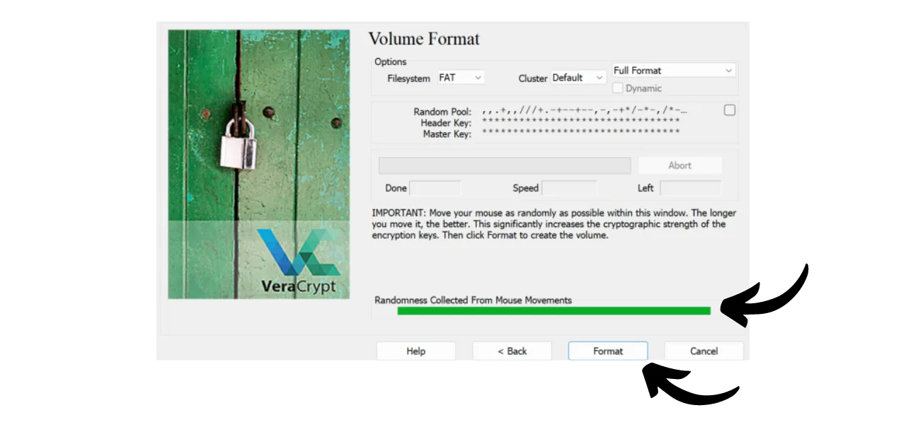

Subiri wakati uumbizaji unafanywa. Hii inaweza kuchukua muda mrefu kwa kiasi kikubwa.

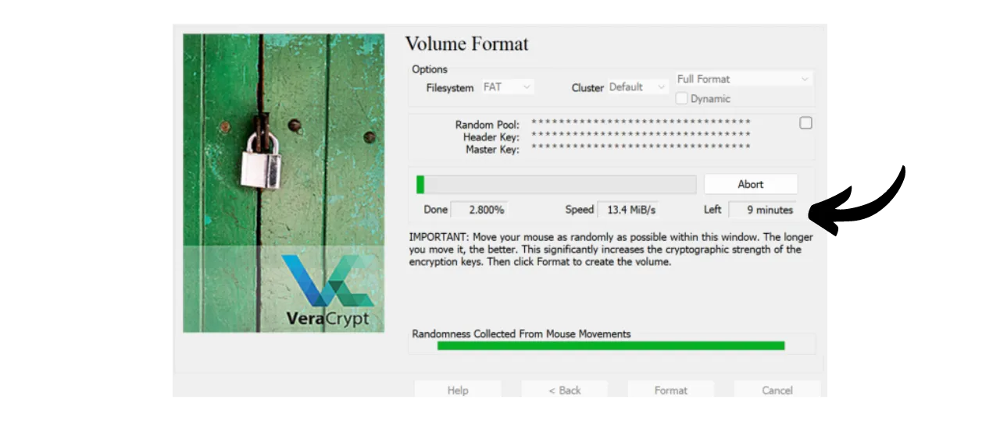

Kisha utapokea uthibitisho.

## Jinsi ya kutumia kiendeshi kilichosimbwa na VeraCrypt?

Kwa sasa, midia yako imesimbwa kwa njia fiche na kwa hivyo huwezi kuifungua. Ili kusimbua, nenda kwa VeraCrypt.

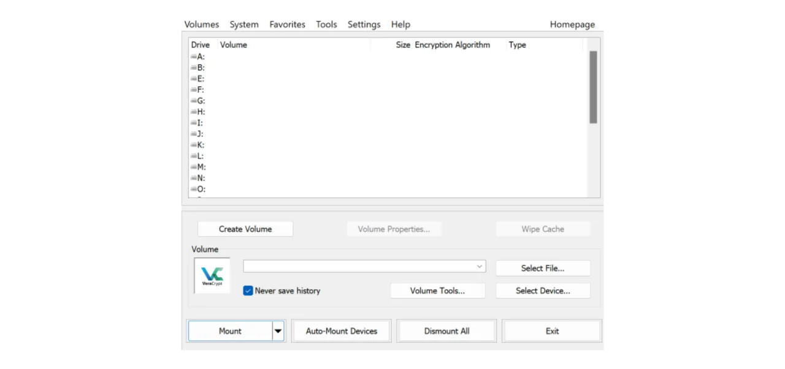

Chagua barua ya kiendeshi kutoka kwenye orodha. Kwa mfano, nilichagua "*L:*".

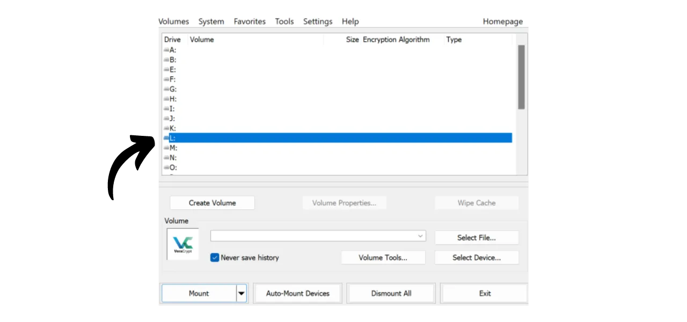

Bofya kwenye kitufe cha "*Chagua Kifaa...*".

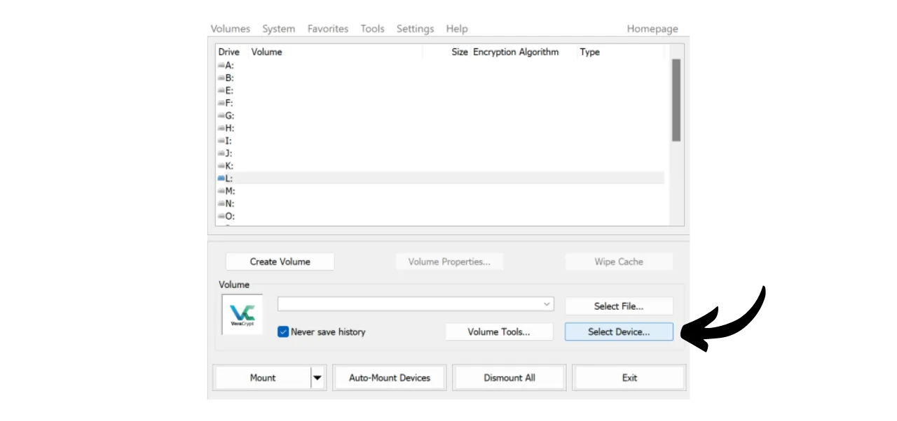

Kutoka kwenye orodha ya diski zote kwenye mashine yako, chagua kiasi kilichosimbwa kwenye midia yako, kisha ubofye kitufe cha "* Sawa*".

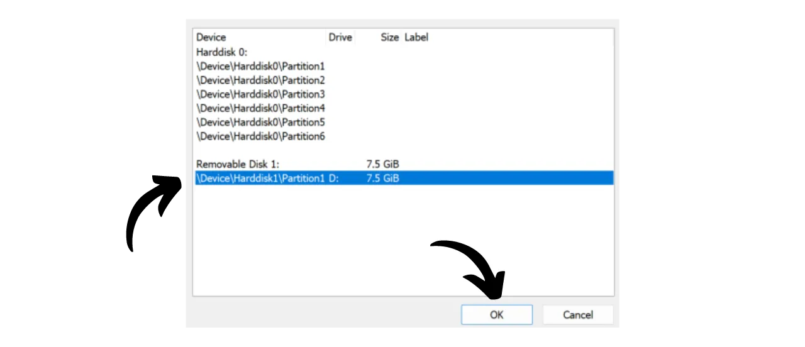

Unaweza kuona kwamba sauti yako imechaguliwa vizuri.

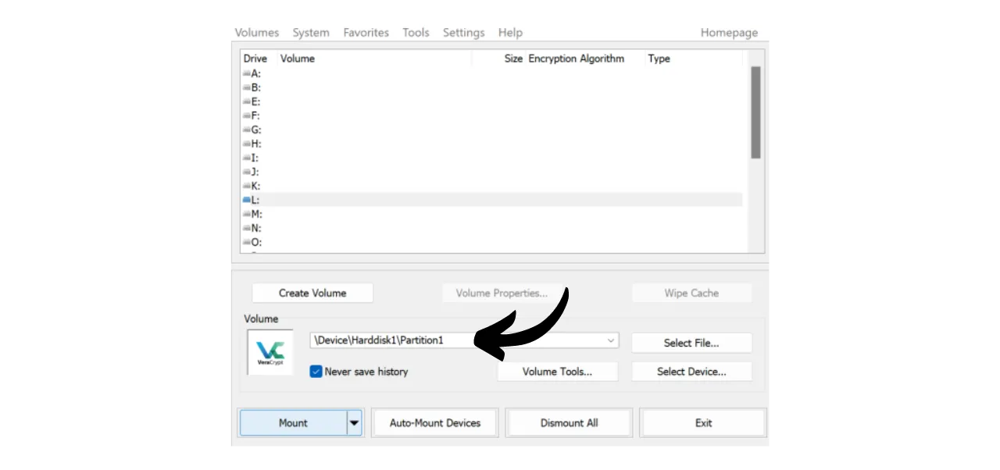

Bonyeza kitufe cha "*Mlima*".

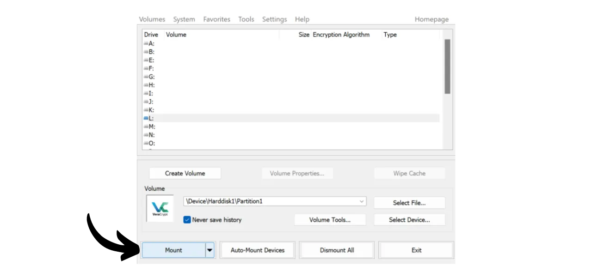

Ingiza nenosiri lililochaguliwa wakati wa kuunda kiasi, kisha bofya "* Sawa *".

Unaweza kuona kwamba sauti yako sasa imesimbwa na inapatikana kwenye herufi ya kiendeshi "*L:*".

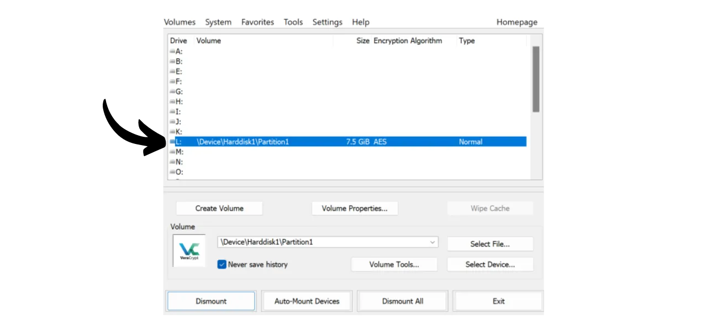

Ili kuipata, fungua kichunguzi cha faili yako na uende kwenye kiendeshi cha "*L:*" (au barua nyingine kulingana na uliyochagua katika hatua za awali). 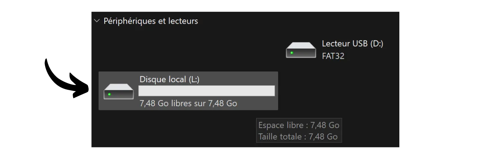

Baada ya kuongeza faili zako za kibinafsi kwenye media, ili kusimba sauti tena, bonyeza tu kwenye kitufe cha "* Dismount*".

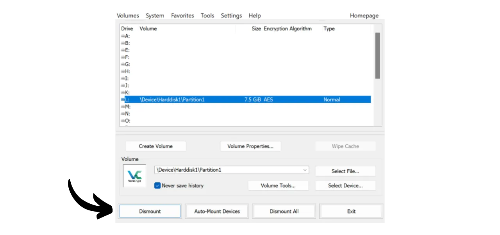

Sauti yako haionekani tena chini ya herufi "*L:*". Kwa hivyo imesimbwa tena.

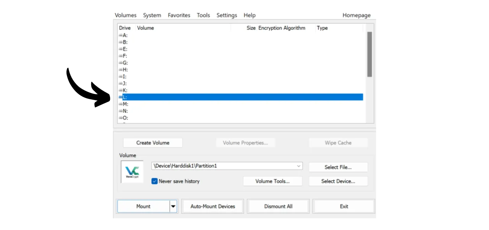

Sasa unaweza kuondoa midia yako ya hifadhi.

Hongera, sasa una njia iliyosimbwa kwa njia fiche ya kuhifadhi data yako ya kibinafsi kwa usalama, hivyo basi kuwa na mkakati kamili wa 3-2-1 pamoja na nakala kwenye kompyuta yako na suluhisho lako la kuhifadhi mtandaoni.

Iwapo ungependa kusaidia uundaji wa VeraCrypt, unaweza pia kutoa mchango katika bitcoins [kwenye ukurasa huu](https://www.veracrypt.fr/en/Donation.html).
