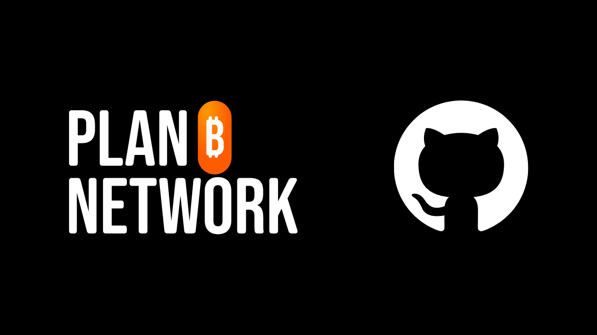
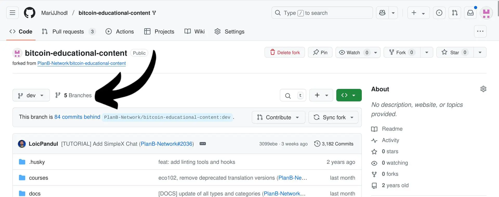
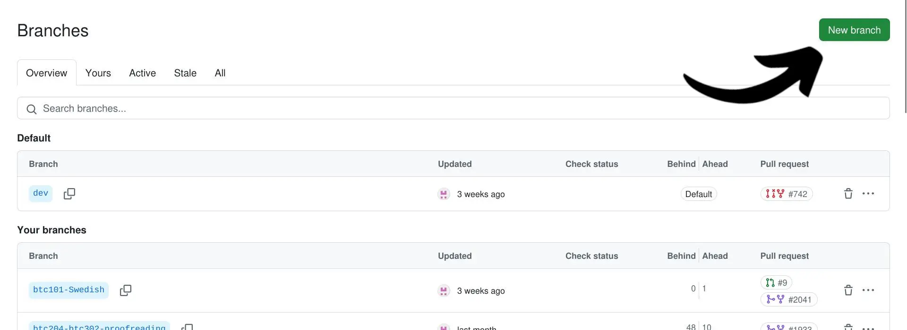
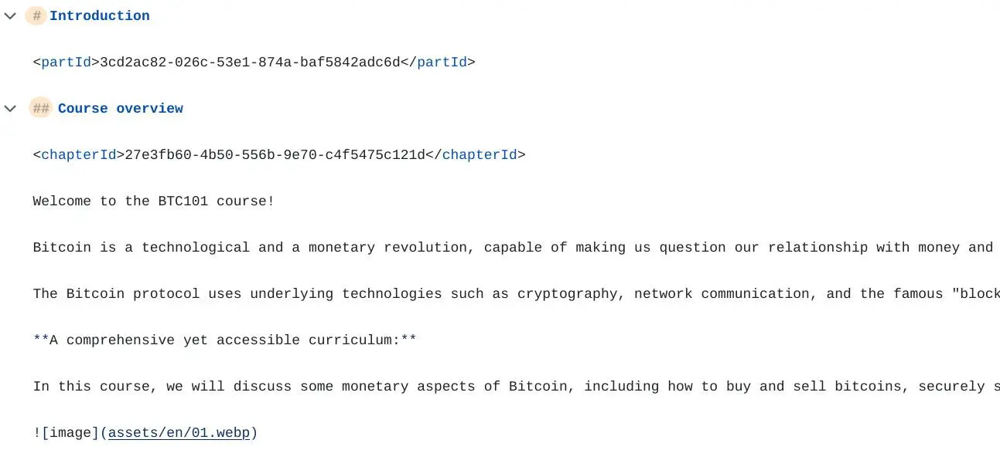
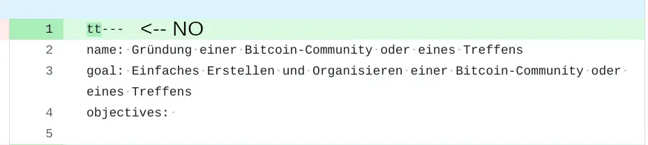
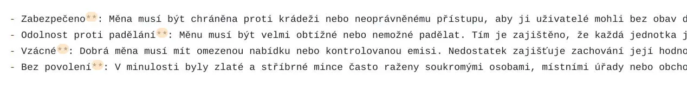
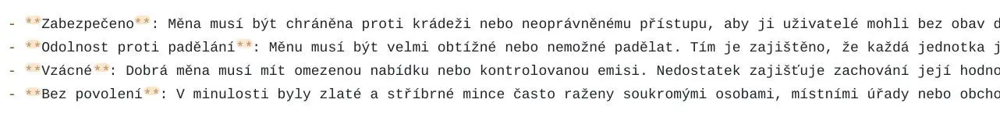

Welcome to this tutorial on the guidelines to follow when proofreading content on Plan ₿ Network. We are glad you share our mission to translate our content in as many languages as possible, in order to help people gain awareness about Bitcoin and how it can be used in their daily lives.

First of all, contributing to Plan ₿ Network [public repository](https://github.com/PlanB-Network/bitcoin-educational-content) means you can write tutorials, proofread the existing content, or even propose to add a new language to the platform. To know more, join our [Telegram Group](https://t.me/PlanBNetwork_ContentBuilder) first, and write a brief presentation about you and the languages you can speak. 

The present tutorial is dedicated to contributors who want to proofread content. Most of them don't know much about [Github](https://planb.network/en/tutorials/contribution/others/create-github-account-a75fc39d-f0d0-44dc-9cd5-cd94aee0c07c) or the [Markdown language](https://www.markdownguide.org/basic-syntax/)) we use on the repository, so it's important to share some insights on the things they need to pay attention to when doing this task.

Before diving into the specifics, the first thing to do is read this tutorial on how to practically proofread on Github by forking our repository, committing changes and sending PRs:

https://planb.network/tutorials/contribution/content/contribution-proofreading-review-tutorial-1ee068ca-ddaf-4bec-b44e-b41a9abfdef6

I created the following tutorial after gathering the most common issues that proofreaders encounter when executing their tasks. Feel free to suggest more, as it can help others improve.

## The first steps before proofreading

Before starting a new proofreading task, announce it in the [Telegram group](https://t.me/PlanBNetwork_ContentBuilder) or tell your Plan ₿ Network coordinator, who will open a dedicated [issue](https://github.com/orgs/PlanB-Network/projects/3). This system allows the coordinator to keep track of the progress inside the repo, and it allows the content to be "claimed" by the proofreader, preventing duplicate efforts by someone else. When you receive the issue link, simply comment that you are starting with the proofreading task of that content.

On the issue itself, you will find the links that take you directly to the content to check. You can directly click on them, or even better, you can go back to your own forked repo and work directly from there.

First of all, ALWAYS remember to SYNC you repo, on the "dev" branch. This way, the content will always be updated before you start any type of task, and you will not create any conflicts between old and new material. Make sure to click on "Sync fork" and "update branch".


After successfully syncing, you can directly access the content of interest and commit on a new branch, as shown in this [tutorial](https://planb.network/tutorials/contribution/content/contribution-proofreading-review-tutorial-1ee068ca-ddaf-4bec-b44e-b41a9abfdef6). Otherwise, you can open a new branch where to work, by clicking on "Branches".





Inside this new page, you will be able to find all the branches you opened, under "Your Branches". This system is very useful because it allows you to easily find the place where you modified some content. To open a new branch, you can click on "New Branch" on the upper right.




Then, you will get a pop-up where you need to inser the name of the new branch. In the case below, I chose to call it "BTC101-FR". This way, I will always remember that this specific branch needs to be used for the proofreading of the course BTC101 in French, and I will not use it for any other task.


After creating this new branch, make sure to click on it from "Your Branches in the previous page" and start working on the *.md* file related to the specific content (in my case, I will click on the folder "courses", and the subfolder BTC101, to search for fr.md). All commits related to the specific file will have to be committed (saved) inside the same branch.

## Original language or translation?

When doing some proofreading of content, it's important to always check the original English (or French) version Be aware that we translate using AI language tools, so the rendering in the target language might not be fluid or well understandable for the final reader. 

Thus, feel free to make adjustments to the text and modify sentences, if needed. Our objective is to enhance fluidity, always following the overall original meaning Make sure to ask the coordinator if you have any doubts.

Legend, from now on EN is English and LANG is the target language, es IT, etc...

LLM tools may translate some words related to Bitcoin literally, like Lightning Network that would become "Rete Fulmine" in Italian, for example. 

It is especially the case when it deals with very techical words. In cases like these, it is advisable to maintain the original English word on your target language for better clarity, unless your language rules impose you to translate every single word. In this second case, always do some research to see if someone else in your Bitcoin community has already translated that word and it is now broadly used. 

- One solution could be to check on [BitcoinWiki](https://en.bitcoin.it/wiki/Main_Page) in your target language to see if the word was translated or not. If it's not, you keep the word in English.

- In any case, my advice would be to insert the EN word nonetheless, and then the corresponding meaning in the target language inside round parenthesis, following the scheme EN (LANG), or viceversa. Ex. Address (indirizzo) or indirizzo (address).

- Another good solution is to keep the EN original word/phrase, then create a hyperlink that redirects to the [glossary](https://planb.network/en/resources/glossary) on planb.network. To do this, you need to insert the word/phrase inside square brackets, and the link inside round parenthesis, like you can see in the example below: 

```
[UTXO](https://planb.network/resources/glossary/utxo)
```

In the final result (image below) you will not visualize the entire link, and the word will become clickable.


Please note that in the original like you will take from the website, the language code will be inserted after the word "resources" (example: https://planb.network/resources/en/glossary/utxo). Here you can read the language code "en" after "resources". In this case, remove the language code from the link, like you saw in the box above. This way, the system will automatically take the reader to their designated language.

The content on the repo is full of hyperlinks like these above. Now that you now what they mean, make sure not to delete them:

Another thing related to word rendering is the following. If you find "Plan ₿ Network" in the text, leave it in this original form. Do not translate the word "plan" or the word "network". Besides, do NOT use the article "The" when introducing Plan ₿ Network, and consider it as a brand. 

The same goes for "₿-CERT", "BIZ SCHOOL", "TECH SCHOOL", which should also be kept in the original form.

## The structure of headers

In the markdown language, headers (and paragraph titles) all begin with the hash sign ``#`` . The number of hash signs used corresponds to the heading level. For example, a heading of level three has three number signs before the text (e.g., `### My Header`).




Make sure to NEVER delete hash signs before a title, otherwise you will create issues with the structure of the text. At the same time, make sure not to change the chapterID part you can see in the image above: ``<chapterId>d668fdf6-fb4c-4bbf-82e1-afcb95c122e0</chapterId>``

## The initial section of courses

At the beginning of any content, you will find the following static lowercase words: "name", "description", "objectives". They are used by the website to decode the content itself and are always left in EN. As a consequence, DO NOT translate them, otherwise the content will create syncronization issues. Make sure to only proofread the part after the colon, which is automatically translated by AI.


In this same initial section, keep the format as it is and don't add anything Don't add anything at the beginning of the text: Ex. avoid adding "tt" before the dashes, like in the image below!




## Format recommendations

Here below you can find a few examples of format issues to pay attention to when proofreading content in your target language.

- Pay attention to weird punctuation like `\*\*\`, or ``**`` which might represent a bad rendering of the bold symbol. 

	In the image below, you can see that the asterisks are only on the right of the word, which looks weird. Always check the original English text to see if a bold text is supposed to be there. In the original EN text, instead, we have this:
	




In this case, it's enough to just add two asterisks at the start of the word to make it show correctly on the website. In fact in the markdown language, to render the bold, you have to insert two asterisks ``**`` both before and after the word/sentence.





- The same issues may happen with symbols like $ and `` ` `. Make sure to check the original language file (ofter en or fr to see where these symbols are supposed to be).

- If you find quotes, make sure to do some research online to find the right translation in your language. Quotes are usually inserted after the symbol ``>``.


## Other best practices

If you need to search for specific words inside the text, you can click on CTRL+F and the find-replace section will appear. This part is very useful when you need to jump to a specific part of the text, or you need to replace specific words/sentences in batch, without scrolling the full content.


When using the "replace all" function, it's important to double-check the results to ensure that links haven't been altered as well. For instance, if you want to change the word "Bitcoin" to "Bitkoin" (which may be necessary in some languages), using the batch replace function can efficiently update all instances in the text. However, be aware that this tool will also modify any links containing the word, potentially leading to redirection issues.


Another best practise when you finish your proofreading task and send the PR is to go back to the original issue opened by the coordinator, and comment with "Proofreading done". Make sure to insert your PR link there as well.


## Conclusion

To sum up, being aware of the common mistakes proofreaders make can really help you improve your skills when checking content. It's easy to overlook things like context or consistency, so, catching these mistakes can make a big difference. Always keep in mind that a beginner may read these courses and tutorials, so it's our responsibility to ensure that they understand fully.

Thank you for reading through this tutorial and enjoy your proofreading journey!