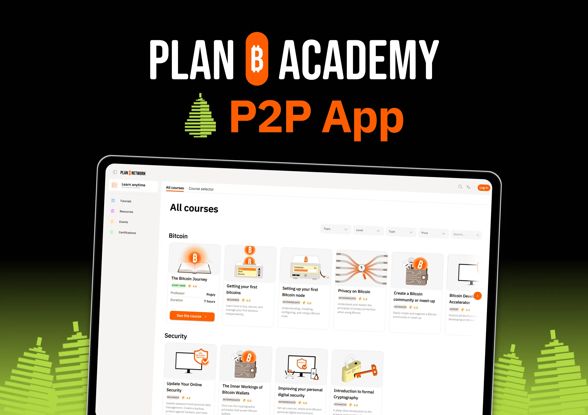


Muhtemelen bildiğiniz gibi Plan ₿ Academy, Bitcoin'a adanmış en büyük eğitim veritabanıdır ve açık bir lisans altında yayınlanan kursları, eğitimleri ve binlerce kaynağı bir araya getirir. Başlangıçta, Plan ₿ Academy bir web sitesiydi. Ancak, örneğin sansür durumunda artık normal olarak erişemezseniz ne olur?


Bu eğitimde, **Holepunch** tarafından geliştirilen ve **Tether** tarafından desteklenen bir eşler arası (P2P) teknolojisi olan **Pears** sayesinde **Plan ₿ Academy** platformunu gerçekten ölçülemez bir şekilde nasıl çalıştıracağımızı öğreneceğiz.


Pears, Plan ₿ Academy platformunu merkezi bir web sitesine bağlı kalmadan çalıştırmamızı sağlayacak yazılımdır. Bu eğitimde, Plan ₿ Academy'ye Pears üzerinden erişmek için bilgisayarınıza Pears'ı kuracağız.


Pears'ın amacı basit: web uygulamalarını herhangi bir merkezi altyapıya (sunucu, ana bilgisayar, aracı yok) dayanmadan dağıtmayı ve kullanmayı mümkün kılmak. Başka bir deyişle, bir bulut sağlayıcısı kapansa veya bir ülke bir alan adını engellese bile, uygulama ağın eşleri arasında yaşamaya devam eder. Eğitim platformumuz Plan ₿ Academy'nin tek bir hata noktası olmadan dünyanın her yerinden erişilebilir kalmasını sağlayan da bu yaklaşımdır.


---

**TL;DR :**


- Armutları yükleyin;


- Plan ₿ Academy uygulamasını başlatmak için aşağıdaki komutu çalıştırın:


```shell
pear run pear://k9cawqdsan3bkobkigesuyfeqjcasi49ikjaru5cipap835t7nwy
```


---

## 1. Armutları Yükleyin


### 1.1 Armut Nedir?


Pears, eşler arası uygulamalar için bir çalışma zamanı ortamı, geliştirme aracı ve dağıtım platformudur. Bu açık kaynaklı araç, bir sunucu veya altyapı olmadan, doğrudan kullanıcılar arasında yazılım oluşturmayı, paylaşmayı ve çalıştırmayı mümkün kılar. Somut olarak bu, bir uygulamayı merkezi bir sunucuda barındırmak yerine, her kullanıcının uygulamanın bir bölümünü ve verileri diğer eşlerle paylaşan bir ağ düğümü haline geldiği anlamına gelir. Tüm sistem, her bir örneğin hizmeti erişilebilir tutmak için işbirliği yaptığı dağıtılmış bir ağ oluşturur.


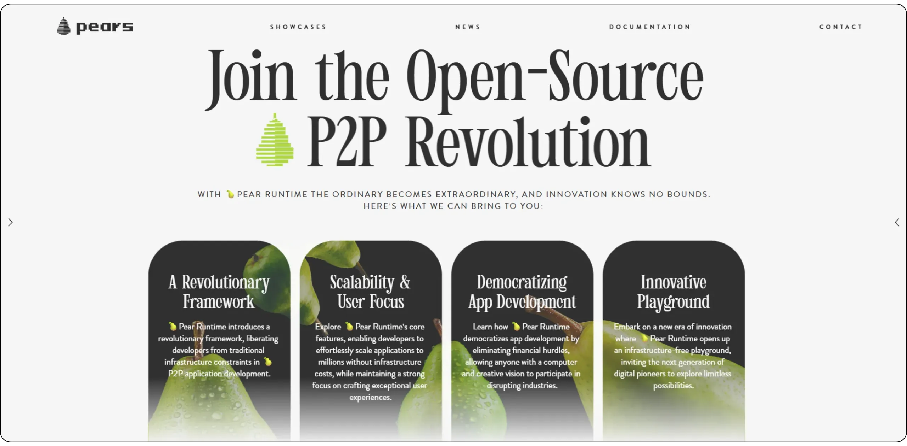


Bu yaklaşım Holepunch tarafından geliştirilen bir dizi modüler yazılım tuğlasına dayanmaktadır:


- Hypercore**: merkezi bir veritabanı olmadan veri tutarlılığını ve güvenliğini garanti eden dağıtılmış bir günlük.
- Hyperbee**: verimli veri organizasyonu ve tarama için Hypercore üzerinde bir indeksleyici.
- Hyperdrive**: Uygulama dosyalarını eşler arasında depolamak ve senkronize etmek için kullanılan dağıtılmış bir dosya sistemi.
- Hyperswarm** ve **HyperDHT**: merkezi bir sunucu olmadan dünya çapındaki eşler arasında keşif ve bağlantı sağlayan ağ katmanları.
- Secretstream**: iki eş arasındaki alışverişleri güvence altına almak için bir E2E şifreleme protokolü.


Bu bileşenleri bir araya getiren Pears, her kullanıcının ağa aktif olarak katıldığı otonom, şifrelenmiş ve dağıtılmış uygulamalar oluşturmayı mümkün kılar. Bu merkezi olmayan mimari altyapı maliyetlerini, sansür risklerini ve SPOF'ları (*Tek Arıza Noktası*) ortadan kaldırır.


Pears, Mathias Buus ve Paolo Ardoino (Tether CEO'su ve Bitfinex CTO'su) tarafından kurulan Holepunch tarafından, eşler arası mantığı Bitcoin'nin ötesine genişletme misyonuyla geliştirilmektedir. Amaçları, her uygulamanın yetkilendirme olmadan, sunucular olmadan ve aracılar olmadan çalışabileceği "Eşler Arası İnternet" inşa etmektir. Holepunch halihazırda tamamen P2P video konferans ve mesajlaşma uygulaması olan **Keet**'in arkasındadır.


https://planb.academy/tutorials/computer-security/communication/keet-efdb759d-5e94-4bbf-b28c-5fa8669c809b

*Bu Pears kurulum eğitimi, işletim sisteminize bağlı olarak birkaç bölüme ayrılmıştır. Uygun talimatları takip etmek için doğrudan ortamınıza karşılık gelen bölüme gidin :*


- Linux (Debian)** → Bölüm **1.2.**
- Windows** → Bölüm **1.3.**
- macOS** → Bölüm **1.4.**


### 1.2 - Linux (Debian) üzerinde Pears'ı nasıl kurabilirim?


Pears'ı bir Debian sistemine kurmak nispeten basittir, ancak bu bölümde ayrıntılı olarak açıklayacağımız birkaç ön koşul gerektirir.


#### 1.2.1. Sistemin güncellenmesi


Her şeyden önce, sisteminizin güncel olduğundan emin olmanız önemlidir.


```bash
sudo apt update && sudo apt upgrade -y
```


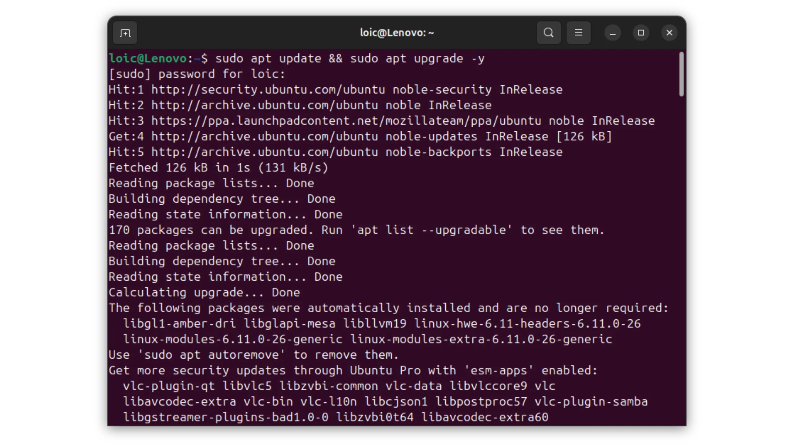


#### 1.2.2 Bağımlılıkların yüklenmesi


Pears, Bare JavaScript çalışma zamanı tarafından kullanılan `libatomic1` de dahil olmak üzere bir dizi sistem kütüphanesine dayanır. Aşağıdaki komut ile yükleyin:


```bash
sudo apt install -y libatomic1 curl git
```


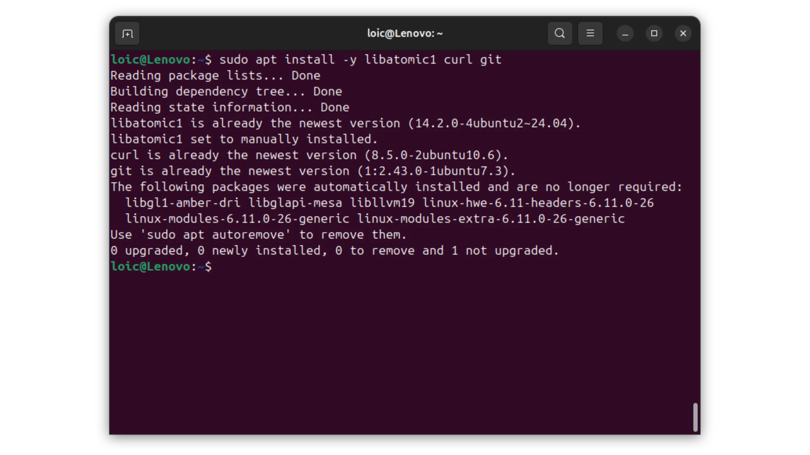


#### 1.2.3 NVM aracılığıyla Node.js ve npm kurulumu


Pears, *Node.js* paket yöneticisi olan *npm* aracılığıyla dağıtılır. Pears çalışmak için doğrudan *Node.js*'ye bağımlı olmasa da, kurulum için gereklidir. Linux üzerinde *Node.js* kurulumu için önerilen yöntem, Node'un çeşitli sürümlerini paralel olarak yönetmenizi sağlayan *NVM* (*Node Version Manager*) yöntemidir.


```bash
curl -o- https://raw.githubusercontent.com/nvm-sh/nvm/master/install.sh | bash
```


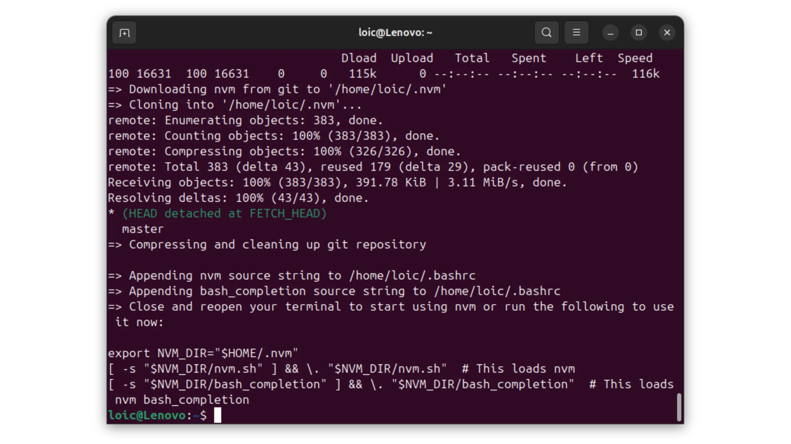


Ardından *NVM* 'yi etkinleştirmek için terminalinizi yeniden yükleyin:


```bash
source ~/.bashrc
```


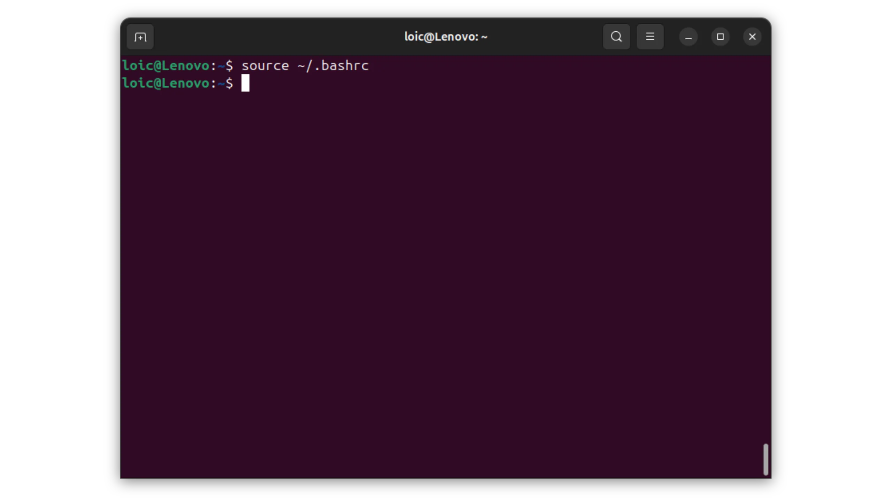


NVM*'nin kurulu olup olmadığını kontrol edin:


```bash
nvm --version
```


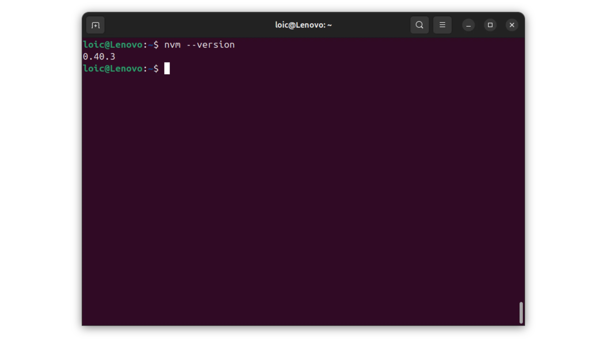


Ardından *Node.js'nin* kararlı bir sürümünü yükleyin (örneğin, mevcut LTS):


```bash
nvm install --lts
```


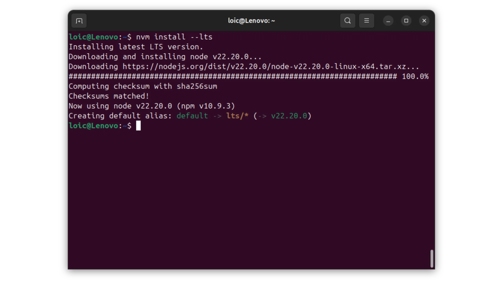


Node.js* ve *npm* kurulumlarını kontrol edin:


```bash
node -v
npm -v
```


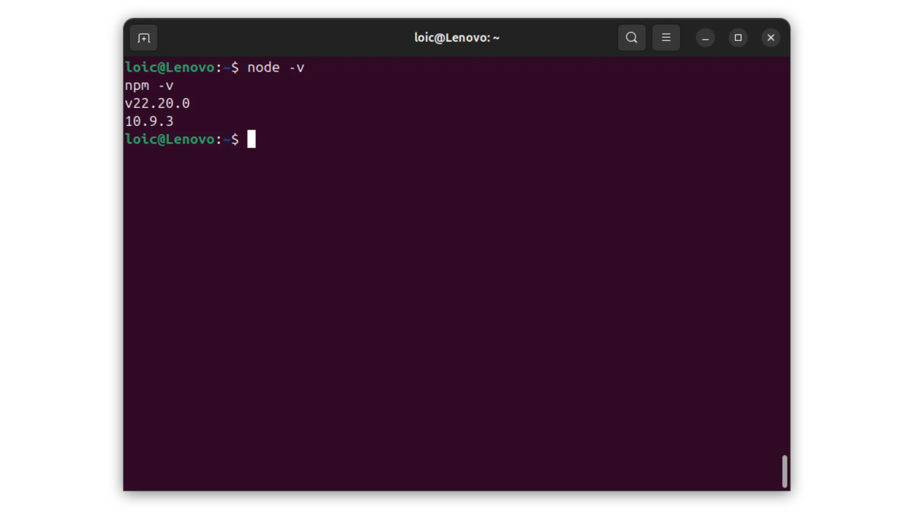


#### 1.2.4 Pears'ın npm ile Kurulumu


Bir kez *npm* kullanılabilir olduğunda, Pears CLI'ü sisteminize global olarak yükleyebilirsiniz. Bu, `pear` komutunu herhangi bir dizinden çalıştırmanıza izin verecektir.


```bash
npm install -g pear
```


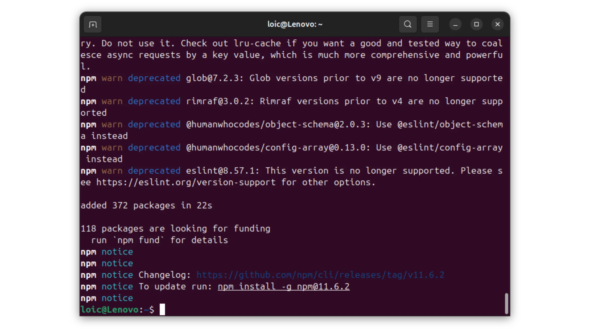


#### 1.2.5. Armutları Başlatma


Kurulumdan sonra, terminalinizde aşağıdaki komutu çalıştırmanız yeterlidir:


```bash
pear
```


İlk açılışta, Pears gerekli bileşenleri indirmek için eşler arası ağa bağlanacaktır. Bu işlem merkezi bir sunucu gerektirmez: dosyalar doğrudan diğer eşlerden elde edilir.


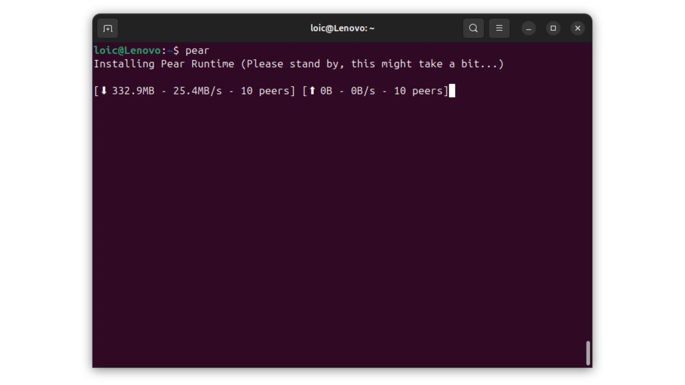


İndirme işlemi tamamlandığında, her şeyin çalışıp çalışmadığını kontrol etmek için komutu tekrar çalıştırın:


```bash
pear
```


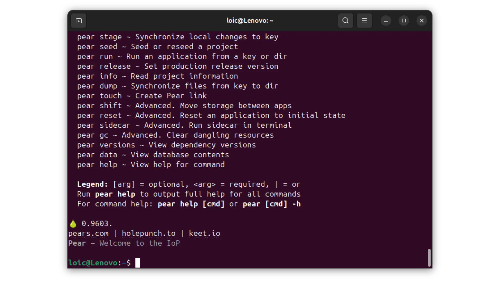


Her şey doğru bir şekilde yüklendiyse, Pears Help mevcut komutların bir listesiyle birlikte görüntülenecektir.


#### 1.2.6. Armutların Keet ile Test Edilmesi


Pears'ın tam olarak çalışıp çalışmadığını kontrol etmek için, Holepunch'ın açık kaynaklı mesajlaşma ve video konferans yazılımı Keet gibi ağda zaten mevcut olan bir P2P uygulamasını başlatabilirsiniz.


```bash
pear run pear://keet
```


Bu komut Keet uygulamasını merkezi bir sunucudan geçirmeden doğrudan Pears ağından yükler. Keet doğru şekilde başlatılırsa, Pears kurulumunuz tamamen işlevseldir.


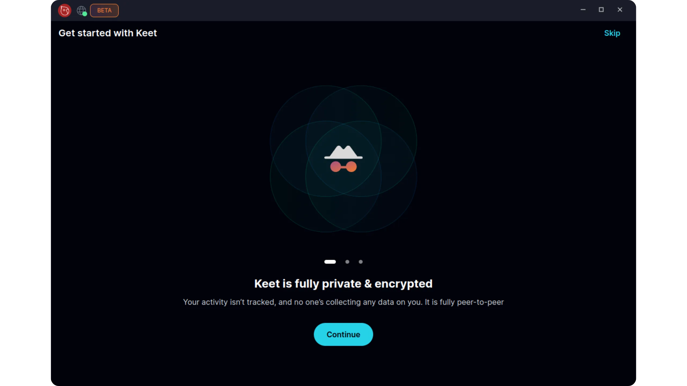


Linux sisteminiz artık Pears ile eşler arası uygulamaları çalıştırmaya ve barındırmaya hazırdır.


### 1.3 - Pears'ı Windows'a nasıl yüklerim?


Pears'ı Windows'a yüklemek Linux'a yüklemek kadar kolaydır, ancak birkaç özel araç gerektirir.


*Linux kullanıyorsanız ve Pears'ı zaten yüklediyseniz, doğrudan 2. adıma geçebilirsiniz


#### 1.3.1. PowerShell'i yönetici modunda açın


Öncelikle PowerShell'i yönetici haklarıyla çalıştırın :


- Başlat menüsüne tıklayın;
- PowerShell yazın;
- "*Windows PowerShell*" üzerine sağ tıklayın;
- "*Yönetici olarak çalıştır*" seçeneğini seçin.


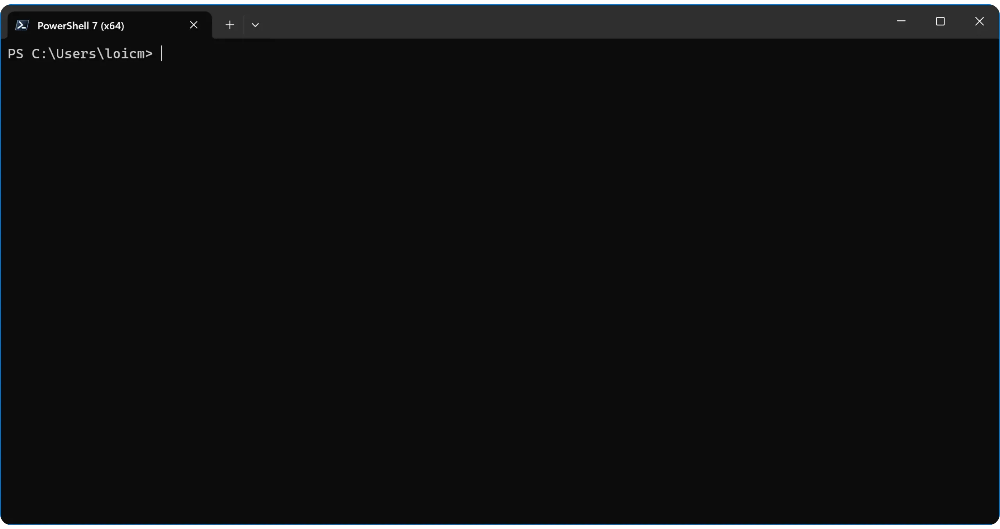


#### 1.3.2. NVS'yi İndirin


Pears, *Node.js* paket yöneticisi olan *npm* aracılığıyla yüklenir. Windows'ta Holepunch tarafından önerilen yöntem, bu sistemde *NVM*'den daha kararlı olan *NVS* (*Node Version Switcher*) kullanmaktır.


PowerShell'de, *NVS* 'nin en son sürümünü yüklemek için aşağıdaki komutu çalıştırın:


```PowerShell
winget install jasongin.nvs
```


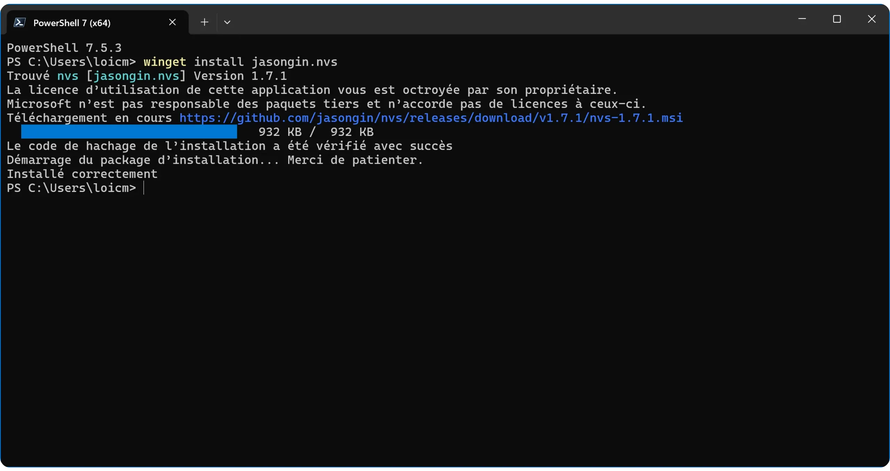


#### 1.3.3. Node.js Kurulumu


Kurulumdan sonra PowerShell'i yeniden başlatın ve aşağıdaki komutu girin:


```powershell
nvs
```


Kullanılabilir *Node.js* sürümlerinin bir listesini görmelisiniz. Klavyenizdeki `a` tuşuna basarak ilkini seçin.


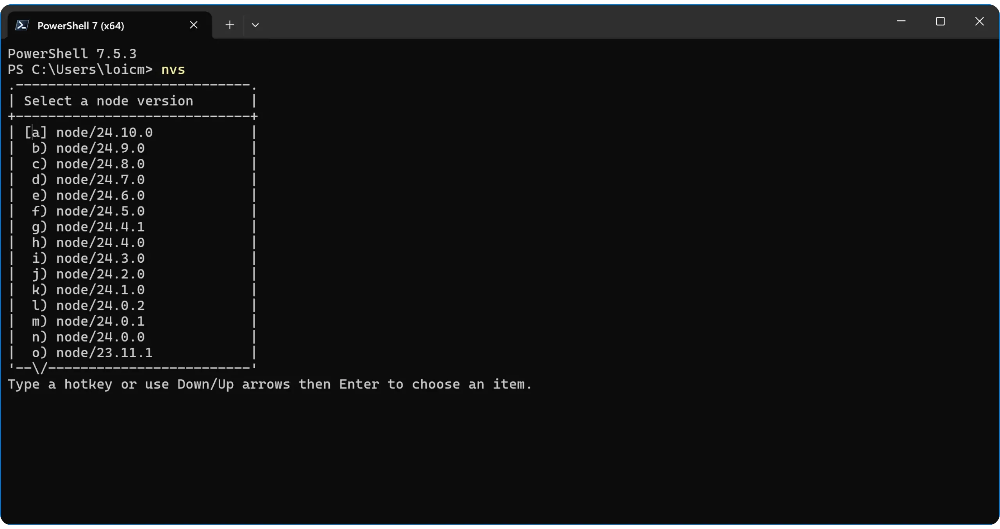


*Node.js* yüklü.


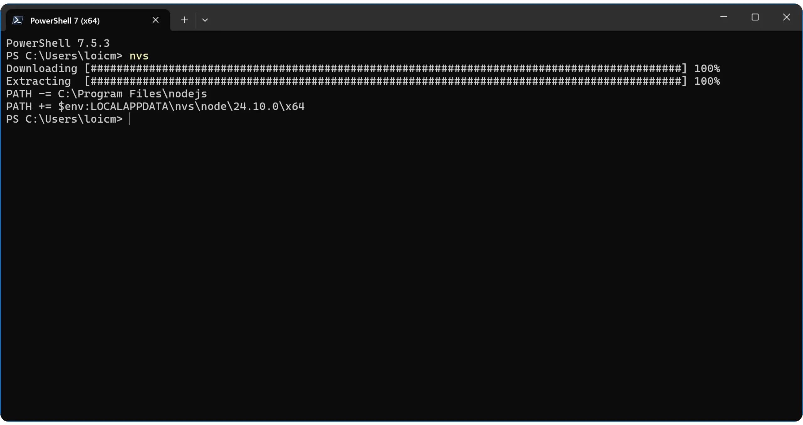


#### 1.3.4. Kurulumları kontrol edin


Node.js* ve *npm*'in erişilebilir olduğundan emin olun:


```powershell
node -v
npm -v
```


Her iki komut da bir sürüm numarası döndürmelidir.


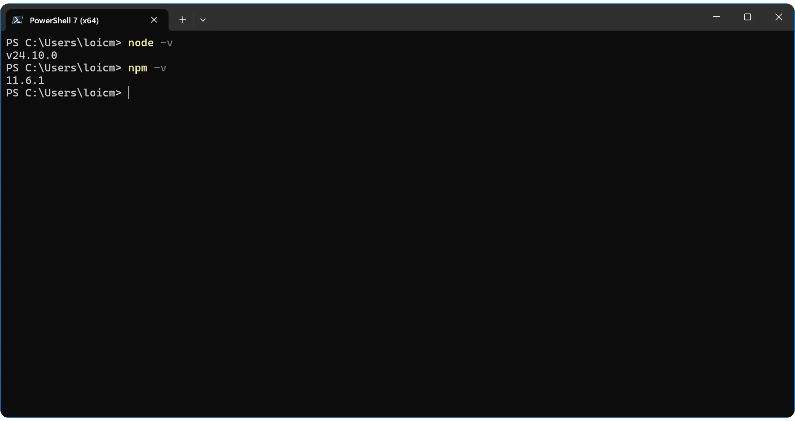


#### 1.3.5. Pears'ı npm ile Yükleme


Node.js* ve *npm* kullanılabilir olduğunda, **Pears CLI**'yı sisteminize global olarak yükleyin:


```powershell
npm install -g pear
```


Bu, `pear` ikili dosyasını global *npm* dizininize yükleyecektir.


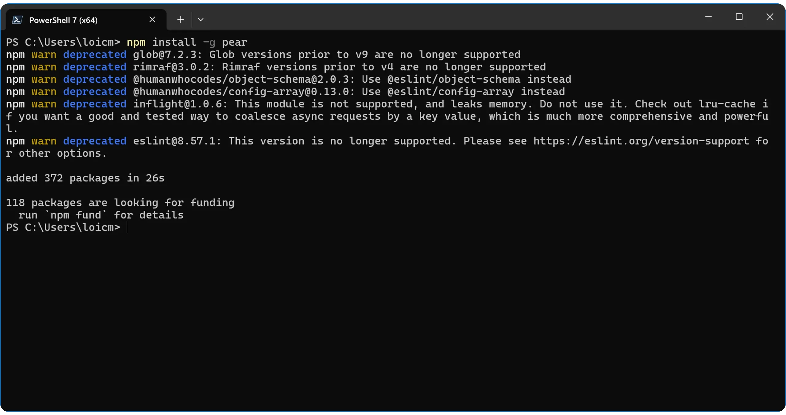


#### 1.3.6. Pears'ı kontrol edin ve başlatın


Kurulum tamamlandıktan sonra çalıştırın :


```powershell
pear
```


İlk açılışta, Pears gerekli bileşenleri eşler arası ağdan otomatik olarak indirecektir. Bu işlem birkaç dakika sürebilir.


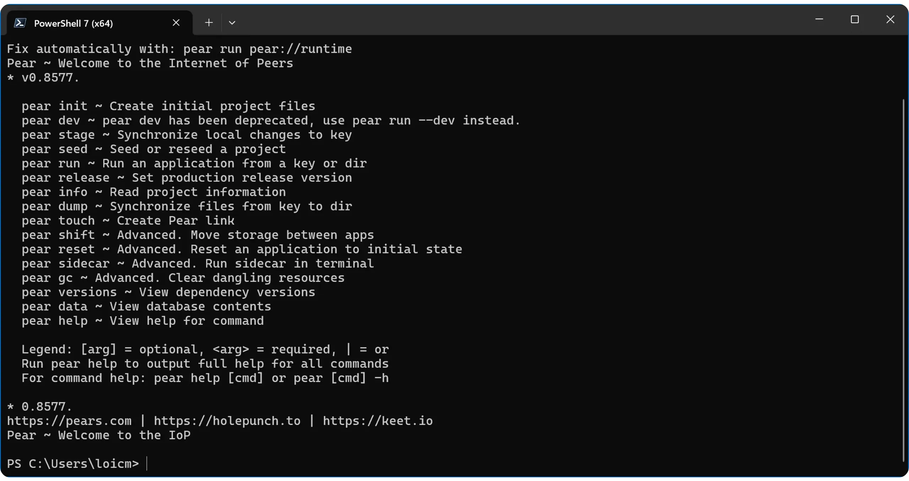


Her şey yolunda gittiyse, mevcut alt komutların (run, seed, info...) bir listesini içeren CLI Pears yardım ekranını görmelisiniz.


#### 1.3.7. Armutların Keet ile Test Edilmesi


Pears'ın tam olarak çalışıp çalışmadığını kontrol etmek için, Holepunch'ın açık kaynaklı mesajlaşma ve video konferans yazılımı Keet gibi ağda zaten mevcut olan bir P2P uygulamasını başlatabilirsiniz.


```bash
pear run pear://keet
```


Bu komut Keet uygulamasını merkezi bir sunucudan geçirmeden doğrudan Pears ağından yükler. Keet doğru şekilde başlatılırsa, Pears kurulumunuz tamamen işlevseldir.


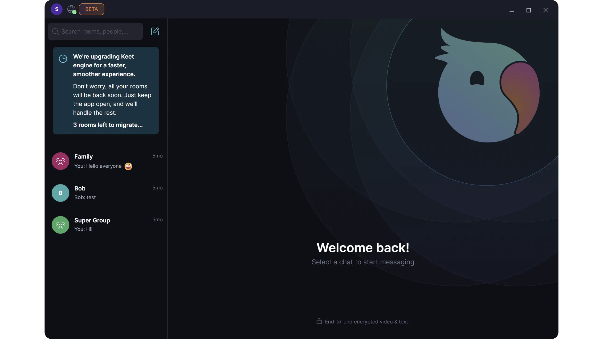


Windows sisteminiz artık Pears ile eşler arası uygulamaları çalıştırmaya ve barındırmaya hazırdır.


### 1.4. Pears macOS'a nasıl kurulur?


Pears'ı macOS'a kurmak Linux'a kurmaya benzer, ancak Apple ortamına özgü birkaç ayarlama gerektirir. Gelin bu adımları birlikte keşfedelim.


*Linux veya Windows kullanıyorsanız ve Pears'ı zaten yüklediyseniz, doğrudan 2. adıma geçebilirsiniz


#### 1.4.1. Sistem gereksinimlerini kontrol edin


Yüklemeden önce lütfen sisteminizde *Xcode Komut Satırı Araçlarının* mevcut olduğundan emin olun. Bu paket _Node.js_ ve bağımlılıkları için gerekli derleme araçlarını sağlar.


Bunu yapmak için, `Cmd + Boşluk çubuğu` klavye kısayolunu kullanarak bir terminal açın, ardından `Terminal` yazın ve `Enter` tuşuna basın. Daha sonra kurulumu başlatmak için bu komutu terminale girebilirsiniz:


```bash
xcode-select --install
```


Araçlar sisteminizde zaten yüklüyse, macOS sizi bilgilendirecektir.


#### 1.4.2. NVM'nin Kurulması


Pears, *Node.js* paket yöneticisi olan *npm* aracılığıyla dağıtılmaktadır. Pears çalışmak için doğrudan *Node.js*'ye bağımlı olmasa da, kurulum için gereklidir. MacOS üzerinde *Node.js* kurulumu için önerilen yöntem, Node'un çeşitli sürümlerini paralel olarak yönetmenize olanak tanıyan *NVM* (*Node Version Manager*) yöntemidir.


```bash
curl -o- https://raw.githubusercontent.com/nvm-sh/nvm/master/install.sh | bash
```


Ardından *NVM* 'yi etkinleştirmek için terminalinizi yeniden yükleyin:


```bash
source ~/.zshrc
```


Eğer *zsh* yerine *bash* kullanıyorsanız, :


```bash
source ~/.bashrc
```


Ardından *NVM*'nin kurulu olup olmadığını kontrol edin:


```bash
nvm --version
```


Terminal, sisteminizde kurulu *NVM* sürümünü döndürmelidir.


#### 1.4.3 Node.js ve npm Kurulumu


Ardından *Node.js'nin* kararlı bir sürümünü yükleyin (örneğin, mevcut LTS):


```bash
nvm install --lts
```


Kurulum tamamlandığında, yüklü sürümleri kontrol edin:


```bash
node -v
npm -v
```


Her iki komut da bir sürüm numarası döndürmelidir.


#### 1.4.4 Pears'ın npm ile Kurulumu


Bir kez *npm* kullanılabilir olduğunda, Pears CLI'u sisteminize global olarak yükleyebilirsiniz. Bu, `pear` komutunu herhangi bir dizinden çalıştırmanıza izin verecektir.


```bash
npm install -g pear
```


#### 1.4.5. Armutları Başlatma


Kurulumdan sonra, terminalinizde aşağıdaki komutu çalıştırmanız yeterlidir:


```bash
pear
```


İlk açılışta, Pears gerekli bileşenleri indirmek için eşler arası ağa bağlanacaktır. Bu işlem merkezi bir sunucu gerektirmez: dosyalar doğrudan diğer eşlerden elde edilir.


İndirme işlemi tamamlandığında, her şeyin çalışıp çalışmadığını kontrol etmek için komutu tekrar çalıştırın:


```bash
pear
```


Her şey doğru bir şekilde yüklendiyse, Pears Help mevcut komutların bir listesiyle birlikte görüntülenecektir.


#### 1.4.6. Armutların Keet ile Test Edilmesi


Pears'ın tam olarak çalışıp çalışmadığını kontrol etmek için, Holepunch'ın açık kaynaklı mesajlaşma ve video konferans yazılımı Keet gibi ağda zaten mevcut olan bir P2P uygulamasını başlatabilirsiniz.


```bash
pear run pear://keet
```


Bu komut Keet uygulamasını merkezi bir sunucudan geçirmeden doğrudan Pears ağından yükler. Keet doğru şekilde başlatılırsa, Pears kurulumunuz tamamen işlevseldir.


MacOS sisteminiz artık Pears ile eşler arası uygulamaları çalıştırmaya ve barındırmaya hazır.


## 2. Armutlarda Plan ₿ Academy'yi nasıl kullanabilirim?


Pears kurulup çalışmaya başladıktan sonra, **Plan ₿ Academy** platformunu P2P ağı üzerinden doğrudan çalıştırabilirsiniz. Terminalinizde aşağıdaki komutu çalıştırmanız yeterlidir (Linux, Windows ve macOS için aynı komuttur):


```bash
pear run pear://k9cawqdsan3bkobkigesuyfeqjcasi49ikjaru5cipap835t7nwy
```


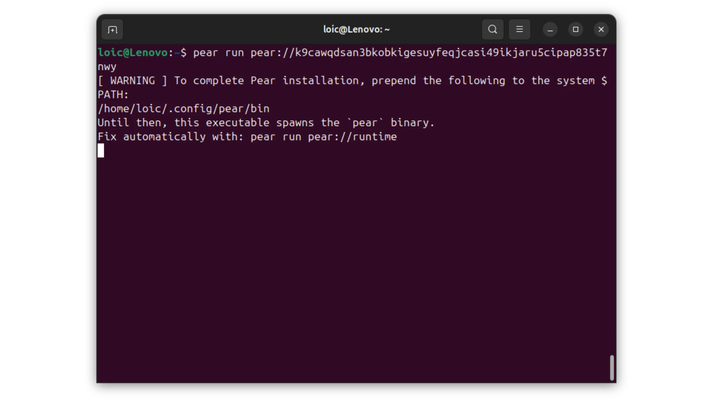


Yüklendikten sonra, Plan ₿ Academy Pears ortamınızda açılacak, orijinal web sitesinde olduğu gibi kullanılmaya hazır olacak, ancak merkezi bir sunucuya bağımlı olmayacaktır.


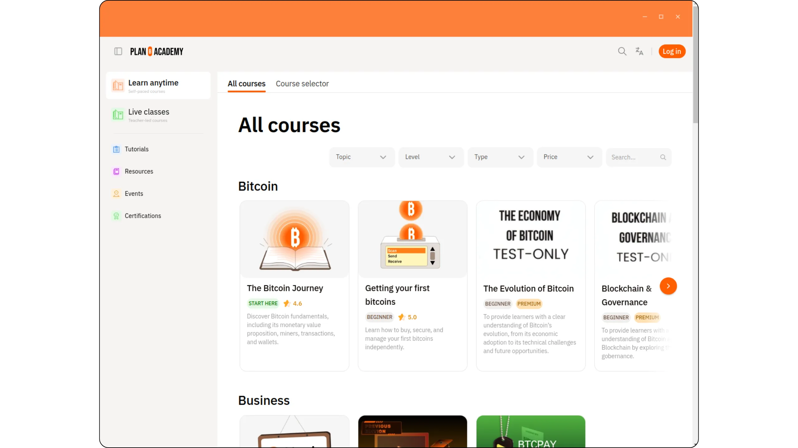