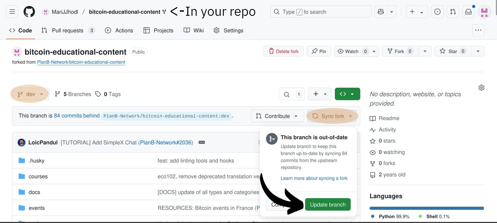
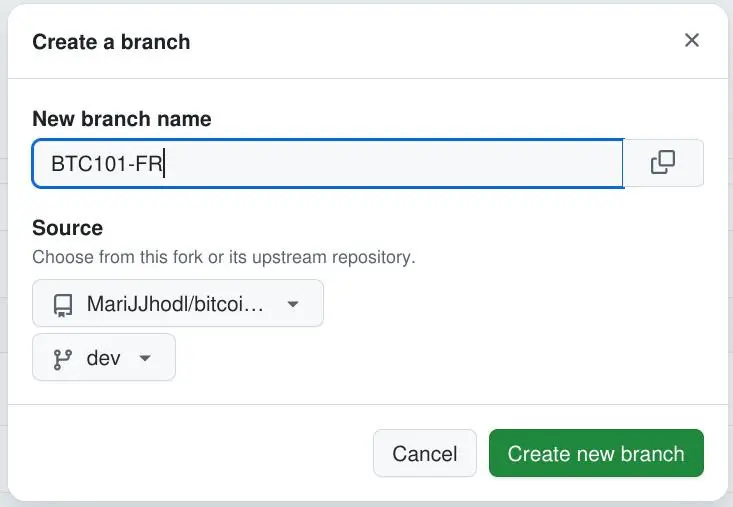
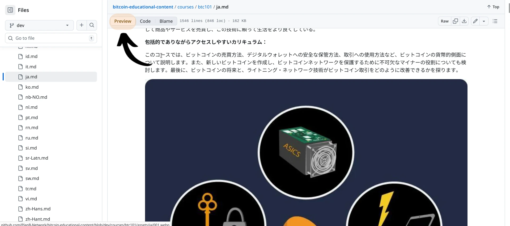
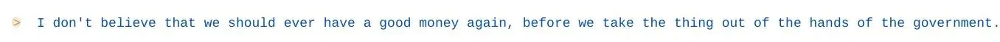
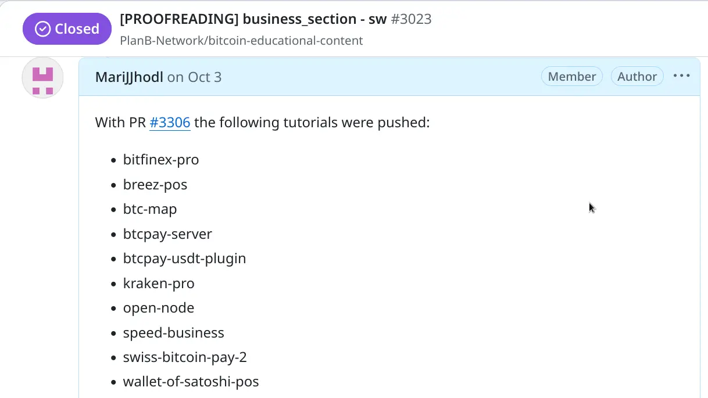
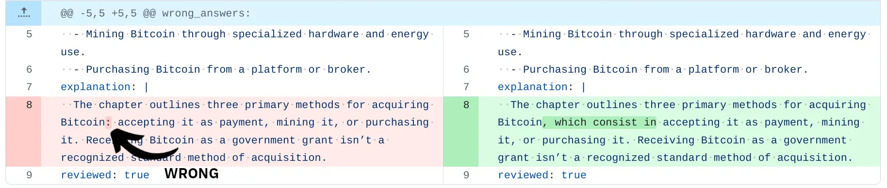
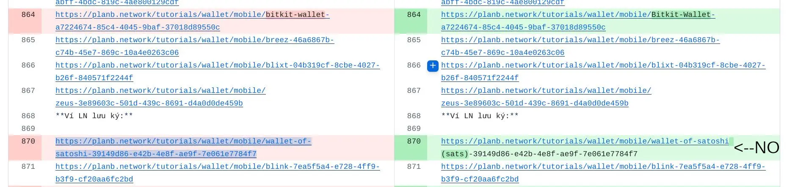
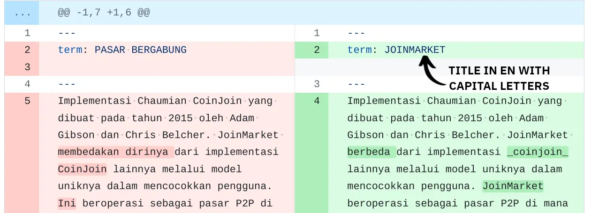
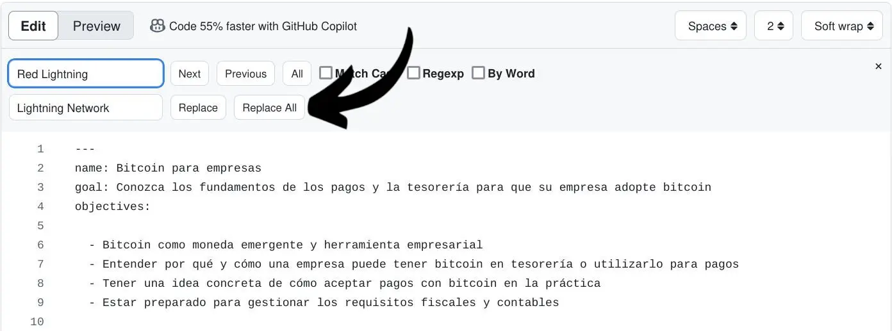
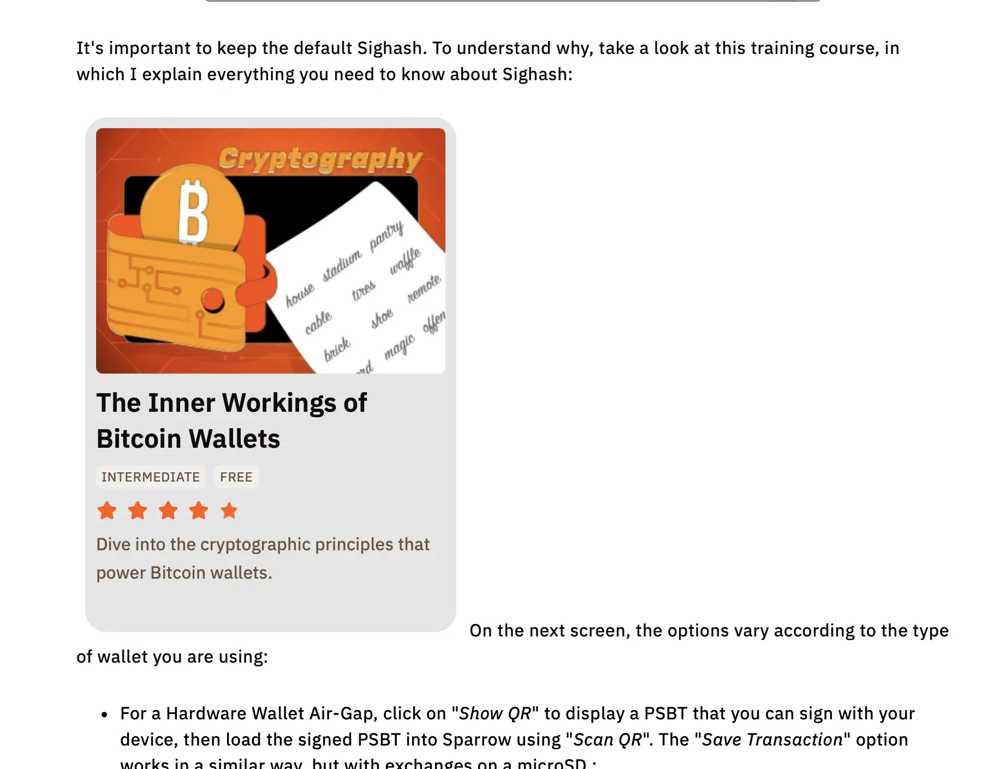

Witamy w tym samouczku dotyczącym **wytycznych, których należy przestrzegać podczas korekty treści w Plan ₿ Academy**. Cieszymy się, że podzielasz naszą misję tłumaczenia materiałów Bitcoin na jak największą liczbę języków, aby pomóc ludziom zdobyć świadomość na temat tego, jak to działa i jak można to wykorzystać w ich codziennym życiu.


Po pierwsze, współtworzenie Plan ₿ Academy [publiczne repozytorium](https://github.com/PlanB-Network/bitcoin-educational-content) daje możliwość pisania samouczków, korekty istniejących treści, a nawet zaproponowania dodania nowego języka do platformy. Aby dowiedzieć się więcej, dołącz najpierw do naszej [grupy Telegram](https://t.me/PlanBNetwork_ContentBuilder) i napisz krótką prezentację o sobie i językach, którymi potrafisz się posługiwać.


Niniejszy samouczek jest przeznaczony dla współpracowników, którzy chcą dokonać korekty treści. Większość z nich nie wie zbyt wiele o [Github](https://planb.academy/en/tutorials/contribution/others/create-github-account-a75fc39d-f0d0-44dc-9cd5-cd94aee0c07c) lub [języku Markdown](https://www.markdownguide.org/basic-syntax/), którego używamy w repozytorium, więc ważne jest, aby podzielić się kilkoma spostrzeżeniami na temat kluczowych czynników związanych z tym zadaniem.


Poniżej zebrałem najczęstsze problemy, z którymi spotykają się korektorzy. Nie krępuj się zasugerować więcej, ponieważ może to pomóc innym w poprawie.


Przed zagłębieniem się w szczegóły, pierwszą rzeczą do zrobienia jest przeczytanie tego samouczka na temat praktycznych działań, które należy wykonać na Githubie, poprzez rozwidlenie repozytorium Plan ₿ Academy, zatwierdzanie zmian i wysyłanie PR-ów:


https://planb.academy/tutorials/contribution/content/proofreading-review-tutorial-28236c98-23b2-4efd-9563-953f08707017


## Co to jest korekta?


Korekta to końcowy proces przeglądu tekstu pisanego, mający na celu zidentyfikowanie i poprawienie błędów gramatycznych, ortograficznych, interpunkcyjnych i formatowania. Zapewnia, że tekst jest jasny, spójny i wolny od błędów przed publikacją lub przesłaniem.


Podczas wykonywania tego typu zadań ważne jest, aby podążać za znaczeniem oryginalnego języka (EN lub FR), ale upewnić się, że tekst w języku końcowym jest tak płynny, jak to możliwe dla native speakera.


Zawsze pamiętaj, że tłumaczenie/proofreading to EDUKACJA!


W rzeczywistości naszym wspólnym celem jest edukowanie jak największej liczby osób na temat Bitcoin, więc ważne jest, aby materiał, który czytają, był płynny i przejrzysty.

W tym sensie wszyscy współpracownicy Plan ₿ Academy są edukatorami!


## Pierwsze kroki przed korektą w Plan ₿ Academy


Przed rozpoczęciem nowego zadania korekty należy ogłosić je w [grupie Telegram](https://t.me/PlanBNetwork_ContentBuilder) lub poinformować koordynatora Plan ₿ Academy, który otworzy dedykowane [zagadnienie](https://github.com/orgs/Plan ₿ Academy/projects/3). Po otrzymaniu linku do sprawy, po prostu **skomentuj, że zaczynasz** zadanie korekty tej treści.


System ten pomaga koordynatorowi śledzić postępy wewnątrz repozytorium i pozwala na "zastrzeżenie" treści przez korektora, zapobiegając powielaniu wysiłków przez kogoś innego.

W samym wydaniu znajdziesz linki, które przekierują Cię do treści do sprawdzenia. Możesz po prostu je kliknąć lub, jeszcze lepiej, wrócić do własnego rozwidlonego repozytorium i pracować bezpośrednio z niego. Zobaczmy, jak można to zrobić!


Po pierwsze, **ZAWSZE pamiętaj o SYNCHRONIZACJI swojego repozytorium na gałęzi "dev "**. W ten sposób zawartość będzie zawsze zaktualizowana przed rozpoczęciem jakiegokolwiek zadania i nie będzie żadnych konfliktów między starym i nowym materiałem. Upewnij się, że kliknąłeś "Synchronizuj fork" i "Aktualizuj gałąź".





Po pomyślnej synchronizacji można bezpośrednio uzyskać dostęp do interesującej zawartości i zatwierdzić w nowej gałęzi, jak pokazano w tym [samouczku](https://planb.academy/tutorials/contribution/content/proofreading-review-tutorial-28236c98-23b2-4efd-9563-953f08707017). W przeciwnym razie możesz otworzyć nową gałąź, w której chcesz pracować, klikając "Gałęzie", jak pokazano poniżej.


Na tej nowej stronie znajdziesz wszystkie oddziały, które już otworzyłeś pod tytułem "Twoje oddziały". Ta sekcja jest bardzo przydatna, ponieważ pozwala łatwo znaleźć miejsce, w którym zmodyfikowano niektóre treści. Jeśli chcesz otworzyć nowy oddział, możesz kliknąć "Nowy oddział" w prawym górnym rogu strony.


Następnie pojawi się wyskakujące okienko, w którym należy wprowadzić nazwę nowego oddziału. W poniższym przypadku wybrałem nazwę "BTC101-FR". W ten sposób zawsze będę pamiętać, że ta konkretna gałąź musi być używana do korekty kursu BTC101 w języku francuskim i **nie będę jej używać do żadnych innych zadań**.


Proponuję zrobić to samo: upewnij się, że otwierasz nową gałąź za każdym razem, gdy musisz rozpocząć nowe zadanie.





Po utworzeniu nowej gałęzi należy kliknąć na nią w sekcji "Twoje gałęzie" na poprzedniej stronie i rozpocząć pracę nad plikiem *.md* związanym z konkretną zawartością (w moim przypadku kliknę "kursy" -> "BTC101" -> "fr.md"). Wszystkie zatwierdzenia związane z określonym plikiem będą musiały zostać zatwierdzone (zapisane) w tej samej gałęzi.


## Oryginalny język czy tłumaczenie?


Podczas korekty treści ważne jest, aby **zawsze sprawdzać oryginalną wersję angielską (lub francuską)**. Należy pamiętać, że tłumaczymy za pomocą narzędzi językowych AI, więc renderowanie w języku docelowym może nie być płynne lub zrozumiałe dla końcowego czytelnika.


W związku z tym zachęcamy do wprowadzania zmian w tekście i modyfikowania zdań, jeśli zajdzie taka potrzeba. Naszym celem jest zwiększenie płynności, ale zawsze zgodnie z oryginalnym znaczeniem. W przypadku wątpliwości co do tego, jak traktować konkretne słowo, należy zapytać koordynatora tłumaczeń.


Narzędzia LLM mogą tłumaczyć niektóre słowa związane z Bitcoin dosłownie, tak jak Lightning Network. Dzieje się tak zwłaszcza w przypadku bardzo technicznych słów. W takich przypadkach zaleca się zachowanie oryginalnego angielskiego słowa w języku docelowym dla lepszej przejrzystości, chyba że zasady językowe narzucają tłumaczenie każdego słowa.


W tym drugim przypadku **zawsze sprawdź, czy ktoś inny w twojej społeczności Bitcoin nie przetłumaczył już tego słowa** i czy nie jest ono obecnie powszechnie używane.


- Jednym z rozwiązań może być **sprawdzenie na [BitcoinWiki](https://en.bitcoin.it/wiki/Main_Page)** w języku docelowym, aby sprawdzić, czy słowo zostało przetłumaczone, czy nie. Jeśli nie, słowo pozostaje w języku angielskim.


- W każdym przypadku radziłbym **wstawić słowo EN mimo wszystko**, dodając odpowiadające mu znaczenie w języku docelowym w nawiasie okrągłym, zgodnie ze schematem EN (LANG) lub odwrotnie. Np. Address (indirizzo), lub indirizzo (adres).


- Innym dobrym rozwiązaniem jest zachowanie oryginalnego słowa/zwrotu, a następnie **utworzenie hiperłącza**, które przekierowuje do [glosariusza](https://planb.academy/en/resources/glossary) na planb.network. Aby to zrobić, musisz wstawić słowo/frazę w nawiasach kwadratowych, a link w nawiasach okrągłych, jak widać na poniższym przykładzie:


```
[UTXO](https://planb.academy/resources/glossary/utxo)
```


W efekcie końcowym (obrazek poniżej) nie będzie widoczny cały link, a słowo stanie się klikalne.


Należy pamiętać, że link do glosariusza, który zostanie pobrany ze strony internetowej, zawiera kod języka po słowie "sieć" (przykład: ``https://planb.academy/en/resources/glossary/utxo``-> tutaj można odczytać kod języka "en"). W takim przypadku należy **usunąć kod języka z linku**, jak widać w ramce powyżej. W ten sposób system automatycznie przeniesie czytelnika do wyznaczonego języka.


Zawartość repozytorium jest pełna hiperłączy, takich jak te powyżej. Teraz, gdy już wiesz, co one oznaczają, **upewnij się, że nie usuniesz żadnego linku** wstawionego przez oryginalnego autora.


- Kolejna rzecz związana z renderowaniem słów jest następująca. Jeśli w tekście znajduje się "Plan ₿ Academy", **pozostaw je w tej oryginalnej formie**. Nie tłumacz słowa "plan" ani słowa "network". Ponadto, NIE używaj przedimka "The" przy wprowadzaniu Plan ₿ Academy: **traktuj ją jako markę**.


- To samo dotyczy "₿-CERT", "BIZ SCHOOL", "TECH SCHOOL", które również powinny być zachowane w oryginalnej formie.


Ostatnia uwaga do tego akapitu: jak wspomnieliśmy powyżej, używamy narzędzi AI do tłumaczenia treści, a następnie prosimy o interwencję współpracowników, aby upewnić się, że wszystko jest płynne i dobrze sprawdzone.


Jeśli użyjesz SI do korekty większości tekstu, z pewnością to zauważymy, ponieważ znamy typowe struktury zdań generowane przez SI. Jeśli okaże się, że korekta polegała wyłącznie na sztucznej inteligencji, bez wprowadzenia znaczących zmian, ostateczna nagroda w sats może zostać zmniejszona o połowę!


## Struktura nagłówków


W języku markdown nagłówki (i tytuły akapitów) zaczynają się od znaku hash ``#``. Liczba znaków hash odpowiada poziomowi nagłówka. Na przykład nagłówek poziomu trzeciego ma trzy znaki numeryczne przed tekstem (np. `## My Header`).


W kursach najważniejsze części są wprowadzane za pomocą jednego znaku hash, podczas gdy podczęści mogą mieć od dwóch do czterech znaków hash. W samouczkach zwykle używamy tylko nagłówków z dwoma znakami hash.


Upewnij się, że **nigdy nie usuwasz znaków skrótu** przed tytułem, w przeciwnym razie spowodujesz problemy ze strukturą tekstu.


Jednocześnie **nie zmieniaj** części chapterID, którą możesz zobaczyć na powyższym obrazku, ``<chapterId>d668fdf6-fb4c-4bbf-82e1-afcb95c122e0</chapterId>`` lub odniesień do wideo, takich jak ``:::video id=ba99951f-81d2-418f-b5e7-4b8c9f8b8cc8:::``.


Gdy wstawimy ``#`` przed tytułem, zostanie on automatycznie pogrubiony w podglądzie kursu, więc **unikamy pogrubiania tytułów podczas korekty**.


Na marginesie, w angielskiej wersji kursów **tytuły wprowadzane przez jeden lub dwa ``#`` mają wszystkie słowa zaczynające się wielkimi literami**, podczas gdy tytuły zaczynające się od trzech lub czterech ``#`` zwykle nie przestrzegają tej zasady. Jeśli to możliwe, upewnij się, że tytuły w języku docelowym są zgodne z tą strukturą.


## Początkowa sekcja kursów


Na początku każdej treści znajdują się następujące statyczne słowa pisane małymi literami: "nazwa", "opis", "cele". Są one używane przez witrynę do dekodowania samej treści i **zawsze pozostają w EN**. W związku z tym NIE należy ich tłumaczyć, w przeciwnym razie treść spowoduje problemy z synchronizacją. Upewnij się, że sprawdzasz tylko część po dwukropku, która jest automatycznie tłumaczona przez sztuczną inteligencję.


W tej samej sekcji początkowej zachowaj dotychczasowy format. Nie dodawaj niczego na początku tekstu. Np. unikaj dodawania "tt" przed myślnikami, jak na poniższym obrazku!


## Jak radzić sobie z obrazami kursów


Nasza strona internetowa zawiera teraz przetłumaczone obrazy dla prawie każdego kursu!


Podczas korekty zawsze sprawdzaj, czy wszystkie obrazy są obecne i wyświetlane poprawnie. W widoku `code view`, jeśli znajdziesz taką linię ``, oznacza to, że zostanie tam wyświetlony obrazek.


Upewnij się, że zawsze dodajesz nową linię między kodem obrazu a tekstem. Przykład poniżej:


```
WRONG CONFIGURATION:
- to start translating, click on the button `Translate`: 
To save, click on `save`!


RIGHT CONFIGURATION:

- to start translating, click on the button `Translate`:


To save, click on `save`!
```


Poza tym pamiętaj, aby zapoznać się z treścią każdego obrazu. Jeśli zauważysz jakiekolwiek problemy z tłumaczeniem tekstu znajdującego się na obrazkach, poinformuj o tym swojego koordynatora, a otrzymasz szansę na ich korektę!


Możesz zwizualizować obraz w sekcji `Preview` na Githubie (lub na naszej stronie internetowej, otwórz w innej karcie). Następnie wróć do sekcji `code` obok, aby dokonać korekty.





## Zalecenia dotyczące formatu


Poniżej znajduje się kilka przykładów kwestii formatu, na które należy zwrócić uwagę podczas korekty treści w języku docelowym.


- Zwróć uwagę na dziwne znaki interpunkcyjne, takie jak `\*\*` lub ``**``, które mogą reprezentować złe renderowanie pogrubionego symbolu. Na poniższym obrazku widać, że gwiazdki znajdują się tylko po prawej stronie słowa, co wygląda dziwnie.


Dlatego zawsze sprawdzaj oryginalny tekst w języku angielskim, aby zobaczyć, czy pogrubiony tekst powinien się tam znajdować. W takim przypadku wystarczy dodać dwie gwiazdki na początku słowa, aby poprawnie wyświetlić je na stronie internetowej. W rzeczywistości, w języku markdown, **aby wyrenderować pogrubienie, należy wstawić dwie gwiazdki ``**`` zarówno przed, jak i po słowie/zdaniu** (patrz przykład poniżej).





- Te same problemy mogą wystąpić w przypadku symboli takich jak $ i `` ``.

Upewnij się, że sprawdziłeś oryginalny plik językowy (często EN lub FR), aby zobaczyć, gdzie powinny znajdować się te symbole. Zawsze możesz poprosić koordynatora o pomoc w tej kwestii.


- Jeśli znajdziesz cytaty, poszukaj w Internecie odpowiedniego tłumaczenia na swój język. Cudzysłowy są zwykle wstawiane po symbolu ``>``.


## Korekta samouczka


Jeśli zdecydujesz się na korektę samouczków, koordynator otworzy dedykowane zgłoszenie dla **całej sekcji samouczków**. Po zakończeniu zadania możesz udokumentować swoje postępy, komentując w zgłoszeniu z listą sprawdzonych samouczków: w ten sposób tworzysz przejrzysty system śledzenia do wykorzystania w przyszłości, co jest ważne, ponieważ co miesiąc dodawane są nowe treści. Przykład takiego podejścia można zobaczyć [tutaj](https://github.com/PlanB-Network/bitcoin-educational-content/issues/3023#issuecomment-3364923190).





Ponieważ nowe samouczki są dodawane co miesiąc, gałąź może stać się nieaktualna podczas procesu korekty. Niektórzy korektorzy radzą sobie z tym problemem poprzez synchronizację gałęzi, w której pracują: **NIGDY tego nie rób! Jeśli to zrobisz, ryzykujesz utratę wszystkich postępów poczynionych do tego momentu!


Zamiast tego powinieneś najpierw dokończyć korektę samouczków w bieżącym fork. Następnie **synchronizuj `dev`** i utwórz nową gałąź, w której skupisz się na korekcie nowo dodanych samouczków (tylko tych, których brakuje w poprzedniej gałęzi).


W samouczkach istnieje możliwość, że **obrazy nie zostaną przetłumaczone**. Ponieważ większość samouczków jest **oryginalnie napisana w języku francuskim lub angielskim**, prawdopodobnie znajdziesz obrazy zawierające polecenia lub instrukcje w ich oryginalnym języku. Weźmy przykład z samouczka dotyczącego Sparrow w języku holenderskim, zgłaszając zarówno tekst, jak i powiązany z nim obraz.


```
Verbinding maken met een openbaar knooppunt is heel eenvoudig. Klik op het tabblad "_Publieke server_".
```


Jak widać, obrazek wyraźnie wskazuje na `Public Server` w języku angielskim, podczas gdy tekst wspomina o wyrażeniu `_Publieke server_`. W tym przypadku występuje problem spójności, ponieważ czytelnik znajduje sprzeczne informacje, konfrontując obraz z tekstem.


Aby rozwiązać tę kwestię, możesz wstawić polecenie w takiej formie, w jakiej pojawia się na obrazie (angielskie lub francuskie), a następnie tłumaczenie w swoim języku w nawiasach, jak pokazano poniżej:


```
Verbinding maken met een openbaar knooppunt is heel eenvoudig. Klik op het tabblad "_Public Server_" (Publieke server).
```


## Korekta quizów


Czy wiesz, że możesz również sprawdzać pytania quizowe w każdym kursie? Na przykład, jeśli chcesz zweryfikować quizy dla BTC101 w IT, możesz otworzyć dedykowaną gałąź i podążać następującą ścieżką: "kursy" -> "BTC101" -> "quiz". Znajdziesz tam wszystkie foldery poświęcone każdemu pytaniu, wraz z powiązanym plikiem językowym w formacie _yml_.


Ponownie, upewnij się, że jesteś w dedykowanym oddziale, który otwierasz specjalnie w tym celu i zawsze informuj o tym koordynatora.


Ważną rzeczą, o której należy pamiętać podczas korekty tego typu plików _yml_, jest unikanie dodawania dwukropków ``:`` lub znaków cudzysłowu wewnątrz tekstu. W rzeczywistości dwukropek jest **tylko** używany do oddzielania par klucz-wartość, takich jak "wrong_answers" od reszty. Przykład można zobaczyć na poniższym obrazku:





Po sprawdzeniu pytania upewnij się, że zmieniłeś status "sprawdzone" z "fałszywe" na "prawdziwe", jak pokazano na poniższym obrazku. Pamiętaj, aby **zachować te słowa statusu w języku angielskim**, bez względu na język, w którym pracujesz!





Jeśli brakuje linii statusu "reviewed:true", upewnij się, że **dodałeś ją na końcu quizu**.


## Korekta słowniczka


Podobnie jak w przypadku quizów, możesz również sprawdzić słowniczek. Oryginalny słowniczek został napisany w języku francuskim, więc znajdziesz w nim zdania takie jak: "W języku francuskim wyrażenie to można przetłumaczyć na..."


W takich przypadkach należy dostosować zdanie do języka docelowego lub angielskiego. Na przykład można napisać "W języku angielskim wyrażenie to...".

Jeśli tytuł jest w języku angielskim, możesz dostosować zdanie do swojego języka: "W języku suahili wyrażenie to..."


Dodatkowo, upewnij się, że tytuły są pisane WIELKIMI LITERAMI.





## Tytuł i opis PR


Kiedy wysyłasz swój PR, byłoby wspaniale, gdybyś nazwał go w tym formacie: [KOREKTA] NAZWA TREŚCI - JĘZYK:


```
[PROOFREADING] BTC101 - ENGLISH
```


Poza tym, w sekcji **komentarza PR**, możesz wpisać "zamyka" + numer sprawy, którą koordynator wysłał ci, gdy rozpocząłeś zadanie korekty, poprzedzony ``#``.

Na przykład, jeśli właśnie wysłałeś PR z korektą cyp201 + quizy, możesz napisać "zamyka [#2934](https://github.com/PlanB-Network/bitcoin-educational-content/issues/2934)".


W ten sposób PR i wydanie zostaną połączone, a każdy, kto czyta publiczne repozytorium Github, może łatwo znaleźć informacje.


## Inne najlepsze praktyki


- Jeśli chcesz wyszukać określone słowa w tekście, możesz kliknąć ``CTRL+F``, a pojawi się sekcja wyszukiwania-zamiany. Ta część jest bardzo przydatna, gdy trzeba przejść do określonej części tekstu lub zastąpić określone słowa / zdania w partii, bez przewijania całej zawartości.





Podczas korzystania z funkcji "zamień wszystko" ważne jest, aby dwukrotnie sprawdzić wyniki, aby upewnić się, że linki również nie zostały zmienione. Na przykład, jeśli chcesz zmienić słowo "Bitcoin" na "Bitkoin" (co może być konieczne w niektórych językach), użycie funkcji "zamień wszystko" może skutecznie zaktualizować wszystkie wystąpienia w tekście. Należy jednak pamiętać, że narzędzie to zmodyfikuje również wszystkie linki zawierające to słowo, potencjalnie prowadząc do problemów z przekierowaniem.


W poniższym przykładzie korektor użył powyższej funkcji, aby zamienić "satoshi" na "satoshi(sats)", a także zmienił link do samouczka zawierającego samo słowo. W rezultacie link stał się nieprawidłowy.


Zawsze dokładnie sprawdzaj wszystkie hiperłącza w tekście, aby upewnić się, że są poprawne.


- Kontynuując temat, jeśli autor wstawi link odnoszący się do kursu lub samouczka Plan ₿ Academy (**nie** w nawiasie), strona automatycznie utworzy "kartę" pokazującą powiązaną miniaturę. W związku z tym zawsze upewnij się, że **dodałeś nową linię między tekstem a samym linkiem**, w przeciwnym razie na stronie może pojawić się następujący błąd.





## Wnioski


Podsumowując, świadomość typowych błędów korektorskich może naprawdę pomóc w doskonaleniu umiejętności sprawdzania treści. Łatwo jest przeoczyć takie rzeczy jak kontekst lub spójność, a wychwycenie tych błędów może mieć duże znaczenie.


Zawsze pamiętaj, że początkujący mogą czytać te kursy i samouczki, więc naszym obowiązkiem jest upewnienie się, że w pełni je rozumieją. **Jako korektor, jesteś edukatorem!


Teraz możesz rozpocząć korektę kursów, samouczków, quizów i słowniczków. Bądź na bieżąco, aby rozpocząć sprawdzanie transkrypcji wideo!


Dziękujemy za przeczytanie tego poradnika i życzymy miłej podróży!