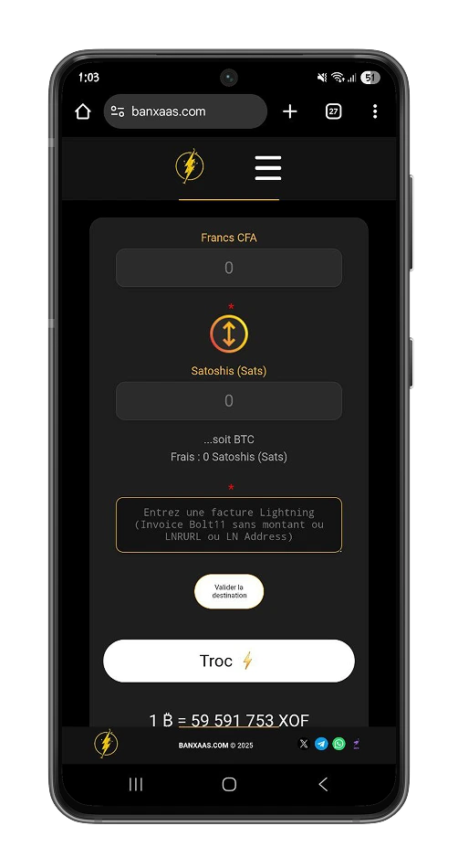
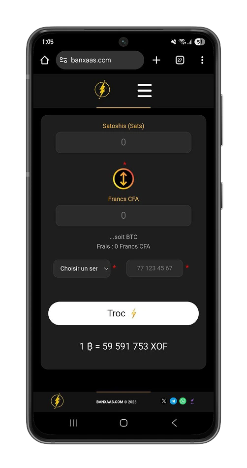
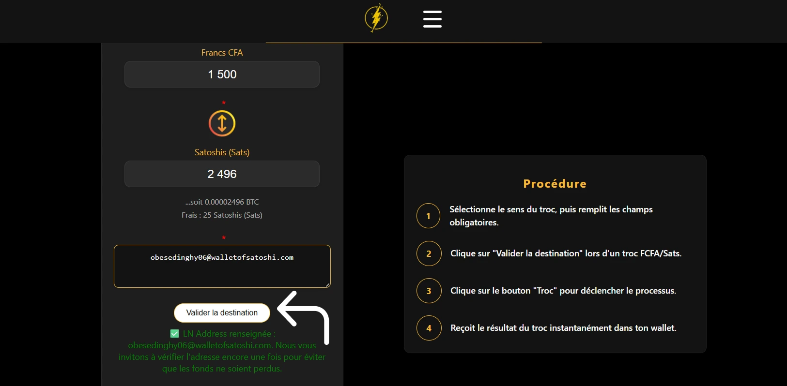
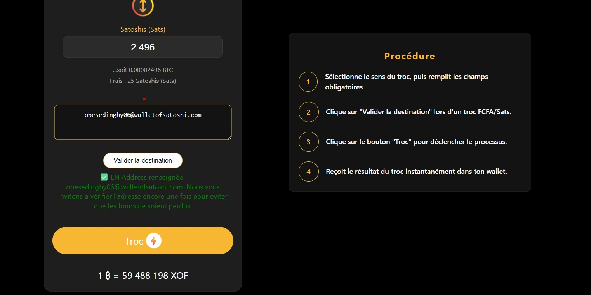
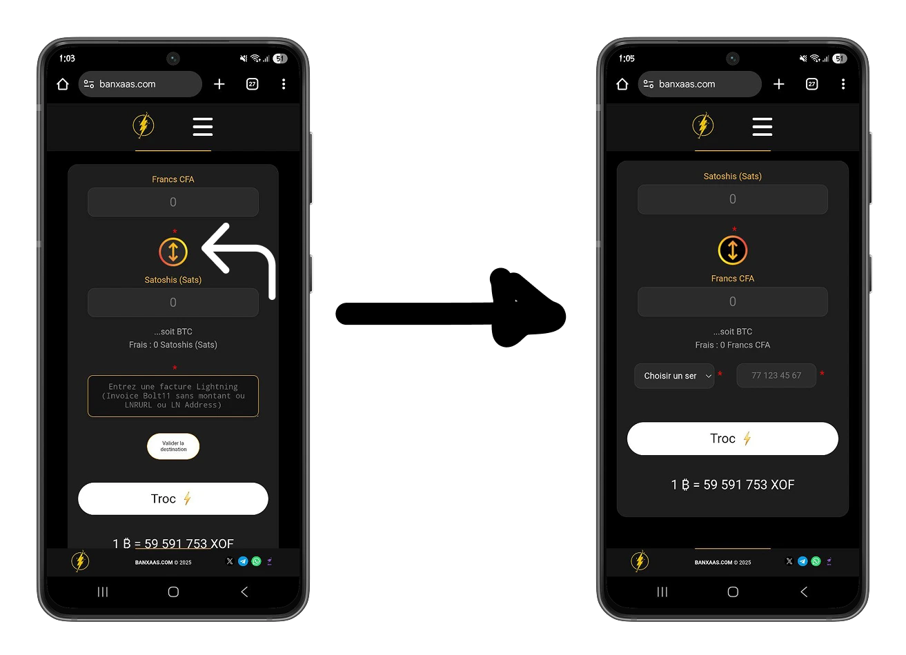
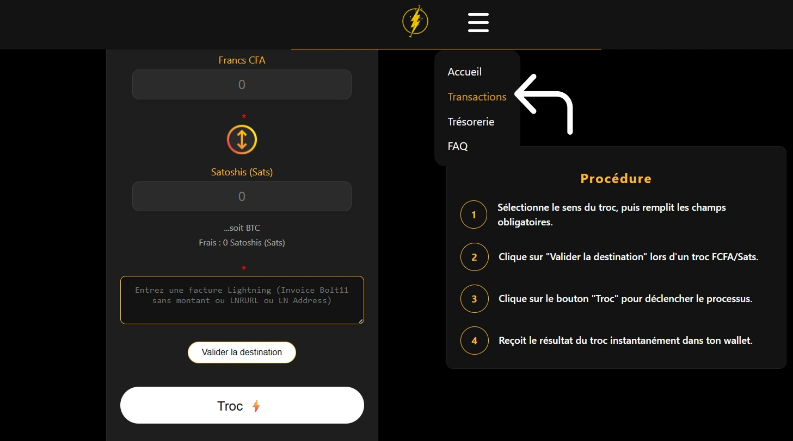
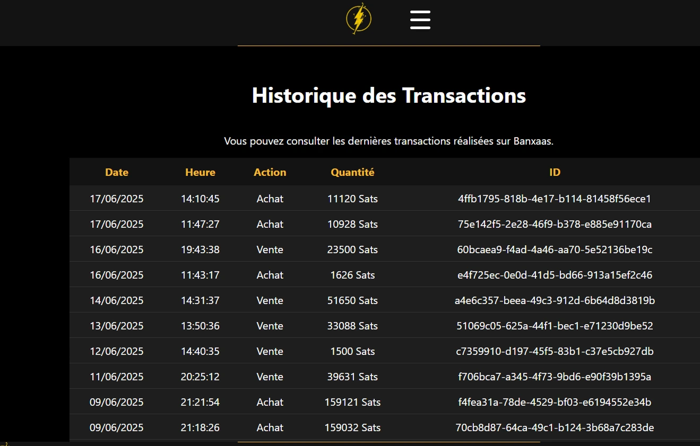
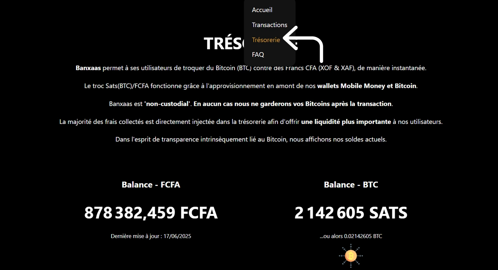
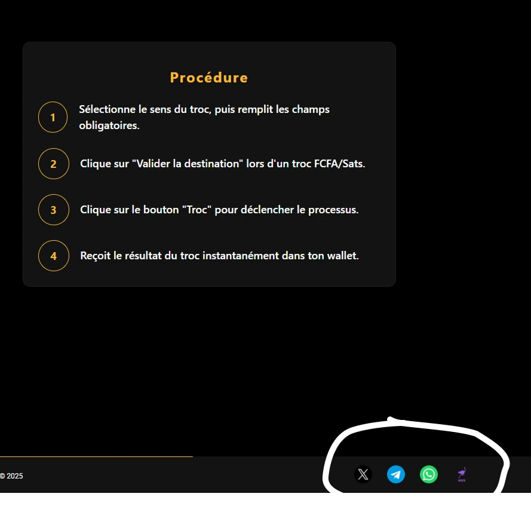

L'avvento di Lightning Network ha segnato l'inizio del mainstream di Bitcoin, offrendo possibilità istantanee e meno costose rispetto alla rete principale del protocollo Bitcoin (Mainnet).

Oggi l'accesso a Bitcoin rappresenta una sfida innovativa nei Paesi sottosviluppati e/o emergenti, per compensare ad un certo fallimento del sistema finanziario locale.

In questo tutorial, scopriamo **Banxaas**, una piattaforma di scambio che avvicina il popolo senegalese a Bitcoin.

## Come iniziare con Banxaas

Banxaas deriva dal dialetto senegalese (Wolof) e significa "ramo". Ideologicamente, possiamo vedere Banxaas come un ramo che lega il popolo senegalese all'utilizzo di Bitcoin. Un ramo su cui fare affidamento per proteggere i propri risparmi dall'inflazione e dalla censura. Sviluppata da una start-up senegalese (Yité Technologies), [Banxaas](https://banxaas.com) offre un servizio istantaneo Exchange tra Bitcoin e il franco CFA (XOF) e viceversa, grazie alla potenza di Lightning Network. Banxaas ha un approccio inusuale alle piattaforme di scambio nella sottoregione dell'Africa occidentale.

- Banxaas è una piattaforma non-custodial: non è necessario creare un account o possedere un Wallet sulla piattaforma. Mantieni il controllo del tuo denaro e l'anonimato è rafforzato.

https://planb.network/tutorials/exchange/centralized/flash-fd4308b0-7afd-450f-90e9-d37ad90ae770

- Contabilità trasparente: Banxaas favorisce la trasparenza, rafforzando al contempo l'anonimato nelle transazioni finanziarie.

https://planb.network/tutorials/privacy/analysis/mempool-space-f3e468a1-92f1-43ce-b2e4-c3298fa0e02f

### Trading per la prima volta con Banxaas

La prima cosa da fare su [banxaas](https://banxaas.com) è definire la direzione del proprio scambio:

- hai dei franchi CFA e desideri convertirli in Bitcoin.

-  hai dei bitcoin e vorresti convertirli in franchi CFA

La piattaforma web di Banxaas è minimalista e intuitiva, consente di completare la transazione in un solo minuto. Dopo aver definito la direzione dello scambio, inserisci l'importo che desideri inviare nel primo campo di testo del modulo, oppure inserite l'importo che desideri ricevere.

- Dal franco CFA ai satoshi:

Banxaas copre l'intero territorio senegalese con i due principali operatori di telefonia mobile. Con l'aiuto del loro gestore di pagamenti (DexchangePay), la piattaforma supporta principalmente :

- Orange Money
- Wave
- Wizall Money

Quando si avvia una conversione da franchi CFA a Bitcoin, si aggiunge l’Address Lightning o una Invoice senza importo creata dal Wallet Lightning nel campo di destinazione.

https://planb.network/tutorials/wallet/mobile/blitz-wallet-794bdac4-1af4-49d5-9ea5-abb8228ca196

https://planb.network/tutorials/wallet/mobile/speed-wallet-8715e454-1720-4a7f-8c1d-3da02cf67312

Banxaas consente di verificare l'accuratezza della ricezione Bitcoin Address cliccando sul pulsante **Valida destinazione**.

Conferma la transazione cliccando sul pulsante **Troc** per acquistare Bitcoin con i tuoi franchi CFA.

- Da Satoshi a Franchi **CFA**

Banxaas permette di convertire i bitcoin in franchi CFA e di riceverli su due operatori disponibili in Senegal.

- Orange Money Senegal
- Wave Senegal

Clicca sul pulsante **Troc** per pagare l’Invoice Lightning che verrà generata e ricevere l'importo equivalente sul proprio Mobile Money.

Più che una semplice piattaforma di conversione, Banxaas è un servizio che consente l'utilizzo di bitcoin come mezzo di pagamento. Attraverso la piattaforma, è possibile pagare i pasti, fare la spesa e pagare le attrezzature utilizzando i satoshi, barattando **Satoshi in CFA Franc** e fornendo il numero di cellulare Money del venditore.

### La trasparenza al centro del processo

La trasparenza è un pilastro importante per Banxaas, per ridurre al minimo la censura e consentire agli utenti della soluzione di giudicare la sua affidabilità.

Nel menu Transazioni è possibile visualizzare le transazioni recenti senza avere accesso alle informazioni dell'utente: Banxaas chiede solo il numero di telefono o il Lightning Address. Ogni transazione è unica e identificata da un UUID (Universal Unique Identifier).

E non finisce qui. È anche possibile consultare, nel menu **Tesoreria**, la posizione di cassa in Franchi CFA (con gli aggregatori di pagamento) e il saldo del portafoglio Bitcoin utilizzato da Banxaas. Questo approccio è una novità assoluta nella subregione dell'Africa occidentale e consente agli utenti di valutare lo stato delle finanze della piattaforma.

Il team di Banxaas è a vostra disposizione per aiutarvi a risolvere qualsiasi problema. Potete contattare l'assistenza clienti tramite i loro social network:

- [X](https://x.com/banxaas_sn)
- [Telegramma](https://t.me/banxaas_app)
- [Whatsapp](https://chat.whatsapp.com/JOjCpBoHXow2ljOJFBMVnX)
- [Nostr](https://iris.to/npub1glle49lugnkrqwjwhlt5rjz9p6gypatxwy409nc3rfmn9gfzj2psrhh7zy)

Ora avete imparato a usare la piattaforma Banxaas per Exchange i vostri bitcoin e potenzialmente inviare denaro in Senegal usando i vostri satoshis.

Date un'occhiata anche al nostro tutorial su Peach, una piattaforma peer-to-peer Exchange che vi permette anche di acquistare e vendere bitcoin senza compromettere la vostra riservatezza.

https://planb.network/tutorials/exchange/peer-to-peer/peach-c6143241-d900-4047-9b73-1caba5e1f874
