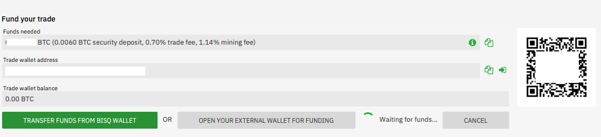
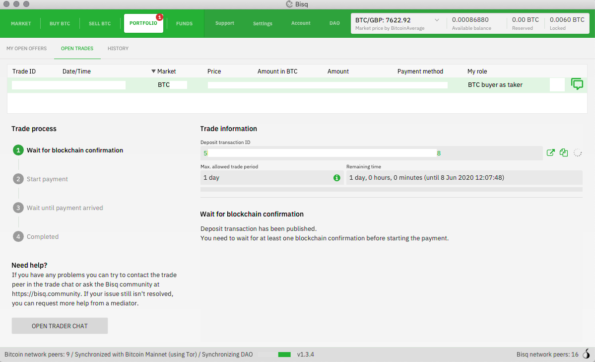
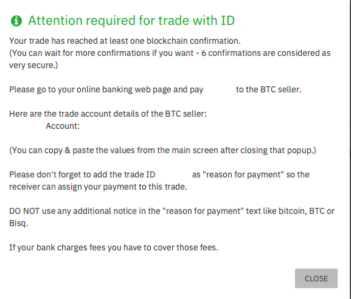
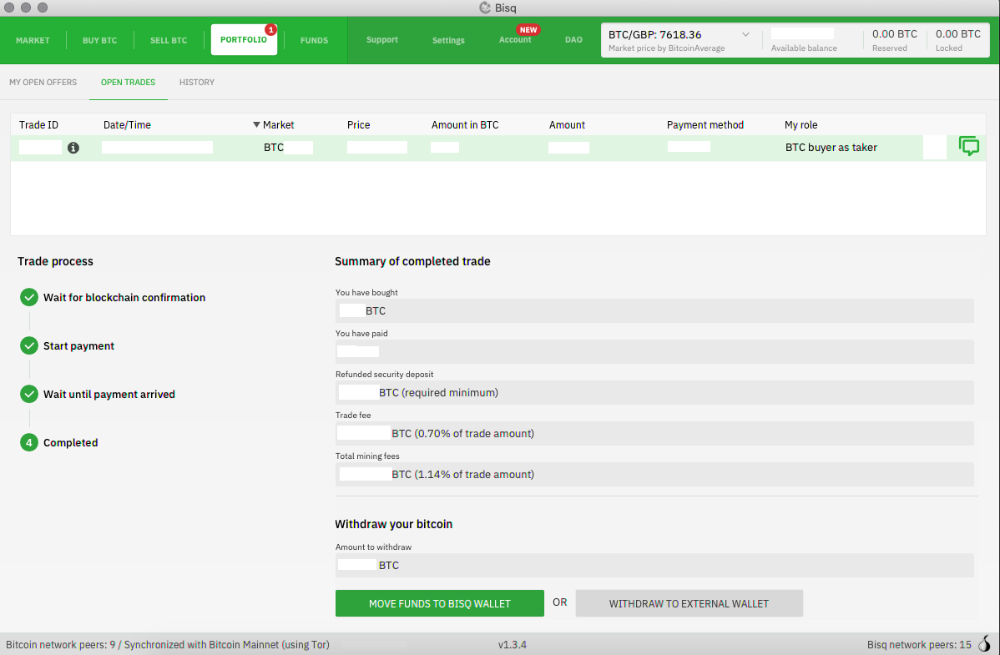

# BISQ: peer to peer exchange

Bisq is a decentralized trading platform for digital assets, primarily Bitcoin. It provides direct, secure, and private transactions between users worldwide without the need for an intermediary.

Website: https://bisq.network/
info: https://bisq.network/getting-started/

_Be careful not to do anything haphazardly, Bisq is an advanced solution. Once set up, it is very powerful, but if you are a complete beginner, it may not be suitable for you._

## tutorial video

Full tutoriel by BTC Session:

## Writting guide:

Original guide from the bisq team: https://bisq.network/getting-started/

_If you konw of a more uptodate guide with image and more beginners oriente, fee free to share it with us!_

1. Download and Install Bisq

You can download and install Bisq easily from this website (https://bisq.network/downloads) or from GitHub (https://github.com/bisq-network/bisq/releases/latest).

It's also a good idea to verify your installer file to be extra sure it hasn't been meddled with. See the videos here for directions. More details are in this wiki article. (https://bisq.wiki/Downloading_and_installing)

If you'd like to build Bisq from source, here are directions (https://github.com/bisq-network/bisq/blob/master/docs/build.md). Bisq is free/libre open-source software that you can contribute to. (https://bisq.wiki/Contributor_checklist)

2. Back Up Keys, Write Down Seed

With Bisq, you're in total control of your funds and your data. This means you retain unparalleled sovereignty, but it also means no one can help you if you lose something important—so it's critical that you do proper backups before using Bisq to trade.

We've also prepared a short tour of the Bisq interface so you can make the most of it.

More details are on the wiki: writing down your seed words and backing up
your data directory. (https://bisq.wiki/Backing_up_application_data)

3. Create a Payment Account

In order to trade bitcoin on Bisq, you've got to set up some way to send or receive other funds. Bisq only handles the bitcoin side of a trade—the other side is handled through fiat payment services (banks, money orders, cash) or altcoin wallets.

Not sure which kind of payment account to set up? There's a full list of payment methods on the wiki (https://bisq.wiki/Payment_methods). If you'll be trading fiat, please make sure you see the account limits video or read this article on the wiki.(https://bisq.wiki/Account_limits)

There are many altcoins available for trading on Bisq. Here are some tips for top markets:

- Monero. If sending XMR, make sure your wallet is capable of providing the transaction key, transaction ID, and recipient's address.
- BSQ. You can find your BSQ address in DAO > BSQ Wallet > Receive.
- Liquid BTC. If receiving L-BTC, you must use a wallet that can reveal your blinding key, like the core Elements software (Blockstream Green won't work, as of this writing).

4. Do a Trade

Making an offer will usually get you a better price and more control (e.g., setting payment method and deposit percentage), but taking an offer can be more convenient.

See trading fees here(https://bisq.wiki/Trading_fees).

You'll notice offer makers pay a lot less. Note that there's a mobile app for iOS and Android you can use to get notifications for new offers and action items on open trades. To see both sides of a Bisq trade at the same time, side-by-side, be sure to check out our Bird's Eye View of a Bisq Trade video.

That's it—the bare essentials of getting started with Bisq.

## Step by step guide ofr trade

Step by Step guide by Bitcoiner.guide, aka bitcoinQ&A https://bitcoiner.guide/bisq/

3. Now that your payment method is setup you can go to the ‘Buy BTC’ tab and see the sellers offering bitcoin in exchange for your chosen payment method. Here you can see the BTC price, percentage difference compared to the ‘spot’ price and the quantity of bitcoin for sale from each seller. Once you have found an offer you like, click ‘Take offer to buy BTC’.

4. This will take you through to a screen this screen for you to check and confirm details before entering the trade. When you are happy, hit ‘next step’.

5. You now need to fund your trade wallet with a small amount of bitcoin which acts as a security deposit. This is usually around 15% of the trade size. The seller also has to post a deposit on their side.

6. You can now confirm the offer and start the trade

7. You will now have a very short wait while the Bitcoin network confirms the trade’s transaction which puts both parties security deposits into the escrow multi-sig.

8. After one confirmation on chain you will then see a window with the sellers details for you to send payment to.

9. Once you have sent the payment, press the button to confirm you have done so and then wait for the seller to confirm they have received your funds. At this point you can also chat with your trading partner via end to end encrypted messaging buy pressing ‘Open trader chat’.

Once the seller confirms receipt of funds, the purchased bitcoin along with your security deposit will be released into your Bisq wallet.

10. Thats it, your first trade is now complete! You can now either withdraw your bitcoin to an external wallet or leave in your Bisq account.

## The tradeoffs with buying non-KYC (by bitcoin Q&A)

As simple as buying on Bisq is, there are some tradeoffs to be aware of.

1. You need BTC before you trade to form a security deposit. Not a problem if you have been around for a while but could become an issue if you want to use Bisq as your first buy. Your best option in this instance is to get some bitcoin from a friend or family member.

2. KYC free bitcoin often attracts a premium above the spot price which can put some buyers off. As I discussed earlier, this is about tradeoffs and I would personally would be happy to pay 5-8% above spot price for the luxury of keeping my personal data safe.

If you are not in a rush to purchase then you can also set up a ‘Buy Offer’ where you can let the Bisq network know that you are willing to purchase an amount of bitcoin at a certain price relative to the market value. If a seller comes along and likes your offer they can take you up on it.

3. Decentralised exchanges can sometimes suffer from liquidity shortages when compared with larger centralised entities. If you are looking to buy larger amounts more frequently, you may struggle.

4. Although it has never happened to me, sometimes peer to peer trading doesn’t work out as intended and users will need to go through the dispute resolution process. Fortunately due to the way Bisq’s incentive structures are built, these instances are few and far between.

As with most things Bitcoin related, the whole KYC/Non-KYC debate is nuanced and full of tradeoffs. I get it, the most common fiat onramps like Coinbase and CashApp make life very easy to buy, particularly for newbies, but please take a second to consider the tradeoffs and look into the alternatives before giving away your personal information so readily.
