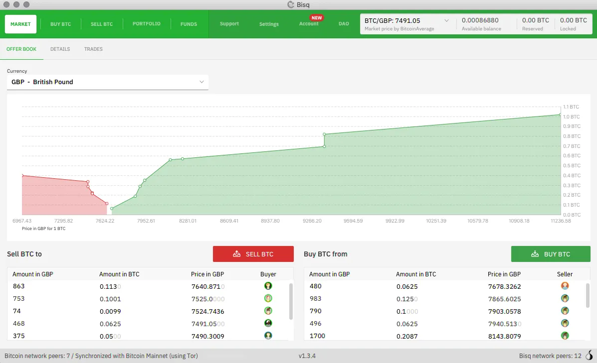
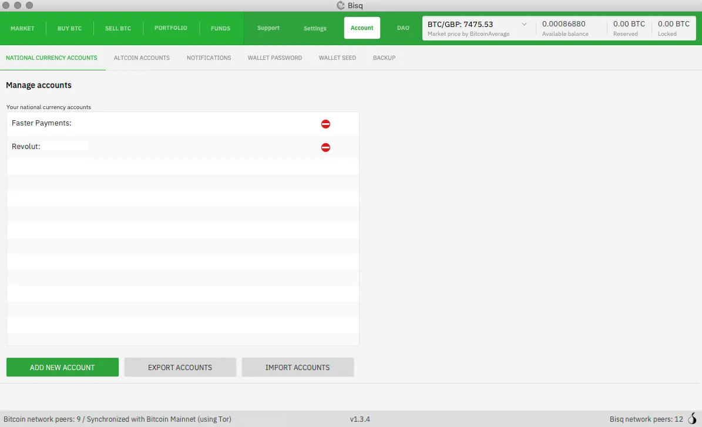
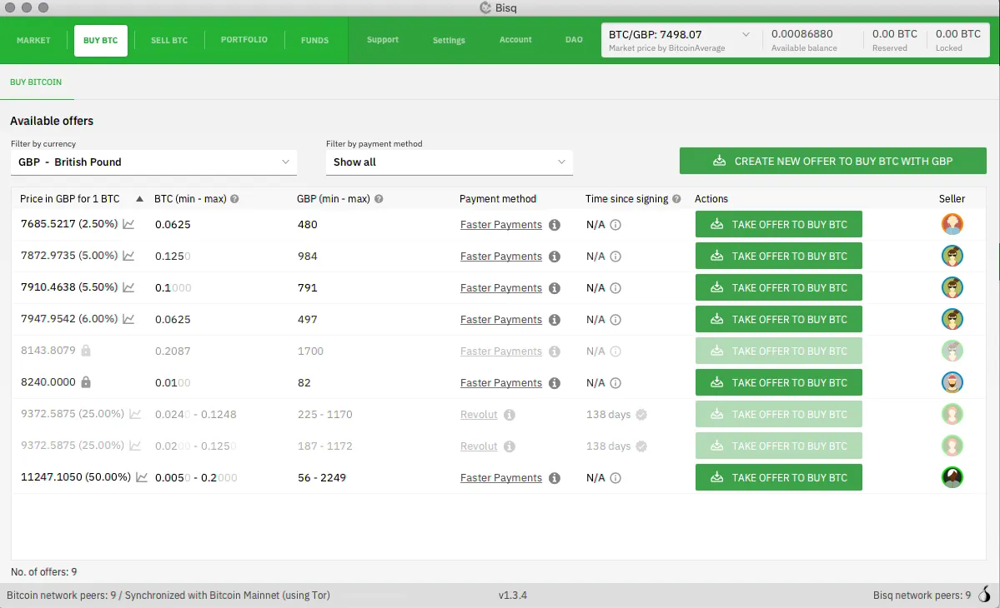
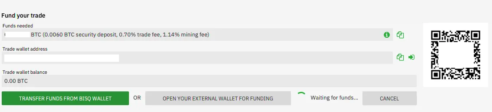
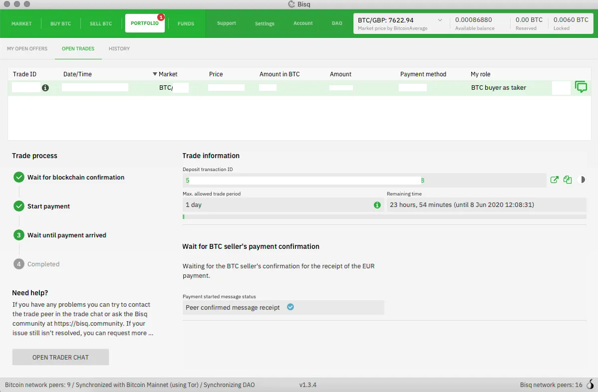

Bisqは、主にBitcoinのための分散型取引プラットフォームです。仲介者なしで、世界中のユーザー間で直接、安全、かつプライベートな取引を提供します。

ウェブサイト: https://bisq.network/
情報: https://bisq.network/getting-started/

_Bisqは高度なソリューションですので、何かを無計画に行うことは避けてください。設定が完了すれば非常に強力ですが、完全な初心者の場合、適していない可能性があります。_

## チュートリアル動画

BTCセッションによる完全なチュートリアル:

## 執筆ガイド:

Bisqチームからのオリジナルガイド: https://bisq.network/getting-started/

_もし画像付きでより最新で初心者向けのガイドをご存知であれば、ぜひ共有してください！_

1. Bisqのダウンロードとインストール

このウェブサイト(https://bisq.network/downloads)またはGitHub(https://github.com/bisq-network/bisq/releases/latest)から簡単にBisqをダウンロードしてインストールできます。

インストーラーファイルを検証して、改ざんされていないことをさらに確認することも良いアイデアです。こちらの動画で手順を確認してください。詳細はこのwiki記事にあります。(https://bisq.wiki/Downloading_and_installing)

ソースからBisqをビルドしたい場合は、こちらの手順をご覧ください。(https://github.com/bisq-network/bisq/blob/master/docs/build.md) Bisqは、貢献できるフリー/リブレのオープンソースソフトウェアです。(https://bisq.wiki/Contributor_checklist)

2. キーのバックアップ、シードの記録

Bisqでは、資金とデータを完全にコントロールできます。これは比類のない主権を保持できることを意味しますが、重要なものを失った場合に誰も助けてくれないことも意味しますので、Bisqで取引を行う前に適切なバックアップを行うことが重要です。

Bisqインターフェースの短いツアーも用意していますので、最大限に活用できます。

詳細はwikiにあります：シードワードの記録とデータディレクトリのバックアップ。(https://bisq.wiki/Backing_up_application_data)

3. 支払いアカウントの作成

Bisqでビットコインを取引するためには、他の資金を送受信する方法をいくつか設定する必要があります。Bisqは取引のビットコイン側のみを扱い、もう一方の側は法定通貨の支払いサービス（銀行、郵便為替、現金）やアルトコインのウォレットを通じて処理されます。

どの種類の支払いアカウントを設定すべきかわからないですか？wikiには支払い方法の完全なリストがあります（https://bisq.wiki/Payment_methods）。法定通貨で取引する場合は、アカウントの制限に関するビデオを見るか、この記事をwikiで読んでください。（https://bisq.wiki/Account_limits）

Bisqで取引可能な多くのアルトコインがあります。主要な市場に関するいくつかのヒントはこちらです：

- モネロ。XMRを送る場合は、ウォレットが取引キー、取引ID、受取人のアドレスを提供できることを確認してください。
- BSQ。BSQアドレスは、DAO > BSQ Wallet > Receiveで見つけることができます。
- Liquid BTC。L-BTCを受け取る場合は、ブラインディングキーを明らかにできるウォレットを使用する必要があります。例えば、コアのElementsソフトウェア（この記事の執筆時点ではBlockstream Greenは使用できません）。

4. 取引を行う

オファーを作成すると、通常、より良い価格とより多くのコントロール（例：支払い方法と預金の割合の設定）を得ることができますが、オファーを受け取る方が便利かもしれません。

取引手数料についてはこちらをご覧ください（https://bisq.wiki/Trading_fees）。

オファーを作成する人ははるかに少ない手数料を支払うことになります。iOSとAndroid用のモバイルアプリがあり、新しいオファーやオープントレードのアクションアイテムに関する通知を受け取ることができます。Bisq取引の両側を同時に、並列で見るには、私たちのBisq取引のBird's Eye Viewビデオをぜひチェックしてください。

これでBisqを始めるための基本がすべてです。

## 取引のステップバイステップガイド

Bitcoiner.guide、別名bitcoinQ&Aによるステップバイステップガイド https://bitcoiner.guide/bisq/

3. 支払い方法が設定されたら、「Buy BTC」タブに移動して、選択した支払い方法と引き換えにビットコインを提供している売り手を見ることができます。ここでは、BTCの価格、「スポット」価格と比較したパーセンテージ差、各売り手からのビットコインの数量を確認できます。気に入ったオファーが見つかったら、「Take offer to buy BTC」をクリックします。

4. これにより、取引の詳細を確認して確認するためのこの画面に進みます。満足したら、「next step」を押します。

5. 今度は、取引のウォレットに少量のビットコインを入金して、セキュリティデポジットとして機能させる必要があります。これは通常、取引サイズの約15%です。売り手も彼らの側でデポジットを投稿する必要があります。

6. これでオファーを確認して取引を開始することができます

7. これで、ビットコインネットワークが取引のトランザクションを確認し、両当事者のセキュリティデポジットをエスクローのマルチシグに入れるのを非常に短い間待つことになります。

8. チェーン上で1回の確認の後、支払いを送るための売り手の詳細が表示されるウィンドウが表示されます。

9. 支払いを送信したら、「送信済み」と確認するボタンを押し、その後、売り手が資金を受け取ったことを確認するのを待ちます。この時点で、「Open trader chat」を押してエンドツーエンドで暗号化されたメッセージングを通じて取引相手とチャットすることもできます。
売り手が資金の受領を確認すると、購入したビットコインとあなたのセキュリティデポジットがあなたのBisqウォレットにリリースされます。

10. これで、あなたの最初の取引が完了しました！これで、ビットコインを外部のウォレットに引き出すことも、Bisqアカウントに残すこともできます。

## KYC非対応の購入におけるトレードオフ（ビットコインQ&A）

Bisqでの購入がいかに簡単であっても、認識しておくべきいくつかのトレードオフがあります。

1. セキュリティデポジットを形成するためには、取引をする前にBTCが必要です。しばらくの間ビットコインを扱っている人にとっては問題ありませんが、最初の購入としてBisqを使用したい場合には問題になる可能性があります。この場合の最良の選択肢は、友人や家族からビットコインを入手することです。

2. KYC非対応のビットコインは、しばしばスポット価格よりもプレミアムが付くことがあり、一部の購入者を躊躇させることがあります。先に述べたように、これはトレードオフについての話であり、個人的には個人データを安全に保つためにスポット価格の5-8%上乗せを喜んで支払います。

購入を急いでいない場合は、「Buy Offer」を設定して、特定の価格でビットコインのある量を購入する意志があることをBisqネットワークに知らせることもできます。オファーを気に入った売り手が現れた場合、それを受け入れることができます。

3. 分散型取引所は、大規模な中央集権型のエンティティと比較して、時に流動性の不足に悩まされることがあります。もし、より頻繁に大量の購入を検討している場合、困難に直面するかもしれません。

4. 私の経験ではありませんが、時にはピアツーピアの取引が意図した通りに進まず、ユーザーが紛争解決プロセスを経る必要があることがあります。幸いなことに、Bisqのインセンティブ構造のおかげで、これらの事例は稀です。

ほとんどのビットコイン関連の事柄と同様に、KYC/非KYCの議論は微妙でトレードオフがいっぱいです。CoinbaseやCashAppのような一般的なフィアットオンランプは、特に初心者にとって非常に簡単に購入できるようにしていますが、個人情報をあまりにも簡単に提供する前に、トレードオフを考慮し、代替案を調べてみてください。