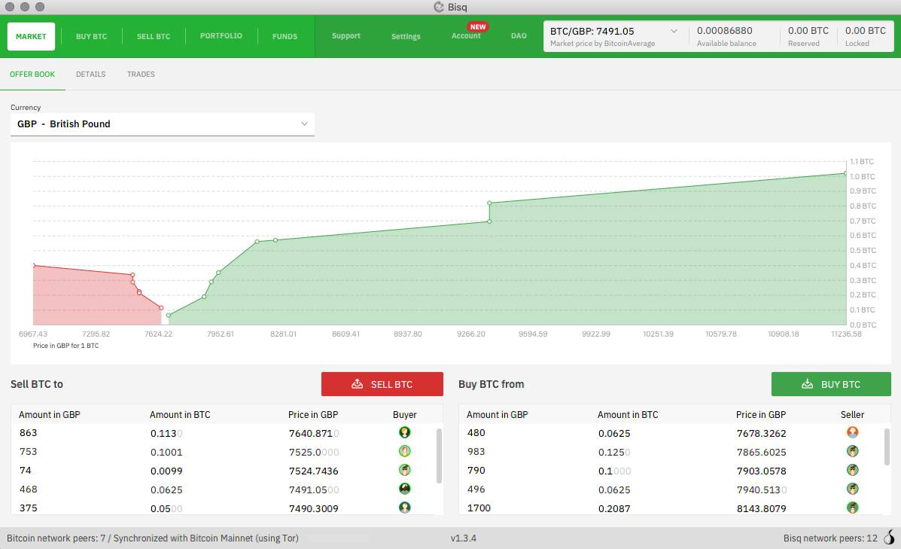
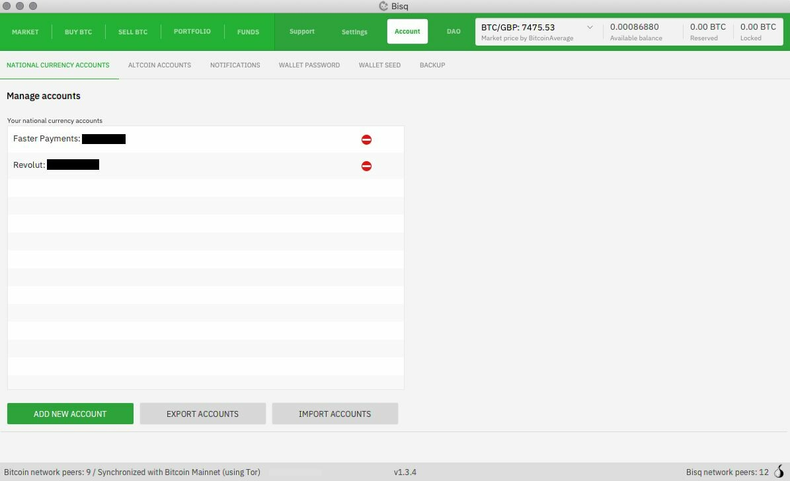
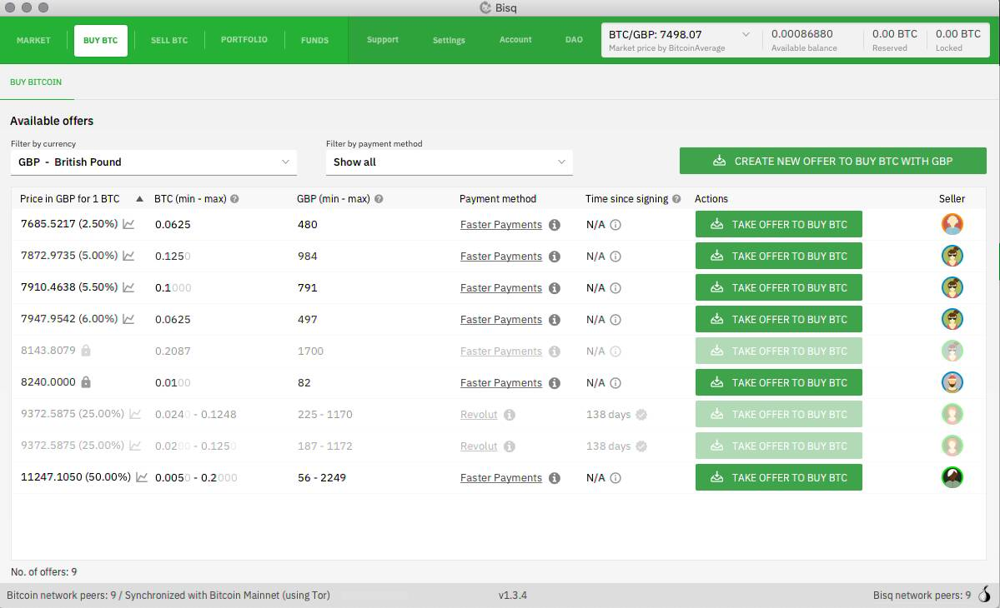
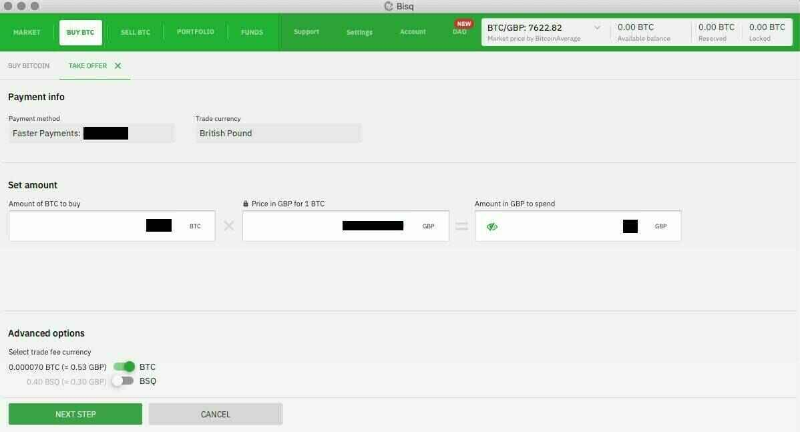
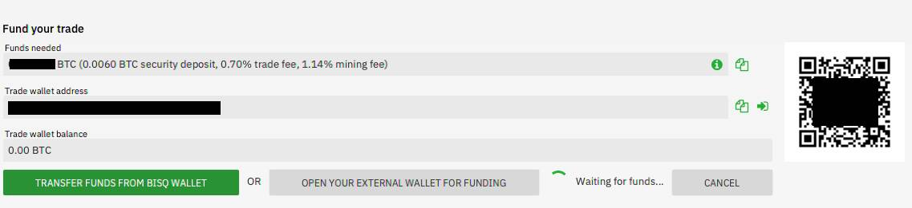
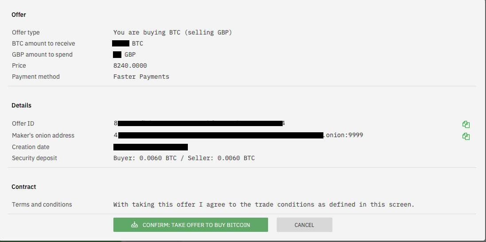
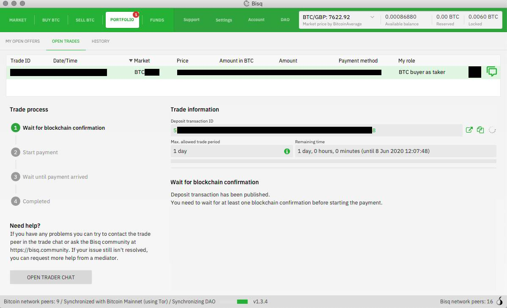
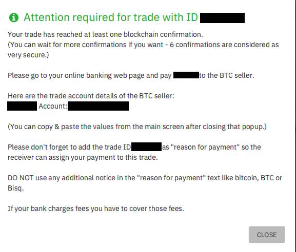
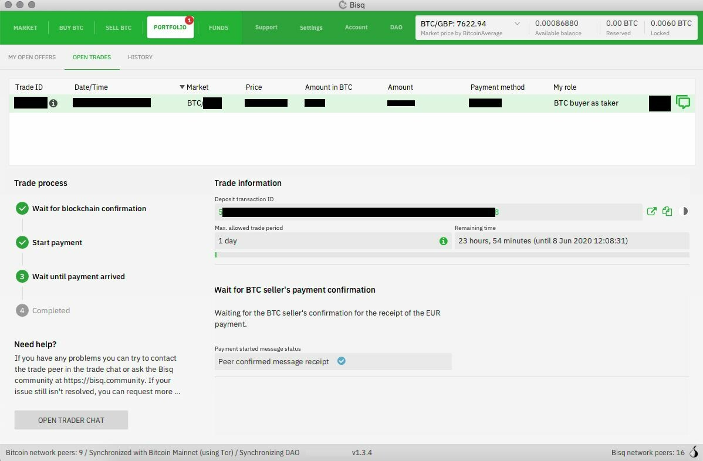
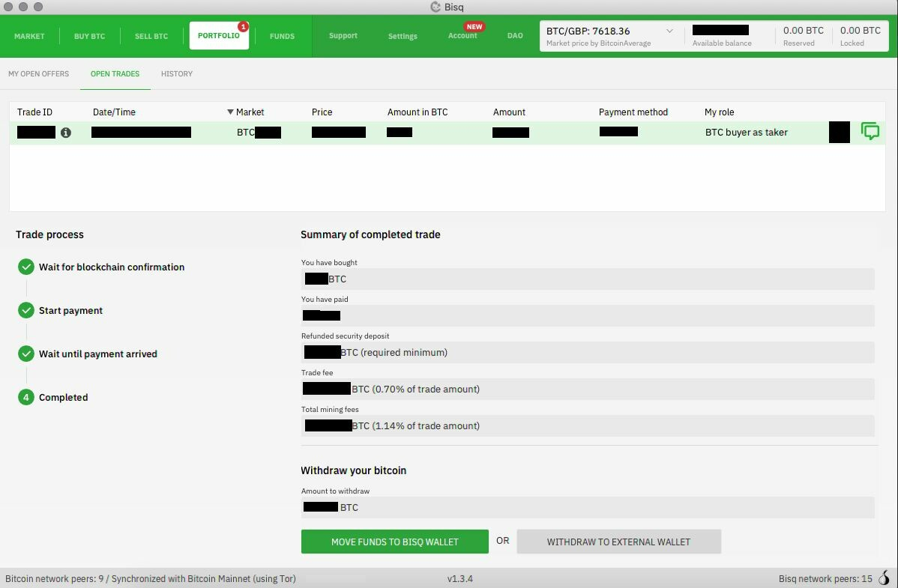

O Bisq é uma plataforma de negociação descentralizada para ativos digitais, principalmente Bitcoin. Ele oferece transações diretas, seguras e privadas entre usuários em todo o mundo, sem a necessidade de um intermediário.

Website: https://bisq.network/
informações: https://bisq.network/getting-started/

_Tenha cuidado para não fazer nada de forma precipitada, o Bisq é uma solução avançada. Uma vez configurado, ele é muito poderoso, mas se você é um iniciante completo, pode não ser adequado para você._

## vídeo tutorial

Tutorial completo por BTC Session:

## Guia de escrita:

Guia original da equipe do Bisq: https://bisq.network/getting-started/

_Se você conhece um guia mais atualizado com imagens e mais orientado para iniciantes, sinta-se à vontade para compartilhá-lo conosco!_

1. Baixe e instale o Bisq

Você pode baixar e instalar o Bisq facilmente deste site (https://bisq.network/downloads) ou do GitHub (https://github.com/bisq-network/bisq/releases/latest).

Também é uma boa ideia verificar o arquivo do instalador para ter certeza de que ele não foi adulterado. Veja os vídeos aqui para obter instruções. Mais detalhes estão neste artigo da wiki. (https://bisq.wiki/Downloading_and_installing)

Se você deseja construir o Bisq a partir do código-fonte, aqui estão as instruções (https://github.com/bisq-network/bisq/blob/master/docs/build.md). O Bisq é um software livre e de código aberto ao qual você pode contribuir. (https://bisq.wiki/Contributor_checklist)

2. Faça backup das chaves, anote a semente

Com o Bisq, você tem total controle sobre seus fundos e seus dados. Isso significa que você mantém uma soberania incomparável, mas também significa que ninguém pode ajudá-lo se você perder algo importante, então é fundamental fazer backups adequados antes de usar o Bisq para negociar.

Também preparamos um breve tour pela interface do Bisq para que você possa aproveitá-la ao máximo.

Mais detalhes estão na wiki: anotando suas palavras-chave de semente e fazendo backup do seu diretório de dados. (https://bisq.wiki/Backing_up_application_data)

3. Crie uma conta de pagamento

Para negociar bitcoin no Bisq, você precisa configurar uma forma de enviar ou receber outros fundos. O Bisq lida apenas com o lado do bitcoin da negociação - o outro lado é tratado por serviços de pagamento em moeda fiduciária (bancos, ordens de pagamento, dinheiro) ou carteiras de altcoins.
Não tem certeza de qual tipo de conta de pagamento configurar? Há uma lista completa de métodos de pagamento na wiki (https://bisq.wiki/Payment_methods). Se você estiver negociando em moeda fiduciária, certifique-se de assistir ao vídeo sobre limites de conta ou ler este artigo na wiki (https://bisq.wiki/Account_limits).

Existem muitas altcoins disponíveis para negociação no Bisq. Aqui estão algumas dicas para os principais mercados:

- Monero. Se estiver enviando XMR, certifique-se de que sua carteira seja capaz de fornecer a chave da transação, o ID da transação e o endereço do destinatário.
- BSQ. Você pode encontrar seu endereço BSQ em DAO > Carteira BSQ > Receber.
- Liquid BTC. Se estiver recebendo L-BTC, você deve usar uma carteira que possa revelar sua chave de ocultação, como o software core Elements (Blockstream Green não funcionará, no momento em que este texto foi escrito).

4. Faça uma negociação

Fazer uma oferta geralmente lhe dará um preço melhor e mais controle (por exemplo, definir o método de pagamento e a porcentagem de depósito), mas aceitar uma oferta pode ser mais conveniente.

Veja as taxas de negociação aqui (https://bisq.wiki/Trading_fees).

Você notará que os criadores de ofertas pagam muito menos. Observe que há um aplicativo móvel para iOS e Android que você pode usar para receber notificações sobre novas ofertas e ações em negociações abertas. Para ver ambos os lados de uma negociação no Bisq ao mesmo tempo, lado a lado, não deixe de conferir nosso vídeo Bird's Eye View of a Bisq Trade.

Isso é tudo - o básico para começar com o Bisq.

## Guia passo a passo para negociação

Guia passo a passo do Bitcoiner.guide, também conhecido como bitcoinQ&A https://bitcoiner.guide/bisq/

3. Agora que seu método de pagamento está configurado, você pode ir para a guia 'Comprar BTC' e ver os vendedores oferecendo bitcoin em troca do seu método de pagamento escolhido. Aqui você pode ver o preço do BTC, a diferença percentual em relação ao preço 'spot' e a quantidade de bitcoin à venda de cada vendedor. Quando encontrar uma oferta de seu interesse, clique em 'Aceitar oferta para comprar BTC'.

4. Isso o levará a uma tela para verificar e confirmar os detalhes antes de entrar na negociação. Quando estiver satisfeito, clique em 'próxima etapa'.

5. Agora você precisa financiar sua carteira de negociação com uma pequena quantidade de bitcoin, que atua como um depósito de segurança. Geralmente, isso é cerca de 15% do tamanho da negociação. O vendedor também precisa fazer um depósito do lado dele.

6. Agora você pode confirmar a oferta e iniciar a negociação.

7. Agora você terá uma espera muito curta enquanto a rede Bitcoin confirma a transação da negociação, colocando os depósitos de segurança de ambas as partes no contrato de garantia multi-assinatura.

8. Após uma confirmação na cadeia, você verá uma janela com os detalhes do vendedor para enviar o pagamento.

9. Depois de enviar o pagamento, pressione o botão para confirmar que você o fez e aguarde o vendedor confirmar que recebeu seus fundos. Neste ponto, você também pode conversar com seu parceiro de negociação por meio de mensagens criptografadas de ponta a ponta, pressionando 'Abrir chat com o trader'.
   Assim que o vendedor confirmar o recebimento dos fundos, o bitcoin comprado juntamente com seu depósito de segurança será liberado em sua carteira Bisq.

10. É isso, sua primeira negociação está concluída! Agora você pode retirar seu bitcoin para uma carteira externa ou deixá-lo em sua conta Bisq.

## As compensações ao comprar sem KYC (por bitcoin Q&A)

Por mais simples que seja comprar na Bisq, existem algumas compensações a serem consideradas.

1. Você precisa ter BTC antes de negociar para formar um depósito de segurança. Não é um problema se você já está no mercado há algum tempo, mas pode se tornar um problema se você quiser usar a Bisq como sua primeira compra. Sua melhor opção nesse caso é obter alguns bitcoins de um amigo ou membro da família.

2. Bitcoins sem KYC frequentemente têm um preço premium acima do preço de mercado, o que pode desencorajar alguns compradores. Como discuti anteriormente, isso envolve compensações e eu pessoalmente estaria disposto a pagar de 5% a 8% acima do preço de mercado pela segurança dos meus dados pessoais.

Se você não tem pressa para comprar, também pode configurar uma 'Oferta de Compra', na qual você informa à rede Bisq que está disposto a comprar uma quantidade de bitcoin a um determinado preço em relação ao valor de mercado. Se um vendedor aparecer e gostar da sua oferta, ele pode aceitá-la.

3. As exchanges descentralizadas às vezes podem sofrer com a falta de liquidez em comparação com entidades centralizadas maiores. Se você está procurando comprar quantidades maiores com mais frequência, pode ter dificuldades.

4. Embora nunca tenha acontecido comigo, às vezes as negociações peer-to-peer não funcionam como o esperado e os usuários precisam passar pelo processo de resolução de disputas. Felizmente, devido à forma como as estruturas de incentivo da Bisq são construídas, essas situações são raras.

Como acontece com a maioria das coisas relacionadas ao Bitcoin, o debate KYC/Non-KYC é complexo e cheio de compensações. Eu entendo, as formas mais comuns de entrada em fiat, como Coinbase e CashApp, tornam a vida muito fácil para comprar, especialmente para iniciantes, mas por favor, reserve um segundo para considerar as compensações e procurar alternativas antes de fornecer suas informações pessoais tão facilmente.
