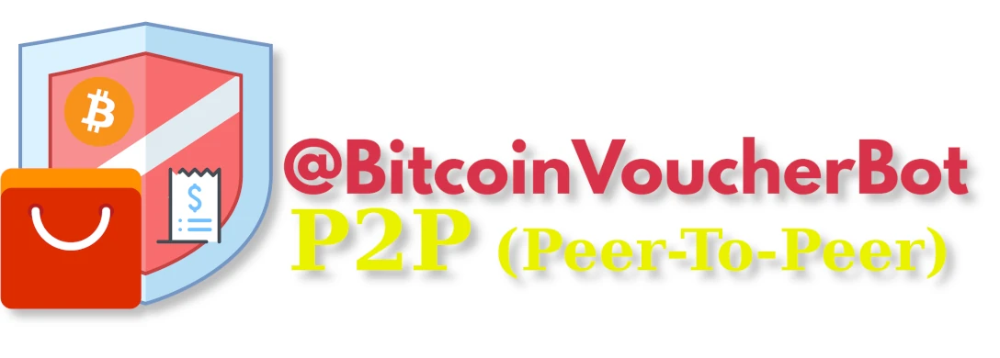
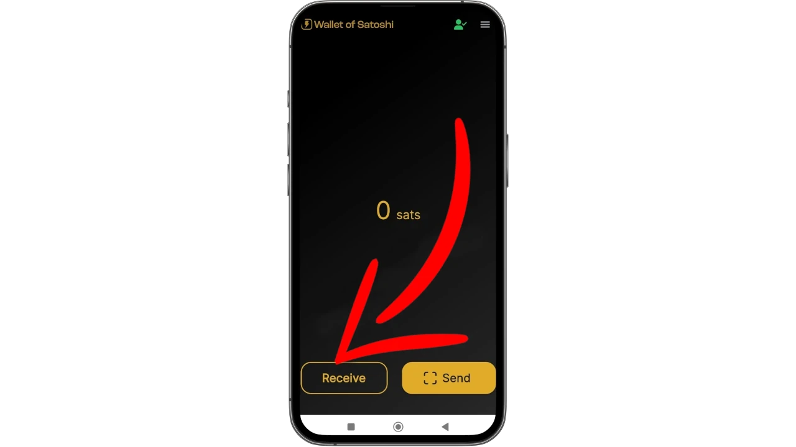
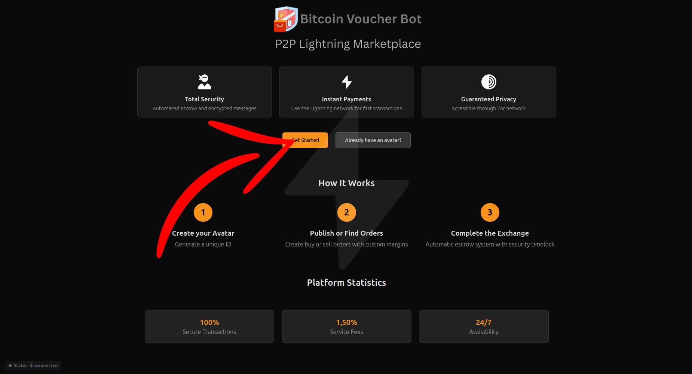
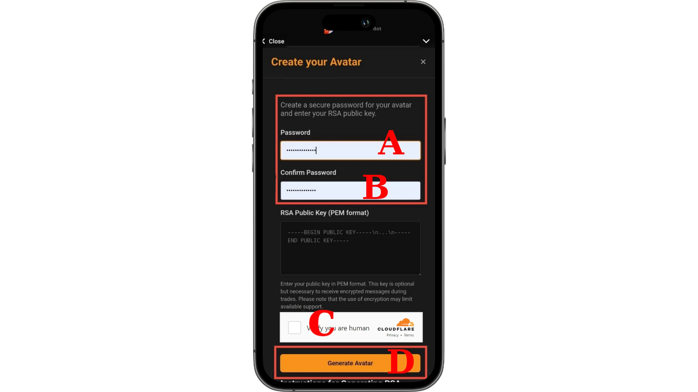
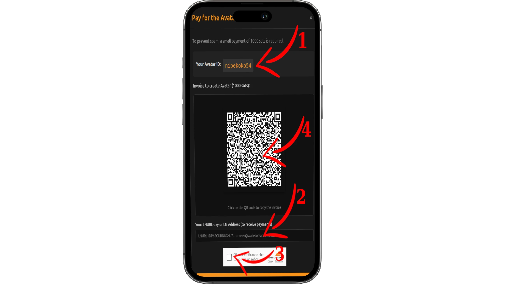
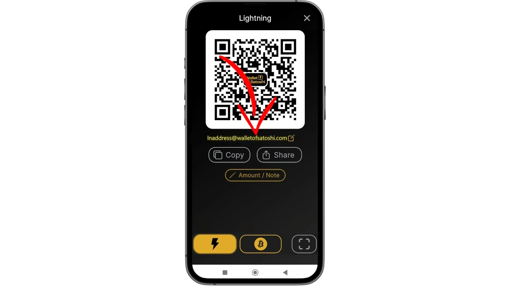
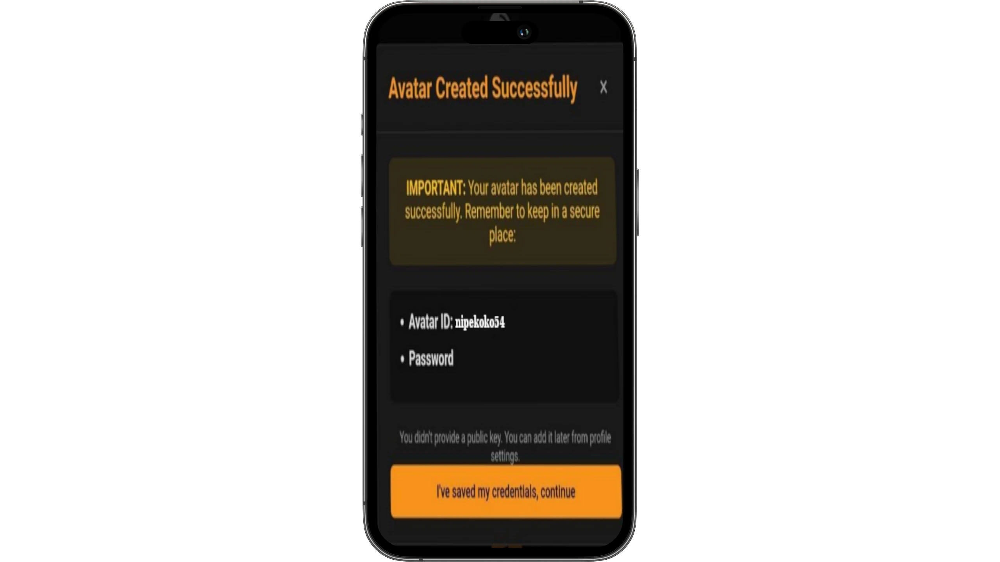
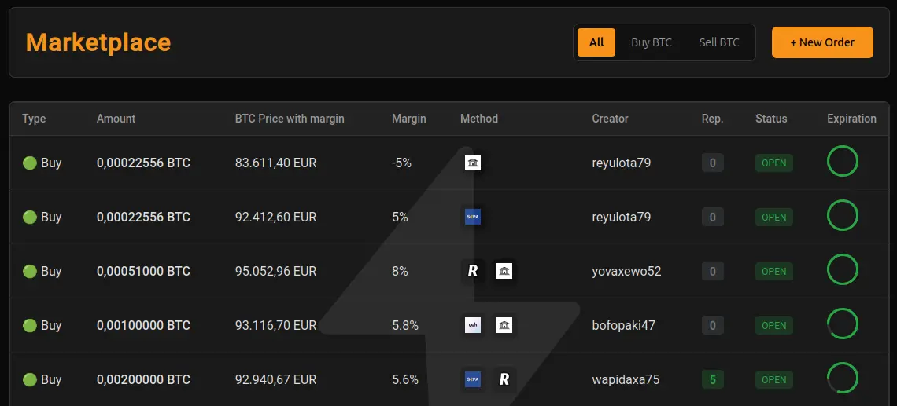
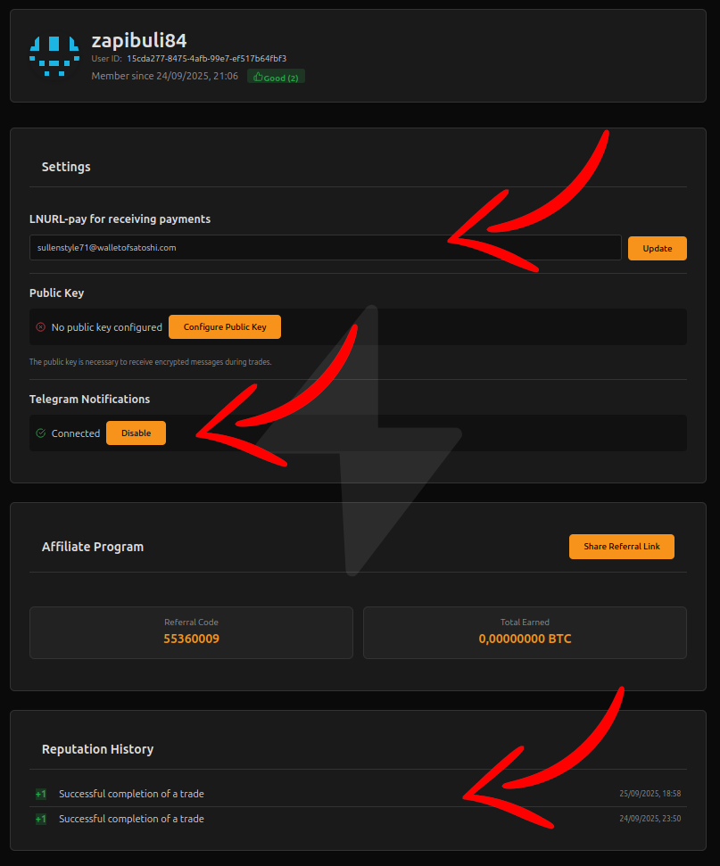

Sentiamo ancora parlare di BitcoinVoucherBot, un bot Telegram nato per acquistare Bitcoin senza KYC (“Know Your Customer”), offrendo quindi un livello di anonimato ridotto. Puoi trovare una giuda dettagliata qui:

https://planb.network/en/tutorials/exchange/centralized/bitcoin-voucher-bot-5f5d9449-10a7-4f97-9278-8dfbbea5ab1a

In questa guida vedremo come funziona la nuova implementazione che permette di acquistare e vendere Bitcoin direttamente sul nuovo marketplace P2P (Peer-To-Peer).

Per contrastare le nuove restrizioni che sempre più spesso minacciano la libertà digitale e la privacy, gli sviluppatori hanno creato questa estensione, dando agli utenti la possibilità di comprare e vendere Bitcoin con un elevato grado di anonimato tramite il P2P (Peer-To-Peer).

Ma vediamo come funziona questo nuovo metodo di scambio.

Per utilizzare il servizio dovrai effettuare i trasferimenti tramite Lightning Network. Assicurati quindi di avere un wallet che supporti questo protocollo e che ti consenta di usare un “LNURL” o un “Lightning Address” per ricevere e inviare i  fondi. 

Tra i wallet supportati possiamo trovare:

- [Sats.Mobi](https://planb.academy/it/tutorials/wallet/mobile/satsmobi-ea04e1cd-609a-4ea8-9c61-f9de1fe3a1fb) (Bot Telegram) (Custodial)
- [Wallet Of Satoshi](https://planb.academy/it/tutorials/wallet/mobile/wallet-of-satoshi-39149d86-e42b-4e8f-ae9f-7e061e7784f7) (Custodial con swap a Non-Custodial)
- [Breez](https://planb.academy/it/tutorials/wallet/mobile/breez-46a6867b-c74b-45e7-869c-10a4e0263c06) (Non-custodial)

Oppure qualsiasi wallet che abbia un “Lightning Address” e che generi una fattura Bolt11. Al momento non sono supportati i wallet che generano una fattura Bolt12.

Per questo tutorial, dato la sua semplicità d’uso immediato, utilizzeremo Wallet of Satoshi.

**Attenzione**: Wallet of Satoshi, pur diffuso tra i principianti, è custodial, con controllo limitato sui fondi; usalo solo transitoriamente, trasferendoli subito a un non-custodial per piena sovranità. Da ottobre 2025, include una modalità self-custodial stabile worldwide su iOS/Android (aggiorna l'app), con chiavi private autonome, switch tra modalità, indirizzi Lightning personalizzati e backup seed 12 parole. Tuttavia, resta una soluzione provvisoria fino a consolidamento, preferendo wallet non-custodial maturi per la gestione a lungo termine.

Molto bene! Ora possiamo iniziare il nostro percorso, che ti guiderà passo passo nella creazione dell’account, nella gestione dei match di acquisto e vendita e nell’utilizzo della tua area riservata.

**Wallet e Iscrizione**

Per prima cosa, se non lo hai già installato sul tuo smartphone, scarica Wallet of Satoshi.

- [Google Play](https://play.google.com/store/apps/details?id=com.livingroomofsatoshi.wallet&pli=1)
- [App Store](https://apps.apple.com/au/app/wallet-of-satoshi/id1438599608)

Se non hai mai utilizzato Wallet of Satoshi e vuoi comprenderne il funzionamento, ti consiglio di seguire questo tutorial, così potrai attivarlo correttamente ed eseguire il backup in modo sicuro.

https://planb.network/en/tutorials/wallet/mobile/wallet-of-satoshi-39149d86-e42b-4e8f-ae9f-7e061e7784f7

Ora che il tuo wallet è pronto, puoi iniziare a inviare una piccola quantità di sats.
Tieni presente che, per completare l’iscrizione alla piattaforma P2P (Peer-To-Peer), ti verranno richiesti 1000 sats come misura di controllo: questo serve a proteggerti da eventuali match fantasma (scam) e impedisce che chiunque possa iscriversi senza limiti.

Ora possiamo aprire la piattaforma P2P (Peer-To-Peer) per procedere all’iscrizione.
Puoi accedere da PC desktop o browser su smartphone, tramite il bot Telegram BitcoinVoucherBot oppure tramite link .onion, per garantire un livello di privacy ancora maggiore.

se scegli di utilizzare il link Tor .Onion ti consilgio anche "Tor Browser". Se ancora non lo conosci puoi approfondire a questo link: 

https://planb.academy/it/tutorials/computer-security/communication/tor-browser-a847e83c-31ef-4439-9eac-742b255129bb

Ora scegli come vuoi raggiungere la piattaforma.

- [BitcoinVoucherBot](https://t.me/BitcoinVoucherBot?start=55360009) (Telegram)
- [Pc Desktop / Browser Smartphone](https://p2p.bitcoinvoucher.bot/?ref=55360009)
- [Tor .Onion](http://umembxtpokml6fkogemcfnpyt3qqvyw6u3hnvwinevo3gvoe6j7vfyad.onion/?ref=55360009)

Verrai reindirizzato alla pagina principale.

premi su “Get Starter”(“inizia subito”)

Nella schermata successiva devi scegliere una password e inserirla (riquadro A), per poi ripeterla (riquadro B). Ti raccomando di salvare subito questa password su un supporto di backup, che può essere su un dispositivo digitale sicuro come per esempio "Bitwarden":

https://planb.academy/it/tutorials/computer-security/authentication/bitwarden-0532f569-fb00-4fad-acba-2fcb1bf05de9

o un documento cartaceo.

Spunta la casella di verifica dove dichiari di non essere un robot (riquadro C).

Nota bene! Non abilitare la crittografia RSA a meno che tu non sappia esattamente cos’è e come funziona. In questa fase non è necessario fare nulla.

Clicca su “Generate Avatar” ( Genera Avatar”) (riquadro D).

Ora devi pagare i 1000 sats per completre l'iscrizione. 

1. Partendo dall’alto, vedi innanzitutto il tuo “Avatar ID”, generato casualmente e estremamente importante.
Salvalo con cura, proprio come ti ho consigliato di fare con la password.

2. Devi quindi inserire il tuo “Lightning Address” nel campo sottostante. Questo ti permetterà di ricevere i pagamenti se acquisti Bitcoin, oppure di ottenere i rimborsi. Se stai usando Wallet Of Satoshi potrai copiare il tuo Address cliccando su ricevi.

3. Spunta la casella di verifica dove dichiari di non essere un robot.

4. Effettua il pagamento di 1000 sats per ottenere l’accesso alla tua area riservata. Se non puoi inquadrarlo, cliccaci sopra con il mouse (su PC) o toccalo con il dito (su smartphone Browser/Telegram) per copiare l’indirizzo che devi incollare su Wallet of Satoshi e completare il pagamento della fattura.

Questo e' il tuo LNURL Address.

Complimenti! Hai creato il tuo Avatar in modo definitivo e qui puoi visualizzare il riepilogo.
Ancora una volta ti raccomando di salvare con cura sia il tuo Avatar che la password, come ti ho già suggerito in precedenza.

Clicca su “i’ve saved my credentials, continue” (“ho salvato le mie credenziali, continua")

Ti trovi ora nel cuore della piattaforma, dove puoi visualizzare tutti i match di compravendita con i relativi dettagli.

Per una visualizzazione piu chiara, qui sotto vedrai le immagini inerenti al sito web da computer desktop.

- "Type" ("Tipo") definisce se si tratta di una vendita "Sell"("vendi") oppure un acquisto "buy"("compra")
- “Amount” (“Ammontare”): indica quanti sats l’utente sta vendendo se il match è di tipo “Sell” (Vendi), oppure quanti Bitcoin è disposto ad acquistare se il match è di tipo “Buy” (Compra).
- “BTC Price with Margin” (“Prezzo BTC con margine”): mostra il prezzo tenendo conto del margine applicato sopra il valore di marcato.
- "Margin" ("Margine") e' la percentuale che viene applicata al prezzo di mercato, con un segno meno (-) ottieni uno sconto sul prezzo di mercato, Con un segno più (+) viene applicato un premio sul prezzo di mercato.
- "Method" ("Metodo") indica con quale motodo l'utente preferisce essere pagato.
- - "Creator" si tratta dell'avatar univoco utilizzato dall'utente sulla piattaforma.
- "Rep" (Reputazione) Il livello di reputazione dell'utente va da -5 inaffidabile a +5 estremamente affidabile.
- “Status” (“Stato”): indica lo stato del match. Nella schermata di esempio tutti i match risultano “Open” (“Aperti”).
- “Expiration” (“Scadenza”): mostra quanto tempo resta prima che il match scada e venga cancellato se non è stato scelto da nessuno.

Nella parte superiore a destra clicca sul tuo Avatar per accedere al profilo.

- Qui puoi vedere il tuo nome Avatar, il tuo User ID, la data di creazione e la tua reputazione, che rifletterà positivamente o negativamente il tuo comportamento nelle trattative.
- Nella sezione Settings puoi visualizzare il tuo “Lightning Address”, inserito durante la registrazione, e modificarlo se necessario.
- Hai anche la possibilità di creare una Public Key, che – come accennato – va impostata solo se possiedi le competenze adeguate. Essa serve per crittografare i messaggi che scambierai con la controparte direttamente dal computer.
- La funzione Telegram Notification te la consiglio vivamente.
Attivandola, ti comparirà un QR code da inquadrare con l’app di Telegram: in questo modo riceverai notifiche in tempo reale su tutte le azioni relative ai tuoi match, direttamente nella chat del bot su Telegram.
