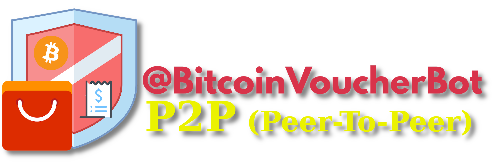

Si sente ancora parlare di BitcoinVoucherBot, un bot Telegram nato per acquistare Bitcoin senza procedura KYC (“Know Your Customer”), offrendo così un maggiore livello di anonimato. Puoi trovare una guida dettagliata qui:

https://planb.network/en/tutorials/exchange/centralized/bitcoin-voucher-bot-5f5d9449-10a7-4f97-9278-8dfbbea5ab1a

Questa guida ti mostra come usare la nuova funzione per comprare e vendere Bitcoin sul marketplace Peer-To-Peer (P2P).

In risposta alle nuove restrizioni che mettono a rischio la libertà digitale e la privacy, è nata questa estensione: uno strumento che consente agli utenti di scambiare Bitcoin in modo anonimo grazie al sistema P2P.

Ma vediamo come funziona questo nuovo metodo di scambio.

Il servizio funziona tramite Lightning Network: ti serve un wallet compatibile che supporti **"LNURL"** o **"Lightning Address"** per gestire i pagamenti.

Tra i wallet supportati possiamo trovare:

- [Sats.mobi](https://planb.network/it/tutorials/wallet/mobile/satsmobi-ea04e1cd-609a-4ea8-9c61-f9de1fe3a1fb) (Bot Telegram)

