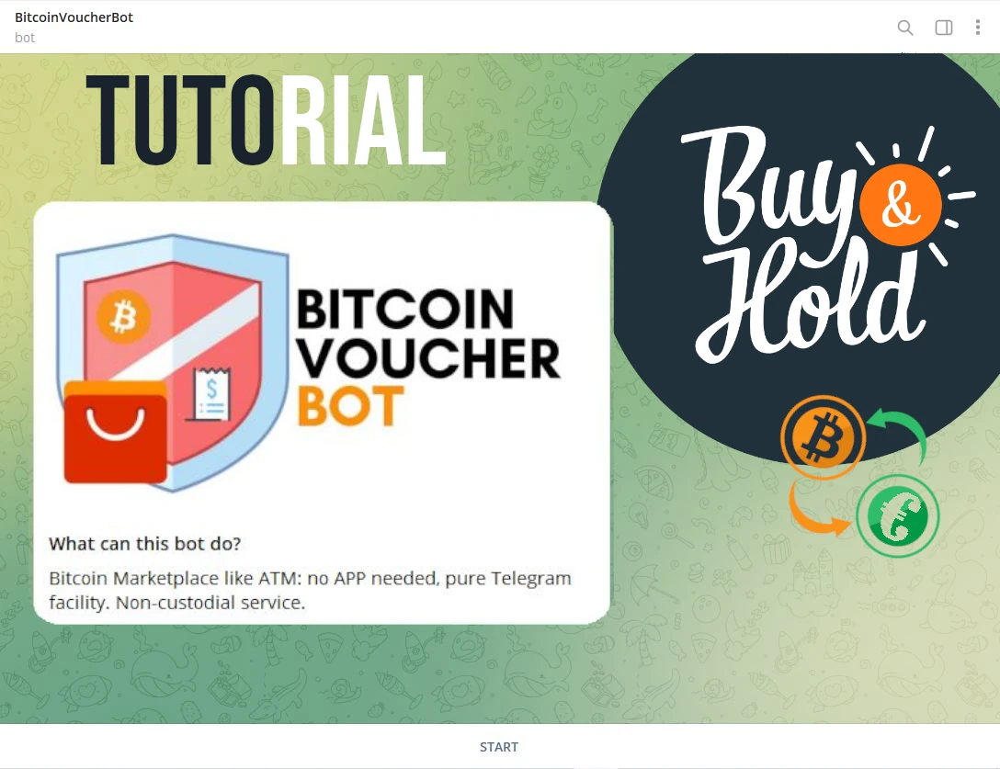

_Questo tutorial è stato scritto da_ [Bitcoin Campus](https://linktr.ee/bitcoincampus_)

## Introduzione
Il BitcoinVoucherBot è uno strumento con il quale si possono acquistare Bitcoin in cambio di euro.

### KYC Light

L'azione di convertire euro per Bitcoin è il primo e fondamentale passo per iniziare a studiare questa materia, ma spesso è anche quello che crea più difficoltà. Le opzioni possono essere molteplici: exchange centralizzati, meetup a tema Bitcoin, amici o conoscenti e tanto altro ancora. Tuttavia, come membri della comunità Bitcoiner, **sconsigliamo assolutamente l’uso di exchange centralizzati**, per proteggere meglio la propria privacy.

Anche se questa scelta può essere meno conveniente, è importante capire che gli exchange applicano la normativa KYC (Know Your Cutomer), assegnando così un’identità e anche una posizione fisica ad ogni satoshi acquistato presso di loro. La "comodità" presenta degli effetti collaterali che colpiscono.

### Come fare?

Ecco che ci viene incontro il servizio [BitcoinVoucherBot:](https://t.me/BitcoinVoucherBot), un bot Telegram che funge da tramite tra i nostri bonifici SEPA e l’acquisto di Sats.

### Pre-requisiti
Per iniziare ad utilizzare BitcoinVoucherBot non è necessario fornire informazioni personali allo staff del Bot. **Non serve autorizzazione**.

Ti basta avere un account Telegram già attivo e un conto bancario. **Nota**: non vanno bene i conti di Poste Italiane (per chi è in Italia) o quelli legati a semplici carte ricaricabili.

Prepari un ordine nella chat di Telegram, lo paghi con un bonifico e infine ricevi, tramite il bot, un voucher emesso da una società terza che non conosce l’oggetto dell’acquisto.

### Attivazione del bot e menu
L’attivazione è un’operazione semplice da fare una sola volta. Su Telegram, cerca _@BitcoinVoucherBot_ apri la chat del Bot. In basso spicca un grande pulsante _Avvia/Start_. Premendolo il Bot risponderà mostrando un menu con i principali comandi disponibili. Appariranno anche i primi messaggi di benvenuto, che consigliamo di leggere attentamente.

**Attenzione**: ci sono diversi scammer (truffatori) che si spacciano per VoucherBot originale. Se non sei sicuro della ricerca via Telegram, fai accesso al link di BitcoinVoucherBot dal [sito ufficiale](https://www.bitcoinvoucherbot.com/)

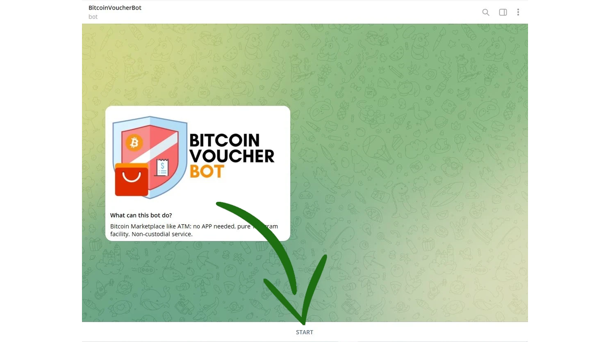

Le opzioni appaiono cliccando il tasto _Menu_ in basso a sinistra: si può cliccare sulla parola corrispondente al comando, oppure scrivere nella casella del messaggio lo slash `/` seguito dal comando digitato.

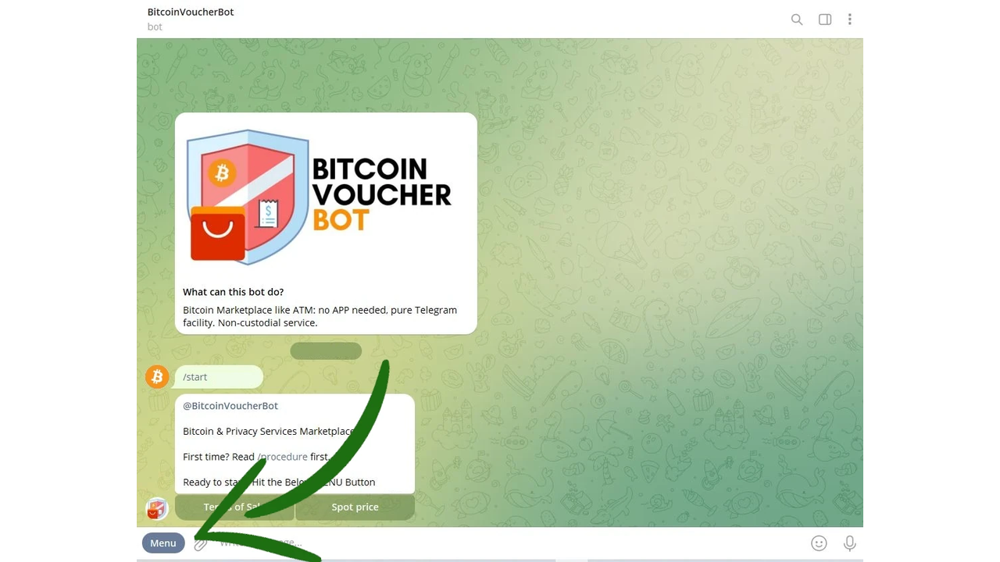

Tra le principali operazioni ci sono:
- _/purchase_: è la procedura di acquisto vera e propria. Al termine dell’operazione il QR Code viene generato automaticamente dal bot, pronto al riscatto.
- _/refill_: disponibile al momento in cui scriviamo questo tutorial, ma non lo tratteremo perché - per motivi tecnici - questa opzione potrebbe essere elimata in seguito.
- _/swap_: apre la procedura di swap, disponibile sia con un comodo bot di Telegram che via web.
- _/ap_: accumulation plan, che consente di impostare un **Piano di Accumulo Costante (PAC)**.
- _/lnaddress_: con cui ci viene chiesto di collegare un proprio LN Address, per una particolare procedura che vedremo in seguito.
- _/credits_: per controllare quanto credito è rimasto per generare voucher.
- _/myorders_: mostra gli ordini fatti con il bot (**Attenzione** il sistema tiene traccia soltanto degli ultimi 10 ordini effettuati e non l'intero storico).
- _/fees_: un comando per controllare le fee (commissioni)  di rete. Per valutarle, è sempre meglio affidarsi al sito mempool.space.
- _/support_: in caso di necessità, fa comparire i contatti per segnalare al team di supporto le problematiche.

## Procedura di acquisto Bitcoin

### Preparazione dell'ordine
Clicca _/purchase_ nel menu dei comandi

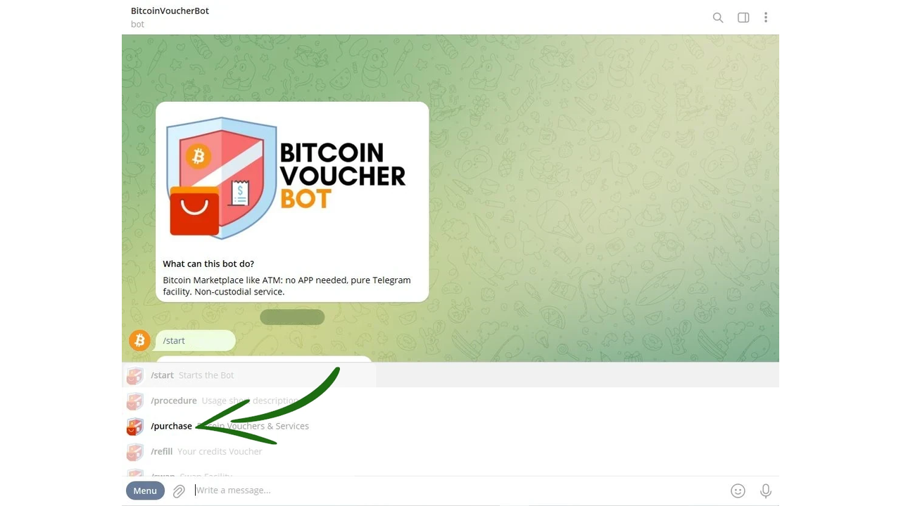

Appaiono diverse opportunità, scegli _BTC Vouchers_

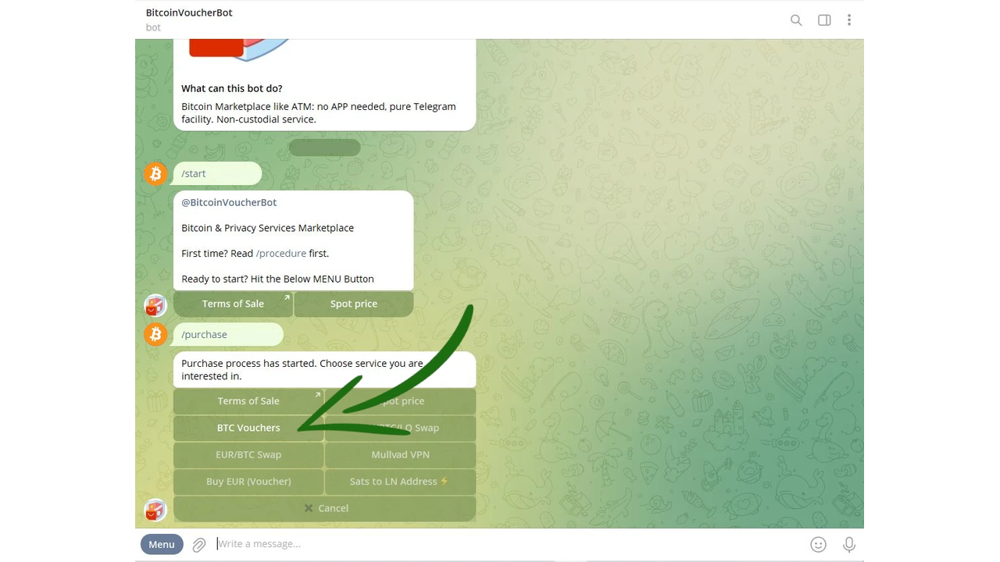

BitcoinVoucherBot consente di acquistare Bitcoin onchain, Lightning e Liquid.
In questa fase scegli _Onchain & Lightning 🔗⚡️_

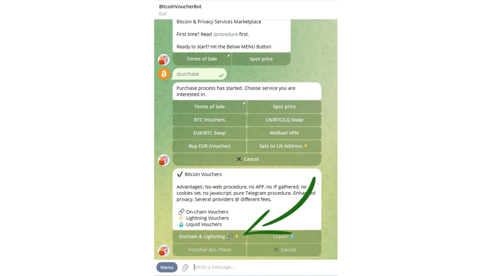

La schermata cambia rapidamente e VoucherBot propone i tagli di acquisto. Si parte da un minimo di 100,00 € fino ad arrivare a 900,00 €.

In caso di primo acquisto, vengono proposti solo i tagli da 100,00 €, Onchain e Lightning. Per aumentare la privacy, consigliamo di scegliere _Lightning ⚡️_

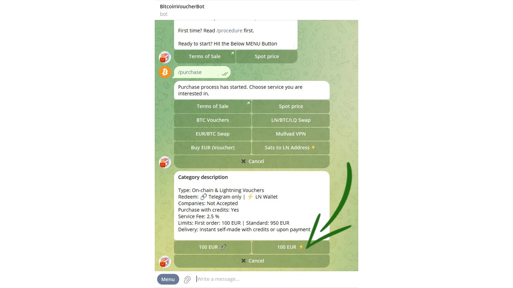

Il VoucherBot ti segnala che è stata fatta una prima scelta, per confermarla devi scegliere _Proceed_

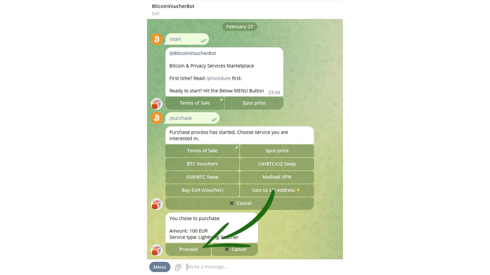

Ora devi scegliere il metodo di pagamento. Il trasferimento avviene tramite bonifico bancario **(accettati solo SEPA)**. VoucherBot propone come destinatario una società che dispone di due conti bancari, uno in U.K (Regno Unito) e l'altro in Svizzera. Per questo tutorial scegli il conto svizzero.

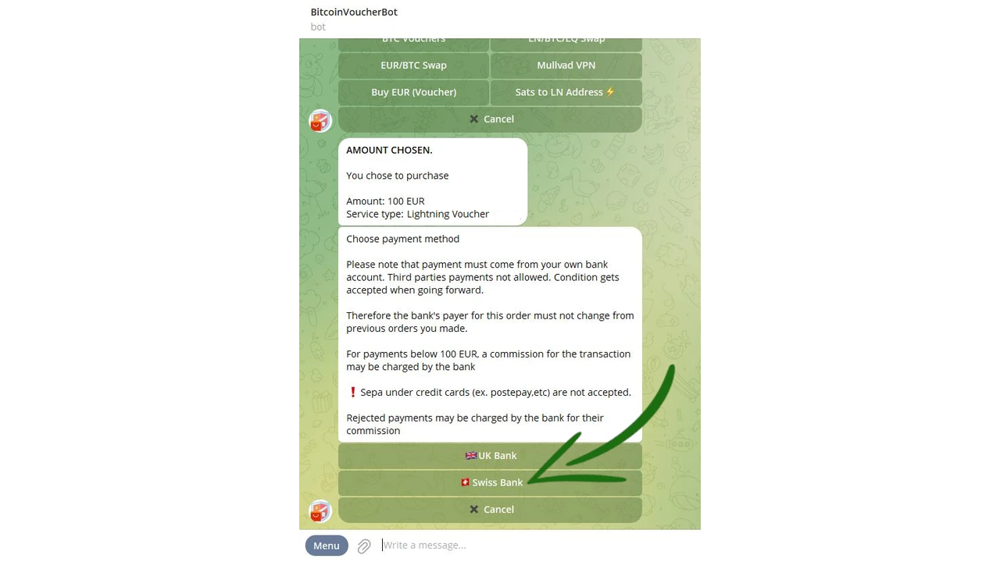

A questo punto devi inserire il tuo IBAN, quello da cui partirà il bonifico verso la banca scelta. Questa informazione va a comporre un 'puzzle' che permetterà al bot, cioè ad una macchina, di elaborare i dati e far procedere l’acquisto senza bisogno di intervento umano.

L'IBAN deve essere scritto nella barra del messaggio, controllalo e invialo al bot.

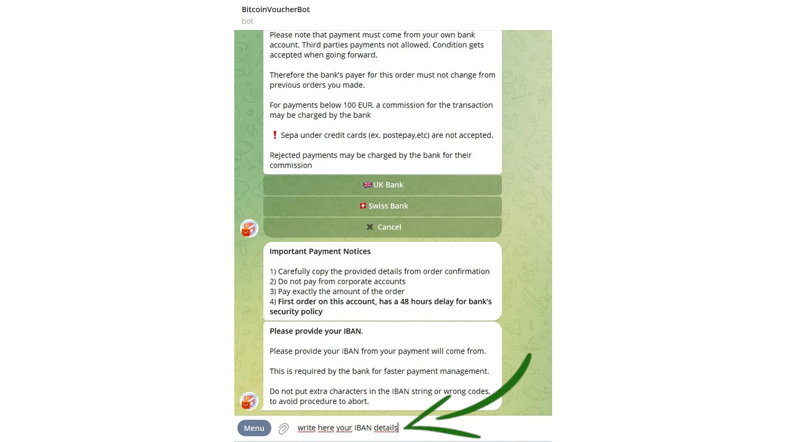

Nella chat con VoucherBot compare ora un messaggio di controllo.
Se tutto è corretto, prosegui e clicca _Proceed_.

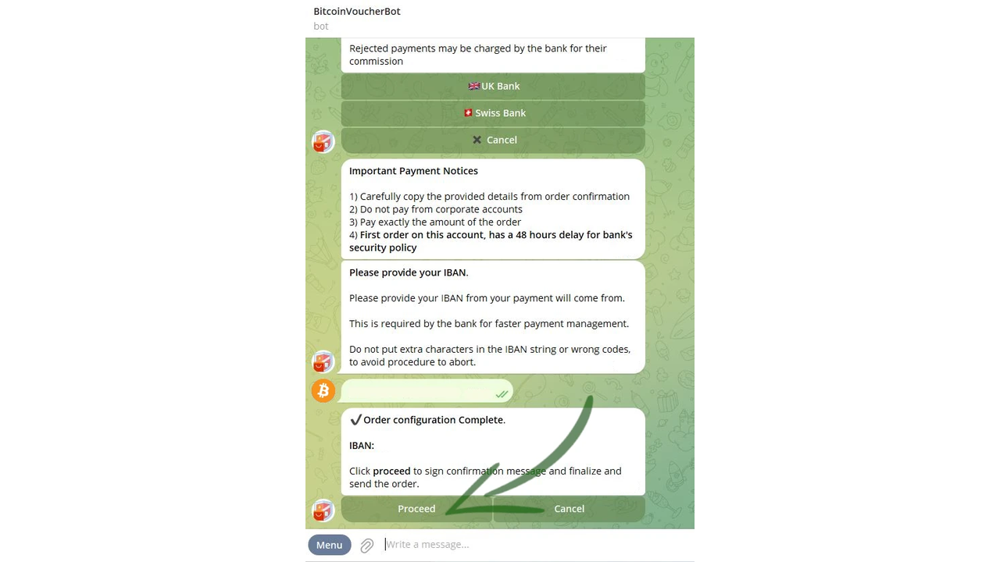

### Pagamento

Dopo qualche istante, VoucherBot elabora i dati e risponde con un messaggio che contiene tutte le informazioni necessarie per completare l’ordine. A seconda di quanto richiesto dalla tua banca, le informazioni rilevanti sono:
- `IBAN`, indispensabile per il versamento, oltre all'indirizzo del ricevente;
- `l'importo scelto` in precedenza tramite il taglio, che deve essere rispettato per permettere a VoucherBot di riconoscere l'ordine quando sarà arrivato il pagamento;
- `Payment reason`, ovvero la causale del pagamento. **Deve essere copiata e incollata senza togliere o aggiungere nulla nell'apposito campo del proprio bonifico. Eventuali "." o "-" presenti nella payment reason, possono essere sostituiti dallo "spazio bianco"**.
- un `OrderID` univoco, cui fare riferimento per richiedere eventuale assistenza.

A questo punto puoi procedere con il pagamento, tramite la tua app o banca. Quando il pagamento viene accettato dalla tua banca, è importante ricordarti di premere _Notify payment_ nella chat con VoucherBot. Questa semplice operazione segnala al bot che un pagamento e' in corso.

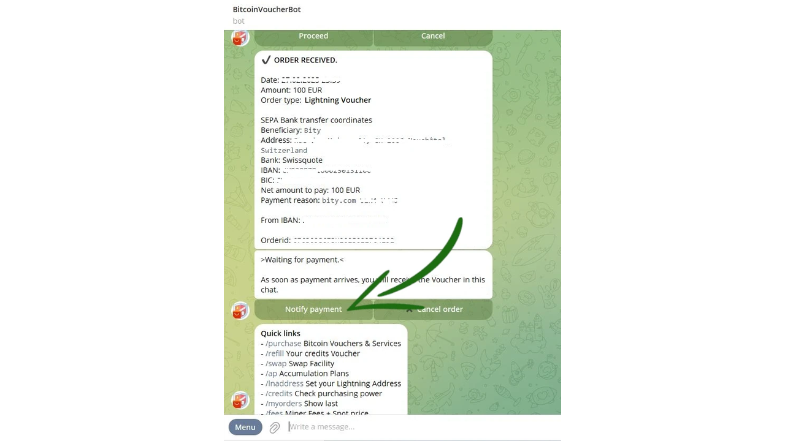

VoucherBot risponde con un messaggio che contiene un avviso molto importante: **non cancellare la chat**, almeno fino alla ricezione del voucher, perché è l'unico strumento per ricostruire l'ordine e farlo proseguire.

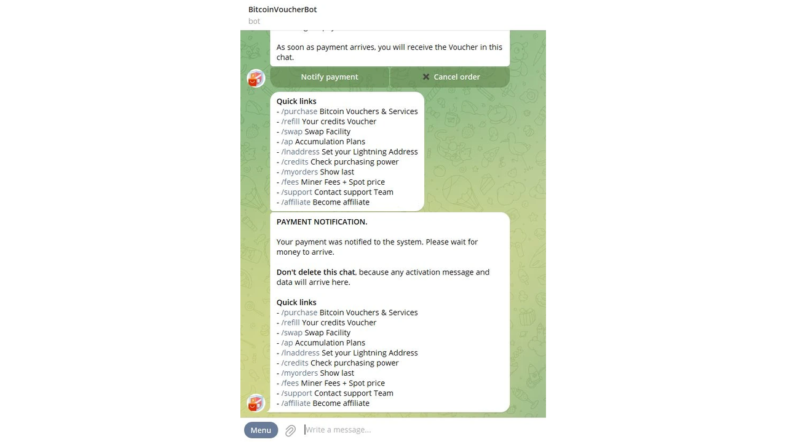

---
Nota bene:
- sono accettati solo bonifici SEPA;
- i tempi di attesa dipendono esclusivamente dalle modalità di processamento delle banche (che non lavorano 24/7/365 come Bitcoin). Potrebbero volerci da poche ore fino a 3 giorni lavorativi per ricevere il voucher;
- per qualsiasi necessità, BitcoinVoucherBot ha un eccellente servizio di [assistenza](https://t.me/BitcoinVoucherGroup) su Telegram.

---

### Riscatto
Non appena il pagamento è andato a buon fine, BitcoinVoucherBot invia il voucher direttamente nella chat. Il voucher lightning è sottoforma di QR code, stampato su sfondo arancione.

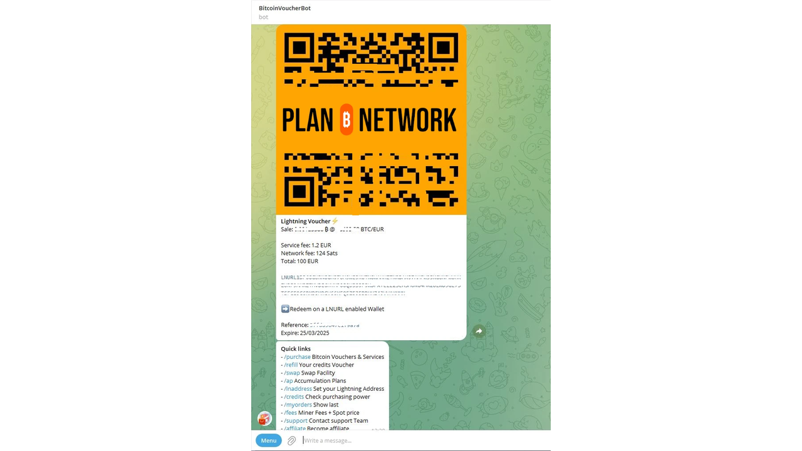

Ci sono tutti i dati necessari per incassarlo:
- l'importo in sats, equivalente a quello inviato tramite bonifico, escludendo le fee(commissioni) del servizio e le fee (commissioni) di rete;
- un reference ID del voucher;
- la data entro la quale il voucher deve essere riscattato (25 giorni dalla sua emissione) pena la perdita dei fondi.
  Puoi incassare il voucher inquadrando il QR code con la funzione scan di un wallet Lightning Network compatibile, o tramite LNURL, anch'esso indicato sotto il QR code.

Per questo tutorial abbiamo usato Wallet Of Satoshi, usando la funzione di scan attivata dal tasto _Send_

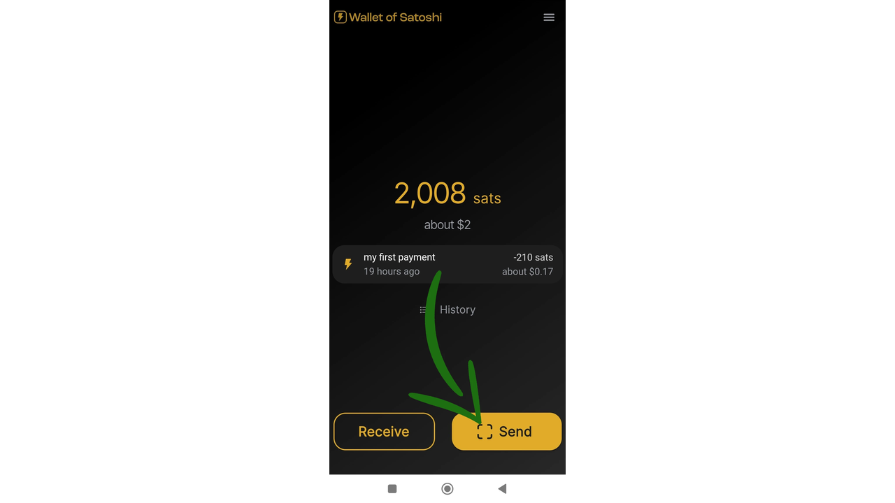

Con la fotocamera del cellulare attivata, inquadra il QR code nella chat, aprendo Telegram da PC

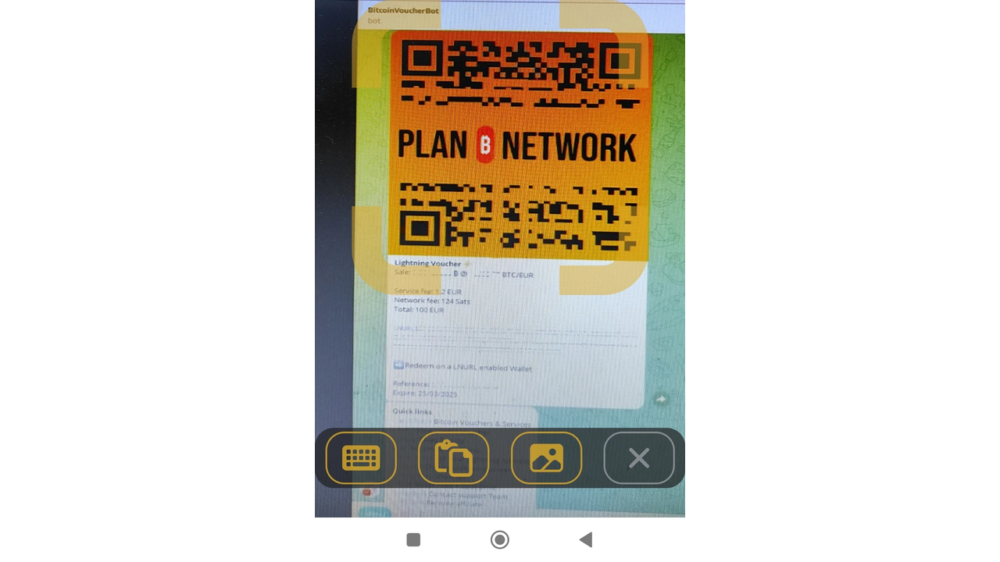

Prima di continuare, Wallet Of Satoshi mostra una schermata di verifica che include l’importo esatto corrisponde a quello espresso sul voucher e, come descrizione, BitcoinVoucherBot. Per incassare il voucher basta cliccare su _Receive_

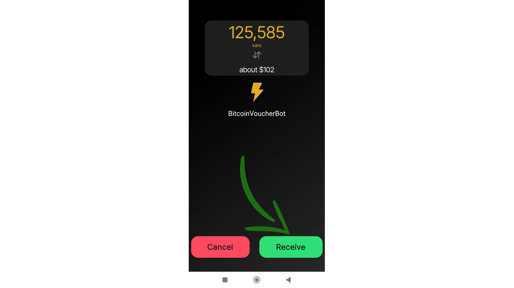

Wallet Of Satoshi processa per pochi istanti

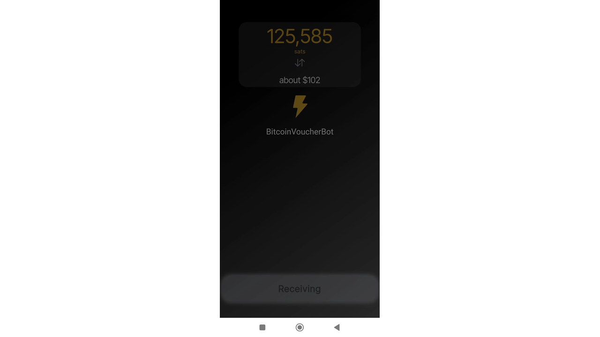

Infine l’accredito viene registrato ed è immediatamente disponibile nel saldo del Wallet.

**Wallet of Satoshi è un'app custodial: subito dopo l'incasso del voucher è consigliabile spostare i sats su un wallet non-custodial.**

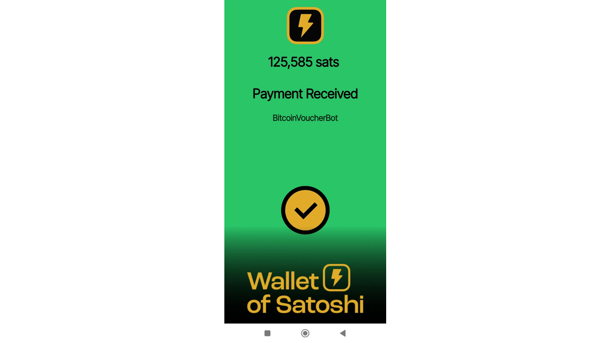

### Come incassare un voucher onchain

Come hai visto nella preparazione dell'ordine, VoucherBot permette di acquistare sats direttamente onchain, con la scelta dell'omonimo voucher.

**Nota**: preparazione dell'ordine e pagamento non cambiano, sono sempre gli stessi. Ciò che cambia è il come si incassa un voucher onchain.

Dopo aver completato l'ordine, effettuato il pagamento, premuto _Notify payment_ e atteso i tempi tecnici delle banche per trasferire il bonifico, VoucherBot risponderà inviando il voucher direttamente nella chat.

Anche questo voucher è sottoforma di QR code, ma il colore principale è il giallo canarino e -cosa più importante- nella descrizione è chiaramente indicato che si tratta di un voucher onchain. Lo puoi incassare direttamente dal tuo wallet onchain e, per avviare la procedura di incasso, devi cliccare su _Redeem on Telegram_. Il voucher onchain contiene le stesse informazioni già viste per quello lightning:

- l'importo in sats, equivalenti a quello inviato tramite bonifico, escluse le fee (commissioni) del servizio e le fee (commissioni) di rete;
- un voucher code;
- un reference ID del voucher;
- la data entro la quale il voucher deve essere riscattato, pena la perdita di fondi, cioè 25 giorni dopo l'emissione.

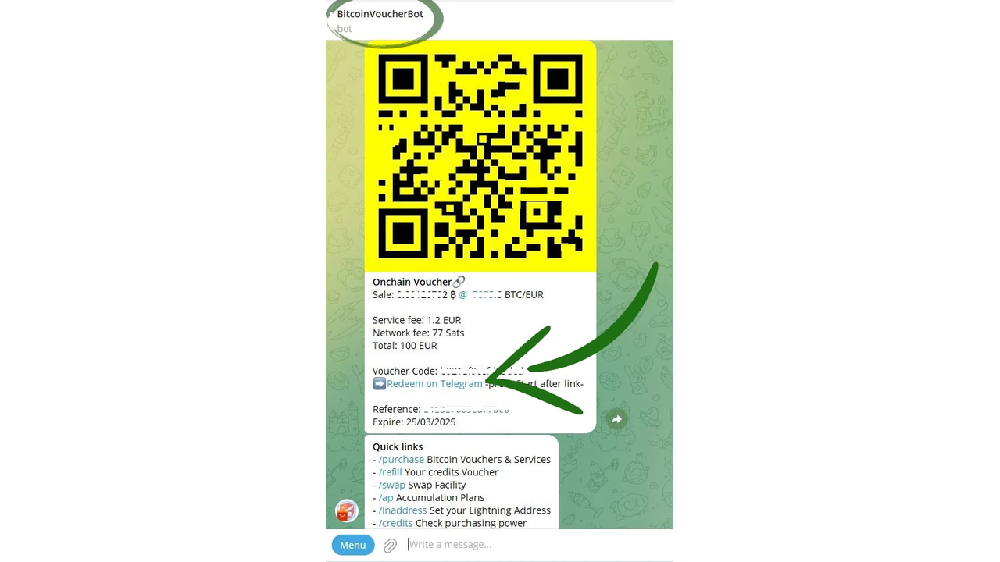

**ATTENZIONE ⚠️:** Dopo aver cliccato come indicato, si apre il pop-up di un altro bot: **Voucher RedeemBot.**

Voucher RedeemBot è lo strumento messo a disposizione per questo scopo. Che si tratti del primo utilizzo, o di ordini precedenti, ogni volta che effettui un nuovo riscatto è sempre necessario cliccare su _START_.

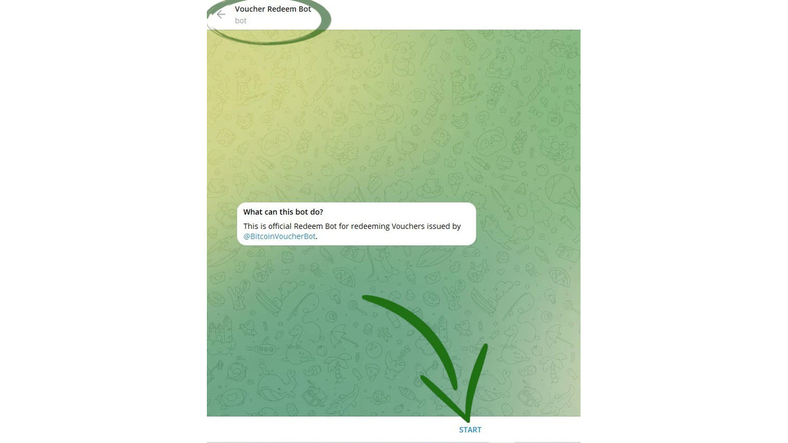

A questo punto RedeemBot carica il voucher onchain, facilmente riconoscibile da Voucher Code e reference ID. Inoltre sblocca la barra per scrivere i messaggi e iniziare a chattare con il bot, che ti invita a comunicargli un indirizzo onchain del tuo wallet.

**Nota**: questo indirizzo deve essere del tipo Segwit.

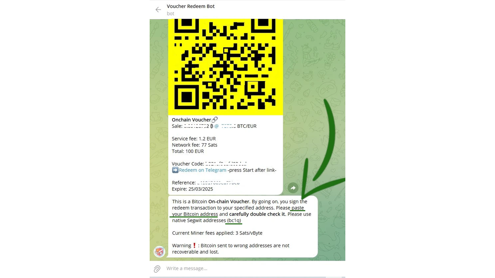

A questo punto apri il tuo wallet e genera un indirizzo SegWit.

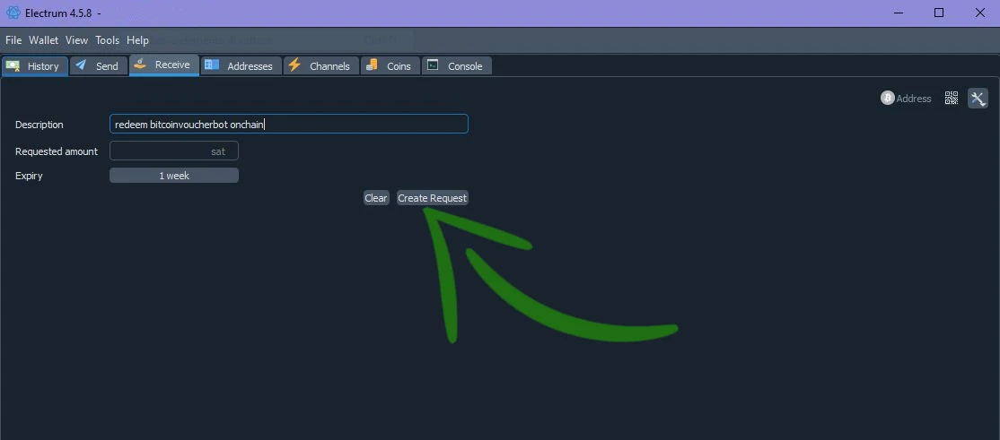

Copia l'indirizzo

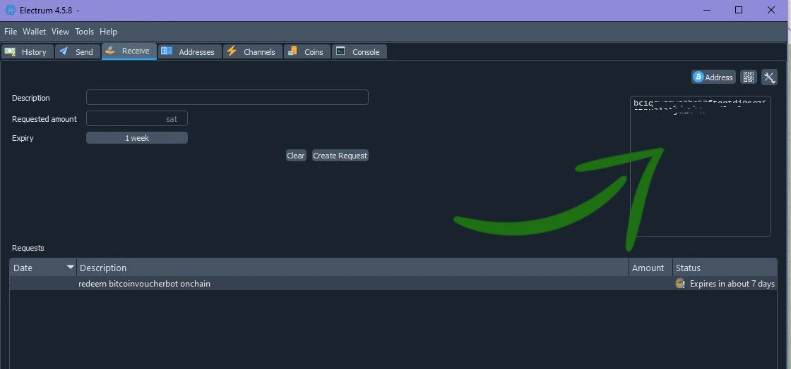

Incollalo nella chat con RedeemBot

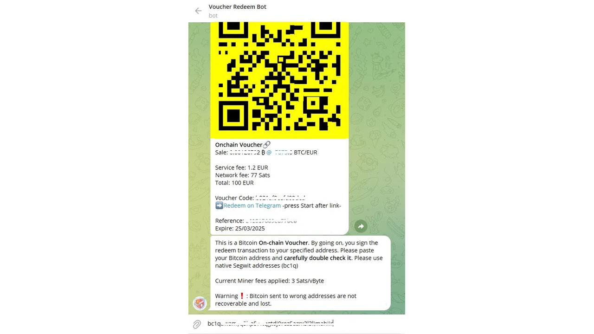

Ora appare una schermata di controllo per verificare che il codice del voucher sia corretto e che l’indirizzo comunicato a RedeemBot sia quello giusto. Controlla con attenzione, perché cliccando su _Proceed_, la transazione partirà e non potrai più recuperarla se, ad esempio, avessi indicato un indirizzo sbagliato.
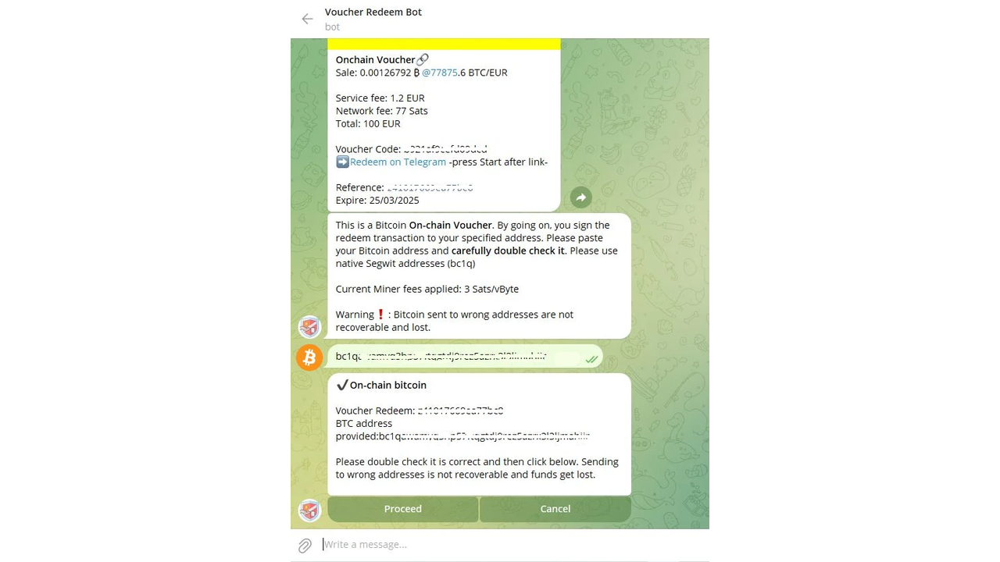

La transazione è partita e la procedura di redeem del voucher onchain termina così.

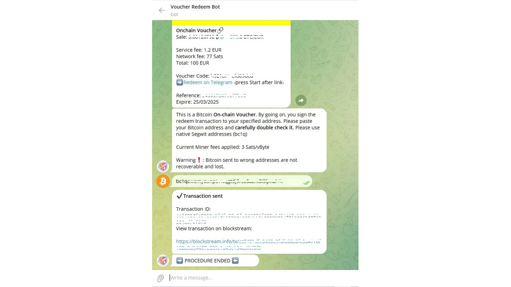

mentre l’importo compare nella cronologia del tuo wallet.

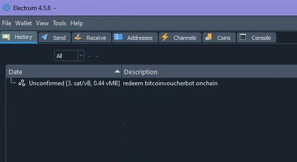
