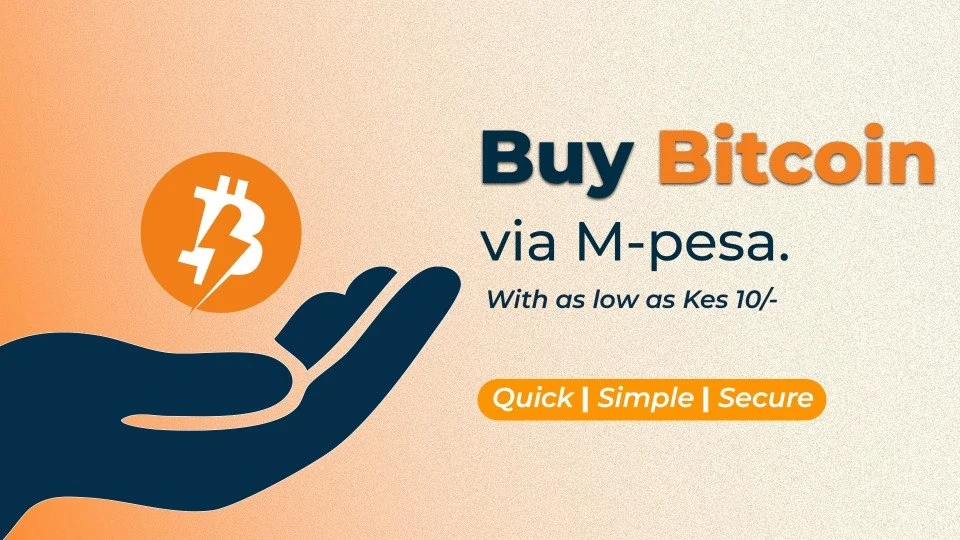
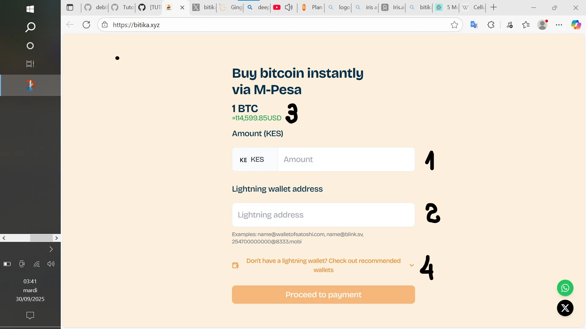
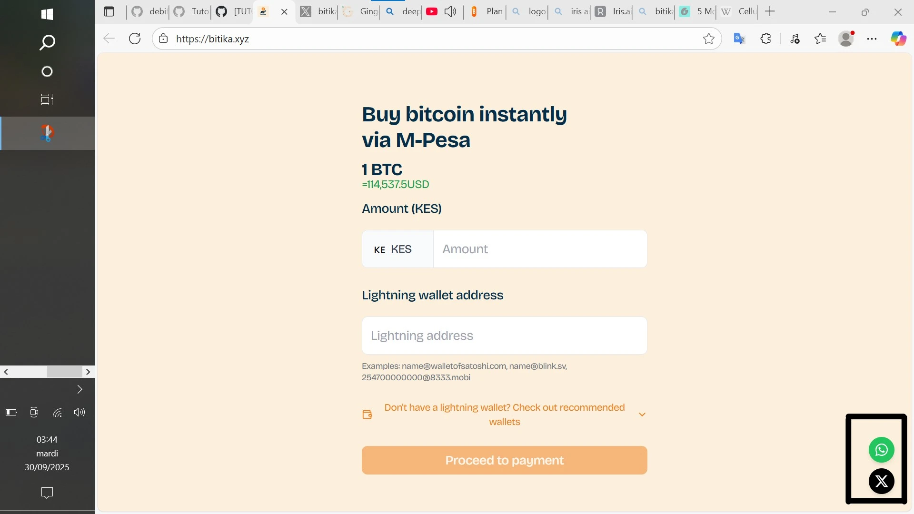

A criação de riqueza e a integração regional e comunitária baseiam-se nas trocas económicas. Estas trocas favorecem a circulação de dinheiro e estimulam o consumo. Ao longo do tempo, as trocas económicas assumiram muitas formas diferentes, desde a troca direta até à economia digital e à economia industrial.

A África está a tornar-se cada vez mais um terreno fértil para a economia digital, nomeadamente através da :

- serviços móveis de transferência de dinheiro (o primeiro serviço deste tipo, M-Pesa, foi lançado no Quénia pelo operador telefónico Safaricom);
- e activos digitais (principalmente Bitcoin pela sua natureza descentralizada, sem censura, etc.).

*o engenheiro de software *FIDEL OTIENO** criou então uma solução - **Bitika** - que combina o Bitcoin e o dinheiro móvel para facilitar o acesso das pessoas aos serviços financeiros.

A solução **Bitika** é uma plataforma queniana concebida não para impor novas ferramentas às transacções quotidianas, mas para acompanhar a população local em direção ao Bitcoin através do M-Pesa, a que estão habituados há anos.

Os quenianos podem assim comprar satoshis em três passos simples, sem KYC ou plataformas Exchange complexas.

## Começar a utilizar o Bitika

Para utilizar a solução, visitar a plataforma [Bitika] (https://bitika.xyz/). Seja no seu computador ou no seu smartphone, o Interface permanece o mesmo.

Tem :

1. o campo para introduzir o montante ;

2. o campo para colar o seu Lightning Address (apenas endereços) ;

3. preço do gW-5 em tempo real em dólares ;

4. carteiras Lightning recomendadas, se ainda não tiver uma.

## As três fases da compra

Para efetuar a sua compra :

1. introduza o montante da sua compra (em **KES**) e o Lightning Address do seu Wallet;

2. introduza e confirme o seu número M-Pesa;

3. introduza o código PIN da sua conta de dinheiro móvel M-Pesa para confirmar a sua compra.

O seu Wallet é quase instantaneamente creditado com os seus satoshis.

Tenha em atenção que o montante da sua compra na **Bitika** não pode ser **inferior** **50 KES** nem **superior** **10.000 KES** (xelins quenianos). A plataforma já registou uma escassez de satoshis (*sem stock*) devido à elevada procura. Este facto demonstra o entusiasmo da população local pela solução.

Não se esqueça de verificar cuidadosamente os pormenores e de assinalar a caixa antes de iniciar o pagamento. Além disso, aplicam-se taxas de serviço.

Além disso, a verificação **OTP** foi adicionada há alguns meses para garantir a segurança das transacções, devido ao facto de os burlões se fazerem passar por plataformas e aliciarem as pessoas a enviar dinheiro através do M-Pesa. É então enviado um código único por SMS para o seu telemóvel, válido por um curto período de tempo. O código é então introduzido no campo previsto para o efeito. Uma vez validado, será redireccionado para a página de pagamento.

## Carteiras recomendadas

*a *Bitika** recomenda carteiras Lightning como a :

- Wallet de Satoshi;

https://planb.network/tutorials/wallet/mobile/wallet-of-satoshi-39149d86-e42b-4e8f-ae9f-7e061e7784f7

- Pestanejar;

https://planb.network/tutorials/wallet/mobile/blink-7ea5f5a4-e728-4ff9-b3f9-cf20aa6fc2bd

- Machankura.

https://planb.network/tutorials/wallet/mobile/machankura-wallet-b41dd76d-a427-4cc1-992e-235dbb5884ae

Estes portefólios são apenas recomendações. Pode utilizar qualquer Wallet que suporte Lightning Network, desde que suporte generate e Address.

Para se manter a par das notícias sobre a solução, pode subscrever a sua conta X (por exemplo, Twitter) ou escrever para o seu número WhatsApp, clicando nos ícones no canto inferior direito do Coin.

Agora já domina a plataforma Bitika para comprar bitcoins instantaneamente.

Veja também o nosso tutorial sobre o Tando, outra solução queniana que lhe permite pagar bens e serviços, enviar dinheiro ou pagar contas com o Bitcoin.

https://planb.network/tutorials/exchange/centralized/tando-14a3d2f3-09d2-41c9-9e00-2f616dabea5c