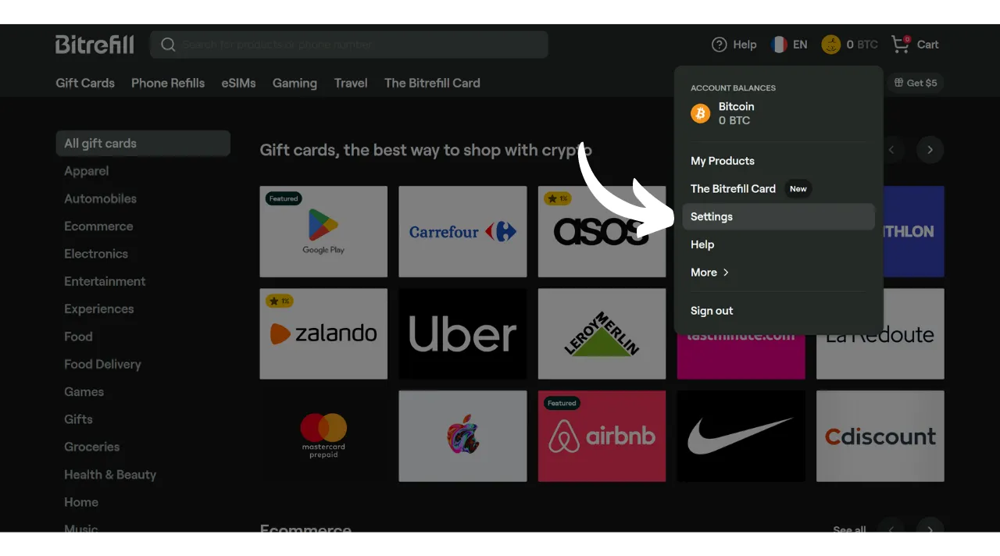
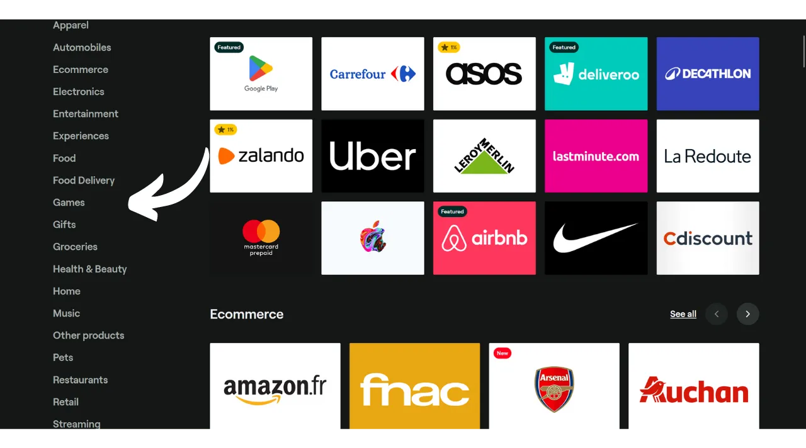
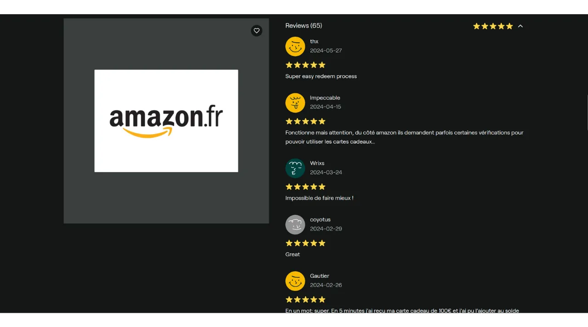
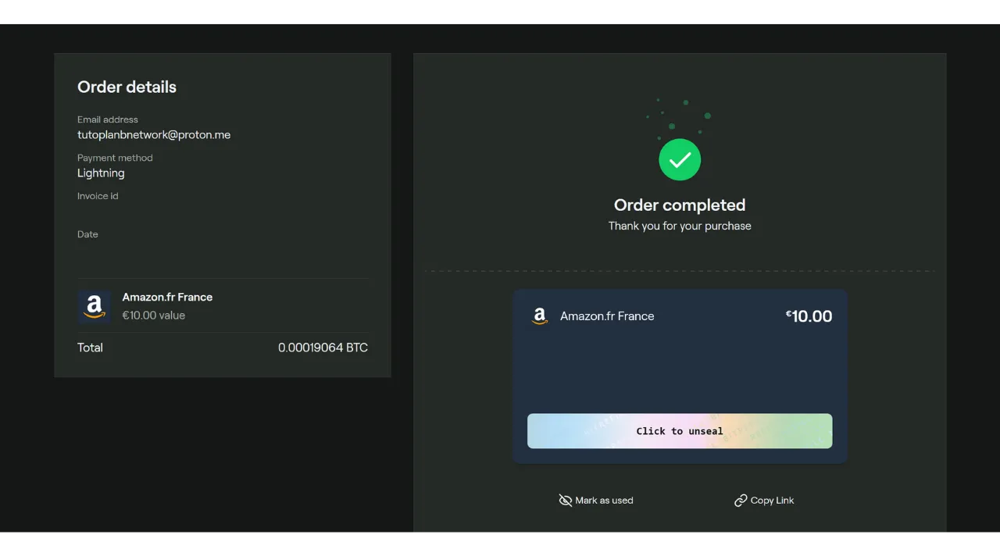

Ačkoliv je Bitcoin primárně považován za prostředek uchování hodnoty, zůstává měnou, jejíž užitečnost spočívá v její schopnosti přecházet z ruky do ruky. Pokud obchodníci ve vašem okolí přijímají Bitcoin jako platební metodu, máte možnost utrácet jej přímo u nich. Bohužel, tato praxe ještě není rozšířená a většina obchodníků zatím BTC nepřijímá nativně.

Nejlepším řešením zůstává "oranžová pilulka" pro místní obchodníky, aby je přiměla přijímat Bitcoin, vysvětlením výhod tohoto systému. Můžete využít tutoriály dostupné v sekci ["*merchants*"](https://planb.network/tutorials/merchant) na našem webu jako podporu. Tato strategie může být účinná u malých nezávislých obchodníků, ale u velkých národních řetězců se ukazuje jako složitější, jelikož kontakty na místě obvykle nejsou ti, kdo rozhodují o platebních metodách.

Dokud čekáme na masivnější přijetí těmito řetězci, můžete své bitcoiny utratit pomocí zprostředkující platební metody: dárkových karet. A to je přesně to, co Bitrefill nabízí.

## Co je Bitrefill?

Bitrefill je platforma, která vám umožňuje kupovat dárkové karty za bitcoiny. Myšlenka je použít tyto dárkové karty k nákupům u obchodníka vašeho výběru, čímž vám umožní získat zboží a služby za bitcoiny, i když je obchodník přímo nepřijímá. Jako Bitcoiner vám to umožňuje obejít problém omezeného přijetí BTC tradičními obchodníky a velkými řetězci. Navíc vám to umožňuje zpeněžit vaše bitcoiny bez nutnosti procházet burzovní platformou, která vyžaduje ověření identity (KYC).

Bitrefill nabízí velmi široký výběr od maloobchodu po rychlé občerstvení, včetně streamovacích platforem, online her, e-commerce stránek a dokonce i dobíjení telefonů.

Bitrefill je velmi snadné použít. Pro otevření účtu stačí poskytnout emailovou adresu. Takže nemusíte uvádět svou identitu. Poté jednoduše vyberete typ dárkové karty, zvolíte její částku a provedete platbu v bitcoinech. Jakmile je platba potvrzena (téměř okamžitě s Lightning), je vám poskytnut kód dárkové karty. Ten lze použít buď fyzicky v obchodě, nebo online na webu obchodníka.

## Jak vytvořit účet Bitrefill?
Navštivte [oficiální webovou stránku Bitrefill](https://www.bitrefill.com).
Klikněte v pravém horním rohu okna na "*Login*".

Klikněte na "*Create account*".

Zadejte emailovou adresu. Pokud si přejete udržet svůj účet anonymní, ujistěte se, že používáte emailovou adresu, která neodhaluje vaše jméno. Poté nastavte silné heslo.

Pokud se chcete dozvědět, jak snadno vytvořit bezpečnou emailovou schránku a jak spravovat vaše hesla, doporučuji konzultovat tyto 2 další tutoriály:

https://planb.network/tutorials/others/proton-mail

https://planb.network/tutorials/others/bitwarden

Poté klikněte na tlačítko "*Create account*".

Přejděte do své poštovní schránky pro získání ověřovacího kódu.

Zadejte jej do pole "*Login code*" a poté znovu klikněte na tlačítko "*Create account*".
 A máte to, váš účet je nyní vytvořen!

Doporučuji vám také nastavit 2FA pro zabezpečení vašeho účtu. K tomu klikněte na svůj profil v pravém horním rohu obrazovky.

Klikněte na menu "*Nastavení*".

A přejděte na záložku "*Přihlášení & Bezpečnost*".

V sekci "*Dvoufaktorové ověření*" klikněte na tlačítko "*Povolit*" a postupujte podle procesu nastavení.

Pokud se chcete dozvědět více o tom, jak používat dvoufaktorové ověření pro zabezpečení vašich online účtů, doporučuji objevit tento další tutoriál:

https://planb.network/tutorials/others/authy

## Jak koupit dárkovou kartu v BTC na Bitrefill?

Vlevo si můžete vybrat produkt nebo oblast služeb.

Vyberte značku podle vašeho výběru.

Prvním krokem na stránce dárkové karty je zkontrolovat její dostupnost podle zemí. Ujistěte se, že vaše země je touto kartou podporována.

Poté vám doporučuji si najít čas na prohlédnutí sekce s komentáři, abyste objevili názory komunity na tuto dárkovou kartu.

V této sekci často najdete malé tipy od ostatních uživatelů.

V sekci "*Popis*" a "*Jak uplatnit*" najdete další podrobnosti o dárkové kartě. 
Pokud si ji přejete zakoupit, klikněte na pole označující částku pro výběr hodnoty vaší dárkové karty.

Pokud vám vše vyhovuje, klikněte na tlačítko "*Přidat do košíku*".

Poté klikněte na "*Pokladna*", pokud si přejete zakoupit pouze tuto kartu prozatím.

Dále si vyberte způsob platby. Můžete platit buď onchain nebo na Lightning Network. V mém případě jde o malou částku, takže zaplatím na LN.

Stačí naskenovat a zaplatit fakturu pomocí vaší Lightning peněženky. Mějte na paměti, že kvůli minimalizaci rizik spojených s cenovými fluktuacemi je vaše faktura platná pouze 30 minut.

Jakmile je faktura zaplacena, okamžitě získáte přístup k dárkové kartě pro většinu karet.

Pro přístup k jejímu kódu klikněte na tlačítko "*Klikněte pro odkrytí*".

Poté jednoduše zkopírujte kód a použijte ho na webových stránkách prodejce nebo jej předložte při placení v kamenném obchodě.

Všechny vaše dárkové karty najdete kliknutím na svůj profil v pravém horním rohu, poté na menu "*Moje produkty*".

Doporučuji také stáhnout si aplikaci Bitrefill, která je dostupná na [Google Play Store](https://play.google.com/store/apps/details?id=com.bitrefill.app) a na [App Store](https://apps.apple.com/in/app/bitrefill/id1378102623), abyste mohli denně kupovat a používat dárkové karty v kamenných obchodech.
A to je vše, nyní víte, jak utrácet vaše bitcoiny bez KYC u hlavních maloobchodníků pro vaše každodenní výdaje. Osobně považuji tuto metodu za dočasné řešení, dokud více obchodníků nenaintegruje bitcoin přímo u svých prodejních míst. Nicméně, zatím zůstává velmi pohodlnou možností.

Pokud si přejete přispět k popularizaci Bitcoinu a povzbudit nezávislého obchodníka k adopci této platební metody, doporučuji se poradit s naším kompletním tutoriálem na Swiss Bitcoin Pay. Jedná se o všestranné řešení pro procesory BTC plateb, snadno se instaluje a spravuje na denní bázi:

https://planb.network/tutorials/merchant/swiss-bitcoin-pay-2