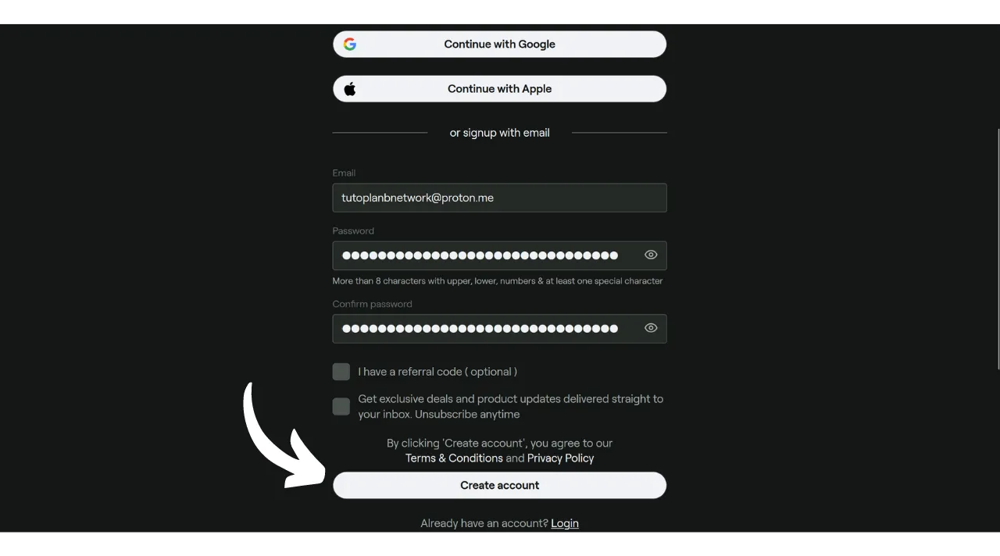

Obwohl Bitcoin heute hauptsächlich als Sparmittel betrachtet wird, bleibt es eine Währung, deren Nutzen in ihrer Fähigkeit liegt, von Hand zu Hand zu zirkulieren. Wenn Händler in Ihrer Umgebung Bitcoin als Zahlungsmethode akzeptieren, haben Sie die Möglichkeit, direkt bei ihnen damit zu bezahlen. Leider ist diese Praxis noch nicht weit verbreitet, und die meisten Händler akzeptieren BTC noch nicht nativ.

Die beste Lösung bleibt, lokale Händler zu "orange pillen", um sie dazu zu bringen, Bitcoin zu akzeptieren, indem man ihnen die Vorteile dieses Systems erklärt. Sie können die Tutorials im Abschnitt ["*merchants*"](https://planb.network/tutorials/merchant) unserer Website als Unterstützung verwenden. Diese Strategie kann bei kleinen unabhängigen Händlern wirksam sein, erweist sich jedoch bei großen nationalen Ketten als komplexer, da die vor Ort anwesenden Kontakte in der Regel nicht diejenigen sind, die Entscheidungen bezüglich der Zahlungsmethoden treffen.

Während man auf eine massivere Annahme durch diese Ketten wartet, kann man seine Bitcoins über eine Zwischenzahlungsmethode ausgeben: Geschenkkarten. Und genau das bietet Bitrefill an.

## Was ist Bitrefill?

Bitrefill ist eine Plattform, die es Ihnen ermöglicht, Geschenkkarten mit Bitcoins zu kaufen. Die Idee ist, diese Geschenkkarten zu nutzen, um Einkäufe beim Händler Ihrer Wahl zu tätigen, und so Waren und Dienstleistungen mit Bitcoins zu erwerben, auch wenn der Händler sie nicht direkt akzeptiert. Als Bitcoiner ermöglicht Ihnen dies, das Problem der begrenzten BTC-Akzeptanz durch traditionelle Händler und große Ketten zu umgehen. Darüber hinaus ermöglicht es Ihnen, Ihre Bitcoins zu liquidieren, ohne über eine Austauschplattform gehen zu müssen, die eine Identitätsüberprüfung (KYC) erfordert.

Bitrefill bietet eine sehr breite Auswahl, die von Einzelhandel bis zu Fast Food, einschließlich Streaming-Plattformen, Online-Spielen, E-Commerce-Seiten und sogar Telefonaufladungen reicht.

Bitrefill ist sehr einfach zu bedienen. Um ein Konto zu eröffnen, müssen Sie lediglich eine E-Mail-Adresse angeben. Sie müssen also nicht Ihre Identität preisgeben. Dann wählen Sie einfach die Art der Geschenkkarte aus, wählen deren Betrag und tätigen die Zahlung in Bitcoins. Sobald die Zahlung bestätigt ist (fast sofort mit Lightning), wird Ihnen der Geschenkkartencode gegeben. Dieser kann entweder physisch im Geschäft oder online auf der Website des Händlers verwendet werden.

## Wie erstellt man ein Bitrefill-Konto?
Besuchen Sie die [offizielle Bitrefill-Website](https://www.bitrefill.com).
Klicken Sie oben rechts im Fenster auf "*Login*".

Klicken Sie auf "*Konto erstellen*".

Geben Sie eine E-Mail-Adresse ein. Wenn Sie Ihr Konto anonym halten möchten, stellen Sie sicher, dass Sie eine E-Mail-Adresse verwenden, die Ihren Namen nicht preisgibt. Dann setzen Sie ein starkes Passwort.

Wenn Sie erfahren möchten, wie Sie einfach ein sicheres E-Mail-Postfach erstellen und wie Sie Ihre Passwörter verwalten können, empfehle ich, diese 2 anderen Tutorials zu konsultieren:

https://planb.network/tutorials/others/proton-mail

https://planb.network/tutorials/others/bitwarden

Klicken Sie dann auf den Button "*Konto erstellen*".

Gehen Sie zu Ihrem Postfach, um den Verifizierungscode abzurufen.

Geben Sie ihn in das Feld "*Login-Code*" ein und klicken Sie dann erneut auf den Button "*Konto erstellen*".
Und da haben Sie es, Ihr Konto ist jetzt erstellt!
Ich rate Ihnen auch, die Zwei-Faktor-Authentifizierung (2FA) einzurichten, um Ihr Konto zu sichern. Dazu klicken Sie oben rechts auf der Seite auf Ihr Profil.
Klicken Sie auf das Menü "*Einstellungen*".
Und gehen Sie zum Tab "*Login & Sicherheit*".
Im Abschnitt "*Zwei-Faktor-Authentifizierung*" klicken Sie auf den Button "*Aktivieren*" und folgen dem Einrichtungsprozess.
Um mehr darüber zu erfahren, wie Sie die Zwei-Faktor-Authentifizierung nutzen können, um Ihre Online-Konten zu sichern, empfehle ich, dieses andere Tutorial zu entdecken:

https://planb.network/tutorials/others/authy

## Wie kauft man eine Geschenkkarte in BTC auf Bitrefill?

Links können Sie einen Produkt- oder Dienstleistungsbereich auswählen.
Wählen Sie die Marke Ihrer Wahl.
Der erste Schritt auf der Geschenkkartenseite ist, die Verfügbarkeit nach Ländern zu überprüfen. Stellen Sie sicher, dass Ihr Land von dieser Karte unterstützt wird.
Ich rate Ihnen dann, sich Zeit zu nehmen, um den Kommentarbereich zu konsultieren, um die Meinungen der Community zu dieser Geschenkkarte zu entdecken.
In diesem Abschnitt finden Sie oft kleine Tipps von anderen Nutzern.
In den Abschnitten "*Beschreibung*" und "*So lösen Sie ein*" finden Sie zusätzliche Details zur Geschenkkarte.
Wenn Sie sie kaufen möchten, klicken Sie auf das Feld, das den Betrag anzeigt, um den Wert Ihrer Geschenkkarte auszuwählen.
Wenn Ihnen alles zusagt, klicken Sie auf den Button "*In den Warenkorb*".
Klicken Sie dann auf "*Zur Kasse*", wenn Sie vorerst nur diese Karte kaufen möchten.
Wählen Sie als Nächstes eine Zahlungsmethode. Sie können entweder onchain oder im Lightning Network bezahlen. In meinem Fall ist es ein kleiner Betrag, also werde ich im LN bezahlen.
Sie müssen nur die Rechnung mit Ihrer Lightning-Wallet scannen und bezahlen. Beachten Sie, um die Risiken im Zusammenhang mit Preisschwankungen zu minimieren, ist Ihre Rechnung nur 30 Minuten gültig.
Sobald die Rechnung bezahlt ist, erhalten Sie sofort Zugang zur Geschenkkarte für die Mehrheit der Karten.

Um auf den Code zuzugreifen, klicken Sie auf den Button "*Zum Entriegeln klicken*".
Sie kopieren einfach den Code und verwenden ihn auf der Website des Einzelhändlers oder präsentieren ihn an der Kasse in einem physischen Geschäft.
Sie können alle Ihre Geschenkkarten finden, indem Sie oben rechts auf Ihr Profil klicken und dann auf das Menü "*Meine Produkte*".
Ich empfehle auch, die Bitrefill-App herunterzuladen, verfügbar im [Google Play Store](https://play.google.com/store/apps/details?id=com.bitrefill.app) und im [App Store](https://apps.apple.com/in/app/bitrefill/id1378102623), um Geschenkkarten täglich in physischen Geschäften kaufen und nutzen zu können.
Und damit wissen Sie jetzt, wie Sie Ihre Bitcoins ohne KYC bei großen Einzelhändlern für Ihre alltäglichen Ausgaben ausgeben können. Persönlich betrachte ich diese Methode als eine vorübergehende Lösung, bis mehr Händler Bitcoin nativ an ihren Verkaufsstellen integrieren. Es bleibt jedoch vorerst eine sehr bequeme Option.

Wenn Sie zur Popularisierung von Bitcoin beitragen und einen unabhängigen Händler ermutigen möchten, diese Zahlungsmethode zu adoptieren, empfehle ich, unser komplettes Tutorial über Swiss Bitcoin Pay zu konsultieren. Es ist eine All-in-One-Lösung für BTC-Zahlungsprozessoren, einfach zu installieren und täglich zu verwalten:

https://planb.network/tutorials/merchant/swiss-bitcoin-pay-2