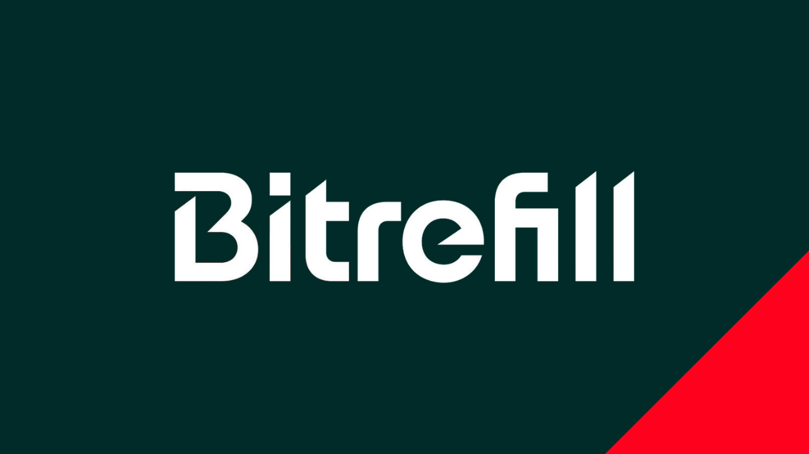
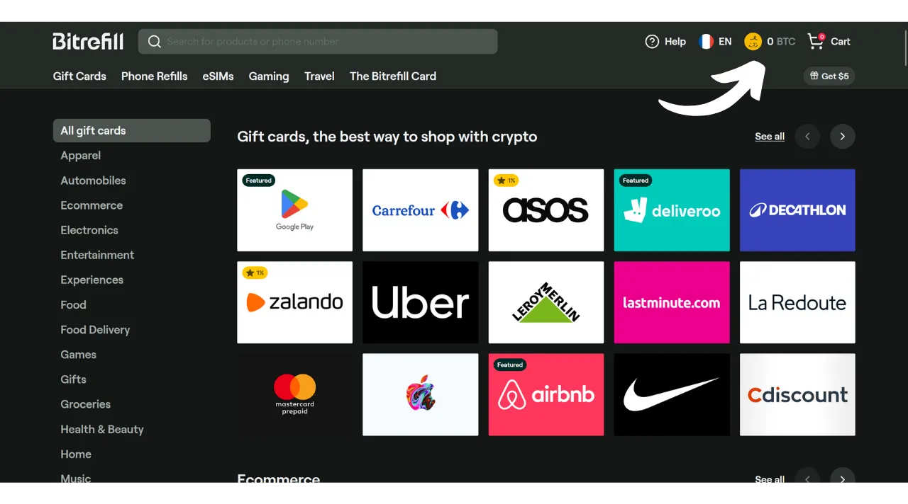
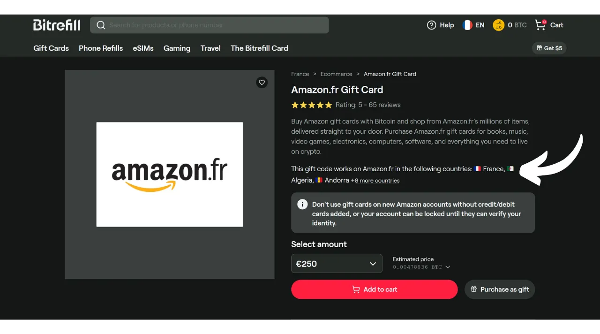

Although Bitcoin is primarily considered a means of saving today, it remains a currency whose utility lies in its ability to circulate from hand to hand. If merchants around you accept Bitcoin as a payment method, you have the option to spend it directly with them. Unfortunately, this practice is not yet widespread, and most merchants do not yet accept BTC natively.

The best solution remains to "orange pill" local merchants to get them to accept Bitcoin, by explaining the advantages of this system. You can use the tutorials available in the ["*merchants*"](https://planb.network/tutorials/merchant) section of our site as support. This strategy can be effective with small independent merchants, but it proves more complex for large national chains, as the contacts on-site are generally not the ones making decisions regarding payment methods.

While waiting for more massive adoption by these chains, you can spend your bitcoins using an intermediary payment method: gift cards. And this is precisely what Bitrefill offers to provide you.

## What is Bitrefill?

Bitrefill is a platform that allows you to buy gift cards with bitcoins. The idea is to use these gift cards to make purchases at the retailer of your choice, thus allowing you to acquire goods and services with bitcoins, even if the merchant does not accept them directly. As a Bitcoiner, this allows you to circumvent the problem of limited BTC adoption by traditional merchants and large chains. Moreover, it enables you to liquidate your bitcoins without having to go through an exchange platform that requires identity verification (KYC).

Bitrefill offers a very wide choice ranging from retail to fast food, including streaming platforms, online games, e-commerce sites, and even phone top-ups.

Bitrefill is very easy to use. To open an account, you just need to provide an email address. So, you do not need to give your identity. Then, you simply select the type of gift card, choose its amount, and make the payment in bitcoins. Once the payment is confirmed (almost instantly with Lightning), the gift card code is given to you. This can be used either physically in-store or online on the retailer's website.

## How to create a Bitrefill account?
Visit the [official Bitrefill website](https://www.bitrefill.com).
Click on "*Login*" at the top right of the window.

Click on "*Create account*".

Enter an email address. If you wish to keep your account anonymous, make sure to use an email address that does not reveal your name. Then, set a strong password.

If you want to learn how to easily create a secure email box and how to manage your passwords, I recommend consulting these 2 other tutorials:

https://planb.network/tutorials/others/proton-mail

https://planb.network/tutorials/others/bitwarden

Then, click on the "*Create account*" button.

Go to your mailbox to retrieve the verification code.

Enter it in the "*Login code*" box and then click on the "*Create account*" button again.

And there you have it, your account is now created!

I also advise you to set up 2FA to secure your account. To do this, click on your profile at the top right of the screen.

Click on the "*Settings*" menu.

And go to the "*Login & Security*" tab.

In the "*Two factor authentication*" section, click on the "*Enable*" button and follow the setup process.

To learn more about how to use two-factor authentication to secure your online accounts, I recommend discovering this other tutorial:

https://planb.network/tutorials/others/authy

## How to buy a gift card in BTC on Bitrefill?

On the left, you can choose a product or service domain.

Choose the brand of your choice.

The first step to perform on the gift card page is to check its availability according to countries. Make sure that your country is supported by this card.

I then advise you to take the time to consult the comments section to discover the community's opinions regarding this gift card.

In this section, you will often find small tips from other users.

In the "*Description*" and "*How to redeem*" sections, you will find additional details about the gift card. 
If you wish to purchase it, click on the box indicating the amount to select the value of your gift card.

If everything looks good to you, click on the "*Add to cart*" button.

Then click on "*Checkout*" if you wish to purchase only this card for now.

Next, choose a payment method. You can either pay onchain or on the Lightning Network. In my case, it's a small amount, so I will pay on LN.

You just need to scan and pay the invoice with your Lightning wallet. Be aware, to minimize the risks associated with price fluctuations, your invoice is only valid for 30 minutes.

Once the invoice is paid, you will immediately gain access to the gift card for the majority of cards.

To access its code, click on the "*Click to unseal*" button.

You then simply copy the code and use it on the retailer's website or present it at the checkout in a physical store.

You can find all your gift cards by clicking on your profile at the top right, then on the "*My Products*" menu.

I also recommend downloading the Bitrefill app, available on the [Google Play Store](https://play.google.com/store/apps/details?id=com.bitrefill.app) and the [App Store](https://apps.apple.com/in/app/bitrefill/id1378102623), to be able to buy and use gift cards daily in physical stores.

And there you have it, you now know how to spend your bitcoins without KYC at major retailers for your everyday expenses. Personally, I consider this method as a temporary solution until more merchants integrate bitcoin natively at their points of sale. However, it remains a very convenient option for the time being.

If you wish to contribute to the popularization of Bitcoin and encourage an independent merchant to adopt this payment method, I recommend consulting our complete tutorial on Swiss Bitcoin Pay. It is an all-in-one solution for BTC payment processors, easy to install and manage on a daily basis:

https://planb.network/tutorials/merchant/swiss-bitcoin-pay-2