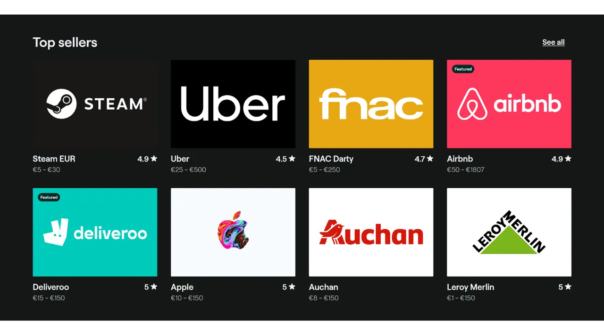
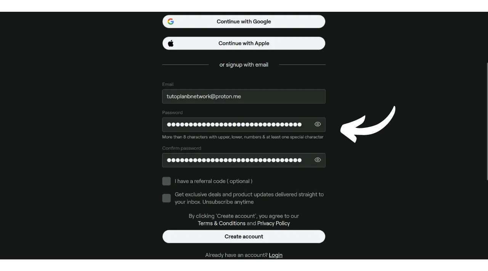

Aunque hoy en día Bitcoin se considera principalmente como un medio de ahorro, sigue siendo una moneda cuya utilidad radica en su capacidad para circular de mano en mano. Si los comerciantes a tu alrededor aceptan Bitcoin como método de pago, tienes la opción de gastarlo directamente con ellos. Desafortunadamente, esta práctica aún no está muy extendida, y la mayoría de los comerciantes aún no aceptan BTC de forma nativa.

La mejor solución sigue siendo "convencer" a los comerciantes locales para que acepten Bitcoin, explicándoles las ventajas de este sistema. Puedes usar los tutoriales disponibles en la sección ["*merchants*"](https://planb.network/tutorials/merchant) de nuestro sitio como apoyo. Esta estrategia puede ser efectiva con pequeños comerciantes independientes, pero resulta más compleja para grandes cadenas nacionales, ya que los contactos en el lugar generalmente no son quienes toman decisiones respecto a los métodos de pago.

Mientras esperamos una adopción más masiva por parte de estas cadenas, puedes gastar tus bitcoins utilizando un método de pago intermediario: tarjetas de regalo. Y esto es precisamente lo que Bitrefill ofrece proporcionarte.

## ¿Qué es Bitrefill?

Bitrefill es una plataforma que te permite comprar tarjetas de regalo con bitcoins. La idea es usar estas tarjetas de regalo para hacer compras en el comercio de tu elección, permitiéndote así adquirir bienes y servicios con bitcoins, incluso si el comerciante no los acepta directamente. Como Bitcoiner, esto te permite sortear el problema de la limitada adopción de BTC por parte de comerciantes tradicionales y grandes cadenas. Además, te permite liquidar tus bitcoins sin tener que pasar por una plataforma de intercambio que requiere verificación de identidad (KYC).

Bitrefill ofrece una amplia gama de opciones que van desde retail hasta comida rápida, incluyendo plataformas de streaming, juegos en línea, sitios de comercio electrónico e incluso recargas telefónicas.

Bitrefill es muy fácil de usar. Para abrir una cuenta, solo necesitas proporcionar una dirección de correo electrónico. Así, no necesitas dar tu identidad. Luego, simplemente seleccionas el tipo de tarjeta de regalo, eliges su monto y realizas el pago en bitcoins. Una vez que el pago se confirma (casi instantáneamente con Lightning), se te da el código de la tarjeta de regalo. Este puede usarse ya sea físicamente en la tienda o en línea en el sitio web del comerciante.

## ¿Cómo crear una cuenta en Bitrefill?
Visita el [sitio oficial de Bitrefill](https://www.bitrefill.com).
Haz clic en "*Login*" en la parte superior derecha de la ventana.

Haz clic en "*Create account*".

Ingresa una dirección de correo electrónico. Si deseas mantener tu cuenta de forma anónima, asegúrate de usar una dirección de correo electrónico que no revele tu nombre. Luego, establece una contraseña fuerte.

Si quieres aprender cómo crear fácilmente un buzón de correo electrónico seguro y cómo gestionar tus contraseñas, te recomiendo consultar estos otros 2 tutoriales:

https://planb.network/tutorials/others/proton-mail

https://planb.network/tutorials/others/bitwarden

Luego, haz clic en el botón "*Create account*".

Ve a tu buzón de correo para recuperar el código de verificación.

Introdúcelo en el cuadro "*Login code*" y luego haz clic nuevamente en el botón "*Create account*".
¡Y ahí lo tienes, tu cuenta ha sido creada!

También te aconsejo configurar la autenticación de dos factores (2FA) para asegurar tu cuenta. Para hacerlo, haz clic en tu perfil en la parte superior derecha de la pantalla.

Haz clic en el menú "*Settings*".

Y ve a la pestaña "*Login & Security*".

En la sección "*Two factor authentication*", haz clic en el botón "*Enable*" y sigue el proceso de configuración.

Para aprender más sobre cómo usar la autenticación de dos factores para asegurar tus cuentas en línea, te recomiendo descubrir este otro tutorial:

https://planb.network/tutorials/others/authy

## ¿Cómo comprar una tarjeta de regalo en BTC en Bitrefill?

A la izquierda, puedes elegir un dominio de producto o servicio.

Elige la marca de tu preferencia.

El primer paso a realizar en la página de la tarjeta de regalo es verificar su disponibilidad según los países. Asegúrate de que tu país esté soportado por esta tarjeta.

Luego te aconsejo tomarte el tiempo para consultar la sección de comentarios para descubrir las opiniones de la comunidad respecto a esta tarjeta de regalo.

En esta sección, a menudo encontrarás pequeños consejos de otros usuarios.

En las secciones "*Description*" y "*How to redeem*", encontrarás detalles adicionales sobre la tarjeta de regalo. 
Si deseas comprarla, haz clic en el cuadro que indica el monto para seleccionar el valor de tu tarjeta de regalo.

Si todo te parece correcto, haz clic en el botón "*Add to cart*".

Luego haz clic en "*Checkout*" si deseas comprar solo esta tarjeta por ahora.

A continuación, elige un método de pago. Puedes pagar mediante onchain o en la Lightning Network. En mi caso, es una cantidad pequeña, así que pagaré en LN.

Solo necesitas escanear y pagar la factura con tu billetera Lightning. Ten en cuenta que, para minimizar los riesgos asociados con las fluctuaciones de precios, tu factura solo es válida durante 30 minutos.

Una vez pagada la factura, inmediatamente tendrás acceso a la tarjeta de regalo para la mayoría de las tarjetas.

Para acceder a su código, haz clic en el botón "*Click to unseal*".

Luego simplemente copia el código y úsalo en el sitio web del minorista o preséntalo en la caja de una tienda física.

Puedes encontrar todas tus tarjetas de regalo haciendo clic en tu perfil en la parte superior derecha, luego en el menú "*My Products*".

También recomiendo descargar la aplicación Bitrefill, disponible en [Google Play Store](https://play.google.com/store/apps/details?id=com.bitrefill.app) y en la [App Store](https://apps.apple.com/in/app/bitrefill/id1378102623), para poder comprar y usar tarjetas de regalo diariamente en tiendas físicas.
Y ahí lo tienes, ahora sabes cómo gastar tus bitcoins sin KYC en grandes minoristas para tus gastos diarios. Personalmente, considero este método como una solución temporal hasta que más comerciantes integren bitcoin de manera nativa en sus puntos de venta. Sin embargo, sigue siendo una opción muy conveniente por el momento.

Si deseas contribuir a la popularización de Bitcoin y animar a un comerciante independiente a adoptar este método de pago, te recomiendo consultar nuestro tutorial completo sobre Swiss Bitcoin Pay. Es una solución todo en uno para procesadores de pago de BTC, fácil de instalar y gestionar a diario:

https://planb.network/tutorials/merchant/swiss-bitcoin-pay-2