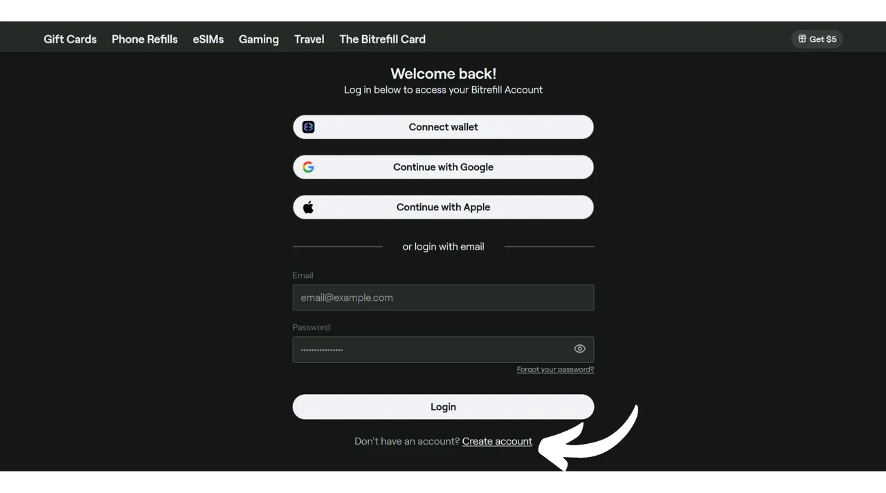
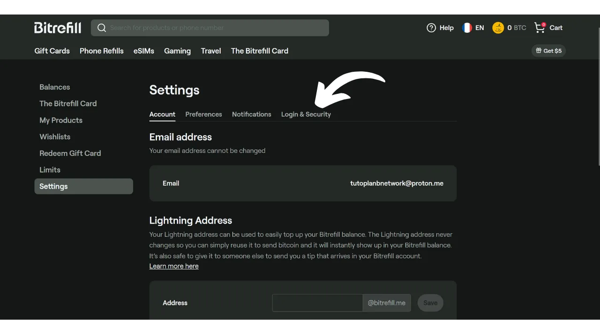
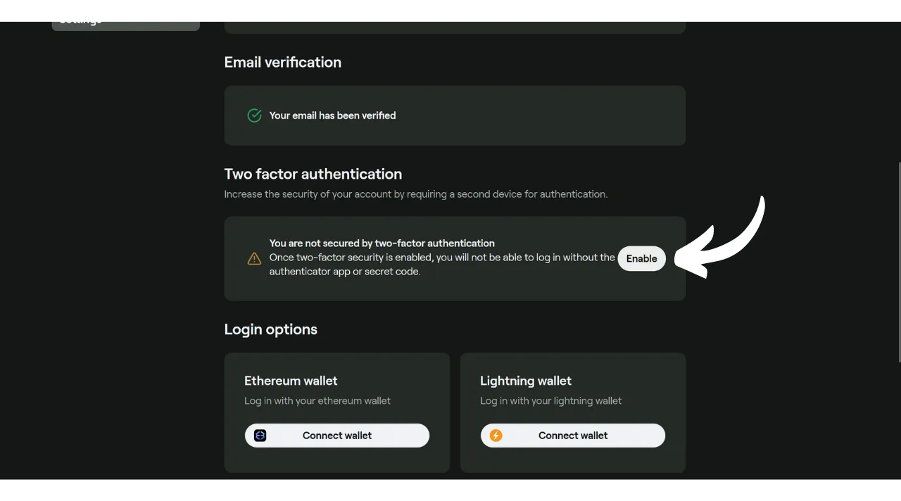
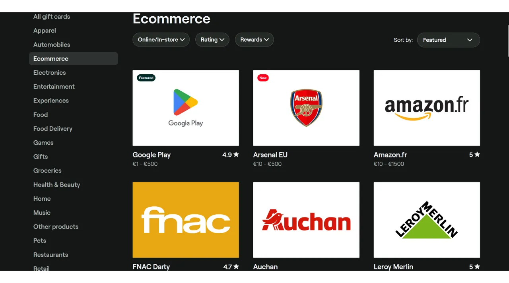
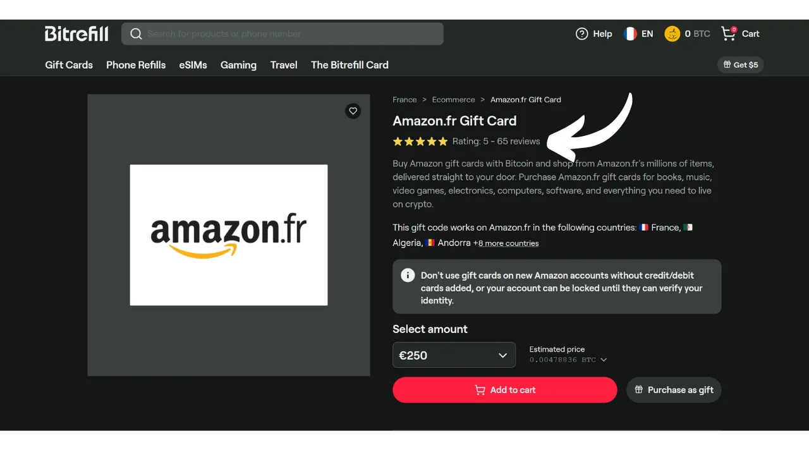
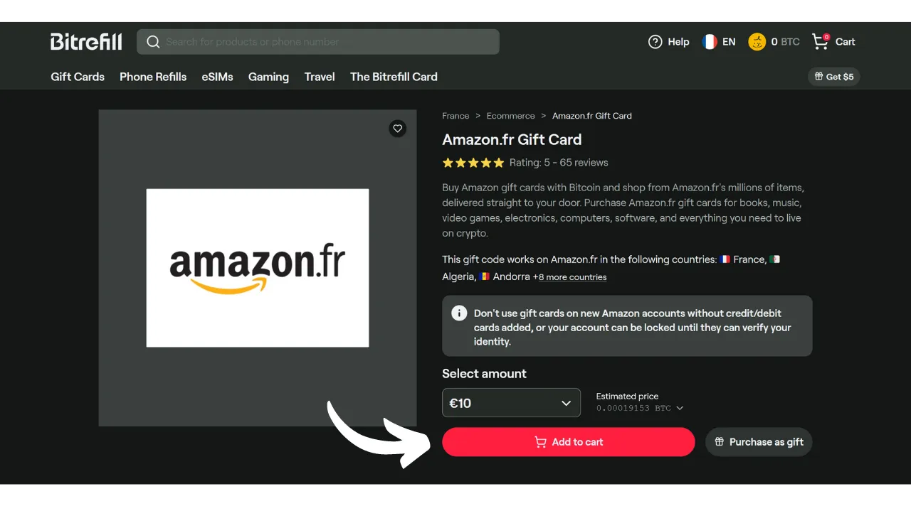
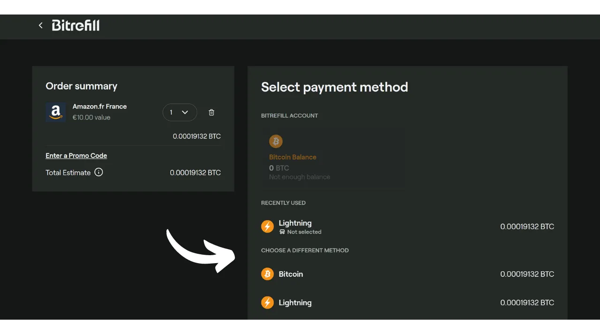

Kuigi Bitcoini peetakse peamiselt säästmisvahendiks, on see siiski valuuta, mille kasulikkus seisneb selle võimes liikuda käest kätte. Kui kaupmehed teie ümber aktsepteerivad Bitcoini makseviisina, on teil võimalus seda otse nendega kulutada. Kahjuks ei ole see praktika veel laialt levinud ja enamik kaupmehi ei aktsepteeri BTC-d veel omal algatusel.

Parim lahendus jääb kohalike kaupmeeste "oranžiks pilliks" muutmiseks, et panna neid Bitcoini aktsepteerima, selgitades selle süsteemi eeliseid. Saate toetuseks kasutada meie saidi jaotises ["*kaupmehed*"](https://planb.network/tutorials/merchant) saadaolevaid õpetusi. See strateegia võib olla tõhus väikeste iseseisvate kaupmeeste puhul, kuid suurte rahvuslike kettide puhul osutub see keerulisemaks, kuna kohapealsed kontaktid ei ole üldiselt need, kes otsustavad makseviiside üle.

Oodates nende kettide laiemat omaksvõttu, saate oma bitcoine kulutada kasutades vahendajat: kinkekaarte. Ja just seda Bitrefill teile pakubki.

## Mis on Bitrefill?

Bitrefill on platvorm, mis võimaldab teil osta kinkekaarte bitcoinidega. Idee on kasutada neid kinkekaarte ostude tegemiseks teie valitud jaemüüja juures, võimaldades seeläbi hankida kaupu ja teenuseid bitcoinidega, isegi kui kaupmees neid otse ei aktsepteeri. Bitcoini kasutajana võimaldab see teil mööda minna traditsiooniliste kaupmeeste ja suurte kettide piiratud BTC omaksvõtu probleemist. Lisaks võimaldab see teil oma bitcoine likvideerida ilma, et peaksite läbima vahetusplatvormi, mis nõuab isikutuvastust (KYC).

Bitrefill pakub väga laia valikut alates jaemüügist kuni kiirtoiduni, sealhulgas voogedastusplatvormid, online-mängud, e-kaubanduse saidid ja isegi telefoni laadimised.

Bitrefilli kasutamine on väga lihtne. Konto avamiseks piisab, kui esitate e-posti aadressi. Seega ei pea te oma isikut avaldama. Seejärel valite lihtsalt kinkekaardi tüübi, valite selle summa ja teete makse bitcoinides. Kui makse on kinnitatud (peaaegu koheselt Lightninguga), antakse teile kinkekaardi kood. Seda saab kasutada kas füüsiliselt poes või jaemüüja veebisaidil.

## Kuidas luua Bitrefilli konto?
Külastage [ametlikku Bitrefilli veebisaiti](https://www.bitrefill.com).
Klõpsake akna paremas ülanurgas nupul "*Logi sisse*".

Klõpsake nupul "*Loo konto*".

Sisestage e-posti aadress. Kui soovite oma konto anonüümseks jätta, veenduge, et kasutate e-posti aadressi, mis ei paljasta teie nime. Seejärel seadke tugev parool.

Kui soovite teada, kuidas hõlpsalt luua turvaline e-posti kast ja kuidas hallata oma paroole, soovitan konsulteerida nende kahe muu õpetusega:

https://planb.network/tutorials/others/proton-mail

https://planb.network/tutorials/others/bitwarden

Seejärel klõpsake nupul "*Loo konto*".

Minge oma postkasti, et hankida kinnituskood.

Sisestage see "*Sisselogimiskoodi*" lahtrisse ja seejärel klõpsake uuesti nupul "*Loo konto*".
 Ja ongi tehtud, teie konto on nüüd loodud!

Soovitan teil seadistada ka kahefaktorilise autentimise (2FA), et oma kontot turvata. Selleks klõpsake ekraani paremas ülanurgas oma profiilil.

Klõpsake menüül "*Settings*".

Ja minge vahekaardile "*Login & Security*".

Jaotises "*Two factor authentication*" klõpsake nupul "*Enable*" ja järgige seadistamise protsessi.

Et rohkem teada saada, kuidas kahefaktorilist autentimist kasutades oma veebikontosid turvata, soovitan tutvuda selle teise õpetusega:

https://planb.network/tutorials/others/authy

## Kuidas osta Bitrefillis BTC eest kinkekaarti?

Vasakul saate valida toote või teenuse valdkonna.

Valige endale meelepärane bränd.

Kinkekaardi lehel esimene samm on kontrollida selle saadavust erinevates riikides. Veenduge, et teie riik on selle kaardi poolt toetatud.

Seejärel soovitan teil võtta aega kommentaaride sektsiooni uurimiseks, et avastada kogukonna arvamusi selle kinkekaardi kohta.

Selles jaotises leiate sageli teistelt kasutajatelt väikeseid näpunäiteid.

Jaotistes "*Description*" ja "*How to redeem*" leiate kinkekaardi kohta lisateavet. 
Kui soovite selle osta, klõpsake summat näitaval kastil, et valida oma kinkekaardi väärtus.

Kui kõik tundub teile sobiv, klõpsake nupul "*Add to cart*".

Seejärel klõpsake "*Checkout*", kui soovite praegu osta ainult selle kaardi.

Järgmisena valige makseviis. Võite maksta kas onchain või Lightning Networki kaudu. Minu puhul on see väike summa, seega maksan LN kaudu.

Peate lihtsalt skaneerima ja maksma arve oma Lightning rahakotiga. Olge teadlikud, et hinna kõikumisega seotud riskide minimeerimiseks kehtib teie arve ainult 30 minutit.

Kui arve on makstud, saate enamiku kaartide puhul kohe juurdepääsu kinkekaardile.

Selle koodi kättesaamiseks klõpsake nupul "*Click to unseal*".

Seejärel kopeerige lihtsalt kood ja kasutage seda jaemüüja veebisaidil või esitage see füüsilises poes kassas.

Kõiki oma kinkekaarte saate vaadata, klõpsates oma profiilil ekraani paremas ülanurgas ja seejärel menüül "*My Products*".

Soovitan samuti alla laadida Bitrefill rakenduse, mis on saadaval [Google Play poes](https://play.google.com/store/apps/details?id=com.bitrefill.app) ja [App Store'is](https://apps.apple.com/in/app/bitrefill/id1378102623), et saaksite igapäevaselt füüsilistes poodides kinkekaarte osta ja kasutada.
Ja nüüd teate, kuidas kulutada oma bitcoine ilma KYC-ta suurtes jaemüügikohtades oma igapäevaste kulutuste jaoks. Isiklikult pean seda meetodit ajutiseks lahenduseks kuni rohkem kaupmehi integreerib bitcoini otse oma müügikohtades. Siiski jääb see praegu väga mugavaks võimaluseks.

Kui soovite kaasa aidata Bitcoini populariseerimisele ja julgustada sõltumatut kaupmeest seda maksemeetodit omaks võtma, soovitan tutvuda meie täieliku õpetusega Swiss Bitcoin Pay kohta. See on kõik-ühes lahendus BTC maksetöötlejatele, lihtne paigaldada ja igapäevaselt hallata:

https://planb.network/tutorials/merchant/swiss-bitcoin-pay-2