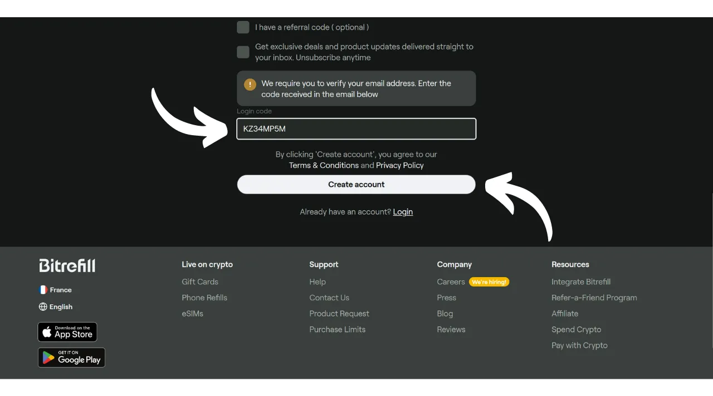
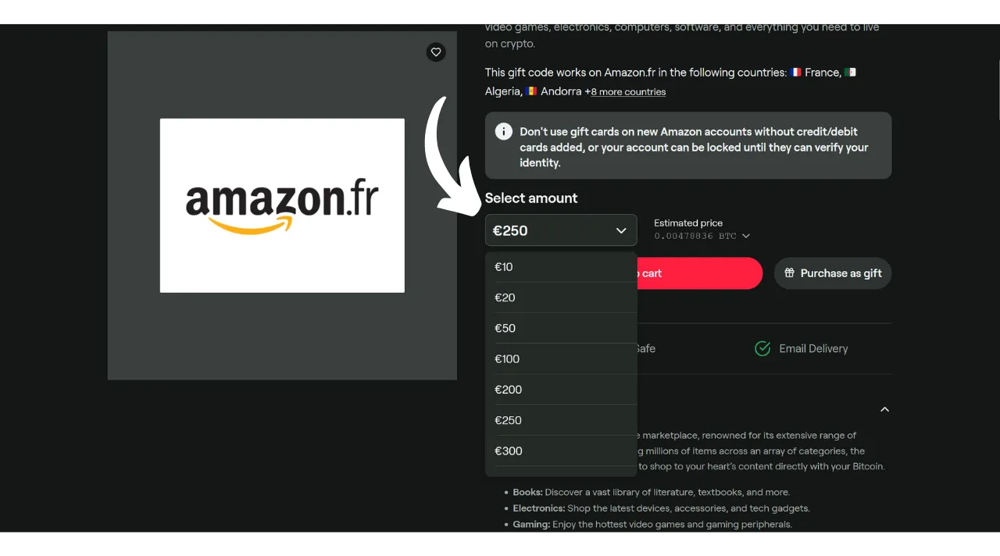

Bitcoinは今日、主に貯蓄手段と考えられていますが、手から手へと流通する能力にその有用性がある通貨です。周囲の商人が支払い方法としてBitcoinを受け入れている場合、直接それらと取引する選択肢があります。残念ながら、この慣習はまだ広まっておらず、ほとんどの商人はまだBTCをネイティブに受け入れていません。

最良の解決策は、地元の商人にBitcoinを受け入れさせるために「オレンジピル」を使うことで、このシステムの利点を説明します。当サイトの["*merchants*"](https://planb.network/tutorials/merchant)セクションにあるチュートリアルをサポートとして使用できます。この戦略は小規模な独立した商人には効果的かもしれませんが、現場の連絡先が一般的に支払い方法に関する決定を下すわけではないため、大規模な全国チェーンに対してはより複雑です。

これらのチェーンによるより大規模な採用を待つ間、ギフトカードという中間支払い方法を使用してビットコインを使って支払うことができます。これは正確にBitrefillが提供しようとしているものです。

## Bitrefillとは何ですか？

Bitrefillは、ビットコインでギフトカードを購入できるプラットフォームです。このアイデアは、これらのギフトカードを使用して選択した小売店で購入を行い、商人が直接それらを受け入れていなくても、ビットコインで商品やサービスを取得することを可能にします。Bitcoinerとして、これにより、従来の商人や大手チェーンによるBTCの限定的な採用という問題を回避できます。さらに、身元確認（KYC）を要求する交換プラットフォームを通じずにビットコインを現金化することができます。

Bitrefillは、小売からファーストフード、ストリーミングプラットフォーム、オンラインゲーム、eコマースサイト、さらには電話のトップアップまで、非常に幅広い選択肢を提供します。

Bitrefillの使用は非常に簡単です。アカウントを開設するには、メールアドレスを提供するだけでよいので、身元を明かす必要はありません。その後、ギフトカードの種類を選択し、その金額を選び、ビットコインで支払います。支払いが確認されると（Lightningでほぼ瞬時に）、ギフトカードコードが提供されます。これは、店舗内で物理的にまたは小売業者のウェブサイトでオンラインで使用できます。

## Bitrefillアカウントを作成する方法は？
[公式Bitrefillウェブサイト](https://www.bitrefill.com)を訪問してください。
ウィンドウの右上にある"*Login*"をクリックします。

"*Create account*"をクリックします。

メールアドレスを入力します。アカウントを匿名に保ちたい場合は、名前を明かさないメールアドレスを使用してください。その後、強力なパスワードを設定します。

安全なメールボックスの簡単な作成方法とパスワードの管理方法を学びたい場合は、これらの2つの他のチュートリアルをお勧めします：

https://planb.network/tutorials/others/proton-mail

https://planb.network/tutorials/others/bitwarden

その後、"*Create account*"ボタンをクリックします。

メールボックスに行って、確認コードを取得します。

それを"*Login code*"ボックスに入力し、もう一度"*Create account*"ボタンをクリックします。
これで、あなたのアカウントの作成が完了しました！

また、アカウントを保護するために2FA（二要素認証）の設定をすることをお勧めします。これを行うには、画面右上のプロフィールをクリックしてください。

"*Settings*" メニューをクリックします。

そして、"*Login & Security*" タブに進みます。

"*Two factor authentication*" セクションで、"*Enable*" ボタンをクリックし、設定プロセスに従ってください。

オンラインアカウントを保護するために二要素認証を使用する方法についてもっと知りたい場合は、この他のチュートリアルをご覧になることをお勧めします：

https://planb.network/tutorials/others/authy

## BitrefillでBTCでギフトカードを購入する方法は？

左側から、製品またはサービスのドメインを選択できます。

お好みのブランドを選択してください。

ギフトカードページで最初に行うべきステップは、国による利用可能性を確認することです。このカードがあなたの国をサポートしていることを確認してください。

次に、コミュニティの意見を発見するためにコメントセクションを確認する時間を取ることをお勧めします。

このセクションでは、他のユーザーからの小さなヒントをよく見つけることができます。

"*Description*" と "*How to redeem*" のセクションでは、ギフトカードに関する追加の詳細を見つけることができます。 
購入を希望する場合は、ギフトカードの金額を選択するためのボックスをクリックしてください。

すべてが良さそうであれば、"*Add to cart*" ボタンをクリックしてください。

現時点でこのカードのみを購入したい場合は、"*Checkout*" をクリックしてください。

次に、支払い方法を選択します。onchainまたはLightning Networkで支払うことができます。私の場合は、少額なのでLNで支払います。

あなたのLightningウォレットで請求書をスキャンして支払うだけです。価格変動に関連するリスクを最小限に抑えるために、請求書は30分間のみ有効であることに注意してください。

請求書が支払われると、ほとんどのカードで即座にギフトカードにアクセスできます。

そのコードにアクセスするには、"*Click to unseal*" ボタンをクリックしてください。

その後、コードをコピーして小売店のウェブサイトで使用するか、実店舗のレジで提示するだけです。

プロフィールを右上でクリックし、"*My Products*" メニューを選択することで、すべてのギフトカードを見つけることができます。

Bitrefillアプリのダウンロードもお勧めします。これは、[Google Play Store](https://play.google.com/store/apps/details?id=com.bitrefill.app)や[App Store](https://apps.apple.com/in/app/bitrefill/id1378102623)で入手可能で、実店舗で日常的にギフトカードを購入して使用することができます。
さて、これであなたはKYCなしでビットコインを使って、日常の支出のために主要な小売店で買い物をする方法を知ることができました。個人的には、より多くの商人が販売時点でビットコインをネイティブに統合するまでの一時的な解決策と考えています。しかし、現時点では非常に便利なオプションであることに変わりありません。

ビットコインの普及に貢献し、独立した商人にこの支払い方法を採用してもらいたい場合は、Swiss Bitcoin Payに関する完全なチュートリアルを参照することをお勧めします。これはBTC支払いプロセッサーのためのオールインワンソリューションで、日常的に簡単にインストールして管理することができます：

https://planb.network/tutorials/merchant/swiss-bitcoin-pay-2