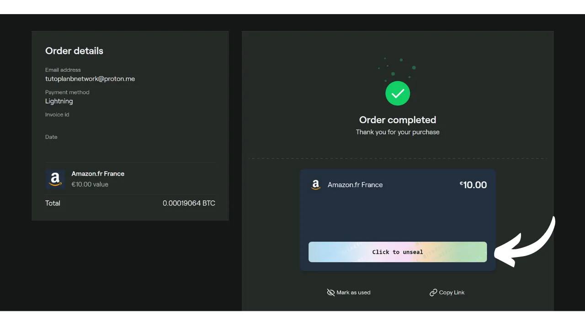
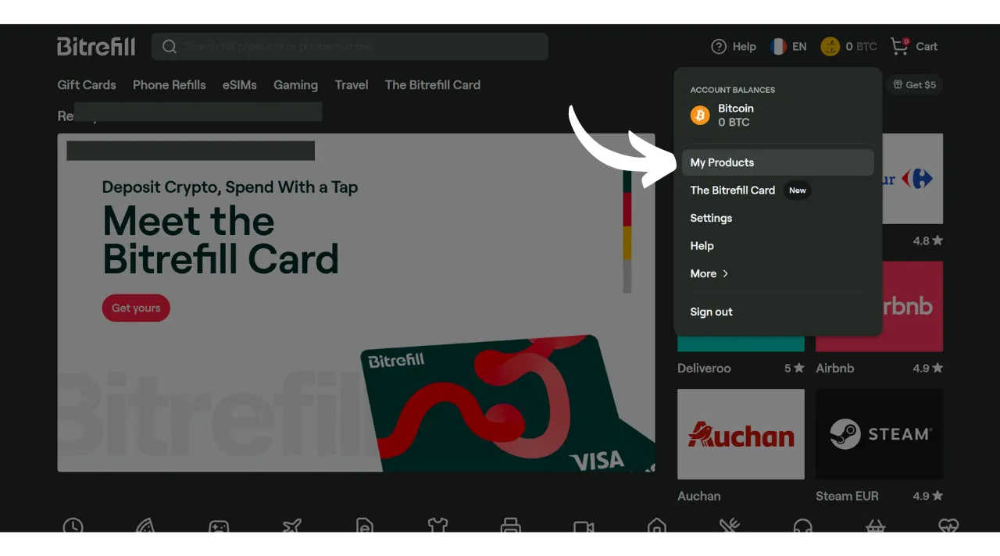

Embora o Bitcoin seja primariamente considerado hoje como um meio de poupança, ele permanece sendo uma moeda cuja utilidade reside na sua capacidade de circular de mão em mão. Se os comerciantes ao seu redor aceitam Bitcoin como método de pagamento, você tem a opção de gastá-lo diretamente com eles. Infelizmente, essa prática ainda não é amplamente difundida, e a maioria dos comerciantes ainda não aceita BTC nativamente.

A melhor solução permanece em "converter" os comerciantes locais para que eles aceitem Bitcoin, explicando as vantagens desse sistema. Você pode usar os tutoriais disponíveis na seção ["*merchants*"](https://planb.network/tutorials/merchant) do nosso site como apoio. Esta estratégia pode ser eficaz com pequenos comerciantes independentes, mas se mostra mais complexa para grandes cadeias nacionais, já que os contatos no local geralmente não são os responsáveis por tomar decisões sobre métodos de pagamento.

Enquanto aguardamos uma adoção mais massiva por essas cadeias, você pode gastar seus bitcoins usando um método de pagamento intermediário: cartões-presente. E é exatamente isso que o Bitrefill oferece para você.

## O que é Bitrefill?

Bitrefill é uma plataforma que permite comprar cartões-presente com bitcoins. A ideia é usar esses cartões-presente para fazer compras no varejista de sua escolha, permitindo assim que você adquira bens e serviços com bitcoins, mesmo que o comerciante não os aceite diretamente. Como um Bitcoiner, isso permite que você contorne o problema da adoção limitada de BTC por comerciantes tradicionais e grandes cadeias. Além disso, possibilita a liquidação de seus bitcoins sem ter que passar por uma plataforma de câmbio que exige verificação de identidade (KYC).

Bitrefill oferece uma escolha muito ampla que vai desde varejo até fast food, incluindo plataformas de streaming, jogos online, sites de e-commerce e até recargas de telefone.

Bitrefill é muito fácil de usar. Para abrir uma conta, você só precisa fornecer um endereço de e-mail. Assim, você não precisa fornecer sua identidade. Então, você simplesmente seleciona o tipo de cartão-presente, escolhe seu valor e faz o pagamento em bitcoins. Uma vez que o pagamento é confirmado (quase instantaneamente com Lightning), o código do cartão-presente é fornecido a você. Este pode ser usado tanto fisicamente na loja quanto online no site do varejista.

## Como criar uma conta Bitrefill?
Visite o [site oficial do Bitrefill](https://www.bitrefill.com).
Clique em "*Login*" no canto superior direito da janela.

Clique em "*Criar conta*".

Insira um endereço de e-mail. Se desejar manter sua conta anônima, certifique-se de usar um endereço de e-mail que não revele seu nome. Em seguida, defina uma senha forte.

Se você quiser aprender como criar facilmente uma caixa de e-mail segura e como gerenciar suas senhas, recomendo consultar estes 2 outros tutoriais:

https://planb.network/tutorials/others/proton-mail

https://planb.network/tutorials/others/bitwarden

Depois, clique no botão "*Criar conta*".

Vá até sua caixa de entrada para recuperar o código de verificação.

Insira-o na caixa "*Código de Login*" e depois clique novamente no botão "*Criar conta*".
E aí está, sua conta agora está criada!

Eu também aconselho você a configurar a autenticação de dois fatores (2FA) para proteger sua conta. Para fazer isso, clique no seu perfil no canto superior direito da tela.

Clique no menu "*Configurações*".

E vá para a aba "*Login & Segurança*".

Na seção "*Autenticação de dois fatores*", clique no botão "*Habilitar*" e siga o processo de configuração.

Para aprender mais sobre como usar a autenticação de dois fatores para proteger suas contas online, recomendo descobrir este outro tutorial:

https://planb.network/tutorials/others/authy

## Como comprar um cartão presente em BTC no Bitrefill?

À esquerda, você pode escolher um domínio de produto ou serviço.

Escolha a marca de sua preferência.

O primeiro passo a realizar na página do cartão presente é verificar sua disponibilidade de acordo com os países. Certifique-se de que seu país é suportado por este cartão.

Eu então aconselho você a tomar um tempo para consultar a seção de comentários para descobrir as opiniões da comunidade a respeito deste cartão presente.

Nesta seção, você frequentemente encontrará pequenas dicas de outros usuários.

Nas seções "*Descrição*" e "*Como resgatar*", você encontrará detalhes adicionais sobre o cartão presente. 
Se desejar comprá-lo, clique na caixa indicando o valor para selecionar o valor do seu cartão presente.

Se tudo estiver bom para você, clique no botão "*Adicionar ao carrinho*".

Depois clique em "*Finalizar compra*" se desejar comprar apenas este cartão por agora.

Em seguida, escolha um método de pagamento. Você pode pagar onchain ou na Lightning Network. No meu caso, é um valor pequeno, então pagarei na LN.

Você só precisa escanear e pagar a fatura com sua carteira Lightning. Esteja ciente, para minimizar os riscos associados às flutuações de preço, sua fatura é válida apenas por 30 minutos.

Uma vez que a fatura é paga, você terá acesso imediato ao cartão presente para a maioria dos cartões.

Para acessar seu código, clique no botão "*Clique para deslacr*".

Você então simplesmente copia o código e o usa no site do varejista ou o apresenta no caixa em uma loja física.

Você pode encontrar todos os seus cartões presentes clicando no seu perfil no canto superior direito, depois no menu "*Meus Produtos*".

Eu também recomendo baixar o aplicativo Bitrefill, disponível na [Google Play Store](https://play.google.com/store/apps/details?id=com.bitrefill.app) e na [App Store](https://apps.apple.com/in/app/bitrefill/id1378102623), para poder comprar e usar cartões-presente diariamente em lojas físicas.
E é isso, agora você sabe como gastar seus bitcoins sem KYC em grandes varejistas para suas despesas diárias. Pessoalmente, considero este método como uma solução temporária até que mais comerciantes integrem o bitcoin nativamente em seus pontos de venda. No entanto, permanece uma opção muito conveniente por enquanto.

Se você deseja contribuir para a popularização do Bitcoin e incentivar um comerciante independente a adotar este método de pagamento, recomendo consultar nosso tutorial completo sobre o Swiss Bitcoin Pay. É uma solução tudo-em-um para processadores de pagamento BTC, fácil de instalar e gerenciar diariamente:

https://planb.network/tutorials/merchant/swiss-bitcoin-pay-2