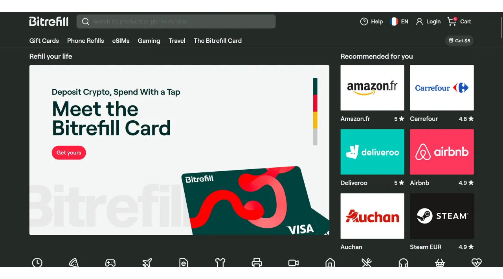
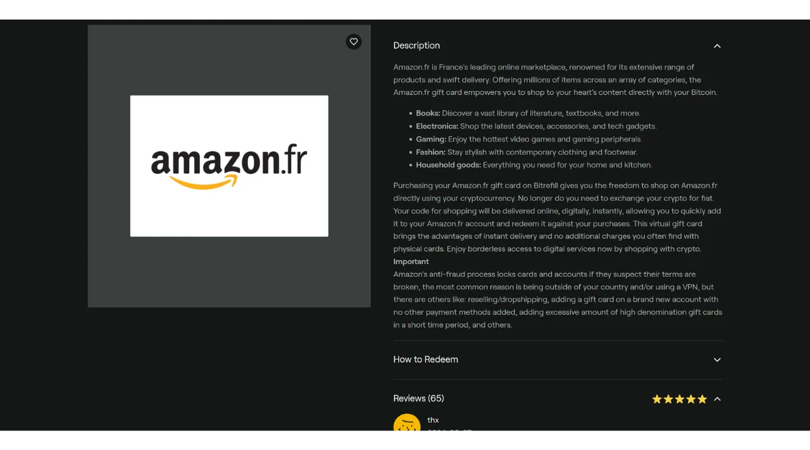
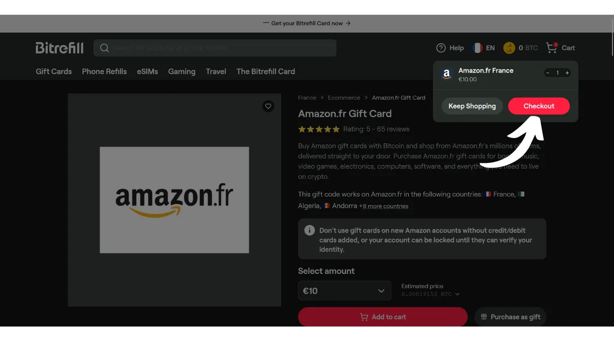
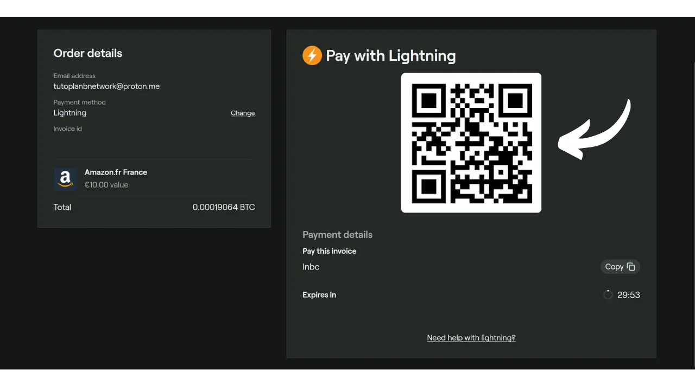

Хотя Bitcoin в первую очередь рассматривается как средство сбережения, он остается валютой, полезность которой заключается в ее способности передаваться из рук в руки. Если торговцы в вашем окружении принимают Bitcoin в качестве способа оплаты, у вас есть возможность напрямую тратить его у них. К сожалению, эта практика пока не получила широкого распространения, и большинство торговцев пока не принимают BTC в качестве основного способа оплаты.

Лучшим решением остается "оранжевая пилюля" для местных торговцев, чтобы заставить их принимать Bitcoin, объясняя преимущества этой системы. Вы можете использовать учебные пособия, доступные в разделе ["*merchants*"](https://planb.network/tutorials/merchant) нашего сайта в качестве поддержки. Эта стратегия может быть эффективной с малыми независимыми торговцами, но она оказывается более сложной для крупных национальных сетей, поскольку контакты на местах обычно не те, кто принимает решения относительно методов оплаты.

В ожидании более массового принятия этими сетями, вы можете тратить свои биткоины, используя посреднический метод оплаты: подарочные карты. И именно это предлагает Bitrefill.

## Что такое Bitrefill?

Bitrefill - это платформа, которая позволяет вам покупать подарочные карты за биткоины. Идея заключается в использовании этих подарочных карт для покупок у выбранного вами ритейлера, тем самым позволяя вам приобретать товары и услуги за биткоины, даже если торговец не принимает их напрямую. Для Bitcoin-пользователя это позволяет обойти проблему ограниченного принятия BTC традиционными торговцами и крупными сетями. Более того, это позволяет вам ликвидировать ваши биткоины без необходимости обращения на биржу, требующую верификацию личности (KYC).

Bitrefill предлагает очень широкий выбор, начиная от розничной торговли и заканчивая фастфудом, включая стриминговые платформы, онлайн-игры, сайты электронной коммерции и даже пополнение телефона.

Bitrefill очень прост в использовании. Для открытия аккаунта вам просто нужно предоставить адрес электронной почты. Таким образом, вам не нужно указывать свою личность. Затем вы просто выбираете тип подарочной карты, выбираете ее сумму и производите оплату в биткоинах. После подтверждения платежа (почти мгновенно с Lightning), вам предоставляется код подарочной карты. Его можно использовать как физически в магазине, так и онлайн на сайте ритейлера.

## Как создать аккаунт Bitrefill?
Посетите [официальный сайт Bitrefill](https://www.bitrefill.com).
Нажмите на "*Login*" в правом верхнем углу окна.

Нажмите на "*Create account*".

Введите адрес электронной почты. Если вы хотите сохранить свой аккаунт анонимным, убедитесь, что вы используете адрес электронной почты, который не раскрывает ваше имя. Затем установите надежный пароль.

Если вы хотите узнать, как легко создать безопасный почтовый ящик и как управлять своими паролями, я рекомендую проконсультироваться с этими 2 другими учебными пособиями:

https://planb.network/tutorials/others/proton-mail

https://planb.network/tutorials/others/bitwarden

Затем нажмите на кнопку "*Create account*".

Перейдите в свой почтовый ящик, чтобы получить проверочный код.

Введите его в поле "*Login code*" и затем снова нажмите на кнопку "*Create account*".
 И вот, ваш аккаунт теперь создан!

Я также советую вам настроить двухфакторную аутентификацию (2FA), чтобы обезопасить ваш аккаунт. Для этого кликните на ваш профиль в верхнем правом углу экрана.

Кликните на меню "*Настройки*".

И перейдите на вкладку "*Логин и безопасность*".

В разделе "*Двухфакторная аутентификация*" кликните на кнопку "*Включить*" и следуйте процессу настройки.

Чтобы узнать больше о том, как использовать двухфакторную аутентификацию для защиты ваших онлайн-аккаунтов, рекомендую ознакомиться с этим другим учебным пособием:

https://planb.network/tutorials/others/authy

## Как купить подарочную карту за BTC на Bitrefill?

Слева вы можете выбрать домен продукта или услуги.

Выберите бренд на ваш выбор.

Первый шаг на странице подарочной карты - проверить ее доступность в зависимости от страны. Убедитесь, что ваша страна поддерживается этой картой.

Затем я советую вам уделить время для ознакомления с разделом комментариев, чтобы узнать мнения сообщества о данной подарочной карте.

В этом разделе вы часто найдете маленькие советы от других пользователей.

В разделах "*Описание*" и "*Как использовать*" вы найдете дополнительные детали о подарочной карте. 
Если вы хотите ее приобрести, кликните на поле с указанием суммы, чтобы выбрать стоимость вашей подарочной карты.

Если все вас устраивает, кликните на кнопку "*Добавить в корзину*".

Затем кликните на "*Оформить заказ*", если вы хотите приобрести только эту карту на данный момент.

Далее выберите способ оплаты. Вы можете оплатить через onchain или через Lightning Network. В моем случае это небольшая сумма, поэтому я буду платить через LN.

Вам просто нужно отсканировать и оплатить счет с помощью вашего Lightning кошелька. Имейте в виду, чтобы минимизировать риски, связанные с колебаниями цен, ваш счет действителен только 30 минут.

После оплаты счета вы немедленно получите доступ к подарочной карте для большинства карт.

Чтобы получить доступ к ее коду, кликните на кнопку "*Нажмите, чтобы раскрыть*".

Затем просто скопируйте код и используйте его на сайте ритейлера или предъявите его при оплате в физическом магазине.

Вы можете найти все ваши подарочные карты, кликнув на ваш профиль в верхнем правом углу, затем на меню "*Мои продукты*".

Я также рекомендую скачать приложение Bitrefill, доступное в [Google Play Store](https://play.google.com/store/apps/details?id=com.bitrefill.app) и [App Store](https://apps.apple.com/in/app/bitrefill/id1378102623), чтобы иметь возможность покупать и использовать подарочные карты ежедневно в физических магазинах.
И вот вы теперь знаете, как тратить ваши биткоины без KYC в крупных розничных сетях для повседневных расходов. Лично я считаю этот метод временным решением до тех пор, пока больше продавцов не начнут нативно интегрировать биткоин в свои точки продаж. Однако на данный момент это остается очень удобным вариантом.

Если вы хотите способствовать популяризации биткоина и поощрить независимого продавца принять этот метод оплаты, я рекомендую ознакомиться с нашим полным руководством по Swiss Bitcoin Pay. Это универсальное решение для процессоров оплаты BTC, легкое в установке и управлении на ежедневной основе:

https://planb.network/tutorials/merchant/swiss-bitcoin-pay-2