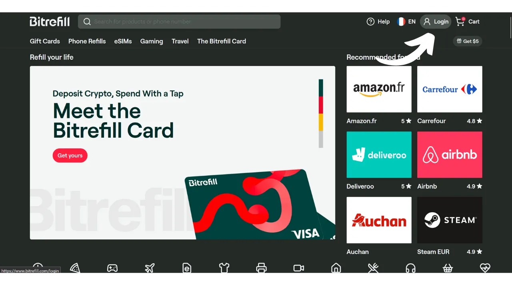

尽管比特币今天主要被视为一种储蓄手段，但它仍然是一种货币，其实用性在于其能够从一手传到另一手的能力。如果你周围的商家接受比特币作为支付方式，你就有选择直接用它们支付的选项。不幸的是，这种做法尚未广泛普及，大多数商家还没有原生地接受BTC。

最佳解决方案仍然是向当地商家“橙色启蒙”（orange pill），让他们接受比特币，通过解释这个系统的优势。你可以使用我们网站上["*商家*"](https://planb.network/tutorials/merchant)部分中可用的教程作为支持。这个策略对于小型独立商家可能有效，但对于大型全国连锁来说，情况更为复杂，因为现场的联系人通常不是决定支付方式的人。

在等待这些连锁店更大规模的采用时，你可以使用一种中介支付方式来花费你的比特币：礼品卡。这正是Bitrefill提供给你的。

## Bitrefill是什么？

Bitrefill是一个允许你用比特币购买礼品卡的平台。这个想法是使用这些礼品卡在你选择的零售商处进行购物，从而让你能够用比特币购买商品和服务，即使商家不直接接受它们。作为一个比特币用户，这允许你绕过传统商家和大型连锁有限的BTC采用问题。此外，它使你能够在不需要通过要求身份验证（KYC）的交易平台的情况下变现你的比特币。

Bitrefill提供非常广泛的选择，从零售到快餐，包括流媒体平台、在线游戏、电子商务网站，甚至手机充值。

Bitrefill非常容易使用。要开设账户，你只需要提供一个电子邮件地址。因此，你不需要提供你的身份。然后，你只需选择礼品卡的类型，选择其金额，并用比特币进行支付。一旦支付被确认（通过Lightning几乎立即），礼品卡代码就会给你。这可以在店内实体使用，或者在线在零售商的网站上使用。

## 如何创建Bitrefill账户？
访问[官方Bitrefill网站](https://www.bitrefill.com)。
点击窗口右上方的“*登录*”。

点击“*创建账户*”。

输入一个电子邮件地址。如果你希望保持你的账户匿名，请确保使用一个不会泄露你名字的电子邮件地址。然后，设置一个强密码。

如果你想了解如何轻松创建一个安全的电子邮箱和如何管理你的密码，我推荐查阅这2个其他教程：

https://planb.network/tutorials/others/proton-mail

https://planb.network/tutorials/others/bitwarden

然后，点击“*创建账户*”按钮。

前往你的邮箱检索验证代码。

在“*登录代码*”框中输入它，然后再次点击“*创建账户*”按钮。
现在，您的账户已经创建成功了！

我还建议您设置双因素认证（2FA）来保护您的账户。要这样做，请点击屏幕右上角的您的个人资料。

点击“*设置*”菜单。

然后前往“*登录与安全*”标签页。

在“*双因素认证*”部分，点击“*启用*”按钮并按照设置过程操作。

要了解更多关于如何使用双因素认证来保护您的在线账户的信息，我推荐您查看这个教程：

https://planb.network/tutorials/others/authy

## 如何在Bitrefill上用BTC购买礼品卡？

在左侧，您可以选择一个产品或服务领域。

选择您喜欢的品牌。

在礼品卡页面进行的第一步是检查其按国家的可用性。确保您的国家支持这张卡。

然后我建议您花时间查看评论部分，以了解社区对这张礼品卡的看法。

在这个部分，您通常会发现其他用户的小贴士。

在“*描述*”和“*如何兑换*”部分，您会找到关于礼品卡的额外细节。
如果您想购买它，点击显示金额的框以选择您的礼品卡的价值。

如果一切看起来都不错，点击“*添加到购物车*”按钮。

然后，如果您现在只想购买这张卡，点击“*结账*”。

接下来，选择一种支付方式。您可以选择链上支付或通过闪电网络支付。在我的案例中，因为金额较小，所以我将通过LN支付。

您只需用您的闪电钱包扫描并支付发票。请注意，为了最小化价格波动带来的风险，您的发票仅在30分钟内有效。

一旦发票支付完成，您将立即获得大多数卡的礼品卡访问权限。

要获取其代码，请点击“*点击以揭开*”按钮。

然后您只需复制代码，并在零售商的网站上使用它，或在实体店的结账处出示它。

您可以通过点击屏幕右上角的您的个人资料，然后点击“*我的产品*”菜单来找到所有的礼品卡。

我还推荐下载Bitrefill应用程序，可在[Google Play商店](https://play.google.com/store/apps/details?id=com.bitrefill.app)和[App Store](https://apps.apple.com/in/app/bitrefill/id1378102623)上获取，以便能够在实体店每天购买和使用礼品卡。
现在，您已经知道如何在主要零售商处使用比特币进行日常开销，而无需进行KYC验证。就我个人而言，我认为这种方法是一种临时解决方案，直到更多商家在其销售点原生集成比特币。然而，目前来说，它仍然是一个非常方便的选项。

如果您希望为比特币的普及做出贡献，并鼓励独立商家采用这种支付方式，我推荐查阅我们关于瑞士比特币支付的完整教程。这是一个一体化的BTC支付处理器解决方案，安装和日常管理都很简单：

https://planb.network/tutorials/merchant/swiss-bitcoin-pay-2