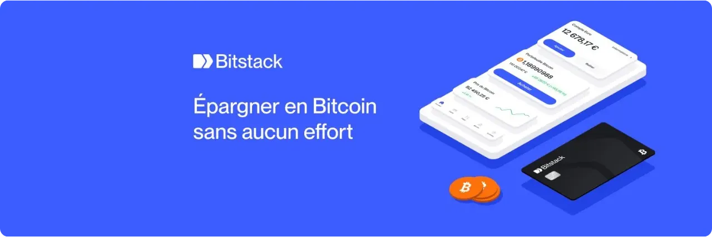

Bitstack è una piattaforma di investimento in bitcoin francese, regolamentata PSAN dall'AMF. Offre un'applicazione disponibile su Android e iOS per acquistare e vendere facilmente bitcoin.

Bitstack ha una funzione speciale che lo rende diverso dalle altre piattaforme: il sistema di arrotondamento automatico. Sincronizza il tuo conto bancario e trasforma la differenza tra quello che spendi ogni giorno e l’euro più vicino in bitcoin. In questo modo puoi accumulare piccoli pezzi di bitcoin, chiamati satoshi, senza fatica, applicando automaticamente il Dollar Cost Averaging (DCA). Oltre a questa funzione, Bitstack permette anche di fare investimenti automatici regolari e di comprare o vendere bitcoin in modo semplice.

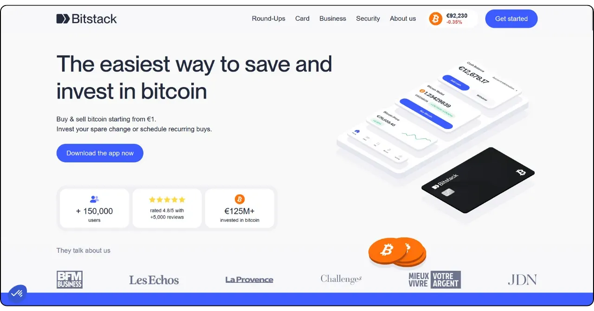

Le commissioni di transazione di Bitstack variano in base al volume scambiato negli ultimi 30 giorni:

- Meno di 250 euro:      1,49 %
- 250 €     - 5.000   €: 0,99 %
- 5.000 €   - 10.000  €: 0,89 %
- 10.000 €  - 50.000  €: 0,79 %
- 50.000 €  - 250.000 €: 0,69 %
- 250.000 € - 500.000 €: 0,59 %
- Più di 500.000 euro:   0,49 %

Tutte le altre operazioni sulla piattaforma sono gratuite, inclusi i prelievi di bitcoin (con un prelievo minimo fissato a 100.000 sats). Quindi, a differenza di altre piattaforme di scambio, prelevare, ad esempio, 0,01 BTC dall'app per trasferirlo in autodeposito non genererebbe alcuna commissione di servizio o di mining, consentendo di ricevere effettivamente 0,01 BTC sul proprio indirizzo di ricezione.

## Scarica l'applicazione

Per scaricare l'applicazione Bitstack, vai sul tuo store delle applicazioni:

- [Scarica da Google Play Store](https://play.google.com/store/apps/details?id=com.bitstack.app&hl=fr)
- [Scarica su App Store](https://apps.apple.com/fr/app/bitstack-%C3%A9pargner-en-bitcoin/id1608783388)

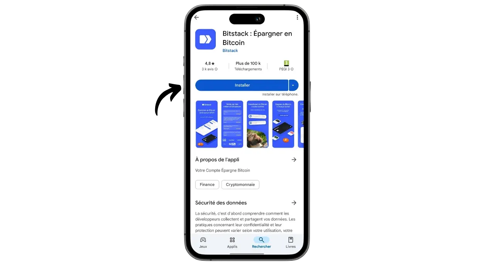

## Creare un account

Quando si apre l'applicazione, fai clic sul pulsante "*S'inscrire*"("*Registrati*").

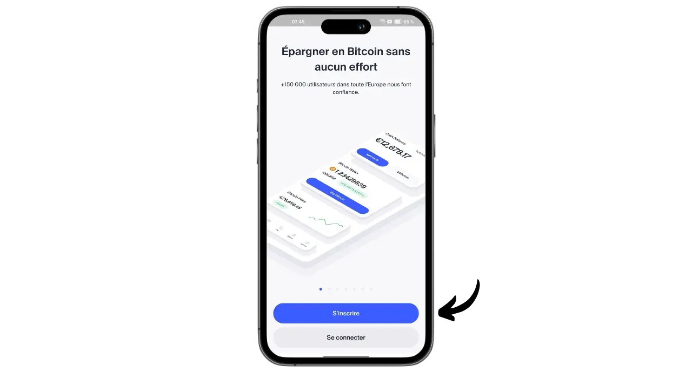

Inserisci il numero di telefono e fai clic su "*Continuer*"("*Continua*"). Inserisci il codice ricevuto via SMS.

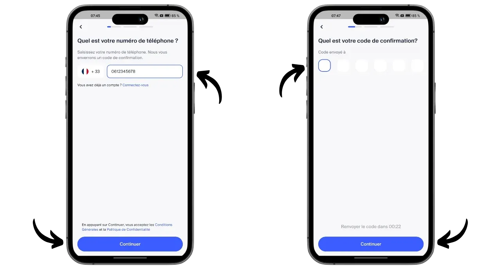

Inserisci l'indirizzo e-mail.

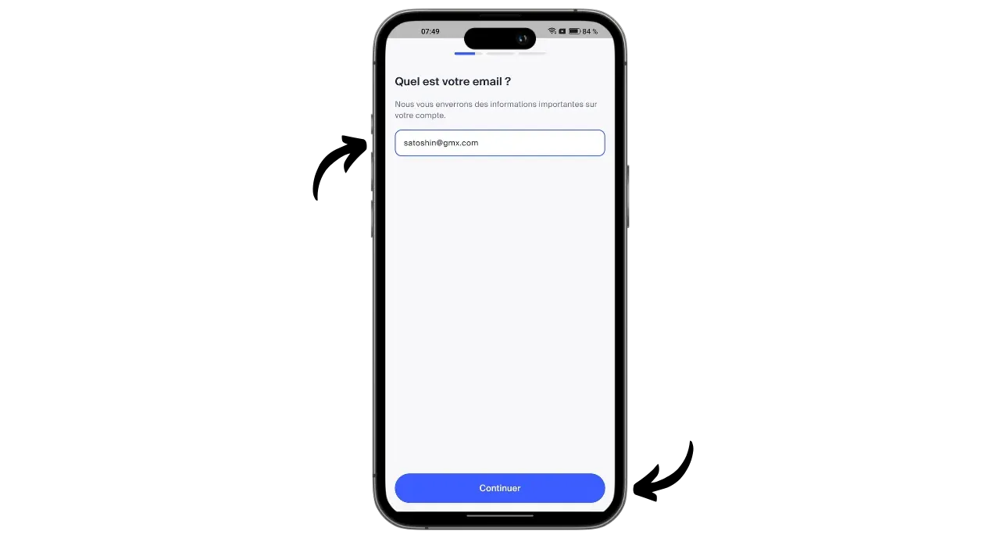

Scegli una password forte per proteggere l'accesso al tuo account, quindi fai clic su "*Continuer"*("*Continua*").

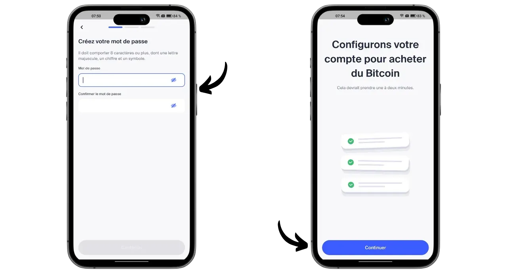

Per una gestione sicura delle password su base quotidiana, l'uso di un password manager è altamente raccomandato. Su Plan ₿ Network, trovi diversi tutorial sulle migliori soluzioni esistenti, come Bitwarden :

https://planb.network/tutorials/computer-security/authentication/bitwarden-0532f569-fb00-4fad-acba-2fcb1bf05de9

Ti verrà chiesto di verificare la tua identità (KYC). In conformità alla normativa francese, devi fornire i tuoi dati personali e un documento di identità. Compila le caselle con il tuo cognome, nome e data di nascita.

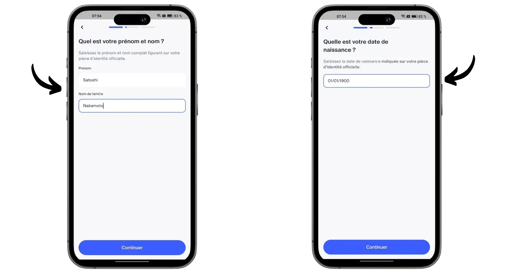

Inserisci il tuo indirizzo e rispondi alle domande aggiuntive.

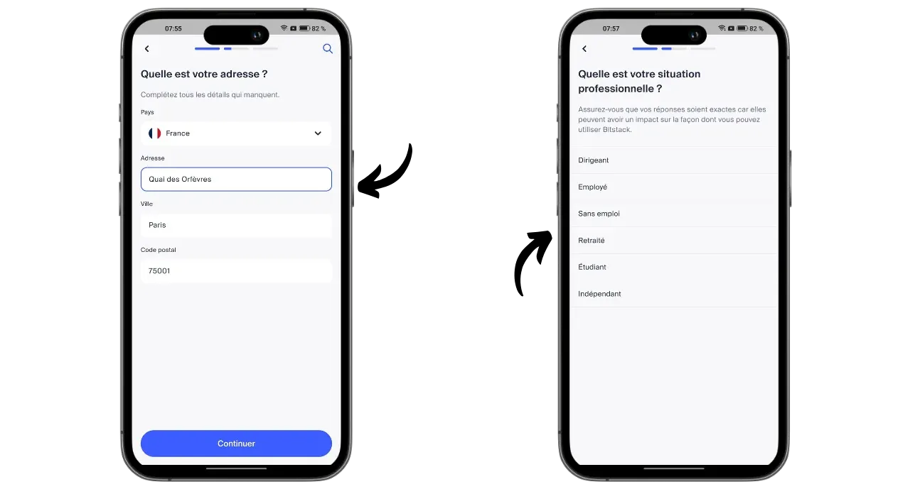

Procedi alla verifica dell'identità.

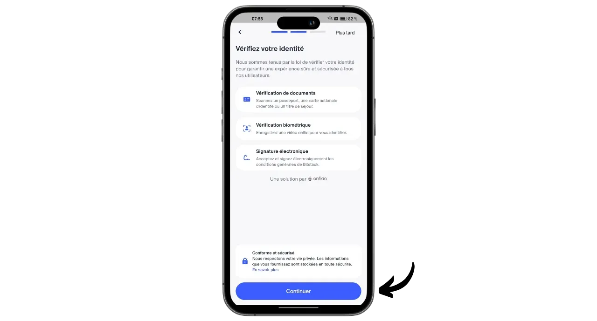

Dopodiché, avrai accesso a tutte le funzioni dell'applicazione.

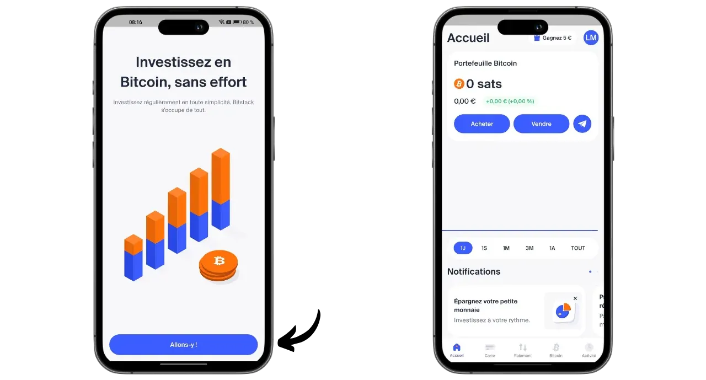

## Impostazioni dell'applicazione

In Impostazioni è possibile personalizzare una serie di opzioni. Per accedervi, fai clic sulle proprie iniziali in alto a destra dell'interfaccia.

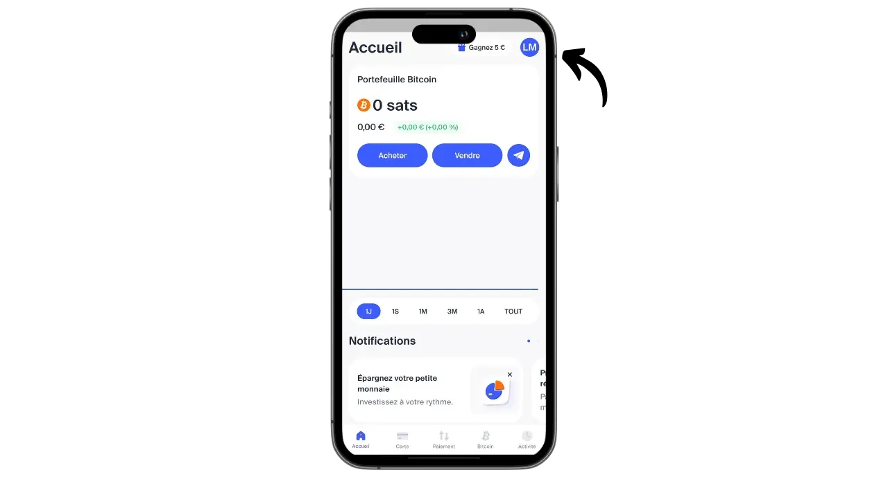

Inizia dalla sezione "*Sécurité*"("*Sicurezza*"), dove puoi attivare l'autenticazione biometrica per evitare di dover inserire manualmente la password a ogni accesso.

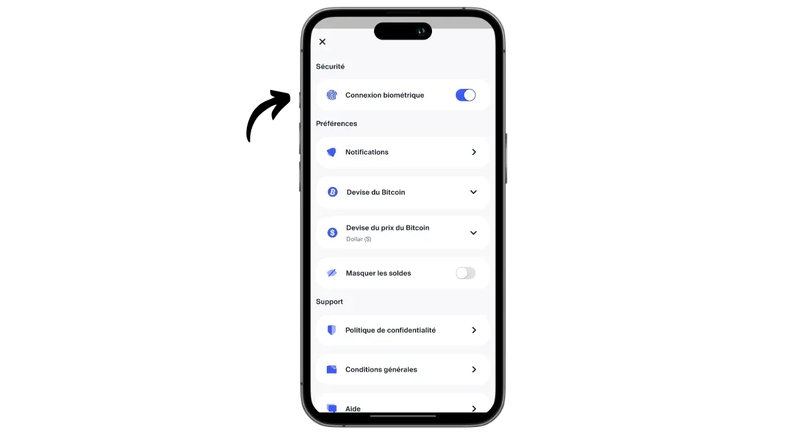

In "*Préférences*"("*Preferenze*") è possibile personalizzare varie impostazioni, come la valuta fiat visualizzata, l'unità bitcoin (BTC o sats) o le preferenze di notifica.

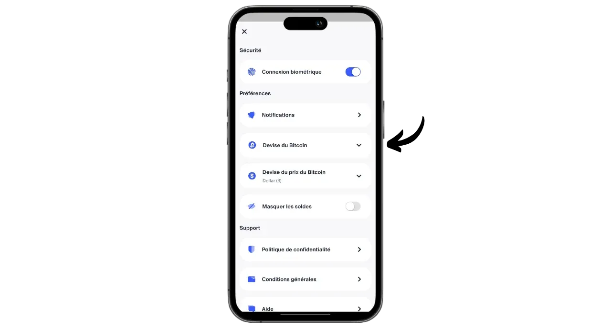

Vai su "*Général*"("*Generali*") nelle impostazioni e clicca su "*Modes de paiement*"("*Metodi di pagamento*").

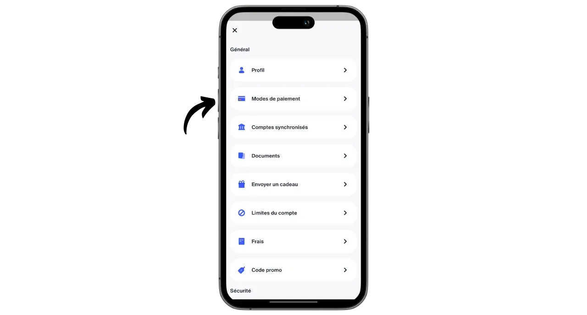

Qui è possibile registrare le carte di credito per gli acquisti in bitcoin.

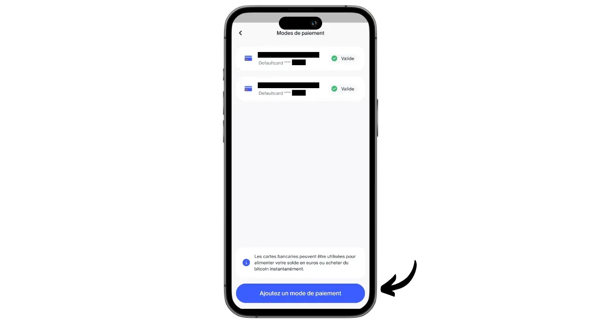

Per utilizzare la funzione di arrotondamento automatico, è necessario sincronizzare un conto bancario. Clicca su "*Comptes synchronisés*"("*Conti sincronizzati*"), quindi su "*Synchroniser un compte bancaire*"("*Sincronizzazione di un conto bancario*").

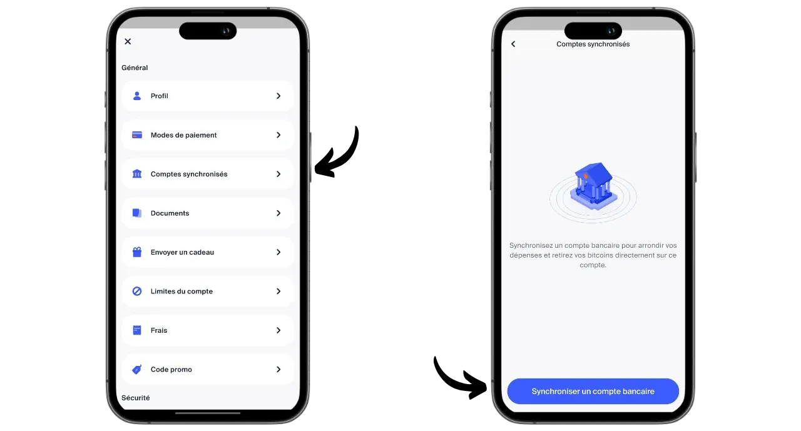

Scegli la tua banca e segui le istruzioni del browser. Una volta collegato, il tuo conto bancario sarà visibile in questa sezione.

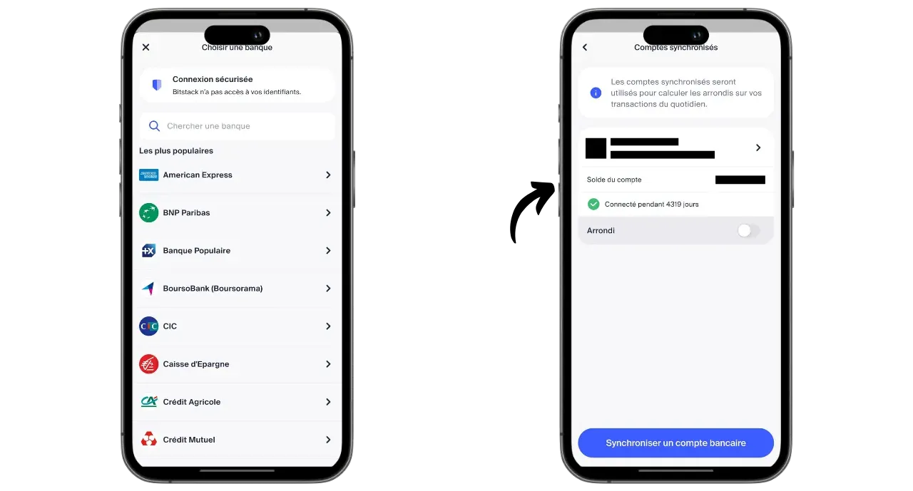

## Acquistare bitcoin

Come accennato nell'introduzione, Bitstack offre 3 metodi per investire in Bitcoin:

- Acquisto a mercato di un importo specifico ;
- Configurazione acquisti ricorrenti (RPC) ;
- L'uso dell'arrotondamento automatico delle spese.

### Acquisto a mercato

Per effettuare un acquisto una tantum di bitcoin al prezzo di mercato, è sufficiente cliccare su "*Acheter*"("*Acquista*").

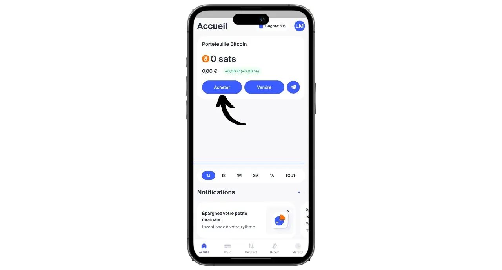

Inserisci l'importo desiderato, seleziona il metodo di pagamento e premi "*Continuer*"("*Continua*"). Controlla l'ordine di acquisto prima di confermare cliccando su "*Acheter*"("*Acquista*").

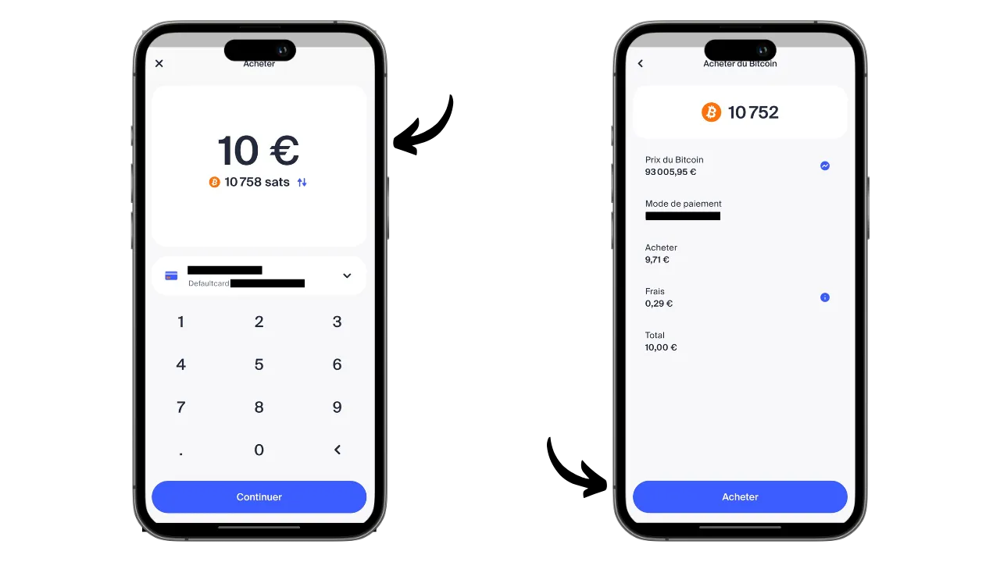

La transazione è ora confermata.

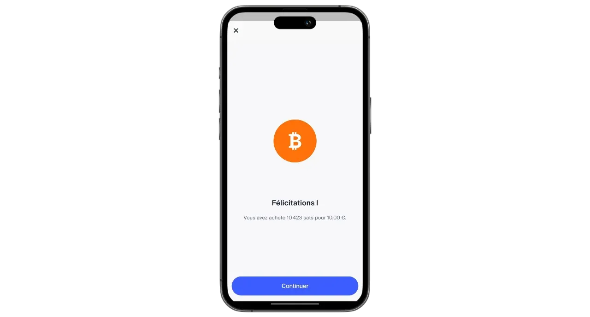

### Impostazione di un DCA

Il **Dollar Cost Averaging** (DCA) è una strategia di investimento interessante per accumulare bitcoin riducendo i rischi associati alla sua volatilità. Acquistando regolarmente una quantità fissa, a prescindere dal prezzo, è possibile ammortizzare il costo di acquisizione ed evitare decisioni impulsive. La DCA aiuta a ridurre i pregiudizi comportamentali, come la paura di perdere un'opportunità o il panico in caso di calo dei prezzi, e consente quindi di gestire i propri risparmi in bitcoin in modo sereno e disciplinato.

Per impostare un acquisto ricorrente (DCA) su Bitstack, vai nella sezione "*Épargne*"("*Risparmio*") nella home page e selezionate "*Récurrent*"("*Ricorrenti*"). Quindi premere "*Continuer*"("*Continua*").

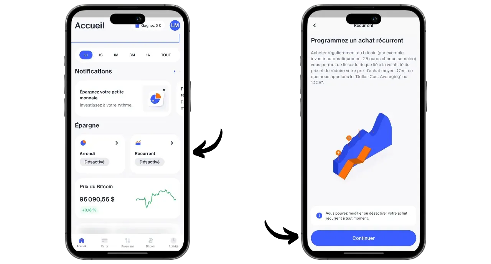

Definisci l'importo dell'acquisto ricorrente e il metodo di pagamento.

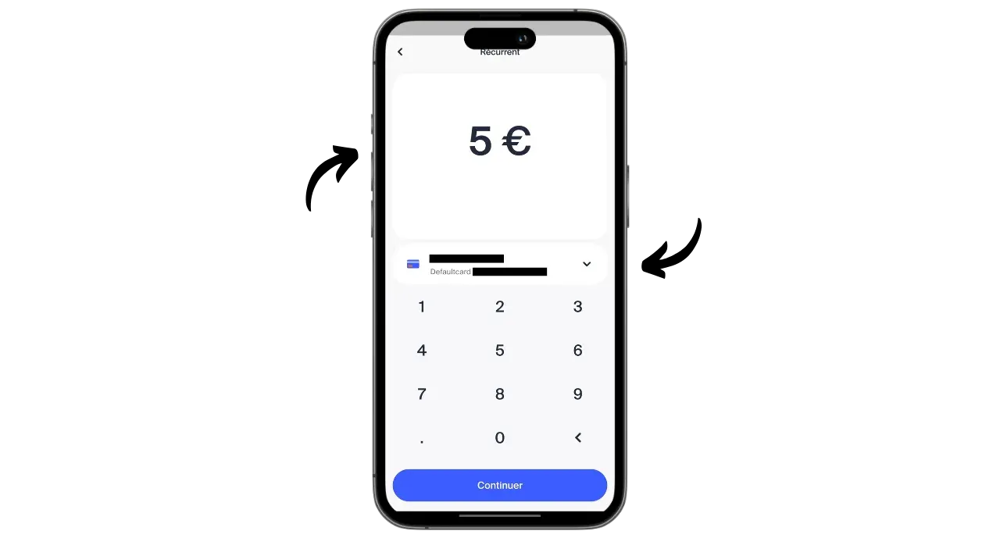

Seleziona la data di inizio e la frequenza del DCA, con opzioni che vanno dall'ora al mese. Conferma cliccando su "*Programmer*"("*programmare*").

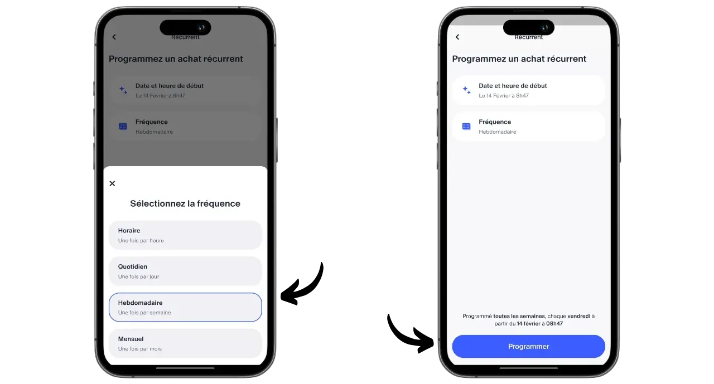

Il tuo DCA è ora attivo. È possibile visualizzarlo o modificarlo nella pagina iniziale selezionando nuovamente "*Récurrent*"("*Ricorrente*").

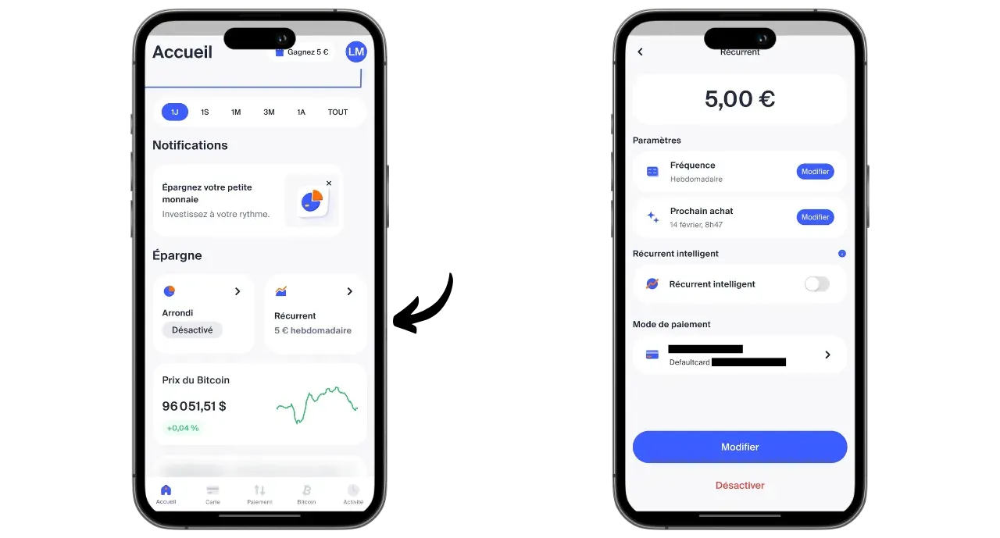

### Abilitazione dell'arrotondamento automatico delle spese

Come già spiegato, Bitstack offre un'originale funzione di arrotondamento automatico delle spese. Questa permette di arrotondare i propri acquisti giornalieri all'euro successivo (o più, a seconda dell'impostazione scelta) e di investire la differenza in BTC. Ad esempio, un acquisto di 1,10 euro si tradurrà in un investimento automatico di 0,90 euro in BTC da parte di Bitstack, che rileva e aggrega queste transazioni ogni settimana.

Questa funzione consente di investire con una sorta di DCA stabilito sulle spese personali, in modo quasi impercettibile, per accumulare gradualmente risparmi in bitcoin.

Per attivarlo, è necessario prima sincronizzare un conto bancario, come descritto all'inizio di questa sezione. Quindi, nell'applicazione Bitstack, clicca su "*Arrondi*"("Arrotondamento") nella sezione"*Épargne*"("*Risparmio*").

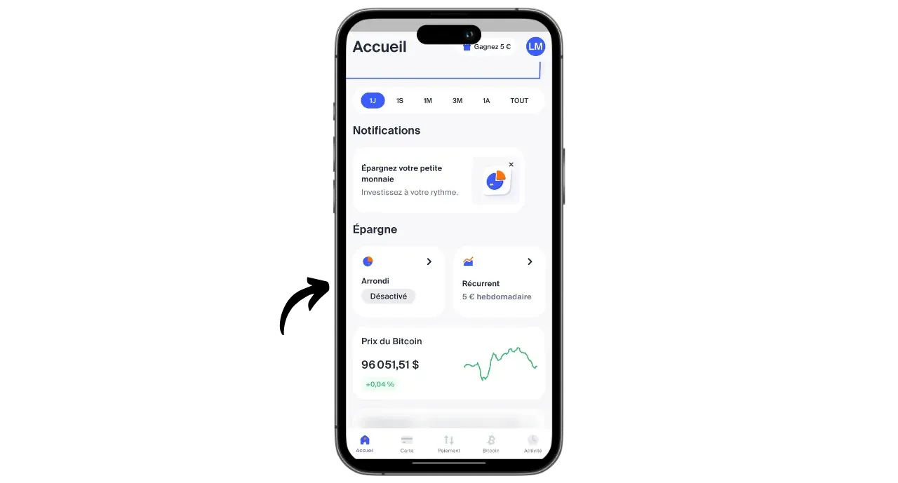

Scegli un moltiplicatore per l'arrotondamento. Ad esempio, con un moltiplicatore x2, su un acquisto di 1,10 euro vi farà risparmiare 1,80 euro in bitcoin: `0,9 * 2 = 1,8`.

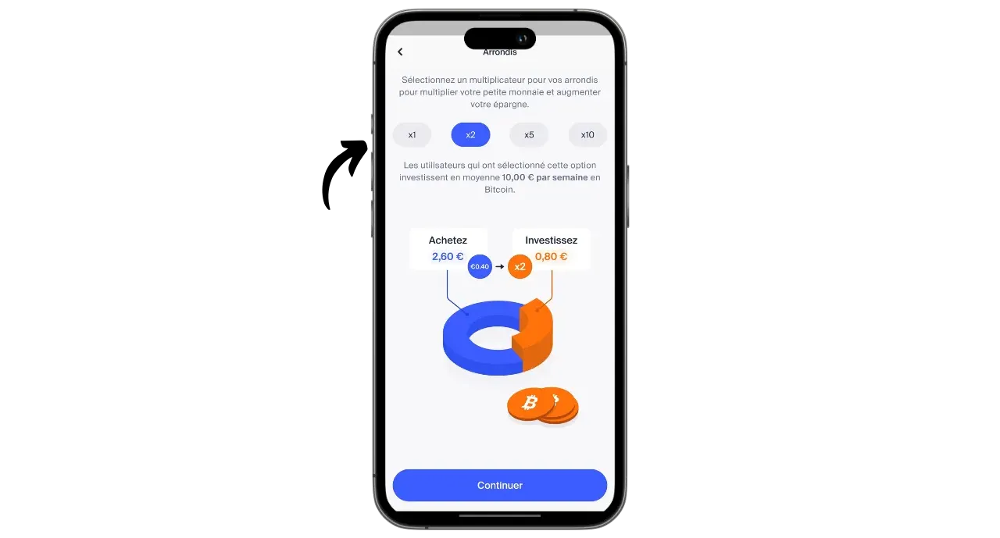

Seleziona il tuo conto bancario e clicca su "*Continuer*"("*Continua*"). Scegli ora un metodo di pagamento per l'acquisto dell'arrotondamento.

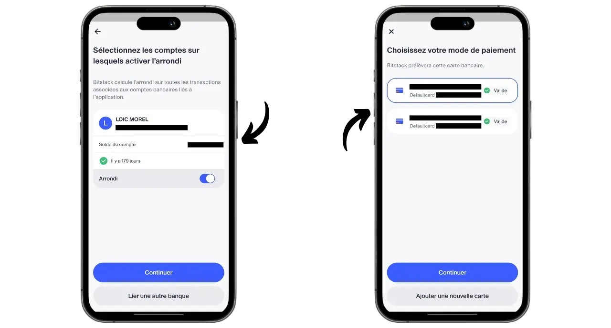

L'opzione di arrotondamento automatico è ora attiva. È possibile visualizzarla o modificarla nella sezione "*Arrondi*"("*Arrotondamento*").

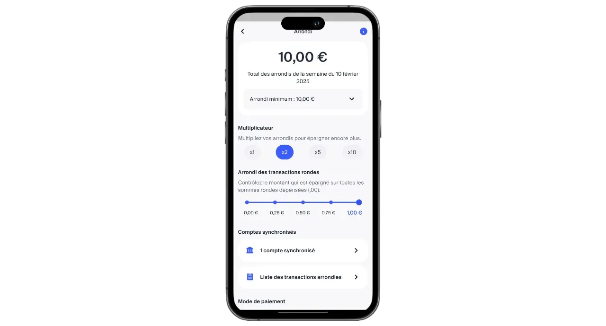

## Prelievo da bitcoin

Una volta acquistati i primi satoshi su Bitstack, è possibile ritirarli dalla piattaforma e tenerli in autodeposito. Per farlo, clicca sull'icona "*Envoyer*"("*Invio*"), quindi su "*Envoyer du Bitcoin*"("*Invio di Bitcoin*").

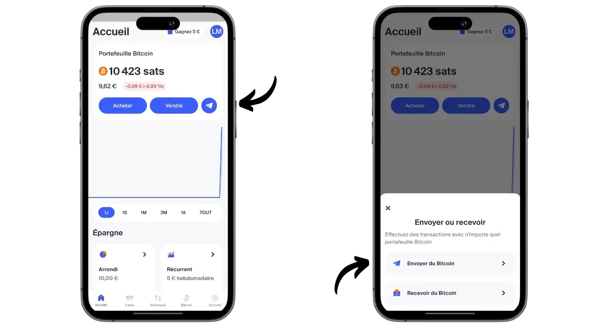

Scegli l'importo che desiderate prelevare e cliccate su "*Envoyer*"("*Invio*"). Quindi selezionare "*Adresse Bitcoin*"("*Indirizzo Bitcoin*").

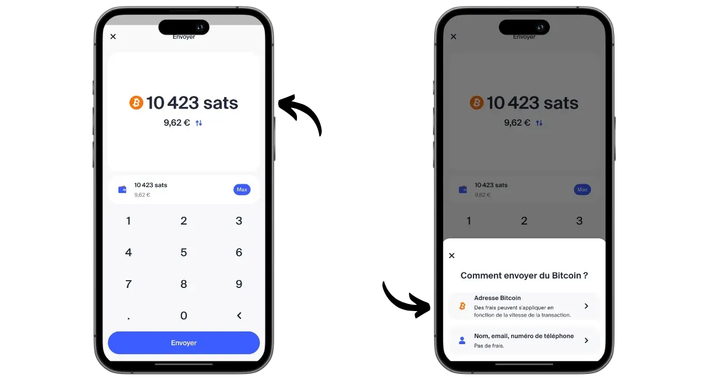

Inserisci un indirizzo di ricezione del tuo portafoglio. Presta molta attenzione, perché in caso di errore la transazione sarà irreversibile.

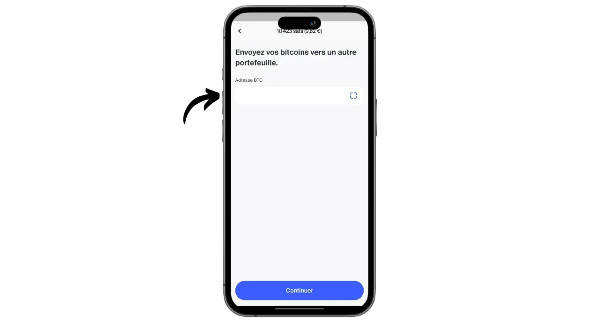

Stabilisci la priorità della transazione. Per un prelievo senza commissioni, scegli la priorità “*Standard*”. Poi verifica i dettagli del tuo prelievo e confermalo.

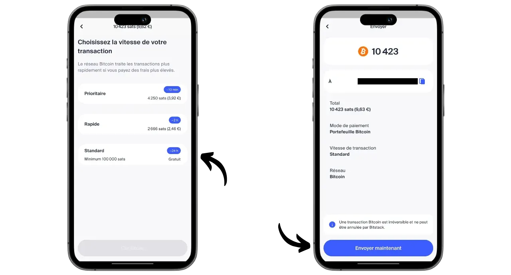

Se non hai familiarità con il funzionamento di un portafoglio di autocustodia, offriamo tutorial sulla maggior parte delle soluzioni disponibili [sulla Rete Plan ₿ nella sezione "*Portafoglio*"](https://planb.network/tutorials/wallet).

## Vendere bitcoin

Per vendere bitcoin con l'applicazione Bitstack, premere il pulsante "*Vendre*"("*Vendere*").

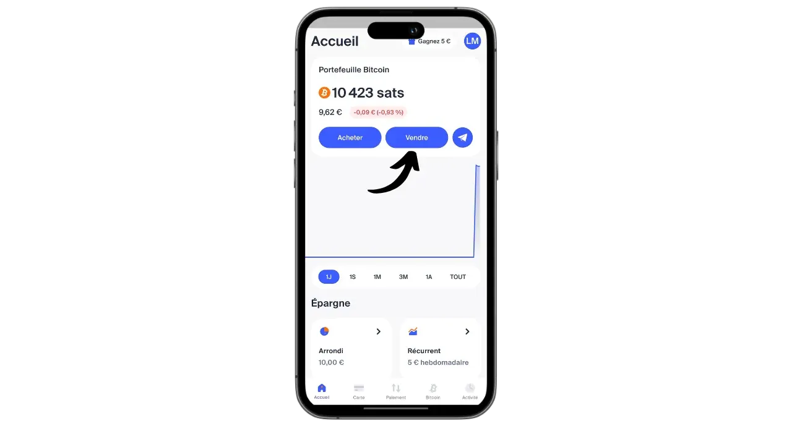

Inserisci la quantità di bitcoin che desideri vendere e cliccate su "*Continuer*"("*Continua*"). Seleziona quindi il conto bancario su cui desideri accreditare i fondi.

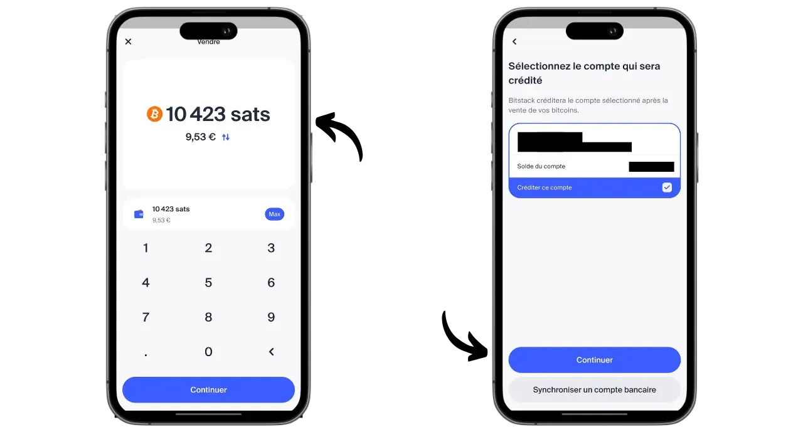

Controlla i dettagli dell'ordine di vendita e confermarlo.

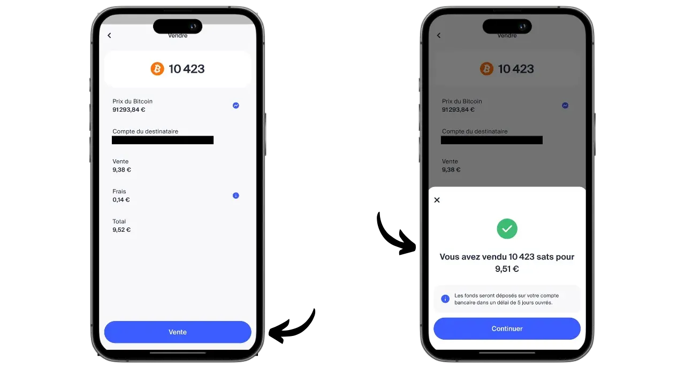

È possibile visualizzare i dettagli di tutte le transazioni nella sezione "*Activité*"("*Attività*").

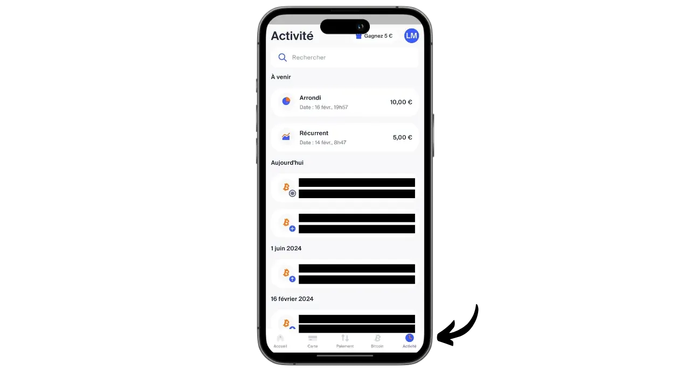
