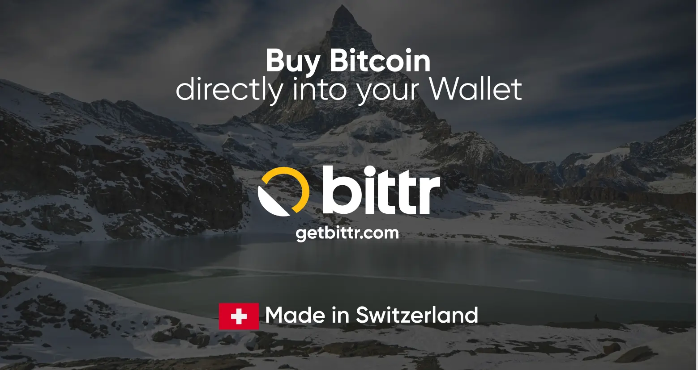

### Introduzione a Bittr

Bittr è uno strumento semplice per chiunque voglia far crescere i propri risparmi in Bitcoin, senza app complicate, controlli di identità o custodia da parte di terzi. È pensato per chi preferisce la semplicità, la privacy e il pieno controllo del proprio denaro.

Basta inviare un regolare bonifico bancario dal tuo conto e riceverete i Bitcoin direttamente nel tuo Wallet. Che tu voglia risparmiare settimanalmente, mensilmente o ogni volta che lo desideri, Bittr è stato progettato per inserirsi nella tua routine senza intralciarti.

Vediamo insieme quanto è facile iniziare ad accumulare sats con Bittr.

## Come iniziare con Bittr

- Sul web o sul cellulare vai su [getbittr.com](https://getbittr.com/buy-Bitcoin?utm_source=planb&utm_medium=tutorial&utm_campaign=step1) e clicca su “*Buy Bitcoin*”("*Acquista Bitcoin*").

- **Nessun account:** Non è necessario creare un account per acquistare Bitcoin
- **Nessun processo KYC:** Non è necessario completare un KYC (fino a 999 CHF ogni 30 giorni)
- **Avvio diretto:** Inizi subito e puoi ricevere i tuoi sats in pochi minuti

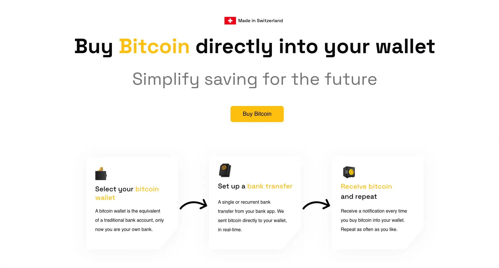

- Inserisci l’IBAN dal quale effettuerai l’invio.

- **Solo SEPA:** Bittr funziona solo in Europa.

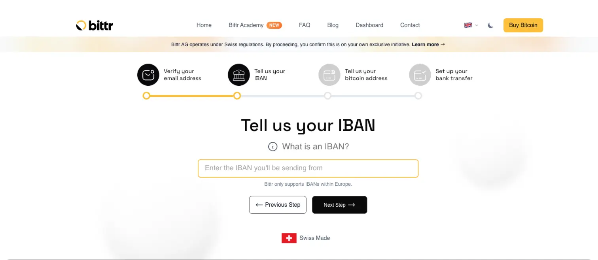

### Scegliere il Wallet

Bittr funziona con qualsiasi tipo di Wallet, compresi portafogli di app, portafogli software o portafogli hardware.

Inizieremo con BlueWallet per i principianti, e più avanti nel tutorial lo configureremo con BitBox.

## Acquistare Bitcoin direttamente nel BlueWallet

Si consiglia di eseguire la configurazione in un luogo tranquillo e riservato. L'operazione non dovrebbe richiedere più di 5 minuti.

- Selezionate "*bluewallet*" sul sito web.

- Scaricare l'App BlueWallet qui: [App Store](https://itunes.apple.com/app/bluewallet-Bitcoin-Wallet/id1376878040), [Google Play](https://play.google.com/store/apps/details?id=io.bluewallet.bluewallet).

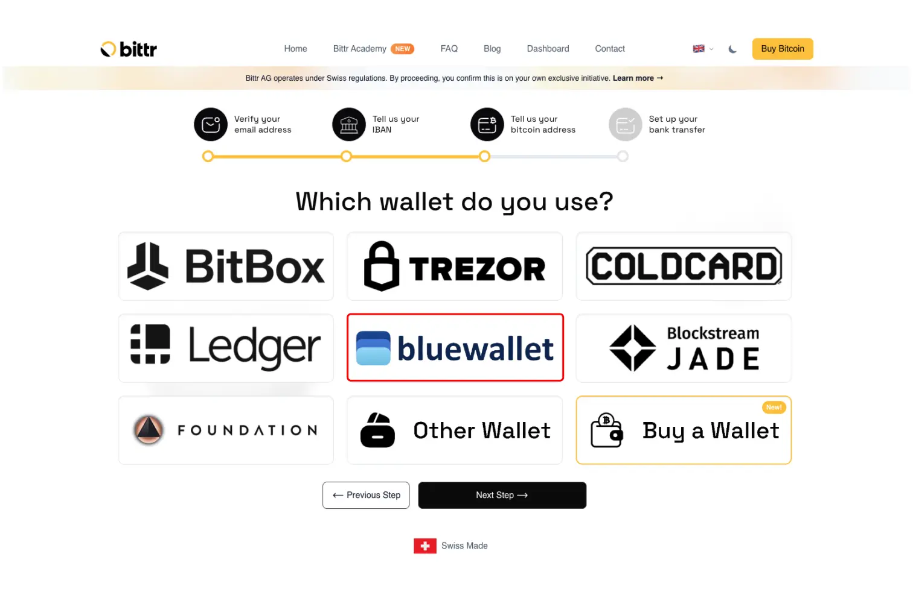

- Fai clic su “*Add a wallet*”("Aggiungi un Wallet") (se si dispone già di un Wallet, passare alla fase successiva).

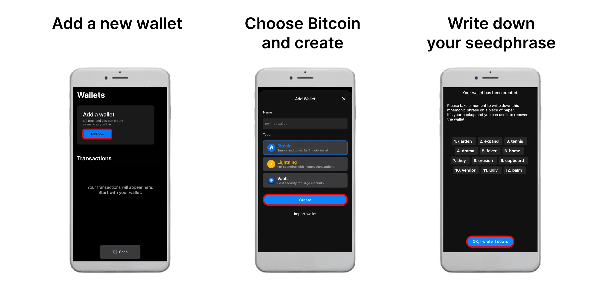

- Seleziona il tuo Wallet e vai al messaggio di firma.

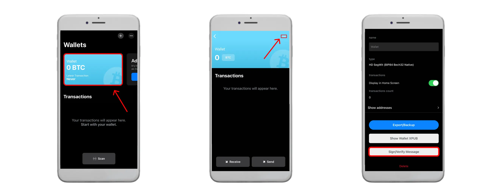

- Completa la firma del messaggio e incolla la tua firma sul sito web.

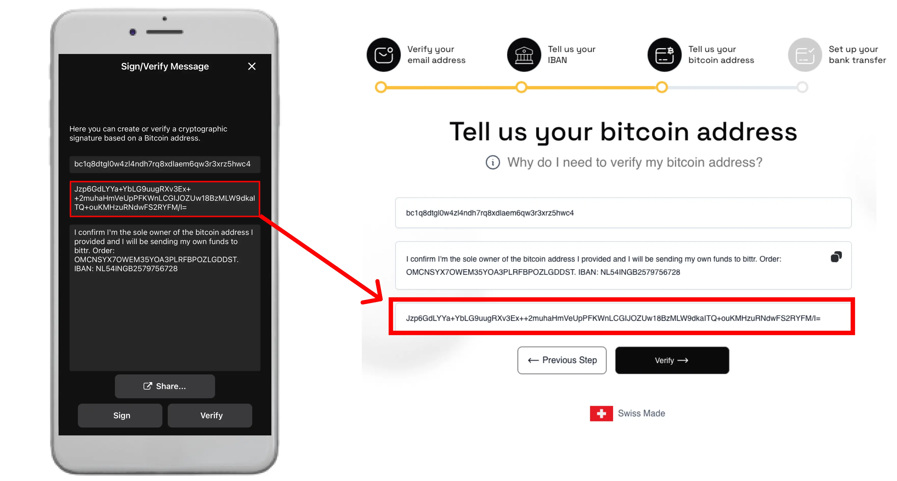

**Nota: Puoi anche cliccare su "Share"("Condividi") in BlueWallet, copiare l'intero link e incollarlo nel campo sul sito web di Bittr.**

- Imposta il bonifico bancario con la descrizione del pagamento personale.

## Acquistare Bitcoin direttamente nel BitBox

- Seleziona "BitBox"

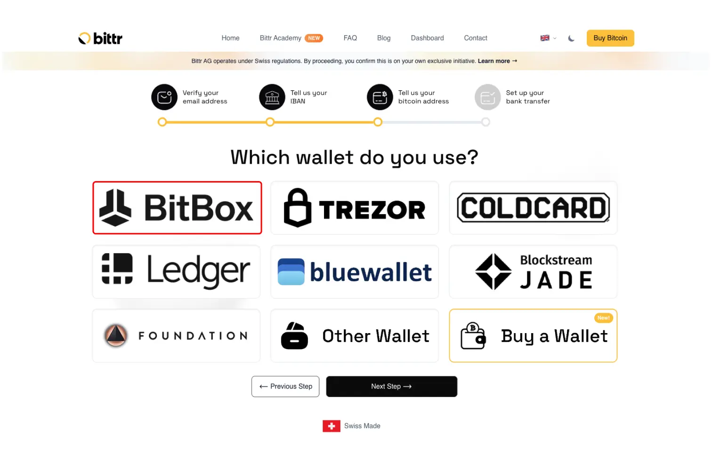

- Fai clic per aprire l'applicazione BitBox sul computer.

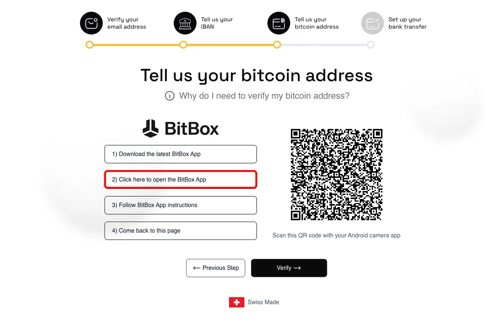

- Sblocca il BitBox ed seguire i passaggi per completare la firma del messaggio.

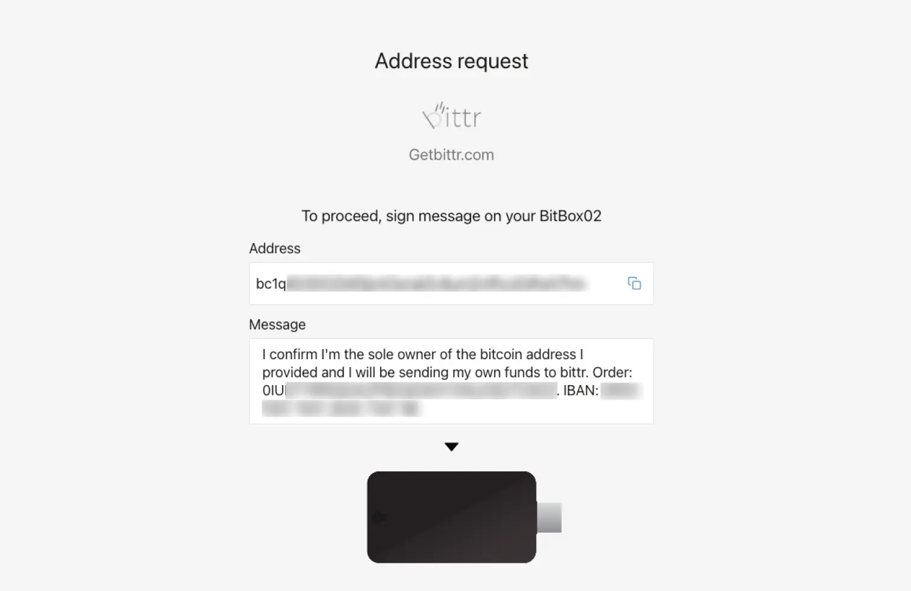

- Imposta il tuo bonifico bancario con la tua descrizione personale del pagamento.

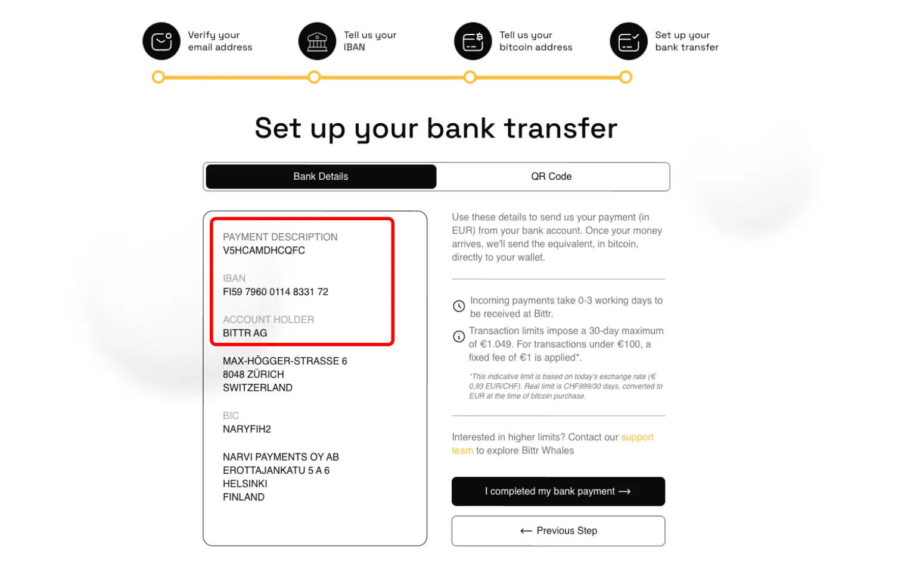

Wuhuu, è fatta! 🤩 Non appena il denaro arriva sul conto bancario di Bittr, la piattaforma acquista i tuoi Bitcoin, li invia direttamente al tuo wallet e ti manda un’email con i dettagli della transazione, incluso il tasso di cambio al momento della conversione.
