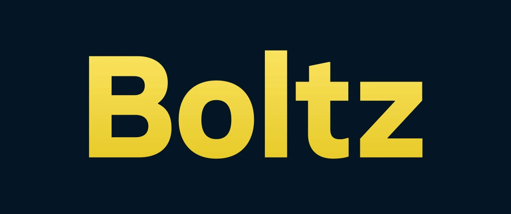

Dalla sua introduzione nel 2009, il sistema di contante elettronico peer-to-peer Bitcoin è cresciuto in modo esponenziale, dando vita a soluzioni che oggi lo rendono un sistema che possiamo utilizzare istantaneamente nelle nostre azioni quotidiane, in particolare attraverso il Lightning Network.

Tuttavia, rimaneva un problema importante tra i livelli del protocollo Bitcoin: l'interoperabilità fluida. Per sfruttare appieno il potenziale di Bitcoin, era indispensabile trovare una soluzione che consentisse di effettuare transazioni tra i diversi livelli del protocollo. Questa esigenza ha fatto nascere nel 2019 Boltz, un ponte che collega diversi livelli del Bitcoin.

## Che cos'è Boltz?

[Boltz](https://boltz.Exchange) è una piattaforma non custodial, ideale per chiunque desideri effettuare transazioni tra i diversi livelli del protocollo Bitcoin:

- **on chain**: La catena principale di Bitcoin dove le transazioni sono confermate in media ogni 10 minuti, le commissioni di transazione sono spesso elevate, il che non soddisfa necessariamente le esigenze degli utenti;
- **Lightning Network**: Il layer 2 di Bitcoin, che permette di effettuare pagamenti istantanei con commissioni molto basse, rendendo possibile usare Bitcoin per le spese quotidiane;
- **Liquid Network**: un overlay per il Bitcoin creato da Blockstream, che consente di utilizzare strumenti finanziari veloci, Confidential Transactions e altri strumenti finanziari basati su Bitcoin;
- **RootStock**: Una soluzione per lo sviluppo di contratti intelligenti basati sul protocollo Bitcoin.

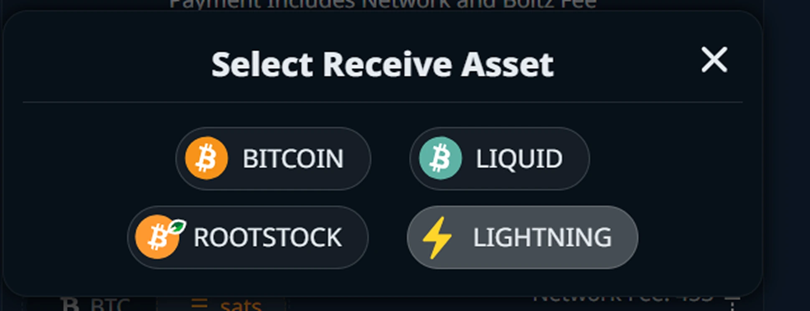

L'interoperabilità tra questi diversi livelli è di grande importanza, in quanto offre agli utenti la flessibilità necessaria per sfruttare appieno tutto ciò che l'ecosistema Bitcoin ha da offrire.

Boltz utilizza gli atomic swap. Questa tecnologia consente di scambiare bitcoin tra due layer (ad esempio BTC on-chain in cambio di BTC su Lightning Network) direttamente tra due parti, senza bisogno di fiducia e senza intermediari. Questi scambi sono detti “atomici” perché possono avere solo due risultati:

- O lo scambio va a buon fine e i due partecipanti hanno effettivamente scambiato i loro BTC;
- Oppure lo scambio non va a buon fine e entrambi i partecipanti mantengono i propri BTC originali.

In questo modo mantieni sempre l’autocustodia dei tuoi bitcoin e lo scambio non si basa su alcuna fiducia nella controparte: o lo scambio va a buon fine oppure fallisce, ma nessuna delle due parti può sottrarre i fondi dell’altra.

Uno scambio atomico funziona con gli smart contract [HTLC](https://planb.network/resources/glossary/htlc) (*Hashed Timelock Contract*). In questo tipo di Contract, l'importo viene "bloccato" in un canale bidirezionale e viene introdotta una restrizione temporale, in modo che se la transazione non viene completata entro un certo tempo, il saldo torna al depositante. Questo è il meccanismo utilizzato dalla piattaforma Boltz.

## I primi scambi con Boltz

Boltz è una piattaforma web non depositaria che non richiede informazioni personali all'utente. Boltz ha un’interfaccia minimalista e fluida che ti permette di iniziare a scambiare in meno di un minuto.

Una volta sulla piattaforma, è possibile creare scambi atomici tra i vari livelli dell'ecosistema Bitcoin.

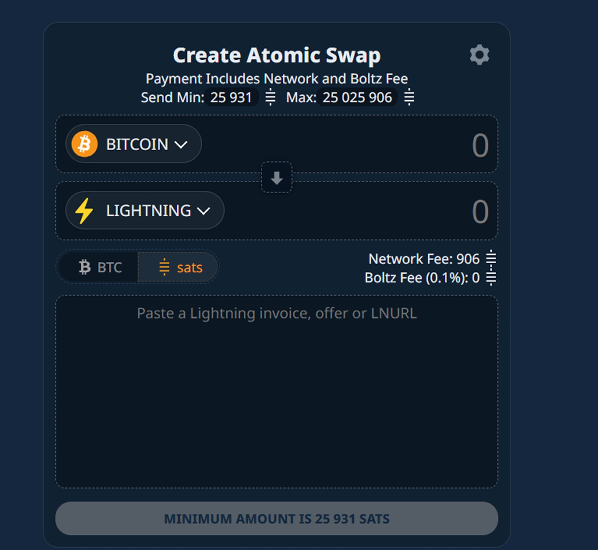

Vedrai il numero minimo e massimo di satoshi (l'unità più piccola del Bitcoin) che potete scambiare tramite Boltz, comprese le spese di rete e una percentuale applicata da Boltz tra lo 0,1% e lo 0,5%.

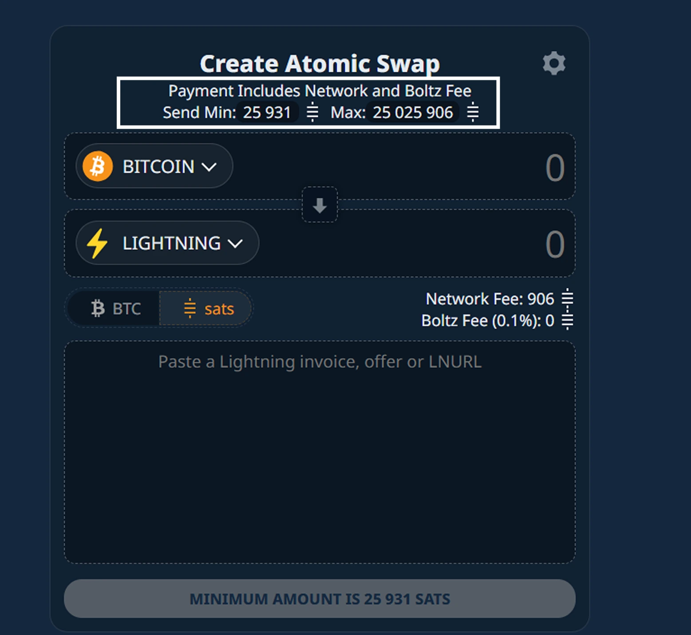

Quindi seleziona il layer da cui desideri effettuare lo scambio atomico e scegli il layer sul quale vuoi ricevere i bitcoin.

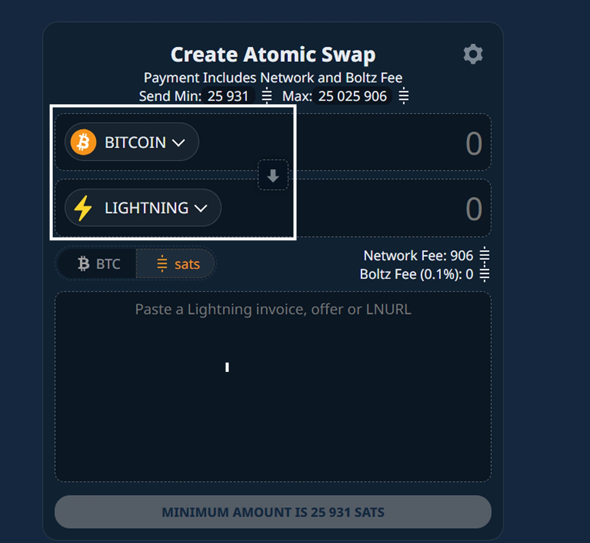

In questo tutorial ci concentreremo sullo scambio atomico dal layer principale al Lightning Network.

Puoi configurare l’unità di base per i tuoi scambi scegliendo tra le seguenti opzioni:

- BTC;
- Sats.

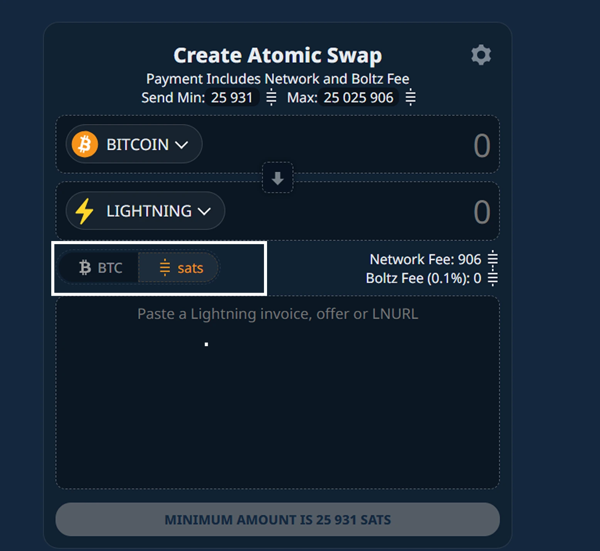

Una volta completate le configurazioni di base, inserisci l’importo del tuo scambio atomico, quindi crea una fattura Lightning per l’importo equivalente o inserisci semplicemente il tuo LNURL.

https://planb.network/tutorials/wallet/mobile/aqua-8e6d7dd3-8c03-45cc-90dd-fe3899a7d125

https://planb.network/tutorials/wallet/mobile/blitz-wallet-794bdac4-1af4-49d5-9ea5-abb8228ca196

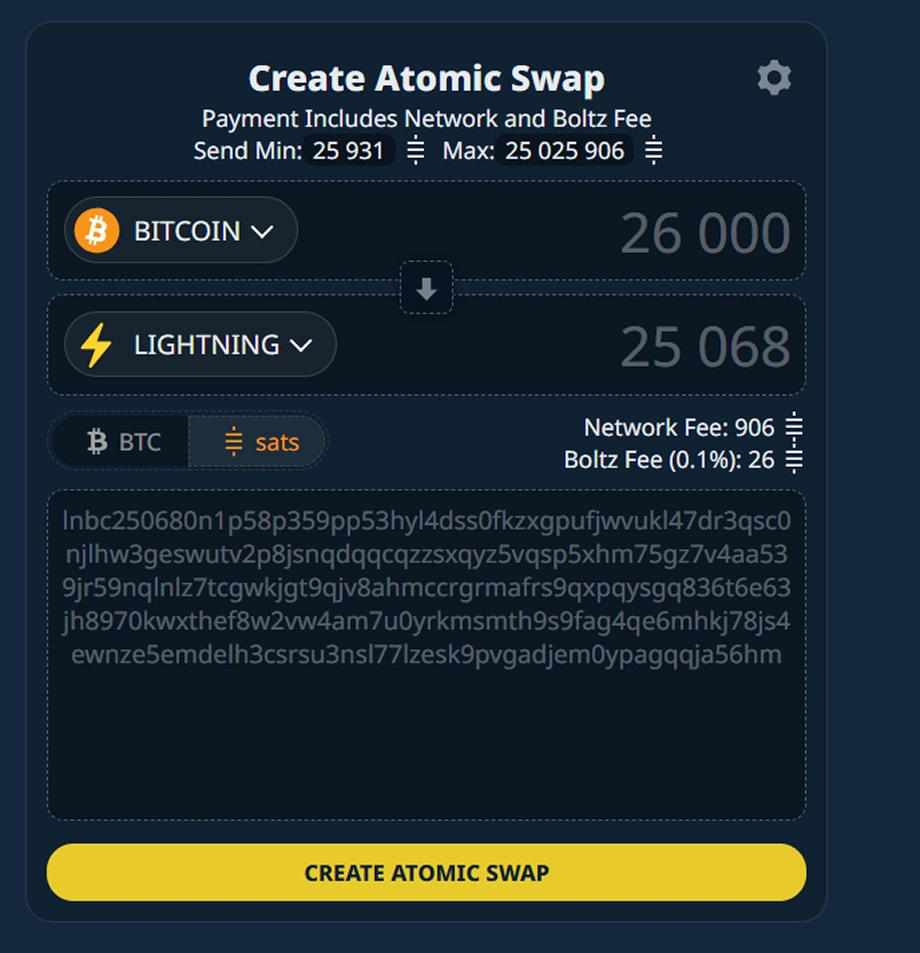

Per sicurezza, controlla i parametri del tuo scambio atomico per esportare le chiavi di backup collegate al tuo scambio.

Clicca sull’icona Impostazioni, scarica la chiave di backup e salva il file in modo appropriato.

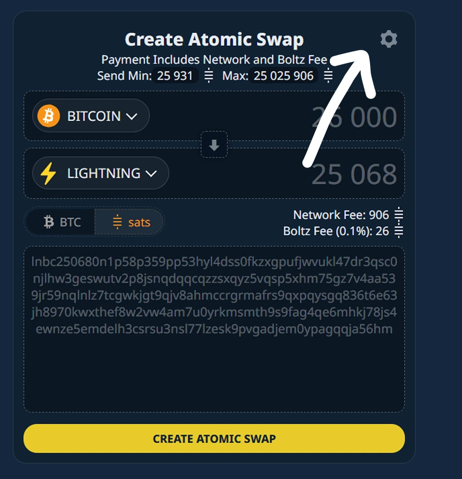

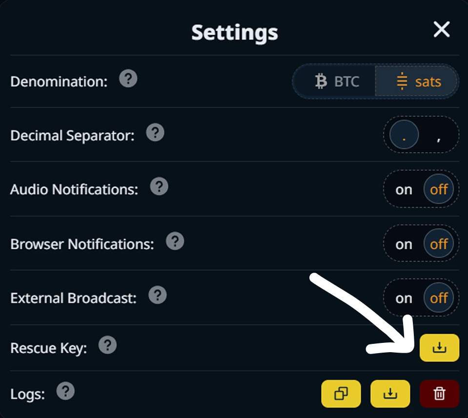

Questo file contiene le 12 parole chiave del portafoglio associato agli scambi atomici.

Clicca quindi sul pulsante **Crea Exchange atomico**(“Crea scambio atomico”) e procedere al pagamento dell'importo indicato.

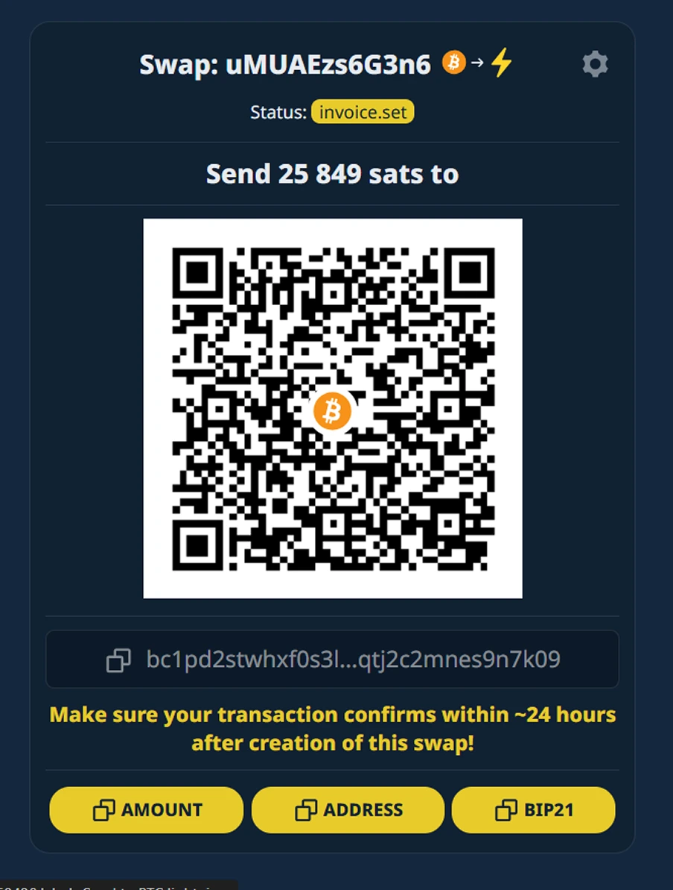

https://planb.network/tutorials/wallet/mobile/blue-wallet-2f4093da-6d03-4f26-8378-b9351d0dbc90

https://planb.network/tutorials/wallet/mobile/blink-7ea5f5a4-e728-4ff9-b3f9-cf20aa6fc2bd

Una volta che il pagamento è stato effettuato e confermato, riceverete automaticamente l'importo equivalente sul vostro Lightning Wallet.

Nel menu **Refund**("Rimborso"), trovi la cronologia dei tuoi scambi atomici, per individuare quello per il quale desideri ricevere il rimborso. Puoi anche importare la cronologia delle operazioni effettuate su un altro dispositivo, ad esempio utilizzando il file della chiave di backup associato a queste transazioni.

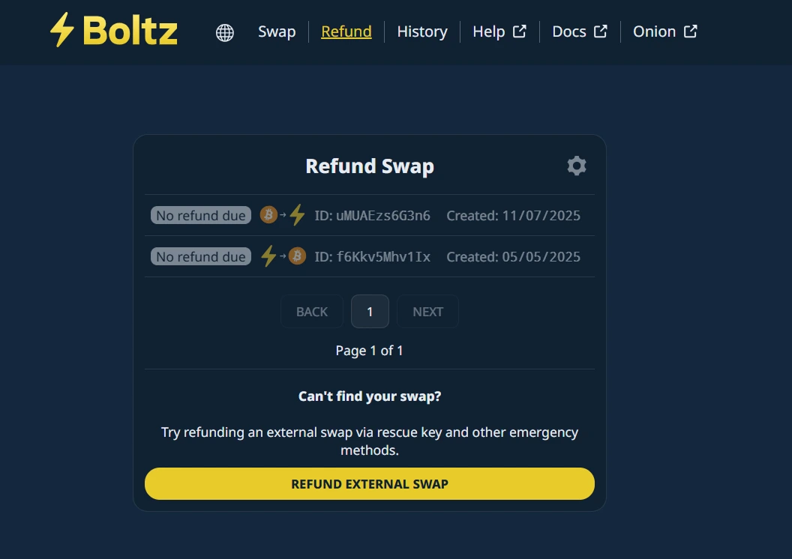

Nel menu **History**("Storia") puoi scaricare un resoconto più dettagliato delle operazioni legate alla tua chiave di recupero, cliccando sul pulsante **Backup**.

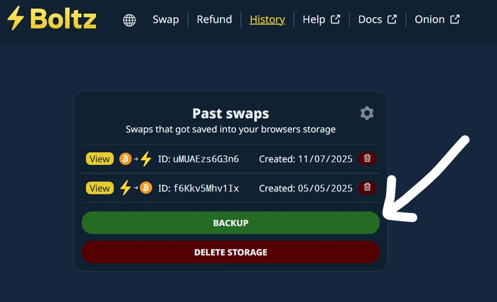

⚠️ Ti preghiamo di non divulgare questo file, poiché contiene tutte le informazioni relative alle tue transazioni e la chiave di backup collegata a queste operazioni.

Boltz ti offre un alto livello di riservatezza grazie all’accesso tramite un link `.onion` sulla rete Tor. Effettua scambi atomici completamente anonimi selezionando il menu Onion, dopo aver attivato la navigazione Tor nel tuo browser.

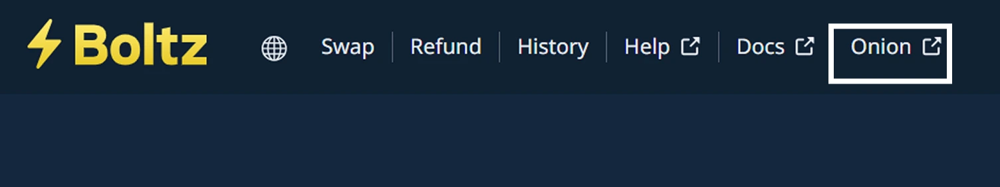

https://planb.network/tutorials/computer-security/communication/tor-browser-a847e83c-31ef-4439-9eac-742b255129bb

Ormai conosci Boltz, una piattaforma di scambio unica che permette l’interoperabilità tra i diversi layer dell’ecosistema Bitcoin.
