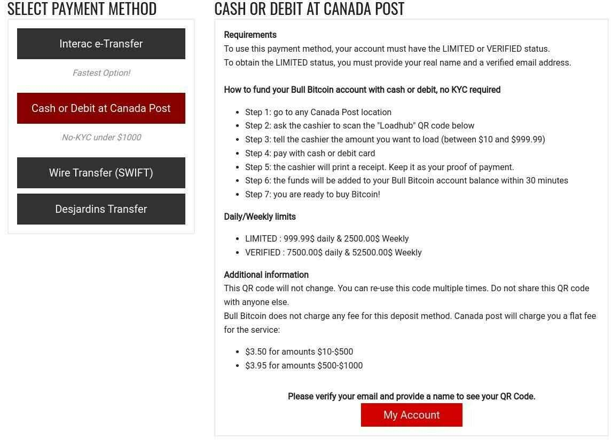
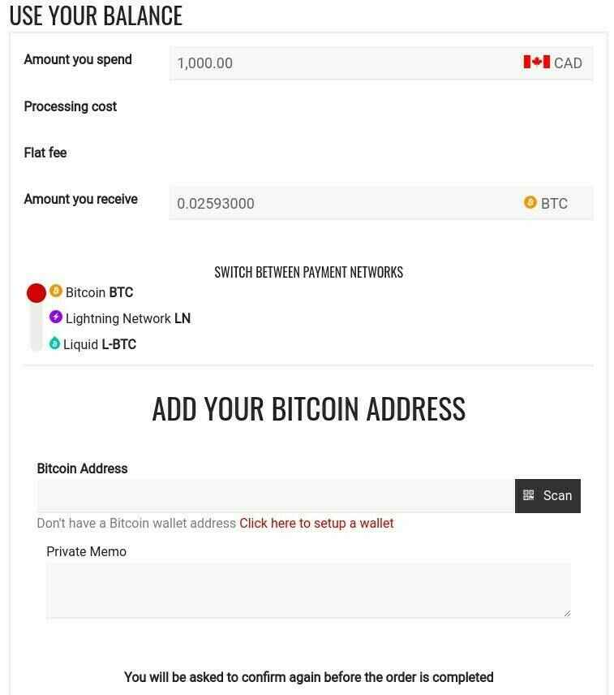

# Bull bitcoin

Bull Bitcoin (https://www.bullbitcoin.com) est un échange non dépositaire et un service de paiements — Bitcoin seulement, sans compromis!

How To Buy Bitcoin In Canada: Bull Bitcoin by BTCsession

# Acheter du Bitcoin sans KYC au Canada avec Bull Bitcoin

## Rendez vous à un comptoir Poste Canada et achetez des bitcoins avec du comptant grâce à Bull Bitcoin.

L'une des propositions les plus enivrantes des monnaies fiduciaires (fiat) est certainement de pouvoir l'échanger en faveur de bitcoins, idéalement sans même devoir s'identifier outre mesure ; une méthode souvent référée en tant que no-KYC ou KYC-free. L'acronyme 'KYC' fait référence au processus de vérification de l'identité d'un individu ou d'une entité en particulier en suivant certaines réglementations émises au niveau gouvernemental.

La majorité des échanges de Bitcoin sont réglementés ainsi et sont donc tenus de vérifier l'identité de leurs clients afin de pouvoir leur permettre d'acheter des bitcoins sur leur plateforme. Les utilisateurs doivent donc fournir différentes informations personnelles telles que le nom, l'adresse, le numéro de téléphone, une ou plusieurs pièces d'identité, etc., afin d'avoir la permission de passer un ordre d'achat de bitcoins.

Cette pratique est sans aucun doute une atteinte à la vie privée et à la confidentialité des citoyens cherchant tout simplement à acquérir une monnaie, dans le cas de Bitcoin, complètement détachée du système fiduciaire contrôlé par les volontés d'une banque centrale omnisciente.

## Utiliser Bull Bitcoin pour acheter des bitcoins avec du comptant au Canada

Au Canada, il est désormais possible de passer par l'un de ces échanges pour se procurer des bitcoins avec du comptant, le tout exempt de KYC. En effet, Bull Bitcoin, une compagnie Canadienne réputée en opération depuis 2015 menée par Francis Pouliot, offre la méthode de paiement 'Cash or Debit at Canada Post' à ses utilisateurs ayant acquis le statut 'Limited', lequel est attribué à ceux-ci une fois qu'ils ont fourni leur nom ainsi qu'une adresse courriel vérifiée.

## Approvisionnement du compte via Postes Canada

La méthode de paiement 'Cash or Debit at Canada Post' pour approvisionner le compte afin de s'acheter des bitcoins se trouve dans la section 'Fund your account' du site web (aussi disponible en version mobile sur navigateur web). Dans cette section, vous trouverez la méthode de paiement et les instructions correspondantes, ainsi que le code QR associé au compte Bull Bitcoin (une fois le statut 'Limited' atteint).

Le fonctionnement est fort simple : il s'agit de se rendre à l'un des 5948 comptoirs Postes Canada et de présenter son code QR au commis, lequel n'aura qu'à le balayer à l'aide du scanneur régulier de Postes Canada.

Ensuite, il suffit de préciser le montant que vous souhaitez débourser (entre $10.00 et $999.99) et de le payer en comptant ou par carte débit. Au bout de 10 minutes, la transaction sera complétée sur Bull Bitcoin. Des frais de $3.50 à $3.95 s'appliquent, dépendant du montant, lors de la transaction au bureau de poste. D'ailleurs, ces frais s'avèrent considérablement inférieurs à ceux que l'on retrouve avec les Bitcoin ATM, une autre option populaire libre de KYC.

Notez que des limites transactionnelles journalière et hebdomadaire de $999.99 et $2500.00 s'appliquent, respectivement. Une tentative de surpasser ces limites lors d'un paiement au bureau de poste verra tout simplement la transaction s'annuler automatiquement.

## Acheter des bitcoins directement vers son propre portefeuille sur Bull Bitcoin

Lorsque les fonds sont disponibles sur le compte Bull Bitcoin, il est temps de passer à l'étape de l'achat des bitcoins ! Rendez vous dans la page 'Buy Bitcoin' située dans le menu principal. De là, vous devrez entrer le montant de votre solde que vous souhaitez dépenser, ainsi que le réseau de votre choix (Bitcoin, Lightning Network, Liquid).

Pour les réseaux Bitcoin et Liquid, il vous faudra partager une adresse afin de pouvoir créer l'ordre d'achat. Pour ce qui est du réseau Lightning, Bull Bitcoin offre deux méthodes de paiement différentes; soit LNURL (l'option par défaut) ou Bolt11, une fois l'ordre créé.

Essentiellement, l'option LNURL est la plus simple : un code QR est généré et l'utilisateur doit utiliser un portefeuille Lightning supportant ce protocole pour le balayer et réclamer les bitcoins. Bull Bitcoin demande une adresse Bitcoin 'fallback' afin de pouvoir confirmer la transaction. Celle-ci est utilisée dans l'éventualité où la transaction Lightning n'aboutirait pas, pour de multiples raisons. C'est donc l'option recommandée.

Pour ce qui est de Bolt11, il s'agit de la méthode traditionnelle du réseau Lightning. Contrairement à LNURL, c'est l'utilisateur qui doit créer la facture (invoice) avec son portefeuille Lightning, pour ensuite fournir les détails à Bull Bitcoin avant de confirmer l'ordre d'achat. Cette option implique un certain risque d'erreur par l'utilisateur, lequel doit manuellement entrer le montant en bitcoins fourni par Bull Bitcoin dans son portefeuille lors de la création de la facture, pour ensuite devoir partager cette dernière à Bull Bitcoin. Néanmoins, la méthode fonctionne très bien lorsqu'utilisée correctement.

> 💡 Consultez ces articles Agora256 pour en apprendre plus sur les différentes solutions de portefeuilles disponibles :
>
> - Les 6 meilleurs choix de portefeuilles Bitcoin sur mobile en 2023
> - Création, sauvegarde et utilisation d'une clé privée Bitcoin avec un appareil Coldcard et Bitcoin Core

Voilà, une fois l'ordre d'achat confirmé, Bull Bitcoin enverra les bitcoins directement à votre portefeuille. Il n'y a pas d'alternative; Bull Bitcoin est une plateforme non-dépositaire n'offrant aucun service de garde de bitcoins pour ses utilisateurs, et c'est parfait ainsi ! Apprendre à conserver ses propres bitcoins est tout simplement la meilleure pratique.

## Conclusion

Alors que plusieurs autres services, notamment Binance et Bybit, ont délaissé le marché Canadien, Bull Bitcoin, fidèle à sa réputation avant-gardiste, s'est positionné pour répondre à la demande grandissante de bitcoiners en quête d'une rétention de vie privée et de confidentialité accrue. Bull Bitcoin proposant des services Bitcoin non-dépositaire uniquement, les régulations de plus en plus strict n'ont pas les mêmes effets que sur les plateformes dépositaires supportant une multitude de shitcoins.

Si vous n'avez pas encore de compte Bull Bitcoin, utilisez notre lien de référence https://mission.bullbitcoin.com/agora256 pour vous inscrire et recevez $21 en bonus.

D'ici là, comme toujours, si vous avez des questions, n'hésitez pas à les partager à la communauté Agora256, nous apprenons ensemble, pour être meilleur demain que nous ne le sommes aujourd'hui!
