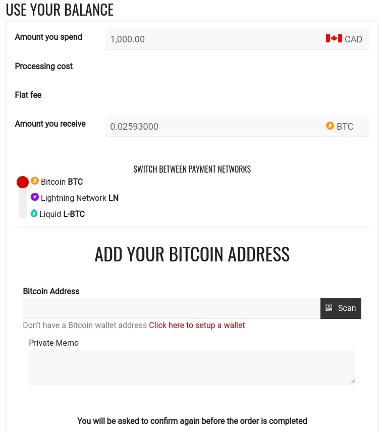

Bull Bitcoin (https://www.bullbitcoin.com) は、非預託型の交換所および支払いサービスです - Bitcoinのみ、妥協はありません！

カナダでBitcoinを購入する方法：BTCsessionによるBull Bitcoin

# Bull Bitcoinを使ってカナダでKYCなしでBitcoinを購入

## カナダポストのカウンターに行き、Bull Bitcoinを使って現金でビットコインを購入します。

**このチュートリアルは、Agora256の一環としてWINTER ☩ HODLERによって提供されています。彼の作業に感謝します。**

法定通貨の最もエキサイティングな提案の一つは、間違いなくそれらをビットコインに交換できることであり、理想的には自分自身をあまり特定することなく、KYCなしまたはKYCフリーとしてよく言及される方法です。'KYC'という頭字語は、特定の政府規制に従って特定の個人またはエンティティの身元を確認するプロセスを指します。

ほとんどのビットコイン交換所は規制されており、そのプラットフォームでビットコインを購入するために顧客の身元を確認する必要があります。ユーザーは、ビットコインの購入注文を出すために、名前、住所、電話番号、1つ以上の身分証明書類など、さまざまな個人情報を提供する必要があります。

この慣行は、ビットコインの場合、全能の中央銀行の願望によって制御された法定システムから完全に切り離された通貨を単に取得しようとする市民のプライバシーと機密性の侵害であることは間違いありません。

## カナダで現金を使ってBull Bitcoinでビットコインを購入する

カナダでは、これらの交換所の1つを使用して、KYCなしで現金でビットコインを取得することが可能です。実際、2015年から運営されている評判の良いカナダの会社であるBull Bitcoinは、名前と検証済みのメールアドレスを提供した後に「Limited」ステータスが付与されたユーザーに対して、「Cash or Debit at Canada Post」の支払い方法を提供しています。

## カナダポスト経由でアカウントに資金を供給する

ウェブサイトの「Fund your account」セクション（ウェブブラウザのモバイルバージョンでも利用可能）で、アカウントに資金を供給してビットコインを購入するための「Cash or Debit at Canada Post」の支払い方法と、それに関連する指示、およびBull Bitcoinアカウントに関連付けられたQRコード（「Limited」ステータスに達した後）を見つけることができます。
操作は非常にシンプルです：5948のカナダポストカウンターの1つに行き、QRコードを提示するだけで、店員が通常のPost Canadaスキャナーを使用してスキャンします。

次に、支払いたい金額（$10.00から$999.99の間）を指定し、現金またはデビットカードで支払います。10分後、取引はBull Bitcoin上で完了します。郵便局での取引時には、金額に応じて$3.50から$3.95の手数料がかかります。これらの手数料は、KYCのない別の人気オプションであるBitcoin ATMで見つかる手数料よりもかなり低いです。

日次および週次の取引限度額はそれぞれ$999.99および$2500.00です。郵便局での支払い時にこれらの限度を超えようとすると、取引は自動的にキャンセルされます。

## Bull Bitcoinで直接自分のウォレットにビットコインを購入する
Bull Bitcoinアカウントに資金が利用可能になったら、ビットコインを購入するステップに進む時です！メインメニューにある「Buy Bitcoin」ページに移動してください。そこから、使いたい残高の金額と選択したネットワーク（Bitcoin、Lightning Network、Liquid）を入力する必要があります。

BitcoinおよびLiquidネットワークについては、購入注文を作成するためにアドレスを共有する必要があります。Lightningネットワークに関しては、Bull Bitcoinは2つの異なる支払い方法を提供しています：LNURL（デフォルトオプション）またはBolt11、注文が作成された後です。

基本的に、LNURLオプションが最もシンプルです：QRコードが生成され、ユーザーはこのプロトコルをサポートするLightningウォレットを使用してスキャンし、ビットコインを請求する必要があります。Bull Bitcoinは、トランザクションを確認するために「フォールバック」Bitcoinアドレスを要求します。このアドレスは、複数の理由でLightningトランザクションが失敗した場合に使用されます。したがって、推奨されるオプションです。

Bolt11については、Lightningネットワークの伝統的な方法です。LNURLとは異なり、ユーザーが自分のLightningウォレットで請求書を作成し、購入注文を確認する前にBull Bitcoinに詳細を提供する必要があります。このオプションには、ユーザーがBull Bitcoinから提供されたビットコインの金額をウォレットに手動で入力し、それをBull Bitcoinと共有する際のエラーのリスクが伴います。しかし、正しく使用された場合、この方法は非常にうまく機能します。

> 💡 さまざまなウォレットソリューションについてもっと学びたい場合は、これらのAgora256の記事をチェックしてください：
> '
>
> - 2023年のモバイルでのビットコインウォレットのベスト6選
> - ColdcardデバイスとBitcoin Coreを使用してビットコインのプライベートキーを作成、バックアップ、使用する方法

購入注文が確認されると、Bull Bitcoinは直接あなたのウォレットにビットコインを送信します。代替手段はありません。Bull Bitcoinは非預託プラットフォームであり、ユーザーに対してビットコインの保管サービスを提供していません。それは完璧です！自分のビットコインを保持することを学ぶことは、単に最良の慣行です。

## 結論

BinanceやBybitなどの他のサービスがカナダ市場から撤退した一方で、Bull Bitcoinはその先駆的な評判に忠実に、プライバシーと機密性を高めたいビットコイナーの増加する需要に応えるために位置づけを確立しました。Bull Bitcoinは非預託Bitcoinサービスのみを提供しているため、厳格になりつつある規制は、多数のshitcoinsをサポートする預託プラットフォームに対する影響とは異なります。

まだBull Bitcoinアカウントをお持ちでない場合は、紹介リンクhttps://mission.bullbitcoin.com/agora256を使用してサインアップし、$21のボーナスを受け取ってください。

その間、いつものように、質問があればAgora256コミュニティと共有してください。私たちは一緒に学び、今日よりも明日の方がより良くなるためです！

> **Agora256のガイドに感謝します。以下のアフィリエイトリンクは大学に関係ありません。元のリンク：https://agora256.com/acheter-du-bitcoin-sans-kyc-au-canada-avec-bull-bitcoin/**