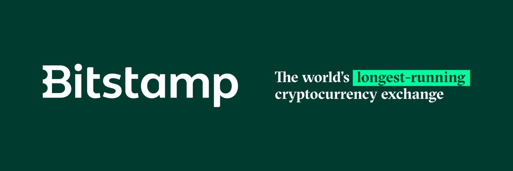

# Bitstamp

Bitstamp (https://www.bitstamp.net/) is a Bitcoin broker for buying and selling Bitcoin, there are lots of volumes and options. It’s ideal for companies or heavy buyer. It is KYC so be aware of this. they also started charging for holding your bitcoin inside their wallet.

We don't have a writing guide yet, feel free to propose one :D
