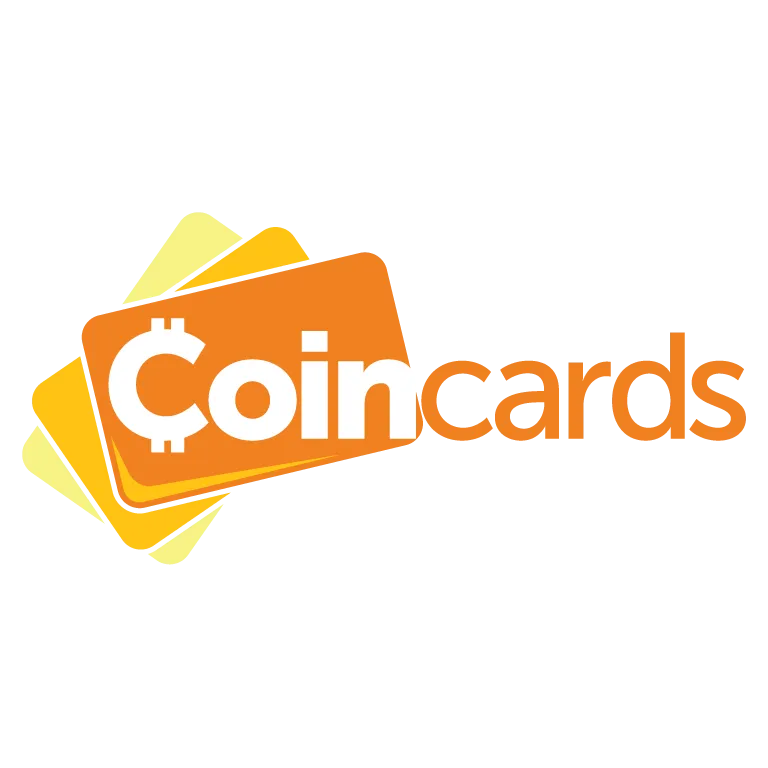

> Bitcoin: un sistema di contanti elettronici Peer-to-Peer

Bitcoin serve a pagare direttamente tra persone, senza bisogno di chiedere il permesso a nessuno. Oggi, però, pochi negozi accettano Bitcoin, quindi può essere difficile spendere i tuoi satoshi. **Coincards** aiuta a risolvere questo problema, permettendoti di usare i tuoi bitcoin per comprare **gift card**(**Carte Regalo**).

Su questo punto, una breve parentesi per sottolineare, a mio avviso, l’importanza di usare Bitcoin come mezzo di pagamento e non solo come riserva di valore. Infatti, mentre scrivo queste righe, il riflesso di troppi Bitcoiners, quando hanno l’opportunità di spendere i loro preziosi sats, è quello di non farlo, preferendo invece usare l’euro o altre valute fiat imposte.

A prima vista, questo può sembrare del tutto ragionevole, ma fa riflettere sulla logica dietro a questo comportamento. Bitcoin è stato progettato per essere usato senza permesso. Non è quindi evidente che più attività commerciali accettano Bitcoin intorno a te, maggiori saranno le tue scelte come Bitcoiner sovrano? In altre parole, più ti sarà facile spendere i tuoi sats senza chiedere permesso, più diventeranno preziosi i tuoi stessi Bitcoin. In questo senso, è importante favorire l’adozione, scegliendo di supportare le attività che accettano Bitcoin e dando loro un vantaggio competitivo che incoraggi altri a seguirne l’esempio.

Quindi, anche seguendo la logica di preservare il valore dei propri risparmi in Bitcoin, partecipare all’adozione di Bitcoin, rendendone l’uso il più semplice possibile, è almeno altrettanto importante quanto l’“HODL”.

Se devi passare attraverso un Exchange per poter spendere i tuoi Bitcoin, allora il loro valore potenziale è praticamente zero. Se invece puoi spenderli ovunque, il loro valore aumenta di molto.

In sintesi, “spendere” e “ricomprare” sembrano essere la strada da seguire. Partecipa allo sviluppo dell’adozione, distribuisci i tuoi satoshi in quanti più posti possibile e poi ricomprali il prima possibile.

## Che cos'è Coincards?

Come il suo “fratello maggiore” Bitrefill, e i suoi concorrenti (The Bitcoin Company, Coinsbee, ecc.), Coincards ti permette di spendere i tuoi preziosi sats per acquistare gift card (carte regalo), che poi possono essere utilizzate online o anche nei negozi fisici dei principali rivenditori vicino a te. Rivenditori che, naturalmente, non accettano ancora Bitcoin direttamente.

https://planb.network/tutorials/exchange/centralized/bitrefill-8c588412-1bfc-465b-9bca-e647a647fbc1

Coincards offre un'ampia gamma di scelte, dalla vendita al dettaglio ai fast food, alle piattaforme di streaming, ai giochi online, ai siti di e-commerce e altro ancora...

Sono presenti nelle seguenti regioni: Nord America, Europa e Australia.

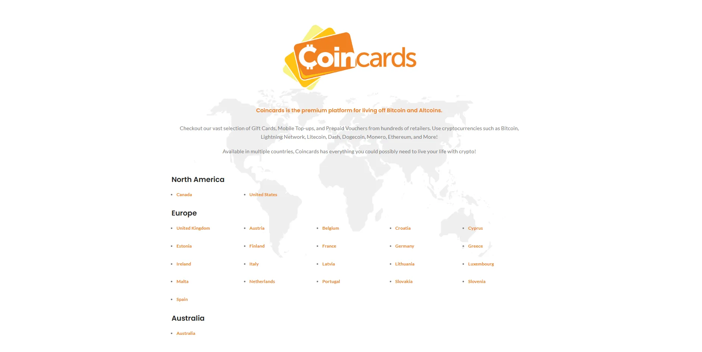

Coincards si impegna a preservare la vostra privacy. Permette di pagare in Bitcoin, On-Chain e Lightning, ma anche in Monero, l'unica criptovaluta con un elevato capitale di simpatia nella comunità Bitcoin, grazie alla vicinanza ideologica e ai numerosi obiettivi condivisi dalle due comunità. Come promemoria, Monero è una criptovaluta che permette di nascondere le proprie transazioni, rendendole difficili o impossibili da rintracciare nel registro pubblico del Blockchain.

Questa è l'occasione per ricordare a coloro che desiderano pagare le carte regalo in Bitcoin, godendo di una buona protezione della privacy, di optare per il Lightning Network per farlo.

Una selezione di tutorial sui principali portafogli Lightning (Phoenix, Breez, BitKit, Zeus...) è disponibile qui: [Plan ₿ Network - Wallet](https://planb.network/tutorials/wallet)

Se desideri saperne di più sul funzionamento del Lightning Network, è disponibile un corso di formazione completo.

https://planb.network/courses/34bd43ef-6683-4a5c-b239-7cb1e40a4aeb

## Come posso acquistare una carta regalo in BTC su Coincards?

Per prima cosa, Coincards non richiede la creazione di un account. Tutto ciò che ti serve per acquistare le gift card è un indirizzo email valido, che ti permetterà di riceverle in formato digitale.

Creare un account è utile solo per chi desidera avere una panoramica delle proprie gift card e dello storico degli acquisti, per esempio.

Iniziamo ad illustrare il processo di acquisto senza creare un account, per poi tornare molto rapidamente all'account Coincards e alle sue funzionalità.

Visitare [Coincards.com](https://coincards.com/).

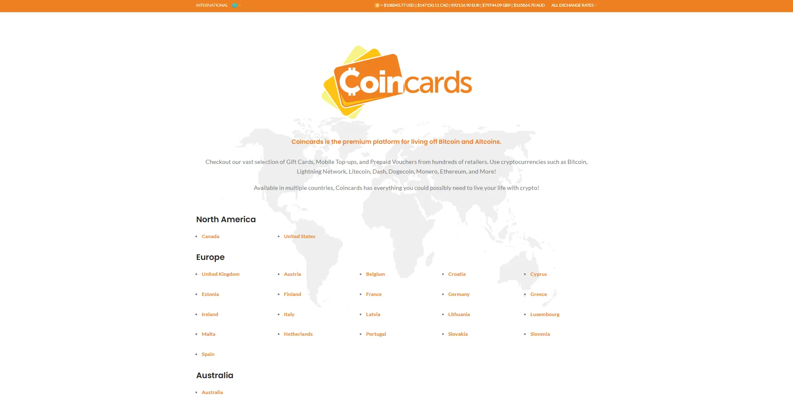

Per questo tutorial ci concentreremo sull'Europa, e più precisamente sulla Francia.

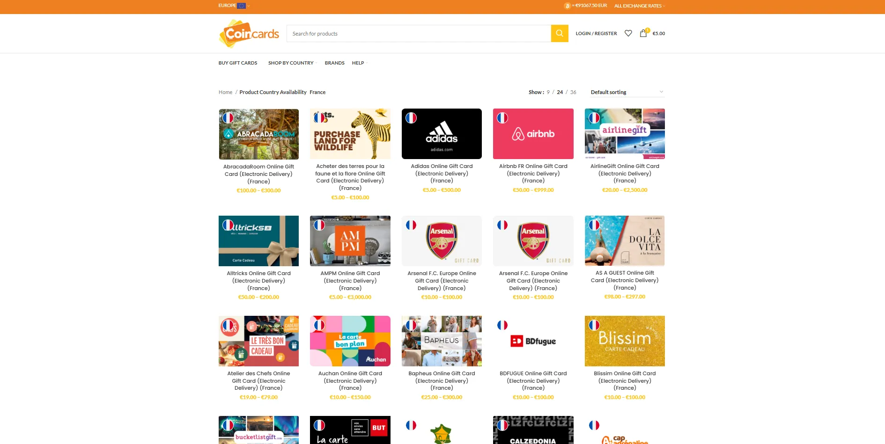

Utilizzando il menu in alto a destra, è possibile ordinare le referenze nell'ordine preferito. Ad esempio, "Ordina per popolarità" consente di vedere quali sono le schede più popolari tra gli utenti.

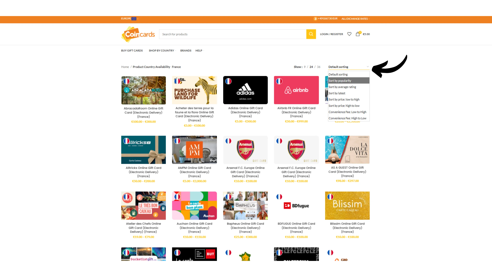

Per il nostro esempio, sceglieremo il marchio Monoprix, un importante rivenditore di alimentari francese.

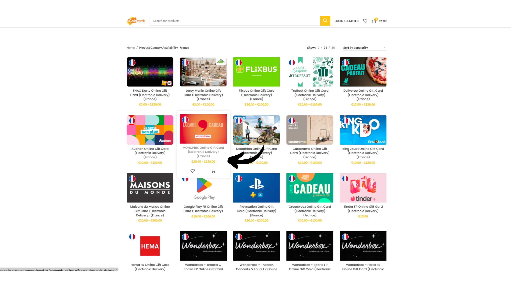

Assicurati di leggere la descrizione della carta scelta in fondo alla schermata, per capire come deve essere utilizzata e per individuare eventuali limitazioni, ambito di utilizzo, data di validità, ecc.

Scegli il valore della carta, ad esempio 20 euro (è il minimo consentito), quindi cliccare su “ADD TO CART”("AGGIUNGI AL CARRELLO"). Infine, seleziona il carrello utilizzando l'icona in alto a destra dello schermo.

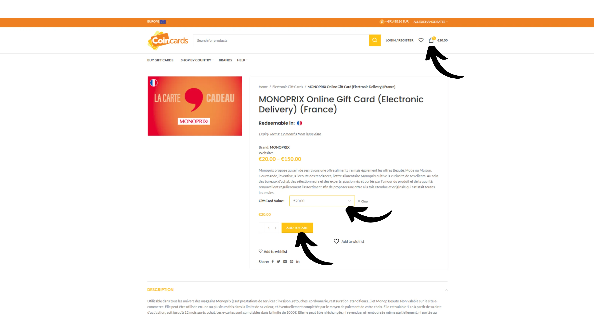

Nella pagina di riepilogo dell'ordine, fai clic su "PROCEED TO CHECKOUT"("PROCEDI ALL'ACQUISTO").

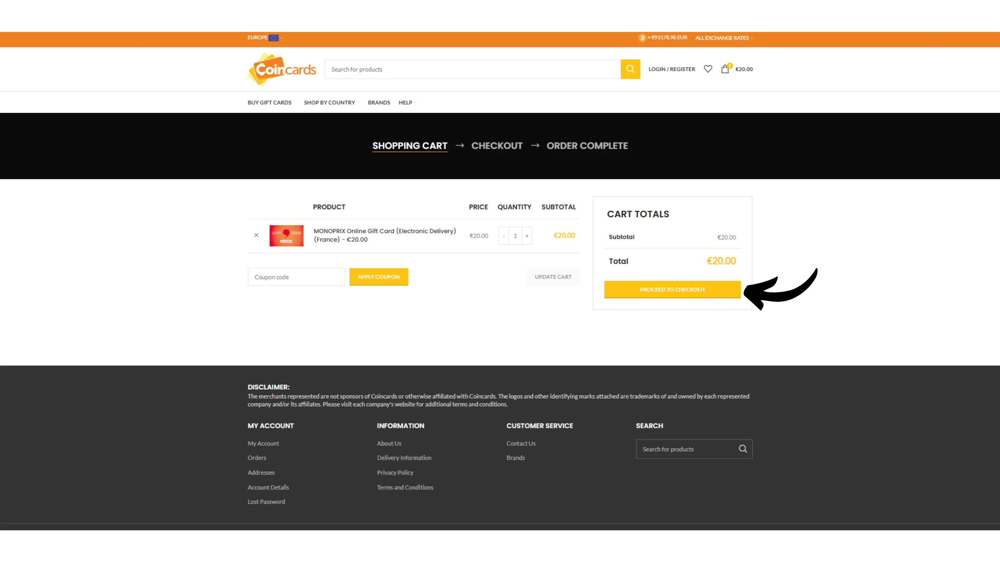

Nella pagina successiva, inserisci i tuoi dati di contatto (possono essere ovviamente pseudonimi), ma assicurati di fornire un indirizzo e-mail valido.

Scegli il tuo metodo di pagamento, per noi Bitcoin...

Infine, seleziona la casella “I have read and agree to the website terms and conditions”("Ho letto e accetto i termini e le condizioni del sito") ... quindi cliccate su “PROCEED TO BTCPAY”("PROCEDI A BTCPAY").

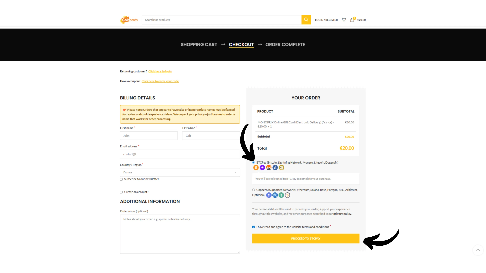

Scegli "Lightning" e scansiona il codice QR con il tuo Wallet preferito. Poi effettua il pagamento.

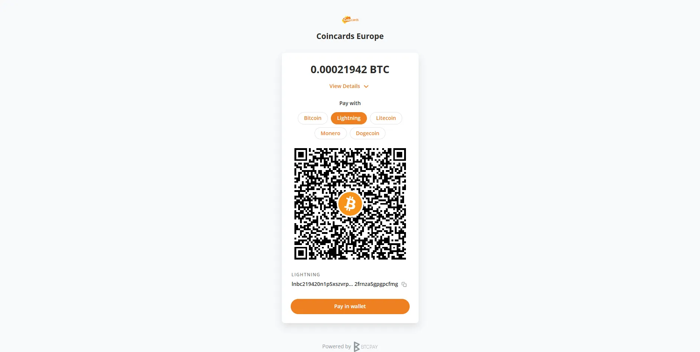

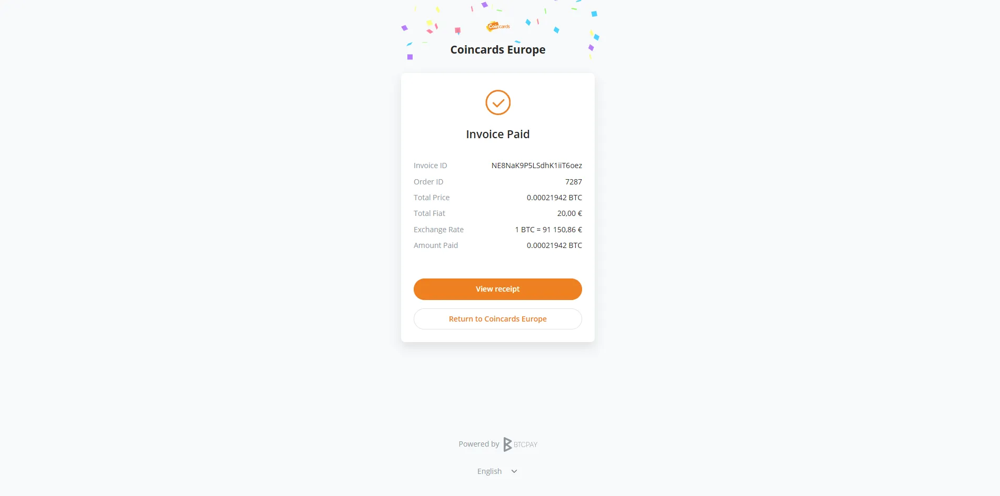

Una volta pagata la fattura, verrà visualizzata una pagina di riepilogo. Poi vai alla tua casella di posta per ricevere la gift card.

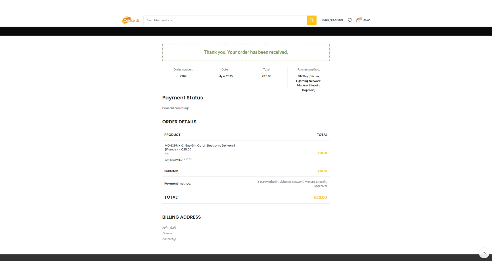

Abbiamo ricevuto la gift card tramite la casella di posta indicata al momento dell’acquisto. Clicca su “Claim Code”("Richiedi il codice").

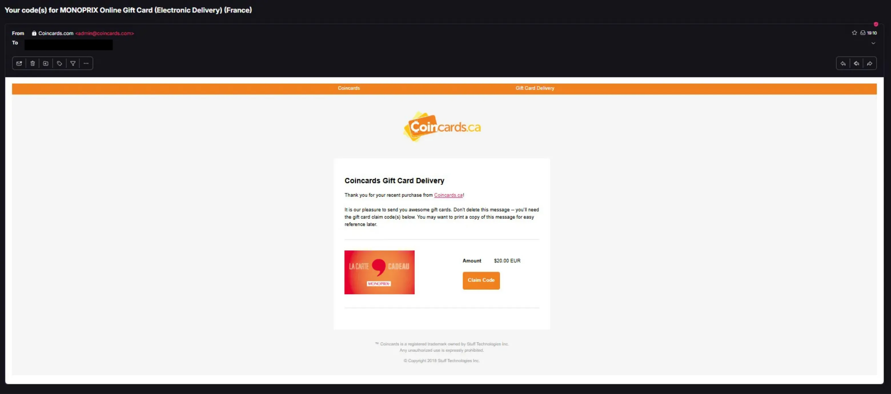

Si apre una pagina web che rivela i codici di sicurezza della tua carta e fornisce spiegazioni dettagliate, nella lingua locale del paese, su come usare e spendere la tua carta.

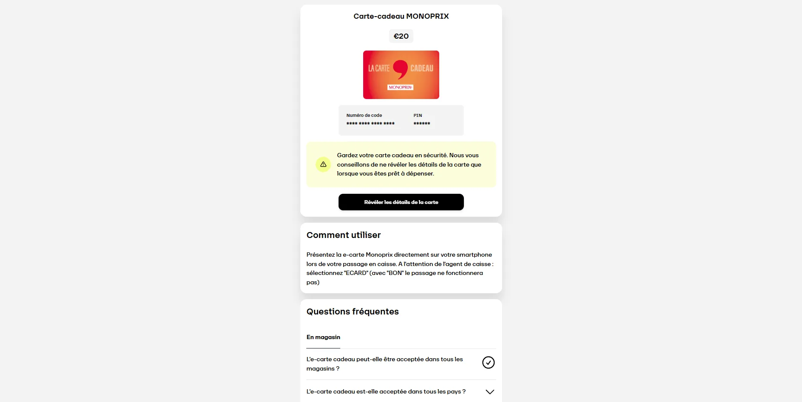

Acquistare una carta regalo con Coincards è davvero facile e non richiede la creazione di un account. Detto questo, diamo un'occhiata al processo di creazione dell'account e a ciò che ci offre.

## Come si crea un conto Coincards?

Per farlo, clicca su "Login/Registrazione" in alto nella pagina.

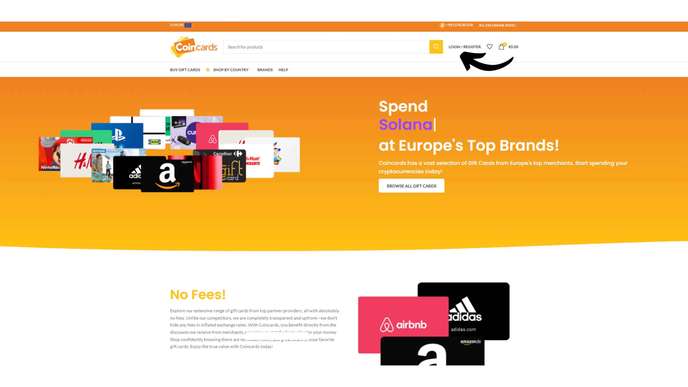

Quindi fai clic su "Register"("Registrazione").

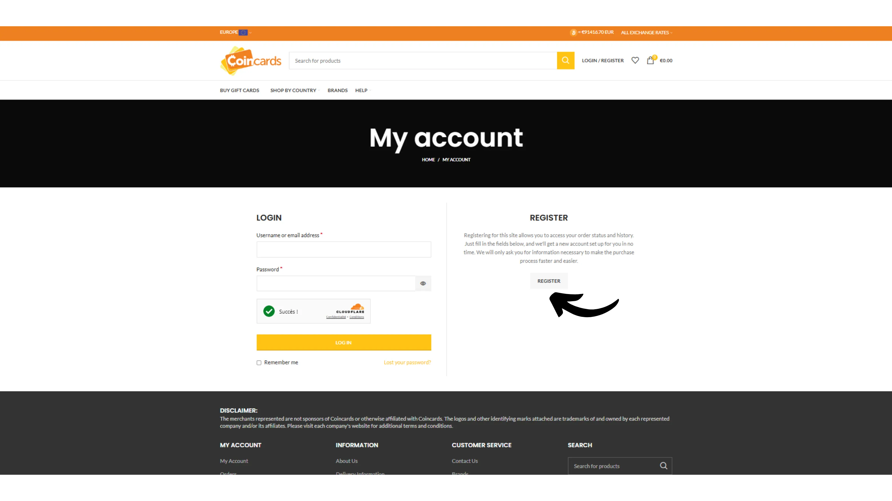

Inserisci i tuoi dati di contatto e clicca su “Register”("Registrati").

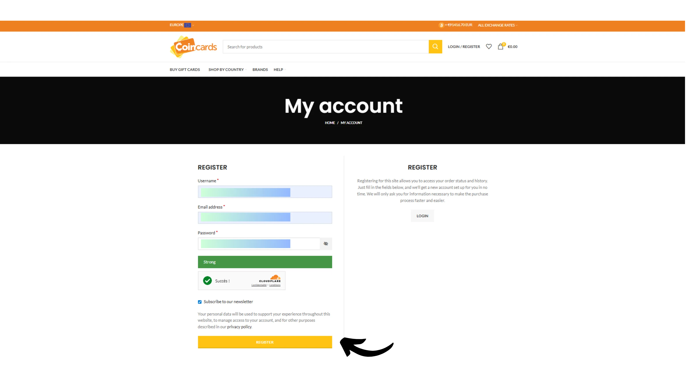

Otterrai così una dashboard che ti permette di monitorare tutte le tue transazioni sulla piattaforma in un unico posto.

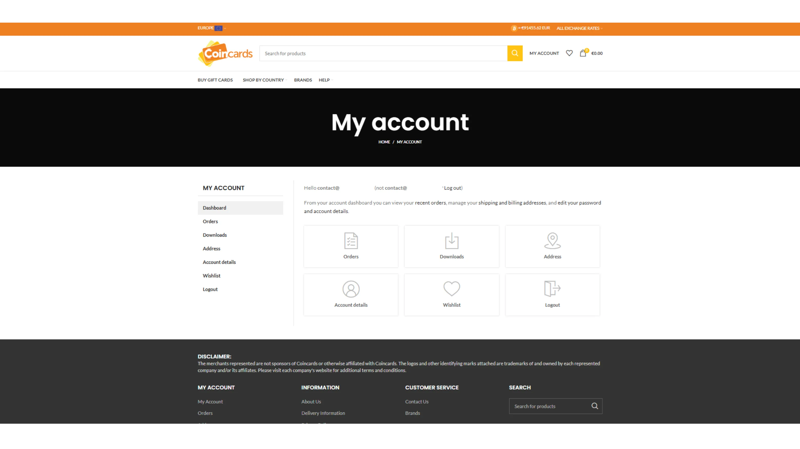

Ed ecco fatto: ora sai come spendere i tuoi bitcoin senza KYC presso i grandi rivenditori per le tue spese quotidiane. Non è un metodo particolarmente soddisfacente e resta un’operazione “fai-da-te”. Ma finché più persone non capiranno che conviene loro accettare denaro elettronico nelle loro attività, rimane comunque molto utile...

Se desideri contribuire a diffondere Bitcoin e incoraggiare un commerciante indipendente ad adottare questo metodo di pagamento, ti consiglio di dare un’occhiata al nostro tutorial completo su Swiss Bitcoin Pay. Si tratta di una soluzione tutto-in-uno per i processori di pagamento BTC, facile da installare e gestire quotidianamente:

https://planb.network/tutorials/business/point-of-sale/swiss-bitcoin-pay-2-a78b057e-ed11-47ac-860c-71019fcb451a
