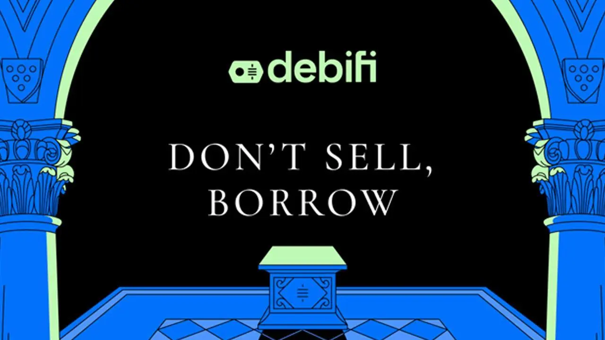

## Introduzione

In questo tutorial video passo-passo scoprirai come usare Debifi per sbloccare il valore dei tuoi BTC tramite un prestito garantito da Bitcoin. Imparerai a creare un account e a proteggerlo con la 2FA, a consultare le offerte e persino a usare una Coldcard Q in una configurazione multisig, così da assicurarti che i tuoi Bitcoin non possano essere rilendati.

Che tu stia finanziando un’opportunità commerciale, affrontando un’emergenza o semplicemente voglia ottenere liquidità a breve termine senza generare un evento tassabile, questa guida ti fornisce gli strumenti per farlo nel modo giusto.

**Nota:** Questo tutorial è solo una bozza in inglese, abbiamo ancora bisogno di qualcuno che scriva una guida completa su questo argomento. Se siete voi, contattateci su [Telegram](https://t.me/PlanBNetwork_ContentBuilder/325) o su [GitHub](https://github.com/PlanB-Network/Bitcoin-educational-content)
