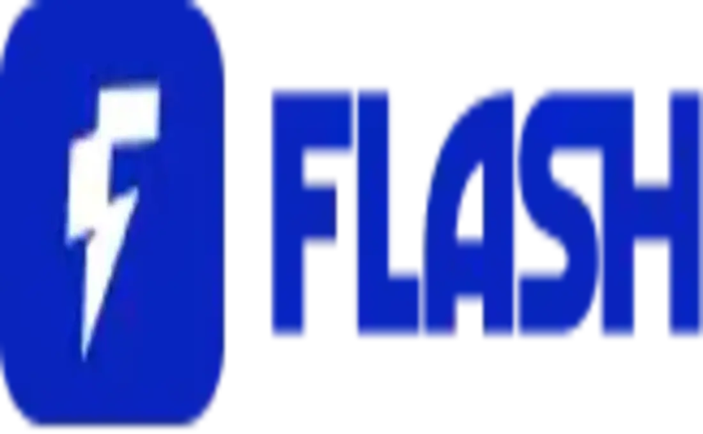

Rendere accessibile l'adozione del Bitcoin nei Paesi in via di sviluppo è diventato un settore in cui i giovani e i leader stanno innovando molto. Ciò è più evidente nel continente africano con l'emergere di comunità circolari, che vivono con risorse talvolta molto scarse e che vedono nel Bitcoin un mezzo per ripristinare la loro sovranità di fronte a un sistema finanziario ritenuto fallimentare.

In quest'ottica, una piattaforma si è posta l'obiettivo di consentire alla comunità della sua sottoregione di acquistare bitcoin a partire da 100 XOF, equivalenti a 15 centesimi di euro, infrangendo così i preconcetti che molti avevano sull'alto costo del Bitcoin.

In questo tutorial daremo un'occhiata a Flash, una soluzione beninese che consente di acquisire bitcoin a partire da soli 100 franchi CFA.

## Che cos'è Flash?

Flash è una piattaforma Exchange sviluppata da [BlockSolut](https://bitcoinflash.xyz) che opera in diversi Paesi dell'Africa occidentale. La missione principale di Flash è facilitare l'acquisizione, il Exchange e l'uso del Bitcoin nella vita quotidiana.

Flash si basa sulla Lightning Network, un livello sovrapposto a Bitcoin, per eseguire transazioni in bitcoin in modo sicuro e fluido, dimostrando alla sua comunità il potere di Bitcoin nella vita quotidiana.

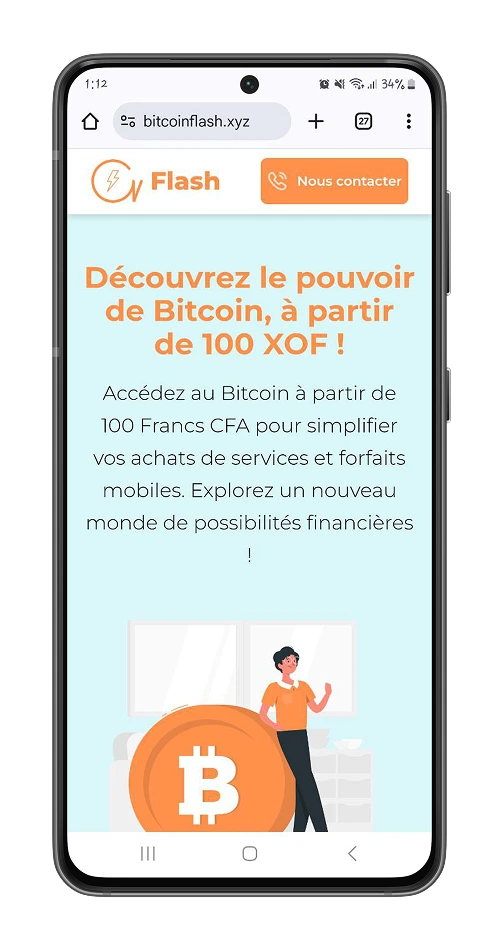

La piattaforma offre due servizi principali:

- **FlashX**: Scambia bitcoin con Mobile Money.
- **FlashPayment**: Utilizzate Bitcoin per i servizi di tutti i giorni.

Con questi due servizi, Flash punta a democratizzare l’uso di Bitcoin, a cambiare la percezione di chi vede Bitcoin solo come un rifugio sicuro e a dimostrare che Bitcoin è un mezzo di scambio compatibile con le realtà africane.

Bitcoin aiuta a ridurre le disuguaglianze economiche e geografiche, offrendo accesso aperto a un sistema finanziario globale, indipendentemente dall’origine o dalla posizione delle persone.

Partiamo all'avventura e scopriamo tutti i servizi offerti dalla piattaforma.

Flash è un'applicazione web a pagina singola (SPA) su cui si trovano tutti i servizi che offriamo.

### Flash X

Lo scambio di bitcoin su Flash è abbastanza intuitivo, poiché la piattaforma non richiede un account utente e punta alla semplicità dei suoi processi.

Flash effettua le sue transazioni utilizzando la moneta mobile locale. A seconda della vostra posizione in Africa occidentale, potete accedere a questo servizio con i seguenti operatori mobili:

- **Benin**: MTN Benin, Moov Benin, Celtiis.
- **Togo**: Moov Togo.
- **Burkina-Faso**: Orange.

L'acquisto di bitcoin su Flash prevede tre fasi.

Clicca sull’opzione "**Acheter**"(“**Acquista**”) nella sezione di scambio di bitcoin, quindi seleziona il tuo paese e la rete mobile da cui desideri effettuare l’acquisto.

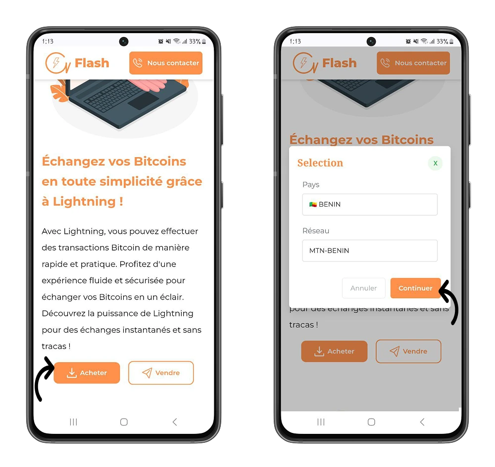

Inserisci i tuoi dati e l’importo della transazione che desideri effettuare.

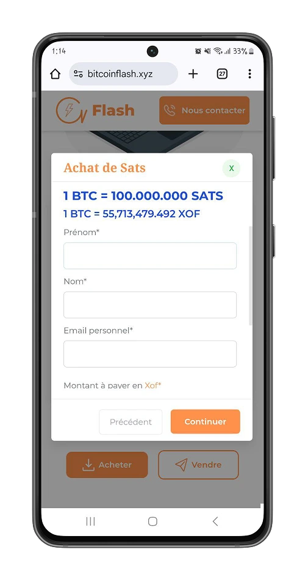

Procedi al pagamento e poi inserisci il tuo indirizzo Lightning per convalidare lo scambio. Nei minuti successivi riceverai automaticamente l’equivalente dei bitcoin corrispondenti alla tua transazione.

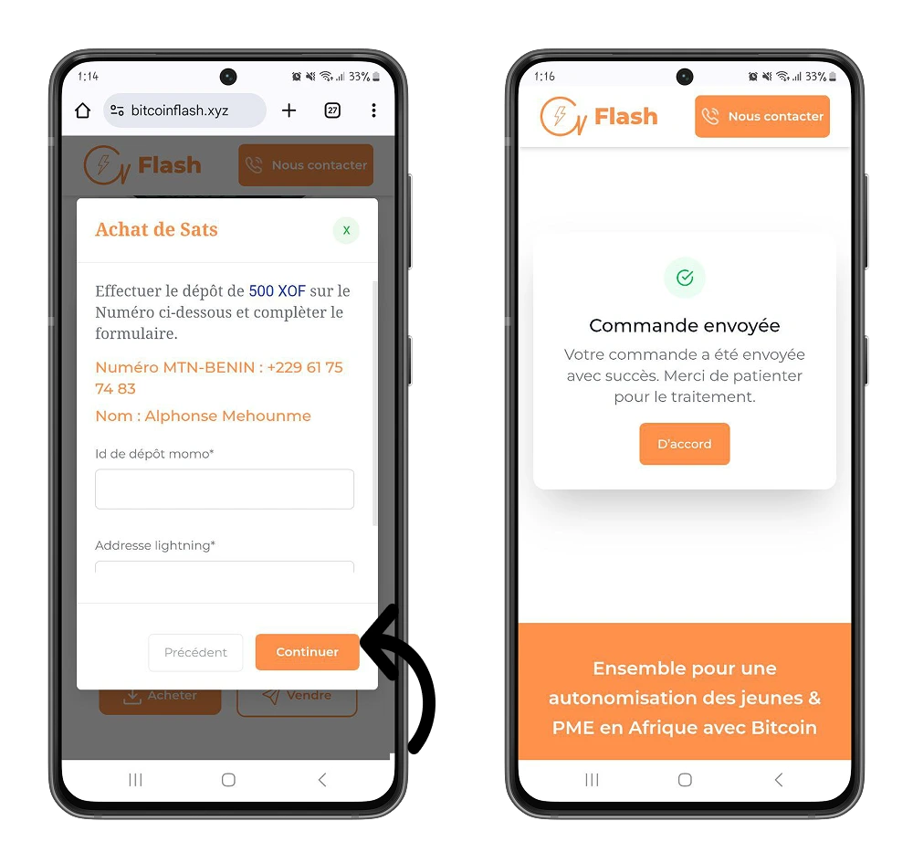

⚠️ **IMPORTANTE**: Flash funziona con indirizzi Lightning, assicurati di avere un portafoglio che supporti gli indirizzi Lightning.

https://planb.network/tutorials/wallet/mobile/wallet-of-satoshi-39149d86-e42b-4e8f-ae9f-7e061e7784f7

Per effettuare una transazione su Flash occorreranno in media dai 5 ai 10 minuti per ricevere i bitcoin sul proprio Lightning Wallet.

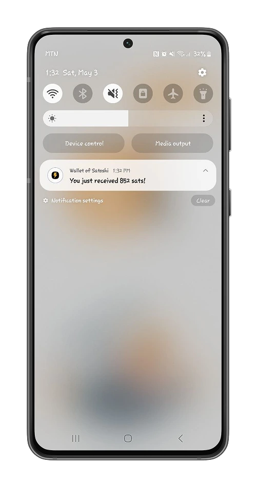

Vendere bitcoin su Flash è altrettanto intuitivo che acquistarli.

Nella sezione di scambio di bitcoin, clicca sul pulsante "**Vendre**"(“**Vendi**”), quindi seleziona il tuo paese e la rete mobile su cui desideri ricevere i franchi CFA equivalenti.

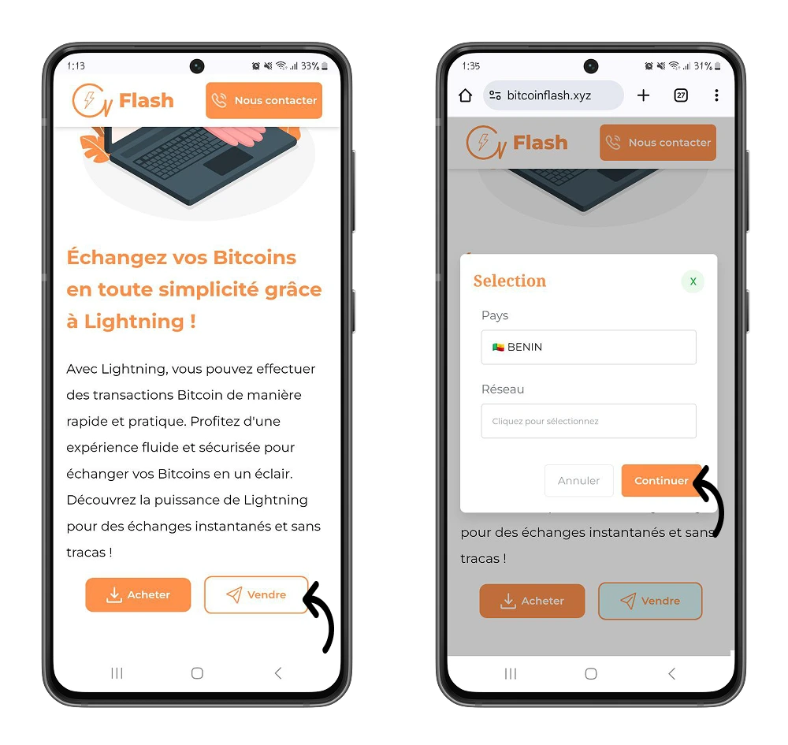

Inserisci i tuoi dati e effettua il pagamento della fattura per convalidare la tua richiesta.

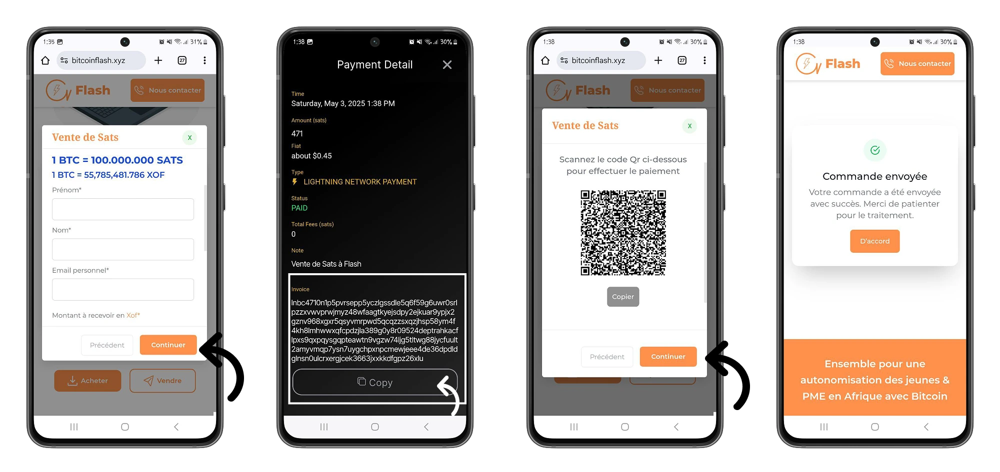

Dopo un massimo di dieci (10) minuti, si entra in possesso del denaro mobile.

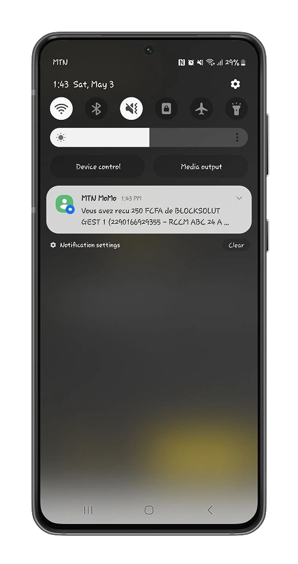

## FlashPayment

Oltre all’acquisto e alla vendita di bitcoin, Flash offre alla sua comunità un uso contestuale del bitcoin. Attraverso FlashPayment, puoi usare i tuoi bitcoin per acquistare sui network mobili disponibili:

- **Unità GSM**;
- **Pacchetti Internet**;
- **Pacchetti di chiamata**;
- **Una combinazione di chiamate e pacchetto Internet**.

Nella sezione di accesso al servizio giornaliero, seleziona l'opzione **Achat unité**(**Acquista unità**). Seleziona quindi il Paese, la rete mobile e il tipo di servizio digitale che desiderate pagare.

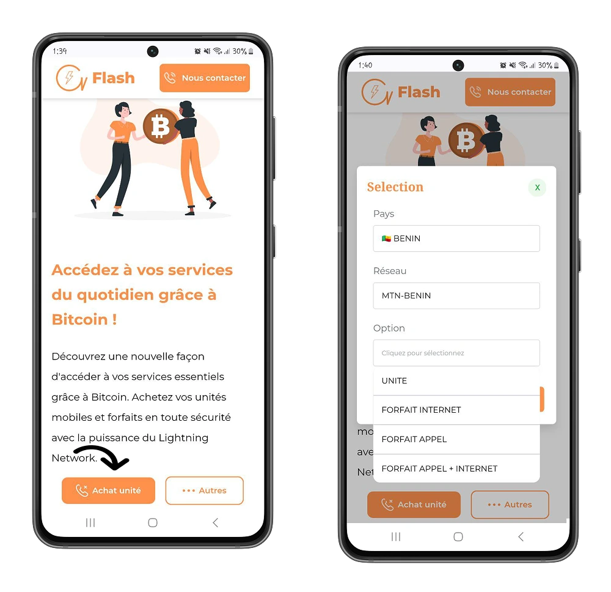

Inserisci le tue informazioni e poi procedi al pagamento della fattura generata.

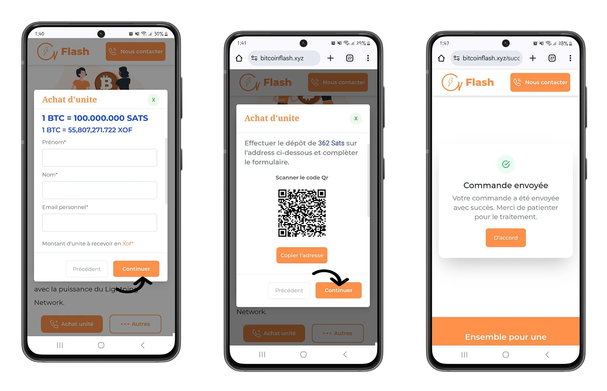

Oltre ai servizi digitali, Flash mette a tua disposizione un elenco di commercianti che accettano bitcoin e ti permette di pagare beni e servizi direttamente con bitcoin. In questo modo, puoi acquistare materiale informatico o andare a cena al ristorante con i tuoi cari, pagando tutti gli acquisti tramite il tuo portafoglio Lightning.

Nella sezione di accesso ai servizi quotidiani, seleziona l’opzione "**Autres**"(“**Altri**”) e scopri i commerci in cui potrai usare bitcoin come mezzo di scambio.

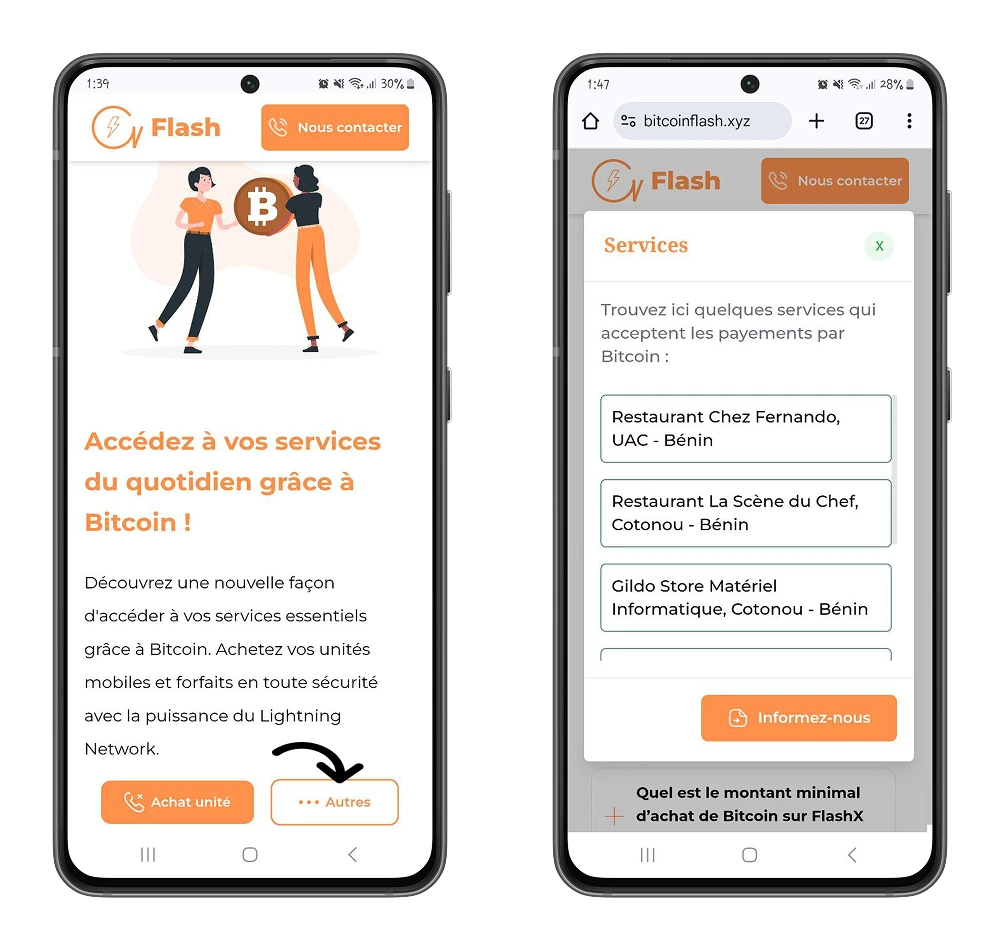

Se questo tutorial ti è stato utile per prendere confidenza con Flash, lascia un like: lo apprezzeremmo molto. Ti invitiamo anche a scoprire il nostro tutorial su Bitrefill, una piattaforma che ti dà accesso a una moltitudine di servizi digitali che accettano bitcoin come mezzo di pagamento.

https://planb.network/tutorials/exchange/centralized/bitrefill-8c588412-1bfc-465b-9bca-e647a647fbc1
