 

Rendre accessible l'adoption du Bitcoin dans les pays en développement est devenu un secteur dans lequel la jeunesse et les cadors innovent beaucoup. Cela se ressent beaucoup plus sur le continent africain avec l'émergence des communautés circulaires, vivant avec parfois très peu de ressources et qui voient en Bitcoin un moyen de reprendre leur souveraineté face à un système financier jugé défaillant.

Dans cette optique, une solution béninoise s’est donné pour mission de démocratiser l’achat et la vente de bitcoin (satoshis) au quotidien, à partir d'un montant dérisoire, 100 XOF (environ 0,15 €), brisant ainsi les préjugés que beaucoup se faisaient sur la cherté du bitcoin. Il s'agit de **Flash**.

## Qu'est-ce que Flash ?

Flash est une plateforme d'échange développée par **Flash MKS** opérant actuellement dans quelques pays d'Afrique de l'Ouest (Bénin, Togo, Côte d'Ivoire). Elle repose sur le réseau Lightning, une surcouche de Bitcoin, pour effectuer des transactions bitcoins de manière sécurisée et fluide. 

Flash, c'est : 
- avant tout un **pont** qui rapproche Bitcoin des utilisateurs locaux; 
- la **simplicité** (achetez du bitcoin selon votre budget directement avec Mobile Money);
- **des transactions rapides**;
- et **de super taux de change** (taux de change compétitifs, transparents et alignés sur le marché).

## Premier pas avec Flash

Pour profiter des services de Flash, vous devez créer un compte.

### Création du compte

Rendez-vous sur le site de [**Flash**](https://bitcoinflash.xyz). 
**Flash** est une application web en une page (SPA) donc ne nécessite pas de téléchargement. 
Entrez votre **Nom et prénom, une adresse mail, un numéro de téléphone** et un **Mot de passe**. Puis confirmez à nouveau le mot de passe et cliquez sur le bouton **Créer mon compte**.

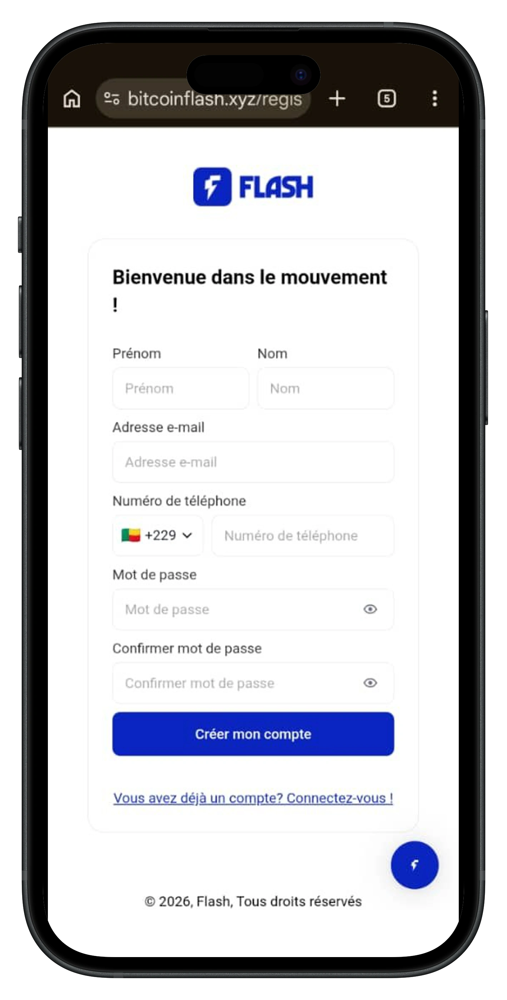 

Entrez le code OTP reçu par mail ou via WhatsApp pour finaliser votre inscription.

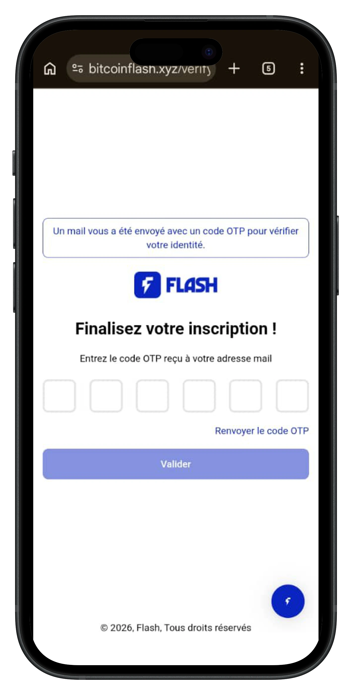 

Votre compte est créé, profitez de Flash sans modération!

## Tour rapide des interfaces de Flash

Sur Flash, vous disposez de trois grandes interfaces. Vous avez l'interface:

- **Accueil** : espace dédié à l'achat et à la vente de bitcoins;

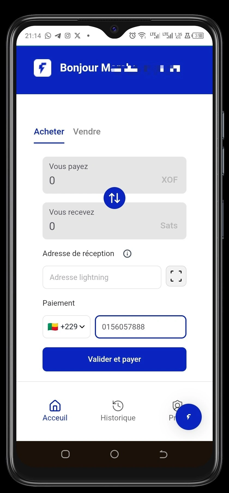 

- **Historique**: permet de voir le nombre de sats achetés ou le montant total de fiat reçus au titre de vos ventes, de suivre l'historique de vos transactions… ;

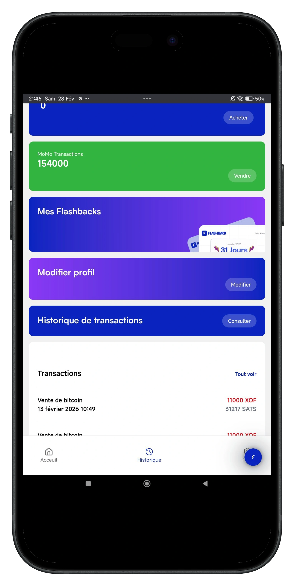 

- **Profil**: section où vous pouvez effectuer votre KYC. Plus vous passez de niveau en terme de vérification, plus votre plafond mensuel en termes de volumes de transactions est élargi.

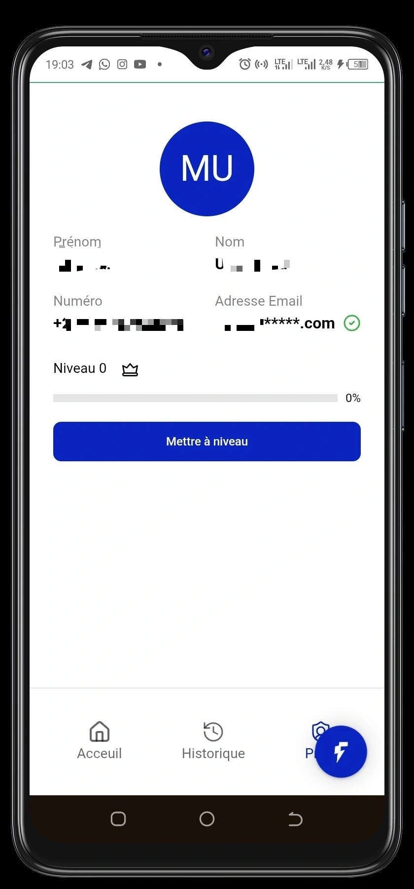 

## Achat et Dépense de bitcoins sur Flash

Flash effectue ses opérations en utilisant les moyens de paiement Mobile Money. Selon votre localisation en Afrique de l'Ouest, vous pouvez donc accéder à ce service avec les opérateurs mobiles ci-dessous :

- **Bénin** : MTN Bénin, Moov Bénin, Celtiis.
- **Togo** : Moov Togo; Togocel
- **Côte d'Ivoire** : MTN CI

⚠️ **IMPORTANT** 

- Flash fonctionne avec tous les services et portefeuilles compatibles avec Lightning.

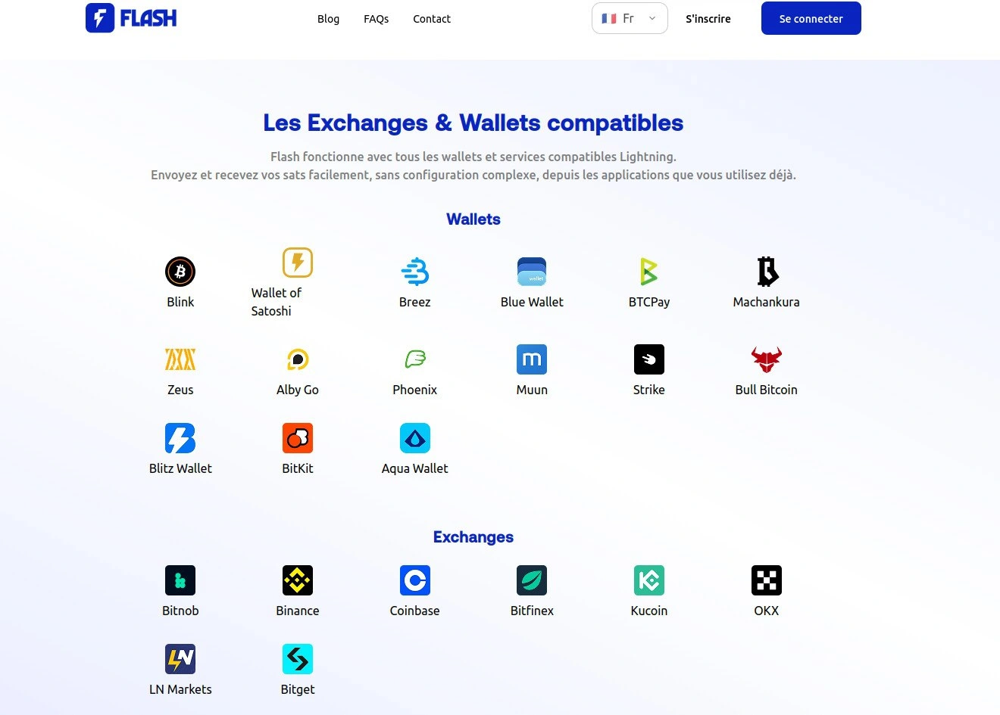

Assurez-vous donc, de posséder un portefeuille comme Blink, Wallet of Satoshi, etc.

https://planb.academy/tutorials/wallet/mobile/wallet-of-satoshi-self-custodial-66e3193b-a821-4713-a380-8d8d607d7f2c

- Pour toutes vos transactions, Flash remplit automatiquement le champ du numéro de téléphone avec celui enregistré lors de la création du compte. Modifiez-le si vous souhaitez utiliser un autre compte Mobile Money pour payer vos bitcoins ou recevoir vos fonds.

### Acheter des bitcoins

Assurez-vous d'être dans la section **Acheter**.

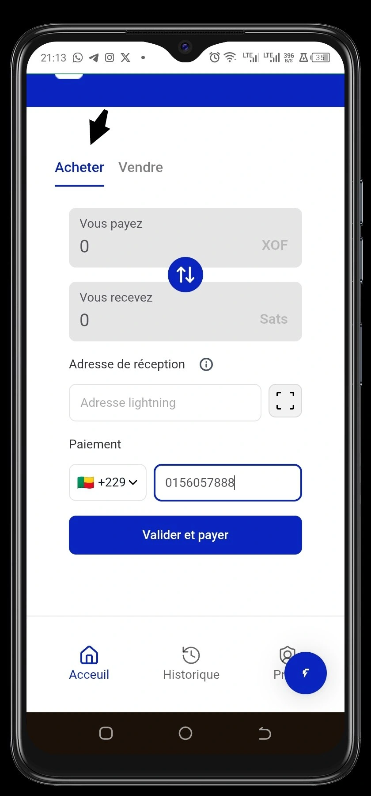 

Indiquez le montant de l’achat ou le nombre de satoshis que vous désirez payer. Flash calcule automatiquement la contrepartie correspondante, en satoshis ou en monnaie locale, selon ce que vous aurez renseigné.

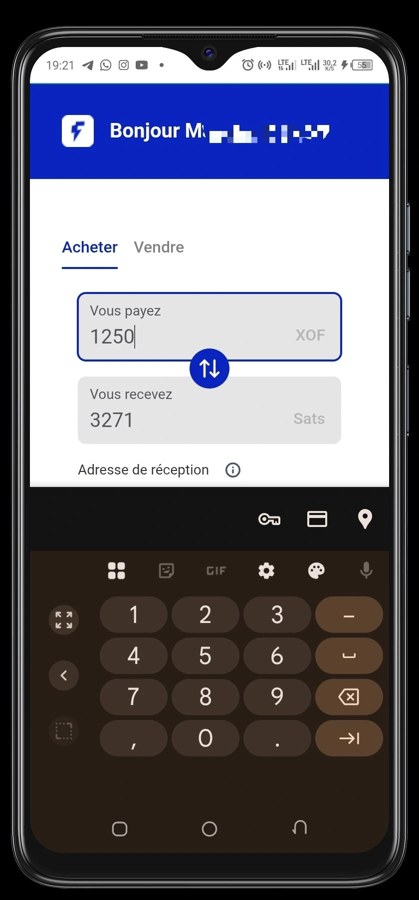 

Ensuite, renseignez l'adresse Lightning de réception (1) et le numéro de téléphone (2) relié au compte mobile money qui sera débité. 

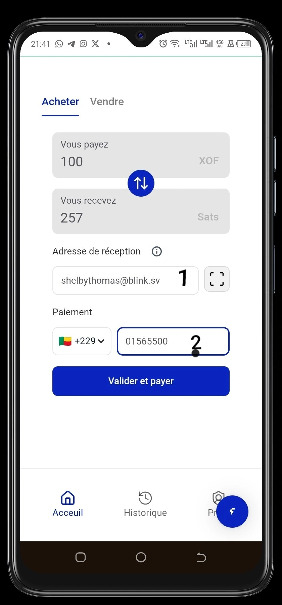 

Vous avez aussi la possibilité de scanner directement le code QR de votre adresse depuis votre portefeuille Lightning.

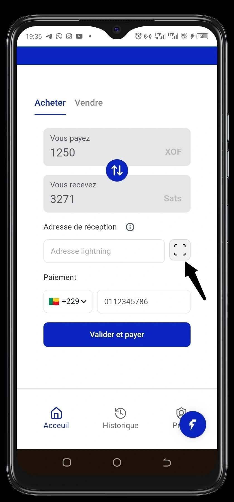 

**Autre possibilité** : Utiliser Flash pour envoyer du Bitcoin à un tiers. Il vous suffit d'indiquer l'adresse Lightning du tiers au moment de l'achat, et celui-ci recevra directement les fonds sur son portefeuille. 

Enfin, cliquez sur le bouton **Valider et payer**, puis saisissez le code PIN de votre compte mobile money pour confirmer votre achat. 

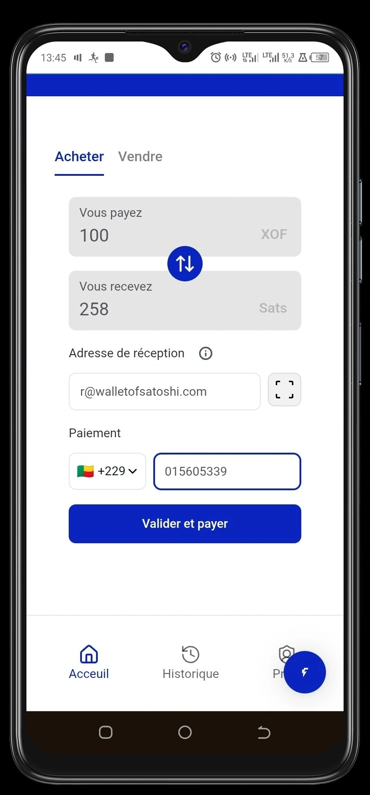 

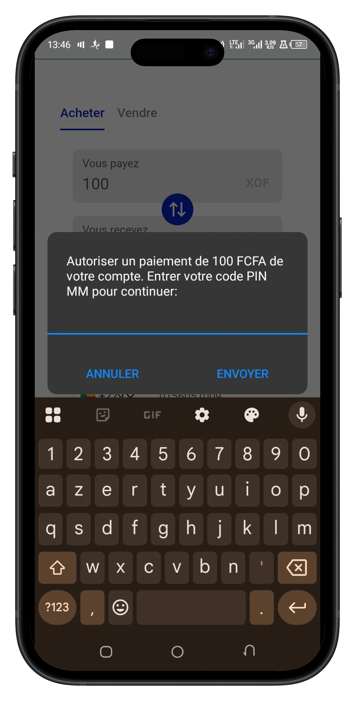 

Vous recevez instantanément vos satoshis dans votre portefeuille en plus d'un message Whatsapp contenant les détails de votre transaction. 

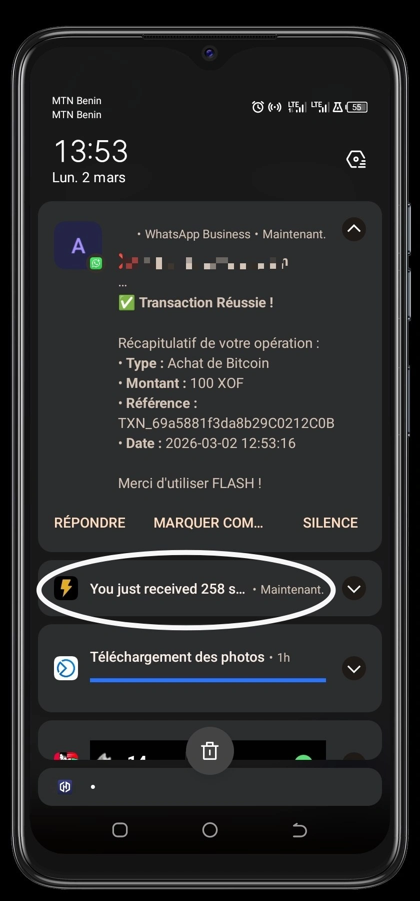 

Dépenser des bitcoins sur Flash est aussi intuitif qu'en acheter.

### Dépenser des bitcoins

Dépenser ses bitcoins (satoshis) sur Flash revient soit à **vendre ses bitcoins** pour recevoir la contrepartie en monnaie locale dans son compte Mobile money, soit à **payer ses achats**.

#### Vendre ses bitcoins

Cliquez sur le bouton **Vendre** pour basculer dans la section de vente.

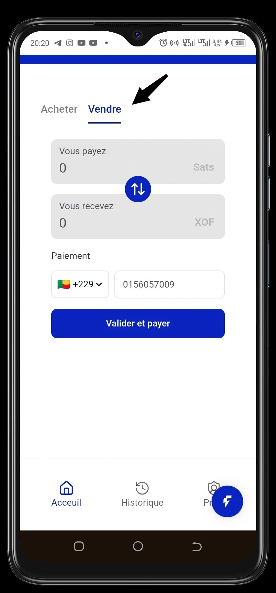 

Indiquez le montant à recevoir ou le nombre de sats à vendre, puis saisissez le numéro Mobile Money sur lequel vous souhaitez percevoir les fonds.  Confirmez ensuite en appuyant sur **Valider et payer**.

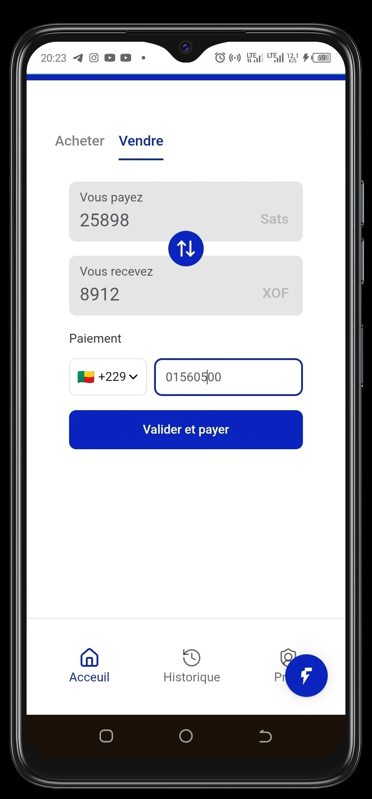 

Scannez à partir de n'importe quel portefeuille lightning, le code QR qui apparaît. Vous pouvez copier-coller l'invoice dans votre portefeuille ou encore tapez sur **Open a wallet**.

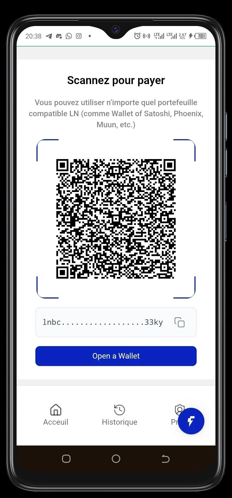 

En effet, l'option **Open a wallet** permet à Flash de détecter les portefeuilles compatibles installés sur votre téléphone et d’y générer automatiquement la facture correspondant au montant défini, dès que vous sélectionnez l’un d’eux pour effectuer la transaction. 

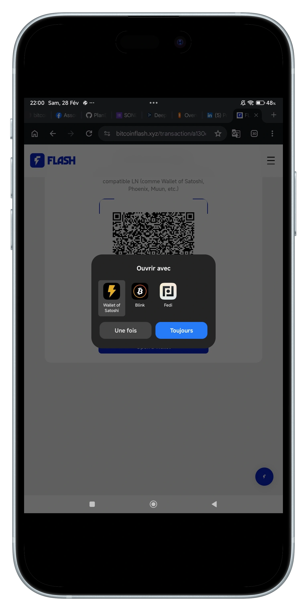 

Dès que vous payez l'invoice, les fonds sont crédités sur votre compte Mobile Money dans les minutes qui suivent.

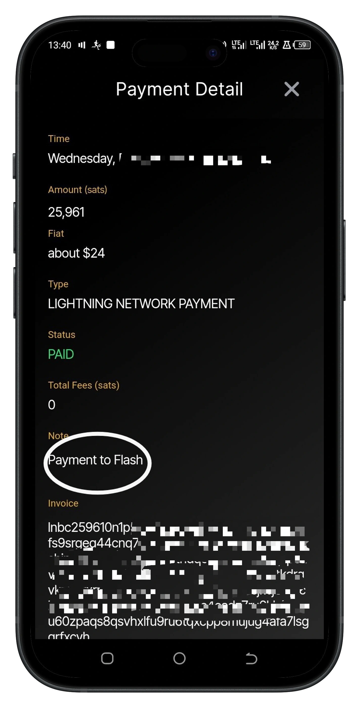 

#### Payer ses achats

Avec Flash, vous pouvez payer vos achats partout où les moyens de paiement Mobile money sont acceptés. 
Il suffit que vous bitcoiner, dépensiez vos bitcoins sur Flash, c'est-à-dire que vous vendiez à hauteur du prix de vos achats en mettant le numéro Mobile money de votre marchand. Ce dernier recevra la contrepartie qui est le montant de vos achats en monnaie locale. 

## Autres fonctionnalités

Comme fonctionnalités additionnelles, vous avez **Mes Flashbacks**, **Modifier profil** et **Blog**. 

- **Mes Flashbacks**

Cette option se retrouve sur l'interface **Historique** et vous permet de suivre vos statistiques mensuelles en termes de transactions (achats et ventes). Vous pouvez donc les télécharger!

 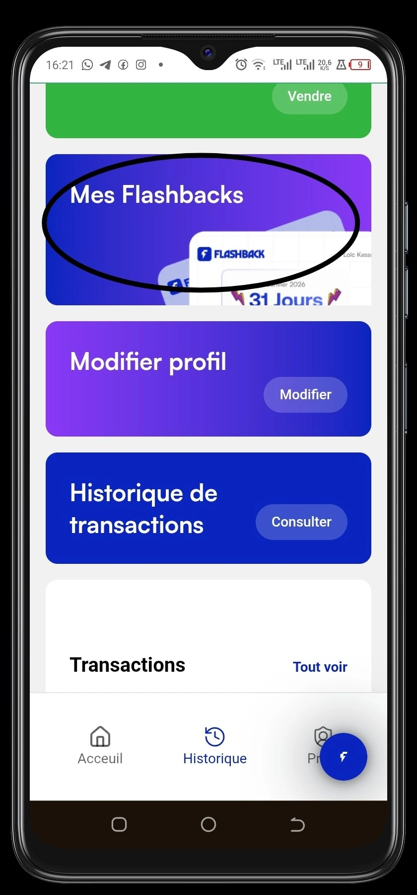 

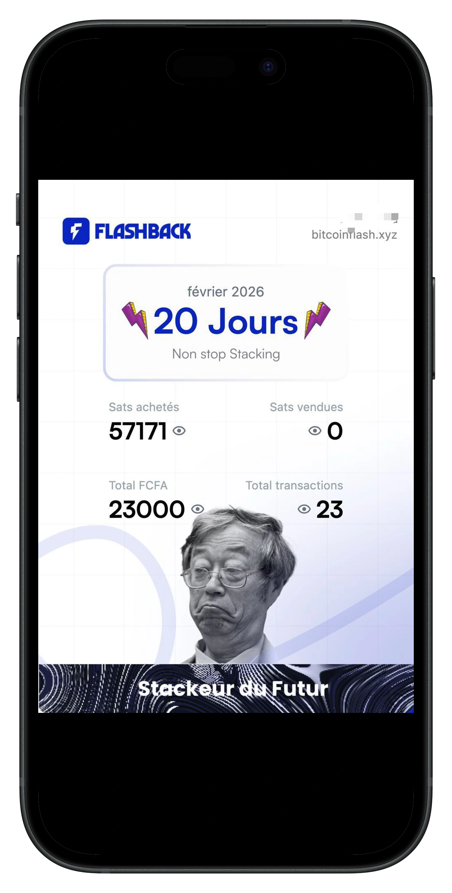 

- **Modifier profil**

Cette fonctionnalité qui se trouve aussi sur l'interface **Historique** a une certaine particularité. Au-delà du fait qu'il vous permet de changer de nom et prénom, elle vous permet de relier une adresse Lightning favorite à votre compte utilisateur sur Flash. 

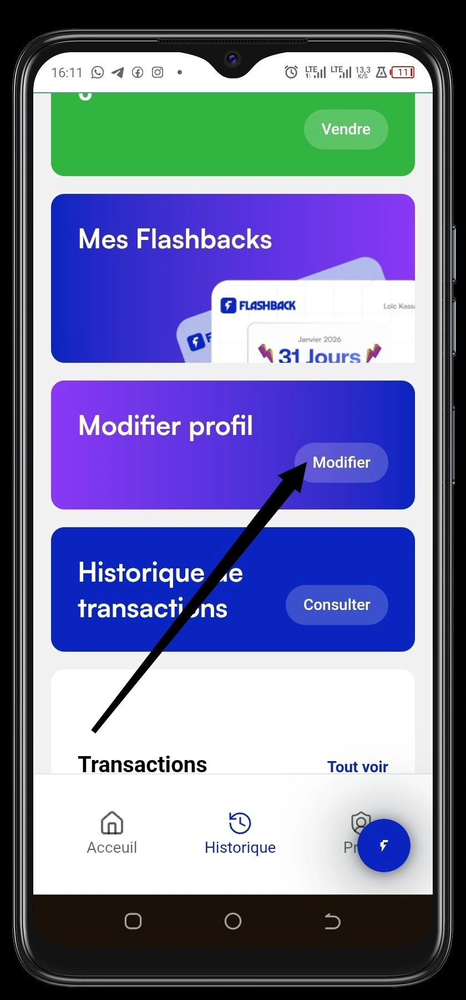 

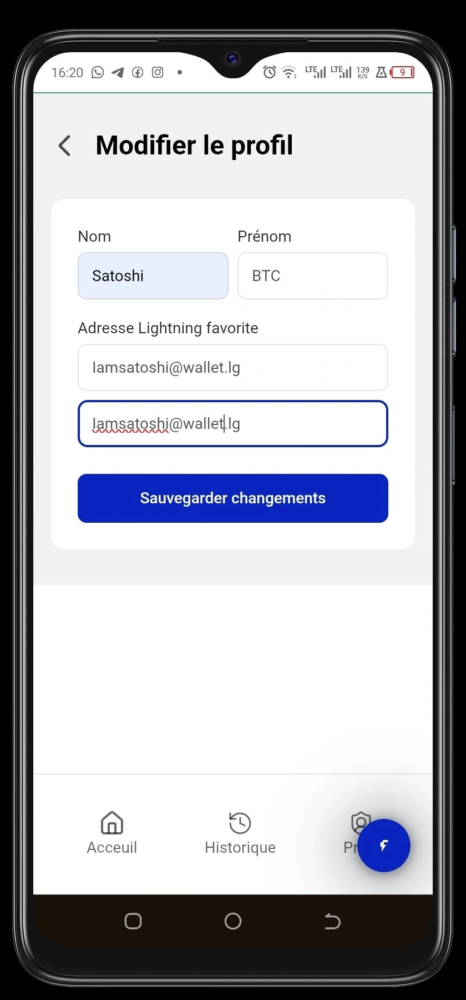 

- **Blog**

 Le blog de Flash s’inscrit dans une mission éducative. C’est un espace de partage de connaissances, où vous accédez à des contenus pédagogiques, des guides pratiques, des actualités, etc. Pour accéder aux contenus, appuyez sur l’**icône menu (sandwich)** située dans le coin supérieur droit de l’écran, puis sélectionnez **Blog**.

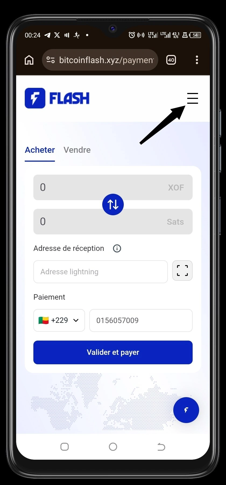

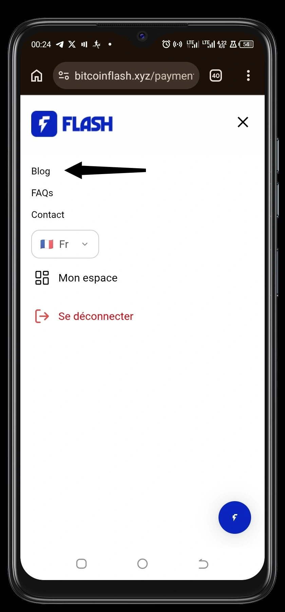

Notez que les transactions on-chain ne sont pas encore disponibles sur Flash. L’équipe travaille toutefois à leur intégration prochaine, ainsi qu’au déploiement d’autres services à venir.

L'équipe de Flash se met à votre disposition pour vous éclairer et vous aider dans les problèmes que vous rencontrerez. 
Exprimez directement vos préoccupations en cliquant sur le **petit icône de Flash** situé dans le coin inférieur droit.

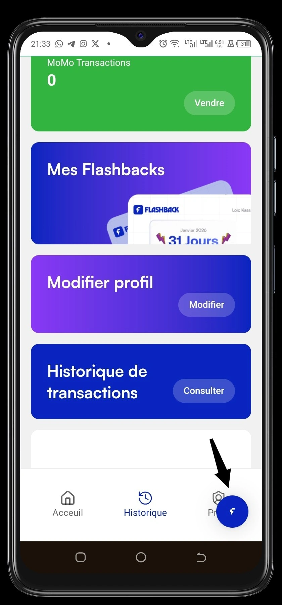 

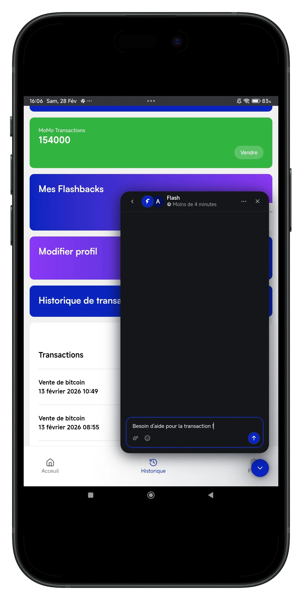 

Vous pouvez également contacter le support client via e-mail au support@bitcoinflash.xyz ou discuter directement avec l'équipe sur [WhatsApp](https://wa.me/2290158878708).

Par ailleurs, pour rester informé des nouvelles fonctionnalités, des mises à jour produit, n’hésitez pas à suivre Flash sur ses réseaux officiels :

- [Chaîne Whatsapp](https://blog.bitcoinflash.xyz/r/03f08ddd?m=13f79c55-ae77-4219-a564-9492d052a806)
- [X (twitter)](https://blog.bitcoinflash.xyz/r/30da4c96?m=13f79c55-ae77-4219-a564-9492d052a806)
- [Facebook](https://blog.bitcoinflash.xyz/r/6ec3439a?m=13f79c55-ae77-4219-a564-9492d052a806)
- [Telegram](https://blog.bitcoinflash.xyz/r/ba28adc7?m=13f79c55-ae77-4219-a564-9492d052a806)
- [LinkedIn](https://blog.bitcoinflash.xyz/r/8dc49f0f?m=13f79c55-ae77-4219-a564-9492d052a806)

Si ce tutoriel vous a été utile pour la prise en main de Flash, veuillez nous laisser un pouce vert. 
N'hésitez pas à partager cet article sur vos réseaux sociaux. Merci beaucoup !

