Hodl Hodl ist eine dezentralisierte Bitcoin-Börse, die Benutzerkontrolle und Sicherheit priorisiert. Im Gegensatz zu traditionellen Börsen arbeitet sie nach einem Peer-to-Peer-Modell und ermöglicht direkte Trades zwischen Benutzern. Mit ihrem Multi-Signatur-Eskrow-System gewährleistet Hodl Hodl die Sicherheit von Geldern während Transaktionen. Die Plattform unterstützt auch verschiedene Zahlungsmethoden und bietet Handelsoptionen wie Differenzkontrakte (CFDs) an.

https://hodlhodl.com/pages/faq_help

## Schreibanleitung:

Ihre Reise mit HodlHodl beginnen: Eine Schritt-für-Schritt-Anleitung

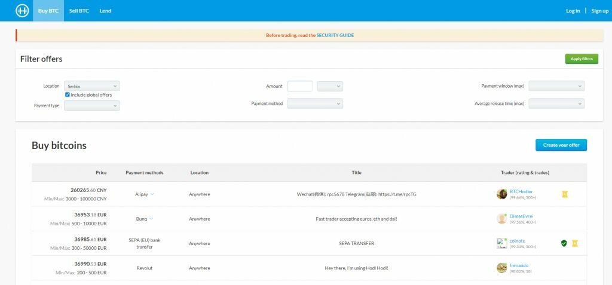

HodlHodl ist eine Peer-to-Peer (P2P) Kryptowährungsbörse, die ausschließlich eine digitale Währung unterstützt, aber die Flexibilität bietet, in jeder Währung zu handeln, einschließlich aller Fiat-Währungen und Altcoins. Ein wesentlicher Aspekt dieser P2P-Plattform ist, dass sie keine Ein- oder Auszahlungsgebühren erhebt, sondern Handelsgebühren von 0,5% bis 0,6% je nach Benutzerverifizierungsstatus erhebt.
Benutzer haben den Vorteil einer breiten Palette von Zahlungsmethoden, was HodlHodl zu einer der vielseitigsten P2P-Plattformen macht. Einige der häufig verwendeten Zahlungsmethoden sind SWIFT, SEPA, Banküberweisungen, Kreditkartentransaktionen, PayPal, Venmo, MoneyGram und Western Union. Die verfügbaren Zahlungsoptionen hängen jedoch von der Akzeptanz des Verkäufers ab.

Eine der herausragenden Funktionen von HodlHodl sind die variablen Handelslimits, die mit zunehmendem Handelsvolumen und erfolgreichen Trades progressiv gelockert werden können. Der minimale BTC-Handelsbetrag beträgt 0,001 BTC, und das niedrigste Kreditangebot sollte nicht weniger als 50 USD im Kryptowert betragen. Die Plattform erfordert keine Know Your Customer (KYC) oder Anti-Geldwäsche (AML)-Verfahren, um die Anonymität der Benutzer zu wahren. Benutzer, die sich für eine Verifizierung entscheiden, können jedoch von Vorteilen wie reduzierten Provisionen, erhöhten Transaktionslimits und einem sichtbaren "Verifiziert"-Status profitieren. HodlHodl hat eine umfangreiche globale Reichweite und bietet Benutzern aus fast allen Ländern Platz, mit Ausnahme einiger Länder wie Nordkorea, Irak, Syrien und Sudan.

### Kontoerstellung

Um ein eigenes Konto zu erstellen, klicken Sie einfach auf "Registrieren", das sich in der rechten Ecke auf der Startseite der Plattform befindet. Wie erwartet müssen Sie eine E-Mail-Adresse eingeben, einen Benutzernamen wählen und ein Zahlungspasswort festlegen. Darüber hinaus werden Sie aufgefordert, Ihre lokale Zeitzone festzulegen, da dies dazu beiträgt, Ihre Betriebsstunden zu optimieren und den Transaktionsprozess zu erleichtern.

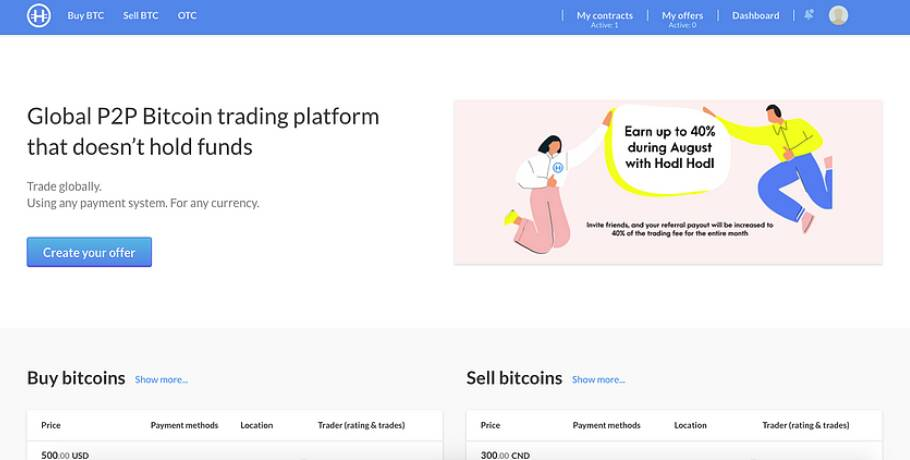

### Passen Sie Ihr Profil an

Nach erfolgreicher Kontoerstellung sollten Sie Ihr Profil mit einigen notwendigen Details ausstatten.

Die Anpassung Ihres Profils sollte Folgendes umfassen:

- Persönliche Informationen - Hierzu gehören Ihr gewählter Benutzername, E-Mail-Adresse und eine kurze Biografie.
- Zwei-Faktor-Authentifizierung (2FA) - Die Aktivierung von 2FA erhöht die Sicherheit Ihres Profils, was immer eine kluge Entscheidung ist.
- API-Zugriff - Dies ist nicht obligatorisch und bleibt standardmäßig inaktiv.
- Vergangene P2P-Profile - Wenn Sie zuvor mit anderen P2P-Plattformen interagiert haben, kann das Verknüpfen dieser Informationen Ihre Glaubwürdigkeit bei anderen Händlern erhöhen.

### Registrieren Sie Ihre BTC-Adresse

Um mit dem BTC-Handel zu beginnen, müssen Sie zuerst Ihre BTC-Adresse angeben. Dies kann im Menü "Handelseinstellungen" eingegeben werden. Nachdem Sie Ihre Adresse eingegeben haben, können Sie mit dem "BTC kaufen" oder "BTC verkaufen" Ihre Handelsreise beginnen.

## Schritt für Schritt zu Ihrem ersten Handel

Anleitung von Bitcoiner Q&A https://bitcoiner.guide/hodlhodl/

1. Besuchen Sie hodlhodl.com und erstellen Sie Ihr Konto. Die einzigen Details, die Sie angeben müssen, sind ein Benutzername und eine E-Mail-Adresse. Sie gelangen dann zur Startseite.

2. Klicken Sie auf "BTC kaufen" in der Website-Navigation.

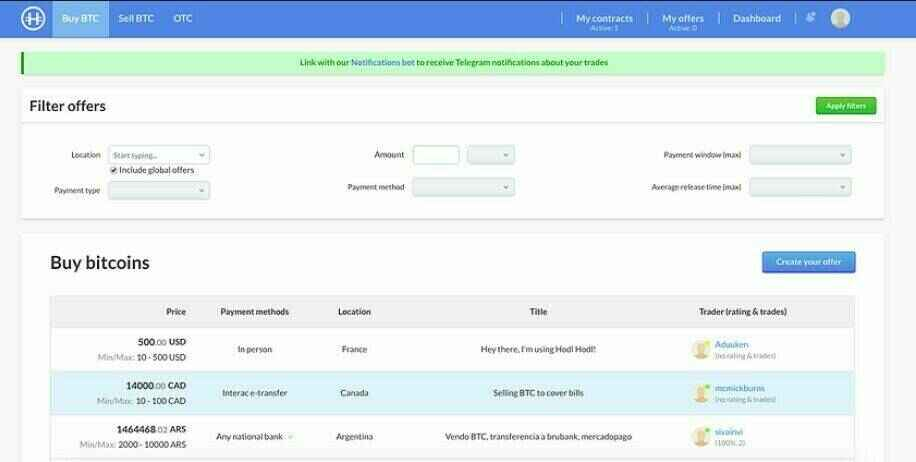

3. Wählen Sie Ihren gewünschten Zahlungstyp und -methode aus. Hier können Sie auch einen bestimmten Betrag angeben, falls erforderlich.

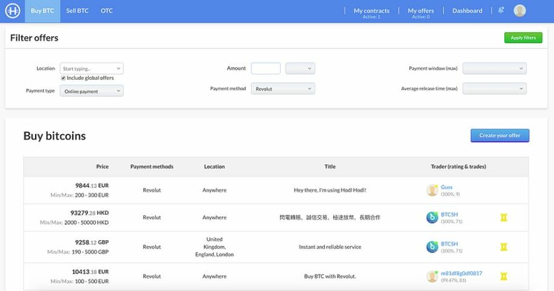

4. Wählen Sie Ihr gewünschtes Angebot aus. Sie können dann die Handelsdetails überprüfen und auch die Aktivitätsberichte und Bewertungen der Teilnehmer lesen.

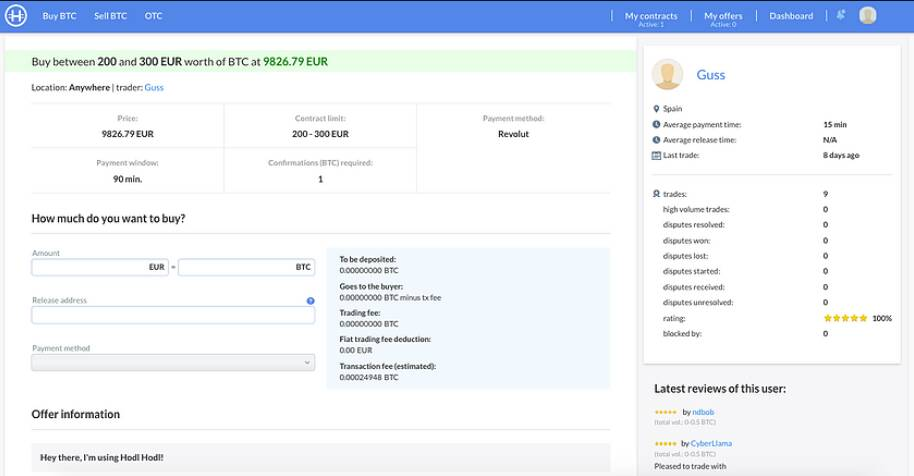

5. Sobald Sie zufrieden sind, können Sie angeben, wie viel Sie kaufen möchten, die Adresse eingeben, an die Sie die Bitcoin senden möchten, und die vom Verkäufer beworbene Zahlungsmethode bestätigen. Klicken Sie auf "Angebot annehmen und Vertrag erstellen".

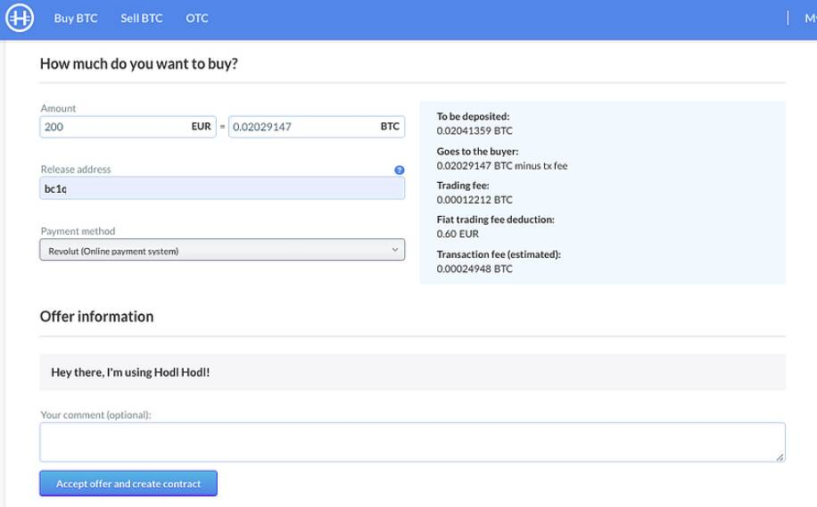

6. Sie haben jetzt Ihren Vertrag erstellt und müssen auf "Escrow generieren" klicken, wo Sie aufgefordert werden, ein Zahlungspasswort zu erstellen. Das Zahlungspasswort ist ein Verschlüsselungsschlüssel für das Escrow-Schlüsselpaar des Benutzers. Es wird verwendet, um Bitcoin in Escrow einzuzahlen oder freizugeben.

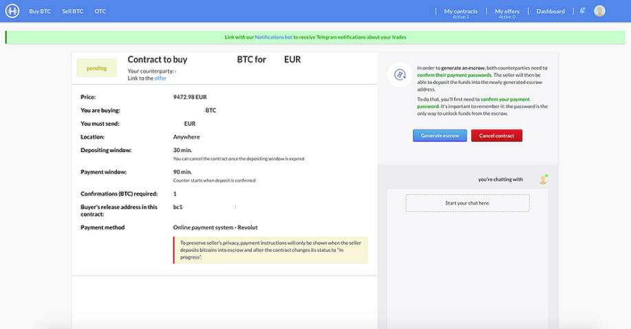

7. Jetzt müssen Sie darauf warten, dass der Verkäufer seine Bitcoin in die Escrow-Wallet einzahlt. Nachdem Sie den Vertrag gestartet haben, können Sie über das Chat-Fenster auf der rechten Seite der Seite mit dem Verkäufer chatten.

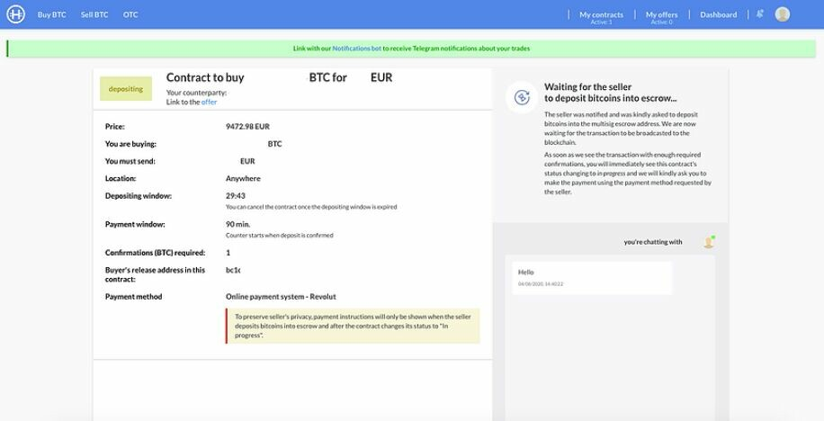

8. Sobald der Verkäufer seine Mittel in die Escrow eingezahlt hat, sehen Sie diesen Bildschirm, der Sie darauf hinweist, Ihr Geld nicht zu senden, bis eine ausreichende Anzahl von Blockchain-Bestätigungen vorliegt (dies variiert je nach Handelsbedingungen). Sie können den Fortschritt der Einzahlungstransaktion des Verkäufers über den blauen Link "Einzahlungstransaktions-ID" überprüfen.

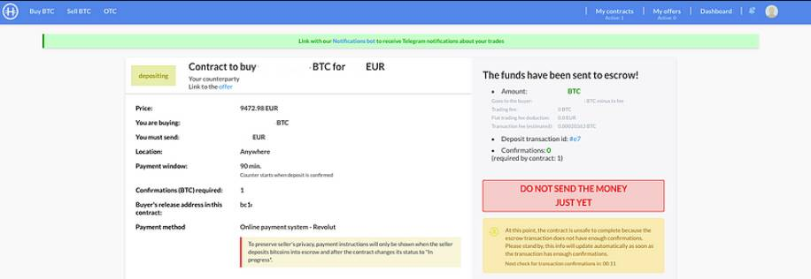

9. Sobald bestätigt, werden Sie benachrichtigt und können dann die Gelder an den Verkäufer senden, gemäß den von ihm bereitgestellten Informationen. Sobald Sie dies getan haben, klicken Sie auf "Ich habe die Zahlung gesendet".

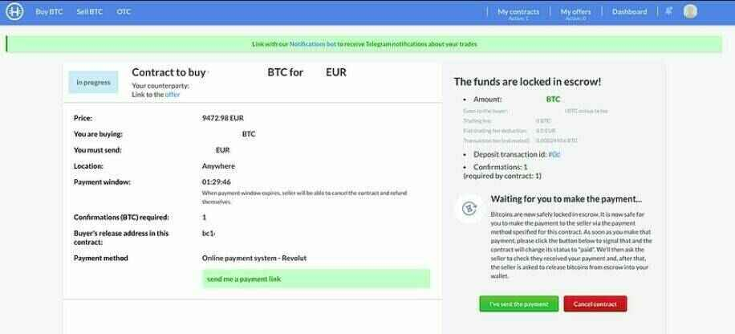

10. Sie müssen dann darauf warten, dass der Verkäufer bestätigt, dass er die Gelder erhalten hat. Zu diesem Zeitpunkt wird die Bitcoin an die Adresse freigegeben, die Sie zu Beginn des Vertrags angegeben haben. Sie haben auch die Möglichkeit, Ihren Teilnehmer zu bewerten.

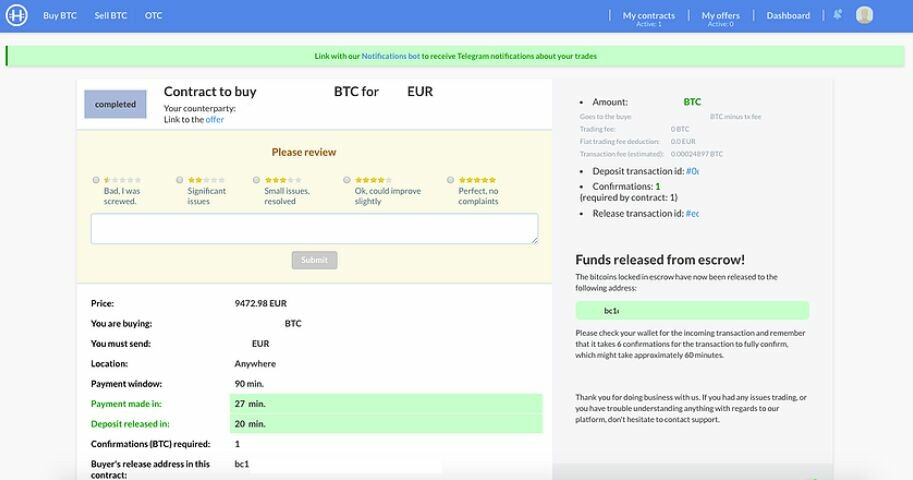

Herzlichen Glückwunsch, Sie haben sich gerade einige nicht-KYC-Bitcoin gekauft!

Zwei abschließende Tipps

- Hodl Hodl ist webbasiert, daher empfehle ich immer den Zugriff über den Tor-Browser, um Ihre Privatsphäre zu schützen.
- Wenn Sie ein Telegram-Benutzer sind, stellen Sie sicher, dass Sie Ihr Profil mit dem Hodl Hodl-Bot verknüpfen. Auf diese Weise erhalten Sie Live-Updates zu jedem Handel, die es Ihnen ermöglichen, schnell zu handeln.

## Verleihoption

Diese Anleitung hilft Ihnen dabei, Ihre ersten Schritte auf der Lend at Hodl Hodl-Plattform zu machen.

> QUELLE/ https://medium.com/hodl-hodl/quick-guide-to-lend-or-borrow-on-lend-at-hodl-hodl-5a535d526217

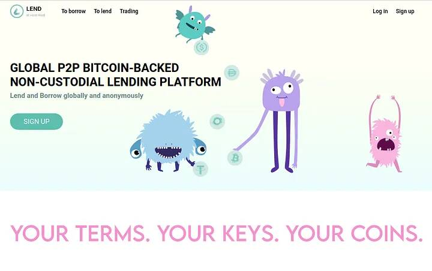
Lend at Hodl Hodl (lend.hodlhodl.com) ist eine Plattform, die entwickelt wurde, damit Benutzer aus der ganzen Welt untereinander verleihen oder sich Geld leihen können, ohne einer dritten Partei vertrauen zu müssen oder einen Verifizierungsprozess abzuschließen.

LEND ermöglicht es Ihnen, verschiedene Stablecoins oder Kryptowährungen zu verleihen oder sich mit BTC als Sicherheit Geld zu leihen. (Zurzeit ist es nicht möglich, BTC zu verleihen, obwohl diese Möglichkeit für die Zukunft entwickelt wird).

Sobald Sie sich mit Ihrem Spitznamen und einer E-Mail-Adresse auf der Plattform registriert haben, sind Sie bereit, mit dem Verleihen oder Ausleihen zu beginnen.

Zuerst suchen wir unter den vorhandenen Angeboten nach einem, das unseren Bedürfnissen entspricht. (Denken Sie immer daran, dass Sie Ihr eigenes Angebot veröffentlichen können, wenn Ihnen keine vorhandenen Angebote zusagen).

Weiter unten auf der Hauptseite finden wir das Suchfeld:

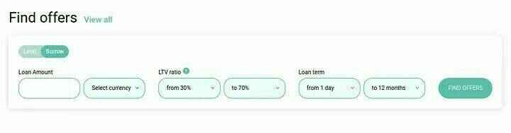

Das Suchwerkzeug zeigt uns standardmäßig die Angebote zum Ausleihen an.

Wenn wir verleihen möchten, müssen wir den entsprechenden Button auswählen.

Wir geben den Betrag ein, den wir ausleihen möchten, und die Kryptowährung, nach der wir suchen.

Das LTV-Verhältnis bezieht sich auf den Prozentsatz der Kryptowährung, den wir basierend auf dem Wert in BTC erhalten, den wir als Sicherheit hinterlegen. Je höher das LTV, desto höher der Betrag, den wir im Verhältnis zum Wert in BTC ausleihen, den wir als Sicherheit hinterlegen, aber auch die Möglichkeit, dass unsere Sicherheit (BTC) liquidiert wird, ist größer, wenn der Preis sinkt. Wenn wir ein niedriges LTV wählen, ist der Betrag, den wir im Verhältnis zum Wert in BTC ausleihen, den wir als Sicherheit hinterlegen, ebenfalls niedrig, und es besteht weniger Chance, dass unsere Sicherheit (BTC) liquidiert wird, falls der Preis sinkt.

Schließlich wählen wir die Laufzeit des Darlehens aus, das wir bereit sind anzunehmen. Das heißt, wie lange der Kreditgeber uns den beantragten Betrag zur Verfügung stellt, und ein endgültiges Rückgabedatum wird festgelegt. Der Kredit kann am Tag des Ablaufs vollständig zurückgezahlt werden oder durch Teilzahlungen während der gesamten Vertragslaufzeit.

Durch Klicken auf die Schaltfläche "Angebote finden" gibt die Plattform alle Angebote zurück, die unseren Suchkriterien entsprechen, und wir können das auswählen, das am besten zu uns passt.

Nehmen wir an, wir wählen das folgende Angebot:

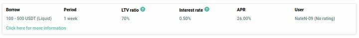

Der Benutzer "NateN-09" bietet an, zwischen 100 und 500 USDT über das Liquid-Netzwerk für eine Woche zu verleihen, zu einem Zinssatz von 0,50% (beachten Sie, dass der Zinssatz für die gesamte Vertragslaufzeit gilt).

Im Abschnitt APR (Annual Percentage Rate) können Sie sehen, wie viel der vorgeschlagene Zinssatz einer jährlichen Verlängerung entspricht, nur als Referenz für den Vergleich mit anderen Finanzdienstleistungen.

Das prozentuale Verhältnis (LTV) zwischen dem Wert der Sicherheit und dem Betrag, den der Kreditgeber uns gibt, ist auf 70% festgelegt. Daher müssen wir 30% mehr BTC-Wert als Sicherheit hinterlegen, um das Darlehen abzusichern. Mit anderen Worten, er/sie leiht uns 70% in Stablecoins (oder Kryptowährung) des Werts in BTC, den wir als Sicherheit hinterlegen. Dies wird als überbesichertes Darlehen bezeichnet.

Sobald wir das Angebot eingeben, sehen wir die Details wie folgt:

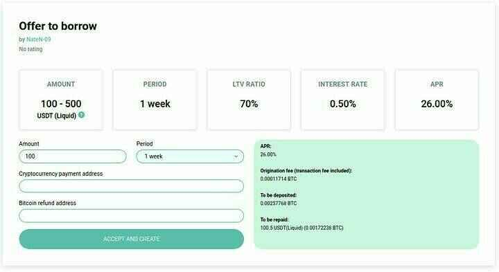

Wenn das Angebot angemessen erscheint und wir uns entscheiden, es anzunehmen, füllen wir die ausstehenden Felder aus und bestätigen mit der Schaltfläche "AKZEPTIEREN UND ERSTELLEN".

> In diesem Fall reicht das angebotene Betrag von 100 bis 500 USDT über das Liquid-Netzwerk, daher geben wir den Betrag ein, den wir in das entsprechende Feld eingeben möchten.
> Die Laufzeit des Darlehens in diesem Angebot ist auf 1 Woche festgelegt.
> Im Feld "Kryptowährungs-Zahlungsadresse" geben wir die Adresse ein, an die wir die ausgeliehene Kryptowährung erhalten möchten.

Im Feld "Bitcoin-Rückerstattungsadresse" geben wir die Adresse ein, auf der wir unsere BTC zurückerhalten möchten, sobald wir den Kredit zurückgezahlt haben.
Im grünen Rahmen auf der rechten Seite können wir die Details des Vertrags sehen, einschließlich der von der Plattform erhobenen Ursprungsgebühr für die Bereitstellung der technischen Werkzeuge zur Durchführung des Vertrags.

Sobald der Vertrag akzeptiert wurde, wird eine Multi-Signatur-Treuhandadresse erstellt, auf der wir den fälligen BTC-Betrag einzahlen müssen, um den Vertrag zu unterstützen.

Um diese Adresse in der Bitcoin-Blockchain zu generieren, werden wir nach einem "Zahlungspasswort" (anders als das Anmeldepasswort) gefragt, das als unser privater Schlüssel fungiert, um unsere BTC am Ende des Vertrags wiederherzustellen.

Wenn wir die BTC an die Treuhandadresse gesendet und sie bestätigt wurde, kann der Kreditnehmer die angeforderte Kryptowährung an die Adresse senden, die wir im vorherigen Schritt eingegeben haben.

Sobald wir sie erhalten haben, bestätigen wir den Link zur ID der Zahlungstransaktion, die uns der Kreditnehmer geschickt hat, und der Vertrag wird aktiv.

Wir müssen darauf achten, dass der LTV während der Vertragslaufzeit nicht zu stark ansteigt, damit unser Sicherheiten nicht liquidiert werden. Aber keine Sorge, die Plattform wird uns jedes Mal eine E-Mail und eine Benachrichtigung senden, wenn sich der LTV den Risikomargen nähert.

Wir können Teilzahlungen leisten, um den Kredit zurückzuzahlen, oder wir können dies am Ende der Laufzeit in einer Summe tun.

Sobald der gesamte Kreditbetrag plus Zinsen zurückgezahlt ist und die Zahlungen bestätigt wurden, können wir unsere BTC von der Multi-Signatur-Treuhandadresse abheben und der Vertrag ist beendet.

In einem zukünftigen Artikel werden wir die Schritte beschreiben, die zu befolgen sind, wenn wir als Kreditgeber handeln.

Wenn Sie Zweifel bezüglich des Verfahrens haben, zögern Sie nicht, uns über einen unserer Support-Kanäle zu kontaktieren.

Erreichen Sie uns

- Hodl Hodl Handelsplattform: hodlhodl.com
- Verleihen bei Hodl Hodl: lend.hodlhodl.com
- Vorhersagen von Hodl Hodl: predictions.hodlhodl.com
- E-Mail: support@hodlhodl.com
- Blog: hodlhodl.medium.com
- Twitter: twitter.com/hodlhodl
- Telegram: t.me/HodlHodl
- Reddit: hodlhodl.reddit.com
- Facebook: facebook.com/HHodl
- Youtube: youtube.com/c/HodlHodl
