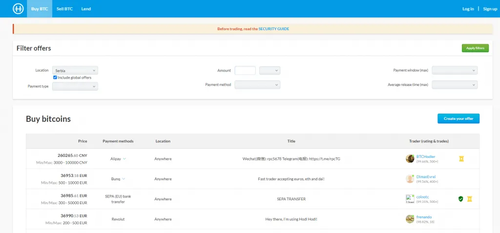
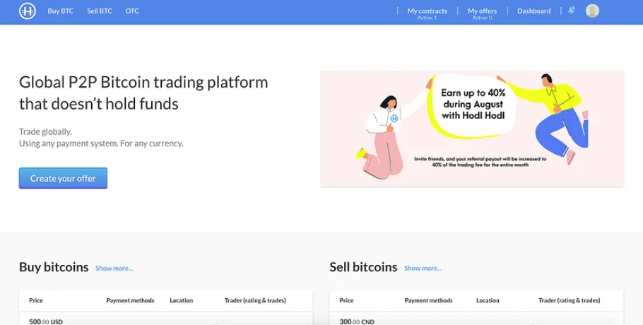
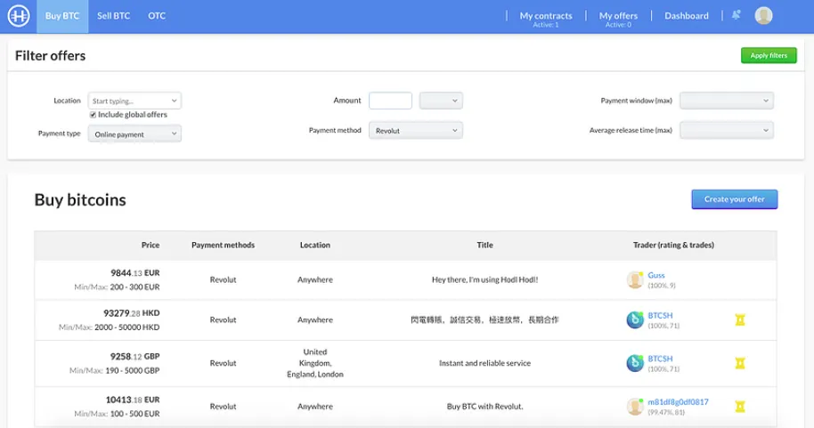
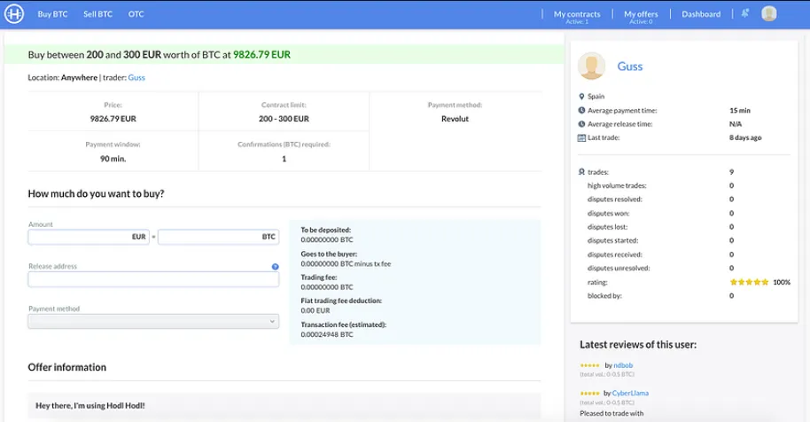
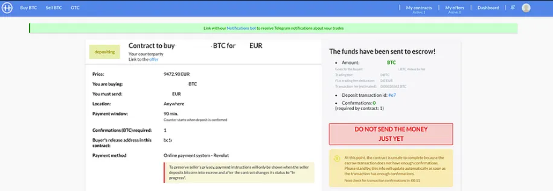
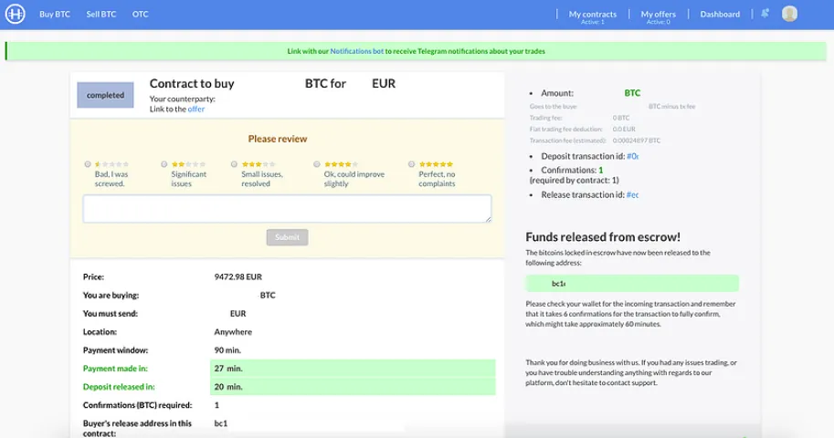
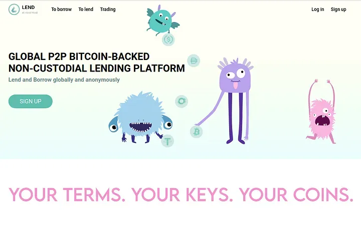
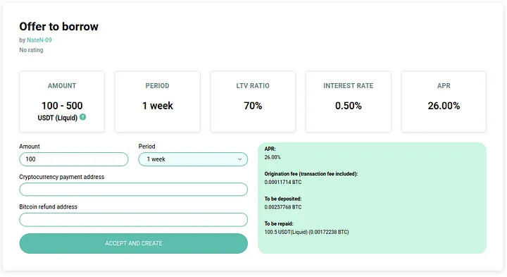

Hodl Hodl est une bourse décentralisée de Bitcoin qui privilégie le contrôle et la sécurité des utilisateurs. Contrairement aux bourses traditionnelles, elle fonctionne selon un modèle pair à pair, permettant des échanges directs entre utilisateurs. Grâce à son système d'entiercement multi-signatures, Hodl Hodl garantit la sécurité des fonds lors des transactions. La plateforme prend également en charge divers modes de paiement et propose des options de trading telles que les contrats sur différence (CFD).

https://hodlhodl.com/pages/faq_help

## guide d'écriture :

Démarrer votre parcours avec HodlHodl : Un guide étape par étape

HodlHodl est une bourse de cryptomonnaie pair à pair (P2P) qui prend en charge exclusivement une seule devise numérique, mais offre la flexibilité de trader dans n'importe quelle devise, englobant toutes les devises fiduciaires et les altcoins. Un aspect important de cette plateforme P2P est qu'elle n'impose aucun frais de dépôt ou de retrait, mais facture plutôt des frais de trading allant de 0,5% à 0,6%, en fonction du statut de vérification de l'utilisateur. Les utilisateurs ont l'avantage d'un large éventail de modes de paiement, ce qui fait de HodlHodl l'une des plateformes P2P les plus polyvalentes. Certains des modes de paiement couramment utilisés incluent SWIFT, SEPA, les virements bancaires, les transactions par carte de crédit, PayPal, Venmo, MoneyGram et Western Union. Cependant, les options de paiement disponibles dépendent de l'acceptation du vendeur.

Une des caractéristiques saillantes de HodlHodl est les limites de trading variables, qui peuvent être progressivement assouplies avec l'augmentation du volume de trading et des transactions réussies. Le montant minimum de trading de BTC est fixé à 0,001 BTC et l'offre de prêt la plus basse ne doit pas être inférieure à 50 USD en valeur crypto. La plateforme ne nécessite aucune procédure de Connaissance de Votre Client (KYC) ou de Lutte contre le Blanchiment d'Argent (AML) conformément à sa politique de maintien de l'anonymat des utilisateurs. Cependant, les utilisateurs qui optent pour la vérification peuvent bénéficier d'avantages tels que des commissions réduites, des limites de transaction accrues et un statut "Vérifié" visible. HodlHodl a une portée mondiale étendue, accueillant des utilisateurs de presque tous les pays à quelques exceptions près comme la Corée du Nord, l'Irak, la Syrie et le Soudan.

### Création de compte

Pour créer votre propre compte, il vous suffit de cliquer sur "S'inscrire", situé dans le coin droit de la page d'accueil de la plateforme. Comme prévu, vous devrez fournir une adresse e-mail, choisir un nom d'utilisateur et établir un mot de passe de paiement. De plus, la plateforme vous demande de définir votre fuseau horaire local, ce qui aide à rationaliser vos heures de fonctionnement et facilite le processus de transaction.

### Personnalisez votre profil

Après avoir réussi l'inscription de votre compte, votre prochaine étape consistera à fournir à votre profil certaines informations nécessaires.

La personnalisation de votre profil devrait inclure :

- Informations personnelles - Cela comprend votre nom d'utilisateur choisi, votre adresse e-mail et une brève biographie.
- Authentification à deux facteurs (2FA) - Activer le 2FA améliore la sécurité de votre profil, ce qui est toujours une mesure prudente.
- Accès à l'API - Ce n'est pas obligatoire et reste inactif par défaut.
- Profils P2P passés - Si vous avez déjà interagi avec d'autres plateformes P2P, lier ces informations peut augmenter votre crédibilité auprès des autres traders.

### Enregistrez votre adresse BTC'

Afin de commencer à trader du BTC, vous devrez d'abord fournir votre adresse BTC. Cela peut être entré dans le menu "Paramètres de trading". Après avoir enregistré votre adresse, vous pouvez passer à "Acheter du BTC" ou "Vendre du BTC" pour commencer votre parcours de trading.

## Étape par étape vers votre premier échange

Guide par Bitcoiner Q&A https://bitcoiner.guide/hodlhodl/

1. Rendez-vous sur hodlhodl.com et créez votre compte. Les seuls détails que vous devez fournir sont un nom d'utilisateur et une adresse e-mail. Vous serez ensuite redirigé vers la page d'accueil.

2. Cliquez sur "Acheter du BTC" dans l'en-tête du site.

3. Sélectionnez votre type et méthode de paiement souhaités. Vous pouvez également spécifier un montant spécifique ici si nécessaire.

4. Sélectionnez l'offre de votre choix. Vous pouvez ensuite consulter les détails de l'échange et lire les rapports d'activité et les évaluations des pairs.

5. Une fois satisfait, vous pouvez spécifier la quantité que vous souhaitez acheter, entrer l'adresse à laquelle vous souhaitez recevoir les bitcoins et confirmer la méthode de paiement annoncée par le vendeur. Cliquez sur "Accepter l'offre et créer un contrat".

6. Vous avez maintenant créé votre contrat et devez cliquer sur "Générer l'Escrow" où vous serez invité à créer un mot de passe de paiement. Le mot de passe de paiement est une clé de chiffrement pour la paire de clés d'escrow de l'utilisateur. Il est utilisé pour déposer ou libérer des bitcoins de l'escrow.

7. Maintenant, vous devez attendre que le vendeur dépose ses bitcoins dans le portefeuille d'escrow. Après avoir lancé le contrat, vous pouvez discuter avec le vendeur en utilisant la boîte de discussion sur le côté droit de la page.

8. Une fois que le vendeur a déposé ses fonds dans l'escrow, vous verrez cet écran vous conseillant de ne pas envoyer votre argent tant qu'il n'y a pas eu un nombre suffisant de confirmations de la blockchain (cela varie en fonction des conditions de l'échange). Vous pouvez vérifier l'avancement de la transaction de dépôt du vendeur en cliquant sur le lien bleu "ID de transaction de dépôt".

9. Une fois confirmé, vous serez notifié et vous pourrez ensuite envoyer les fonds au vendeur aux coordonnées qu'il vous fournira. Une fois cela fait, cliquez sur "J'ai envoyé le paiement".

10. Vous devrez ensuite attendre que le vendeur confirme avoir reçu les fonds, à ce moment-là, les bitcoins seront envoyés à l'adresse que vous avez spécifiée au début du contrat. Vous aurez également la possibilité d'évaluer votre pair.

Félicitations, vous venez d'acheter des bitcoins sans KYC !

Deux derniers conseils :

- Hodl Hodl est basé sur le web, je vous conseille donc toujours d'y accéder via le navigateur Tor pour protéger votre vie privée.
- Si vous utilisez Telegram, assurez-vous de lier votre profil au bot Hodl Hodl. Vous recevrez ainsi des mises à jour en direct sur chaque échange, ce qui vous permettra d'agir rapidement.

## Option de prêt

Ce guide vous aidera à faire vos premiers pas sur la plateforme Lend at Hodl Hodl.

> SOURCE/ https://medium.com/hodl-hodl/quick-guide-to-lend-or-borrow-on-lend-at-hodl-hodl-5a535d526217

Lend at Hodl Hodl (lend.hodlhodl.com) est une plateforme conçue pour que les utilisateurs du monde entier puissent se prêter ou s'emprunter mutuellement sans avoir à faire confiance à un tiers ou à effectuer une procédure de vérification.

LEND vous permet de prêter ou d'emprunter différentes stablecoins ou cryptomonnaies en utilisant BTC comme garantie. (Pour le moment, il n'est pas possible de prêter du BTC, bien que cette possibilité soit en cours de développement pour l'avenir).

Une fois que vous vous êtes inscrit sur la plateforme avec seulement votre pseudonyme et une adresse e-mail, vous serez prêt à commencer à prêter ou à emprunter.

Tout d'abord, nous allons chercher parmi les offres existantes celle qui correspond à nos besoins. (N'oubliez pas que vous pouvez publier votre propre offre si aucune des offres existantes ne vous convient).

Plus bas sur la page principale, nous trouvons la boîte de recherche :

L'outil de recherche nous montre les offres d'emprunt par défaut.

Si nous voulons prêter, nous devons sélectionner le bouton correspondant.

Nous saisissons le montant que nous voulons emprunter et la cryptomonnaie que nous recherchons.

Le ratio LTV fait référence au pourcentage de cryptomonnaie que nous recevrons en fonction de la valeur en BTC que nous plaçons en garantie. Plus le LTV est élevé, plus le montant que nous empruntons par rapport à la valeur en BTC que nous déposons en garantie est élevé, mais il y a également plus de chances que notre garantie (BTC) soit liquidée si son prix baisse. Si nous choisissons un faible LTV, le montant que nous empruntons par rapport à la valeur en BTC que nous déposons en garantie sera également faible, et il y a moins de chances que notre garantie (BTC) soit liquidée en cas de baisse de son prix.

Enfin, nous choisissons la durée du prêt que nous sommes prêts à prendre. C'est-à-dire pendant combien de temps le prêteur nous accordera le montant demandé, et une date de remboursement finale sera établie. Le crédit peut être entièrement remboursé le jour de l'expiration du terme ou par des paiements partiels tout au long de la période du contrat.

En cliquant sur le bouton "Trouver des offres", la plateforme nous renverra toutes les offres correspondant à nos critères de recherche, et nous pourrons choisir celle qui nous convient le mieux.

Supposons que nous choisissons l'offre suivante :

L'utilisateur "NateN-09" propose de prêter entre 100 et 500 USDT envoyés par le réseau Liquid pour une durée d'une semaine, à un taux de 0,50% (n'oubliez pas que le taux s'applique à l'ensemble de la durée du contrat).

Dans la section TAP (Taux Annuel en Pourcentage), vous pouvez voir à quel point le taux proposé correspond à une extension annuelle, simplement à titre de référence pour la comparaison avec d'autres services financiers.

La relation en pourcentage (LTV) entre la valeur de la garantie et le montant que le prêteur nous accordera est fixée à 70%, nous devons donc placer 30% de plus de valeur en BTC en garantie pour soutenir le prêt. En d'autres termes, il/elle nous prête les 70% en stablecoins (ou cryptomonnaie) de la valeur en BTC que nous bloquons en garantie. Cela s'appelle un prêt sur-collatéralisé.

Une fois que nous avons saisi l'offre, nous verrons les détails comme suit :

Si l'offre semble appropriée et que nous décidons de l'accepter, nous complétons les champs en attente et confirmons avec le bouton "ACCEPTER ET CRÉER".

> Dans ce cas, le montant offert va de 100 à 500 USDT sur le réseau Liquid, nous saisissons donc le montant dont nous avons besoin dans le champ correspondant.
>
> La durée du prêt dans cette offre est fixée à 1 semaine.
> Dans le champ "Adresse de paiement de la cryptomonnaie", nous saisissons celle où nous voulons recevoir la cryptomonnaie que nous empruntons.

Dans le champ "Adresse de remboursement Bitcoin", nous mettons celle où nous voulons recevoir nos BTC une fois que nous avons remboursé le prêt.

Dans le cadre vert à droite, nous pouvons voir les détails du contrat, y compris les frais d'origination facturés par la plateforme pour fournir les outils techniques nécessaires à l'exécution du contrat.

Une fois que le contrat est accepté, une adresse d'entiercement multi-signature est créée où nous devons déposer le montant de BTC dû afin de soutenir le contrat.

Pour générer cette adresse dans la blockchain Bitcoin, on nous demandera un "Mot de passe de paiement" (différent de celui de connexion) qui servira de clé privée pour récupérer nos BTC à la fin du contrat.

Lorsque nous avons envoyé les BTC à l'adresse d'entiercement et qu'elle a été confirmée, l'emprunteur pourra envoyer la cryptomonnaie demandée à l'adresse que nous avons saisie à l'étape précédente.

Une fois que nous les avons reçus, nous confirmerons le lien vers l'ID de la transaction de paiement que l'emprunteur nous a envoyée, et le contrat sera actif.

Nous devons faire attention à ce que la LTV ne monte pas trop pendant la durée du contrat afin que notre garantie ne soit pas liquidée. Mais ne vous inquiétez pas, la plateforme nous enverra un e-mail et une notification chaque fois que la LTV se rapprochera des marges de risque.

Nous pouvons effectuer des paiements partiels pour rembourser le prêt ou nous pouvons le faire en une seule fois à la fin de la période.

Une fois que le prêt intégral plus les intérêts sont remboursés et que les paiements sont confirmés, nous pourrons retirer nos BTC de l'adresse d'entiercement multi-signature et le contrat sera terminé.

Dans un prochain article, nous décrirons les étapes à suivre si nous agissons en tant que prêteurs.

Si vous avez des doutes concernant la procédure, n'hésitez pas à nous contacter via l'un de nos canaux de support.

Contactez-nous

- Plateforme de trading Hodl Hodl : hodlhodl.com
- Prêt chez Hodl Hodl : lend.hodlhodl.com
- Prédictions par Hodl Hodl : predictions.hodlhodl.com
- E-mail : support@hodlhodl.com
- Blog : hodlhodl.medium.com
- Twitter : twitter.com/hodlhodl
- Telegram : t.me/HodlHodl
- Reddit : hodlhodl.reddit.com
- Facebook : facebook.com/HHodl
- Youtube : youtube.com/c/HodlHodl
