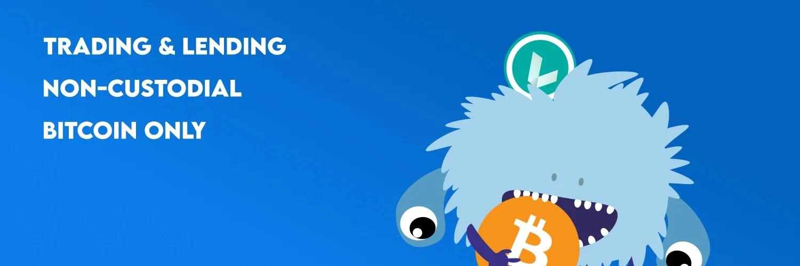
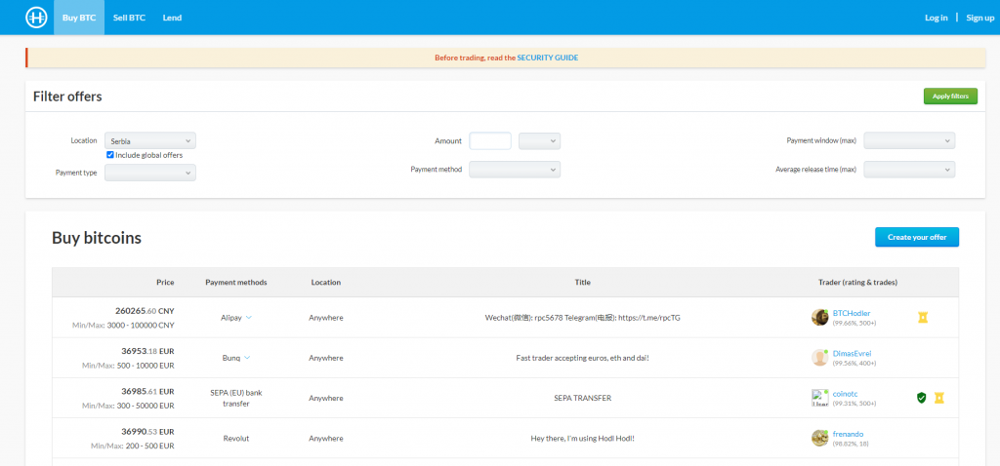
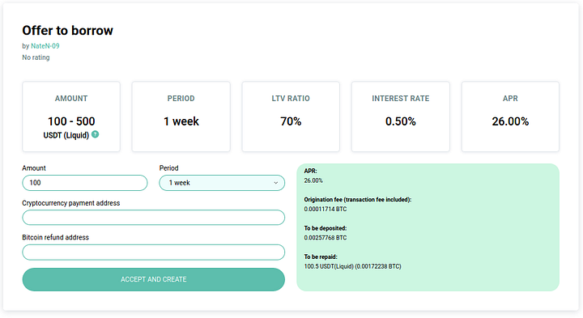

Hodl Hodl è uno scambio decentralizzato di Bitcoin che privilegia il controllo e la sicurezza dell'utente. A differenza degli scambi tradizionali, opera su un modello peer-to-peer, consentendo scambi diretti tra utenti. Con il suo sistema di escrow multi-firma, Hodl Hodl garantisce la sicurezza dei fondi durante le transazioni. La piattaforma supporta anche vari metodi di pagamento e offre opzioni di trading come i contratti per differenza (CFD).

https://hodlhodl.com/pages/faq_help

## guida alla scrittura:

Iniziare il tuo viaggio con HodlHodl: una guida passo passo

HodlHodl è uno scambio di criptovalute peer-to-peer (P2P), che supporta esclusivamente una valuta digitale ma offre la flessibilità di scambiare in qualsiasi valuta, comprese tutte le valute fiat e le altcoin. Un aspetto significativo di questa piattaforma P2P è che non impone alcuna commissione di deposito o prelievo, ma invece applica commissioni di trading che vanno dallo 0,5% allo 0,6%, a seconda dello stato di verifica dell'utente. Gli utenti hanno il vantaggio di una vasta gamma di metodi di pagamento, rendendo HodlHodl una delle piattaforme P2P più versatili. Alcuni dei metodi di pagamento comunemente utilizzati includono SWIFT, SEPA, bonifici bancari, transazioni con carta di credito, PayPal, Venmo, MoneyGram e Western Union. Tuttavia, le opzioni di pagamento disponibili dipendono dall'accettazione del venditore.

Una delle caratteristiche salienti di HodlHodl sono i limiti di trading variabili, che possono essere progressivamente allentati con l'aumento del volume di trading e degli scambi di successo. L'importo minimo di trading di BTC è fissato a 0,001 BTC e l'offerta di prestito più bassa non deve essere inferiore a 50 USD in valore criptato. La piattaforma non richiede alcuna procedura di Know Your Customer (KYC) o Anti-Money Laundering (AML) in conformità con la sua politica di mantenere l'anonimato dell'utente. Tuttavia, gli utenti che optano per la verifica possono godere di vantaggi come commissioni ridotte, limiti di transazione aumentati e uno stato "Verificato" visibile. HodlHodl ha un'ampia portata globale, accogliendo utenti da quasi tutti i paesi con alcune eccezioni come Corea del Nord, Iraq, Siria e Sudan.

### Creazione dell'account

Per creare il tuo account, basta fare clic su 'Registrati', situato nell'angolo destro della homepage della piattaforma. Come previsto, ti verrà richiesto di inserire un indirizzo email, scegliere un nome utente e stabilire una password di pagamento. Inoltre, la piattaforma ti chiede di definire il tuo fuso orario locale, in quanto ciò aiuta a ottimizzare le tue ore operative e facilita il processo di transazione.

### Personalizza il tuo profilo

Dopo aver completato la registrazione dell'account, il tuo prossimo passo sarà fornire al tuo profilo alcuni dettagli necessari.

La personalizzazione del tuo profilo dovrebbe includere:

- Informazioni personali - Questo include il nome utente scelto, l'email e una breve biografia.
- Autenticazione a due fattori (2FA) - L'attivazione del 2FA migliora la sicurezza del tuo profilo, il che è sempre una mossa prudente.
- Accesso API - Questo non è obbligatorio e rimane inattivo per impostazione predefinita.
- Profili P2P passati - Se hai interagito in precedenza con altre piattaforme P2P, collegare queste informazioni può aumentare la tua credibilità tra gli altri trader.

### Registra il tuo indirizzo BTC'

Per iniziare a fare trading di BTC, dovrai fornire prima il tuo indirizzo BTC. Questo può essere inserito nel menu "Impostazioni di trading". Dopo aver registrato il tuo indirizzo, puoi procedere con "Acquista BTC" o "Vendi BTC" per iniziare il tuo percorso di trading.

## Passo dopo passo verso il tuo primo scambio

Guida di Bitcoiner Q&A https://bitcoiner.guide/hodlhodl/

1. Visita hodlhodl.com e crea il tuo account. L'unico dettaglio che devi fornire è un nome utente e un indirizzo email. Sarai quindi indirizzato alla pagina principale.

2. Clicca su "Acquista BTC" nell'intestazione del sito web.

3. Seleziona il tipo e il metodo di pagamento desiderati. Puoi anche specificare un importo specifico qui, se necessario.

4. Seleziona l'offerta desiderata. Puoi quindi rivedere i dettagli dello scambio e leggere anche i rapporti di attività e le valutazioni dei peer.

5. Una volta soddisfatto, puoi specificare quanto vuoi acquistare, inserire l'indirizzo a cui desideri che venga inviato il bitcoin e confermare il metodo di pagamento pubblicizzato dal venditore. Clicca su "Accetta l'offerta e crea il contratto".

6. Ora hai creato il tuo contratto e devi cliccare su "Genera Escrow", dove ti verrà chiesto di creare una password di pagamento. La password di pagamento è una chiave di crittografia per la coppia di chiavi di escrow dell'utente. Viene utilizzata per depositare o rilasciare Bitcoin nell'escrow.

7. Ora devi aspettare che il venditore depositi i suoi bitcoin nell'escrow wallet. Dopo aver avviato il contratto, puoi chattare con il venditore utilizzando la chat sulla destra della pagina.

8. Una volta che il venditore ha depositato i suoi fondi nell'escrow, vedrai questa schermata che ti avvisa di non inviare i tuoi soldi fino a quando non ci sono un numero sufficiente di conferme sulla blockchain (questo varia a seconda delle condizioni di scambio). Puoi controllare lo stato della transazione di deposito del venditore cliccando sul link blu "ID transazione di deposito".

9. Una volta confermato, riceverai una notifica e potrai inviare i fondi al venditore utilizzando i dettagli che ti fornirà. Una volta fatto ciò, clicca su "Ho inviato il pagamento".

10. Dovrai quindi aspettare che il venditore confermi di aver ricevuto i fondi, momento in cui i bitcoin verranno inviati all'indirizzo che hai specificato all'inizio del contratto. Avrai anche l'opportunità di valutare il tuo peer.

Congratulazioni, hai appena acquistato dei bitcoin senza KYC!

Due consigli finali

- Hodl Hodl è basato sul web, quindi consiglio sempre di accedere tramite il browser Tor per proteggere la tua privacy.
- Se sei un utente di Telegram, assicurati di collegare il tuo profilo al bot di Hodl Hodl. In questo modo riceverai aggiornamenti in tempo reale su ogni scambio, consentendoti di agire rapidamente.

## Opzione di prestito

Questa guida ti aiuterà a fare i primi passi nell'utilizzo della piattaforma Lend at Hodl Hodl.

> FONTE/ https://medium.com/hodl-hodl/quick-guide-to-lend-or-borrow-on-lend-at-hodl-hodl-5a535d526217

Lend at Hodl Hodl (lend.hodlhodl.com) è una piattaforma progettata in modo che gli utenti di tutto il mondo possano prestare o prendere in prestito tra di loro senza dover fidarsi di un terzo o completare una procedura di verifica.

LEND ti permette di prestare o prendere in prestito diverse stablecoin o criptovalute utilizzando BTC come garanzia. (Al momento, non è possibile prestare BTC, anche se questa possibilità è in fase di sviluppo per il futuro).

Una volta registrato sulla piattaforma con solo il tuo nickname e una email, sarai pronto per iniziare a prestare o prendere in prestito.

Prima di tutto, cercheremo tra le offerte esistenti quella che soddisfa le nostre esigenze. (Tieni sempre presente che puoi pubblicare la tua offerta se nessuna delle offerte esistenti ti soddisfa).

Più in basso nella pagina principale troviamo la casella di ricerca:

Lo strumento di ricerca ci mostra di default le offerte di prestito.

Se vogliamo prestare, dobbiamo selezionare il pulsante corrispondente.

Inseriamo l'importo che vogliamo prendere in prestito e la criptovaluta che stiamo cercando.

Il rapporto LTV si riferisce al percentuale di criptovaluta che riceveremo in base al valore in BTC che mettiamo come garanzia. Più alto è il LTV, maggiore è l'importo che prendiamo in prestito rispetto al valore in BTC che depositiamo come garanzia, ma è anche maggiore la possibilità che la nostra garanzia (BTC) venga liquidata se il suo prezzo scende. Se scegliamo un LTV basso, anche l'importo che prendiamo in prestito rispetto al valore in BTC che depositiamo come garanzia sarà basso, e c'è meno possibilità che la nostra garanzia (BTC) venga liquidata in caso di calo del suo prezzo.

Infine, scegliamo il termine del prestito che siamo disposti a prendere. Cioè, per quanto tempo il prestatore ci darà l'importo richiesto, e verrà stabilita una data di restituzione finale. Il credito può essere completamente restituito il giorno in cui scade il termine o attraverso pagamenti parziali durante l'intero periodo contrattuale.

Cliccando sul pulsante "Trova offerte", la piattaforma restituirà tutte le offerte che corrispondono ai nostri criteri di ricerca, e potremo scegliere quella che meglio si adatta a noi.

Supponiamo che scegliamo la seguente offerta:

L'utente "NateN-09" offre di prestare tra 100 e 500 USDT inviati tramite la rete Liquid per un periodo di 1 settimana, a un tasso dello 0,50% (tieni presente che il tasso si applica per l'intero periodo contrattuale).

Nella sezione APR (Annual Percentage Rate) puoi vedere quanto corrisponde il tasso proposto a un'estensione annuale, solo come riferimento per il confronto con altri servizi finanziari.

La relazione percentuale (LTV) tra il valore della garanzia e l'importo che il prestatore ci darà è fissata al 70%, quindi dobbiamo mettere il 30% in più del valore BTC come garanzia per il prestito. In altre parole, ci presta il 70% in stablecoin (o criptovaluta) del valore in BTC che blocciamo come garanzia. Questo viene chiamato prestito sovra-collateralizzato.

Una volta inserita l'offerta, vedremo i dettagli come segue:

Se l'offerta sembra appropriata e decidiamo di accettarla, completiamo i campi pendenti e confermiamo con il pulsante "ACCETTA E CREA".

> In questo caso, l'importo offerto va da 100 a 500 USDT sulla rete Liquid, quindi inseriamo l'importo di cui abbiamo bisogno nel campo corrispondente.
> Il periodo del prestito in questa offerta è fissato a 1 settimana.
> Nel campo "Indirizzo di pagamento della criptovaluta" inseriamo quello in cui vogliamo ricevere la criptovaluta che stiamo prendendo in prestito.

Nel campo "Indirizzo di rimborso Bitcoin" inseriamo quello in cui desideriamo ricevere i nostri BTC una volta restituito il prestito.
Nel riquadro verde a destra possiamo vedere i dettagli del contratto, inclusa la commissione di origine addebitata dalla piattaforma per fornire gli strumenti tecnici per effettuare il contratto.

Una volta accettato il contratto, viene creato un indirizzo di escrow multi-firma in cui dobbiamo depositare l'importo BTC dovuto per supportare il contratto.

Per generare questo indirizzo nella blockchain di Bitcoin, ci verrà richiesta una "Password di pagamento" (diversa da quella di accesso) che fungerà da chiave privata per recuperare i nostri BTC alla fine del contratto.

Quando avremo inviato i BTC all'indirizzo di escrow e sarà stato confermato, il mutuatario potrà inviare la criptovaluta richiesta all'indirizzo che abbiamo inserito nel passaggio precedente.

Una volta ricevuti, confermeremo il collegamento all'ID della transazione di pagamento che il mutuatario ci ha inviato e il contratto sarà attivo.

Dobbiamo fare attenzione affinché il LTV non aumenti troppo durante il periodo del contratto in modo che il nostro collaterale non venga liquidato. Ma non preoccupatevi, la piattaforma ci invierà una e-mail e una notifica ogni volta che il LTV si avvicina ai margini di rischio.

Possiamo effettuare pagamenti parziali per restituire il prestito o possiamo farlo tutto insieme alla fine del termine.

Una volta restituito l'intero prestito più gli interessi e i pagamenti sono confermati, potremo prelevare i nostri BTC dall'indirizzo di escrow multi-firma e il contratto sarà concluso.

In un futuro articolo descriveremo i passaggi da seguire se agiamo come prestatori.

Se avete dubbi sul procedimento, non esitate a contattarci attraverso uno dei nostri canali di supporto.

Contattaci

- Piattaforma di trading Hodl Hodl: hodlhodl.com
- Prestiti su Hodl Hodl: lend.hodlhodl.com
- Previsioni di Hodl Hodl: predictions.hodlhodl.com
- E-mail: support@hodlhodl.com
- Blog: hodlhodl.medium.com
- Twitter: twitter.com/hodlhodl
- Telegram: t.me/HodlHodl
- Reddit: hodlhodl.reddit.com
- Facebook: facebook.com/HHodl
- Youtube: youtube.com/c/HodlHodl
