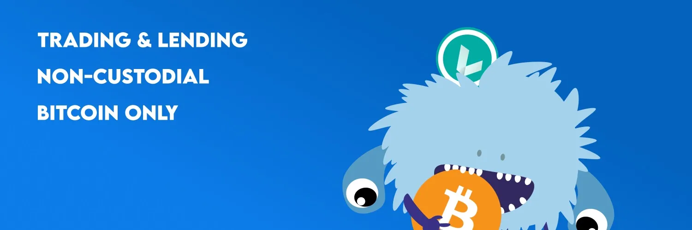

Hodl Hodl là một sàn giao dịch Bitcoin phi tập trung ưu tiên quyền kiểm soát và an ninh cho người dùng. Khác với các sàn giao dịch truyền thống, nó hoạt động theo mô hình ngang hàng, cho phép giao dịch trực tiếp giữa các người dùng. Với hệ thống escrow đa chữ ký, Hodl Hodl đảm bảo an toàn cho quỹ trong quá trình giao dịch. Nền tảng cũng hỗ trợ nhiều phương thức thanh toán và cung cấp các lựa chọn giao dịch như hợp đồng chênh lệch (CFDs).

https://hodlhodl.com/pages/faq_help

## hướng dẫn viết:

Bắt đầu hành trình của bạn với HodlHodl: Hướng dẫn từng bước

HodlHodl là một sàn giao dịch tiền mã hóa ngang hàng (P2P), chỉ hỗ trợ một loại tiền mã hóa nhưng cung cấp sự linh hoạt để giao dịch bằng bất kỳ loại tiền tệ nào, bao gồm tất cả các loại tiền tệ fiat và altcoins. Một đặc điểm nổi bật của nền tảng P2P này là nó không áp đặt bất kỳ phí gửi tiền hoặc rút tiền nào, thay vào đó, nó thu phí giao dịch từ 0.5% đến 0.6%, tùy thuộc vào trạng thái xác minh của người dùng. Người dùng có lợi thế với một loạt phương thức thanh toán, làm cho HodlHodl trở thành một trong những nền tảng P2P đa dạng nhất. Một số phương thức thanh toán thường được sử dụng bao gồm SWIFT, SEPA, chuyển khoản ngân hàng, giao dịch bằng thẻ tín dụng, PayPal, Venmo, MoneyGram và Western Union. Tuy nhiên, các lựa chọn thanh toán có sẵn phụ thuộc vào sự chấp nhận của người bán.

Một trong những tính năng nổi bật của HodlHodl là giới hạn giao dịch biến đổi, có thể được nới lỏng dần với khối lượng giao dịch tăng lên và các giao dịch thành công. Số lượng BTC tối thiểu để giao dịch được đặt ở mức 0.001 BTC, và mức đề nghị vay thấp nhất không được ít hơn 50 USD theo giá trị tiền mã hóa. Nền tảng không yêu cầu bất kỳ quy trình Nắm rõ Khách hàng (KYC) hoặc Chống Rửa Tiền (AML) nào tuân theo chính sách duy trì sự ẩn danh cho người dùng. Tuy nhiên, người dùng chọn xác minh có thể tận hưởng lợi ích như giảm phí hoa hồng, tăng giới hạn giao dịch, và trạng thái "Đã Xác Minh" được hiển thị rõ ràng. HodlHodl có phạm vi toàn cầu rộng lớn, chào đón người dùng từ hầu hết các quốc gia với một số ngoại lệ như Bắc Triều Tiên, Iraq, Syria và Sudan.

### Tạo Tài Khoản

Để tạo tài khoản của riêng bạn, chỉ cần nhấp vào 'Đăng ký', nằm ở góc phải trên trang chủ của nền tảng. Như mong đợi, bạn sẽ cần nhập địa chỉ email, chọn tên người dùng và thiết lập mật khẩu thanh toán. Hơn nữa, nền tảng yêu cầu bạn xác định múi giờ địa phương vì điều này giúp đơn giản hóa giờ hoạt động của bạn và làm cho quá trình giao dịch dễ dàng hơn.

### Tùy Chỉnh Hồ Sơ Của Bạn

Sau khi đăng ký tài khoản thành công, bước tiếp theo của bạn sẽ là trang bị cho hồ sơ của bạn một số thông tin cần thiết.

Việc tùy chỉnh hồ sơ của bạn nên bao gồm:

- Thông Tin Cá Nhân – Điều này bao gồm tên người dùng đã chọn, email, và một tiểu sử ngắn gọn.
- Xác Thực Hai Yếu Tố (2FA) – Kích hoạt 2FA tăng cường bảo mật cho hồ sơ của bạn, luôn là một động thái khôn ngoan.
- Truy Cập API – Điều này không bắt buộc và mặc định là không hoạt động.
- Hồ Sơ P2P Trước Đây – Nếu bạn đã tương tác với các nền tảng P2P khác trước đây, liên kết thông tin này có thể tăng cường độ tin cậy của bạn giữa các nhà giao dịch.

### Đăng Ký Địa Chỉ BTC của Bạn
Để bắt đầu giao dịch BTC, bạn cần cung cấp địa chỉ BTC của mình trước tiên. Bạn có thể nhập địa chỉ này trong menu "Cài Đặt Giao Dịch". Sau khi ghi lại địa chỉ của bạn, bạn có thể tiếp tục chọn "Mua BTC" hoặc "Bán BTC" để bắt đầu hành trình giao dịch của mình.
## Bước đầu tiên hướng dẫn giao dịch của bạn

Hướng dẫn từ Bitcoiner Q&A https://bitcoiner.guide/hodlhodl/

1. Truy cập hodlhodl.com và tạo tài khoản của bạn. Bạn chỉ cần cung cấp tên người dùng và địa chỉ email. Sau đó, bạn sẽ được chuyển đến trang chủ.

2. Nhấp vào ‘Mua BTC’ trên tiêu đề trang web.

3. Chọn loại và phương thức thanh toán mong muốn của bạn. Bạn cũng có thể chỉ định một số lượng cụ thể ở đây nếu cần.

4. Chọn ưu đãi mong muốn của bạn. Sau đó, bạn có thể xem lại chi tiết giao dịch và cũng đọc các báo cáo hoạt động và đánh giá của đối tác.

5. Một khi bạn đã hài lòng, bạn có thể chỉ định số lượng bạn muốn mua, nhập địa chỉ bạn muốn gửi bitcoin đến và xác nhận phương thức thanh toán được quảng cáo bởi người bán. Nhấp vào ‘Chấp nhận ưu đãi và tạo hợp đồng’.

6. Bây giờ bạn đã tạo hợp đồng và cần nhấp vào ‘Tạo Escrow’ nơi bạn sẽ được yêu cầu tạo mật khẩu thanh toán. Mật khẩu thanh toán là khóa mã hóa cho cặp khóa escrow của người dùng. Nó được sử dụng để gửi hoặc nhận Bitcoin từ escrow.

7. Bây giờ bạn cần chờ người bán gửi bitcoin của họ vào ví escrow. Sau khi bắt đầu hợp đồng, bạn có thể trò chuyện với người bán sử dụng hộp chat ở bên phải trang.

8. Một khi người bán đã gửi tiền vào escrow, bạn sẽ thấy màn hình này khuyên bạn không gửi tiền cho đến khi có đủ số lượng xác nhận blockchain (số lượng này thay đổi tùy thuộc vào điều kiện giao dịch). Bạn có thể kiểm tra tiến trình giao dịch gửi tiền của người bán bằng cách nhấp vào liên kết màu xanh ‘ID Giao Dịch Gửi Tiền’.

9. Một khi được xác nhận, bạn sẽ được thông báo và sau đó bạn có thể gửi tiền cho người bán theo chi tiết họ cung cấp cho bạn. Sau khi bạn đã làm điều này, nhấp vào ‘Tôi Đã Gửi Tiền’.

10. Sau đó, bạn cần chờ người bán xác nhận họ đã nhận được tiền, tại thời điểm đó bitcoin sẽ được chuyển vào địa chỉ bạn đã chỉ định ở đầu hợp đồng. Bạn cũng sẽ có cơ hội đánh giá đối tác của mình.

Chúc mừng, bạn vừa mua cho mình một số bitcoin không KYC!

Hai lời khuyên cuối cùng

- Hodl Hodl dựa trên web nên tôi luôn khuyên bạn nên truy cập qua trình duyệt Tor để bảo vệ quyền riêng tư của mình.
- Nếu bạn là người dùng Telegram, hãy chắc chắn liên kết hồ sơ của bạn với bot Hodl Hodl. Như vậy bạn sẽ nhận được cập nhật trực tiếp về mỗi giao dịch, cho phép bạn hành động nhanh chóng.

## tùy chọn cho vay

Hướng dẫn này sẽ giúp bạn thực hiện những bước đầu tiên để sử dụng nền tảng Cho vay tại Hodl Hodl.

> NGUỒN/ https://medium.com/hodl-hodl/quick-guide-to-lend-or-borrow-on-lend-at-hodl-hodl-5a535d526217

Lend at Hodl Hodl (lend.hodlhodl.com) là một nền tảng được thiết kế để người dùng từ khắp nơi trên thế giới có thể cho vay hoặc vay mượn lẫn nhau mà không cần phải tin tưởng vào một bên thứ ba hoặc hoàn thành thủ tục xác minh.
LEND cho phép bạn cho vay hoặc vay các loại stablecoin hoặc tiền mã hóa khác nhau sử dụng BTC làm tài sản đảm bảo. (Hiện tại, không thể cho vay BTC, mặc dù khả năng đó đang được phát triển cho tương lai).

Một khi bạn đã đăng ký trên nền tảng chỉ với biệt danh và email, bạn sẽ sẵn sàng để bắt đầu cho vay hoặc vay mượn.

Đầu tiên, chúng ta sẽ tìm kiếm trong số các ưu đãi hiện có để tìm một ưu đãi phù hợp với nhu cầu của mình. (Luôn nhớ rằng bạn có thể đăng ưu đãi của mình nếu không có ưu đãi hiện có nào làm bạn hài lòng).

Xuống dưới trang chính, chúng ta tìm thấy hộp tìm kiếm:

Công cụ tìm kiếm cho chúng ta thấy các ưu đãi vay mặc định.

Nếu chúng ta muốn cho vay, chúng ta phải chọn nút tương ứng.

Chúng ta nhập số lượng chúng ta muốn vay và loại tiền mã hóa chúng ta đang tìm kiếm.

Tỷ lệ LTV ám chỉ phần trăm tiền mã hóa mà chúng ta sẽ nhận dựa trên giá trị BTC mà chúng ta đặt làm tài sản đảm bảo. Tỷ lệ LTV càng cao, số lượng chúng ta vay so với giá trị BTC mà chúng ta gửi làm tài sản đảm bảo cũng càng cao, nhưng khả năng tài sản đảm bảo của chúng ta (BTC) sẽ bị thanh lý cũng lớn hơn nếu giá của nó giảm. Nếu chúng ta chọn một tỷ lệ LTV thấp, số lượng chúng ta vay so với giá trị BTC mà chúng ta gửi làm tài sản đảm bảo cũng sẽ thấp, và có ít khả năng tài sản đảm bảo của chúng ta (BTC) sẽ bị thanh lý trong trường hợp giá của nó giảm.

Cuối cùng chúng ta chọn thời hạn của khoản vay mà chúng ta sẵn lòng nhận. Nghĩa là, bao lâu người cho vay sẽ cho chúng ta số tiền yêu cầu, và một ngày trả cuối cùng sẽ được thiết lập. Khoản vay có thể được trả hoàn toàn vào ngày hết hạn hoặc thông qua các khoản thanh toán từng phần trong suốt toàn bộ thời gian hợp đồng.

Bằng cách nhấp vào nút “Tìm ưu đãi”, nền tảng sẽ trả về tất cả các ưu đãi phù hợp với tiêu chí tìm kiếm của chúng ta, và chúng ta sẽ có thể chọn ưu đãi phù hợp nhất với mình.

Giả sử chúng ta chọn ưu đãi sau:

Người dùng “NateN-09” đề xuất cho vay từ 100 đến 500 USDT qua mạng Liquid trong thời gian 1 tuần, với lãi suất 0.50% (lưu ý rằng lãi suất áp dụng cho toàn bộ thời gian hợp đồng).

Trong phần APR (Tỷ Lệ Phần Trăm Hàng Năm) bạn có thể thấy lãi suất đề xuất tương ứng với một sự mở rộng hàng năm, chỉ như một tham chiếu để so sánh với các dịch vụ tài chính khác.

Mối quan hệ phần trăm (LTV) giữa giá trị của tài sản đảm bảo và số tiền mà người cho vay sẽ cho chúng ta được thiết lập là 70%, do đó chúng ta phải đặt giá trị BTC cao hơn 30% làm tài sản đảm bảo để bảo đảm khoản vay. Nói cách khác, người ta cho chúng ta vay 70% bằng stablecoin (hoặc tiền mã hóa) của giá trị BTC mà chúng ta khóa làm tài sản đảm bảo. Điều này được gọi là khoản vay quá đảm bảo.

Một khi chúng ta nhập vào ưu đãi, chúng ta sẽ thấy các chi tiết như sau:

Nếu ưu đãi có vẻ phù hợp và chúng ta quyết định nhận nó, chúng ta hoàn thành các trường còn lại và xác nhận với nút “CHẤP NHẬN VÀ TẠO”.

> Trong trường hợp này, số lượng được đề xuất đi từ 100 đến 500 USDT qua mạng Liquid, vì vậy chúng ta nhập số lượng mà chúng ta cần vào trường tương ứng.
> Thời gian của khoản vay trong ưu đãi này được cố định là 1 tuần.
Trong trường "Địa chỉ thanh toán tiền mã hóa", chúng ta nhập vào địa chỉ mà chúng ta muốn nhận tiền mã hóa mà chúng ta đang vay. Trong trường "Địa chỉ hoàn trả Bitcoin", chúng ta nhập vào địa chỉ mà chúng ta muốn nhận lại BTC của mình sau khi đã trả xong khoản vay.

Trong khung màu xanh ở bên phải, chúng ta có thể thấy chi tiết của hợp đồng bao gồm phí khởi tạo mà nền tảng tính phí để cung cấp các công cụ kỹ thuật thực hiện hợp đồng.

Một khi hợp đồng được chấp nhận, một địa chỉ escrow đa chữ ký được tạo ra nơi chúng ta phải gửi số BTC tương ứng để hỗ trợ hợp đồng.

Để tạo địa chỉ này trên blockchain Bitcoin, chúng ta sẽ được yêu cầu một "Mật khẩu Thanh toán" (khác với mật khẩu đăng nhập) sẽ hoạt động như khóa riêng của chúng ta để lấy lại BTC của mình vào cuối hợp đồng.

Khi chúng ta đã gửi BTC đến địa chỉ escrow và nó được xác nhận, người vay sẽ có thể gửi tiền mã hóa yêu cầu đến địa chỉ mà chúng ta đã nhập ở bước trước.

Một khi chúng ta đã nhận được chúng, chúng ta sẽ xác nhận liên kết đến ID của giao dịch thanh toán mà người vay đã gửi cho chúng ta, và hợp đồng sẽ được kích hoạt.

Chúng ta phải cẩn thận để không để LTV tăng quá nhiều trong thời gian hợp đồng để tránh tài sản thế chấp của chúng ta bị thanh lý. Nhưng đừng lo, nền tảng sẽ gửi email và thông báo mỗi khi LTV di chuyển về phía rủi ro.

Chúng ta có thể thực hiện các khoản thanh toán một phần để trả khoản vay hoặc chúng ta có thể trả hết cùng một lúc vào cuối kỳ hạn.

Một khi toàn bộ khoản vay cộng với lãi suất được trả và các khoản thanh toán được xác nhận, chúng ta sẽ có thể rút BTC của mình từ địa chỉ escrow đa chữ ký và hợp đồng kết thúc.

Trong một bài viết tương lai, chúng ta sẽ mô tả các bước cần thực hiện nếu chúng ta đóng vai trò là người cho vay.

Nếu bạn có bất kỳ thắc mắc nào về quy trình, đừng ngần ngại liên hệ với chúng tôi qua bất kỳ kênh hỗ trợ nào của chúng tôi.

Liên hệ với chúng tôi

- Nền tảng giao dịch Hodl Hodl: hodlhodl.com
- Cho vay tại Hodl Hodl: lend.hodlhodl.com
- Dự đoán của Hodl Hodl: predictions.hodlhodl.com
- E-mail: support@hodlhodl.com
- Blog: hodlhodl.medium.com
- Twitter: twitter.com/hodlhodl
- Telegram: t.me/HodlHodl
- Reddit: hodlhodl.reddit.com
- Facebook: facebook.com/HHodl
- Youtube: youtube.com/c/HodlHodl