Kraken è una delle piattaforme Bitcoin e di criptovalute Exchange più antiche al mondo. La società è stata fondata nel 2011 da Jesse Powell e dai suoi soci. Essendo stato consulente dell'allora piattaforma leader di mercato MtGox e avendone previsto il declino, Powell ha lanciato Kraken nel 2013 con l'obiettivo principale di sostituire MtGox, che sapeva essere condannata, e di non ripetere gli stessi errori. Ciò la rende una delle piattaforme Exchange più antiche e affidabili al mondo.

Oggi Kraken è una piattaforma completa, che va dai semplici acquisti di Bitcoin alle funzioni di trading avanzate e agli strumenti di gestione del rischio. È disponibile in versione web e, per le transazioni più semplici, è disponibile anche un'applicazione mobile di facile utilizzo.

Al di là di tutte queste caratteristiche, che come Bitcoiners non ci interessano molto, vale la pena notare che Kraken è stata una delle prime borse a supportare il Lightning Network sulla sua piattaforma, consentendo il prelievo **gratuito** dei satoshi acquisiti, incoraggiando così l'autocustodia tra i suoi utenti.

In questo tutorial vi mostreremo come utilizzare Kraken a livello individuale. Se avete un'azienda e volete optare per la versione Business, consultate quest'altro tutorial:

https://planb.network/tutorials/business/others/kraken-pro-07b1c16c-d517-4bf7-9a78-b42dc0f21785

## 1 - Creare un conto Kraken

Vai su [il sito ufficiale di Kraken](https://www.kraken.com/). Nella pagina iniziale, trovare e fare clic sull'opzione Sign Up"("Iscriviti") nell'angolo in alto a destra per iniziare a creare il proprio account.

Scegli quindi se vuoi creare un account personale o uno per la tua azienda. In questo caso sceglieremo **Personale**, ma a parte la procedura di identificazione, che cambierà un po', le funzionalità non cambiano tra un account pro e uno personale. Inserite il vostro indirizzo e-mail Address e la password di accesso, quindi cliccate su "Create account"("Crea account").

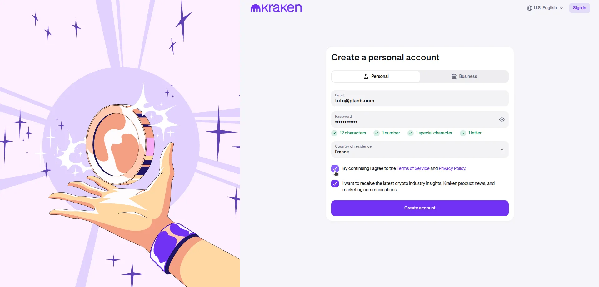

Inserisci quindi il codice ricevuto tramite l'e-mail all'indirizzo che hai appena inserito e clicca su "Conferma l'e-mail".

Poi inizia la procedura di verifica dell'identità richiesta dalle autorità...

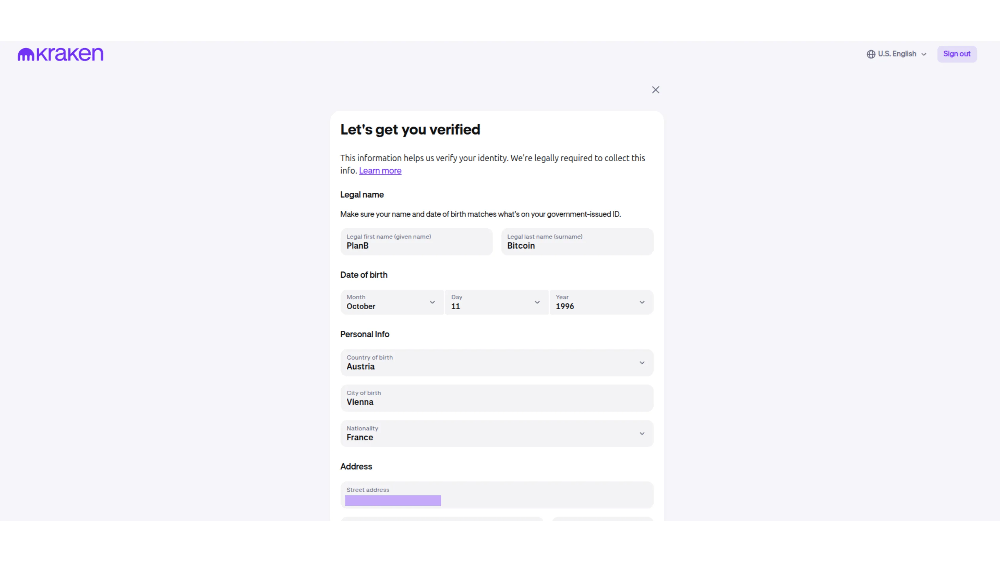

Completa le informazioni personali e fai clic su "Continua".

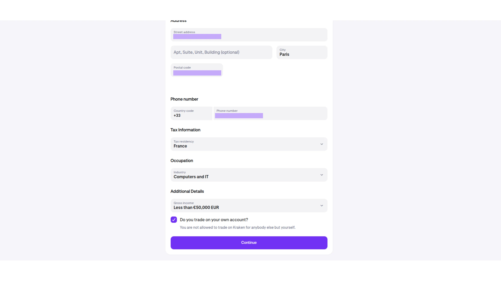

Nella schermata successiva, ti verrà chiesto di inserire nuovi dati personali. Ricorda che sei un potenziale criminale ed è essenziale che ti identifichi. Inserisci i dati che ti riguardano, quindi clicca su "Continue" ("Continua").

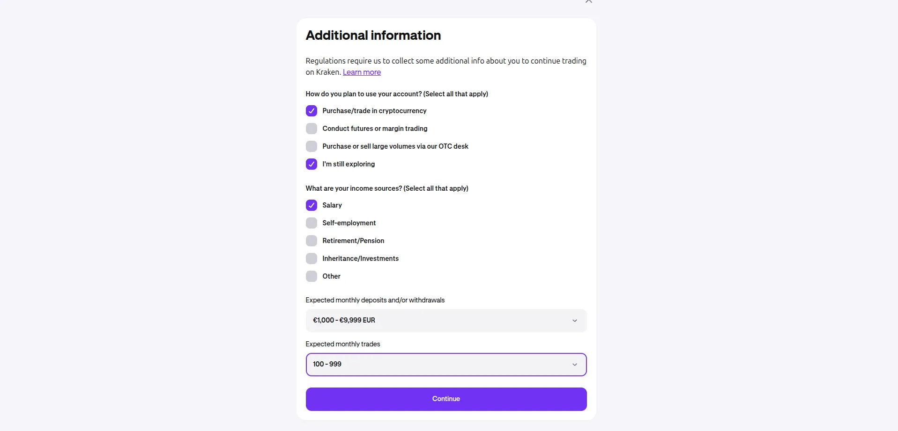

Successivamente, dovrai verificare la tua identità fornendo le foto di un documento d'identità ufficiale di tua scelta. Segui i passaggi per scannerizzare il documento.

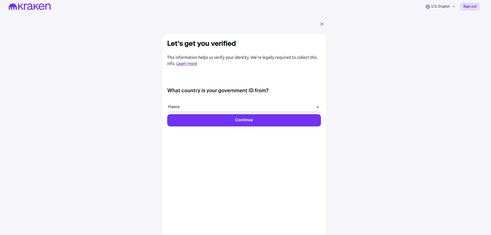

Per concludere, ti verrà chiesto di accedere alla webcam del tuo computer, se ne hai una (per scattare una foto del documento d'identità scelto), oppure, come in questo caso, di scansionare il codice QR sullo schermo con un dispositivo mobile dotato di fotocamera per scattare le foto.

Una volta inviate le foto fronte e retro del tuo documento d'identità, l'umiliazione finale è che ti verrà chiesto di fare una foto del tuo viso per confermare che corrisponda a quello del tuo documento d'identità... Finalmente puoi iniziare a fare sul serio.

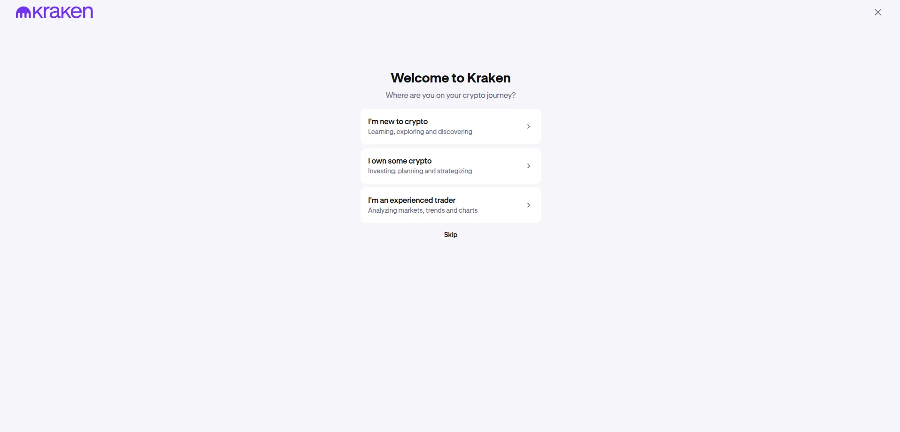

## 2 - Mettere in sicurezza il proprio conto Kraken

A questo punto accedi al tuo account. Ti verrà chiesto di scegliere tra due tipi di esperienza. Una semplice a sinistra, chiamata "Kraken", con un'interfaccia ordinata, che permette semplicemente di acquistare e vendere Bitcoin. L'altra, a destra, si chiama "Kraken Pro", che offre molte più opzioni, con un'interfaccia molto più affollata e meno leggibile, pensata per i profili "trader".

Va notato che i costi di acquisto sono diversi per entrambi, come vedremo in seguito.

Inizia scegliendo l'esperienza semplice facendo clic su "Go to Kraken" ("Vai a Kraken") nell'angolo in basso a sinistra.

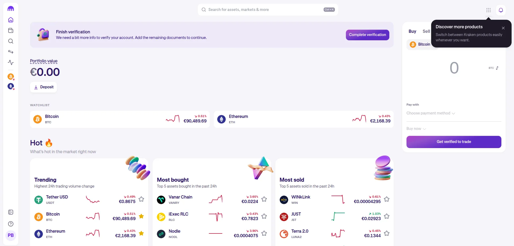

L'interfaccia è infatti piuttosto sobria e colorata. Prima ancora di proteggere il tuo account aggiungendo un metodo di autenticazione a due fattori, fai clic in basso a sinistra sul tuo profilo per passare alla modalità notturna ed evitare di danneggiare troppo i tuoi occhi con tutto quel bianco.

Ora che i tuoi occhi sono al sicuro, fai clic di nuovo sul tuo profilo per visualizzare il menu per l'aggiunta di un 2FA (secondo fattore di autenticazione). Scegli quindi "Security"("Sicurezza").

Vengono quindi proposte due opzioni 2FA: "passkey", che consente di autenticarsi tramite la biometria dello smartphone, o "Authenticator App".

- Se scegli l'opzione "passkey", segui le istruzioni sullo schermo. In sintesi, ti verrà chiesto di selezionare il dispositivo necessario per accedere al tuo account. Il PC in uso, uno smartphone o una chiave hardware di identificazione tipo YubiKey.

- Se scegli di utilizzare un'applicazione di autenticazione sullo smartphone, come ad esempio Google Authenticator o Authy, puoi trovare un tutorial su questo strumento qui:

https://planb.network/tutorials/computer-security/authentication/authy-a76ab26b-71b0-473c-aa7c-c49153705eb7

Dopo aver scelto il metodo più adatto a te, sei finalmente pronto a depositare il denaro per acquistare i tuoi primi satoshi.

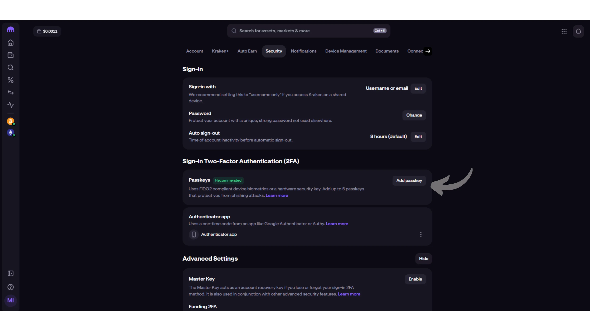

## 3 - Una rapida occhiata al Interface di Kraken

Torna quindi al menu principale facendo clic sulla casetta in alto a sinistra, come mostrato di seguito:

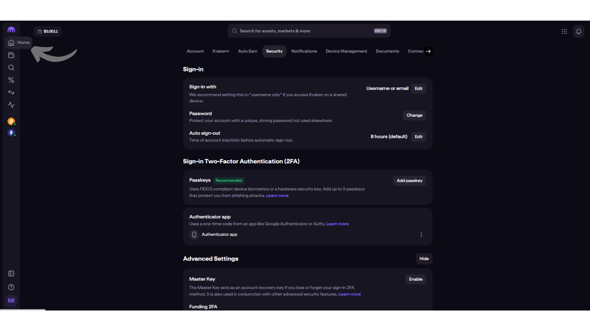

Facciamo un rapido giro del menu principale, prima del nostro primo acquisto.

Facendo clic su Expand"("Espandi") in basso a sinistra, è possibile allargare un po' la barra dei menu laterali per vedere i menu in modo esplicito.

Dall'alto verso il basso vediamo la scheda:

- "Portfolio"("Portafoglio), che vi fornirà una panoramica delle vostre partecipazioni in Bitcoin, criptovalute e altre valute fiat (euro, dollari, ecc.), nonché la loro ripartizione percentuale.
- "Explore"("esploratore"), non necessariamente utile per noi bitcoiners, consente di esplorare il mondo delle monete di merda per scoprire la pepita che sicuramente vi renderà poveri.
- non parleremo nemmeno di "Earn", perché non incoraggio nessuno a usarlo (shitcoinery) ed è fuori dallo scopo di questo tutorial.
- come vedremo in dettaglio più avanti, "Transfer"("Trasferimento") consente di finanziare il proprio conto Kraken con satoshi/euro/fiat, o di ritirarli dalla piattaforma.

## 4 - Deposito e prelievo di euro (fiat)

Per acquisire il tuo primo "Sats", dovresti depositare sulla piattaforma una valuta fiat, in questo caso euro.

A tal fine, seleziona il menu "Home" in alto a destra, quindi fai clic su "Deposit"("Deposito"), come indicato dalle frecce sottostanti.

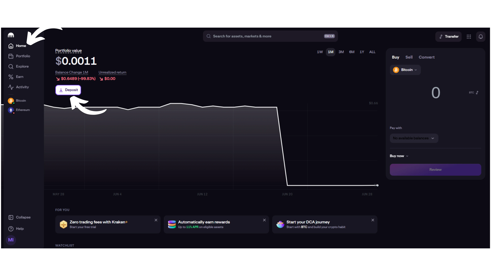

Quindi seleziona "Euro".

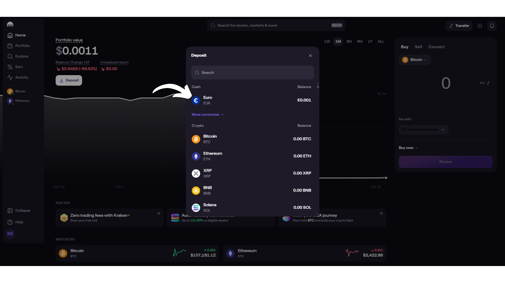

Nella schermata successiva vengono proposti diversi modi per depositare gli euro, ma qui ci occuperemo del più comune, ossia il classico bonifico bancario SEPA.

A tal fine, seleziona "Manual Bank Transfer"("Bonifico bancario manuale").

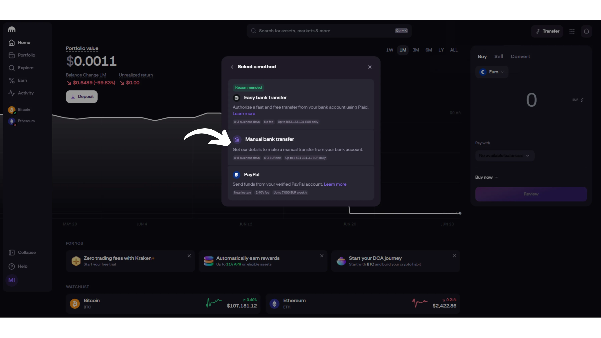

Clicca quindi su "SEPA & SEPA Instant".

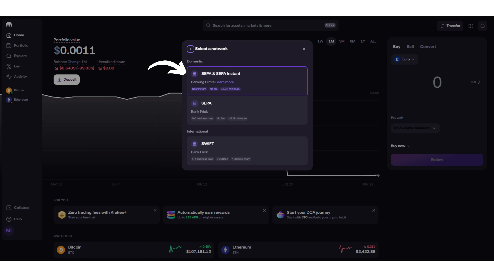

Infine, effettua un bonifico dalla tua banca utilizzando le coordinate bancarie fornite. **Si noti che il nome associato al conto bancario che effettua il bonifico deve essere lo stesso utilizzato per creare il conto Kraken**. Attendi (di solito qualche minuto) prima che i tuoi euro siano disponibili e appaiano sul tuo saldo Kraken.

*In questo esempio, depositeremo la somma di 21 euro sul conto Kraken per illustrare la parte di acquisto/vendita un po' più avanti*

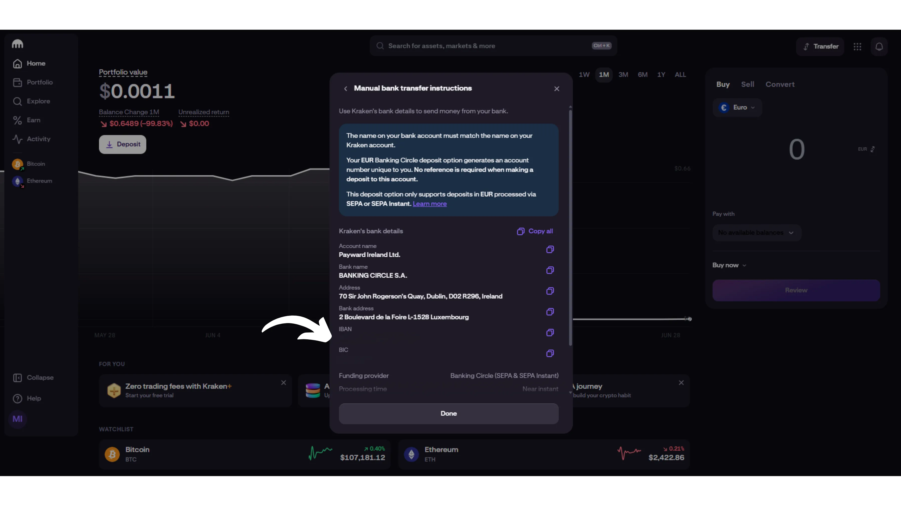

Se desideri prelevare euro o, più in generale, 'fiat' dalla piattaforma al tuo conto bancario personale, dovrai cliccare su "Transfer"("Trasferimento") nell'angolo in alto a destra dello schermo, quindi su "Withdraw"("Prelievo").

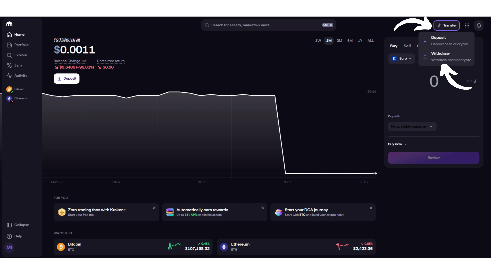

Seleziona la valuta desiderata.

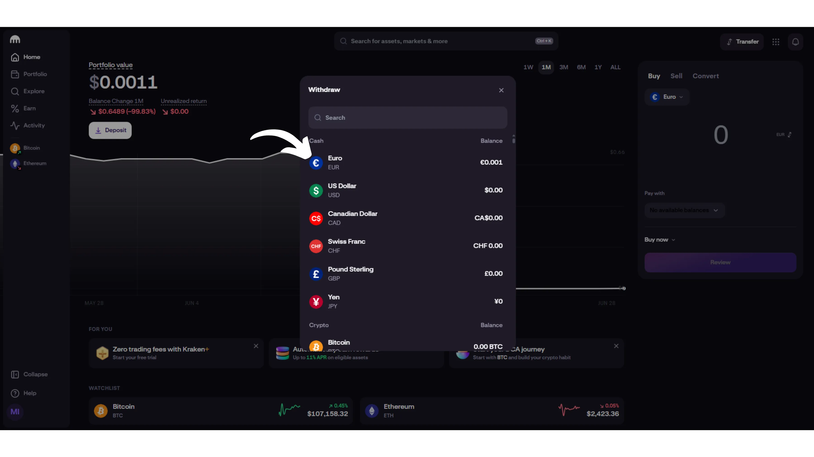

Poi, nel caso dell'euro, SEPA e SEPA Instant.

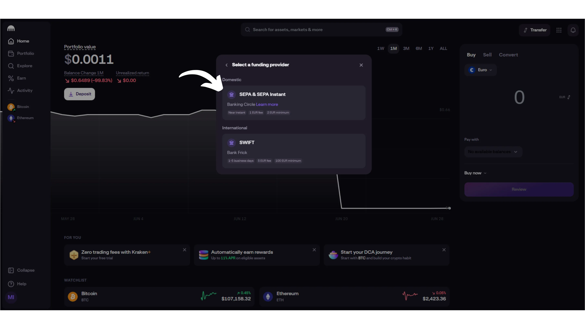

Quindi inserisci l'importo che si desideri prelevare da Kraken e le coordinate bancarie del conto che si desidera accreditare.

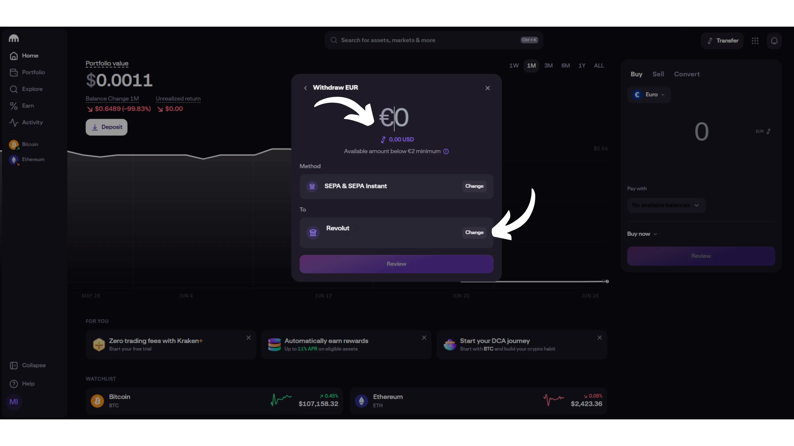

## 5 - Deposito e prelievo di bitcoin

Per depositare bitcoin su Kraken, si procede inizialmente come per il deposito di euro, cliccando su "Deposit"("Deposito") dalla schermata iniziale (anche il pulsante "Transfer"("Trasferimento") in alto a destra dà accesso alla funzione di deposito).

Questa volta, naturalmente, seleziona "Bitcoin".

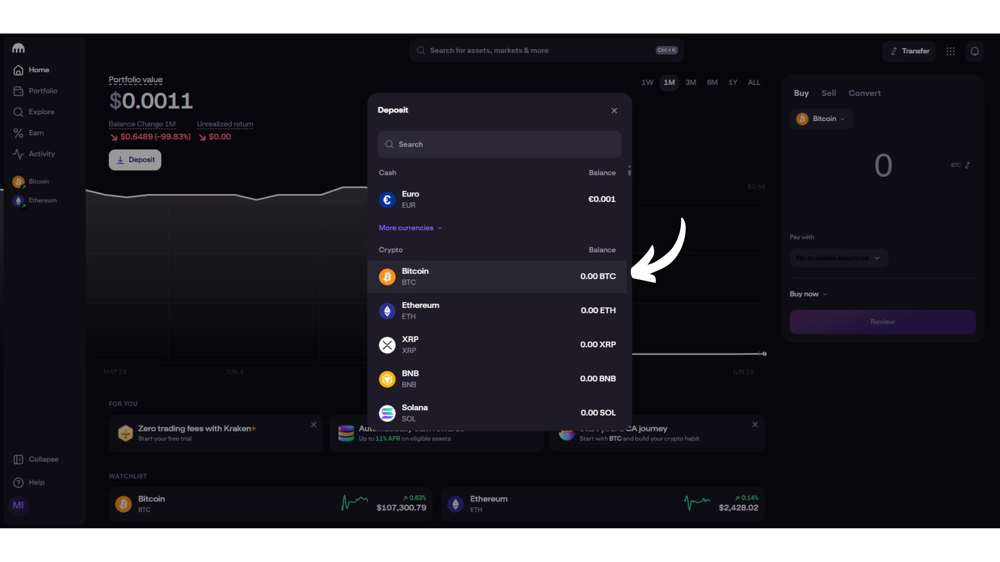

Quindi seleziona 'Lightning' o 'Bitcoin' e non considerare il resto: sono solo monete di scarto che non hanno nulla a che fare con il Bitcoin.

Come promemoria, la rete Lightning ti permette di scambiare Bitcoin istantaneamente e con una maggiore privacy, rispetto alla rete Bitcoin, che richiederà diverse decine di minuti prima che lo scambio sia considerato definitivo.

Se sei interessatio a Lightning Network, abbiamo anche un corso di formazione completo per aiutarti a capire come funziona:

https://planb.network/courses/34bd43ef-6683-4a5c-b239-7cb1e40a4aeb

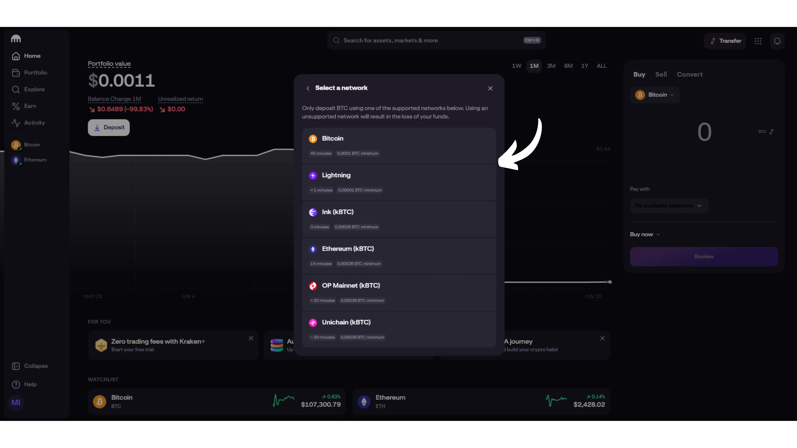

Appare un messaggio di avvertimento che ti dice di depositare solo Bitcoin all’indirizzo che ti verrà presentato nella schermata successiva. Ovviamente qui si usa solo Bitcoin, giusto? Clicca su "I understand"("Ho capito").

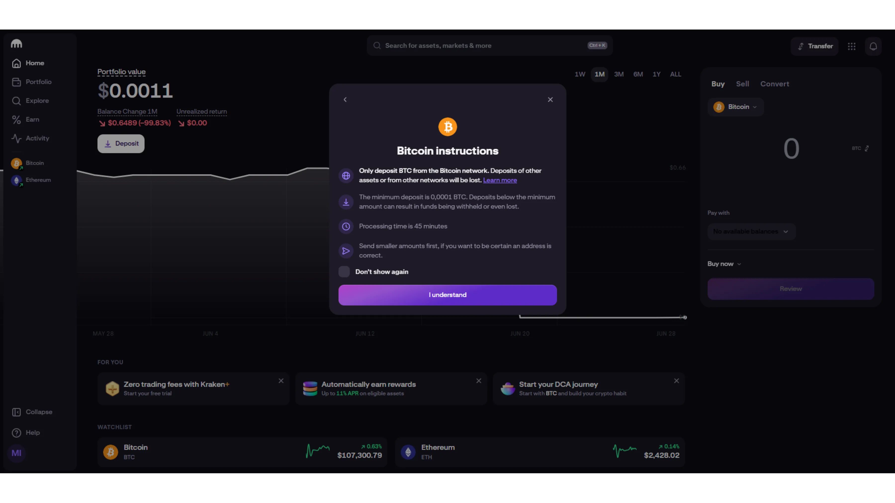

Scansiona il codice QR fornito con il tuo wallet Bitcoin preferito, oppure copia l’indirizzo se stai usando un wallet sullo stesso computer. **Ci vorranno 3 conferme (Kraken dice circa 45 minuti) prima che i fondi vengano accreditati sul tuo conto Kraken.**

*Per il nostro esempio, depositeremo l'equivalente di 21 dollari di bitcoin, che utilizzeremo per illustrare la parte di acquisto/vendita poco più avanti*

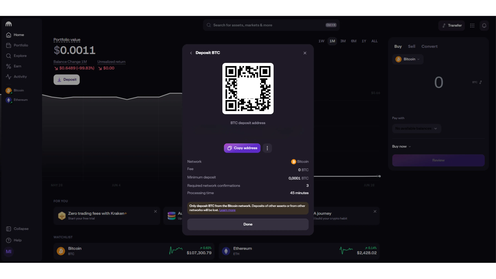

Per prelevare bitcoin da Kraken al tuo wallet personale per l'autodeposito, dovrai procedere inizialmente nello stesso modo descritto sopra per il prelievo di valuta fiat.

Clicca su "Transfer"("Trasferimento") nell'angolo in alto a destra e selezionare "Withdraw"("Prelievo").

Quindi seleziona "Bitcoin". *Qui si può vedere che i 21 dollari (19.580 satoshi) sono stati accreditati sul conto nel frattempo*.

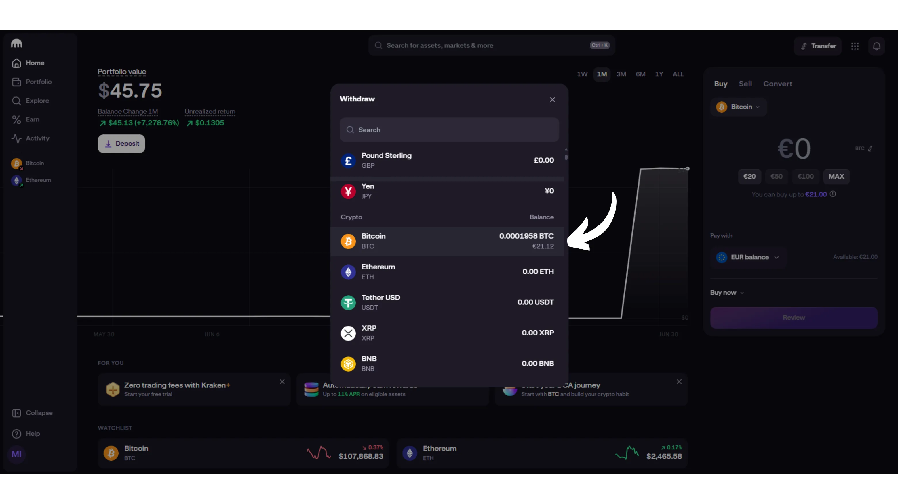

Poi seleziona 'Bitcoin' o 'Lightning' per scegliere il metodo per trasferire i tuoi preziosi satoshi su Kraken.

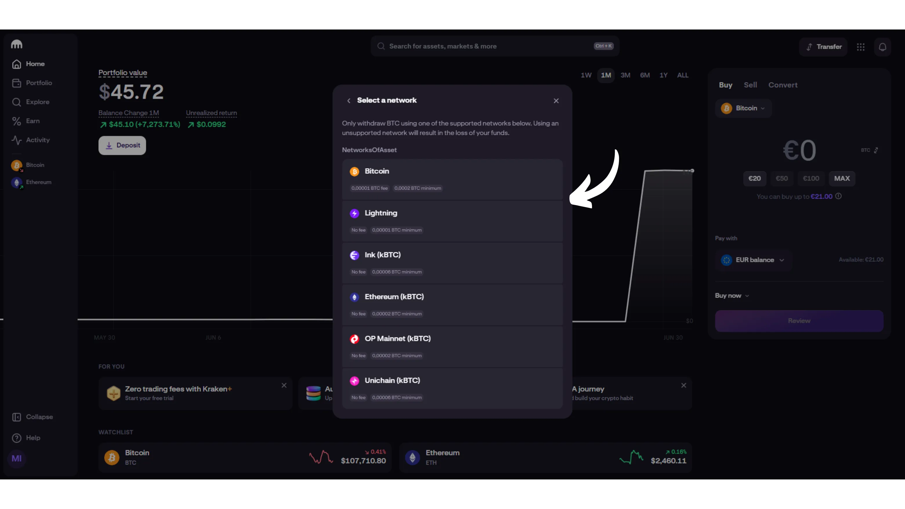

Infine, dovrai inserire il tuo Bitcoin Address e convalidarlo cliccando su un link che ti verrà inviato via e-mail, in modo che Kraken possa essere sicura che sei tu a richiedere il prelievo.

Inizia inserendo il tuo Address di prelievo e assegnandogli un nome a tua scelta. Questo Address può essere riutilizzato per i prelievi futuri, anche se non è una buona pratica dal punto di vista della privacy...

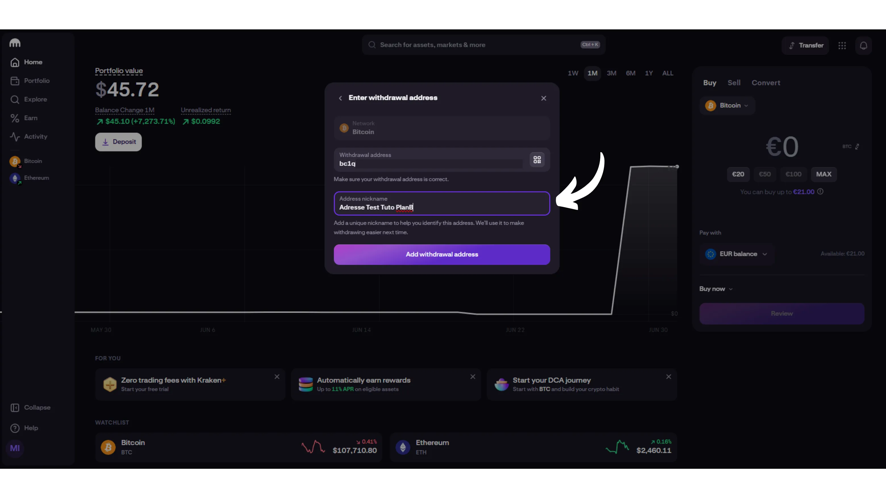

Una volta cliccato sul link inviato via e-mail, potrai indicare l'importo che desideri prelevare e convalidare l'operazione di prelievo.

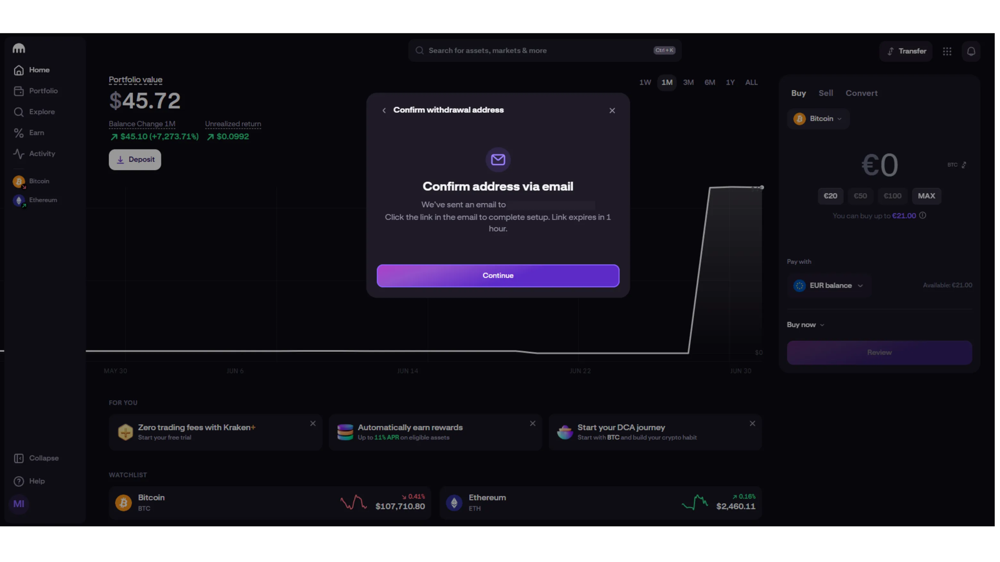

## 6 - Comprare e vendere bitcoin su Kraken

### 6.1 - Compravendita manuale

È facile acquistare e vendere su Kraken, tutto sul lato destro dello schermo.

Facciamo una prova e proviamo a comprare 10 € di Bitcoin grazie ai 21 € che abbiamo depositato sul nostro conto Kraken nel paragrafo **4 - Deposito e prelievo di euro (fiat)**.

Immetti l'importo e fare clic su "Review"("Rivedi").

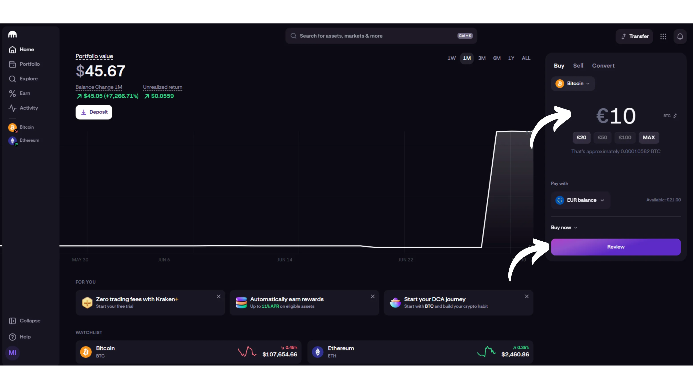

Viene mostrato un riepilogo dell'operazione che sta per essere avviata. Il riepilogo indica la quantità di bitcoin che acquisterai, il prezzo del Bitcoin al momento dell'acquisto e le commissioni applicate (0,1 euro o 1% in questo caso).

Clicca su 'Conferma' per acquistare i bitcoin.

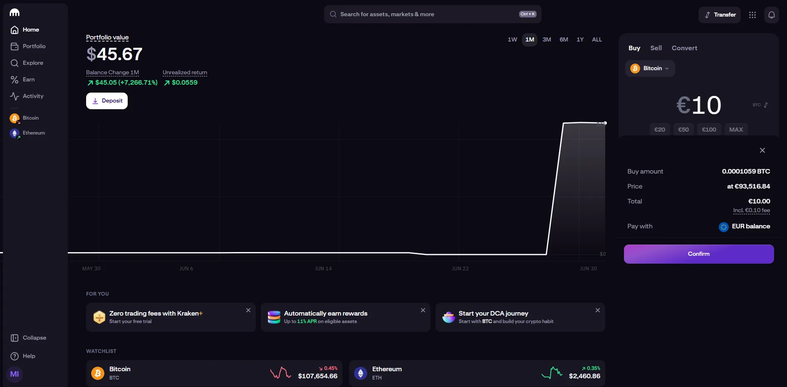

Ora sei il proprietario di 10 euro di Bitcoin. Beh, non proprio, perché finché i bitcoin sono su Kraken, non ti appartengono davvero...

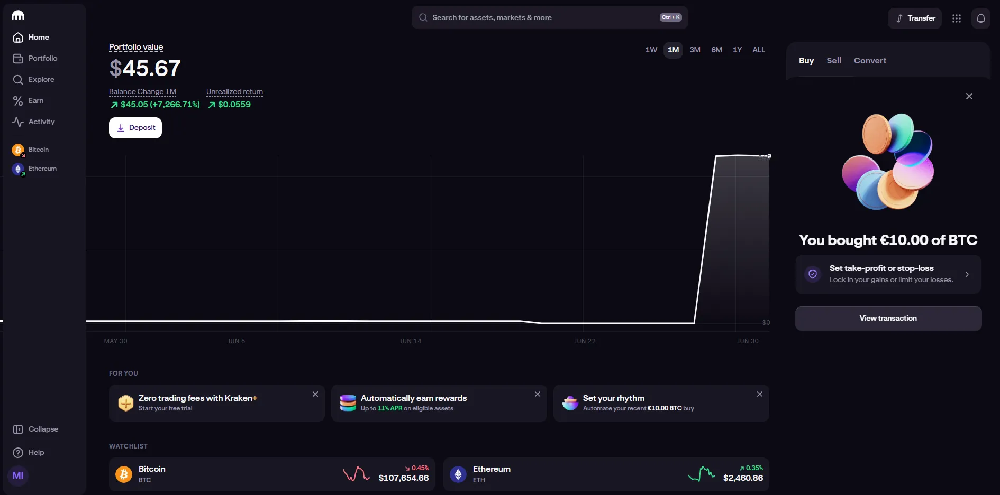

Per vendere, seguite lo stesso principio, ma selezionate Sell"("Vendi") nella parte superiore del riquadro di acquisto/vendita, poi "Review"("Rivedi") e infine "Confirm"("Conferma").

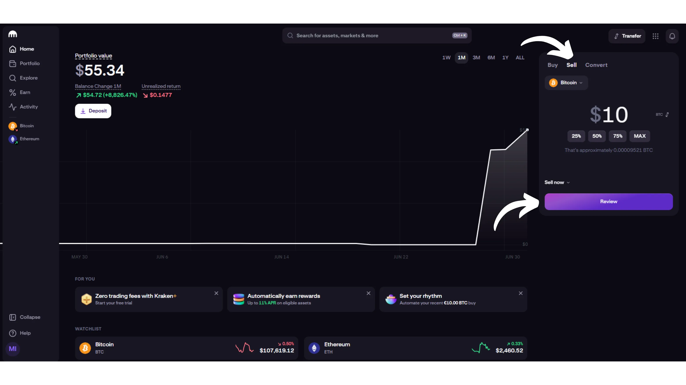

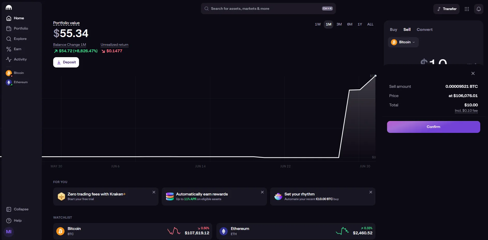

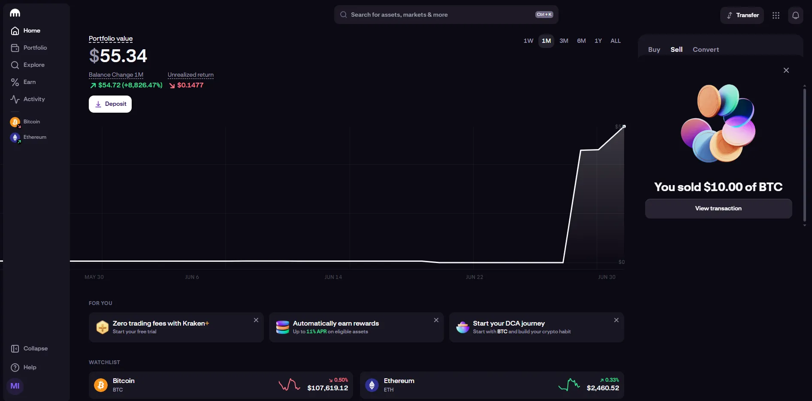

### 6.2 - DCA (acquisto e vendita automatizzati a tempo)

Una soluzione pratica per acquistare Bitcoin automaticamente, senza nemmeno dover accedere al proprio conto Kraken, è quella di impostare un DCA. Deposita una quantità di fiat sul tuo conto e imposta acquisti regolari che si attiveranno automaticamente a intervalli prefissati, finché il tuo portafoglio fiat sarà sufficientemente alimentato.

A tal fine, clicca su "Buy now"("Acquista ora") per visualizzare le varie opzioni, quindi scegli "Recuring"("Ricostruzione")

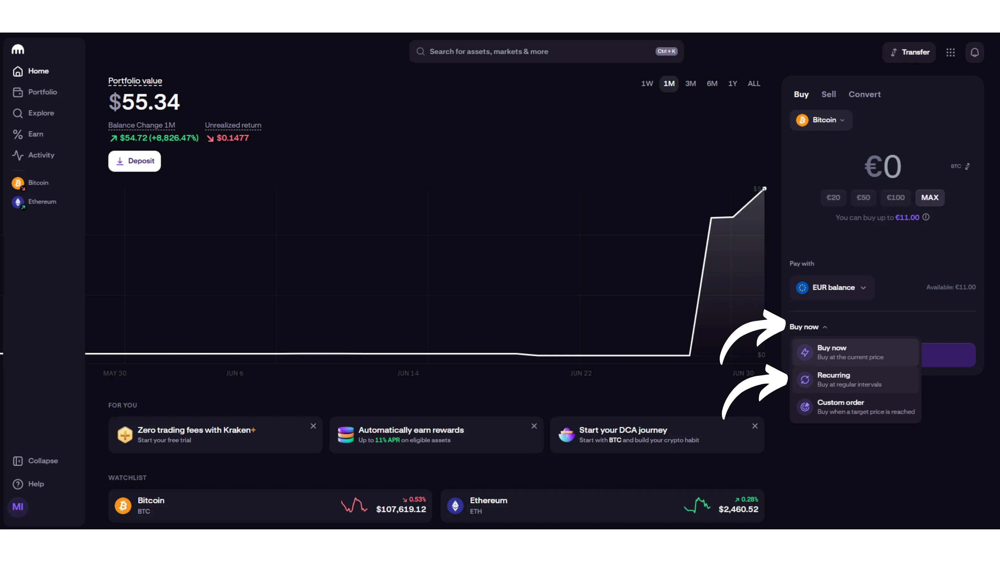

Scegli quindi l'importo e la frequenza di acquisto che desideri impostare. Nel nostro esempio, sceglieremo di acquistare 5 euro di Bitcoin ogni giorno. Clicca su "Review"("Rivedi"), quindi su "Confirm"("Conferma") per impostare l'acquisto regolare.

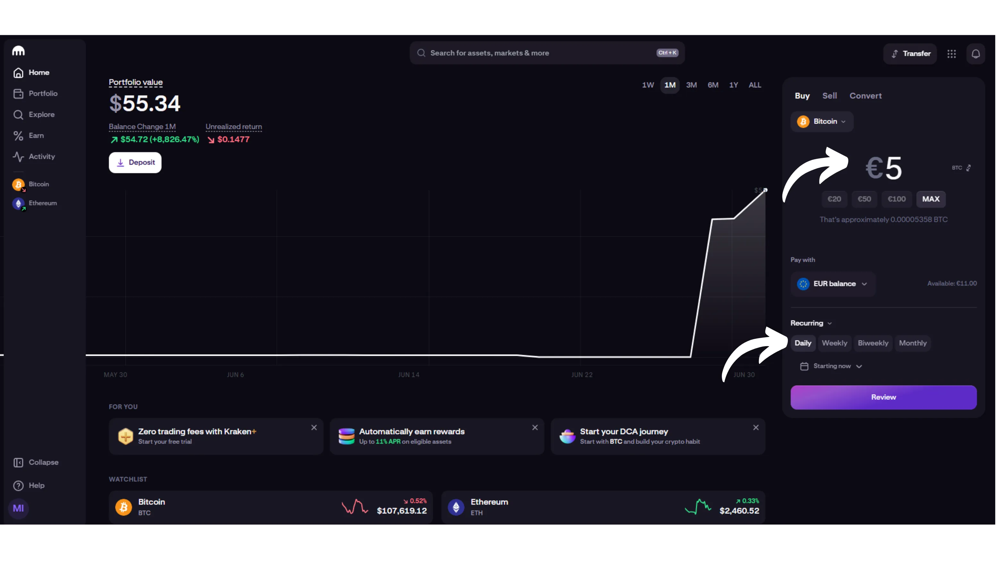

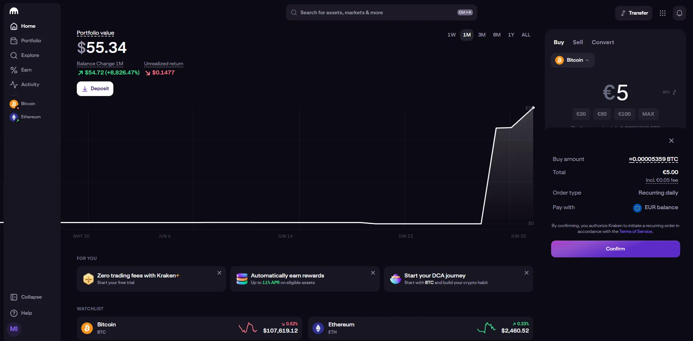

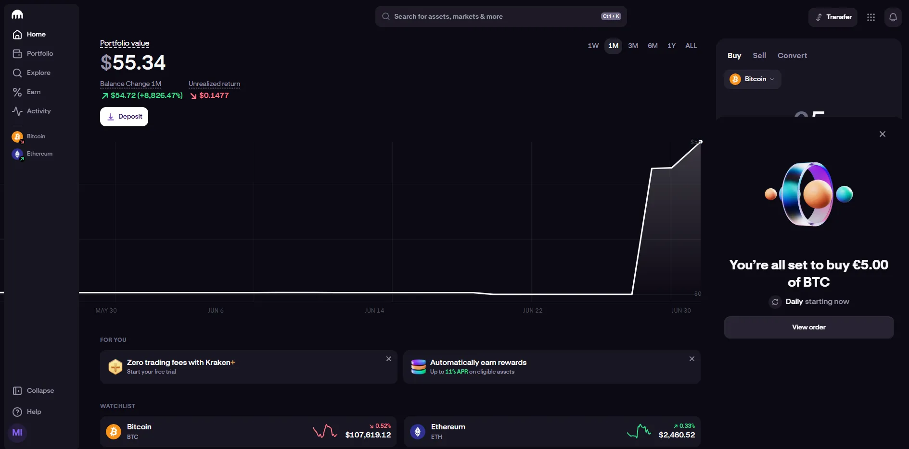

### 6.3 - Acquisto/vendita a prezzo fisso

L'ultimo modo per negoziare bitcoin su Kraken è quello di predeterminare un prezzo futuro al quale si desidera acquistare o vendere i propri preziosi satoshi.

Questa volta selezionare "Custom Order"("Ordine personalizzato").

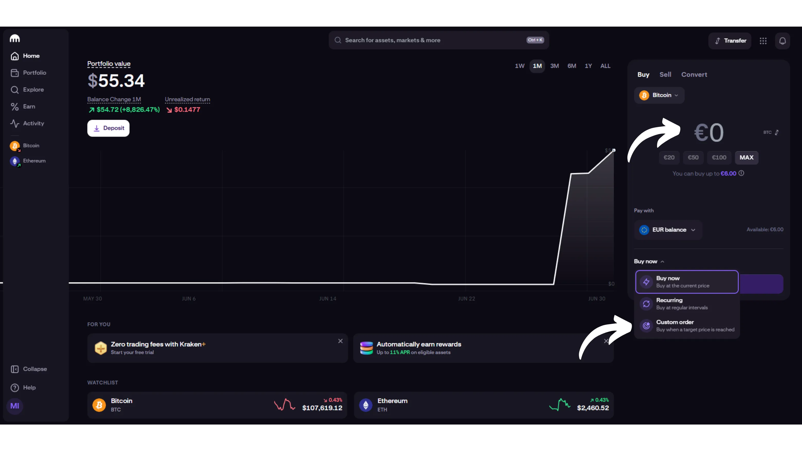

Indica quindi il prezzo target al quale desideri attivare l'acquisto/vendita e clicca su "Review"("Rivedi").

Ad esempio, scegliamo di acquistare 5 euro di Bitcoin a condizione che il prezzo scenda da 91.000 euro, al momento di questa esercitazione, a 75.000 euro.

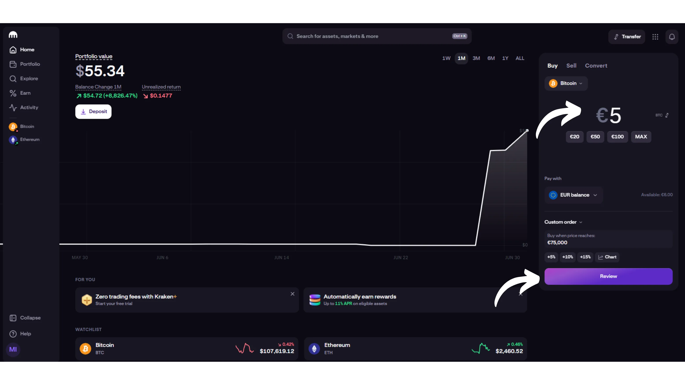

Infine, scegli "Confirm"("Conferma") per aprire la posizione.

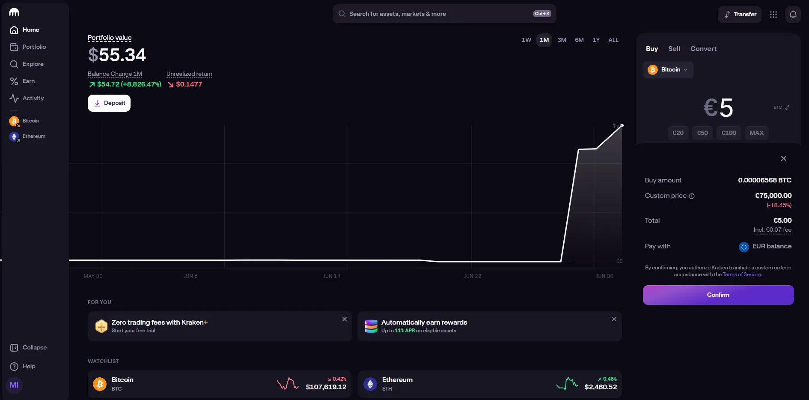

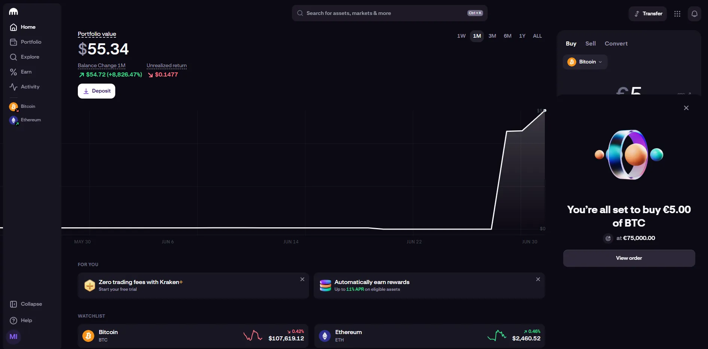

### 6.4 - Comprare / vendere tramite Kraken Pro

Kraken pro, che non è l'oggetto di questo tutorial, deve comunque essere discusso per un motivo importante. Si tratta di un Interface dedicato agli utenti avanzati piuttosto che ai semplici risparmiatori Bitcoin.

È molto meno snella della classica piattaforma Kraken e offre molte più opzioni rivolte principalmente ai trader.

Tuttavia, vale la pena notare che le commissioni applicate sono inferiori all' **1%** pagato da Interface **Kraken *simple***. In confronto, **Kraken Pro** offre le commissioni riportate di seguito.

Per spiegarlo brevemente, per acquisti/vendite di Bitcoin sotto i 10.000 USD al mese (che è il caso della maggior parte di noi), in qualità di "Taker" beneficiamo di commissioni dello 0,4%, cioè più di 2 volte inferiori a quelle di **Kraken *simple***.

Come "Maker", è ancora meglio, in quanto si beneficia di una commissione dello 0,25% - 4 volte più conveniente rispetto a Kraken ***simple***.

(A titolo informativo, siete "Taker" quando acquistate/vendete al prezzo di mercato e "Maker" quando create un ordine di acquisto/vendita a un prezzo diverso da quello di mercato).

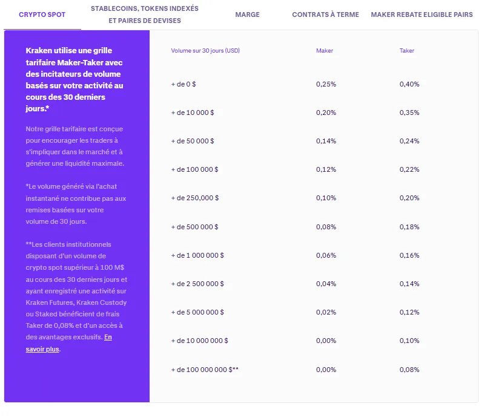

Per accedere a **Kraken Pro**, clica nell'angolo in alto a destra dello schermo sui 9 puntini disposti a quadrato e scegliere "Kraken Pro".

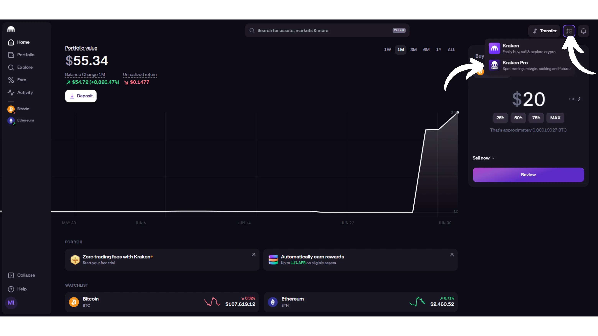

L'interfaccia cambia come mostrato di seguito.

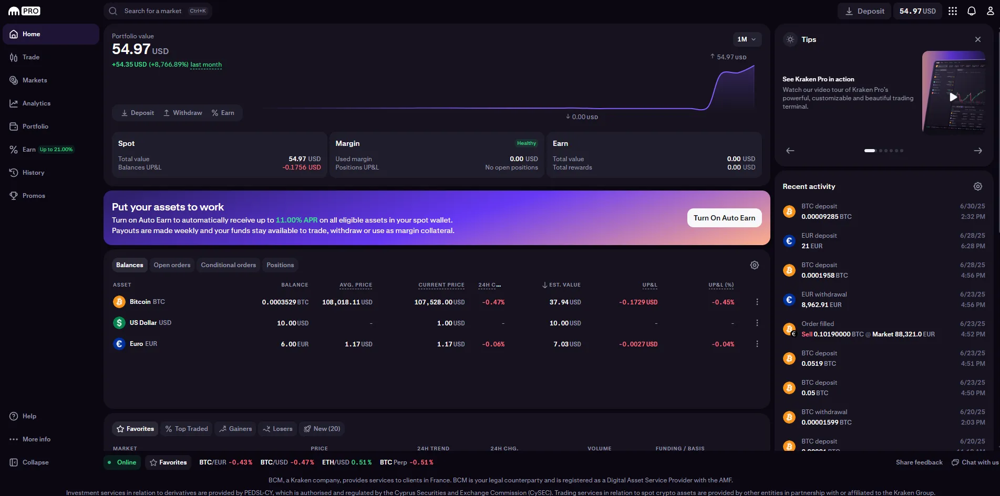

Per acquistare/vendere tramite **Kraken Pro**, clicca su "Trade"("Commercio") nell'angolo in alto a sinistra.

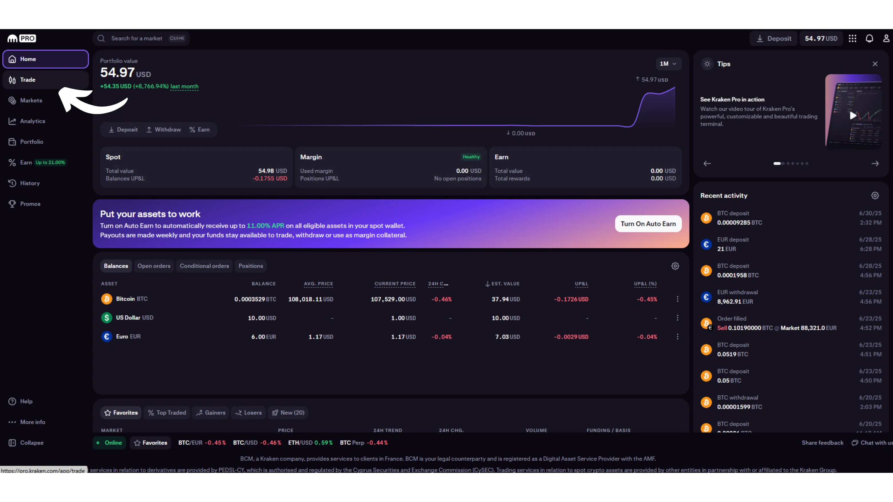

Quindi seleziona la coppia che desideri negoziare cliccando nell'angolo in alto a sinistra. Nel nostro caso, inseriremo la coppia BTC/EUR.

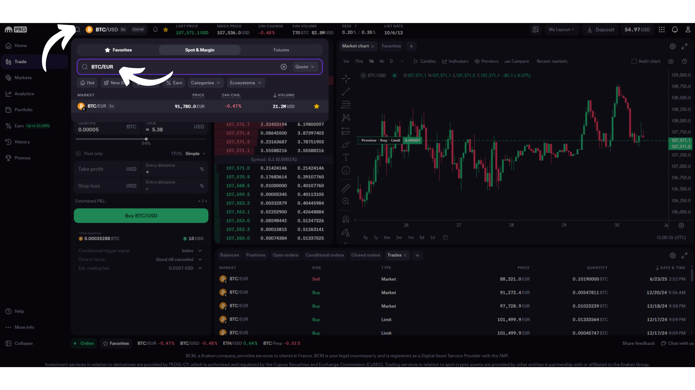

Per l'esempio, scegliamo di acquistare al prezzo di mercato selezionando "Mercato" e indichiamo l'importo che desideriamo acquistare, 5 euro. Ora siamo un "Taker". Concludiamo l'operazione cliccando su Acquista BTC/EUR.

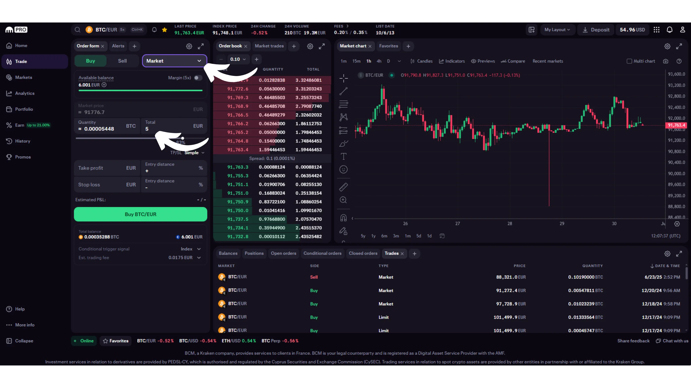

Possiamo vedere chiaramente che le commissioni applicate sono più di 2 volte inferiori a quelle che sarebbero state applicate su Kraken ***simple***. Per la stessa somma di 5 euro, avremmo pagato circa 0,05 euro di commissioni, contro gli 0,0175 euro del nostro caso.

Il processo di vendita di Kraken Pro è esattamente lo stesso e non verrà trattato in questa sede. Si tratta semplicemente di richiamare l'attenzione dell'utente sulle differenze di costo tra le due soluzioni.

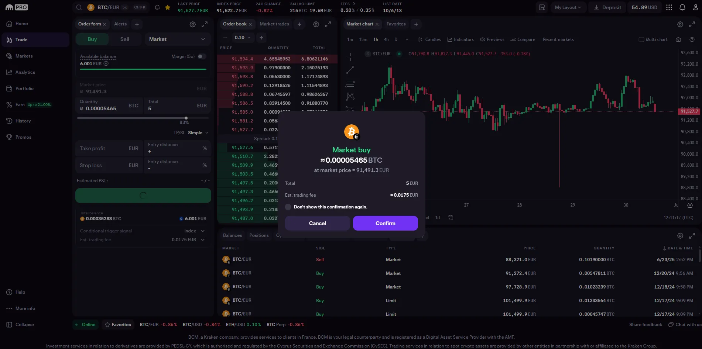

Siamo giunti alla fine di questo tutorial su come familiarizzare con la piattaforma Kraken. Grazie per l'attenzione!
