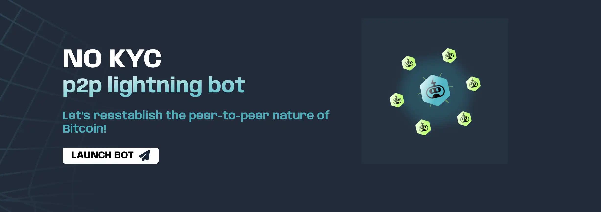
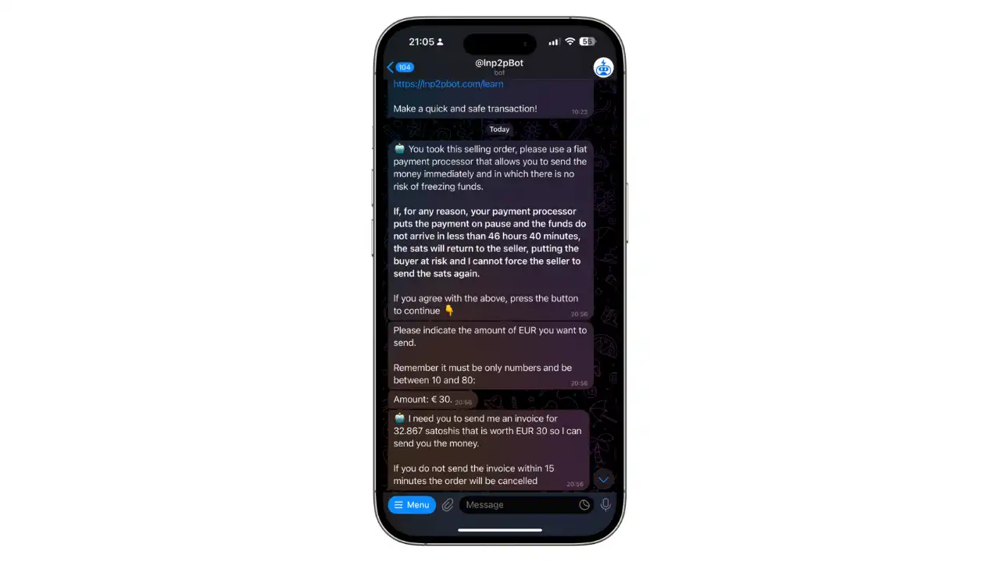
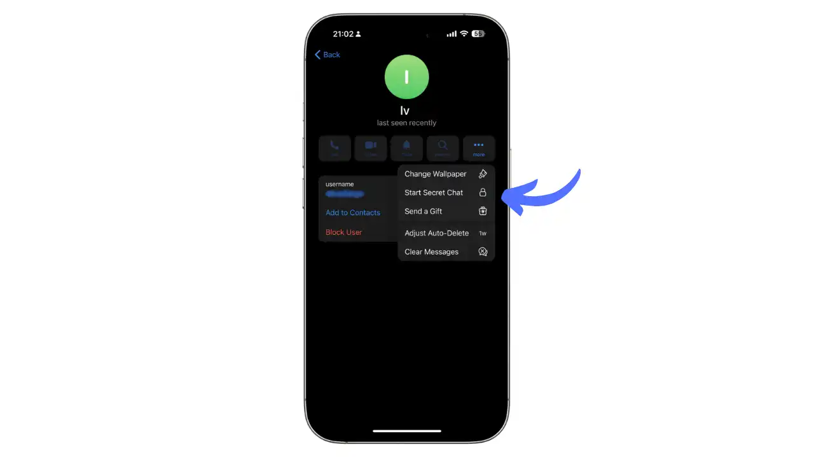
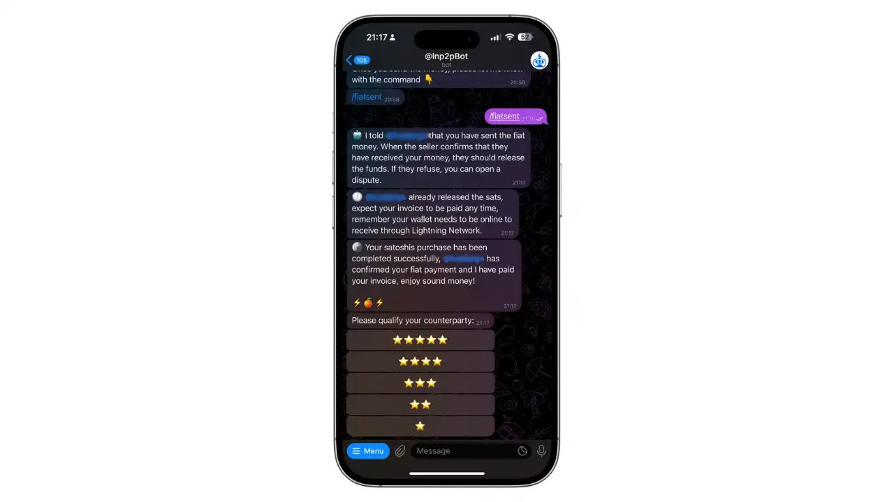
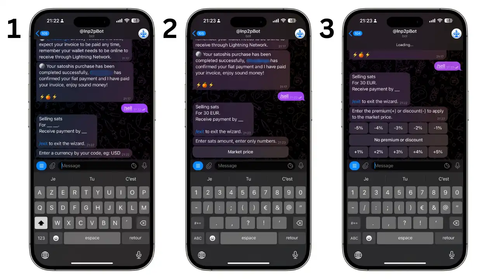
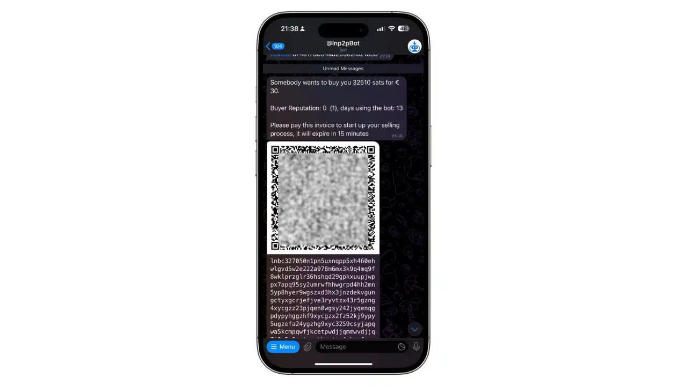

## Introduzione

Gli scambi peer-to-peer (P2P) senza KYC sono essenziali per preservare la riservatezza e l'autonomia finanziaria degli utenti. Permettono di effettuare transazioni dirette tra individui senza la necessità di verificare l'identità, il che è fondamentale per coloro che tengono alla privacy. Per una comprensione più approfondita dei concetti teorici, date un'occhiata al corso BTC204:

https://planb.network/courses/65c138b0-4161-4958-bbe3-c12916bc959c

La compravendita di bitcoin peer-to-peer (P2P) è uno dei metodi più privati per acquisire o cedere bitcoin. LNP2PBot è un bot Telegram open source che facilita gli scambi P2P sulla rete Lightning, consentendo transazioni veloci, a basso costo e senza KYC.

### Perché usare Lnp2pbot?

- Non è richiesto il KYC
- Transazioni veloci sulla rete Lightning
- Costi ridotti
- Interfaccia semplice tramite Telegram, una popolare applicazione di messaggistica accessibile da qualsiasi parte del mondo
- Sistema di reputazione integrato
- Deposito a garanzia automatico per un trading sicuro
- Supporto per più valute
- Comunità attiva e in crescita

### Prerequisiti

Per utilizzare Lnp2pbot, è necessario :

1. Portafoglio della rete Lightning (consigliato Breez, Phoenix o Blixt)

2. Applicazione Telegram installata (https://telegram.org/)

3. Un account Telegram con un nome utente definito

## Installazione e configurazione

### 1. Configurazione del portafoglio Lightning

Inizia installando un portafoglio Lightning compatibile. Ecco le nostre raccomandazioni dettagliate:

**wallet consigliati**

- [Breez](https://breez.technology):
  - Eccellente per i principianti
  - Interfaccia intuitiva e moderna
  - Non custodiale (il cliente mantiene il controllo dei propri fondi)
  - Perfettamente compatibile con Lnp2pbot
  - Disponibile su iOS e Android

Di seguito è riportato il link al tutorial di questo portafoglio:

https://planb.network/tutorials/wallet/mobile/breez-46a6867b-c74b-45e7-869c-10a4e0263c06

- [Phoenix](https://phoenix.acinq.co) :
  - Semplice e affidabile
  - Configurazione automatica dei canali
  - Supporto nativo per le fatture BOLT11
  - Eccellente per le transazioni quotidiane
  - Disponibile su iOS e Android

Di seguito è riportato il link al tutorial di questo portafoglio:

https://planb.network/tutorials/wallet/mobile/phoenix-0f681345-abff-4bdc-819c-4ae800129cdf

- [Blixt](https://blixtwallet.github.io) :
  - Più tecnico ma molto completo
  - Opzioni di configurazione avanzate
  - Perfetto per gli utenti esperti
  - Fonte aperta
  - Disponibile su Android

Di seguito è riportato il link al tutorial di questo portafoglio:

https://planb.network/tutorials/wallet/mobile/blixt-04b319cf-8cbe-4027-b26f-840571f2244f

**Note importanti su altri portafogli**

⚠️ **Importante**:Prima di vendere sats, assicurati che il tuo portafoglio supporti le fatture "hold", utilizzate dal bot come sistema di deposito a garanzia.

- **Wallet of Satoshi:**: Funziona bene per ricevere sats, ma può presentare ritardi nell'aggiornamento del saldo se una vendita viene annullata.
- **Muun**: Sconsigliato in quanto i pagamenti potrebbero non andare a buon fine a causa dei limiti delle commissioni di routing dei bot (massimo 0,2%).
- **Aqua**: Funziona per ricevere sats, ma può presentare lunghi ritardi (fino a 48 ore) nell'aggiornamento del saldo in caso di annullamento di una vendita.

💡 **Suggerimento**: Per un'esperienza ottimale, optate per i portafogli consigliati (Breez, Phoenix o Blixt).

⚠️ **Importante**: Non dimenticare di salvare le frasi di recupero in un luogo sicuro.

### 2. Come iniziare con Lnp2pbot

1. Fare clic su questo link per accedere al bot: [@lnp2pBot](https://t.me/lnp2pbot)

2. Telegram si aprirà automaticamente

3. Fai clic su "Start" oppure invia il comando "/start".

4. Il bot ti chiederà di creare un nome utente, se non ne hai già uno.

5. Il bot ti guiderà attraverso la configurazione iniziale.

### 3. Unisciti alla comunità

- Unisciti al canale principale: [@p2plightning](https://t.me/p2plightning)
- Supporto: [@lnp2pbotHelp](https://t.me/lnp2pbotHelp)

## Comprare e vendere Bitcoin

Esistono due modi principali per scambiare bitcoin su Lnp2pbot:

1. Sfogliare e rispondere alle offerte esistenti sul mercato

2. Creare la propria offerta di acquisto o di vendita

In questa guida vedremo nel dettaglio come :

- Acquistare bitcoin da un'offerta esistente
- Vendete bitcoin creando la vostra offerta

### Come acquistare i Bitcoin

**1. Trovare e selezionare un'offerta**

Sfoglia le offerte in [@p2plightning](https://t.me/p2plightning) e clicca sul pulsante "Buy satoshis"("Acquista satoshis") sotto l'annuncio che ti interessa.

**2. Convalidare l'offerta e l'importo**

1. Torna alla chat del bot.

2. Conferma la scelta dell'offerta.

3. Inserisci l'importo in valuta fiat che desideri acquistare.

4. Il bot ti chiederà di fornire una fattura Lightning per l'importo in satoshi.

**3. Contattare il venditore**

Una volta inviata la fattura, il bot ti mette in contatto con il venditore.

**4. Comunicazione con il venditore**

Clicca sul nickname del venditore per aprire un canale di chat privato dove potrete scambiarvi i dettagli del pagamento in fiat.

**5. Conferma del pagamento**

Dopo aver effettuato il pagamento in fiat, utilizzare il comando `/fiatsent` nella chat del bot. Una volta completata la transazione, sarà possibile valutare il venditore e la transazione sarà chiusa.

### Come vendere Bitcoin

**1. Creare un'offerta di vendita**

Per creare un'offerta di vendita, è sufficiente utilizzare il comando :

`vendere`

Il bot vi guiderà passo dopo passo:

1. Scegli la tua valuta.

2. Indica la quantità di satoshi da vendere.

3.Per quanto riguarda il prezzo, hai due opzioni:

   - Imposta un prezzo fisso per la quantità di satoshi.
   - Utilizzare il prezzo di mercato con la possibilità di applicare un premio (positivo o negativo)

💡 **Tip**: Il premio consente di regolare il prezzo in relazione al prezzo di mercato. Ad esempio, un premio di -1% significa che state vendendo all'1% in meno rispetto al prezzo di mercato.

**2. Conferma della creazione dell'ordine**

Una volta creato l'ordine, verrà visualizzata una conferma con l'opzione di annullare l'ordine utilizzando il comando `cancel`.

**3. Gestire le vendite**

- Quando un acquirente risponde alla tua offerta, riceverai una notifica con un codice QR e una fattura da pagare.
- Controlla il profilo e la reputazione dell'acquirente.

- Fai clic sul nickname dell'acquirente per aprire un canale di discussione privato.
- Comunica i dettagli del pagamento fiat all'acquirente.
- Attendi la conferma del pagamento in fiat da parte dell'acquirente.
- Controlla che il pagamento sia stato ricevuto sul vostro conto.

- Conferma la transazione con `/rilascio` e completare l'ordine. Avrai la possibilità di valutare l'acquirente.

## Buone pratiche e sicurezza

### Consigli per la sicurezza

- Inizia con piccole quantità.
- Controlla sempre la reputazione degli utenti.
- Usa solo i metodi di pagamento suggeriti.
- Mantieni tutte le comunicazioni nella chat del bot.
- Non condividere mai informazioni sensibili

### Sistema di reputazione

- Ogni utente ha un punteggio di reputazione
- Le transazioni riuscite aumentano il punteggio
- Scegli utenti con una buona reputazione.
- Segnalare ai moderatori qualsiasi comportamento sospetto

### Risoluzione delle controversie

1. In caso di problemi, mantenete la calma e la professionalità

2. Usare il comando `/dispute` per aprire un ticket

3. Fornire tutte le prove necessarie

4. Attendere un moderatore

## Confronto con altre soluzioni

Lnp2pbot presenta diversi vantaggi e svantaggi rispetto ad altre soluzioni di scambio P2P come Peach, Bisq, HodlHodl e Robosat:

### Vantaggi di Lnp2pbot

- **Nessun KYC richiesto**: A differenza di alcune piattaforme, Lnp2pbot non richiede la verifica dell'identità, preservando così la riservatezza dell'utente.
- **Transazioni veloci**: Grazie alla rete Lightning, le transazioni sono quasi istantanee.
- **Commissioni ridotte**: I costi di transazione sono inferiori a quelli degli scambi tradizionali.
- **Disponibilità mobile**: LNP2PBot è accessibile tramite Telegram, il che ne facilita l'uso sui dispositivi mobili.
- **Facile da usare**: L'interfaccia intuitiva di Lnp2pbot lo rende facile da usare, anche per gli utenti meno esperti.

### Svantaggi di Lnp2pbot

- **Dipendenza da Telegram**: L'uso di Lnp2pbot richiede un account Telegram, che potrebbe non essere adatto a tutti gli utenti.
- **Meno liquidità**: Rispetto a piattaforme più consolidate come Bisq, la liquidità può essere più limitata.

In confronto, soluzioni come Bisq offrono maggiore liquidità e un'interfaccia desktop, ma possono comportare commissioni più elevate e tempi di transazione più lunghi. Anche HodlHodl e Robosat offrono un trading senza KYC, ma con strutture di commissioni e interfacce diverse.

## Risorse utili

- Sito web ufficiale: https://lnp2pbot.com/
- Documentazione: https://lnp2pbot.com/learn/
- GitHub: https://github.com/lnp2pBot/bot
- Supporto: [@lnp2pbotHelp](https://t.me/lnp2pbotHelp)
