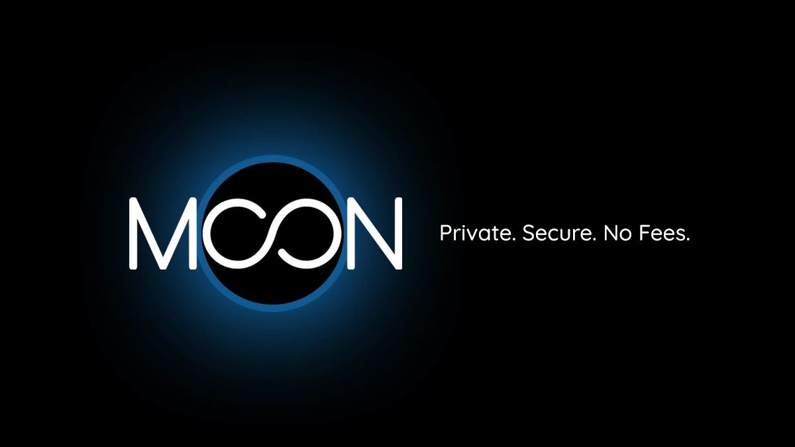

Moon mahdollistaa sen, että Bitcoin:n kaltaisilla kryptovaluutoilla voi ostaa KYC-vapaita virtuaalisia Visa- ja lahjakortteja, joita voi käyttää miljoonissa verkkokauppiaissa perinteisten pankkikorttien tapaan. Se tarjoaa siten yksinkertaisen tavan käyttää Sats:ta kaikkialla, missä Visa hyväksytään, ilman Exchange-alustan kautta kulkemista.

Tämä lähestymistapa kuvaa Moonin ensisijaista tavoitetta: tehdä Bitcoin:n käyttö suuren yleisön ulottuville helpottamalla jokapäiväisiä maksuja kaikkialla maailmassa samalla, kun odotetaan, että useammat kauppiaat hyväksyvät tämän maksuvälineen alun perin. Se on eräänlainen silta Bitcoin:n ja perinteisen pankkimaailman välillä. Tässä opetusohjelmassa kutsumme sinut tutustumaan tähän innovatiiviseen palveluun, sen konseptiin ja tärkeimpiin ominaisuuksiin, joita se tarjoaa.

## Hanki virtuaalikorttisi

Verkkomaksaminen on Internetin kehityksen aiheuttama vallankumous, joka lisää kaikkien maiden välistä vaihtoa niiden maantieteellisestä sijainnista riippumatta. Tässä yhteydessä kaksi jättiläistä erottuu erityisesti kansainvälisen kattavuutensa ansiosta: **Visa** ja Mastercard**. Näiden yritysten tavoitteena on tarjota pankkitileihin liitettyjä maksukortteja, joiden avulla käyttäjät voivat maksaa ja tehdä ostoksia.

Moon tuo mukanaan merkittävän innovaation: Bitcoin:n ja muiden kryptovaluuttojen käyttö virtuaalisten pankkikorttien käyttämiseen. Palvelu hyödyntää Visan infrastruktuuria, jotta voit saada uudelleenladattavia Bitcoin (Lightning) -kortteja avaamatta pankkitiliä tai antamatta mitään henkilötietoja tiettyihin käyttörajoihin asti.

Moonin avulla sinulla on todellinen silta bitcoinien ja Visa-korttimaksujärjestelmän välillä, joka hyväksytään useimmilla kauppiaiden sivustoilla. Voit käyttää bitcoinejasi :

- Ostokset sähköisen kaupankäynnin sivustoilla;
- Maksa tilauksesi verkossa ;
- Ja monia muitakin käyttötarkoituksia.

*Käyttäjäkokemuksen perusteella Moon X Visa -kortti toimii lähes kaikilla sivustoilla. Vain kourallinen kauppiaita ei näytä tukevan sitä, mutta tämä on poikkeuksellista.*

Siirry Moonin [viralliselle alustalle] (https://paywithmoon.com), napsauta sitten **"Rekisteröidy "**-painiketta, läpäise inhimillinen todentaminen (CAPTCHA) ja rekisteröidy syöttämällä sähköpostiosoitteesi Address ja salasanasi.

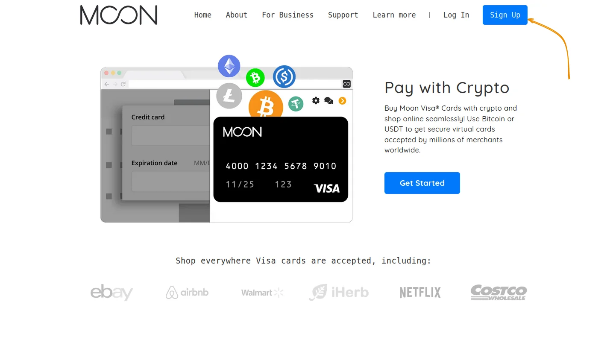

Huomaa, että tämä salasana on ainoa suoja, jonka avulla voit käyttää tulevan virtuaalikorttisi tietoja. Varmista, että valitset vahvan ja ainutlaatuisen salasanan.

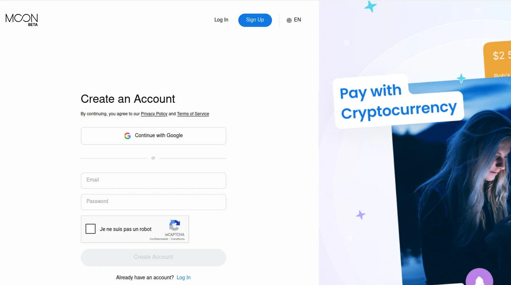

Kun tilisi on luotu, näet **"Dashboard "**:ssa seuraavat osiot:

- Myönnetty kuukausittainen käyttöraja, ennen kuin sinun täytyy tehdä KYC ;
- Kuun luottosaldo ;
- Tapahtumahistoria ;
- Uusien korttien lisääminen.

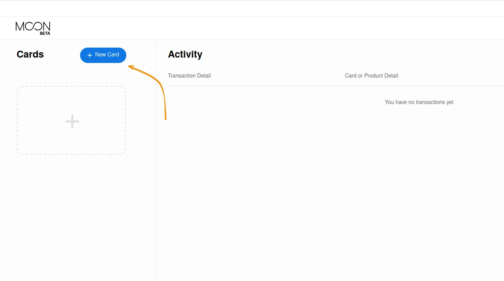

Saat uuden kartan napsauttamalla **"Uusi kartta "**-painiketta. Moon tarjoaa useita erilaisia karttatyyppejä:

- Moon 1X** Visa -kortti, henkilökohtainen virtuaalikortti, jota voi käyttää vain Yhdysvalloissa ja jota ei voi ladata uudelleen. Tällä kortilla voit käyttää enintään 1 000 dollaria ilman transaktiomaksuja;
- Moon X** Visa -kortti, henkilökohtainen virtuaalikortti, joka on saatavilla yli 147 maassa ja jonka kuukausittainen käyttöraja on 4 000 dollaria. Kortti on voimassa kolme vuotta, ja siitä peritään 1 prosentin transaktiomaksu, jonka vähimmäismäärä on 1 dollari transaktiota kohti.

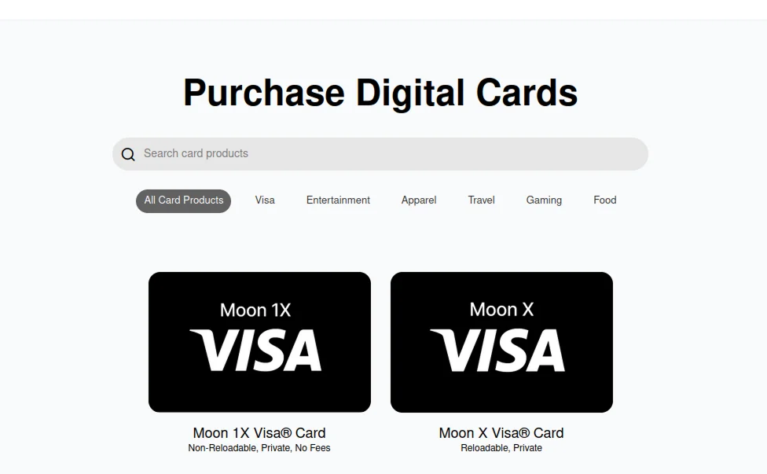

- Moon tarjoaa myös **lahjakorttipalvelun**, jonka avulla voit maksaa suoraan tietyistä tuotteista tai tilauksista, kuten Google Play Storesta, PlayStation Storesta ja monista muista.

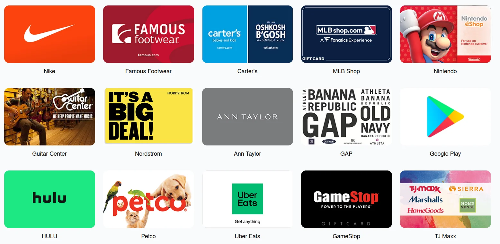

Tässä ohjeessa käytämme ***Visa Moon X*** -korttia. Hankintaprosessi on kuitenkin sama kaikille Moonin virtuaali- ja lahjakorteille.

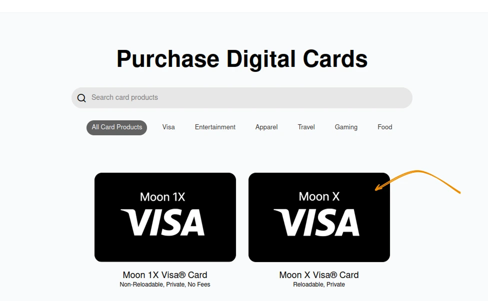

Klikkaa **Osta nyt**-painiketta ja hyväksy Visa-kortin käyttö- ja kelpoisuusehdot.

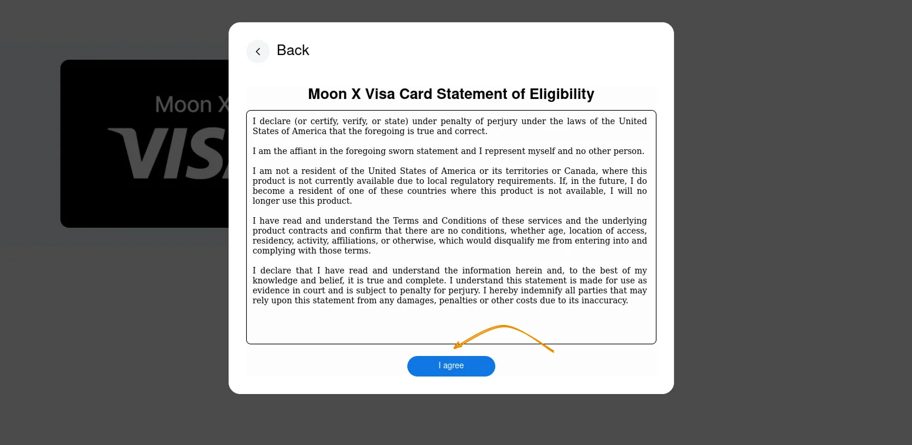

Onnittelut, olet juuri hankkinut ensimmäisen virtuaalikorttisi.

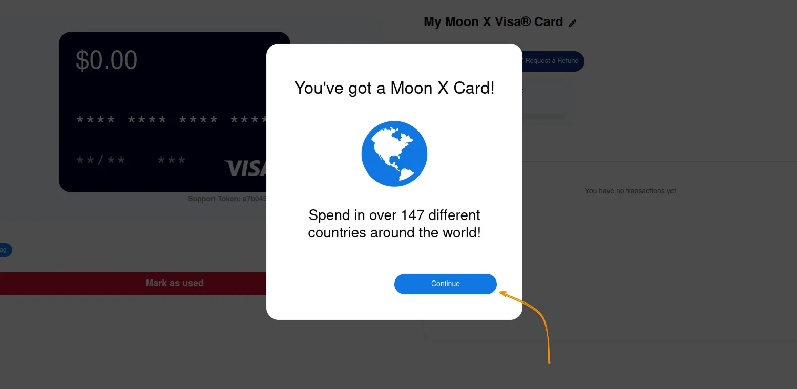

Voit ladata tämän virtuaalikortin Moon-hyvityksillä.

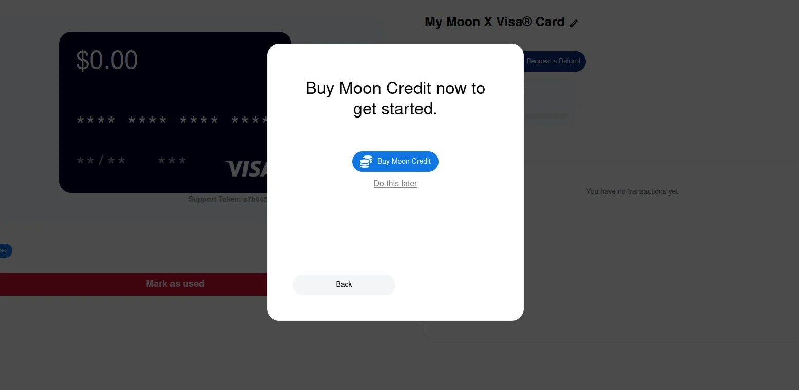

Kuten olet ehkä huomannut, tämän virtuaalikortin hankkiminen ei vaadi mitään henkilötietoja: tarvitset vain sähköpostiosoitteen Address ja salasanan. KYC vaaditaan vain, jos ylität kuukausittaiset käyttörajat.

## Lataa korttisi uudelleen

Moon-korttia ladataan Moon-krediiteillä, joita voit ostaa maksamalla :

- Bitcoin (salama),
- USDT (TRC-20, Tron-verkossa),
- USDC (Polygon-verkossa).

Kun Moon-virtuaalikorttisi on aktivoitu, voit ladata tilisi muutamassa hetkessä napsauttamalla **"Osta Moon Credits "** -painiketta tai kojelaudallasi näkyvää **"Moon Credits "** -saldoa.

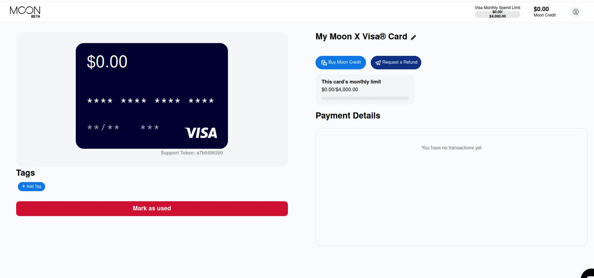

Vähimmäissumma on 5 USD per lataus, eikä Moon X -kortillesi ole asetettu ylempää latausrajaa. Aseta summa, jonka haluat ladata, ja maksa sitten Lightning Invoice -lataus.

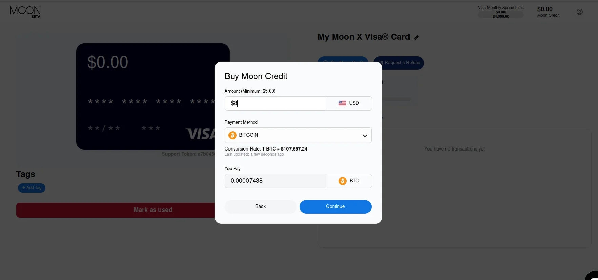

Korttiasi hyvitetään automaattisesti heti, kun Invoice Lightningin maksu on vahvistettu.

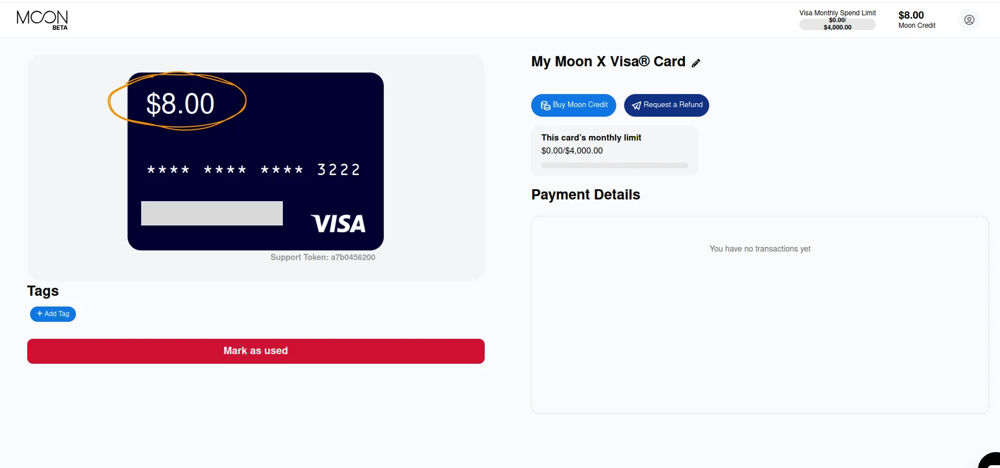

Tämän virtuaalikortin avulla voit maksaa tuotteista ja palveluista verkossa aivan kuten millä tahansa perinteisellä Visa-kortilla. Voit esimerkiksi osallistua uusimmalle Bitcoin Mining premium-kurssille, joka on saatavilla alustallamme. Vaikka tämä esimerkki on puhtaasti havainnollistava (koska hyväksymme jo nyt maksuja natiivibitcoineilla), se osoittaa, miten helppoa Moon-kortin käyttö on.

https://planb.academy/courses/the-world-of-bitcoin-mining-7750d9da-417a-4377-8e35-85c377168477

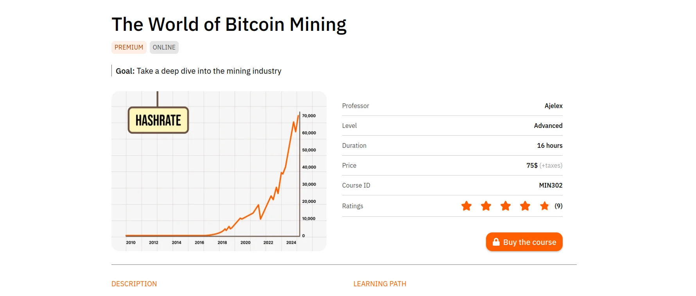

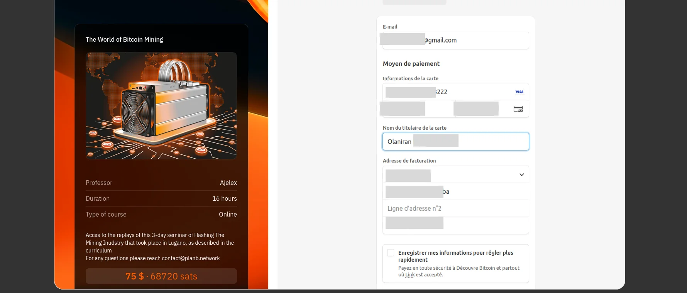

Tämän jälkeen voit tarkastella kaikkia maksutapahtumia kojelaudalla tai korttitietosivulla.

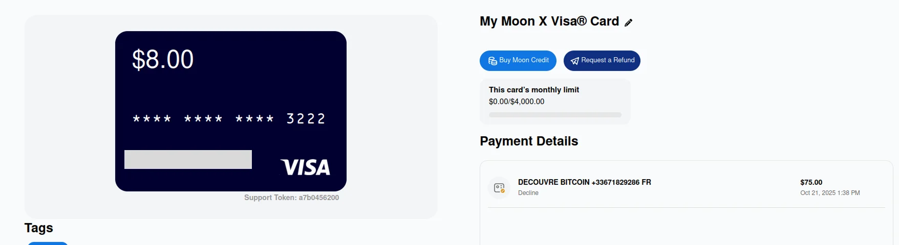

## Korttien järjestäminen

Moon on palvelu, jonka avulla voit käyttää useita kortteja samalla tilillä. Sinulla voi olla Moon Visa -kortti ja lahjakortteja, joilla on eri saldot, tai voit maksaa lahjakortteja Moon Visa X -kortilla.

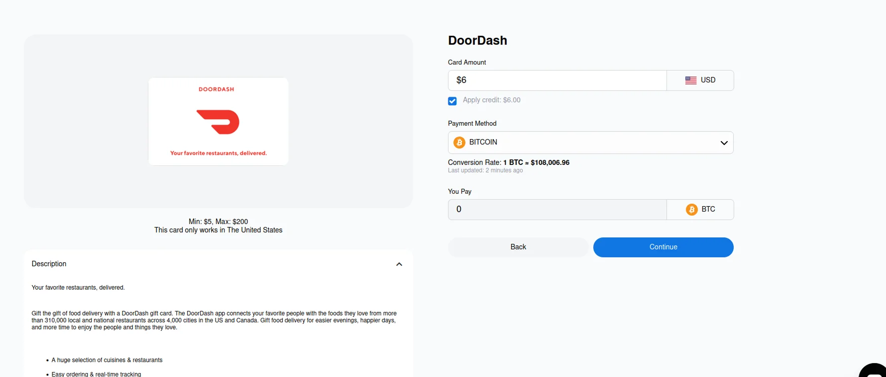

Kun rastitat kohdan **Käytä luottoa**, Moon veloittaa lahjakortin suoraan Visa-kortiltasi.

Sinulla on nyt Visan infrastruktuuriin perustuva virtuaalinen korttiprosessori, joka kunnioittaa luottamuksellisuuttasi ja suojaa tietojasi.

Kutsumme sinut myös tutustumaan Bitrefill-oppaaseemme, jonka avulla voit käyttää Bitcoin:ta suosikkipalvelujesi lahjakorttien maksamiseen:

https://planb.academy/tutorials/exchange/centralized/bitrefill-8c588412-1bfc-465b-9bca-e647a647fbc1