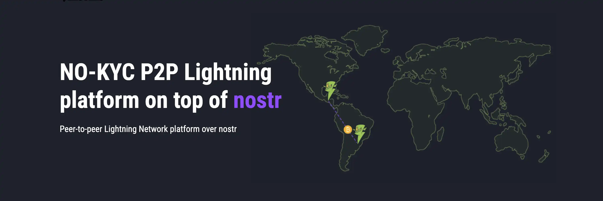


چگونه می‌توانید بیت‌کوین‌ها را بدون به خطر انداختن حاکمیت مالی خود خریداری یا بفروشید؟ پلتفرم‌های متمرکز، رویه‌های KYC تهاجمی را تحمیل می‌کنند که داده‌های شخصی شما را در معرض خطر قرار می‌دهد و امکان مسدود شدن حساب به صورت خودسرانه یا نظارت دولتی را فراهم می‌کند.


**Mostro P2P** یک جایگزین غیرمتمرکز ارائه می‌دهد که ترکیبی از Lightning Network، پروتکل Nostr و فاکتورهای نگهداری است. نوآوری اصلی آن: یک سیستم امانی خودکار که در آن بیت‌کوین‌های شما در طول Exchange تحت کنترل شما باقی می‌مانند و خطر سرقت، ورشکستگی Exchange یا مصادره خودسرانه را از بین می‌برد.


## Mostro P2P چیست؟


Mostro P2P یک پروتکل متن‌باز Bitcoin Exchange است که توسط **grunch**، توسعه‌دهنده ربات محبوب تلگرام **lnp2pbot** که در سال 2021 راه‌اندازی شد، ایجاد شده است. در حالی که lnp2pbot قبلاً مبادلات P2P بدون KYC را از طریق Lightning امکان‌پذیر کرده بود، یک آسیب‌پذیری عمده را نشان داد: **تلگرام یک نقطه شکست متمرکز است** که در معرض سانسور توسط دولت‌ها قرار دارد.


Mostro نمایانگر **تکامل غیرمتمرکز** این مفهوم است: با جایگزینی تلگرام با پروتکل **Nostr** (یک شبکه غیرقابل سانسور از رله‌های توزیع‌شده)، Mostro این ریسک سیستماتیک را از بین می‌برد. این پروتکل Lightning Network را برای تراکنش‌های فوری، Nostr را برای ارتباطات مقاوم در برابر سانسور، و **فاکتورهای نگهداری** را برای ایجاد یک سپرده‌گذاری خودکار و غیرامانی واقعی ترکیب می‌کند.


### معماری فنی


Mostro از طریق سه مؤلفه کار می‌کند:


- daemon Mostrod**: هماهنگ‌کننده تبادلات بین کاربران و Lightning Network
- گره Lightning**: ایجاد فاکتورهای معلق (~24 ساعت سپرده‌گذاری رمزنگاری‌شده)
- مشتریان Mostro**: رابط‌های کاربری (CLI، موبایل، وب)


سفارشات به عنوان رویدادهای عمومی (نوع 38383) در Nostr منتشر می‌شوند، در حالی که معاملات خصوصی از طریق پیام‌های رمزگذاری‌شده انتها به انتها (NIP-59، NIP-44) منتقل می‌شوند. هر نمونه Mostro هزینه‌های خود را تعریف می‌کند (معمولاً بین 0.3% تا 1%) و محدودیت‌های تراکنش (از چند هزار تا چند صد هزار Sats، بسته به نمونه) را تعیین می‌کند.


### مزایای قاطع


**مقاوم در برابر سانسور**: هیچ دولتی نمی‌تواند Mostro را تعطیل کند تا زمانی که رله‌های Nostr در جایی از جهان وجود داشته باشند. برخلاف lnp2pbot آسیب‌پذیر از طریق تلگرام، Mostro مبادلاتی را امکان‌پذیر می‌سازد که **ضد سانسور** هستند.


**سپرده‌گذاری غیر امانی**: فاکتورهای نگهداری لایتنینگ بیت‌کوین‌های شما را بدون انتقال دائمی قفل می‌کنند. وجوه شما تحت کنترل شما باقی می‌ماند و در صورت بروز مشکل به‌طور خودکار به شما بازگردانده می‌شود (~24 ساعت).


**محرمانگی به‌صورت طراحی‌شده**: دو حالت موجود است تا نیازهای شما را برآورده کند. حالت شهرت** شهرت شما را به کلید Nostr شما پیوند می‌دهد تا اعتماد پایدار ایجاد کند. حالت کاملاً خصوصی** به ناشناس بودن مطلق با کلیدهای موقت یک‌بار مصرف اولویت می‌دهد.


## ویژگی‌های اصلی


**ارتباط غیرمتمرکز**: تمام سفارشات از طریق رویدادهای امضاشده رمزنگاری‌شده در Nostr منتشر می‌شوند. مذاکرات خصوصی از طریق پیام‌های رمزگذاری‌شده سرتاسری منتقل می‌شوند و محرمانگی کامل را تضمین می‌کنند.


**سیستم اعتبار**: رتبه‌بندی ۵ ستاره با محاسبه تکراری که به‌طور دائمی در Nostr ذخیره می‌شود. به شما اجازه می‌دهد تا به‌تدریج به‌عنوان یک معامله‌گر قابل‌اعتماد اعتبار کسب کنید.


**داوری غیرمتمرکز**: در صورت بروز اختلاف، یک داور بی‌طرف شواهد را بررسی کرده و بر اساس معیارهای شفاف تصمیم‌گیری می‌کند. هر اختلاف یک token منحصر به فرد برای ردیابی ایجاد می‌کند.


**انعطاف‌پذیری پرداخت**: پشتیبانی از بسیاری از ارزهای فیات از طریق سرویس نرخ yadio.io Exchange. پذیرش انتقال‌های SEPA، پی‌پال، Revolut، نقدی و هر روش توافق شده بین طرفین.


## مشتریان Mostro در دسترس هستند


Mostro دو مشتری عملیاتی اصلی برای مبادلات P2P شما ارائه می‌دهد.


### Mostro CLI - مشتری خط فرمان


**Mostro CLI** بالغ‌ترین و کاربردی‌ترین کلاینت است. با استفاده از Rust نوشته شده و مجموعه کامل ویژگی‌های Mostro را از طریق خط فرمان Interface ارائه می‌دهد. سازگار با macOS، Linux و Windows.


**کنترل‌های اصلی** :


- `listorders`: نمایش تمام سفارشات موجود
- `neworder` : ایجاد یک سفارش خرید یا فروش جدید
- `takesell` / `takebuy`: گرفتن سفارش خرید یا فروش
- `fiatsent`: تأیید ارسال پرداخت فیات
- `release`: آزادسازی سپرده و نهایی‌سازی Exchange
- `getdm`: مشاهده پیام‌های مستقیم
- `rate` : ارزیابی همتای خود پس از Exchange


ایده‌آل برای کاربران فنی، اتوماسیون و محیط‌هایی که نیاز به حداکثر ایمنی دارند.


### برنامه موبایل Mostro - برنامه کاربردی گوشی هوشمند


نسخه آلفا **اپلیکیشن موبایل** امکان تجارت P2P را مستقیماً از طریق گوشی هوشمند شما فراهم می‌کند. رابط گرافیکی شهودی Interface با ناوبری تب‌دار، مشاهده سفارشات، فیلترهای پیشرفته و چت یکپارچه برای ارتباط با طرف‌های مقابل شما.


در دسترس برای **اندروید** (از طریق APK در GitHub)، این انتخاب بهینه برای کاربرانی است که سادگی و تجارت موبایلی گاه‌به‌گاه را ترجیح می‌دهند.


### Mostro-web - Interface وب (در حال توسعه)


برنامه وب پیشرفته Interface جاوا اسکریپت در حال توسعه فعال. طراحی شده برای ارائه یک تجربه کاربری کامل با قابلیت‌های گسترده مدیریت تجارت و پورتفولیو. دسترسی از طریق مرورگر بدون نیاز به نصب.


## نصب و پیکربندی


این آموزش شما را در نصب و استفاده از دو مشتری اصلی Mostro راهنمایی می‌کند: CLI و برنامه موبایل.


### پیش‌نیازهای اساسی


قبل از شروع، شما نیاز خواهید داشت به:


- یک Lightning Network** Wallet کارآمد با نقدینگی کافی (یا سازگار با Lightning)
 - توصیه‌شده: Phoenix، Breez، Wallet یا Satoshi...
 - حداقل 1000 ساتوشی نقدینگی برای آزمایش


https://planb.network/tutorials/wallet/mobile/phoenix-0f681345-abff-4bdc-819c-4ae800129cdf


- یک کلید خصوصی Nostr** (فرمت `nsec1...`)
 - ایجاد یک کلید معاملاتی اختصاصی در [nostrkeygen.com](https://nostrkeygen.com/)
 - مهم**: هرگز از کلید اصلی شخصی Nostr خود استفاده نکنید
 - کلید خصوصی خود را در یک مکان امن نگه دارید (مدیر رمز عبور)


- اختیاری اما توصیه‌شده**: اتصال VPN یا Tor برای مخفی کردن IP شما Address


https://planb.network/tutorials/computer-security/communication/mullvad-968ec5f5-b3f0-4d23-a9e0-c07a3e85aaa8

### نصب Mostro CLI


#### در macOS


**مرحله 1: تأیید Rust**


بررسی کنید که Rust نصب شده است (نسخه 1.64+ مورد نیاز است):


```bash
rustc --version
```


اگر Rust نصب نشده است :


```bash
curl --proto '=https' --tlsv1.2 -sSf https://sh.rustup.rs | sh
source $HOME/.cargo/env
```


**مرحله ۲: کلون کردن مخزن**


```bash
git clone https://github.com/MostroP2P/mostro-cli.git
cd mostro-cli
```


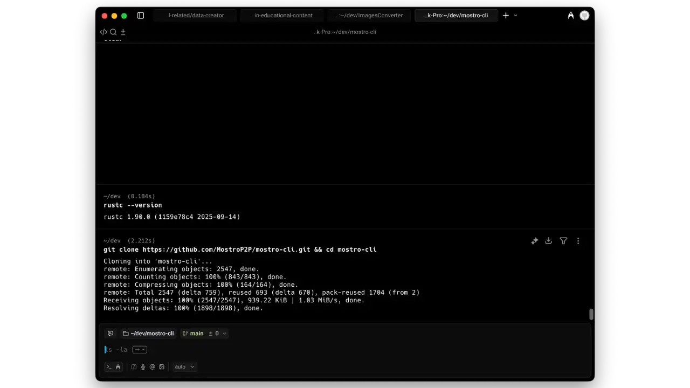


**مرحله 3: پیکربندی**


کپی و ویرایش کنید:


```bash
cp .env-sample .env
```


`.env` را باز کرده و تنظیمات خود را پیکربندی کنید:


```bash
# Public key of the Mostro instance (choose an instance)
# Main mainnet instance (recommended):
MOSTRO_PUBKEY='npub1ykvsmrmw2hk7jgxgy64zr8tfkx4nnjhq9eyfxdlg3caha3ph0skq6jr3z0'
# Alternative/test instance:
# MOSTRO_PUBKEY='npub19m9laul6k463czdacwx5ta4ap43nlf3lr0p99mqugnz8mdz7wtvskkm5wg'

# Your Nostr private key dedicated to trading
NSEC_PRIVKEY='nsec1votre_cle...'

# List of Nostr relays (use the same ones as the mobile app for synchronization)
RELAYS='wss://nos.lol,wss://relay.damus.io,wss://nostr-pub.wellorder.net,wss://nostr.mutinywallet.com,wss://relay.nostr.band'

POW='0'
```


**مهم برای CLI/موبایل** همگام‌سازی: برای دسترسی به سفارشات یکسان در CLI و اپلیکیشن موبایل، باید از **همان Mostro Pubkey** و **همان Nostr relays** در هر دو کلاینت استفاده کنید. این تنظیمات را در بخش تنظیمات اپلیکیشن موبایل بررسی کنید.


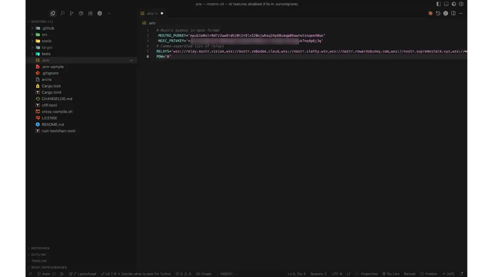


**مرحله ۴: نصب**


کامپایل و نصب CLI :


```bash
cargo install --path .
```


کامپایل کردن ۱-۲ دقیقه طول می‌کشد. فایل اجرایی `mostro-CLI` در مسیر `~/.cargo/bin/` نصب خواهد شد.


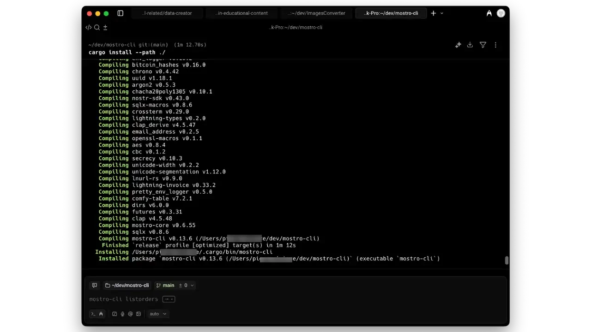


**مرحله ۵: بررسی کنید**


بررسی کنید که همه چیز کار می‌کند:


```bash
mostro-cli --help
```


شما باید لیست کامل سفارشات را ببینید.


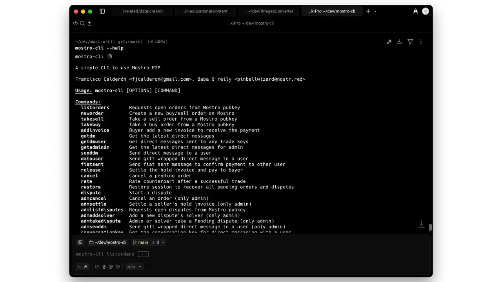


#### در لینوکس (اوبونتو/دبیان)


نصب مشابه macOS، با اضافه شدن:


```bash
sudo apt update
sudo apt install -y cmake build-essential pkg-config
curl --proto '=https' --tlsv1.2 -sSf https://sh.rustup.rs | sh
source $HOME/.cargo/env
git clone https://github.com/MostroP2P/mostro-cli.git
cd mostro-cli
cargo build --release
```


سپس مراحل ۳ و ۴ را در بخش macOS دنبال کنید.


#### روی ویندوز


ابتدا Rust را از طریق [rustup.rs](https://rustup.rs/) نصب کنید، سپس از PowerShell استفاده کنید:


```powershell
git clone https://github.com/MostroP2P/mostro-cli.git
cd mostro-cli
cargo build --release
```


پیکربندی یکسان: فایل `.env-sample` را به `.env` کپی کرده و پارامترهای خود را وارد کنید.


### نصب Mostro Mobile


#### روی اندروید


**مرحله 1**: به [صفحه انتشارهای GitHub](https://github.com/MostroP2P/mobile/releases) بروید و فایل **app-release.apk** (تقریباً 65 مگابایت) را دانلود کنید.


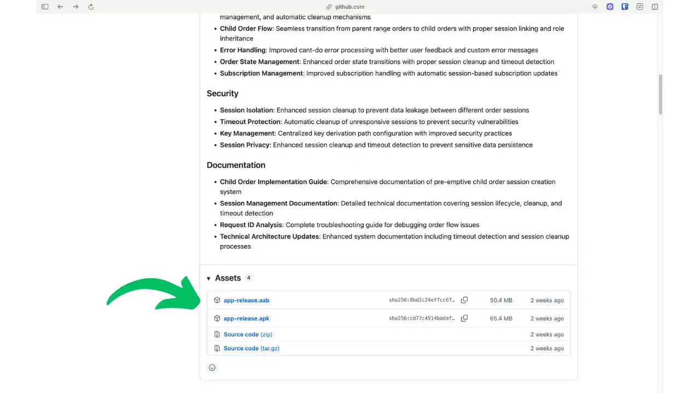


**مرحله ۲: پس از دانلود، فایل APK را از پوشه دانلودهای خود باز کنید. اندروید از شما می‌خواهد که نصب از این منبع را تأیید کنید.


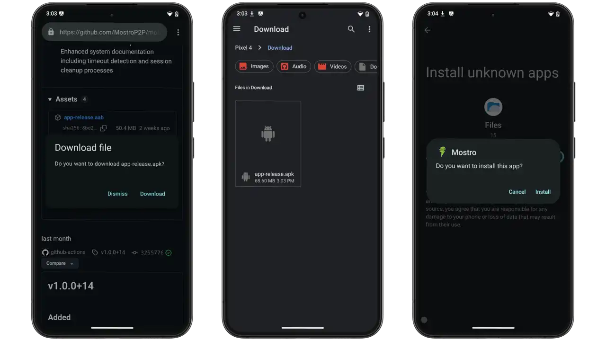


**مرحله 3**: صفحه‌های راه‌اندازی را دنبال کنید، که قابلیت‌ها را ارائه می‌دهند:


- تجارت Bitcoin به‌صورت آزاد - بدون KYC** : تجارت بدون تأیید هویت با استفاده از Nostr
- حریم خصوصی به‌صورت پیش‌فرض**: بین حالت شهرت و حالت حریم خصوصی کامل انتخاب کنید
- امنیت در هر مرحله**: حفاظت با فاکتورهای نگهداری غیر امانی


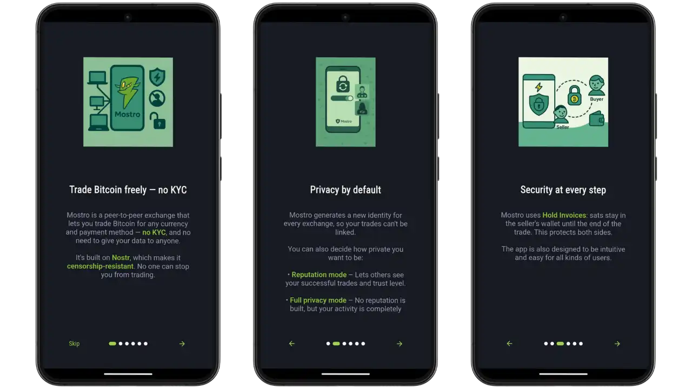


**مرحله ۴**: ادامه دهید به آشنایی برای کشف:


- چت کاملاً رمزگذاری‌شده**: ارتباط رمزگذاری‌شده سرتاسری
- یک پیشنهاد را بپذیرید**: دفتر سفارش را مرور کرده و یک پیشنهاد را انتخاب کنید
- نمی‌توانید آنچه را که نیاز دارید پیدا کنید؟** : سفارش سفارشی خود را ایجاد کنید


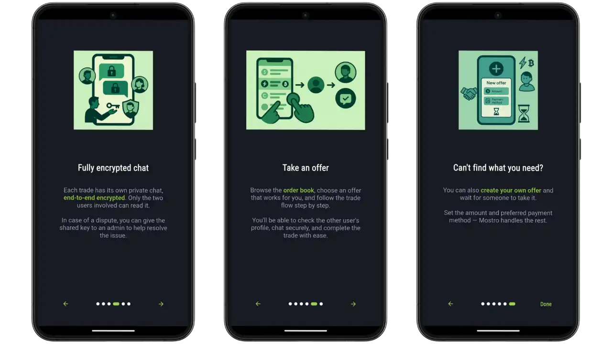


**مرحله ۵: پس از تکمیل فرآیند ورود، برنامه به‌طور خودکار یک جفت کلید Nostr تولید می‌کند. به منو (☰) بروید و سپس **حساب کاربری** را انتخاب کنید تا **کلمات محرمانه** خود (عبارت بازیابی) را ذخیره کنید. همچنین در این صفحه گزینه تغییر حالت حریم خصوصی که قبلاً ذکر شد، وجود دارد.**


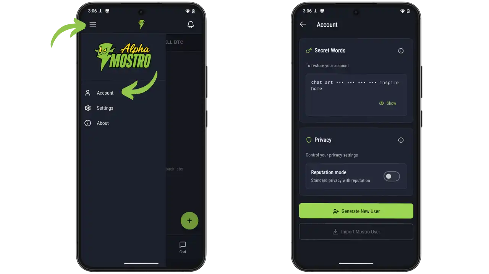


**مهم**: عبارت بازیابی خود را در مکانی امن یادداشت کنید (مدیر رمز عبور، گاوصندوق کاغذی).


### پیکربندی اولیه امنیتی


هر پلتفرمی که استفاده می‌کنید :


- کلید اختصاصی**: از یک هویت Nostr جداگانه برای معامله استفاده کنید
- مقادیر کم**: با کمتر از Sats 10,000 شروع کنید تا شروع کنید
- چندین رله**: پیکربندی ۳-۵ رله جغرافیایی متنوع
- محافظت از شبکه**: VPN یا Tor را فعال کنید تا IP شما پنهان شود Address
- Wallet امن**: قفل خودکار Wallet Lightning خود را فعال کنید


## استفاده با CLI


این بخش خرید بیت‌کوین‌ها از طریق Mostro CLI را با استفاده از یک مورد واقعی نشان می‌دهد.


### مرحله 1: فهرست سفارش‌های موجود را تهیه کنید


دستور `listorders` تمام سفارش‌های فعال را نمایش می‌دهد:


```bash
mostro-cli listorders
```


شما جدولی با جزئیات هر سفارش خواهید دید: شناسه، نوع (خرید/فروش)، مقدار، ارز، روش پرداخت.


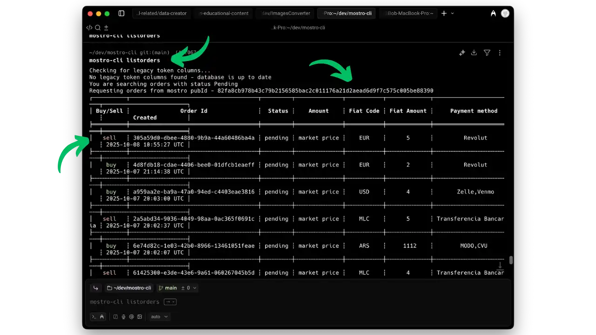


در این مثال، یک سفارش برای فروش 5 یورو از طریق Revolut قابل مشاهده است (ID: `305a59d0-dbee-4880-9b9a-44a60486ba4a`).


### مرحله 2: گرفتن سفارش


برای خرید این بیت‌کوین‌ها، سفارش را با `takesell` بگیرید:


```bash
mostro-cli takesell -o 305a59d0-dbee-4880-9b9a-44a60486ba4a
```


Mostro از شما خواهد خواست که یک **Lightning Invoice** ارائه دهید تا BTC را دریافت کنید. مقدار دقیق به ساتوشی مشخص خواهد شد (اینجا: 4715 Sats).


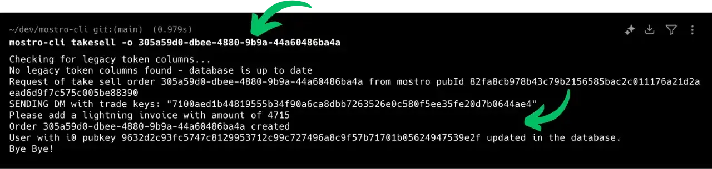


### مرحله 3: Lightning Invoice خود را ارائه دهید


generate یک Lightning Invoice از Wallet شما (Phoenix، Breez، و غیره) برای مقدار دقیق، سپس ارسال کنید :


```bash
mostro-cli takesell -o 305a59d0-dbee-4880-9b9a-44a60486ba4a --invoice lnbc47150n1p...
```


سیستم ارسال را تأیید می‌کند و به شما اطلاع می‌دهد که منتظر بمانید تا فروشنده مبلغ نگهداری Invoice را پرداخت کند قبل از اینکه سپرده‌گذاری فعال شود.


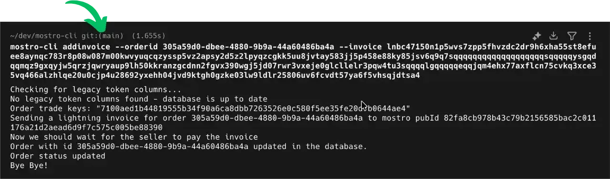


### مرحله ۴: با فروشنده تماس بگیرید


پس از فعال شدن سپرده‌گذاری، از `dmtouser` برای درخواست جزئیات پرداخت از فروشنده استفاده کنید:


```bash
mostro-cli dmtouser --pubkey 7100aed1b44819555b34f90a6ca8dbb7263526e0c580f5ee35fe20d7b0644ae4 \
--orderid 305a59d0-dbee-4880-9b9a-44a60486ba4a \
--message "Hey what's your revtag ?"
```


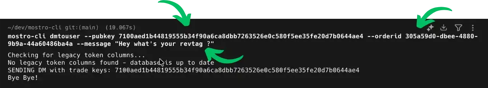


### مرحله ۵: پاسخ را بازیابی کنید


پیام‌های مستقیم را بررسی کنید تا پاسخ فروشنده را ببینید:


```bash
mostro-cli getdm
```


فروشنده شناسه پرداخت خود را به شما می‌دهد (در اینجا Revtag او: `@Satoshi`).


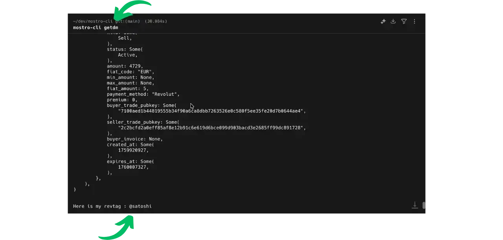


### مرحله 6: انجام پرداخت فیات


پرداخت را از طریق روش توافق شده (در این مثال Revolut) به جزئیات تماس ارائه شده ارسال کنید. **همه مدارک پشتیبان** (تصاویر صفحه، مراجع تراکنش) را نگه دارید.


### مرحله ۷: ارسال پرداخت را تأیید کنید


پس از انجام پرداخت، به Mostro اطلاع دهید:


```bash
mostro-cli fiatsent -o 305a59d0-dbee-4880-9b9a-44a60486ba4a
```


### مرحله 8: دریافت بیت‌کوین‌ها


به محض اینکه فروشنده دریافت ارز فیات را تأیید کند و با فرمان `release` امانت را آزاد کند، بلافاصله بیت‌کوین‌های خود را بر روی Lightning Invoice که ارائه کرده‌اید دریافت می‌کنید.


### مرحله 9: ارزیابی


فروشنده را ارزیابی کنید تا به شهرت غیرمتمرکز کمک کنید:


```bash
mostro-cli rate -o 305a59d0-dbee-4880-9b9a-44a60486ba4a -r 5
```


### دستورات مفید


**لغو سفارش** (قبل از اینکه گرفته شود) :


```bash
mostro-cli cancel -o <order-id>
```


**ایجاد یک سفارش فروش جدید** :


```bash
mostro-cli neworder -k sell -c eur -f 20 -m "Revolut" -p 2
```


**باز کردن یک اختلاف** :


```bash
mostro-cli dispute -o <order-id>
```


## استفاده با برنامه موبایل


این بخش فروش بیت‌کوین‌ها از طریق Mostro Mobile را با دنبال کردن یک مورد استفاده واقعی نشان می‌دهد.


### Interface اصلی


برنامه دارای ۳ برگه اصلی است:


- دفتر سفارش**: مرور سفارش‌های خرید (BUY BTC) و فروش (SELL BTC) موجود
- معاملات من**: سفارشات فعال و تاریخی خود را مشاهده کنید
- چت**: با استفاده از ارقام با همتایان خود ارتباط برقرار کنید


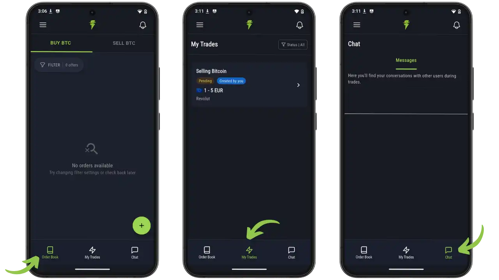


### پیکربندی پیشنهادی


قبل از معامله، چند تنظیم را از طریق منو (☰) > **تنظیمات** پیکربندی کنید:


- لایتنینگ Address** (اختیاری): برای دریافت مستقیم پرداخت‌ها
- رله‌ها**: برای افزایش مقاومت، چندین رله Nostr اضافه کنید (مثلاً `wss://nos.lol`، `wss://relay.damus.io`)
- Mostro Pubkey**: کلید عمومی نمونه Mostro که استفاده می‌کنید را بررسی کنید


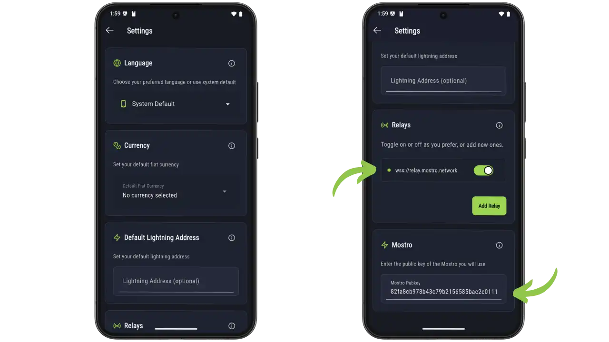


**مهم برای همگام‌سازی CLI/موبایل**: اگر از هر دو CLI و اپلیکیشن موبایل استفاده می‌کنید، **دقیقاً همان رله‌های Nostr و Mostro Pubkey** را در هر دو کلاینت پیکربندی کنید. بدون این پیکربندی یکسان، سفارشات مشابهی را در هر دو رابط مشاهده نخواهید کرد. رله‌ها و Mostro Pubkey که در تنظیمات (اسکرین‌شات بالا) قابل مشاهده هستند باید با آن‌هایی که در فایل `.env` دستگاه CLI شما هستند، مطابقت داشته باشند.


### مرحله 1: ایجاد یک سفارش فروش


دکمه **"+"** Green را در پایین سمت راست فشار دهید، سپس **SELL** (دکمه قرمز) را انتخاب کنید.


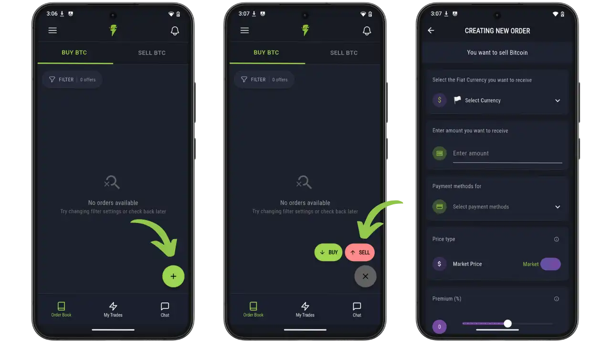


فرم ایجاد را پر کنید:


1. **ارز**: ارزی را که مایل به دریافت آن هستید انتخاب کنید (یورو، دلار، و غیره)


2. **مقدار** : مقدار را به ارز فیات وارد کنید (مثلاً 1 تا 3 یورو)


3. **روش‌های پرداخت** : روش را انتخاب کنید (مثلاً "Revolut")


۴. **نوع قیمت**: "قیمت بازار" را انتخاب کنید


۵. **پریمیوم**: تنظیم پریمیوم (نوار لغزنده از -۱۰٪ تا +۱۰٪، توصیه‌شده: ۰٪ برای فروش سریع)


برای انتشار سفارش خود، **ارسال** را فشار دهید.


### مرحله ۲: تأیید انتشار


سفارش شما اکنون منتشر شده است! این سفارش به مدت ۲۴ ساعت در دسترس خواهد بود. شما می‌توانید در هر زمانی قبل از اینکه خریداری آن را بپذیرد، با اجرای دستور `cancel` آن را لغو کنید.


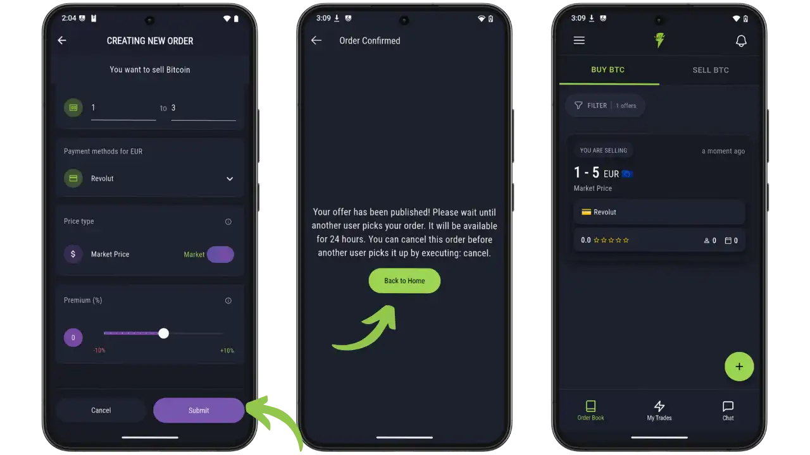


سفارش در برگه **معاملات من** با وضعیت "در انتظار" و نشان "ایجاد شده توسط شما" ظاهر می‌شود.


### مرحله 3: یک خریدار سفارش شما را می‌پذیرد


وقتی یک خریدار سفارش شما را می‌پذیرد، یک اعلان دریافت می‌کنید. جزئیات را در **معاملات من** ببینید.


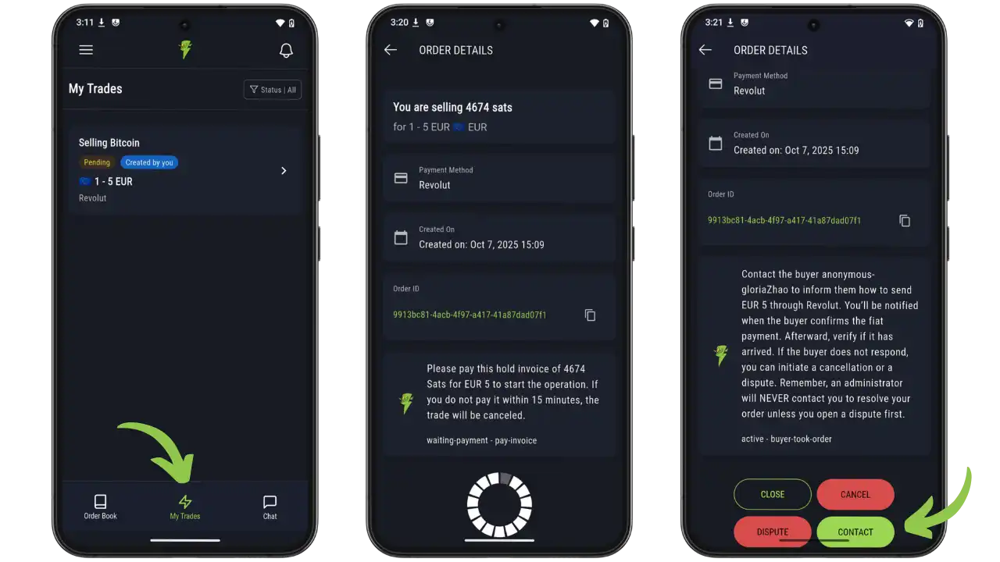


**دستورالعمل مهم**: اکنون باید **Invoice hold** نمایش داده شده را برای قفل کردن بیت‌کوین‌های خود (در اینجا 4674 Sats برای 1-5 یورو) در امانت پرداخت کنید. شما حداکثر **15 دقیقه** زمان دارید، در غیر این صورت Exchange لغو خواهد شد.


کپی کردن Invoice را نگه دارید و آن را از Wallet Lightning (Phoenix, Breez، و غیره) پرداخت کنید.


### مرحله 4: با خریدار ارتباط برقرار کنید


پس از فعال شدن سپرده‌گذاری، دکمه **تماس** را فشار دهید تا چت رمزگذاری‌شده با خریدار باز شود.


خریدار (در اینجا "anonymous-gloriaZhao") با شما تماس خواهد گرفت تا جزئیات پرداخت شما را درخواست کند. لطفاً با جزئیات خود (Revtag، IBAN، و غیره) پاسخ دهید.


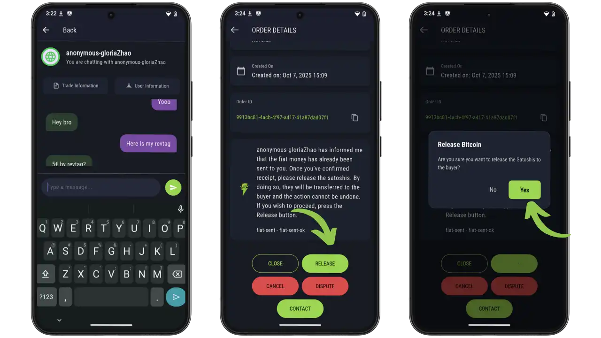


### مرحله 5: دریافت پرداخت فیات


صبر کنید تا پرداخت فیات به حساب Revolut شما (یا روش توافق شده دیگر) واریز شود. **با دقت بررسی کنید**:


- مقدار دقیق
- فرستنده
- ارجاع در صورت درخواست


خریدار از طریق چت به شما اطلاع خواهد داد که پرداخت را ارسال کرده است. Mostro همچنین پیامی نمایش خواهد داد که تأیید می‌کند فیات به شما ارسال شده است.


### مرحله 6: آزادسازی سپرده‌گذاری


پس از اینکه **دریافت** پرداخت فیات را در حساب خود **تأیید** کردید، دکمه **RELEASE** Green را فشار دهید و تأیید کنید تا ساتس‌ها را به خریدار ارسال کنید.


بیت‌کوین‌ها بلافاصله از طریق Lightning Invoice به خریدار منتقل می‌شوند.


### مرحله 7: ارزیابی ملاحظه


پس از انتشار، دکمه **RATE** را فشار دهید تا به خریدار امتیاز دهید. از ۱ تا ۵ ستاره انتخاب کنید (اینجا ۵/۵) و دکمه **Submit Rating** را فشار دهید.


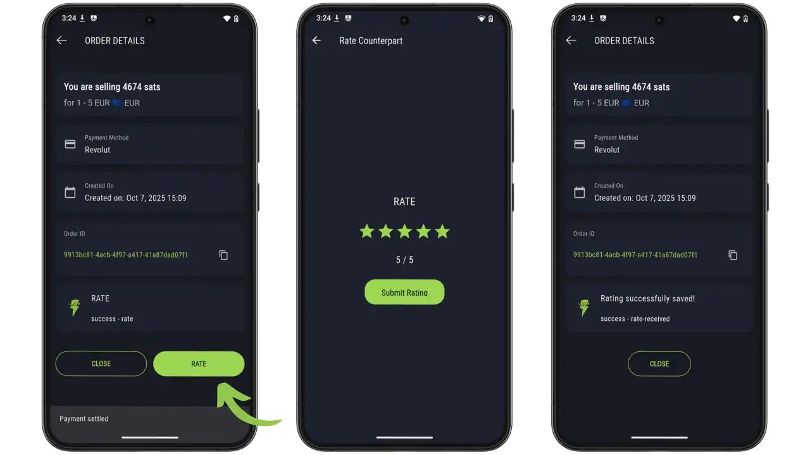


Exchange تمام شد!


### با استفاده از اپلیکیشن موبایل بیت‌کوین بخرید


فرآیند **خرید** بیت‌کوین مشابه است اما برعکس:


1. به **دفتر سفارش** > تب **خرید BTC** بروید تا سفارش‌های فروش را مشاهده کنید


۲. روی یک سفارش جالب کلیک کنید تا جزئیات را مشاهده کنید


۳. دکمه **ثبت سفارش** را فشار دهید


4. رعد و برق Invoice خود را ارائه دهید (تولید شده از Wallet شما)


۵. منتظر بمانید تا فروشنده سپرده‌گذاری را فعال کند


۶. برای جزئیات پرداخت با فروشنده از طریق **CONTACT** تماس بگیرید.


۷. پرداخت فیات را ارسال کنید (مدرک را نگه دارید)


۸. فروشنده پس از تأیید، سپرده را آزاد می‌کند


۹. بیت‌کوین‌ها را فوراً بر روی Lightning Invoice خود دریافت کنید


۱۰. به فروشنده امتیاز دهید (۱-۵ ستاره)


### مدیریت مشکل


**لغو سفارش**: در **معاملات من**، سفارش خود را فشار دهید و سپس دکمه **لغو** را فشار دهید (فقط قبل از اینکه سفارش گرفته شود در دسترس است).


**باز کردن اختلاف**: اگر اختلافی پیش آمد، در جزئیات سفارش روی **اختلاف** کلیک کنید. تمام شواهد (تصاویر چت، مراجع تراکنش بانکی) را ضمیمه کنید.


## مزایا و محدودیت‌ها


### مزایا


**حاکمیت مالی**: بیت‌کوین‌های شما هرگز به دلیل مکانیزم نگهداری Invoice از کنترل مستقیم شما خارج نمی‌شوند، که خطر ورشکستگی یا دزدی دریایی Exchange را از بین می‌برد.


**مقاوم در برابر سانسور**: هیچ مرجعی نمی‌تواند شبکه را تعطیل کند یا دستورات شما را سانسور کند. سیستم تا زمانی که رله‌های Nostr فعال هستند کار می‌کند.


**ناشناس بودن پیش‌فرض**: تنها یک کلید مستعار Nostr شما را شناسایی می‌کند، بدون KYC یا داده‌های شخصی. ارتباطات رمزگذاری‌شده از مبدا تا مقصد.


**انعطاف‌پذیری پرداخت**: هر روش پرداختی که به‌طور متقابل پذیرفته شود ممکن است (انتقالات، اپلیکیشن‌های موبایل، نقدی، مبادله).


### محدودیت‌ها


**توسعه اولیه**: رابط‌های ابتدایی و نیاز به یادگیری فنی.


**نقدینگی محدود**: تعداد محدود سفارشات، به ویژه برای مبالغ بزرگ یا ارزهای نادر.


**نیازمندی‌های فنی**: درک پایه‌ای از Lightning و Nostr مورد نیاز است.


**مسئولیت فردی**: در صورت بروز مشکلات، پشتیبانی متمرکز وجود ندارد، احتیاط لازم است.


## نتیجه‌گیری


Mostro P2P یک جایگزین امیدوارکننده برای صرافی‌های متمرکز است که Lightning Network، Nostr و سپرده‌گذاری خودکار را برای تجارت واقعاً غیرمتمرکز ترکیب می‌کند. علیرغم توسعه اولیه و نقدینگی محدود، این پلتفرم از هم‌اکنون حاکمیت مالی، مقاومت در برابر سانسور و ناشناس بودن پیش‌فرض را ارائه می‌دهد.


برای بیت‌کوینرهایی که خودمختاری و محرمانگی را ترجیح می‌دهند، Mostro یک گزینه قابل‌اعتماد و شایسته برای کاوش پیشرو است. معماری غیرمتمرکز آن تضمین می‌کند که تکامل به‌جای تجاری، جامعه‌محور باشد و راه را برای آینده‌ای از تبادلات واقعاً آزاد Bitcoin هموار می‌کند.


## منابع


### مستندات رسمی


- [وب‌سایت رسمی Mostro](https://mostro.network)
- [مستندات فنی](https://mostro.network/docs-english/index.html)
- [بنیاد Mostro](https://mostro.foundation)


### کد منبع و توسعه


- [مخزن اصلی GitHub](https://github.com/MostroP2P/mostro)
- [کلاینت وب](https://github.com/MostroP2P/mostro-web)
- [Customer CLI](https://github.com/MostroP2P/mostro-CLI)


### انجمن


- [پروتکل Nostr](https://nostr.com)
- [راهنماهای Lightning Network](https://lightning.network)