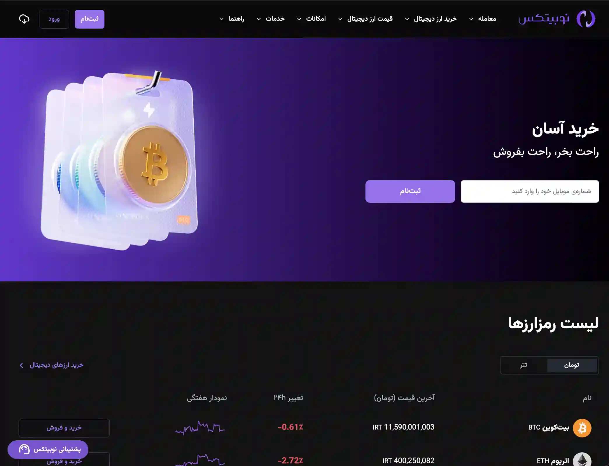

نوبیتکس یکی از صرافی‌های شناخته‌شده در ایران است که از سال 1396 برای انجام معاملات ارز دیجیتال تأسیس شد.
صرافی nobitex در اصل یک پلتفرم آنلاین است که خدمات خرید و فروش، استیکینگ، ییلدفارماینگ و فروش تعهدی را در اختیار مشتریان خود قرار می‌دهد.

> در نگه‌داشتن سرمایه‌ی خود در این صرافی احتیاط کنید.
> وب سایت نوبیتکس به‌عنوان یکی از بزرگترین صرافی‌های داخل کشور در 28 خرداد 1404 مورد حمله یک گروه هکری به نام گنجشک درنده قرار گرفت. طی این حمله، صرافی نوبیتکس در همان ساعات اولیه، 50 میلیون دلار از دارایی‌های خود را از دست داد.

این راهنما مطابق با راهنمای وب‌سایت رسمی نوبیتکس است، که میتوانید از [اینجا](https://nobitex.ir/help) آنرا ببینید.
## ۱ - ایجاد حساب کاربری در نوبیتکس
به وبسایت رسمی [نوبیتکس](https://nobitex.ir/) بروید.

می‌توانید به انتخاب خودتان با استفاده از شماره موبایل یا حساب گوگل در نوبیتکس حساب باز کنید.
دقت کنید که بعد از ثبت‌نام با گوگل باید شماره موبایلتان را هم ثبت کنید.
توجه کنید که در حال حاضر، فقط افراد بالای ۱۸ سال می‌توانند در نوبیتکس ثبت‌نام کنند و متاسفانه ثبت‌نام اتباع عزیز امکان‌پذیر نیست.

### روش اول: گوگل
۱. در صفحه‌ی اول اپلیکیشن یا وبسایت روی گزینه‌ی ثبت‌نام بزنید.

۲. متن پذیرش قوانین و مقررات را تیک بزنید.

۳. روی ثبت‌نام سریع با گوگل کلیک کنید.

۴. در صفحه‌ای که باز می‌شود ایمیل موردنظرتان را انتخاب یا وارد کنید و در مرحله‌ی بعد گزینه‌ی continue را بزنید.

از این به بعد می‌توانید با آدرس ایمیلتان به نوبیتکس وارد شوید. دقت کنید که بعد از ثبت‌نام باید شماره موبایلتان را هم ثبت کنید.

برای استفاده از تمام امکانات نوبیتکس و جلوگیری از محدودیت‌های سطح کاربری، بهتر است شماره موبایل متعلق به صاحب کدملی ثبت‌شده در حساب نوبیتکس باشد.

### روش دوم: شماره موبایل
۱. در صفحه‌ی اصلی وبسایت یا اپلیکیشن نوبیتکس روی گزینه‌ی ثبت‌نام بزنید.

۲. یک شماره‌ موبایل که ترجیحا به نام خودتان است را در قسمت «شماره موبایل» وارد کنید.

۳. برای حسابتان یک رمز قوی انتخاب و در قسمت «ایجاد رمز عبور» وارد کنید.

۴. تیک قسمت قوانین و مقررات را بزنید و روی دکمه‌ی «ثبت‌نام» کلیک کنید.

۵. در بخش «کپچای امنیتی»، سوال مطرح شده را پاسخ دهید.

### کد دو عاملی
برای فعالسازی کد دو عاملی، به اپلیکیشن احراز هویت مانند Google Authenticator احتیاج دارید.

برای فعالسازی کد دوعاملی در اپلیکیشن نوبیتکس، از پایین صفحه گزینه‌ی «منو» سپس امنیت را انتخاب کنید.

در وبسایت نوبیتکس نیز می‌توانید، از نوار سمت راست گزینه‌ی «امنیت» را انتخاب کنید.

همچنین می‌توانید در وبسایت نوبیتکس از مسیر پروفایل وارد بخش «پروفایل من» شوید سپس از این قسمت موارد بیشتر را انتخاب کنید.

 ۱. در اپلیکیشن نوبیتکس در صفحه‌ی باز شده گزینه‌ی گزینه‌ی «کد دو عاملی» را انتخاب کنید.
در وبسایت نوبیتکس نیز کافی است در این صفحه روی گزینه‌ی «فعالسازی» بزنید.

۲. در صفحه‌ی بعد، توضیحاتی درباره‌ی کد دو عاملی می‌بینید. لینک دانلود اپلیکیشن Google Authenticator در این صفحه از اپلیکیشن قرار داده شده. روی دکمه‌ی شروع بزنید.

۳. در این مرحله، از شما خواسته می‌شود که پیش از ادامه‌ی فرآیند، حتما اپلیکیشن Google  Authenticator را نصب کنید. اگر هنوز آن را نصب نکرده‌اید، می‌توانید از طریق لینک‌های نمایش‌داده شده این کار را انجام دهید. اگر آن را نصب کرده‌اید، روی دکمه‌ی «نصب کرده‌ام» بزنید.

۴. برای تایید شماره موبایلتان، یک کد شش رقمی برایتان پیامک می‌کنیم. آن را در قسمت مشخص شده وارد کنید و دکمه‌ی تایید را بزنید.
اگر پیامک را دریافت نکردید می‌توانید بعد از ۲ دقیقه دوباره درخواست کنید.

۵. در این مرحله، که به طور خودکار راهنمای آن نیز به شما نمایش داده می‌شود، لازم است «کد فعالسازی» را یادداشت یا کپی کنید.

۶. اپلیکیشن Google Authenticator را باز کنید و روی دکمه‌ی Add a code بزنید، یا دکمه‌ی + را در پایین صفحه بزنید و گزینه‌ی Enter a setup key را انتخاب کنید.

۷. اسم دلخواهتان را در بخش Account name وارد کنید. مثلا می‌توانید بنویسید نوبیتکس.

۸. کدی که در نوبیتکس کپی یا یادداشت کردید را در بخش Your Key وارد کنید.

۹. روی دکمه‌ی Add بزنید.

۱۰. به طور خودکار به صفحه‌ی اصلی Google Authenticator فرستاده می‌شوید. در این صفحه یک کد ۶ رقمی ذیل نامی که در مرحله‌ی ۸ انتخاب کردید نمایش داده می‌شود. این کد را کپی یا یادداشت کنید.

۱۱. کدی که یادداشت یا کپی کردید را در قسمت «کد دو عاملی» در نوبیتکس وارد کنید و دکمه‌ی فعالسازی را بزنید.

۱۲. اگر کدتان را درست وارد کرده باشید پیام زیر را خواهید دید. کد بازیابی را حتما در جایی امن غیر از موبایلتان ذخیره کنید.

## ۲ - تایید حساب کاربری

در نوبیتکس ۳ سطح کاربری با امکانات و اختیارات خاص آن‌ها وجود دارد که می‌توانید بسته به نیازتان از آن‌ها استفاده کنید. برای ارتقاء به هر سطح لازم است مراحلی، از جمله احراز هویت، را طی کنید.

دلیل لزوم احراز هویت، قوانین رمز‌ارزی کشور و جلوگیری از سوءاستفاده از هویتتان است.
هرچه سطح کاربری بالاتری داشته باشید، می‌توانید از امکانات بیشتری استفاده کنید.

برای احراز هویت، در وبسایت می‌توانید بالای صفحه‌ی داشبورد، روی گزینه‌ی «احراز هویت» کلیک کنید. در اپلیکیشن هم کافی است از صفحه‌ی اصلی یا از گزینه‌ی منو در نوار پایین صفحه، به بخش احراز هویت بروید.

### امکانات و نیازمندی‌های سطوح کاربری
هرکدام از سطح‌های کاربری نیازمندی‌هایی دارند و در ازای آن امکانات بیشتری ارائه می‌دهند. می‌توانید نیازمندی‌ها و امکانات هر سطح را در جدول‌های زیر ببینید، به مقاله‌ی مختص آن سطح بروید و بر اساس آن‌ها برای ارتقاء سطح کاربری‌تان اقدام کنید.

| امکانات    | نیازمندی‌ها | سطح کاربری |
| ---------: | ---------: | ---------: |
|معامله‌ و واریز رمزارز   واریز تا ۲۵ میلیون تومان در روز  واریز بالای ۲۵ میلیون با «واریز شناسه‌دار»  برداشت تا ۵۰ میلیون تومان در روز  برداشت رمزارز تا ۱ میلیون تومان در روز (در صورت تطابق شماره موبایل و کدملی)|ثبت شماره موبایل (ترجیحا مطابق با کدملی) ثبت کدملی و اطلاعات هویتی|سطح یک مناسب کاربرهای تازه‌کار زمان احراز هویت: حداکثر تا ۴۸ ساعت کاری|
|همه‌ی امکانات سطح ۱ به‌علاوه‌ی: برداشت تا ۳۰۰ میلیون تومان در روز برداشت رمزارز تا ۲۰۰ میلیون تومان در روز|ثبت آدرس احراز هویت تصویری|سطح دو مناسب کاربرهای پیشرفته‌تر زمان احراز هویت: بین ۸ ساعت تا ۲ روز کاری|
|مبادله‌ی نامحدود در بازارهای رمزارزی و ریالی واریز نامحدود رمزارز واریز شتابی روزانه تا ۲۵ میلیون تومان + واریز شناسه‌دار برداشت تومانی معادل ۱ میلیارد تومان در هر ۲۴ ساعت برداشت رمزارز تا ۱ میلیارد تومان در هر ۲۴ ساعت|شماره موبایل به‌ نام کاربر گذشت حداقل ۲ ماه از سطح کاربری ۲ حجم معاملات حداقل یک میلیارد در 30 روز گذشته|سطح سه مناسب معامله‌گرهای حرفه‌ای زمان احراز هویت: آنی|

### احراز هویت سطح یک
قدم اول در احراز هویت سطح ۱، ثبت شماره موبایل (ترجیحا شماره موبایل متعلق به کدملی‌ای باشد که با آن حساب نوبیتکس دارید) و سپس ثبت کدملی و اطلاعات هویتی است.

۱. در صفحه‌ی احراز هویت، گزینه‌ی «ارتقاء به سطح ۱» را انتخاب کنید.

۲. در صفحه‌ی بعد، شماره‌ی موبایل (که ترجیحا متعلق به صاحب کدملی‌ای باشد که در مراحل بعدی وارد می‌کنید) را وارد کنید و دکمه‌ی «ارسال کد یکبار مصرف» را بزنید.

۳. کدی که برایتان پیامک می‌کنیم را وارد کنید و دکمه‌ی تایید را بزنید.

۴. در صفحه‌ی بعد اطلاعات هویتی خواسته شده را وارد کنید و در آخر دکمه‌ی تایید را بزنید.

> این سطح برای استفاده‌ی ابتدایی کافی است، برای سطح‌های بالاتر از همان مسیر قبلی، سطح ۲ را انتخاب کنید و مراحل را ادامه دهید.

## ۳ - واریز و برداشت تومان (فیات)
### واریز:
برای واریز تومان به نوبیتکس و شارژ کیف پولتان چهار روش اصلی وجود دارد:
واریز شناسه‌دار، واریز مستقیم، واریز حساب به حساب و واریز کارت به کارت. که بسته به نیاز شما هرکدام را انختاب میکنید.

|کارمزد|سقف واریز روزانه|روش واریز|
| ---:| ---:| ---:|
|۰.۰۱٪ (یک صدم درصد) مبلغ واریز|با توجه به سقف انتقال وجه شما در بانک|شناسه‌دار|
|۰.۰۲٪ (دو صدم درصد) مبلغ واریز|با توجه به محدودیت هر بانک از ۳ تا ۱۵میلیون تومان|مستقیم|
|۰.۰۱٪ (یک صدم درصد) مبلغ واریز|با توجه به سقف انتقال وجه شما در بانک|حساب به حساب|
|۰.۰۱٪ (یک صدم درصد) مبلغ واریز|برای هر کارت مبداء، ۱۰ میلیون تومان|کارت به کارت|

در ادامه روش کارت‌به‌کارت و واریز شناسه‌دار توضیح داده میشود، برای اطلاعات بیشتر درباره‌ی بقیه‌ی روش‌ها به [اینجا](https://nobitex.ir/help/discover/toman-deposit/deposit-methods-toman-nobitex/) مراجعه کنید.
### کارت به کارت
برای انجام واریز کارت به کارت نیاز است با دریافت شماره‌کارت از نوبیتکس، با استفاده از همراه بانک یا دستگاه عابربانک واریز خود را از روش انتقال «کارت به کارت» انجام دهید.

در اپلیکیشن نوبیتکس، سریع‌ترین راه‌رفتن به بخش کارت به کارت، زدن روی دکمه‌ی «واریز» در داشبورد یا همان صفحه‌ی اصلی است. در وب‌سایت نوبیتکس نیز می‌توانید در نسخه‌ی دسکتاپ از نوار سمت راست و در نسخه‌ی 
موبایل از منوی بالای صفحه، گزینه‌ی «واریز» را انتخاب کنید.

۱- در اپلیکیشن نوبیتکس، بعد از زدن دکمه‌ی واریز در صفحه‌ی اصلی، گزینه‌ی واریز کارت به کارت را انتخاب کنید. در وبسایت نوبیتکس نیز کافی است بعد از رفتن به صفحه‌ی واریز، گزینه‌ی «کارت به کارت» را از ستون سمت راست انتخاب کنید.

۲- شماره ‌کارت حسابی را که می‌خواهید با استفاده از آن واریز انجام دهید انتخاب کنید. نیاز است حسابی که با آن اقدام به واریز کارت به کارت می‌کنید از قبل در نوبیتکس ثبت ‌شده باشد.همچنین از همین بخش می‌توانید اقدام به افزودن شبای جدید کنید.

۳- بعد از انتخاب شماره‌کارت حسابی که می‌خواهید با استفاده از آن واریز انجام دهید، اطلاعات کارت مقصد به شما نمایش داده می‌شود.

با استفاده از این اطلاعات می‌توانید از طریق همراه بانک یا دستگاه عابربانک، انتقال خود را تا سقف مجاز روزانه‌ی انتقال کارت‌به‌کارت «۱۰ میلیون تومان» انجام دهید.

### واریز شناسه‌دار
برای انجام واریز شناسه‌دار نیاز است با دریافت شماره ‌شبا و شناسه‌ی‌ واریز از نوبیتکس، با استفاده از همراه بانک یا مراجعه به شعب بانکی واریز خود را از روش انتقال وجه پایا یا ساتنا انجام دهید.

در اپلیکیشن نوبیتکس، سریع‌ترین راه رفتن به بخش واریز شناسه‌دار، زدن روی دکمه‌ی «واریز» در داشبورد یا همان صفحه‌ی اصلی است. 
در وبسایت نوبیتکس نیز می‌توانید در نسخه‌ی دسکتاپ از نوار سمت راست و در نسخه‌ی موبایل از منوی بالای صفحه، گزینه‌ی «واریز» را انتخاب کنید.

۱- در اپلیکیشن نوبیتکس، بعد از زدن دکمه‌ی واریز در صفحه‌ی اصلی، گزینه‌ی واریز شناسه‌دار را انتخاب کنید. در وبسایت نوبیتکس نیز کافی است بعد از رفتن به صفحه‌ی واریز، گزینه‌ی «شناسه‌دار» را از ستون سمت راست انتخاب کنید

۲-  شماره ‌شبای حسابی را که می‌خواهید با استفاده از آن واریز انجام دهید انتخاب کنید. 
نیاز است حسابی که با آن اقدام به واریز شناسه‌دار می‌کنید از قبل در نوبیتکس ثبت ‌شده باشد.
همچنین از همین بخش می‌توانید اقدام به افزودن شبای جدید کنید.

۳- بعد از انتخاب شماره شبای حسابی که می‌خواهید با استفاده از آن واریز انجام دهید، نیاز است حساب مقصد مورد نظر را از بین حساب های موجود در این بخش انتخاب کنید، لطفا توجه داشته باشید که سقف‌ واریز به هر شبا متفاوت است و در صورت واریز بیشتر از سقف اعلام‌شده مقدار اضافه‌ی واریز تا ۷۲ ساعت کاری با کسر کارمزد درگاه بانکی به حساب مبداء برگردانده می‌شود.

۴- بعد از انتخاب شماره شبای حسابی که می‌خواهید با استفاده از آن واریز انجام دهید و شبای مقصد روی گزینه‌ی «ایجاد شناسه‌ی واریز» کلیک کنید.

۵- با ایجاد شناسه‌ی‌ واریز اطلاعات مربوط به شماره حساب مقصد، شماره شبای مقصد، نام صاحب حساب مقصد و شناسه‌ی واریزی که نیاز است هنگام انتقال وارد کنید، به شما نمایش داده می‌شود.

۶-با وارد کردن این اطلاعات هنگام واریز از همراه ‌بانک یا مراجعه‌ی حضوری به شعبه‌ی بانکی می‌توانید انتقال خود را از روش پایا یا ساتنا انجام دهید.

واریزهای شناسه‌دار طبق زمانبندی درگاه بانکی در سیکل پایا بعد از واریز به کیف پول اسپات شما در نوبیتکس واریز می‌شود.همچنین در صورت وارد نکردن و یا ثبت اشتباه شناسه‌‌ی‌ واریز هنگام انتقال، تراکنش شما تا ۳ سیکل پایا بعد از واریز، به حساب بانکی شما برگردانده می‌شود.

### برداشت:

برای برداشت تومان از نوبیتکس لازم است به بخش برداشت بروید. در اپلیکیشن نوبیتکس، روی دکمه‌ی «برداشت» در صفحه‌ی اصلی یا همان داشبورد کلیک کنید. در وبسایت نوبیتکس نیز می‌توانید در نسخه‌ی دسکتاپ از نوار سمت راست و در نسخه‌ی موبایل از منوی بالای صفحه، گزینه‌ی «برداشت» را انتخاب کنید.

دقت کنید که برداشت تومان، بسته به سطح کاربری‌تان، در هر ۲۴ ساعت سقف مشخصی دارد، که در جدول زیر مشخص شده است. حداقل برداشت در نوبیتکس ۱۵ هزار تومان است.
برای دیدن روش ارتقاء سطح کاربری می‌توانید این راهنما را بخوانید.

| سقف برداشت در هر ۲۴ ساعت | سطح کاربری |
| :-: | :-: |
| ۵۰ میلیون تومان | سطح ۱ |
| ۳۰۰ میلیون تومان | سطح ۲ |
| ۱ میلیارد تومان | سطح ۳ |

مراحل برداشت تومان:
۱- در اپلیکیشن نوبیتکس، گزینه‌ی «برداشت تومان» را انتخاب کنید. در نسخه‌ی وبسایت، گزینه‌ی تومانی را از بالای صفحه انتخاب کنید

۲- در بخش «شماره شبای مقصد»، شماره شبای یکی از حساب‌هایی که قبلا در حساب کاربری‌تان اضافه کرده‌اید را انتخاب کنید، یا یک شماره شبای جدید اضافه کنید.

۳- مبلغ موردنظرتان را در بخش «مبلغ برداشت» وارد کنید.
حداقل مبلغ قابل‌ برداشت ۱۵ هزار تومان است. مبلغ نمی‌تواند بیشتر از سقف برداشت روزانه‌ باشد. این مبلغ در پایین صفحه نمایش داده می‌شود.

۴- اگر کد دو عاملی را فعال کرده‌اید، لازم است در این مرحله کد را از اپلیکیشن رمزساز Google Authenticator بردارید و در بخش «کد دو عاملی» وارد کنید.
اگر کد دوعاملی را فعال نکرده‌اید این مرحله را نادیده بگیرید.

۵- بعد از تکمیل بخش‌های بالا، دکمه‌ی برداشت در پایین صفحه فعال می‌شود. روی آن کلیک کنید.
تراکنش برداشت شما به جریان می‌افتد و بعد از طی شدن سیکل پایا، به حسابی که انتخاب کرده‌اید واریز می‌شود. زمان حدودی تسویه را می‌توانید در پایین صفحه ببینید.

## ۴ - واریز و برداشت بیت‌کوین و رمز‌ارز
### واریز رمزارز
>لطفا از واریز رمزارز به آدرس‌های قدیمی نوبیتکس جدا بپرهیزید، این کار ممکن است باعث از دست رفتن دارایی‌هایتان شود. برای واریز، از آدرس‌های جدید استفاده کنید.
توجه داشته باشید شبکه‌ها به‌تدریج در دسترس قرار می‌گیرند. از صبر و همراهی شما سپاسگزاریم.

برای واریز رمزارز باید به بخش «واریز» بروید و بعد از آن مراحلی که پایین‌تر توضیح داده‌ایم را انجام دهید.
در اپلیکیشن نوبیتکس، سریع‌ترین راه رفتن به بخش واریز، زدن روی دکمه‌ی واریز در داشبورد یا همان صفحه‌ی اصلی است. 
در وبسایت نوبیتکس نیز می‌توانید در نسخه‌ی دسکتاپ از طریق نوار سمت راست و در نسخه‌ی موبایل از طریق منوی بالای صفحه، گزینه‌ی «واریز» را انتخاب کنید.

۱- در اپلیکیشن نوبیتکس، بعد از زدن دکمه‌ی واریز در صفحه‌ی اصلی، گزینه‌ی واریز «رمزارز» را انتخاب کنید.
در وبسایت نوبیتکس نیز کافی است بعد از رفتن به صفحه‌ی واریز، گزینه‌ی «رمزارز» را از نوار بالای صفحه انتخاب کنید.

۲- در این مرحله باید رمزارزی که می‌خواهید به کیف پولتان واریز کنید را انتخاب کنید. در اپلیکیشن نوبیتکس به محض انجام مرحله‌ی قبل، فهرست رمزارزهای قابل دریافت برایتان باز می‌شود. در وبسایت هم کافی است روی بخش «رمزارز خود را انتخاب کنید» کلیک کنید تا این فهرست را ببینید.

۳- در قدم بعدی لازم است بر اساس نیازتان شبکه‌ی واریز را انتخاب کنید. در اپلیکیشن فهرست شبکه‌ها خودکار نمایش داده‌ می‌شود. در وبسایت هم با کلیک روی بخش «شبکه‌ی واریز» فهرست برایتان باز می‌شود.

در انتخاب شبکه دقت کنید. اگر شبکه‌‌ای که انتخاب می‌کنید با شبکه‌ی دریافت کننده یکی نباشد، ممکن است دارایی‌تان از بین برود.
اگر شبکه‌ی موردنظرتان غیرفعال بود، لطفا کمی صبر کنید. این مسئله موقتی است و بعد از مدتی رفع می‌شود.

۴- اگر برای بار اول است که با شبکه‌ای که انتخاب کردید رمزارز موردنظرتان را دریافت می‌کنید، باید یک آدرس واریز جدید برایتان ساخته شود. برای این‌کار روی دکمه‌ی «ایجاد آدرس» بزنید. آدرس خودکار و در لحظه برایتان تولید می‌شود.
اگر از قبل آدرس معتبر داشته‌باشید، این دکمه را نخواهید دید و مستقیم به مرحله‌ی ۵ می‌روید.

۵- بسته به شبکه و رمزارزی که انتخاب کرده‌اید، این قدم می‌تواند ۳ حالت مختلف داشته باشد:

حالت اول: بدون کامنت، تگ یا ممودر این حالت کافی است آدرس واریز تولید شده را به فرستنده‌ی ارز بدهید. فرستنده با این آدرس واریز را انجام می‌دهد و رمزارز بعد از گذشت زمان لازم به حسابتان می‌رسد.

حالت دوم: دارای کامنت، تگ، یا ممودر این حالت باید علاوه بر آدرس واریز، کد متنی‌ای که تحت عنوان تگ (Tag)، ممو (Memo) یا کامنت (Comment) برایتان تولید شده را هم به فرستنده‌ی ارز بدهید. فرستنده باید این کد را هم هنگام واریز به کیف پولتان وارد کند، وگرنه ممکن است رمزارزتان از بین برود. علاوه بر این، فرستنده به‌هیچ وجه نباید از گزینه‌ی Encrypted Comment استفاده کند، وگرنه رمزارزتان از بین می‌رود.

حالت سوم: واریز با شبکه‌ی لایتنینگ (Lightning)انتقال‌ رمزارز در شبکه‌ی لایتنینگ با استفاده از «صورتحساب» (Invoice) انجام می‌شود. در این حالت، لازم است مبلغ رمزارزی که قرار است دریافت کنید را هم مثل تصویر زیر وارد کنید و صورتحساب را برای فرستنده‌ی رمزارز ارسال کنید. فرستنده اطلاعات لازم را وارد می‌کند و واریز انجام می‌شود.

### برداشت رمزارز
برای برداشت رمزارز از نوبیتکس لازم است به بخش برداشت بروید و بعد از آن مراحلی که پایین‌تر توضیح داده‌ایم را انجام دهید.
در اپلیکیشن نوبیتکس،  روی دکمه‌ی «برداشت» در صفحه‌ی اصلی یا همان داشبورد بزنید.
در وبسایت نوبیتکس نیز می‌توانید در نسخه‌ی دسکتاپ از نوار سمت راست و در نسخه‌ی موبایل از منوی بالای صفحه، گزینه‌ی «برداشت» را انتخاب کنید.

۱- در اپلیکیشن نوبیتکس، گزینه‌ی برداشت رمزارز را انتخاب کنید. در نسخه‌ی وبسایت، گزینه‌ی رمزارز را از بالای صفحه انتخاب کنید.

۲- در این مرحله باید رمزارزی که می‌خواهید از کیف پولتان برداشت کنید را انتخاب کنید. در اپلیکیشن نوبیتکس به محض انجام مرحله‌ی قبل، فهرست رمزارزهای قابل برداشت برایتان باز می‌شود. در وبسایت هم کافی است روی بخش «رمزارز خود را انتخاب کنید» کلیک کنید تا این فهرست را ببینید.

۳- در قدم بعدی لازم است بر اساس نیازتان شبکه‌ی برداشت را انتخاب کنید. در اپلیکیشن فهرست شبکه‌ها خودکار نمایش داده‌ می‌شود. در وبسایت هم با کلیک روی بخش «شبکه‌ی برداشت» فهرست برایتان باز می‌شود.
در انتخاب شبکه دقت کنید. اگر شبکه‌‌ای که انتخاب می‌کنید با شبکه‌ی دریافت کننده یکی نباشد، ممکن است دارایی‌تان از بین برود.
برای یادگیری انتخاب شبکه این راهنما را بخوانید.

۴- در این مرحله لازم است اطلاعات مقصد را وارد کنید.
بسته به شبکه‌ی انتقال و رمزارزی که انتخاب کرده‌اید، باید اطلاعاتی از جمله آدرس مقصد، تگ (Tag)، ممو (Memo)، کامنت (Comment)، یا آدرس صورتحساب (Invoice) را وارد کنید.

این اطلاعات را از دریافت کننده بگیرید و دقیقا مطابق آن در بخش‌های مشخص شده وارد کنید، وگرنه ممکن است دارایی‌تان از بین برود.

اگر کد دوعاملی را برای حسابتان فعال کرده‌باشید، لازم است آن را هم در بخش مشخص شده وارد کنید تا عملیات برداشت انجام شود. کد دوعاملی را در اپلیکیشن باید بعد از مرحله‌ی ۵ وارد کنید

۵- بعد از وارد کردن همه‌ی اطلاعات لازم و اطمینان از درست بودن آن‌ها، روی دکمه‌ی برداشت بزنید. صفحه‌ی تایید نمایش داده می‌شود. اگر همه‌ی اطلاعات درست بود، دکمه‌ی تایید را بزنید تا برداشت انجام شود.

## ۵ - خرید و فروش بیت‌کوین در بیت‌فینکس
برای دیدن و شروع معامله در هر بازار، کافی است مراحل زیر را طی کنید:

۱- در اپلیکیشن نوبیتکس، گزینه‌ی «مبادله» را از نوار پایین صفحه انتخاب کنید. در وبسایت نوبیتکس، گزینه‌ی بازار را از نوار بالای صفحه انتخاب کنید.

۲- برای دیدن همه‌ی بازارهای فعال در نوبیتکس، روی جعبه‌ی بالای صفحه که نام رمزارز را در کنار واحد تومان یا تتر نوشته بزنید. فهرستی از همه‌ی رمزارزهای قابل معامله در نوبیتکس نشان داده می‌شود.

۳- بازار رمزارز موردنظرتان موردنظرتان را از این فهرست انتخاب کنید.

>پایه بازار، واحد پولی است که می‌خواهید در ازای آن معامله انجام دهید.
در نوبیتکس، ۲ پایه بازار وجود دارد: تومان و دلار تتر.
این یعنی می‌توانید انتخاب کنید که در ازای رمزارزی که می‌خرید تومان پرداخت کنید (پایه بازار تومان) یا دلار تتر (پایه بازار تتر).
دلار تتر (USDT) خود یک رمزارز است. این رمزارز بر خلاف اکثر رمزارزهای دیگر، همیشه قیمتی تقریبا برابر با دلار آمریکا دارد و بسیار باثبات است. درواقع، دلار تتر معادل مجازی دلار آمریکاست. به همین دلیل به عنوان یکی از پایه بازارهای قابل استفاده در نوبیتکس ارائه می‌شود.