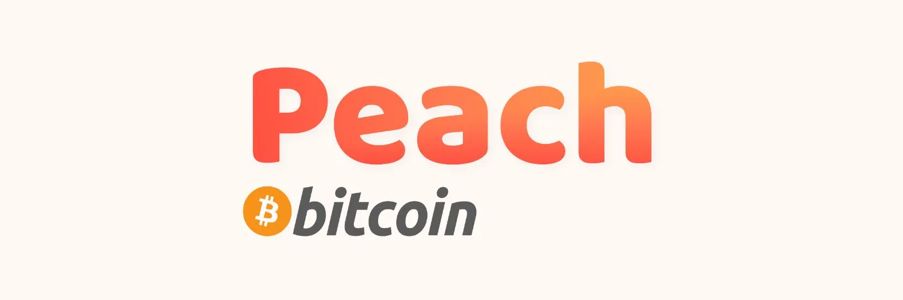

Peach (https://peachbitcoin.com/) on mobiilirakendus, mis ühendab otse Bitcoin'i ostjad ja müüjad. Osta või müü Bitcoin'i peer-to-peer viisil igal ajal ja igal pool. Kasuta oma eelistatud maksemeetodit paljude võimaluste hulgast. Müü oma soovitud hinnaga, kuna peer-to-peer turud on tõelised turud. Bitcoin ilma KYC-ta on parim Bitcoin.

Vaatasime seda lahendust üksikasjalikult läbi BTC 205 kursusel, mida pakub @pivi/\_, siin on õppevideod:

_Artikkel pole veel saadaval, kui teil on see olemas, siis palun jagage._