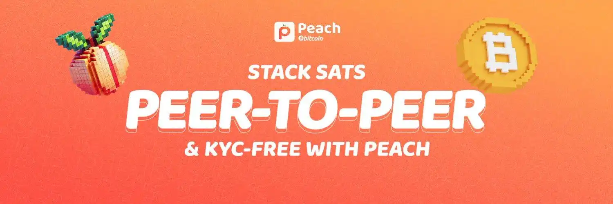

## Introduzione

Gli scambi peer-to-peer (P2P) senza KYC (Know Your Customer) sono essenziali per preservare la riservatezza e l'autonomia finanziaria degli utenti. Permettono di effettuare transazioni dirette tra individui senza la necessità di verificare l'identità, il che è fondamentale per coloro che tengono alla privacy. Per una comprensione più approfondita dei concetti teorici, date un'occhiata al corso BTC204:

https://planb.network/courses/65c138b0-4161-4958-bbe3-c12916bc959c

### 1. Che cos'è Peach?

Peach è una piattaforma di scambio P2P che consente agli utenti di acquistare e vendere bitcoin senza KYC. Offre un'interfaccia intuitiva e funzioni di sicurezza avanzate. Rispetto ad altre soluzioni come Bisq, HodlHodl e Robosat, Peach si distingue per la facilità d'uso e le basse commissioni.

### 2. Privacy e raccolta dati

**Quali informazioni raccoglie Peach?**

Peach si impegna a memorizzare il minimo indispensabile di dati sui propri utenti. Ecco una panoramica dei dati memorizzati sui suoi server:

- Un hash dell'identificativo univoco della vostra applicazione (AdID).
- Un hash dei dati di pagamento.
- Le vostre conversazioni criptate.
- Dati sulle transazioni per garantire che gli utenti anonimi non superino il limite di trading (tipi di metodi di pagamento utilizzati, importi di acquisto e vendita).
- Indirizzi utilizzati per inviare e ricevere dal conto fiduciario.
- Dati di utilizzo (Firebase & Google Analytics), solo con il vostro consenso.

Come promemoria, un hash è un dato reso irriconoscibile, simile alla crittografia. Gli stessi dati produrranno sempre lo stesso hash, rendendo possibile l'individuazione di duplicati senza conoscere i dati originali.

*Per ulteriori informazioni sull'hashing, è possibile seguire questo corso:*

https://planb.network/courses/46b0ced2-9028-4a61-8fbc-3b005ee8d70f

**Chi può vedere i miei dati di pagamento?**

- Solo la controparte può vedere i dettagli del pagamento.
- I dati vengono trasmessi tramite i server Peach, ma sono completamente criptati da un capo all'altro.
- In caso di controversia, i dati di pagamento e la cronologia delle conversazioni saranno visibili al mediatore Peach assegnato.

## Installazione e configurazione

### 1. Installare l'applicazione Peach

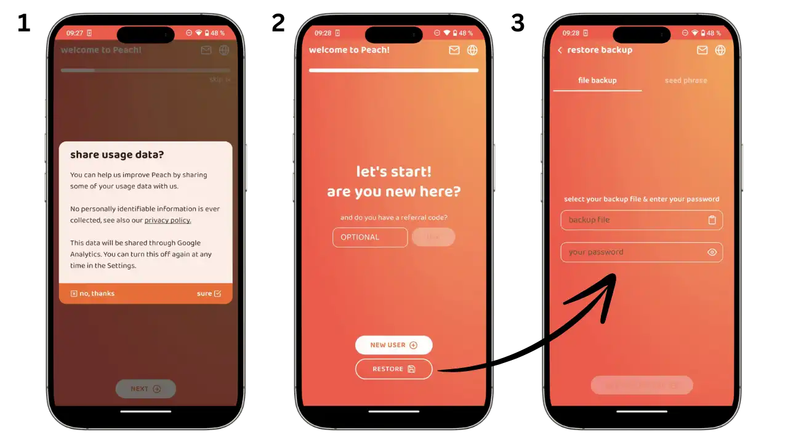

- Scarica l’applicazione da [Peach Bitcoin](https://peachbitcoin.com/fr/quick-start/).
- Segui le istruzioni di installazione sul tuo dispositivo.
- Durante l’installazione ti verrà chiesto se desideri condividere alcuni dati per contribuire al miglioramento dell’applicazione Peach.(immagine 1)
- Nella schermata successiva (immagine 2), hai due opzioni:
-Se sei un nuovo utente, clicca su “Nuovo utente” per creare un nuovo profilo.
- Se hai già un account, utilizza “Ripristina” per recuperare il tuo profilo esistente.
- Se hai un codice referral, puoi inserirlo qui.
- Per ripristinare un account esistente (immagine 3), avrai bisogno di:
- Il file di backup.
- La password per decifrare il file.

### 2. Panoramica delle schermate principali

L'applicazione Peach è organizzata in quattro schermate principali accessibili dalla barra di navigazione inferiore:

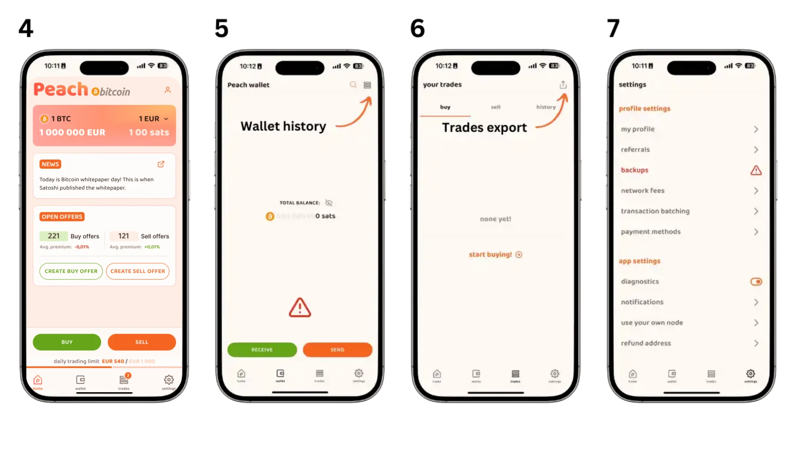

- **Home**: La schermata principale per l'acquisto e la vendita di bitcoin. Qui è possibile creare nuove transazioni e accedere alle offerte disponibili.
- **Portafoglio**: Il vostro portafoglio bitcoin integrato che vi permette di:
 - Controllare il saldo.
 - Ricevere bitcoin.
 - Inviare bitcoin.
 - Visualizzare la cronologia delle transazioni.
- **Commercio** : Il vostro centro di gestione del commercio dove troverete:
 - Le vostre transazioni correnti.
 - Una storia completa dei vostri scambi.
 - Lo stato di ogni transazione.
- **Impostazioni**: L'hub di configurazione dell'account per:
 - Gestire i metodi di pagamento.
 - Configurare i backup.
 - Personalizzare le preferenze.
 - Accesso all'assistenza e al supporto.

### 3. Configurare i metodi di pagamento

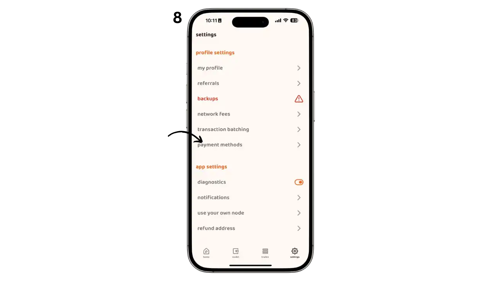

Accedi ai metodi di pagamento tramite la scheda Impostazioni (immagine 8).

**Pagamenti online**

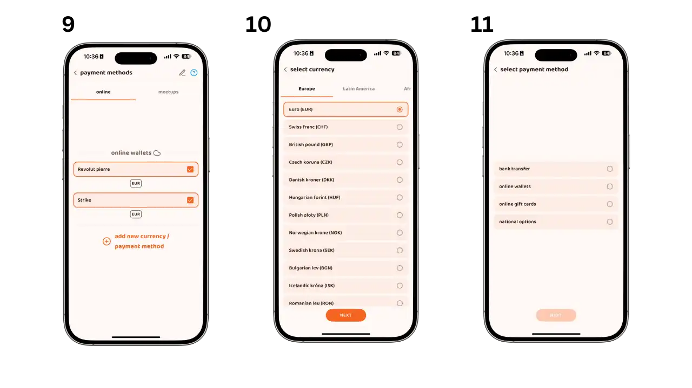

- Clicca sul pulsante per aggiungere un nuovo metodo di pagamento.
- Scegli la tua valuta.
- Seleziona il metodo di pagamento preferito.

*Tipi di metodi di pagamento disponibili:*

***Trasferimenti bancari disponibili: ***

- SEPA (standard o istantaneo).
- Inserisci i dettagli del tuo conto bancario SEPA.

***Portafogli online accettati :***

- Sono disponibili diverse opzioni a seconda del paese (Revolut, Paypal, Wise, Strike, ecc.).
- Segui le istruzioni per inserire i tuoi dati di accesso.
  
***La carta regalo che può essere utilizzata :***

- Amazon.
- Inserisci il paese di emissione della carta e le altre informazioni necessarie.

***Opzioni di pagamento nazionali:***

Sistemi di pagamento specifici per ogni paese :

- Satispay (Italia)
- MB Way (Portogallo)
- Bizum (Spagna)
- Pagamenti più rapidi (Regno Unito)

***Pagamenti di persona:***

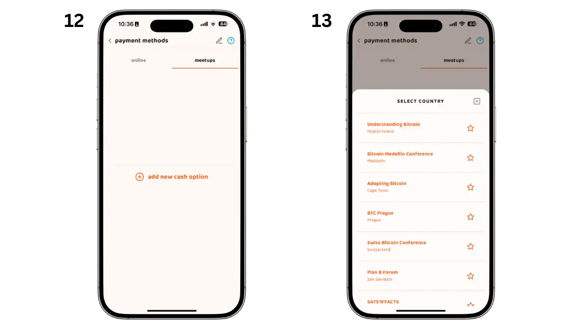

- Seleziona "Incontri".
- Quindi seleziona il proprio incontro dall'elenco.

### Istruzioni per l'uso

- È possibile impostare più metodi di pagamento contemporaneamente.
- Più metodi si aggiungono, più ampia sarà la gamma di offerte a cui si avrà accesso.
- Prima di registrarti, verificare che i dati siano corretti.
- È possibile modificare o eliminare i metodi di pagamento in qualsiasi momento.

**Nota sulla sicurezza**: Le informazioni di pagamento sono criptate e condivise solo con il partner di scambio durante la transazione.

### 4. Come proteggere il vostro portafoglio

**Comprendere il proprio conto Peach**

Un account Peach non è un account tradizionale con login e password. Si tratta di un file archiviato localmente sul tuo telefono, il che significa che Peach non deve conservare i tuoi dati né conoscere la tua identità: il controllo è nelle tue mani. Questo file contiene tutte le tue informazioni, dalle chiavi del tuo wallet Bitcoin ai tuoi dati di pagamento.

Questo approccio garantisce una maggiore riservatezza, ma implica anche una maggiore responsabilità. Perdere il telefono senza un backup significa perdere l'accesso al conto Peach e ai fondi. È quindi fondamentale eseguire il backup di questo file e proteggerlo con una password forte.

**Creare i backup**

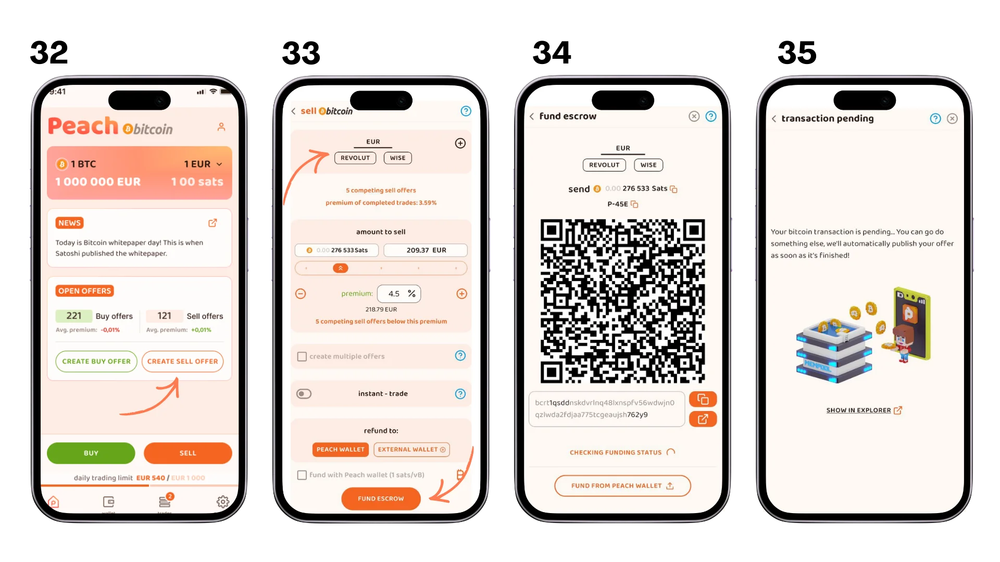

- Accedi alle impostazioni dalla scheda in basso a destra della schermata principale.
- Seleziona l’opzione “backup” nel menu delle impostazioni.
  
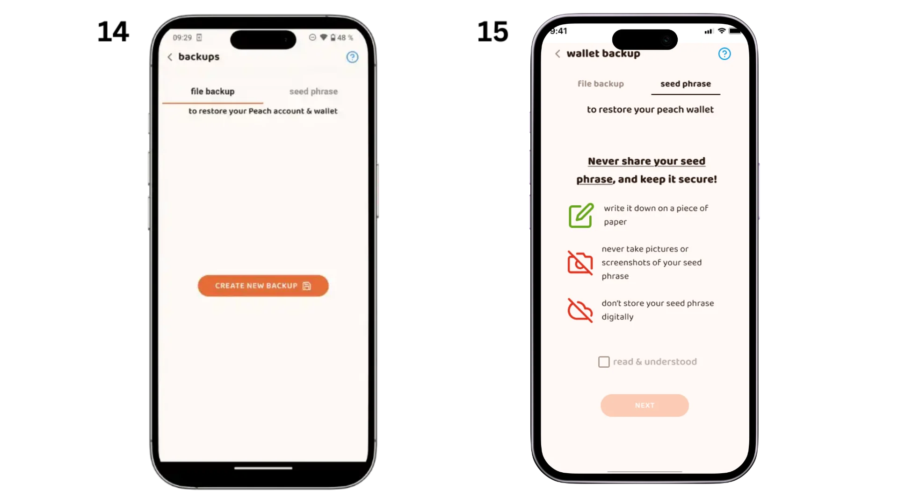

Sono disponibili due tipi di backup:

**Salvare il file del conto (immagine 14)**

- Clicca su “Crea nuovo backup”
- Crea una password sicura per criptare il file di backup.
- Conserva questo file in un luogo sicuro.

Il backup dei file ripristina l'intero account Peach, compresi i file:

- Il tuo portafoglio.
- I tuoi metodi di pagamento.
- La cronologia delle conversazioni.
- I dati di pagamento.
- La cronologia delle transazioni con i dettagli delle controparti.
- 
**Salvataggio della frase di recupero (immagine 15)**

- Segui le istruzioni per visualizzare la tua frase di recupero.
- Scrivi attentamente le parole nell’ordine corretto.
- Conserva questo backup in un luogo sicuro, idealmente diverso dal file dell’account.

La frase di recupero recupera solo:

- Accesso al tuo account.
- I tuoi fondi in bitcoin.
  
Perderete:

- Cronologia delle conversazioni.
- Dati di pagamento.
- Informazioni sulle controparti nella cronologia delle transazioni.

Per una sicurezza ottimale, si consiglia di eseguire entrambi i tipi di backup.

## Comprare e vendere Bitcoin

### 1. Come acquistare Bitcoin

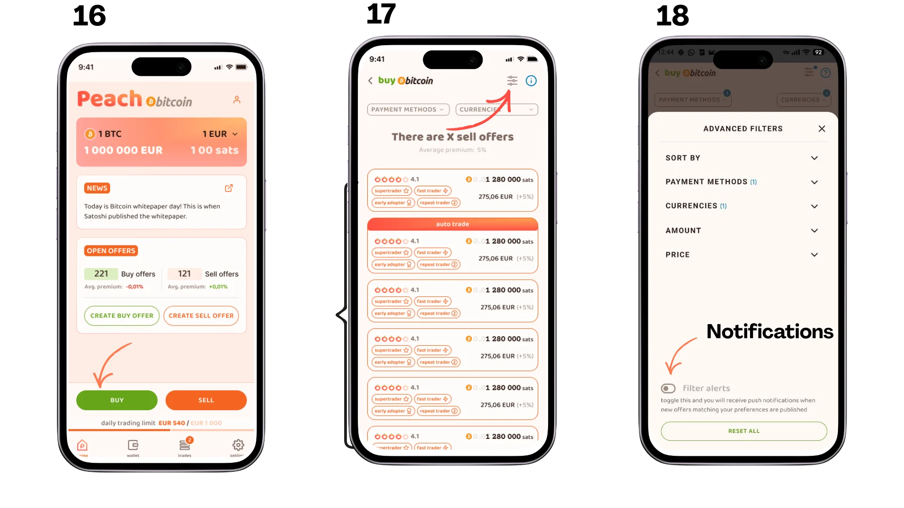

- Nella schermata principale, clicca sul pulsante “Acquista” (immagine 16).
- Configura l’acquisto secondo le tue preferenze (immagine 17).
- Sfoglia l’elenco delle offerte disponibili (immagine 18).
  
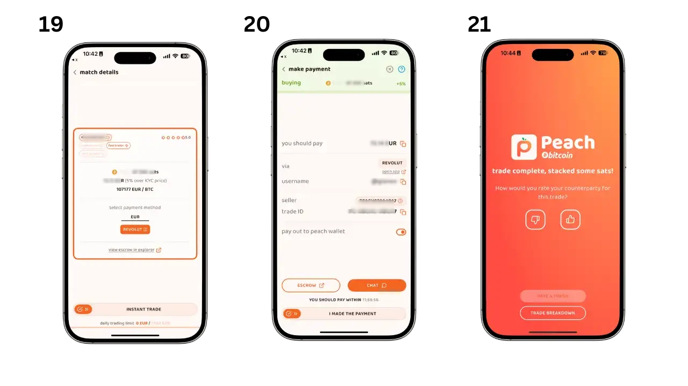

- Seleziona l’offerta più adatta a te (immagine 19).
- Effettua il pagamento con il metodo concordato.
- Conferma il pagamento nell’applicazione e valuta la transazione (immagine 20).
  
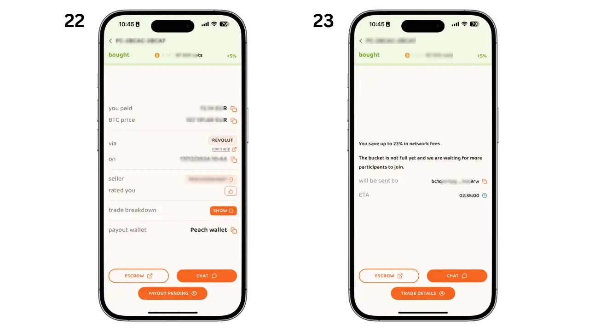

- Monitora lo stato della tua transazione.
- Verifica la conferma di ricezione dei bitcoin.
- I fondi saranno disponibili nel tuo portafoglio Peach.

### 2. Come vendere Bitcoin

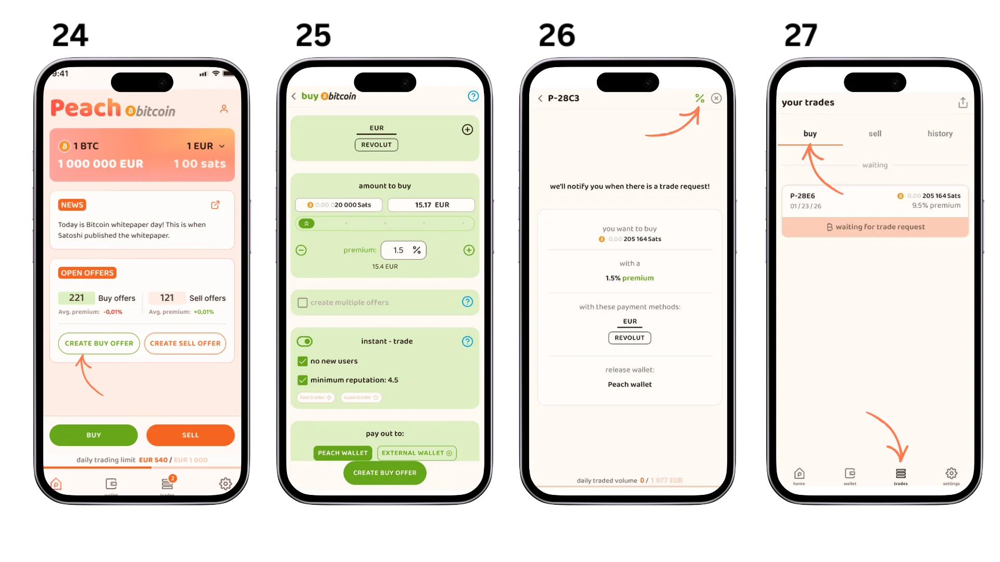

- Configura la tua offerta di vendita (immagine 24).
- Finanzia la transazione inviando i bitcoin all’indirizzo fornito (immagine 25).
- Attendi la conferma della transazione (immagine 26).
- La tua offerta è ora visibile agli acquirenti (immagine 27).

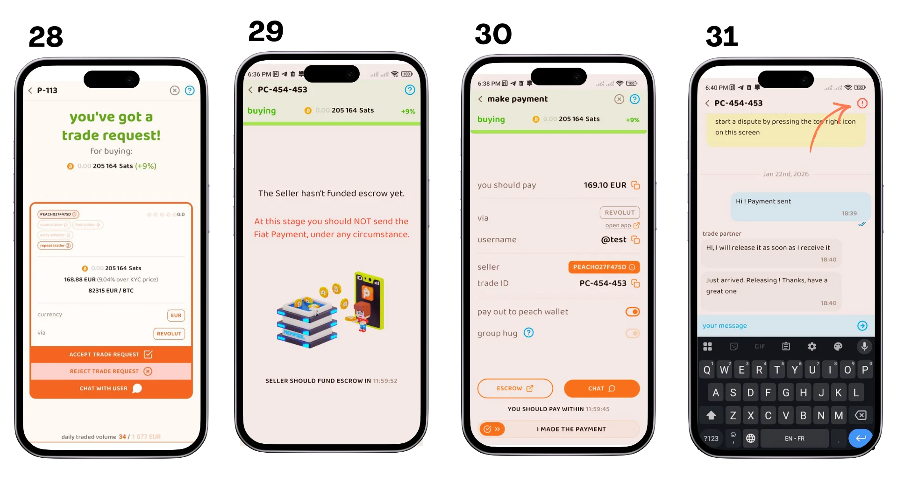

- Monitora lo stato della tua offerta.
- Attendi la conferma del pagamento da parte dell’acquirente.
- Controlla i dettagli della transazione.

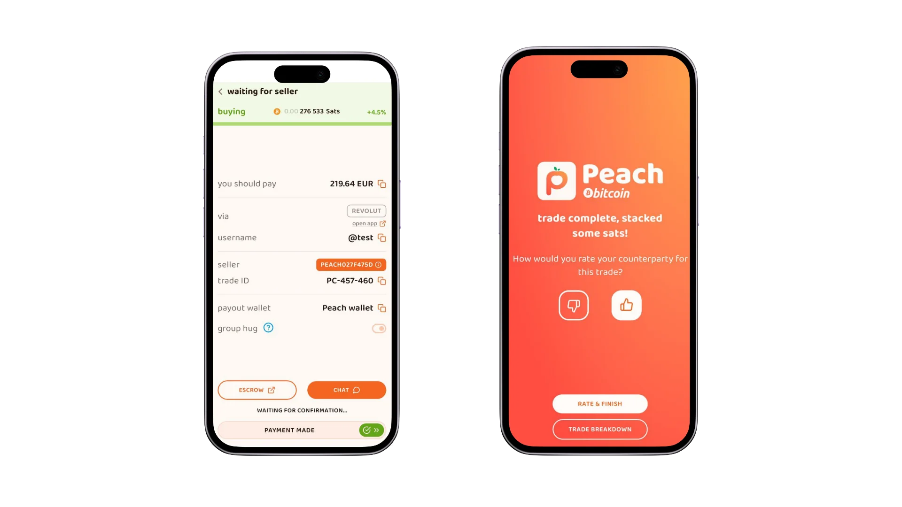

- Controlla lo stato del pagamento.
- Conferma la ricezione del pagamento.
- Valuta la transazione.
- I bitcoin vengono rilasciati automaticamente all’acquirente.
- 
**Consigli per una transazione di successo**

- Rispondi rapidamente ai messaggi della tua controparte.
- Controlla attentamente i dettagli del pagamento.
- Non esitare a utilizzare il servizio di mediazione se riscontri un problema.

**Nota di sicurezza**: Non confermate mai la ricezione di un pagamento prima di averne verificato la ricezione sul vostro conto.

## Vantaggi e svantaggi

### Benefici di Peach

- **Non è richiesto il KYC**: Preserva la riservatezza dell'utente.
- **Nessun accesso ai dati bancari**: Peach non ha accesso alle vostre coordinate bancarie o alla vostra identità.
- **Interfaccia intuitiva**: Facile da usare per gli utenti intermedi.
- **Open Source**: Il codice sorgente è pubblico e verificabile dalla comunità.

### Svantaggi di Peach

- **Liquidità limitata**: Volume di trading inferiore rispetto alle piattaforme più consolidate.
- **Rischio normativo**: L'applicazione è gestita da una società svizzera. È quindi soggetta alle normative svizzere, che potrebbero evolvere e potenzialmente censurare l'applicazione.

## Risorse utili

- Video esplicativo in francese: [YouTube](https://youtu.be/ziwhv9KqVkM)
- Guida rapida: [Peach Bitcoin](https://peachbitcoin.com/fr/quick-start/)
