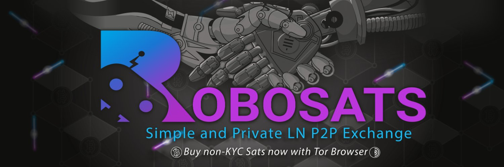

# Robosats

RoboSats est un moyen facile d'échanger privément des Bitcoins contre des devises nationales. Il simplifie l'expérience pair-à-pair et utilise des factures Lightning Hold pour réduire au minimum les besoins en garde et en confiance.

Site:https://unsafe.robosats.com/ 
GitHub: https://github.com/RoboSats/robosats

Nous regardons en detail cette solution dans BTC 205 offert par @pivi_, voici les videos tutoriels: 

