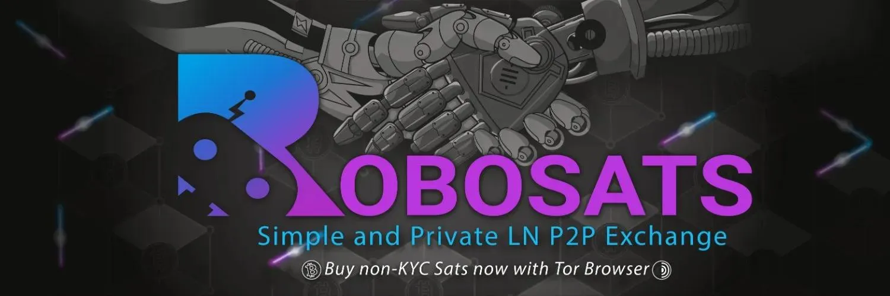

RoboSats (https://learn.robosats.com/) on lihtne viis privaatselt vahetada Bitcoini riiklike valuutade vastu. See lihtsustab peer-to-peer kogemust ja kasutab välgu hoidmise arveid, et minimeerida hoiustamise ja usalduse nõudeid.

## Juhend

> See juhend on pärit Bitocin Q&A-st (https://bitcoiner.guide/robosats/). Kogu au kuulub temale, toetage teda seal (https://bitcoiner.guide/contribute); BitcoinQ&A on samuti bitcoin mentor. Võtke temaga ühendust mentorluse saamiseks!

RoboSats - Lihtne ja privaatne Lightningil põhinev P2P vahetus

## Enne alustamist

### Asjad, mida pead teadma

| Žargoon       | Definitsioon                                                                                                                                                                                     |
| ------------ | ---------------------------------------------------------------------------------------------------------------------------------------------------------------------------------------------- |
| Robot        | Sinu automaatselt genereeritud privaatne kauplemisidentiteet. Ära kasuta sama robotit rohkem kui üks kord, kuna see võib vähendada sinu privaatsust.                                                             |
| Token        | Juhuslikest tähemärkidest koosnev string, mida kasutatakse sinu unikaalse roboti genereerimiseks.                                                                                                                              |
| Maker        | Kasutaja, kes loob pakkumise Bitcoini ostmiseks või müümiseks.                                                                                                                                            |
| Taker        | Kasutaja, kes võtab teise kasutaja pakkumise Bitcoini ostmiseks või müümiseks.                                                                                                                        |
| Bond         | Mõlema osapoole poolt kaubanduse õiglaseks ja osa kaubanduse lõpetamiseks lukustatud Bitcoini summa. Bondid on tavaliselt 3% kogu kaubanduse summast ja neid toetavad Hodl Arved. |
| Trade Escrow | Müüja poolt kasutatav meetod kaubanduse Bitcoini summa hoidmiseks, kasutades samuti Hodl Arveid.                                                                                              |
| Tasud         | RoboSats võtab kaubanduse summast 0.2%, mis jaguneb mõlema makeri ja takeri vahel. Taker maksab 0.175% ja maker maksab 0.025%.                                                       |

## Asjad, mis sul peavad olema

### Lightning Rahakott

RoboSats on Lightningi põhine, seega on sul vaja Lightningi rahakotti, et rahastada bondi ja saada ostetud satse ostjana. Rahakoti valimisel tuleks olla ettevaatlik, kuna RoboSatsi toimimiseks kasutatava tehnoloogia tõttu ei ole kõik rahakotid ühilduvad.

Kui sa jooksutad oma sõlme, on Zeus kaugelt parim valik. Kui sul pole oma sõlme, soovitaksin ma Phoenixit, mis on platvormideülene mobiilne rahakott lihtsa seadistusega ja juurdepääsuga Lightningile. Phoenixi kasutati selle juhendi koostamisel.

### Natuke Bitcoini

Ostjad ja müüjad peavad enne kauplemise alustamist rahastama bondi. See on tavaliselt väga väike summa (~3% kaubanduse summast), kuid on siiski eeltingimus.

Kasutades RoboSatsi oma esimeste satside ostmiseks? Miks mitte paluda sõbral laenata sulle vajalik väike summa alustamiseks!? Kui sa oled üksi, siis siin on mõned teised suurepärased võimalused saada mõned noKYC satsid alustamiseks.

### Juurdepääs RoboSatsile

Ilmselgelt on sul vaja juurdepääsu RoboSatsile! On neli peamist viisi, kuidas seda teha:

1. Tor brauseri kaudu (Soovitatud!)
2. Tavalise veebibrauseri kaudu (Ei soovitata!)
3. Android APK kaudu
4. Sinu enda klient

Kui sa oled Tor brauseriga uus, saa rohkem teada ja laadi see alla [siit](https://www.torproject.org/download/).
Kiire märkus iOS-i kasutajatele, kes soovivad pääseda ligi RoboSats'ile Tor'i kaudu oma telefonidest. 'Onion Browser' ei ole Tor Browser. Kasutage selle asemel Orbot + Safari ja Orbot + DuckDuckGo.

## Bitcoini ostmine

Järgnevad sammud viidi läbi mai 2023, kasutades versiooni 0.5.0, millele pääses ligi Tor brauseri kaudu. Sammud peaksid olema identsed kasutajatele, kes pääsevad RoboSats'ile ligi Android APK kaudu.

Kirjutamise hetkel on RoboSats veel aktiivses arendusjärgus, seega võib liides tulevikus veidi muutuda, kuid kauplemise lõpuleviimiseks vajalikud põhisammud peaksid jääma suures osas muutumatuks.

> Kui laadite esimest korda RoboSats'i, kohtate seda avalehte. Klõpsake Start.

Genereerige oma token ja hoidke seda turvalises kohas nagu krüpteeritud märkmete rakendus või paroolihaldur. Seda tokenit saab kasutada ajutise Robot ID taastamiseks, juhul kui teie brauser või rakendus kaubavahetuse ajal sulgub.

Tutvuge oma uue Robot identiteediga, seejärel klõpsake Continue.

Klõpsake Offers, et sirvida tellimuste raamatut. Lehe ülaosas saate seejärel filtreerida oma eelistuste järgi. Veenduge, et märkate tagatisprotsente ja preemiat keskmise vahetuskursi üle.

- Valige Buy
- Valige oma valuuta
- Valige oma maksemeetod(id)

> Klõpsake pakkumisel, mille soovite võtta. Sisestage summa (teie valitud fiat-valuutas), mida soovite müüjalt osta, seejärel kontrollige lõplikult detaile ja klõpsake Take Order.

Kui müüja ei ole võrgus (tähistatud punase täpiga nende profiilipildil), näete hoiatust, et kaubavahetus võib võtta tavapärasest kauem aega. Kui jätkate ja müüja ei toimi õigeaegselt, kompenseeritakse teile 50% nende tagatissumma eest teie raisatud aja eest.

Järgmisena peate lukustama oma kaubavahetuse tagatise, makstes ekraanil oleva arve. See on hoiuarve, mis külmutab teie rahakotis. See võetakse arvelt maha ainult juhul, kui te ei täida oma osa kaubavahetusest.

Oma Lightning Wallet'is skannige QR-kood ja makske arve.

Järgmisena genereerige oma Lightning Wallet'is arve näidatud summa jaoks ja kleepige see ettenähtud kohta.

Oodake, kuni müüja lukustab oma kaubavahetuse summa. Kui see toimub, liigub RoboSats automaatselt järgmisse etappi, kus avaneb vestlusaken. Öelge Tere ja küsige müüjalt nende fiat-makseteabe. Kui see on antud, saatke makse valitud meetodil ja kinnitage see RoboSats'is. Kogu vestlus RoboSats'is on PGP krüpteeritud, mis tähendab, et sõnumeid saavad lugeda ainult teie ja teie kaubavahetuse partner.

Kui müüja kinnitab makse laekumist, vabastab RoboSats automaatselt makse varem esitatud arve alusel.

Kui arve on makstud, on kaubavahetus lõpetatud ja teie tagatis vabastatud. Seejärel näete kaubavahetuse kokkuvõtet.

Kontrollige oma Lightning Wallet'it, et kinnitada, et satoshid on saabunud.

## Lisafunktsioonid

Lisaks ilmsetele Bitcoini ostmisele ja müümisele on RoboSats'il mõned muud funktsioonid, millest peaksite teadma.
Robot Garage
Soovite korraga mitut tehingut teha, kuid ei soovi kasutada sama identiteeti kõigi nende jaoks? Pole probleemi! Klõpsake vahekaardil Robot, genereerige täiendav Robot ja looge või võtke oma järgmine tellimus.

### Tellimuste loomine

Lisaks kellegi teise pakkumise vastuvõtmisele saate luua ka oma pakkumise ja oodata, kuni teine Robot teie juurde tuleb.

- Avage loomise leht.
- Määrake, kas teie tellimus on Bitcoini ostmiseks või müümiseks.
- Sisestage summa ja valuuta, millega soovite osta/müüa.
- Sisestage makseviis(id), mida olete nõus kasutama.
- Sisestage turuhinnast kõrgem %, mida olete nõus aktsepteerima. Pange tähele, et see võib olla negatiivne number, et pakkuda allahindlust praeguse turuhinna suhtes.
- Klõpsake nuppu Loo Tellimus.
- Tasuge Lightningi arve, et lukustada oma Maker Bond.
- Teie tellimus on nüüd aktiivne. Istuge tagasi ja oodake, kuni keegi selle vastu võtab.

### On-chain väljamaksed

RoboSats keskendub Lightningile, kuid ostjatel on võimalus saada oma satse on-chain Bitcoini aadressile. Ostjad saavad selle valiku valida pärast oma sideme lukustamist. On-chain valimisel näeb ostja tasude ülevaadet. Selle teenuse lisatasud hõlmavad järgmist:

- Vahetustasu, mida kogub RoboSats - See tasu on dünaamiline ja sõltub sellest, kui hõivatud on Bitcoin võrk.
- Kaevandamistasu väljamaksetehingu eest - Ostja saab seda konfigureerida.

### P2P vahetused

RoboSats võimaldab kasutajatel vahetada satse oma Lightning Walletisse või sellest välja. Lihtsalt klõpsake pakkumiste lehe ülaosas vahetamise nuppu, et näha praeguseid vahetuspakkumisi.

‘Swap In’ pakkumise ostjana saadate on-chain Bitcoini peerile ja saate tagasi satse, millest on maha arvatud reklaamitud tasud ja/või preemiad, oma Lightning Walletisse. ‘Swap Out’ pakkumise ostjana saadate satse Lightningi kaudu ja saate Bitcoini, millest on maha arvatud kõik tasud ja/või preemiad, oma on-chain aadressile. Samourai või Sparrow Walleti kasutajad saavad kasutada ka Stowaway funktsiooni vahetuse lõpuleviimiseks.

RoboSatsi vahetuspakkumised võivad hõlmata ka Bitcoini pegitud alternatiive, sealhulgas RBTC, LBTC ja WBTC. Nende tokenitega suheldes peaksite olema äärmiselt ettevaatlik, kuna kõigil neil on erinevad kompromissid. Pegitud Bitcoin ei ole Bitcoin!

### Jooksutage oma RoboSats klienti

Umbrel, Citadel ja Start9 sõlme kasutajad saavad oma sõlmele otse installida oma RoboSats kliendi. Selle tegemise eelised on loetletud järgmiselt:

- Oluliselt kiiremad laadimisajad.
- Turvalisem: kontrollite, millist RoboSatsi kliendirakendust te jooksutate.
- Juurdepääs RoboSatsile turvaliselt mis tahes brauserist / seadmest. Kui olete oma kohalikus võrgus või kasutate VPN-i, pole TOR-i kasutamine vajalik: teie sõlme tagaosa hoolitseb anonüümseks jäämiseks vajaliku torifitseerimise eest.
- Võimaldab kontrollida, millise P2P turukoordinaatoriga ühendute (vaikimisi robosats6tkf3eva7x2voqso3a5wcorsnw34jveyxfqi2fu7oyheasid.onion)

## KKK

### Kas ma võin sattuda pettuse ohvriks?
Kui olete ostja ja olete oma kaubanduse osa eest saatnud vajaliku fiat-raha, kuid müüja ei vabasta teile sats'e, siis võite avada vaidluse. Kui selle vaidlusprotsessi käigus suudate tõestada RoboSats'i vahekohtunikele, et saatsite fiat-raha, vabastatakse müüja panditud vahendid ja nende kaubanduse tagatis teile. Kuidas ma saan kaubanduse tühistada?

Kaubanduse saate tühistada pärast oma tagatise postitamist, klõpsates kaubandusmenüüs nuppu Collaborative Cancel. Kui teie kaubanduspartner on nõus tühistama, ei kaasne sellega mingeid tasusid. Kuid kui teie kaubanduspartner soovib kaubandust lõpule viia ja te tühistate sellest hoolimata, kaotate oma kaubanduse tagatise.

### Kas RoboSats töötab ‘X’ maksemeetodiga?

RoboSats'is ei ole maksemeetoditele piiranguid. Kui te ei näe oma soovitud meetodiga pakkumisi, looge selle kasutamiseks oma pakkumine!

### Mida RoboSats minu kohta õpib, kui ma seda kasutan?

Eeldusel, et kasutate RoboSats'i Tor'i või Androidi rakenduse kaudu, ei õpi see teie kohta midagi! Lugege siit lähemalt.

- Tor kaitseb teie võrguprivatust.
- PGP krüpteering hoiab teie kaubandusvestluse privaatsena.
- Kontode puudumine tähendab ühte Robotit kaubanduse kohta. See tähendab, et RoboSats ei saa seostada mitut kaubandust ühe isikuga.

Siiski on mõned mööndused! Lightning on saatjana üsna privaatne, kuid mitte vastuvõtjana. Kui võtate vastu omaenda Lightningi sõlme kaudu, jagatakse teie sõlme ID teie arvetes. See sõlme ID annab kõigile, kes sellest teadlikud on, lähtepunkti, et proovida seostada teie ahelasisest tegevust. See kehtib ka siis, kui kasutaja otsustab oma kaubanduse vastu võtta ahelasisese väljamakse kaudu.

Selle leevendamiseks võivad kasutajad valida lahenduse, nagu Proxy Wallet Lightningi jaoks või Coinjoin ahelasiseste jaoks.

### Föderatsioon

Praegu on olemas üks RoboSats'i koordinaator, mida haldab RoboSats'i arendusmeeskond. Bitcoinis muudab igasugune tsentraliseerimine valitsuste või regulaatorite jaoks, kes ei pruugi konkreetset teenust heaks kiita, lihtsamaks sihtmärgiks.

Kuna RoboSats on avatud lähtekoodiga projekt, võib igaüks võtta koodi ja hakata oma koordinaatorit käitama. Kuigi see hajutab riski mõnevõrra ühest sihtmärgist eemale, killustab see ka juba niigi hõreda likviidsusturu.

RoboSats'i meeskond on sellest teadlik ja on alustanud tööd föderatiivse mudeli kallal. Lõppkasutajana ei tohiks see kaubanduse voo ülalpool näidatut palju muuta, kuid teile ilmub lisavaateid või ekraane, et lisada või eemaldada erinevaid koordinaatoreid, mis tekivad.

JUHENDI LÕPP
https://bitcoiner.guide/robosats/